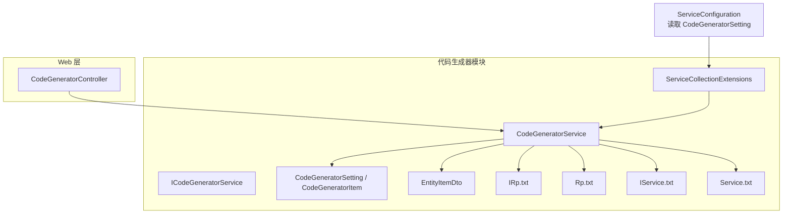
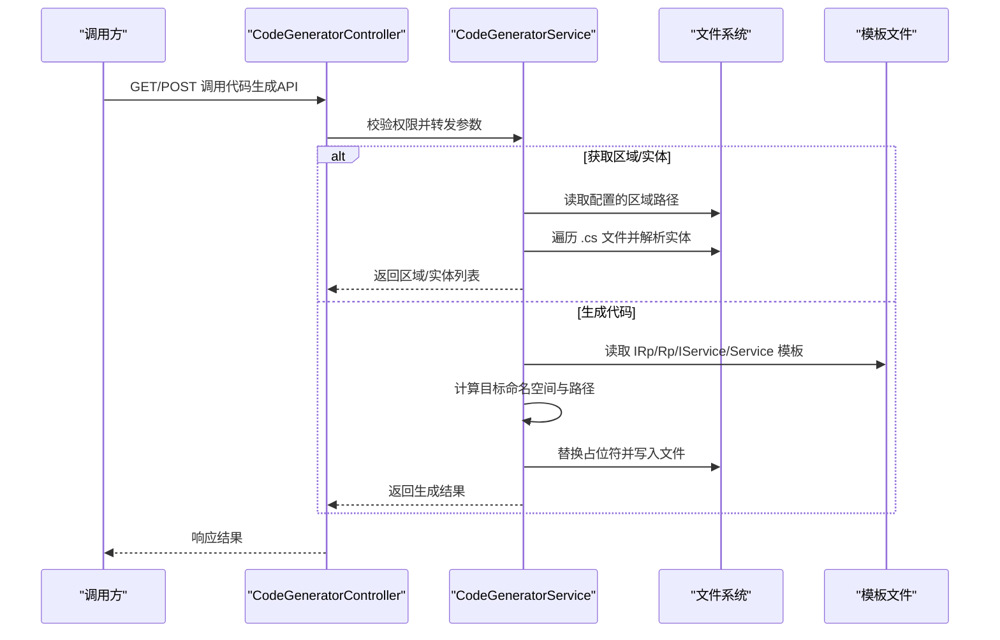
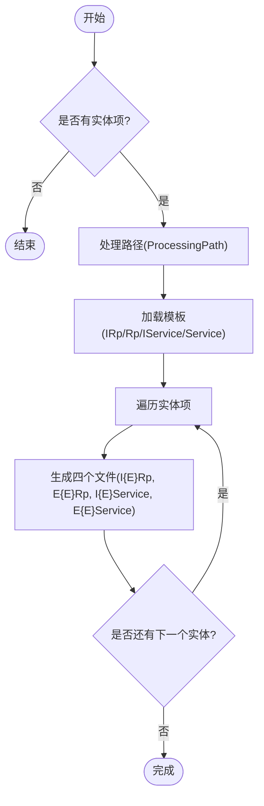
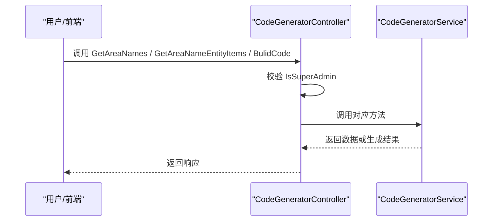
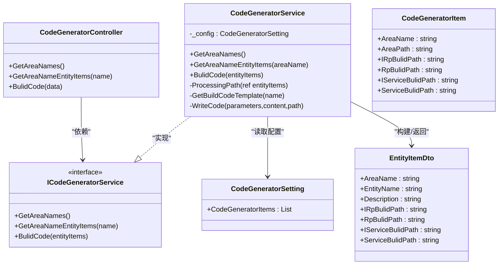

# 代码生成器

<cite>
**本文引用的文件**
- [CodeGeneratorService.cs](file://Kevin/kevin.Module/kevin.CodeGenerator/CodeGeneratorService.cs)
- [ICodeGeneratorService.cs](file://Kevin/kevin.Module/kevin.CodeGenerator/ICodeGeneratorService.cs)
- [ServiceCollectionExtensions.cs](file://Kevin/kevin.Module/kevin.CodeGenerator/ServiceCollectionExtensions.cs)
- [CodeGeneratorSetting.cs](file://Kevin/kevin.Module/kevin.CodeGenerator/Dto/CodeGeneratorSetting.cs)
- [EntityItemDto.cs](file://Kevin/kevin.Module/kevin.CodeGenerator/Dto/EntityItemDto.cs)
- [IRp.txt](file://Kevin/kevin.Module/kevin.CodeGenerator/BuildCodeTemplate/IRp.txt)
- [Rp.txt](file://Kevin/kevin.Module/kevin.CodeGenerator/BuildCodeTemplate/Rp.txt)
- [IService.txt](file://Kevin/kevin.Module/kevin.CodeGenerator/BuildCodeTemplate/IService.txt)
- [Service.txt](file://Kevin/kevin.Module/kevin.CodeGenerator/BuildCodeTemplate/Service.txt)
- [CodeGeneratorController.cs](file://Kevin/Kevin.Web.Basics/Controllers/CodeGeneratorController.cs)
- [ServiceConfiguration.cs](file://Kevin/Kevin.Web.Basics/Extensions/ServiceConfiguration.cs)
</cite>

## 目录
1. [简介](#简介)
2. [项目结构](#项目结构)
3. [核心组件](#核心组件)
4. [架构总览](#架构总览)
5. [详细组件分析](#详细组件分析)
6. [依赖关系分析](#依赖关系分析)
7. [性能考虑](#性能考虑)
8. [故障排除指南](#故障排除指南)
9. [结论](#结论)
10. [附录](#附录)

## 简介
本文件为代码生成器的完整使用文档，面向配置、模板定制、批量生成与二次开发等场景。该代码生成器通过扫描指定区域的实体类（基于特性标注），按模板批量生成仓储接口、仓储实现、服务接口与服务实现等基础代码，并提供 Web API 供前端或外部系统调用。

## 项目结构
代码生成器位于 kevin.CodeGenerator 模块中，包含服务实现、DTO、模板文件以及 DI 扩展；Web 层提供控制器暴露 API；应用启动时通过 ServiceConfiguration 注册并注入配置。

图表来源
- [CodeGeneratorController.cs:1-76](file://Kevin/Kevin.Web.Basics/Controllers/CodeGeneratorController.cs#L1-L76)
- [CodeGeneratorService.cs:1-222](file://Kevin/kevin.Module/kevin.CodeGenerator/CodeGeneratorService.cs#L1-L222)
- [ServiceCollectionExtensions.cs:1-16](file://Kevin/kevin.Module/kevin.CodeGenerator/ServiceCollectionExtensions.cs#L1-L16)
- [CodeGeneratorSetting.cs:1-45](file://Kevin/kevin.Module/kevin.CodeGenerator/Dto/CodeGeneratorSetting.cs#L1-L45)
- [EntityItemDto.cs:1-32](file://Kevin/kevin.Module/kevin.CodeGenerator/Dto/EntityItemDto.cs#L1-L32)
- [IRp.txt:1-11](file://Kevin/kevin.Module/kevin.CodeGenerator/BuildCodeTemplate/IRp.txt#L1-L11)
- [Rp.txt:1-16](file://Kevin/kevin.Module/kevin.CodeGenerator/BuildCodeTemplate/Rp.txt#L1-L16)
- [IService.txt:1-31](file://Kevin/kevin.Module/kevin.CodeGenerator/BuildCodeTemplate/IService.txt#L1-L31)
- [Service.txt:1-88](file://Kevin/kevin.Module/kevin.CodeGenerator/BuildCodeTemplate/Service.txt#L1-L88)

章节来源
- [CodeGeneratorController.cs:1-76](file://Kevin/Kevin.Web.Basics/Controllers/CodeGeneratorController.cs#L1-L76)
- [ServiceConfiguration.cs:258-260](file://Kevin/Kevin.Web.Basics/Extensions/ServiceConfiguration.cs#L258-L260)

## 核心组件
- ICodeGeneratorService：定义获取区域列表、获取某区域实体项、批量生成代码的接口。
- CodeGeneratorService：实现扫描实体、处理路径、加载模板、替换占位符并写入目标文件的核心逻辑。
- CodeGeneratorSetting / CodeGeneratorItem：描述“区域”与对应实体路径、各层生成路径的配置模型。
- EntityItemDto：表示一个待生成的实体项及其目标命名空间/路径信息。
- 模板文件：IRp.txt、Rp.txt、IService.txt、Service.txt，定义了四种基础代码的结构与占位符。
- ServiceCollectionExtensions：将 CodeGeneratorService 注册到 DI，并支持 Action<CodeGeneratorSetting> 注入配置。
- CodeGeneratorController：对外暴露 REST API，受权限控制，仅超级管理员可操作。

章节来源
- [ICodeGeneratorService.cs:1-27](file://Kevin/kevin.Module/kevin.CodeGenerator/ICodeGeneratorService.cs#L1-L27)
- [CodeGeneratorService.cs:1-222](file://Kevin/kevin.Module/kevin.CodeGenerator/CodeGeneratorService.cs#L1-L222)
- [CodeGeneratorSetting.cs:1-45](file://Kevin/kevin.Module/kevin.CodeGenerator/Dto/CodeGeneratorSetting.cs#L1-L45)
- [EntityItemDto.cs:1-32](file://Kevin/kevin.Module/kevin.CodeGenerator/Dto/EntityItemDto.cs#L1-L32)
- [ServiceCollectionExtensions.cs:1-16](file://Kevin/kevin.Module/kevin.CodeGenerator/ServiceCollectionExtensions.cs#L1-L16)
- [CodeGeneratorController.cs:1-76](file://Kevin/Kevin.Web.Basics/Controllers/CodeGeneratorController.cs#L1-L76)

## 架构总览
下图展示了从 Web API 请求到代码生成的端到端流程，包括配置加载、实体扫描、模板渲染与文件落盘。

图表来源
- [CodeGeneratorController.cs:30-73](file://Kevin/Kevin.Web.Basics/Controllers/CodeGeneratorController.cs#L30-L73)
- [CodeGeneratorService.cs:17-171](file://Kevin/kevin.Module/kevin.CodeGenerator/CodeGeneratorService.cs#L17-L171)
- [CodeGeneratorService.cs:179-217](file://Kevin/kevin.Module/kevin.CodeGenerator/CodeGeneratorService.cs#L179-L217)

## 详细组件分析

### 配置与注册
- 配置模型 CodeGeneratorSetting 包含多个 CodeGeneratorItem，每个 Item 定义：
  - AreaName：区域名称
  - AreaPath：数据库实体类所在路径（相对或绝对）
  - IRpBulidPath / RpBulidPath / IServiceBulidPath / ServiceBulidPath：各层代码生成路径（命名空间形式）
- 在 ServiceConfiguration 中通过 AddKevinCodeGenerator 注入配置，并从配置节 CodeGeneratorSetting 读取。
- CodeGeneratorService 通过 IOptionsMonitor<CodeGeneratorSetting> 动态读取当前配置。

章节来源
- [CodeGeneratorSetting.cs:1-45](file://Kevin/kevin.Module/kevin.CodeGenerator/Dto/CodeGeneratorSetting.cs#L1-L45)
- [ServiceConfiguration.cs:258-260](file://Kevin/Kevin.Web.Basics/Extensions/ServiceConfiguration.cs#L258-L260)
- [ServiceCollectionExtensions.cs:9-13](file://Kevin/kevin.Module/kevin.CodeGenerator/ServiceCollectionExtensions.cs#L9-L13)
- [CodeGeneratorService.cs:11-16](file://Kevin/kevin.Module/kevin.CodeGenerator/CodeGeneratorService.cs#L11-L16)

### 实体扫描与路径处理
- GetAreaNames：返回所有已配置的 AreaName。
- GetAreaNameEntityItems：根据 AreaName 定位 AreaPath，递归扫描 .cs 文件，解析带有表特性的类名与表名，构造 EntityItemDto 列表。
- ProcessingPath：根据实体源文件所在子目录，自动拼接各层生成路径（保持与实体相同的层级结构）。
- 注意：若配置的区域路径不存在，会抛出异常提示配置错误。

章节来源
- [CodeGeneratorService.cs:17-72](file://Kevin/kevin.Module/kevin.CodeGenerator/CodeGeneratorService.cs#L17-L72)
- [CodeGeneratorService.cs:78-114](file://Kevin/kevin.Module/kevin.CodeGenerator/CodeGeneratorService.cs#L78-L114)

### 模板与占位符
- 模板位置：BuildCodeTemplate 目录下四个 txt 文件。
- 支持的占位符：
  - %entityName%：实体名（去除前缀 T）
  - %entityNamespace%：实体所在命名空间
  - %namespacePath%：目标命名空间（用于 using/namespace）
  - %iRpBulidNamespace%：仓储接口命名空间（用于 using）
  - %iServiceBulidNamespace%：服务接口命名空间（用于 using）
- 模板内容示例（以占位符形式）：
  - IRp.txt：定义 I{Entity}Rp : IRepository<T{Entity}, long>
  - Rp.txt：定义 {Entity}Rp : Repository<T{Entity}, long>, I{Entity}Rp
  - IService.txt：定义 I{Entity}Service : IBaseService，包含分页、新增编辑、删除方法
  - Service.txt：定义 {Entity}Service : BaseService, I{Entity}Service，实现上述方法

章节来源
- [IRp.txt:1-11](file://Kevin/kevin.Module/kevin.CodeGenerator/BuildCodeTemplate/IRp.txt#L1-L11)
- [Rp.txt:1-16](file://Kevin/kevin.Module/kevin.CodeGenerator/BuildCodeTemplate/Rp.txt#L1-L16)
- [IService.txt:1-31](file://Kevin/kevin.Module/kevin.CodeGenerator/BuildCodeTemplate/IService.txt#L1-L31)
- [Service.txt:1-88](file://Kevin/kevin.Module/kevin.CodeGenerator/BuildCodeTemplate/Service.txt#L1-L88)
- [CodeGeneratorService.cs:137-163](file://Kevin/kevin.Module/kevin.CodeGenerator/CodeGeneratorService.cs#L137-L163)

### 批量代码生成机制
- BulidCode：对传入的 EntityItemDto 列表执行批量生成：
  - 预处理路径（ProcessingPath）
  - 读取四类模板
  - 为每个实体生成四个文件：I{Entity}Rp.cs、{Entity}Rp.cs、I{Entity}Service.cs、{Entity}Service.cs
  - 目标路径由配置中的命名空间转换为物理路径，并保留与实体相同的子目录结构
  - WriteCode：先创建目录，再检测同名文件是否存在，存在则跳过，否则写入 UTF-8 编码的文件

图表来源
- [CodeGeneratorService.cs:116-171](file://Kevin/kevin.Module/kevin.CodeGenerator/CodeGeneratorService.cs#L116-L171)
- [CodeGeneratorService.cs:189-217](file://Kevin/kevin.Module/kevin.CodeGenerator/CodeGeneratorService.cs#L189-L217)

章节来源
- [CodeGeneratorService.cs:116-171](file://Kevin/kevin.Module/kevin.CodeGenerator/CodeGeneratorService.cs#L116-L171)
- [CodeGeneratorService.cs:189-217](file://Kevin/kevin.Module/kevin.CodeGenerator/CodeGeneratorService.cs#L189-L217)

### Web API 与权限控制
- 路由：/api/CodeGenerator
- 接口：
  - GET /GetAreaNames：获取区域列表
  - GET /GetAreaNameEntityItems?name=xxx：获取某区域下的实体项
  - POST /BulidCode：批量生成代码
- 权限：仅超级管理员可调用，非管理员抛出自适应友好异常。

图表来源
- [CodeGeneratorController.cs:30-73](file://Kevin/Kevin.Web.Basics/Controllers/CodeGeneratorController.cs#L30-L73)

章节来源
- [CodeGeneratorController.cs:1-76](file://Kevin/Kevin.Web.Basics/Controllers/CodeGeneratorController.cs#L1-L76)

## 依赖关系分析
- CodeGeneratorController 依赖 ICodeGeneratorService
- CodeGeneratorService 依赖：
  - CodeGeneratorSetting（通过 IOptionsMonitor）
  - 文件系统（Directory/File/Regex）
  - 模板文件（IRp/Rp/IService/Service 文本）
- ServiceCollectionExtensions 负责将 ICodeGeneratorService 注册为 Scoped，并绑定配置
- ServiceConfiguration 在应用启动时读取配置节 CodeGeneratorSetting 并注入

图表来源
- [CodeGeneratorController.cs:1-76](file://Kevin/Kevin.Web.Basics/Controllers/CodeGeneratorController.cs#L1-L76)
- [ICodeGeneratorService.cs:1-27](file://Kevin/kevin.Module/kevin.CodeGenerator/ICodeGeneratorService.cs#L1-L27)
- [CodeGeneratorService.cs:1-222](file://Kevin/kevin.Module/kevin.CodeGenerator/CodeGeneratorService.cs#L1-L222)
- [CodeGeneratorSetting.cs:1-45](file://Kevin/kevin.Module/kevin.CodeGenerator/Dto/CodeGeneratorSetting.cs#L1-L45)
- [EntityItemDto.cs:1-32](file://Kevin/kevin.Module/kevin.CodeGenerator/Dto/EntityItemDto.cs#L1-L32)

章节来源
- [ServiceCollectionExtensions.cs:1-16](file://Kevin/kevin.Module/kevin.CodeGenerator/ServiceCollectionExtensions.cs#L1-L16)
- [ServiceConfiguration.cs:258-260](file://Kevin/Kevin.Web.Basics/Extensions/ServiceConfiguration.cs#L258-L260)

## 性能考虑
- 实体扫描：使用 Directory.GetFiles 递归扫描 .cs 文件，并在内存中用正则匹配类声明与表特性。对于大型工程，建议：
  - 合理划分 AreaPath，避免过宽的路径导致全量扫描
  - 减少不必要的深层目录
- 模板渲染：字符串替换开销较小，但大量文件写入可能成为瓶颈。建议：
  - 批量生成时合并写入，减少重复目录检查
  - 对大文件生成进行异步化与并发控制
- 文件存在性检查：当前实现逐文件比对文件名，存在同名即跳过。可优化为哈希对比以避免覆盖风险。
- 配置热更新：通过 IOptionsMonitor 支持运行时配置变更，便于动态调整生成路径而不重启服务。

[本节为通用性能建议，不直接分析具体文件]

## 故障排除指南
- 配置路径不存在
  - 现象：GetAreaNameEntityItems 抛出异常，提示配置区域路径不存在
  - 排查：确认 CodeGeneratorItem.AreaPath 指向正确的实体目录
- 未找到实体或表特性
  - 现象：实体列表为空
  - 排查：确保实体类包含表特性且符合正则匹配规则
- 生成文件已存在被跳过
  - 现象：控制台输出“文件已存在，跳过生成”
  - 说明：为避免覆盖已有代码，默认跳过同名文件
- 权限不足
  - 现象：调用 API 返回友好异常，提示非超级管理员无权限
  - 解决：使用具备超级管理员权限的账户调用
- 命名空间与路径不一致
  - 现象：生成的文件命名空间与实际目录不匹配
  - 解决：确保 CodeGeneratorItem 中的各层 BuildPath 与目标项目的命名空间一致

章节来源
- [CodeGeneratorService.cs:31-36](file://Kevin/kevin.Module/kevin.CodeGenerator/CodeGeneratorService.cs#L31-L36)
- [CodeGeneratorService.cs:82-87](file://Kevin/kevin.Module/kevin.CodeGenerator/CodeGeneratorService.cs#L82-L87)
- [CodeGeneratorService.cs:200-217](file://Kevin/kevin.Module/kevin.CodeGenerator/CodeGeneratorService.cs#L200-L217)
- [CodeGeneratorController.cs:38-42](file://Kevin/Kevin.Web.Basics/Controllers/CodeGeneratorController.cs#L38-L42)
- [CodeGeneratorController.cs:53-57](file://Kevin/Kevin.Web.Basics/Controllers/CodeGeneratorController.cs#L53-L57)
- [CodeGeneratorController.cs:68-72](file://Kevin/Kevin.Web.Basics/Controllers/CodeGeneratorController.cs#L68-L72)

## 结论
该代码生成器提供了轻量、可配置的批量代码生成能力，适用于快速搭建仓储与服务基础代码。通过灵活的配置与模板机制，可以适配不同项目结构与命名规范。结合 Web API 与权限控制，可在团队内安全地复用与扩展。

[本节为总结性内容，不直接分析具体文件]

## 附录

### 配置方法（CodeGeneratorSetting）
- 在应用启动配置中设置 CodeGeneratorSetting 节，包含多个 CodeGeneratorItem：
  - AreaName：区域标识
  - AreaPath：实体类所在路径
  - IRpBulidPath / RpBulidPath / IServiceBulidPath / ServiceBulidPath：各层生成命名空间路径
- 通过 ServiceConfiguration 中的 AddKevinCodeGenerator 注入配置，服务启动后由 CodeGeneratorService 读取。

章节来源
- [ServiceConfiguration.cs:258-260](file://Kevin/Kevin.Web.Basics/Extensions/ServiceConfiguration.cs#L258-L260)
- [CodeGeneratorSetting.cs:1-45](file://Kevin/kevin.Module/kevin.CodeGenerator/Dto/CodeGeneratorSetting.cs#L1-L45)

### 模板定制流程
- 模板文件位于 BuildCodeTemplate 目录，支持以下占位符：
  - %entityName%、%entityNamespace%、%namespacePath%、%iRpBulidNamespace%、%iServiceBulidNamespace%
- 修改模板即可影响生成的代码结构。建议在团队内统一维护模板，保证风格一致。

章节来源
- [IRp.txt:1-11](file://Kevin/kevin.Module/kevin.CodeGenerator/BuildCodeTemplate/IRp.txt#L1-L11)
- [Rp.txt:1-16](file://Kevin/kevin.Module/kevin.CodeGenerator/BuildCodeTemplate/Rp.txt#L1-L16)
- [IService.txt:1-31](file://Kevin/kevin.Module/kevin.CodeGenerator/BuildCodeTemplate/IService.txt#L1-L31)
- [Service.txt:1-88](file://Kevin/kevin.Module/kevin.CodeGenerator/BuildCodeTemplate/Service.txt#L1-L88)

### 批量代码生成功能
- 实体扫描：基于 AreaPath 递归扫描 .cs 文件，解析带表特性的类名与表名
- 路径处理：根据实体所在子目录自动拼接各层生成路径，保持目录一致性
- 文件生成：按模板生成四类文件，若目标文件已存在则跳过

章节来源
- [CodeGeneratorService.cs:23-72](file://Kevin/kevin.Module/kevin.CodeGenerator/CodeGeneratorService.cs#L23-L72)
- [CodeGeneratorService.cs:78-114](file://Kevin/kevin.Module/kevin.CodeGenerator/CodeGeneratorService.cs#L78-L114)
- [CodeGeneratorService.cs:116-171](file://Kevin/kevin.Module/kevin.CodeGenerator/CodeGeneratorService.cs#L116-L171)

### 二次开发指南
- 自定义模板：复制现有模板并修改占位符与代码结构，随后在生成流程中引用新模板
- 扩展点集成：
  - 在 CodeGeneratorService 中增加新的模板类型与生成逻辑
  - 在 Controller 中暴露新的 API 以支持前端交互
  - 在 ServiceConfiguration 中注册新的配置项或扩展行为

章节来源
- [CodeGeneratorService.cs:179-217](file://Kevin/kevin.Module/kevin.CodeGenerator/CodeGeneratorService.cs#L179-L217)
- [CodeGeneratorController.cs:30-73](file://Kevin/Kevin.Web.Basics/Controllers/CodeGeneratorController.cs#L30-L73)
- [ServiceCollectionExtensions.cs:9-13](file://Kevin/kevin.Module/kevin.CodeGenerator/ServiceCollectionExtensions.cs#L9-L13)

### 常见使用场景与最佳实践
- 新建领域模块：
  - 在配置中添加 AreaName 与 AreaPath
  - 调用 GetAreaNameEntityItems 获取实体列表
  - 选择需要生成的实体，调用 BulidCode 批量生成
- 团队协作：
  - 统一模板与命名空间约定
  - 使用权限控制限制生成入口
- 持续集成：
  - 在 CI 流程中调用 API 生成基础代码，再进行编译验证

[本节为通用实践建议，不直接分析具体文件]