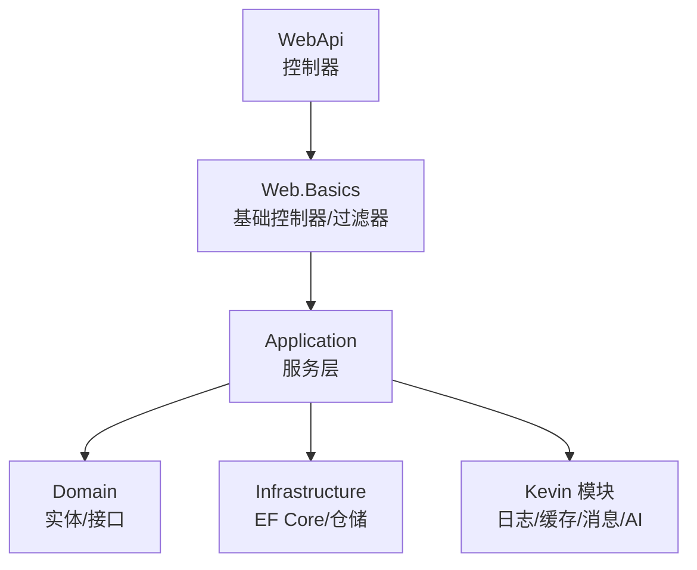
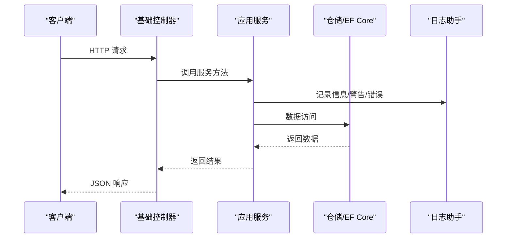
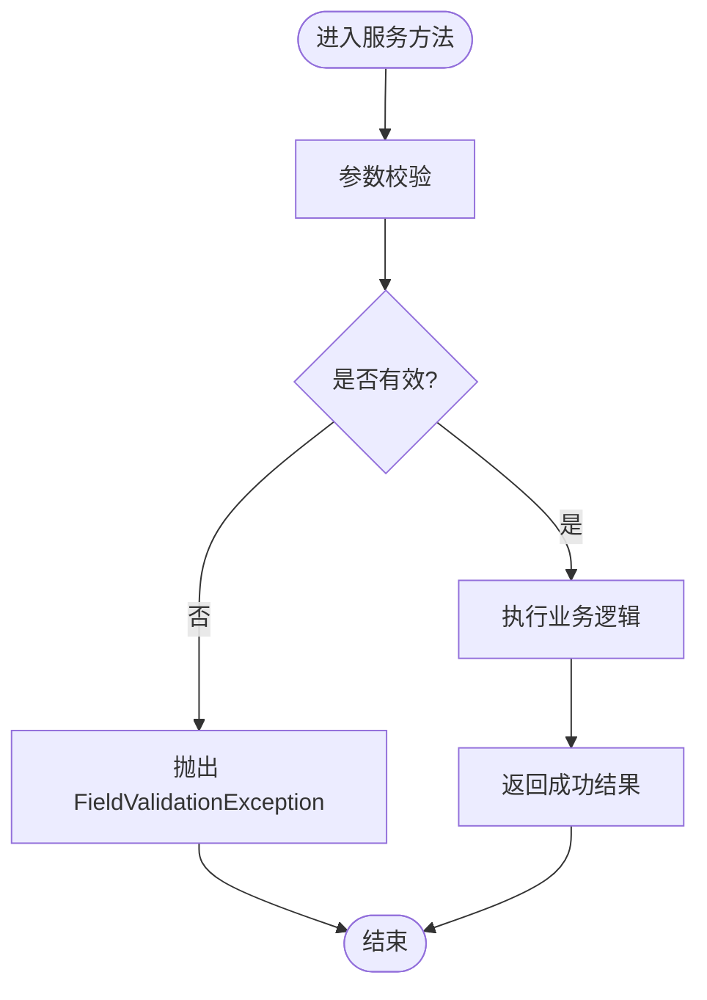
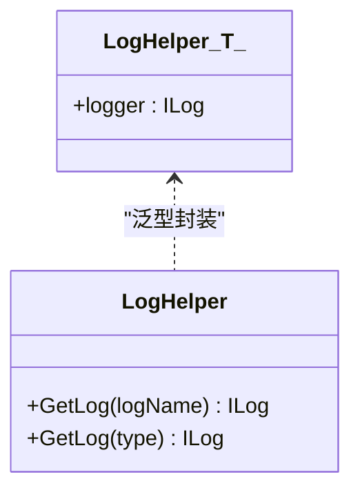
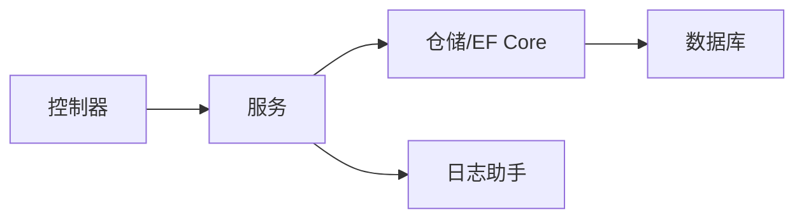

# 代码规范

<cite>
**本文引用的文件**
- [FieldValidationException.cs](file://Kevin/kevin.Share/FieldValidationException.cs)
- [BaseController.cs](file://Kevin/Kevin.Web.Basics/Controllers/BaseController.cs)
- [BaseService.cs](file://Kevin/Application/Services/BaseService.cs)
- [LogHelper.cs](file://Kevin/kevin.Module/Kevin.log4Net/LogHelper.cs)
- [log4.config](file://App/WebApi/LogConfigs/log4.config)
- [.editorconfig](file://.editorconfig)
- [GlobalUsings.cs](file://Kevin/Application/GlobalUsings.cs)
- [SYSTEM_DOCUMENTATION.md](file://SYSTEM_DOCUMENTATION.md)
</cite>

## 目录
1. [简介](#简介)
2. [项目结构](#项目结构)
3. [核心组件](#核心组件)
4. [架构总览](#架构总览)
5. [详细组件分析](#详细组件分析)
6. [依赖关系分析](#依赖关系分析)
7. [性能注意事项](#性能注意事项)
8. [故障排查指南](#故障排查指南)
9. [结论](#结论)
10. [附录](#附录)

## 简介
本规范面向 NetCoreKevin 框架的 C# 后端开发，统一命名约定、分层目录组织、异常处理、日志记录、注释与 XML 文档生成、以及代码质量检查工具配置。目标是提升一致性、可维护性与协作效率。

## 项目结构
- 分层组织
  - 领域层（Domain）：实体、接口、事件、基础类型等
  - 应用层（Application）：服务编排、用例实现
  - 基础设施层（Infrastructure）：EF Core、仓储实现、外部集成
  - Web 入口（WebApi/Web.Basics）：控制器、过滤器、中间件、Swagger 等
- 模块划分
  - Kevin.* 为核心能力（权限、缓存、消息队列、AI、RAG、日志等）
  - App.* 为业务模块（按领域拆分）
- 代码生成器
  - 支持从数据库实体生成仓储接口/实现、服务接口/实现、DTO 等

章节来源
- [SYSTEM_DOCUMENTATION.md:281-308](file://SYSTEM_DOCUMENTATION.md#L281-L308)

## 核心组件
- 基础服务基类
  - 提供当前用户、HTTP 上下文访问、雪花 ID 服务等通用能力
- 基础控制器
  - 统一路由、版本控制、匿名访问标记、常用系统方法
- 日志助手
  - 基于 log4net 的日志封装，支持按类型或名称获取 ILog
- 字段校验异常
  - 统一的参数校验失败异常类型

章节来源
- [BaseService.cs:1-41](file://Kevin/Application/Services/BaseService.cs#L1-L41)
- [BaseController.cs:1-147](file://Kevin/Kevin.Web.Basics/Controllers/BaseController.cs#L1-L147)
- [LogHelper.cs:1-76](file://Kevin/kevin.Module/Kevin.log4Net/LogHelper.cs#L1-L76)
- [FieldValidationException.cs:1-20](file://Kevin/kevin.Share/FieldValidationException.cs#L1-L20)

## 架构总览
下图展示一次典型 API 请求在框架中的流转：控制器调用服务，服务通过仓储访问数据库，并使用日志记录关键步骤。

图表来源
- [BaseController.cs:1-147](file://Kevin/Kevin.Web.Basics/Controllers/BaseController.cs#L1-L147)
- [BaseService.cs:1-41](file://Kevin/Application/Services/BaseService.cs#L1-L41)
- [LogHelper.cs:1-76](file://Kevin/kevin.Module/Kevin.log4Net/LogHelper.cs#L1-L76)

## 详细组件分析

### 命名规范
- 类与接口
  - 使用 PascalCase，如 UserService、IUserService
- 方法与属性
  - 方法名 PascalCase；公共属性 PascalCase
- 变量与参数
  - 局部变量与参数 camelCase
- 文件与命名空间
  - 文件名与类型名一致；命名空间采用 kevin.* 前缀
- 常量与枚举
  - 常量 PascalCase；枚举成员 PascalCase
- 全局引用
  - 通过 GlobalUsings 集中引入常用命名空间，减少冗余 using

章节来源
- [SYSTEM_DOCUMENTATION.md:281-289](file://SYSTEM_DOCUMENTATION.md#L281-L289)
- [GlobalUsings.cs:1-11](file://Kevin/Application/GlobalUsings.cs#L1-L11)

### 目录结构规范
- 应用层
  - Application/Services/[模块]/[服务]Service.cs
  - Application/Services/[模块]/Dto/ 存放 DTO/Input
- 领域层
  - Domain/Entities/[实体].cs
  - Domain/Interfaces/IRepositories/I[实体]Rp.cs
  - Domain/Interfaces/IServices/I[服务]Service.cs
- 基础设施层
  - EF Core 配置、仓储实现、拦截器等
- Web 层
  - Controllers/vN/ 按版本划分
  - Filters/ 横切关注点（事务、签名、限流等）

章节来源
- [SYSTEM_DOCUMENTATION.md:290-308](file://SYSTEM_DOCUMENTATION.md#L290-L308)

### 异常处理标准
- 自定义异常
  - 字段校验失败抛出 FieldValidationException
- 统一处理
  - 建议通过全局异常中间件捕获并转换为统一错误响应
- 错误码
  - 建议在共享层定义错误码枚举或常量，便于前端区分

图表来源
- [FieldValidationException.cs:1-20](file://Kevin/kevin.Share/FieldValidationException.cs#L1-L20)

章节来源
- [FieldValidationException.cs:1-20](file://Kevin/kevin.Share/FieldValidationException.cs#L1-L20)

### 日志记录规范
- 日志级别
  - Debug：调试阶段详细输出
  - Info：正常业务流程信息
  - Warn：潜在问题或降级场景
  - Error：错误与异常堆栈
- 日志格式
  - 包含时间、线程ID、级别、位置、消息
- 日志文件
  - 按级别分文件，按日期滚动，限制大小与保留数量
- 使用方式
  - 通过 LogHelper<T>.logger 或 LogHelper.GetLog(type) 获取 ILog

图表来源
- [LogHelper.cs:1-76](file://Kevin/kevin.Module/Kevin.log4Net/LogHelper.cs#L1-L76)

章节来源
- [LogHelper.cs:1-76](file://Kevin/kevin.Module/Kevin.log4Net/LogHelper.cs#L1-L76)
- [log4.config:1-137](file://App/WebApi/LogConfigs/log4.config#L1-L137)

### 注释与 XML 文档
- XML 注释
  - 对公共类型与方法添加 
/<param>/<returns>
  - 可通过 .editorconfig 调整 CS1591 诊断级别
- 生成文档
  - 启用项目属性中的“XML 文档文件”以生成 API 文档

章节来源
- [.editorconfig:1-8](file://.editorconfig#L1-L8)

### 代码质量检查与配置
- EditorConfig
  - 统一编码、行宽、诊断规则
- 建议工具
  - Roslyn Analyzers、StyleCop、SonarQube、ReSharper（可选）
- 建议规则
  - 强制 PascalCase/camelCase 命名
  - 禁止魔法数字/字符串
  - 强制异步方法以 async/await 编写
  - 禁止同步阻塞调用

章节来源
- [.editorconfig:1-8](file://.editorconfig#L1-L8)

## 依赖关系分析
- 控制器依赖服务
- 服务依赖仓储与领域模型
- 日志助手被各层广泛使用
- 全局 using 简化跨层引用

图表来源
- [BaseController.cs:1-147](file://Kevin/Kevin.Web.Basics/Controllers/BaseController.cs#L1-L147)
- [BaseService.cs:1-41](file://Kevin/Application/Services/BaseService.cs#L1-L41)
- [LogHelper.cs:1-76](file://Kevin/kevin.Module/Kevin.log4Net/LogHelper.cs#L1-L76)

章节来源
- [GlobalUsings.cs:1-11](file://Kevin/Application/GlobalUsings.cs#L1-L11)

## 性能注意事项
- 避免同步阻塞，优先使用异步
- 合理使用分页与投影，减少数据传输
- 日志级别在生产环境关闭 Debug
- 合理设置日志文件大小与保留策略

章节来源
- [log4.config:1-137](file://App/WebApi/LogConfigs/log4.config#L1-L137)

## 故障排查指南
- 启动失败
  - 检查端口占用、数据库连接、Redis 连接
- AI 工具调用失败
  - 检查工具注册、InitData 参数、日志
- 知识库检索失败
  - 检查 Qdrant 状态、向量模型配置

章节来源
- [SYSTEM_DOCUMENTATION.md:551-624](file://SYSTEM_DOCUMENTATION.md#L551-L624)

## 结论
遵循本规范可显著提升代码一致性、可维护性与团队协作效率。建议结合 CI 流程集成代码质量检查与静态分析，持续保障代码质量。

## 附录
- 快速参考
  - 命名：PascalCase 用于类型/方法；camelCase 用于变量/参数
  - 分层：Domain / Application / Infrastructure / Web
  - 异常：统一抛出自定义异常，全局捕获并转统一响应
  - 日志：按级别分文件，包含时间与线程信息
  - 注释：公共 API 必须带 XML 注释
  - 质量：EditorConfig + Analyzers + SonarQube