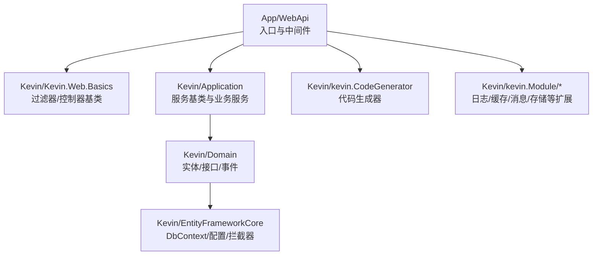
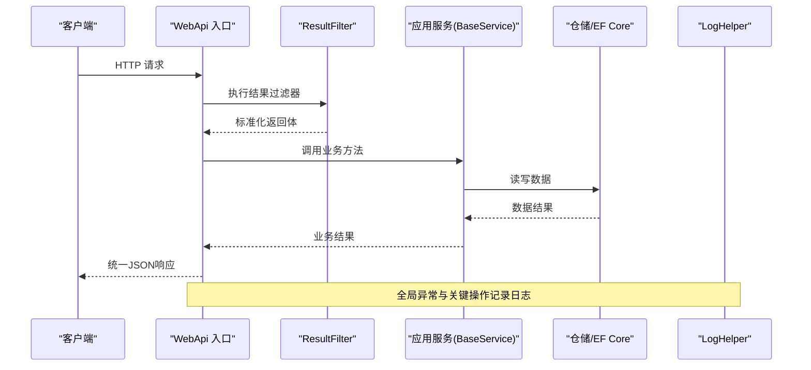
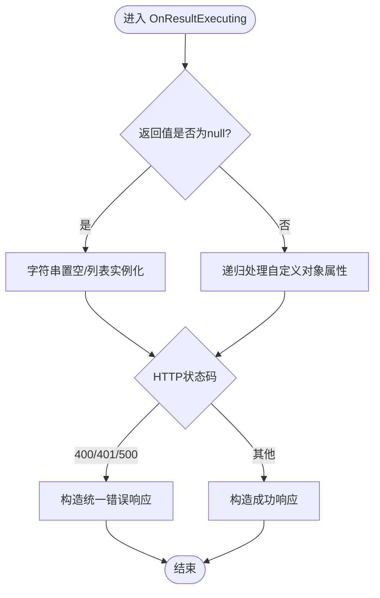
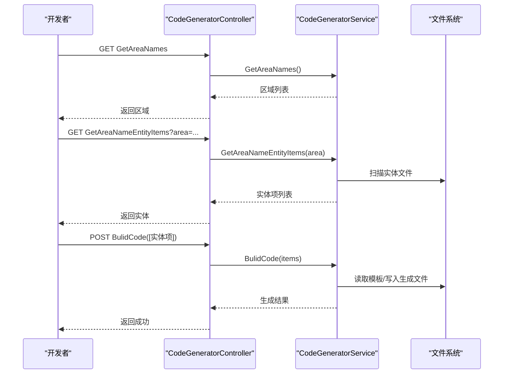
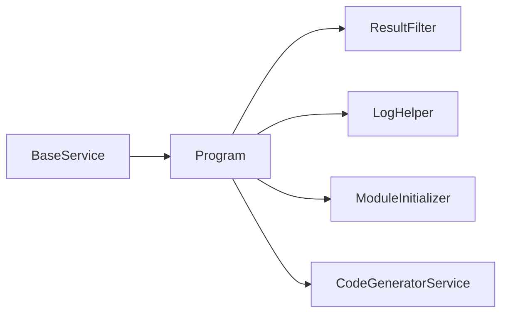

# 开发指南

<cite>
**本文引用的文件**
- [SYSTEM_DOCUMENTATION.md](file://SYSTEM_DOCUMENTATION.md)
- [Program.cs](file://App/WebApi/Program.cs)
- [appsettings.json](file://App/WebApi/appsettings.json)
- [FieldValidationException.cs](file://Kevin/kevin.Share/FieldValidationException.cs)
- [BaseService.cs](file://Kevin/Application/Services/BaseService.cs)
- [ResultFilter.cs](file://Kevin/Kevin.Web.Basics/Filters/ResultFilter.cs)
- [LogHelper.cs](file://Kevin/kevin.Module/Kevin.log4Net/LogHelper.cs)
- [CodeGeneratorService.cs](file://Kevin/kevin.Module/kevin.CodeGenerator/CodeGeneratorService.cs)
- [ModuleInitializer.cs](file://App/Application/ModuleInitializer.cs)
- [DataHelperTests.cs](file://Test/Kevin.Web.Test/Kevin.Common/DataHelperTests.cs)
- [Kevin.Unit.Tests.csproj](file://Test/Kevin.Web.Test/Kevin.Unit.Tests.csproj)
</cite>

## 目录
1. [简介](#简介)
2. [项目结构](#项目结构)
3. [核心组件](#核心组件)
4. [架构总览](#架构总览)
5. [详细组件分析](#详细组件分析)
6. [依赖关系分析](#依赖关系分析)
7. [性能与优化](#性能与优化)
8. [故障排查](#故障排查)
9. [结论](#结论)
10. [附录](#附录)

## 简介
本指南面向 NetCoreKevin 框架的开发者，聚焦代码规范、目录约定、异常处理与日志标准；详解代码生成器的使用与二次开发；给出单元测试与集成测试实践；覆盖模块开发全流程、调试技巧、性能优化与质量检查；并提供环境配置与团队协作最佳实践。

## 项目结构
- 应用层：App（WebApi、Application、Domain、RepositorieRps、AppShare）
- 核心能力：Kevin（Application、Domain、EntityFrameworkCore、Web基础组件、代码生成器、各类扩展模块）
- 前端：vue/kevin.web.vue
- 文档与初始化数据：Doc、InitData

图表来源
- [Program.cs:23-85](file://App/WebApi/Program.cs#L23-L85)
- [ResultFilter.cs:10-153](file://Kevin/Kevin.Web.Basics/Filters/ResultFilter.cs#L10-L153)
- [BaseService.cs:7-40](file://Kevin/Application/Services/BaseService.cs#L7-L40)
- [CodeGeneratorService.cs:9-222](file://Kevin/kevin.Module/kevin.CodeGenerator/CodeGeneratorService.cs#L9-L222)

章节来源
- [SYSTEM_DOCUMENTATION.md:66-90](file://SYSTEM_DOCUMENTATION.md#L66-L90)
- [Program.cs:23-85](file://App/WebApi/Program.cs#L23-L85)

## 核心组件
- 启动与中间件：Program 负责环境设置、日志、服务注册、异常处理、统一初始化。
- 统一结果封装：ResultFilter 对返回对象进行空值规范化，并统一错误响应格式。
- 服务基类：BaseService 提供当前用户、雪花ID、HTTP上下文访问等通用能力。
- 日志：LogHelper 基于 log4net 实现按类型/名称分文件的滚动日志。
- 代码生成器：CodeGeneratorService 根据配置扫描实体并批量生成仓储与服务代码。
- 模块初始化：ModuleInitializer 批量注册应用层服务到容器。

章节来源
- [Program.cs:23-85](file://App/WebApi/Program.cs#L23-L85)
- [ResultFilter.cs:10-153](file://Kevin/Kevin.Web.Basics/Filters/ResultFilter.cs#L10-L153)
- [BaseService.cs:7-40](file://Kevin/Application/Services/BaseService.cs#L7-L40)
- [LogHelper.cs:8-76](file://Kevin/kevin.Module/Kevin.log4Net/LogHelper.cs#L8-L76)
- [CodeGeneratorService.cs:9-222](file://Kevin/kevin.Module/kevin.CodeGenerator/CodeGeneratorService.cs#L9-L222)
- [ModuleInitializer.cs:10-22](file://App/Application/ModuleInitializer.cs#L10-L22)

## 架构总览
下图展示从请求进入、过滤、服务调用、持久化到响应返回的关键路径。

图表来源
- [Program.cs:49-85](file://App/WebApi/Program.cs#L49-L85)
- [ResultFilter.cs:111-145](file://Kevin/Kevin.Web.Basics/Filters/ResultFilter.cs#L111-L145)
- [BaseService.cs:17-39](file://Kevin/Application/Services/BaseService.cs#L17-L39)
- [LogHelper.cs:19-56](file://Kevin/kevin.Module/Kevin.log4Net/LogHelper.cs#L19-L56)

## 详细组件分析

### 启动与中间件（Program）
- 环境变量与环境切换：通过工具方法设置运行环境。
- 日志：启用 Kevin.log4Net 扩展。
- 服务注册：集中调用 ConfigServies 与扩展服务。
- 异常处理：开发环境使用开发者异常页；生产环境使用统一异常处理管道。
- 资源限制：设置 GC 堆硬限制以控制内存峰值。
- 统一初始化：调用 UseKevin 完成框架初始化。

章节来源
- [Program.cs:23-85](file://App/WebApi/Program.cs#L23-L85)

### 统一结果与异常（ResultFilter）
- 空值规范化：将字符串 null 转为空串，List null 转为空集合，递归处理自定义对象属性。
- 错误码统一：对 400/401/500 等状态码输出统一 JSON 结构。
- 流式响应保护：避免对文件流进行格式化破坏。

图表来源
- [ResultFilter.cs:20-145](file://Kevin/Kevin.Web.Basics/Filters/ResultFilter.cs#L20-L145)

章节来源
- [ResultFilter.cs:10-153](file://Kevin/Kevin.Web.Basics/Filters/ResultFilter.cs#L10-L153)

### 服务基类（BaseService）
- 注入当前用户、HTTP上下文、雪花ID服务。
- 在 HTTP 上下文中解析 ServiceProvider，非 HTTP 场景提供降级实例化。
- 为各业务服务提供统一的上下文与标识能力。

章节来源
- [BaseService.cs:7-40](file://Kevin/Application/Services/BaseService.cs#L7-L40)

### 日志规范（LogHelper）
- 按类型或名称获取 ILog，支持按天滚动、文件大小限制、最小锁模式。
- 推荐用法：使用泛型 LogHelper<T>.logger 获取类型化日志实例。
- 日志位置：默认输出至 Log/{日期}/{类型}.log。

章节来源
- [LogHelper.cs:8-76](file://Kevin/kevin.Module/Kevin.log4Net/LogHelper.cs#L8-L76)

### 代码生成器（CodeGeneratorService）
- 功能：根据配置扫描实体类，批量生成仓储接口/实现、服务接口/实现。
- 配置：通过 appsettings.json 的 CodeGeneratorSetting 指定命名空间与路径映射。
- 流程：获取区域 -> 枚举实体 -> 计算目标路径 -> 读取模板 -> 替换占位符 -> 写入文件。
- 安全：已存在同名文件时跳过覆盖，避免误写。

图表来源
- [CodeGeneratorService.cs:17-222](file://Kevin/kevin.Module/kevin.CodeGenerator/CodeGeneratorService.cs#L17-L222)
- [appsettings.json:112-131](file://App/WebApi/appsettings.json#L112-L131)

章节来源
- [CodeGeneratorService.cs:9-222](file://Kevin/kevin.Module/kevin.CodeGenerator/CodeGeneratorService.cs#L9-L222)
- [appsettings.json:112-131](file://App/WebApi/appsettings.json#L112-L131)

### 模块初始化与服务注册（ModuleInitializer）
- 批量扫描 IService 实现并以 Scoped 生命周期注册。
- 将服务加入全局容器以便后续按需获取。

章节来源
- [ModuleInitializer.cs:10-22](file://App/Application/ModuleInitializer.cs#L10-L22)

### 领域异常（FieldValidationException）
- 用于字段校验失败的领域级异常，支持消息与内嵌异常。
- 建议结合 ResultFilter 与全局异常处理，转换为统一错误响应。

章节来源
- [FieldValidationException.cs:5-18](file://Kevin/kevin.Share/FieldValidationException.cs#L5-L18)

## 依赖关系分析
- Program 依赖 Web 基础组件、日志、HTTP 客户端扩展、全局服务初始化。
- 应用服务依赖 BaseService 提供的上下文与 ID 能力。
- 代码生成器依赖配置与文件系统，不耦合业务逻辑。
- 过滤器与中间件贯穿请求管线，确保一致性与可观测性。

图表来源
- [Program.cs:23-85](file://App/WebApi/Program.cs#L23-L85)
- [ResultFilter.cs:10-153](file://Kevin/Kevin.Web.Basics/Filters/ResultFilter.cs#L10-L153)
- [LogHelper.cs:8-76](file://Kevin/kevin.Module/Kevin.log4Net/LogHelper.cs#L8-L76)
- [ModuleInitializer.cs:10-22](file://App/Application/ModuleInitializer.cs#L10-L22)
- [CodeGeneratorService.cs:9-222](file://Kevin/kevin.Module/kevin.CodeGenerator/CodeGeneratorService.cs#L9-L222)

## 性能与优化
- 数据库：合理索引、分页查询、批量操作、读写分离（参考系统文档）。
- 缓存：使用缓存过滤器减少重复查询。
- 异步：全面采用 async/await，避免阻塞线程。
- 日志：生产环境降低日志级别，异步落盘，定期清理。
- 运行时：GC 堆限制、连接超时、命令超时等参数调优。

章节来源
- [SYSTEM_DOCUMENTATION.md:657-690](file://SYSTEM_DOCUMENTATION.md#L657-L690)
- [appsettings.json:12-20](file://App/WebApi/appsettings.json#L12-L20)

## 故障排查
- 启动失败：检查端口占用、数据库/Redis/Qdrant 连通性。
- AI 工具调用失败：核对工具注册、InitData 参数、日志。
- 知识库检索失败：检查 Qdrant 健康、向量模型配置、文档上传状态。
- Hangfire 任务不执行：确认 Redis 连接与任务调度服务状态。
- 日志定位：查看 Logs 目录下对应日期的日志文件。

章节来源
- [SYSTEM_DOCUMENTATION.md:551-610](file://SYSTEM_DOCUMENTATION.md#L551-L610)

## 结论
NetCoreKevin 提供了完整的分层架构、统一的结果与异常处理、可扩展的代码生成器与丰富的企业级能力。遵循本指南的规范与实践，可显著提升开发效率与系统稳定性。

## 附录

### 代码规范与约定
- 命名：类/接口/方法使用 PascalCase；参数/局部变量使用 camelCase。
- 编码：UTF-8 无 BOM；单行不超过 120 字符。
- 目录：按领域/版本划分 Services、Entities、Interfaces、Repositories。
- 异常：统一捕获并记录日志，返回标准错误结构。
- 日志：使用 LogHelper<T>.logger，区分 Info/Warn/Error。

章节来源
- [SYSTEM_DOCUMENTATION.md:281-323](file://SYSTEM_DOCUMENTATION.md#L281-L323)

### 代码生成器使用与二次开发
- 配置：在 appsettings.json 中维护 CodeGeneratorSetting，定义 AreaName 与路径映射。
- 使用：依次调用获取区域、实体、生成代码三个接口。
- 定制：修改 BuildCodeTemplate 下的模板文件，或扩展 CodeGeneratorService 增加新产物。
- 安全：仅管理员可用；生成前备份；已存在文件不会覆盖。

章节来源
- [CodeGeneratorService.cs:17-222](file://Kevin/kevin.Module/kevin.CodeGenerator/CodeGeneratorService.cs#L17-L222)
- [appsettings.json:112-131](file://App/WebApi/appsettings.json#L112-L131)

### 单元测试与集成测试
- 框架：xUnit + .NET Test SDK；覆盖率由 coverlet 支持。
- 示例：DataHelperTests 展示了 Arrange-Act-Assert 的写法。
- Mock：可使用 FakeItEasy 等库创建模拟对象（见共享测试工程）。
- 建议：隔离外部依赖；断言边界条件；保持用例小而快。

章节来源
- [Kevin.Unit.Tests.csproj:1-34](file://Test/Kevin.Web.Test/Kevin.Unit.Tests.csproj#L1-L34)
- [DataHelperTests.cs:1-86](file://Test/Kevin.Web.Test/Kevin.Common/DataHelperTests.cs#L1-L86)

### 模块开发流程（需求到实现）
- 需求分析：明确领域边界与输入输出。
- 设计：定义实体、接口、DTO、事件与处理器。
- 实现：编写 Domain、Application、Repository 与 Web 控制器。
- 测试：补充单元与集成测试，覆盖主流程与异常分支。
- 发布：更新迁移脚本、配置项与文档。

章节来源
- [SYSTEM_DOCUMENTATION.md:66-90](file://SYSTEM_DOCUMENTATION.md#L66-L90)

### 调试技巧
- 本地调试：Visual Studio 直接运行 App.WebApi；或使用命令行 dotnet run --environment Development。
- 日志：开启 Debug 级别，关注错误与警告；利用滚动日志定位问题。
- 中间件：在 Program 中逐步启用/禁用中间件定位问题点。
- 性能：使用 Profiler 或内置指标观察热点。

章节来源
- [SYSTEM_DOCUMENTATION.md:158-186](file://SYSTEM_DOCUMENTATION.md#L158-L186)
- [Program.cs:66-85](file://App/WebApi/Program.cs#L66-L85)

### 性能优化清单
- 数据库：索引、分页、批量、读写分离。
- 缓存：热点数据缓存、过期策略。
- 异步：避免同步阻塞，合理使用 ConfigureAwait(false)。
- 日志：生产关闭低级别日志，异步落盘。

章节来源
- [SYSTEM_DOCUMENTATION.md:657-690](file://SYSTEM_DOCUMENTATION.md#L657-L690)

### 环境配置与团队协作
- 环境：ASPNETCORE_ENVIRONMENT 切换；不同环境覆盖配置文件。
- 配置：连接串、JWT、Hangfire、CORS、Consul、第三方服务等均在 appsettings.*.json 管理。
- 协作：统一代码风格、提交前运行测试、PR 审查、变更影响评估。
- 部署：Docker 与 systemd 服务化，环境变量注入敏感信息。

章节来源
- [appsettings.json:1-166](file://App/WebApi/appsettings.json#L1-L166)
- [SYSTEM_DOCUMENTATION.md:116-186](file://SYSTEM_DOCUMENTATION.md#L116-L186)