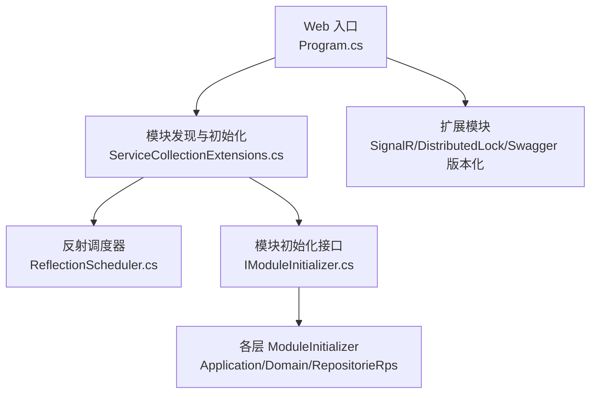
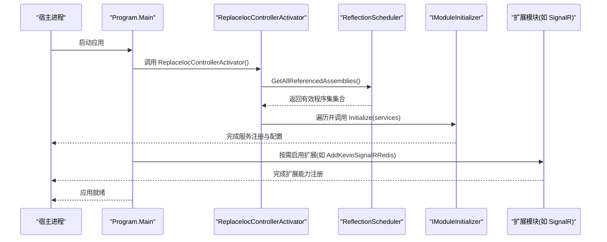
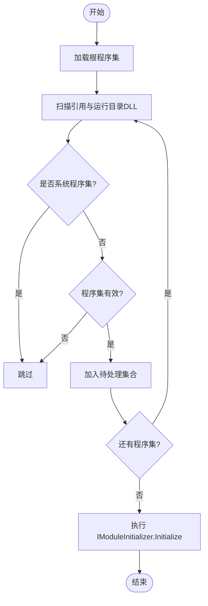
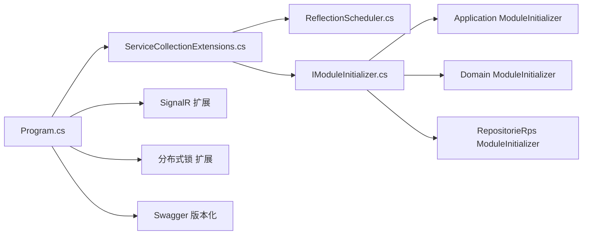

# 模块开发

<cite>
**本文引用的文件**
- [Program.cs](file://App/WebApi/Program.cs)
- [ServiceCollectionExtensions.cs](file://Kevin/kevin.Module/kevin.Ioc/ServiceCollectionExtensions.cs)
- [ReflectionScheduler.cs](file://Kevin/kevin.Module/kevin.Ioc/TieredServiceRegistration/ReflectionScheduler.cs)
- [IModuleInitializer.cs](file://Kevin/kevin.Module/kevin.Ioc/TieredServiceRegistration/IModuleInitializer.cs)
- [ModuleInitializer.cs（Application）](file://Kevin/Application/ModuleInitializer.cs)
- [ModuleInitializer.cs（App.Application）](file://App/Application/ModuleInitializer.cs)
- [ModuleInitializer.cs（App.Domain）](file://App/Domain/ModuleInitializer.cs)
- [ModuleInitializer.cs（App.RepositorieRps）](file://App/RepositorieRps/ModuleInitializer.cs)
- [ModuleInitializer.cs（kevin.RepositorieRps）](file://Kevin/RepositorieRps/ModuleInitializer.cs)
- [SwaggerConfigureOptions.cs](file://Kevin/kevin.Module/ Kevin.Versioning.Swagger/Swagger/SwaggerConfigureOptions.cs)
- [ServiceCollectionExtensions.cs（SignalR）](file://Kevin/kevin.Module/Kevin.SignalR/ServiceCollectionExtensions.cs)
- [ServiceCollectionExtensions.cs（DistributedLock）](file://Kevin/kevin.Module/kevin.DistributedLock/ServiceCollectionExtensions.cs)
</cite>

## 目录
1. [简介](#简介)
2. [项目结构](#项目结构)
3. [核心组件](#核心组件)
4. [架构总览](#架构总览)
5. [详细组件分析](#详细组件分析)
6. [依赖关系分析](#依赖关系分析)
7. [性能考虑](#性能考虑)
8. [故障排查指南](#故障排查指南)
9. [结论](#结论)
10. [附录](#附录)

## 简介
本指南面向基于该代码库的模块化架构与模块开发实践，围绕以下目标展开：
- 模块化架构设计原理与模块间通信机制
- 模块初始化流程：服务注册、依赖注入配置、生命周期管理
- 模块边界划分原则：领域边界与服务边界
- 模块版本管理与兼容性处理
- 模块开发最佳实践与常见陷阱
- 模块测试与部署策略

本仓库采用分层与多模块组合的方式组织代码，通过自定义的模块发现与初始化机制，实现“按程序集自动发现并执行模块初始化”的能力；同时提供丰富的扩展点（如 SignalR、分布式锁、Swagger 版本化等），便于在不同业务域中构建可插拔的模块。

## 项目结构
整体结构遵循典型的多层架构与模块化组织：
- Web 入口：App/WebApi/Program.cs 负责应用启动、中间件与全局服务配置
- 模块基础设施：Kevin/kevin.Module/kevin.Ioc 提供模块发现与初始化框架
- 各功能模块：位于 Kevin/kevin.Module 下的多个子模块（如 SignalR、DistributedLock、Versioning.Swagger 等）
- 业务分层：App 与 Kevin 下分别包含 Application、Domain、RepositorieRps 等分层模块，各自拥有 ModuleInitializer 完成自身服务注册
- API 版本化：Kevin/kevin.Module/Kevin.Versioning.Swagger 提供 Swagger 文档的版本化支持

图表来源
- [Program.cs:23-85](file://App/WebApi/Program.cs#L23-L85)
- [ServiceCollectionExtensions.cs:10-15](file://Kevin/kevin.Module/kevin.Ioc/ServiceCollectionExtensions.cs#L10-L15)
- [ReflectionScheduler.cs:104-167](file://Kevin/kevin.Module/kevin.Ioc/TieredServiceRegistration/ReflectionScheduler.cs#L104-L167)
- [IModuleInitializer.cs:8-15](file://Kevin/kevin.Module/kevin.Ioc/TieredServiceRegistration/IModuleInitializer.cs#L8-L15)

章节来源
- [Program.cs:23-85](file://App/WebApi/Program.cs#L23-L85)
- [ServiceCollectionExtensions.cs:10-15](file://Kevin/kevin.Module/kevin.Ioc/ServiceCollectionExtensions.cs#L10-L15)
- [ReflectionScheduler.cs:104-167](file://Kevin/kevin.Module/kevin.Ioc/TieredServiceRegistration/ReflectionScheduler.cs#L104-L167)
- [IModuleInitializer.cs:8-15](file://Kevin/kevin.Module/kevin.Ioc/TieredServiceRegistration/IModuleInitializer.cs#L8-L15)

## 核心组件
- 模块发现与初始化框架
  - ServiceCollectionExtensions.ReplaceIocControllerActivator：替换控制器创建器并触发模块初始化
  - ReflectionScheduler.GetAllReferencedAssemblies：扫描引用程序集与运行目录 DLL，过滤系统程序集，返回有效程序集集合
  - IModuleInitializer.Initialize：模块统一初始化入口，用于服务注册与配置
- 各层 ModuleInitializer：在 Application、Domain、RepositorieRps 等模块中集中注册服务到 IServiceCollection
- 扩展模块：SignalR、DistributedLock、Swagger 版本化等以扩展方法形式暴露，供宿主按需启用

章节来源
- [ServiceCollectionExtensions.cs:10-15](file://Kevin/kevin.Module/kevin.Ioc/ServiceCollectionExtensions.cs#L10-L15)
- [ReflectionScheduler.cs:104-167](file://Kevin/kevin.Module/kevin.Ioc/TieredServiceRegistration/ReflectionScheduler.cs#L104-L167)
- [IModuleInitializer.cs:8-15](file://Kevin/kevin.Module/kevin.Ioc/TieredServiceRegistration/IModuleInitializer.cs#L8-L15)
- [ModuleInitializer.cs（Application）:15-27](file://Kevin/Application/ModuleInitializer.cs#L15-L27)
- [ModuleInitializer.cs（App.Application）:10-19](file://App/Application/ModuleInitializer.cs#L10-L19)
- [ModuleInitializer.cs（App.Domain）:7-13](file://App/Domain/ModuleInitializer.cs#L7-L13)
- [ModuleInitializer.cs（App.RepositorieRps）:10-19](file://App/RepositorieRps/ModuleInitializer.cs#L10-L19)
- [ModuleInitializer.cs（kevin.RepositorieRps）:10-19](file://Kevin/RepositorieRps/ModuleInitializer.cs#L10-L19)

## 架构总览
下图展示了从 Web 入口到模块发现、再到各层服务注册的完整流程，以及扩展模块的接入方式。

图表来源
- [Program.cs:23-85](file://App/WebApi/Program.cs#L23-L85)
- [ServiceCollectionExtensions.cs:10-15](file://Kevin/kevin.Module/kevin.Ioc/ServiceCollectionExtensions.cs#L10-L15)
- [ReflectionScheduler.cs:104-167](file://Kevin/kevin.Module/kevin.Ioc/TieredServiceRegistration/ReflectionScheduler.cs#L104-L167)
- [IModuleInitializer.cs:8-15](file://Kevin/kevin.Module/kevin.Ioc/TieredServiceRegistration/IModuleInitializer.cs#L8-L15)
- [ServiceCollectionExtensions.cs（SignalR）:9-25](file://Kevin/kevin.Module/Kevin.SignalR/ServiceCollectionExtensions.cs#L9-L25)

## 详细组件分析

### 模块发现与初始化框架
- 职责
  - 自动发现所有非系统程序集
  - 为每个包含 IModuleInitializer 的程序集调用 Initialize
  - 将控制器创建器替换为基于 DI 的创建器，确保控制器能解析依赖
- 关键点
  - 反射调度器会跳过 Microsoft 相关程序集，避免不必要的加载
  - 对程序集有效性进行校验，捕获类型加载异常
  - 支持从引用与运行目录扫描 DLL，保证插件式扩展能力

图表来源
- [ReflectionScheduler.cs:104-167](file://Kevin/kevin.Module/kevin.Ioc/TieredServiceRegistration/ReflectionScheduler.cs#L104-L167)
- [ReflectionScheduler.cs:175-186](file://Kevin/kevin.Module/kevin.Ioc/TieredServiceRegistration/ReflectionScheduler.cs#L175-L186)

章节来源
- [ReflectionScheduler.cs:104-167](file://Kevin/kevin.Module/kevin.Ioc/TieredServiceRegistration/ReflectionScheduler.cs#L104-L167)
- [ReflectionScheduler.cs:175-186](file://Kevin/kevin.Module/kevin.Ioc/TieredServiceRegistration/ReflectionScheduler.cs#L175-L186)

### 各层 ModuleInitializer 与服务注册
- 作用
  - 在各自模块内集中注册服务到 IServiceCollection
  - 使用批量注册工具（如 IocHelper.BatchAddScopeds）减少重复代码
  - 输出日志便于定位初始化阶段问题
- 示例要点
  - Application 层：注册业务服务、当前用户上下文等
  - Domain 层：领域相关服务或事件处理器（如有）
  - RepositorieRps 层：仓储接口与实现的绑定

章节来源
- [ModuleInitializer.cs（Application）:15-27](file://Kevin/Application/ModuleInitializer.cs#L15-L27)
- [ModuleInitializer.cs（App.Application）:10-19](file://App/Application/ModuleInitializer.cs#L10-L19)
- [ModuleInitializer.cs（App.Domain）:7-13](file://App/Domain/ModuleInitializer.cs#L7-L13)
- [ModuleInitializer.cs（App.RepositorieRps）:10-19](file://App/RepositorieRps/ModuleInitializer.cs#L10-L19)
- [ModuleInitializer.cs（kevin.RepositorieRps）:10-19](file://Kevin/RepositorieRps/ModuleInitializer.cs#L10-L19)

### 扩展模块接入（SignalR、分布式锁、Swagger 版本化）
- SignalR
  - 通过扩展方法 AddKevinSignalRRedis 配置 SignalR 与 Redis 集群
  - 设置客户端超时与保持心跳间隔，适配长连接场景
- 分布式锁
  - 提供不同存储后端的分布式锁扩展（注释中展示 SQL/MySql 方案）
  - 可按需启用，避免引入不必要依赖
- Swagger 版本化
  - 根据 ApiVersionDescriptionProvider 动态生成多版本文档
  - 调整 SchemaId 选择器，避免命名冲突

章节来源
- [ServiceCollectionExtensions.cs（SignalR）:9-25](file://Kevin/kevin.Module/Kevin.SignalR/ServiceCollectionExtensions.cs#L9-L25)
- [ServiceCollectionExtensions.cs（DistributedLock）:1-27](file://Kevin/kevin.Module/kevin.DistributedLock/ServiceCollectionExtensions.cs#L1-L27)
- [SwaggerConfigureOptions.cs:13-31](file://Kevin/kevin.Module/Kevin.Versioning.Swagger/Swagger/SwaggerConfigureOptions.cs#L13-L31)

### 模块边界划分原则
- 领域边界
  - 实体与领域服务集中在 Domain 层，对外仅暴露接口
  - 事件与事件处理器放在 Domain/Events 与 Domain/EventHandlers，解耦领域行为
- 服务边界
  - Application 层聚合领域能力，提供用例级服务
  - RepositorieRps 层专注数据访问，屏蔽持久化细节
- 模块间通信
  - 通过接口契约（IService/IRepository）进行松耦合通信
  - 使用模块初始化集中注册，避免硬编码依赖

[本节为概念性说明，不直接分析具体文件]

### 模块版本管理与兼容性处理
- API 版本化
  - 使用 Swagger 版本化选项，按组名生成多版本文档
  - 控制器与服务可通过版本前缀区分，避免破坏性变更影响现有消费者
- 兼容策略
  - 新增字段或接口时保持向后兼容
  - 废弃接口保留过渡期并提供迁移指引

章节来源
- [SwaggerConfigureOptions.cs:13-31](file://Kevin/kevin.Module/Kevin.Versioning.Swagger/Swagger/SwaggerConfigureOptions.cs#L13-L31)

### 模块生命周期管理
- 启动阶段
  - Program.Main 构建服务容器并启用模块初始化
  - 模块初始化完成后，再启用扩展能力（如 SignalR）
- 请求阶段
  - 中间件设置 GlobalServices，使请求上下文可用
  - 控制器由 DI 创建，依赖自动注入
- 关闭阶段
  - 资源释放由框架与扩展模块自行管理（如 SignalR 连接清理）

章节来源
- [Program.cs:23-85](file://App/WebApi/Program.cs#L23-L85)

## 依赖关系分析
- 模块发现依赖反射与程序集元数据
- 各层 ModuleInitializer 依赖 IServiceCollection 与通用工具（如 IocHelper）
- 扩展模块通过扩展方法暴露能力，宿主按需启用

图表来源
- [Program.cs:23-85](file://App/WebApi/Program.cs#L23-L85)
- [ServiceCollectionExtensions.cs:10-15](file://Kevin/kevin.Module/kevin.Ioc/ServiceCollectionExtensions.cs#L10-L15)
- [ReflectionScheduler.cs:104-167](file://Kevin/kevin.Module/kevin.Ioc/TieredServiceRegistration/ReflectionScheduler.cs#L104-L167)
- [IModuleInitializer.cs:8-15](file://Kevin/kevin.Module/kevin.Ioc/TieredServiceRegistration/IModuleInitializer.cs#L8-L15)
- [ServiceCollectionExtensions.cs（SignalR）:9-25](file://Kevin/kevin.Module/Kevin.SignalR/ServiceCollectionExtensions.cs#L9-L25)
- [ServiceCollectionExtensions.cs（DistributedLock）:1-27](file://Kevin/kevin.Module/kevin.DistributedLock/ServiceCollectionExtensions.cs#L1-L27)
- [SwaggerConfigureOptions.cs:13-31](file://Kevin/kevin.Module/Kevin.Versioning.Swagger/Swagger/SwaggerConfigureOptions.cs#L13-L31)

章节来源
- [Program.cs:23-85](file://App/WebApi/Program.cs#L23-L85)
- [ServiceCollectionExtensions.cs:10-15](file://Kevin/kevin.Module/kevin.Ioc/ServiceCollectionExtensions.cs#L10-L15)
- [ReflectionScheduler.cs:104-167](file://Kevin/kevin.Module/kevin.Ioc/TieredServiceRegistration/ReflectionScheduler.cs#L104-L167)
- [IModuleInitializer.cs:8-15](file://Kevin/kevin.Module/kevin.Ioc/TieredServiceRegistration/IModuleInitializer.cs#L8-L15)

## 性能考虑
- 模块发现
  - 反射扫描可能带来启动开销，建议仅在开发或需要插件化的环境启用
  - 合理过滤系统程序集，减少无效加载
- 服务注册
  - 使用批量注册减少重复代码与反射次数
  - 控制服务生命周期（Scoped/Transient/Singleton）避免过度共享状态
- 扩展模块
  - SignalR 长连接需关注内存与连接数上限
  - 分布式锁在高并发场景下注意锁粒度与超时策略

[本节提供一般性指导，不直接分析具体文件]

## 故障排查指南
- 模块未生效
  - 检查是否调用了 ReplaceIocControllerActivator
  - 确认程序集包含 IModuleInitializer 且未被系统过滤
- 服务未注册
  - 查看对应 ModuleInitializer 是否执行成功
  - 检查批量注册是否正确识别接口与实现
- 扩展模块异常
  - SignalR：确认 Redis 配置与连接字符串正确
  - 分布式锁：确认后端可用性与连接参数
- 日志与异常
  - Program.Main 中已记录异常信息
  - 模块初始化输出日志便于快速定位

章节来源
- [Program.cs:23-85](file://App/WebApi/Program.cs#L23-L85)
- [ModuleInitializer.cs（Application）:15-27](file://Kevin/Application/ModuleInitializer.cs#L15-L27)
- [ModuleInitializer.cs（App.Application）:10-19](file://App/Application/ModuleInitializer.cs#L10-L19)
- [ModuleInitializer.cs（App.RepositorieRps）:10-19](file://App/RepositorieRps/ModuleInitializer.cs#L10-L19)
- [ModuleInitializer.cs（kevin.RepositorieRps）:10-19](file://Kevin/RepositorieRps/ModuleInitializer.cs#L10-L19)

## 结论
该代码库通过统一的模块发现与初始化机制，实现了灵活的分层与模块化架构。开发者可在各层 ModuleInitializer 中集中管理服务注册，借助扩展模块快速集成 SignalR、分布式锁、API 版本化等能力。遵循领域与服务边界划分原则，结合合理的版本管理与兼容性策略，能够构建高内聚、低耦合的可维护系统。

[本节为总结性内容，不直接分析具体文件]

## 附录
- 最佳实践
  - 每个模块只关注自身职责，通过接口暴露能力
  - 使用批量注册与工具类简化服务注册逻辑
  - 在模块初始化中输出关键日志，便于问题定位
- 常见陷阱
  - 循环依赖：通过接口与延迟解析避免
  - 过度使用单例：谨慎共享可变状态
  - 忽略系统程序集过滤：导致启动缓慢或加载失败
- 测试策略
  - 单元测试：针对服务与工具类编写覆盖用例
  - 集成测试：验证模块初始化与扩展能力装配
  - 端到端测试：模拟真实请求链路，验证控制器与服务协作
- 部署策略
  - 发布前检查模块初始化顺序与依赖完整性
  - 环境变量与配置文件分离，便于多环境部署
  - 监控与日志：在生产环境启用结构化日志与健康检查

[本节为概念性说明，不直接分析具体文件]