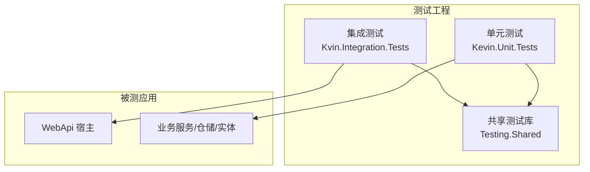
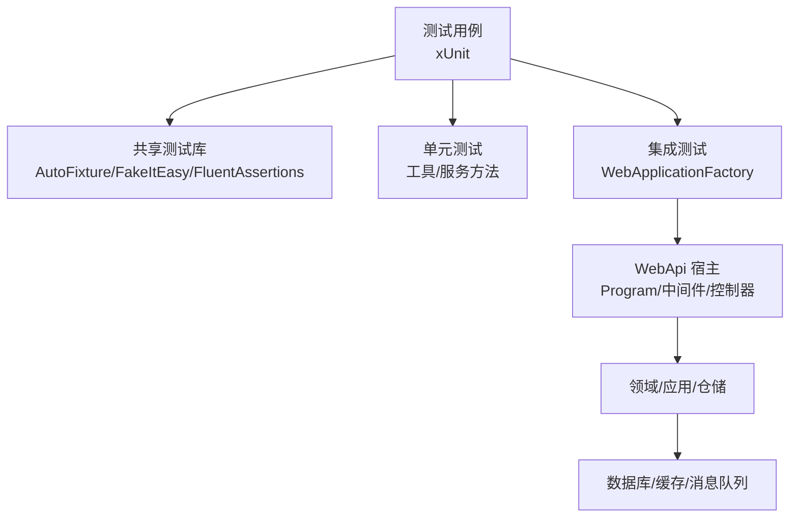
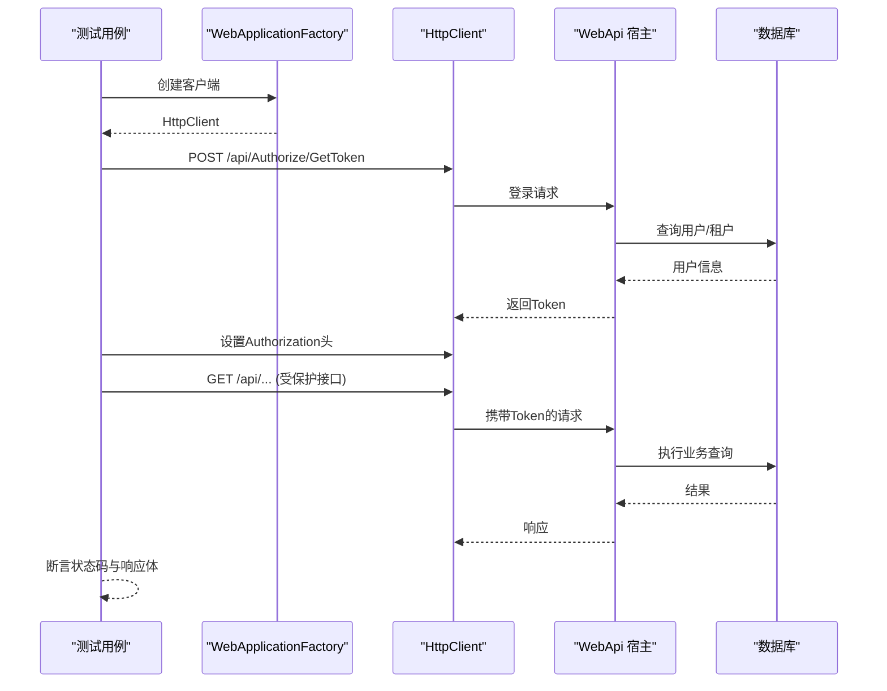
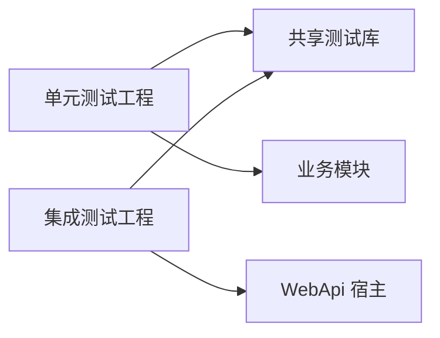

# 测试策略

<cite>
**本文引用的文件**
- [Kevin.Unit.Tests.csproj](file://Test/Kevin.Web.Test/Kevin.Unit.Tests.csproj)
- [Kevin.Integration.Tests.csproj](file://Test/Kvin.Integration.Tests/Kevin.Integration.Tests.csproj)
- [Kevin.Testing.Shared.csproj](file://Test/Testing.Shared/Kevin.Testing.Shared.csproj)
- [AutoFakeItEasyAttribute.cs](file://Test/Testing.Shared/Attributes/AutoFakeItEasyAttribute.cs)
- [PriorityOrderer.cs](file://Test/Testing.Shared/PriorityOrderer.cs)
- [TestPriorityAttribute .cs](file://Test/Testing.Shared/Attributes/TestPriorityAttribute .cs)
- [DataHelperTests.cs](file://Test/Kevin.Web.Test/Kevin.Common/DataHelperTests.cs)
- [AppTests.cs](file://Test/Kvin.Integration.Tests/AppTests.cs)
- [SignTests.cs](file://Test/Kvin.Integration.Tests/Controllers/SignTests.cs)
- [AppGetToken.cs](file://Test/Kvin.Integration.Tests/AppGetToken.cs)
- [KevinRabbitMQTests.cs](file://Test/Kevin.Web.Test/Kevin.Module/KevinRabbitMQTests.cs)
- [appsettings.Test.json](file://App/WebApi/appsettings.Test.json)
</cite>

## 目录
1. [简介](#简介)
2. [项目结构](#项目结构)
3. [核心组件](#核心组件)
4. [架构总览](#架构总览)
5. [详细组件分析](#详细组件分析)
6. [依赖关系分析](#依赖关系分析)
7. [性能考量](#性能考量)
8. [故障排查指南](#故障排查指南)
9. [结论](#结论)
10. [附录](#附录)

## 简介
本测试策略面向当前ABP风格的多层.NET项目，覆盖单元测试、集成测试与端到端API测试。文档基于仓库中现有测试工程与实践，给出：
- 测试框架选型与配置（xUnit、AutoFixture、FluentAssertions、WireMock.Net等）
- Mock对象使用规范（FakeItEasy集成）
- 数据库与API集成测试方案
- 测试数据管理与环境搭建（含测试配置文件）
- 覆盖率要求与持续集成建议
- 调试技巧与常见问题解决方案

## 项目结构
测试工程按职责分层组织：
- 单元测试工程：针对工具类、模块内部逻辑进行隔离测试
- 集成测试工程：启动WebApi宿主，通过HttpClient调用真实控制器，验证端到端流程
- 共享测试库：提供通用特性、排序器、Mock夹具等公共能力

图表来源
- [Kevin.Unit.Tests.csproj:1-34](file://Test/Kevin.Web.Test/Kevin.Unit.Tests.csproj#L1-L34)
- [Kevin.Integration.Tests.csproj:1-34](file://Test/Kvin.Integration.Tests/Kevin.Integration.Tests.csproj#L1-L34)
- [Kevin.Testing.Shared.csproj:1-21](file://Test/Testing.Shared/Kevin.Testing.Shared.csproj#L1-L21)

章节来源
- [Kevin.Unit.Tests.csproj:1-34](file://Test/Kevin.Web.Test/Kevin.Unit.Tests.csproj#L1-L34)
- [Kevin.Integration.Tests.csproj:1-34](file://Test/Kvin.Integration.Tests/Kevin.Integration.Tests.csproj#L1-L34)
- [Kevin.Testing.Shared.csproj:1-21](file://Test/Testing.Shared/Kevin.Testing.Shared.csproj#L1-L21)

## 核心组件
- xUnit测试框架：统一用例编写与执行入口
- AutoFixture + FakeItEasy：自动生成测试数据并创建接口/抽象类的模拟实现
- FluentAssertions：可读性强的断言库
- WebApplicationFactory：在集成测试中启动WebApi宿主，注入测试配置
- WireMock.Net：对外部HTTP依赖的模拟（可在共享库中使用）
- 自定义测试优先级排序器：保证关键前置用例优先执行

章节来源
- [AutoFakeItEasyAttribute.cs:1-25](file://Test/Testing.Shared/Attributes/AutoFakeItEasyAttribute.cs#L1-L25)
- [PriorityOrderer.cs:1-40](file://Test/Testing.Shared/PriorityOrderer.cs#L1-L40)
- [TestPriorityAttribute .cs:1-19](file://Test/Testing.Shared/Attributes/TestPriorityAttribute .cs#L1-L19)
- [Kevin.Testing.Shared.csproj:1-21](file://Test/Testing.Shared/Kevin.Testing.Shared.csproj#L1-L21)

## 架构总览
下图展示单元测试与集成测试在整体架构中的位置与交互方式。

图表来源
- [Kevin.Unit.Tests.csproj:1-34](file://Test/Kevin.Web.Test/Kevin.Unit.Tests.csproj#L1-L34)
- [Kevin.Integration.Tests.csproj:1-34](file://Test/Kvin.Integration.Tests/Kevin.Integration.Tests.csproj#L1-L34)
- [Kevin.Testing.Shared.csproj:1-21](file://Test/Testing.Shared/Kevin.Testing.Shared.csproj#L1-L21)

## 详细组件分析

### 单元测试实践
- 目标：对无外部依赖或可轻松Mock的纯函数/工具方法进行快速、稳定验证
- 设计原则
  - 每个[Fact]聚焦单一行为，遵循Arrange-Act-Assert三段式
  - 输入边界与异常路径需覆盖（空值、缺失列、非法参数等）
  - 使用AutoFixture生成复杂对象，减少样板代码
- 示例要点
  - DataTable到实体的映射：验证空表、空行、列缺失等场景
  - 断言使用FluentAssertions提升可读性
- 参考用例
  - [DataHelperTests.cs:8-77](file://Test/Kevin.Web.Test/Kevin.Common/DataHelperTests.cs#L8-L77)

章节来源
- [DataHelperTests.cs:8-77](file://Test/Kevin.Web.Test/Kevin.Common/DataHelperTests.cs#L8-L77)

### Mock与数据生成
- FakeItEasy集成：通过自定义AutoDataAttribute自动为接口/抽象类生成模拟对象
- 取消令牌生成：扩展Fixture以支持CancellationToken的自动生成
- 递归行为控制：避免无限递归生成的对象图
- 使用建议
  - 对服务层依赖的外部接口一律Mock，确保测试隔离
  - 仅对必要的方法设置期望返回值或调用次数
- 参考实现
  - [AutoFakeItEasyAttribute.cs:7-22](file://Test/Testing.Shared/Attributes/AutoFakeItEasyAttribute.cs#L7-L22)

章节来源
- [AutoFakeItEasyAttribute.cs:7-22](file://Test/Testing.Shared/Attributes/AutoFakeItEasyAttribute.cs#L7-L22)

### 集成测试方案（API与数据库）
- 宿主启动：使用WebApplicationFactory<Program>启动完整管道，便于端到端验证
- 请求构造：通过HttpClient发送HTTP请求，设置基础地址与必要头
- 认证流程：先调用登录接口获取Token，再注入Authorization头
- 数据库与外部依赖
  - 使用测试环境的连接字符串与Redis、RabbitMQ等配置
  - 必要时使用WireMock.Net模拟第三方HTTP服务
- 参考用例
  - 应用级API测试：[AppTests.cs:6-41](file://Test/Kvin.Integration.Tests/AppTests.cs#L6-L41)
  - 签名相关API测试：[SignTests.cs:8-66](file://Test/Kvin.Integration.Tests/Controllers/SignTests.cs#L8-L66)
  - 登录与鉴权辅助：[AppGetToken.cs:3-23](file://Test/Kvin.Integration.Tests/AppGetToken.cs#L3-L23)

图表来源
- [AppTests.cs:6-41](file://Test/Kvin.Integration.Tests/AppTests.cs#L6-L41)
- [SignTests.cs:8-66](file://Test/Kvin.Integration.Tests/Controllers/SignTests.cs#L8-L66)
- [AppGetToken.cs:3-23](file://Test/Kvin.Integration.Tests/AppGetToken.cs#L3-L23)

章节来源
- [AppTests.cs:6-41](file://Test/Kvin.Integration.Tests/AppTests.cs#L6-L41)
- [SignTests.cs:8-66](file://Test/Kvin.Integration.Tests/Controllers/SignTests.cs#L8-L66)
- [AppGetToken.cs:3-23](file://Test/Kvin.Integration.Tests/AppGetToken.cs#L3-L23)

### 外部依赖测试（消息队列）
- 场景：验证RabbitMQ发布/消费链路
- 策略：在测试环境中直接连接本地RabbitMQ实例，发送消息并消费确认
- 注意事项
  - 明确虚拟主机、用户名密码、端口等连接参数
  - 合理设置超时与自动重连策略
  - 使用断言确认发布回调与消费回调是否触发
- 参考用例
  - [KevinRabbitMQTests.cs:8-62](file://Test/Kevin.Web.Test/Kevin.Module/KevinRabbitMQTests.cs#L8-L62)

章节来源
- [KevinRabbitMQTests.cs:8-62](file://Test/Kevin.Web.Test/Kevin.Module/KevinRabbitMQTests.cs#L8-L62)

### 测试数据管理
- 静态数据：通过测试配置文件集中管理连接串、密钥、开关等
- 动态数据：使用AutoFixture生成随机但合法的数据集
- 清理策略：集成测试前后对数据进行初始化与清理，避免相互污染
- 参考配置
  - 测试环境配置：[appsettings.Test.json:1-167](file://App/WebApi/appsettings.Test.json#L1-L167)

章节来源
- [appsettings.Test.json:1-167](file://App/WebApi/appsettings.Test.json#L1-L167)

### 测试执行顺序与优先级
- 自定义排序器：根据[TestPriority]属性对用例进行排序，确保依赖关系正确
- 使用方式：在测试类上指定orderer类型与程序集
- 典型用途：登录、建库、建表等前置操作优先执行
- 参考实现
  - 排序器：[PriorityOrderer.cs:7-31](file://Test/Testing.Shared/PriorityOrderer.cs#L7-L31)
  - 优先级特性：[TestPriorityAttribute .cs:4-16](file://Test/Testing.Shared/Attributes/TestPriorityAttribute .cs#L4-L16)
  - 用例标注：[AppTests.cs:22-41](file://Test/Kvin.Integration.Tests/AppTests.cs#L22-L41), [SignTests.cs:24-66](file://Test/Kvin.Integration.Tests/Controllers/SignTests.cs#L24-L66)

章节来源
- [PriorityOrderer.cs:7-31](file://Test/Testing.Shared/PriorityOrderer.cs#L7-L31)
- [TestPriorityAttribute .cs:4-16](file://Test/Testing.Shared/Attributes/TestPriorityAttribute .cs#L4-L16)
- [AppTests.cs:22-41](file://Test/Kvin.Integration.Tests/AppTests.cs#L22-L41)
- [SignTests.cs:24-66](file://Test/Kvin.Integration.Tests/Controllers/SignTests.cs#L24-L66)

## 依赖关系分析
- 单元测试工程依赖共享测试库与业务模块，用于隔离测试
- 集成测试工程依赖WebApi宿主，以便启动完整管道
- 共享测试库提供Mock、数据生成、断言等通用能力

图表来源
- [Kevin.Unit.Tests.csproj:1-34](file://Test/Kevin.Web.Test/Kevin.Unit.Tests.csproj#L1-L34)
- [Kevin.Integration.Tests.csproj:1-34](file://Test/Kvin.Integration.Tests/Kevin.Integration.Tests.csproj#L1-L34)
- [Kevin.Testing.Shared.csproj:1-21](file://Test/Testing.Shared/Kevin.Testing.Shared.csproj#L1-L21)

章节来源
- [Kevin.Unit.Tests.csproj:1-34](file://Test/Kevin.Web.Test/Kevin.Unit.Tests.csproj#L1-L34)
- [Kevin.Integration.Tests.csproj:1-34](file://Test/Kvin.Integration.Tests/Kevin.Integration.Tests.csproj#L1-L34)
- [Kevin.Testing.Shared.csproj:1-21](file://Test/Testing.Shared/Kevin.Testing.Shared.csproj#L1-L21)

## 性能考量
- 单元测试应轻量、快速，避免I/O与网络调用；必要时用Mock替代
- 集成测试尽量复用宿主实例，减少启动开销
- 合理使用并发与并行执行，注意资源竞争与数据隔离
- 对耗时操作（如文件处理、网络请求）进行超时与重试控制

## 故障排查指南
- 连接失败
  - 检查数据库、Redis、RabbitMQ的连接串与端口是否正确
  - 确认测试环境配置文件已生效
- 认证失败
  - 确认登录接口可用且返回有效Token
  - 检查Authorization头格式与有效期
- 外部依赖不稳定
  - 使用WireMock.Net模拟外部HTTP服务，降低不确定性
- 日志与诊断
  - 启用测试环境日志级别，定位问题
  - 对关键路径添加断言与输出，便于复现

章节来源
- [appsettings.Test.json:1-167](file://App/WebApi/appsettings.Test.json#L1-L167)

## 结论
本项目采用xUnit作为测试框架，结合AutoFixture与FakeItEasy实现高效的Mock与数据生成，并通过WebApplicationFactory完成API集成测试。借助自定义优先级排序器保障用例执行顺序，配合测试环境配置文件实现稳定的外部依赖管理。建议在CI中引入覆盖率统计与并行执行，进一步提升质量与效率。

## 附录
- 测试框架与工具清单
  - xUnit、Microsoft.NET.Test.Sdk、xunit.runner.visualstudio
  - AutoFixture、AutoFixture.AutoFakeItEasy、FluentAssertions
  - Microsoft.AspNetCore.Mvc.Testing、WireMock.Net
- 覆盖率与CI建议
  - 使用coverlet.collector收集覆盖率，设定最低阈值（如80%）
  - CI流水线包含：构建、单元测试、集成测试、覆盖率报告上传
- 最佳实践
  - 用例命名清晰表达意图
  - 每个用例只验证一个行为
  - 保持测试数据独立与可重复
  - 对外部依赖一律Mock或容器化