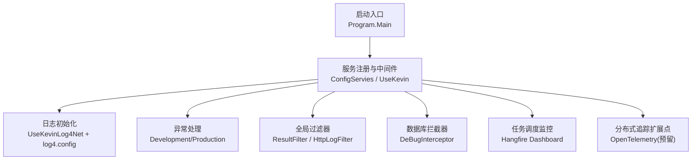
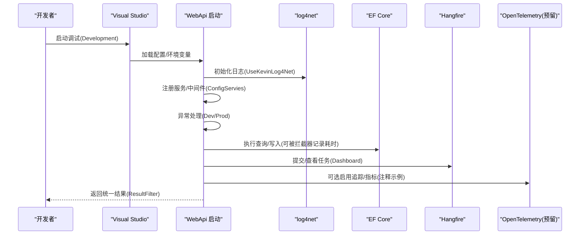
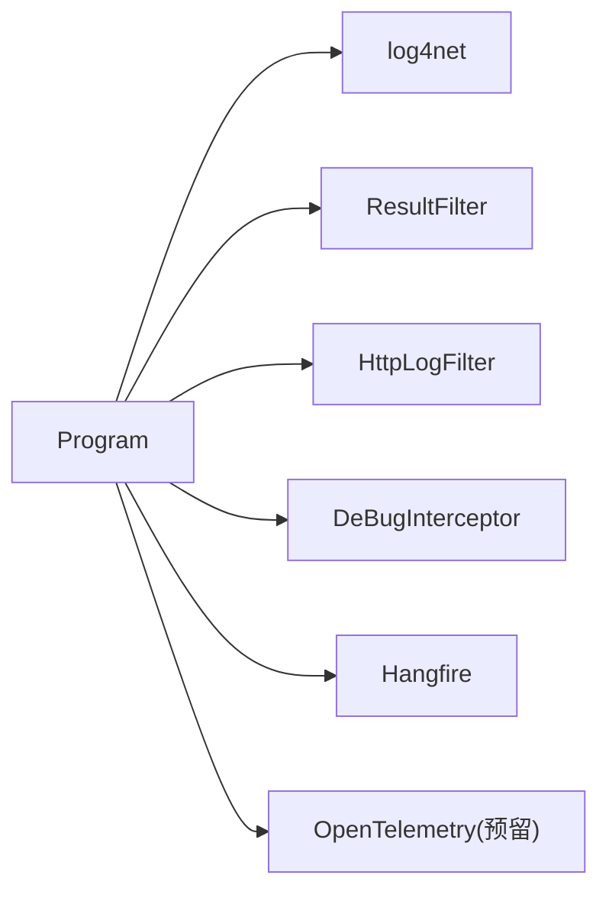

# 调试技巧

<cite>
**本文引用的文件**
- [Program.cs](file://App/WebApi/Program.cs)
- [appsettings.json](file://App/WebApi/appsettings.json)
- [log4.config](file://App/WebApi/LogConfigs/log4.config)
- [launchSettings.json](file://App/WebApi/Properties/launchSettings.json)
- [LogHelper.cs](file://Kevin/kevin.Module/Kevin.log4Net/LogHelper.cs)
- [DeBugInterceptor.cs](file://Kevin/Kevin.EntityFrameworkCore/Interceptors/DeBugInterceptor.cs)
- [HttpLogFilter.cs](file://Kevin/Kevin.Web.Basics/Filters/HttpLogFilter.cs)
- [ResultFilter.cs](file://Kevin/Kevin.Web.Basics/Filters/ResultFilter.cs)
- [ServiceCollectionExtensions.cs（Hangfire）](file://Kevin/kevin.Module/Kevin.Hangfire/ServiceCollectionExtensions.cs)
- [ApplicationBuilderExtensions.cs（Hangfire）](file://Kevin/kevin.Module/Kevin.Hangfire/ApplicationBuilderExtensions.cs)
- [ServiceCollectionExtensions.cs（MCP/OpenTelemetry）](file://Kevin/kevin.Module/Kevin.MCP.Server/ServiceCollectionExtensions.cs)
</cite>

## 目录
1. [简介](#简介)
2. [项目结构](#项目结构)
3. [核心组件](#核心组件)
4. [架构总览](#架构总览)
5. [详细组件分析](#详细组件分析)
6. [依赖关系分析](#依赖关系分析)
7. [性能考虑](#性能考虑)
8. [故障排查指南](#故障排查指南)
9. [结论](#结论)
10. [附录](#附录)

## 简介
本文件面向开发者，提供针对该ABP风格项目的系统化调试指南。内容覆盖：
- 开发环境调试配置与Visual Studio断点使用
- 日志体系与查询方法（级别、格式化、按级别分文件）
- 性能调试工具（内存、CPU、任务调度面板）
- 分布式系统调试（链路追踪、远程调试思路）
- 常见问题定位与解决
- 调试最佳实践与效率提升技巧

## 项目结构
本项目采用分层架构，Web入口在App.WebApi中，日志通过log4net配置，EF Core拦截器用于SQL调试，过滤器统一处理返回格式与HTTP日志，Hangfire提供任务调度监控，OpenTelemetry能力已预留扩展点。

图表来源
- [Program.cs:23-85](file://App/WebApi/Program.cs#L23-L85)
- [log4.config:1-137](file://App/WebApi/LogConfigs/log4.config#L1-L137)
- [DeBugInterceptor.cs:7-35](file://Kevin/Kevin.EntityFrameworkCore/Interceptors/DeBugInterceptor.cs#L7-L35)
- [HttpLogFilter.cs:10-35](file://Kevin/Kevin.Web.Basics/Filters/HttpLogFilter.cs#L10-L35)
- [ResultFilter.cs:13-145](file://Kevin/Kevin.Web.Basics/Filters/ResultFilter.cs#L13-L145)
- [ServiceCollectionExtensions.cs（Hangfire）:21-86](file://Kevin/kevin.Module/Kevin.Hangfire/ServiceCollectionExtensions.cs#L21-L86)
- [ApplicationBuilderExtensions.cs（Hangfire）:14-36](file://Kevin/kevin.Module/Kevin.Hangfire/ApplicationBuilderExtensions.cs#L14-L36)
- [ServiceCollectionExtensions.cs（MCP/OpenTelemetry）:24-38](file://Kevin/kevin.Module/Kevin.MCP.Server/ServiceCollectionExtensions.cs#L24-L38)

章节来源
- [Program.cs:23-85](file://App/WebApi/Program.cs#L23-L85)
- [appsettings.json:1-166](file://App/WebApi/appsettings.json#L1-L166)
- [log4.config:1-137](file://App/WebApi/LogConfigs/log4.config#L1-L137)
- [launchSettings.json:1-36](file://App/WebApi/Properties/launchSettings.json#L1-L36)

## 核心组件
- 启动与中间管线：Program.Main负责环境设置、日志启用、服务注册、异常处理、应用运行。
- 日志系统：基于log4net，按Debug/Info/Warn/Error分文件滚动存储；支持动态按类型生成独立日志文件。
- 数据访问调试：EF Core DbCommandInterceptor捕获命令执行时长，便于慢查询定位。
- 请求级日志：HttpLogFilter记录操作类型与备注；ResultFilter统一响应结构与错误码。
- 任务调度监控：Hangfire支持Redis或内存存储，并提供Dashboard可视化监控。
- 分布式追踪：OpenTelemetry能力以注释形式预留，可按需启用。

章节来源
- [Program.cs:23-85](file://App/WebApi/Program.cs#L23-L85)
- [LogHelper.cs:8-74](file://Kevin/kevin.Module/Kevin.log4Net/LogHelper.cs#L8-L74)
- [DeBugInterceptor.cs:7-35](file://Kevin/Kevin.EntityFrameworkCore/Interceptors/DeBugInterceptor.cs#L7-L35)
- [HttpLogFilter.cs:10-35](file://Kevin/Kevin.Web.Basics/Filters/HttpLogFilter.cs#L10-L35)
- [ResultFilter.cs:13-145](file://Kevin/Kevin.Web.Basics/Filters/ResultFilter.cs#L13-L145)
- [ServiceCollectionExtensions.cs（Hangfire）:21-86](file://Kevin/kevin.Module/Kevin.Hangfire/ServiceCollectionExtensions.cs#L21-L86)
- [ApplicationBuilderExtensions.cs（Hangfire）:14-36](file://Kevin/kevin.Module/Kevin.Hangfire/ApplicationBuilderExtensions.cs#L14-L36)
- [ServiceCollectionExtensions.cs（MCP/OpenTelemetry）:24-38](file://Kevin/kevin.Module/Kevin.MCP.Server/ServiceCollectionExtensions.cs#L24-L38)

## 架构总览
下图展示从请求进入ASP.NET Core到日志、数据库、任务调度的关键路径，以及异常处理的分支。

图表来源
- [Program.cs:23-85](file://App/WebApi/Program.cs#L23-L85)
- [DeBugInterceptor.cs:10-35](file://Kevin/Kevin.EntityFrameworkCore/Interceptors/DeBugInterceptor.cs#L10-L35)
- [ServiceCollectionExtensions.cs（Hangfire）:21-86](file://Kevin/kevin.Module/Kevin.Hangfire/ServiceCollectionExtensions.cs#L21-L86)
- [ServiceCollectionExtensions.cs（MCP/OpenTelemetry）:24-38](file://Kevin/kevin.Module/Kevin.MCP.Server/ServiceCollectionExtensions.cs#L24-L38)

## 详细组件分析

### 启动与调试环境
- 环境变量与端口：launchSettings.json定义Development环境与默认URL；可通过修改ASPNETCORE_ENVIRONMENT切换行为。
- 启动流程：Program.Main中启用日志、注册服务、构建应用、根据环境启用开发异常页或生产异常处理器，并设置GC堆限制。
- 建议：
  - 本地调试优先使用Development，开启DeveloperExceptionPage以便快速定位异常。
  - 通过launchSettings.json为不同场景创建多个Profile（如Docker、IIS Express）。

章节来源
- [launchSettings.json:1-36](file://App/WebApi/Properties/launchSettings.json#L1-L36)
- [Program.cs:23-85](file://App/WebApi/Program.cs#L23-L85)

### 日志体系与查询
- 日志级别与输出：log4.config将Debug/Info/Warn/Error分别输出到对应文件，按日期滚动，单文件最大1MB，最多保留100份。
- 动态日志：LogHelper支持按类型和日期创建独立日志文件，便于隔离问题模块。
- 查询技巧：
  - 按级别筛选：直接打开对应级别日志文件（Debug/Info/Warn/Error）。
  - 按时间范围：文件名包含日期，结合文本搜索工具快速定位。
  - 按线程ID：日志包含线程信息，便于并发问题定位。
  - 按模块：使用LogHelper.GetLog(Type)或LogHelper<T>获取特定类型的日志实例。
- 建议：
  - 开发阶段开启Debug，生产阶段降低级别以减少IO开销。
  - 对热点路径避免过度日志，必要时使用条件开关。

章节来源
- [log4.config:1-137](file://App/WebApi/LogConfigs/log4.config#L1-L137)
- [LogHelper.cs:8-74](file://Kevin/kevin.Module/Kevin.log4Net/LogHelper.cs#L8-L74)

### 数据库调试与慢查询定位
- EF拦截器：DeBugInterceptor实现DbCommandInterceptor，可在ReaderExecuted中统计执行时长，当前示例超过阈值时预留日志记录位置。
- 建议：
  - 在拦截器中接入日志记录慢查询（例如>5秒），并附带SQL与参数。
  - 结合数据库慢查询日志与索引优化进行联合分析。

章节来源
- [DeBugInterceptor.cs:7-35](file://Kevin/Kevin.EntityFrameworkCore/Interceptors/DeBugInterceptor.cs#L7-L35)

### 请求级日志与统一响应
- HTTP日志：HttpLogFilter在结果执行后读取控制器方法的自定义属性，决定是否记录操作类型与备注，并通过服务写入日志表。
- 统一响应：ResultFilter在OnResultExecuting中对返回值进行空值规范化，并将常见状态码转换为统一JSON结构，便于前端一致处理。
- 建议：
  - 对关键接口添加HttpLogAttribute，记录操作类型与备注，便于审计与回溯。
  - 保持ResultFilter的响应结构稳定，减少前端适配成本。

章节来源
- [HttpLogFilter.cs:10-35](file://Kevin/Kevin.Web.Basics/Filters/HttpLogFilter.cs#L10-L35)
- [ResultFilter.cs:13-145](file://Kevin/Kevin.Web.Basics/Filters/ResultFilter.cs#L13-L145)

### 任务调度监控（Hangfire）
- 注册方式：支持Redis或内存存储，提供AddKevinHangfireRedis与AddKevinHangfireMemoryStorage两种注入方式。
- 监控面板：通过ApplicationBuilderExtensions启用Dashboard，便于查看任务队列、重试、失败等状态。
- 建议：
  - 开发环境可使用内存存储快速验证；生产环境建议使用Redis持久化。
  - 定期清理失败任务，关注重复执行与超时任务。

章节来源
- [ServiceCollectionExtensions.cs（Hangfire）:21-86](file://Kevin/kevin.Module/Kevin.Hangfire/ServiceCollectionExtensions.cs#L21-L86)
- [ApplicationBuilderExtensions.cs（Hangfire）:14-36](file://Kevin/kevin.Module/Kevin.Hangfire/ApplicationBuilderExtensions.cs#L14-L36)

### 分布式系统调试（链路追踪与远程调试）
- 链路追踪：MCP模块中预留了OpenTelemetry的启用示例（注释），可按需启用Tracing/Metrics/Logging，并通过OTLP导出器上报。
- 远程调试：
  - Docker：使用publishAllPorts并在IDE中附加到容器进程。
  - IIS/IIS Express：使用launchSettings中的IIS Express Profile进行调试。
- 建议：
  - 在生产或预发环境谨慎启用高开销追踪，按需采样。
  - 结合TraceId与日志关联，跨服务串联问题。

章节来源
- [ServiceCollectionExtensions.cs（MCP/OpenTelemetry）:24-38](file://Kevin/kevin.Module/Kevin.MCP.Server/ServiceCollectionExtensions.cs#L24-L38)
- [launchSettings.json:1-36](file://App/WebApi/Properties/launchSettings.json#L1-L36)

## 依赖关系分析
- Program依赖日志、服务配置、异常处理、中间件与外部资源（数据库、缓存、消息队列等）。
- 过滤器与拦截器作为横切关注点，贯穿请求生命周期。
- Hangfire与OpenTelemetry为可选扩展，按需启用。

图表来源
- [Program.cs:23-85](file://App/WebApi/Program.cs#L23-L85)
- [log4.config:1-137](file://App/WebApi/LogConfigs/log4.config#L1-L137)
- [ResultFilter.cs:13-145](file://Kevin/Kevin.Web.Basics/Filters/ResultFilter.cs#L13-L145)
- [HttpLogFilter.cs:10-35](file://Kevin/Kevin.Web.Basics/Filters/HttpLogFilter.cs#L10-L35)
- [DeBugInterceptor.cs:7-35](file://Kevin/Kevin.EntityFrameworkCore/Interceptors/DeBugInterceptor.cs#L7-L35)
- [ServiceCollectionExtensions.cs（Hangfire）:21-86](file://Kevin/kevin.Module/Kevin.Hangfire/ServiceCollectionExtensions.cs#L21-L86)
- [ServiceCollectionExtensions.cs（MCP/OpenTelemetry）:24-38](file://Kevin/kevin.Module/Kevin.MCP.Server/ServiceCollectionExtensions.cs#L24-L38)

章节来源
- [Program.cs:23-85](file://App/WebApi/Program.cs#L23-L85)
- [ServiceCollectionExtensions.cs（Hangfire）:21-86](file://Kevin/kevin.Module/Kevin.Hangfire/ServiceCollectionExtensions.cs#L21-L86)
- [ServiceCollectionExtensions.cs（MCP/OpenTelemetry）:24-38](file://Kevin/kevin.Module/Kevin.MCP.Server/ServiceCollectionExtensions.cs#L24-L38)

## 性能考虑
- GC堆限制：Program中设置了GCHeapHardLimit，有助于控制托管堆上限，避免OOM。
- 日志IO：生产环境降低日志级别，避免频繁磁盘写入影响吞吐。
- 数据库：利用DeBugInterceptor识别慢查询，配合索引与SQL优化。
- 任务调度：关注Hangfire任务堆积与失败率，合理调整轮询间隔与重试策略。
- 追踪与度量：按需启用OpenTelemetry，避免全量采集造成额外开销。

章节来源
- [Program.cs:79-85](file://App/WebApi/Program.cs#L79-L85)
- [DeBugInterceptor.cs:23-35](file://Kevin/Kevin.EntityFrameworkCore/Interceptors/DeBugInterceptor.cs#L23-L35)
- [ServiceCollectionExtensions.cs（Hangfire）:21-86](file://Kevin/kevin.Module/Kevin.Hangfire/ServiceCollectionExtensions.cs#L21-L86)
- [ServiceCollectionExtensions.cs（MCP/OpenTelemetry）:24-38](file://Kevin/kevin.Module/Kevin.MCP.Server/ServiceCollectionExtensions.cs#L24-L38)

## 故障排查指南
- 启动失败：检查环境变量与连接字符串（数据库、Redis、RabbitMQ等），确认服务可用。
- 日志为空：确认log4.config是否生效，检查Log目录权限与滚动策略。
- 慢查询：在DeBugInterceptor中启用慢查询日志，结合数据库慢查询日志分析。
- 任务失败：通过Hangfire Dashboard查看失败原因与重试次数，必要时调整配置或业务逻辑。
- 异常未捕获：确认异常处理中间件顺序，确保在开发/生产环境下均能正确输出。
- 分布式问题：启用OpenTelemetry追踪，结合TraceId在日志中关联上下游调用。

章节来源
- [Program.cs:66-85](file://App/WebApi/Program.cs#L66-L85)
- [log4.config:1-137](file://App/WebApi/LogConfigs/log4.config#L1-L137)
- [DeBugInterceptor.cs:23-35](file://Kevin/Kevin.EntityFrameworkCore/Interceptors/DeBugInterceptor.cs#L23-L35)
- [ServiceCollectionExtensions.cs（Hangfire）:21-86](file://Kevin/kevin.Module/Kevin.Hangfire/ServiceCollectionExtensions.cs#L21-L86)
- [ServiceCollectionExtensions.cs（MCP/OpenTelemetry）:24-38](file://Kevin/kevin.Module/Kevin.MCP.Server/ServiceCollectionExtensions.cs#L24-L38)

## 结论
本项目提供了完善的调试基础设施：清晰的启动流程、分级日志、数据库拦截器、统一响应与HTTP日志、任务调度监控以及可扩展的分布式追踪能力。遵循本文的调试方法与最佳实践，可显著提升问题定位效率与系统稳定性。

## 附录

### Visual Studio调试设置与断点使用
- 启动配置：使用launchSettings.json中的Development Profile，自动启用开发异常页。
- 断点建议：
  - 在Program.Main、过滤器、服务层、仓储层设置断点，逐步跟踪请求生命周期。
  - 在DeBugInterceptor中打断点，观察SQL执行与耗时。
  - 在Hangfire任务执行处设置断点，验证异步任务逻辑。
- 条件断点：按用户、租户或请求ID过滤，减少无关中断。
- 日志辅助：在关键路径输出结构化日志，结合TraceId关联多次调用。

章节来源
- [launchSettings.json:1-36](file://App/WebApi/Properties/launchSettings.json#L1-L36)
- [Program.cs:23-85](file://App/WebApi/Program.cs#L23-L85)
- [DeBugInterceptor.cs:7-35](file://Kevin/Kevin.EntityFrameworkCore/Interceptors/DeBugInterceptor.cs#L7-L35)

### 日志分析方法
- 级别配置：log4.config中按级别分文件，便于快速定位错误与警告。
- 格式化：PatternLayout包含时间、线程、级别、对象、内容等字段，利于检索与分析。
- 查询技巧：
  - 使用文本编辑器或日志工具按时间、级别、线程、关键字筛选。
  - 结合TraceId在分布式场景中串联日志。
  - 对高频接口降低日志级别，避免噪音。

章节来源
- [log4.config:1-137](file://App/WebApi/LogConfigs/log4.config#L1-L137)
- [LogHelper.cs:8-74](file://Kevin/kevin.Module/Kevin.log4Net/LogHelper.cs#L8-L74)

### 性能调试工具
- 内存分析：使用Visual Studio诊断工具或dotnet-counters/dotnet-trace采集内存快照与GC事件。
- CPU分析：使用性能分析器定位热点方法，结合ResultFilter与HttpLogFilter缩小范围。
- 监控面板：Hangfire Dashboard查看任务执行情况；Redis与MySQL可使用专用工具监控。

章节来源
- [ServiceCollectionExtensions.cs（Hangfire）:21-86](file://Kevin/kevin.Module/Kevin.Hangfire/ServiceCollectionExtensions.cs#L21-L86)
- [ApplicationBuilderExtensions.cs（Hangfire）:14-36](file://Kevin/kevin.Module/Kevin.Hangfire/ApplicationBuilderExtensions.cs#L14-L36)

### 分布式系统调试方法
- 链路追踪：启用OpenTelemetry（参考MCP模块中的注释示例），采集ASP.NET Core与HTTP客户端的自动仪器化数据，并通过OTLP导出。
- 远程调试：Docker模式下发布所有端口，IDE附加到容器进程；IIS Express模式可直接调试。
- 建议：在生产环境谨慎启用全量追踪，结合采样策略降低开销。

章节来源
- [ServiceCollectionExtensions.cs（MCP/OpenTelemetry）:24-38](file://Kevin/kevin.Module/Kevin.MCP.Server/ServiceCollectionExtensions.cs#L24-L38)
- [launchSettings.json:1-36](file://App/WebApi/Properties/launchSettings.json#L1-L36)

### 常见问题与解决方案
- 数据库连接失败：检查连接字符串与服务可用性。
- Redis连接失败：检查连接字符串、密码与网络连通性。
- Qdrant连接失败：检查地址与端口配置。
- Hangfire任务失败：查看Dashboard失败详情，调整重试与超时策略。
- 日志缺失：确认log4net配置与目录权限。

章节来源
- [appsettings.json:1-166](file://App/WebApi/appsettings.json#L1-L166)
- [ServiceCollectionExtensions.cs（Hangfire）:21-86](file://Kevin/kevin.Module/Kevin.Hangfire/ServiceCollectionExtensions.cs#L21-L86)
- [log4.config:1-137](file://App/WebApi/LogConfigs/log4.config#L1-L137)

### 调试最佳实践
- 明确环境：Development开启详细异常与调试信息，Production关闭敏感信息并降低日志级别。
- 结构化日志：统一日志格式，包含时间、线程、级别、上下文与TraceId。
- 精准断点：使用条件断点与日志辅助，减少无效中断。
- 性能意识：避免在热路径打印过多日志，合理使用异步与批处理。
- 可观测性：结合Hangfire、OpenTelemetry与数据库监控，形成完整的问题定位闭环。