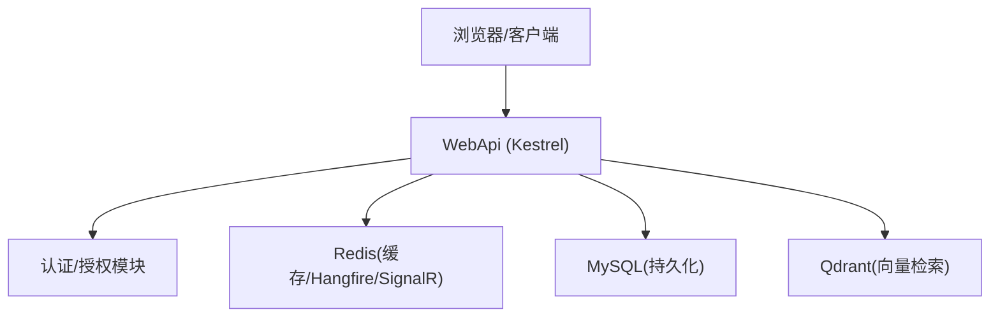
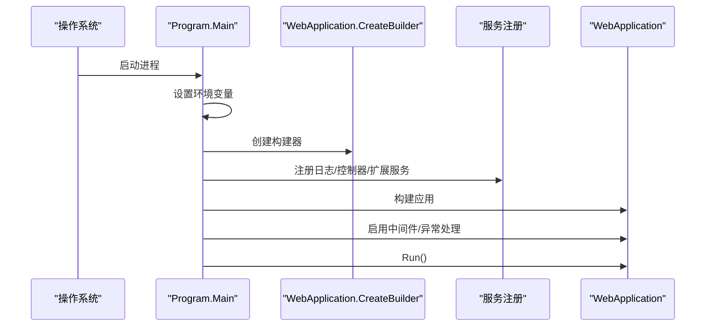
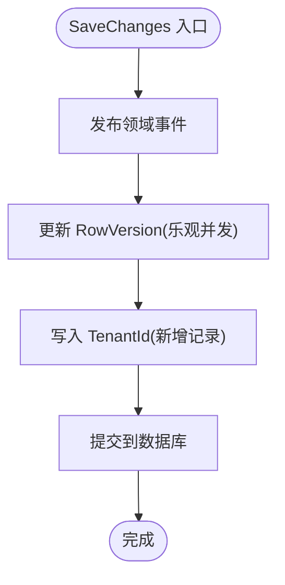
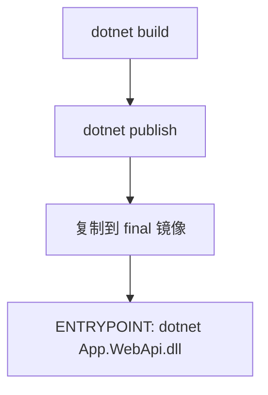
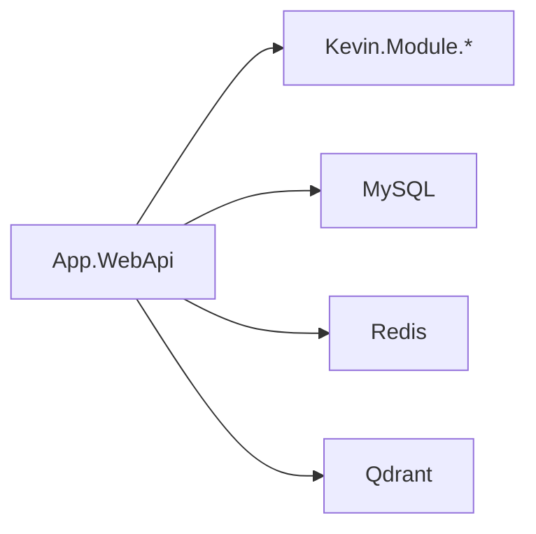

# 快速开始

<cite>
**本文引用的文件**
- [Program.cs](file://App/WebApi/Program.cs)
- [appsettings.json](file://App/WebApi/appsettings.json)
- [appsettings.Development.json](file://App/WebApi/appsettings.Development.json)
- [环境变量设置.txt](file://Doc/项目相关/环境变量设置.txt)
- [KevinDbContext.cs](file://Kevin/Kevin.EntityFrameworkCore/Database/KevinDbContext.cs)
- [TUserBaseData.cs](file://Kevin/Domain/BaseDatas/TUserBaseData.cs)
- [TRoleBaseData.cs](file://Kevin/Domain/BaseDatas/TRoleBaseData.cs)
- [Dockerfile](file://App/WebApi/Dockerfile)
- [docker说明.txt](file://Doc/项目相关/docker说明.txt)
- [SYSTEM_DOCUMENTATION.md](file://SYSTEM_DOCUMENTATION.md)
</cite>

## 目录
1. [简介](#简介)
2. [环境要求与依赖](#环境要求与依赖)
3. [数据库与缓存配置](#数据库与缓存配置)
4. [环境变量设置](#环境变量设置)
5. [首次运行（从零到可访问）](#首次运行从零到可访问)
6. [默认账户与功能验证](#默认账户与功能验证)
7. [架构概览](#架构概览)
8. [详细组件分析](#详细组件分析)
9. [依赖关系分析](#依赖关系分析)
10. [性能与启动优化建议](#性能与启动优化建议)
11. [故障排除指南](#故障排除指南)
12. [结论](#结论)

## 简介
本指南面向初次接触 NetCoreKevin 的开发者，目标是帮助你在最短时间内完成本地开发环境的搭建、数据库初始化、服务启动与基础功能验证。你将了解：
- 需要安装的环境与版本
- 如何配置 MySQL、Redis、Qdrant
- 如何通过命令行或容器方式启动后端服务
- 如何使用默认管理员账号登录并体验核心功能

## 环境要求与依赖
- .NET SDK 9.0+（用于构建与运行 WebApi）
- MySQL 8.0+（数据存储，EF Core 使用 MySQL 提供程序）
- Redis 7.0+（缓存、Hangfire、SignalR 等）
- Qdrant 1.7+（向量检索，AI/RAG 能力）
- 可选：Docker（用于容器化运行与编排）

说明：
- 应用通过配置文件读取连接串与外部服务地址，默认监听端口由 Kestrel 决定；容器镜像中强制暴露 8080 端口。
- 日志框架使用 log4net，便于定位问题。

章节来源
- [Dockerfile:4-9](file://App/WebApi/Dockerfile#L4-L9)
- [KevinDbContext.cs:108-112](file://Kevin/Kevin.EntityFrameworkCore/Database/KevinDbContext.cs#L108-L112)
- [appsettings.json:12-15](file://App/WebApi/appsettings.json#L12-L15)

## 数据库与缓存配置
- 数据库连接串
  - 在 appsettings.json 或 appsettings.Development.json 的 ConnectionStrings.dbConnection 中配置 MySQL 连接信息（服务器、端口、数据库名、用户名、密码等）。
  - EF Core 使用 MySQL 提供程序，并在 OnModelCreating 中自动注册种子数据配置。
- 缓存连接串
  - ConnectionStrings.redisConnection 用于缓存、Hangfire、SignalR 等模块。
- Hangfire 与 SignalR 的 Redis 配置
  - HangfireSetting.HangfireRedisSetting 与 SignalrRdisSetting 分别配置 Hangfire 与 SignalR 使用的 Redis 实例与键前缀等。
- Qdrant 客户端
  - QdrantClientSetting.Url 指向 Qdrant 服务地址，供 AI/RAG 模块使用。

提示：
- 若本地使用 Docker 运行 MySQL/Redis/Qdrant，请确保端口映射正确，并在配置中填写宿主机可达的地址。
- 若使用容器部署，ASP.NET 进程会监听 8080 端口（可通过 ASPNETCORE_URLS 覆盖）。

章节来源
- [appsettings.json:12-20](file://App/WebApi/appsettings.json#L12-L20)
- [appsettings.json:37-45](file://App/WebApi/appsettings.json#L37-L45)
- [appsettings.json:133-135](file://App/WebApi/appsettings.json#L133-L135)
- [KevinDbContext.cs:108-112](file://Kevin/Kevin.EntityFrameworkCore/Database/KevinDbContext.cs#L108-L112)

## 环境变量设置
- 环境变量 ASPNETCORE_ENVIRONMENT 控制加载的配置集（Development/Test/Production）。
- Windows PowerShell 示例：$env:ASPNETCORE_ENVIRONMENT = "Development"
- Linux/macOS 示例：export ASPNETCORE_ENVIRONMENT=Development
- 应用启动时会读取该环境变量以选择对应环境的配置文件。

章节来源
- [环境变量设置.txt:1-16](file://Doc/项目相关/环境变量设置.txt#L1-L16)
- [Program.cs:27-29](file://App/WebApi/Program.cs#L27-L29)

## 首次运行（从零到可访问）
步骤总览：
1) 准备依赖服务
   - 启动 MySQL 8.0+，创建数据库 kevin_app（或使用你配置的数据库名），确保用户具备读写权限。
   - 启动 Redis 7.0+，确认端口与密码与配置一致。
   - 启动 Qdrant 1.7+，确认地址与 QdrantClientSetting 一致。
2) 配置连接串与环境
   - 在 appsettings.Development.json 中设置 dbConnection、redisConnection、QdrantClientSetting 等。
   - 设置环境变量 ASPNETCORE_ENVIRONMENT=Development。
3) 执行数据库迁移与种子数据
   - 将默认项目设置为 Kevin.EntityFrameworkCore。
   - 执行添加迁移与应用迁移命令，使表结构与种子数据生效。
4) 启动后端服务
   - 命令行：进入 App/WebApi 目录，执行 dotnet run --environment Development。
   - 或在 Visual Studio 中将 App.WebApi 设为启动项目并按 F5。
5) 访问服务
   - API 文档：http://localhost:9901/swagger（如未修改端口）
   - Hangfire 面板：http://localhost:9901/pchangfire（如已启用）
6) 前端（可选）
   - 如需体验前端界面，可在 vue/kevin.web.vue 目录下按前端工程方式启动，并确保跨域与后端地址配置正确。

注意：
- 若使用 Docker 运行后端，镜像默认暴露 8080 端口，可通过 -p 映射到宿主机端口。
- 若出现 CORS 限制，检查 CorsSetting 中的 IP 列表是否包含前端地址。

章节来源
- [SYSTEM_DOCUMENTATION.md:116-185](file://SYSTEM_DOCUMENTATION.md#L116-L185)
- [Program.cs:23-85](file://App/WebApi/Program.cs#L23-L85)
- [Dockerfile:4-9](file://App/WebApi/Dockerfile#L4-L9)

## 默认账户与功能验证
- 默认管理员账户
  - 用户名：admin
  - 密码：123456
  - 租户：1000（默认初始化租户）
- 验证方法
  - 打开 Swagger 文档，调用鉴权相关接口获取令牌后，再调用受保护接口进行验证。
  - 或通过前端登录页面输入默认账号密码，登录后访问系统管理菜单（如用户、角色、字典、日志等）。
- 种子数据
  - 应用会在 EF Core 模型构建阶段注册种子数据配置，包括用户、角色、租户、字典等。

章节来源
- [TUserBaseData.cs:12-15](file://Kevin/Domain/BaseDatas/TUserBaseData.cs#L12-L15)
- [TRoleBaseData.cs:7-11](file://Kevin/Domain/BaseDatas/TRoleBaseData.cs#L7-L11)
- [KevinDbContext.cs:290-303](file://Kevin/Kevin.EntityFrameworkCore/Database/KevinDbContext.cs#L290-L303)
- [SYSTEM_DOCUMENTATION.md:181-185](file://SYSTEM_DOCUMENTATION.md#L181-L185)

## 架构概览
下图展示了从浏览器/客户端到后端 API、再到数据库与缓存的关键交互路径。

图表来源
- [Program.cs:23-85](file://App/WebApi/Program.cs#L23-L85)
- [appsettings.json:12-20](file://App/WebApi/appsettings.json#L12-L20)
- [appsettings.json:133-135](file://App/WebApi/appsettings.json#L133-L135)
- [KevinDbContext.cs:108-112](file://Kevin/Kevin.EntityFrameworkCore/Database/KevinDbContext.cs#L108-L112)

## 详细组件分析
### 启动流程（Program 主入口）
- 设置环境变量并读取配置
- 注册日志、控制器、全局中间件
- 构建应用并运行
- 开发环境启用开发者异常页，生产环境启用统一异常处理

图表来源
- [Program.cs:23-85](file://App/WebApi/Program.cs#L23-L85)

章节来源
- [Program.cs:23-85](file://App/WebApi/Program.cs#L23-L85)

### 数据库上下文与种子数据
- DbContext 使用 MySQL 提供程序，并自动扫描实体类型、设置表名前缀与字段注释
- 在 OnModelCreating 中注册种子数据配置（用户、角色、租户、字典等）
- SaveChanges 中处理领域事件发布、乐观并发、多租户字段注入

图表来源
- [KevinDbContext.cs:405-483](file://Kevin/Kevin.EntityFrameworkCore/Database/KevinDbContext.cs#L405-L483)
- [KevinDbContext.cs:290-303](file://Kevin/Kevin.EntityFrameworkCore/Database/KevinDbContext.cs#L290-L303)

章节来源
- [KevinDbContext.cs:83-133](file://Kevin/Kevin.EntityFrameworkCore/Database/KevinDbContext.cs#L83-L133)
- [KevinDbContext.cs:165-303](file://Kevin/Kevin.EntityFrameworkCore/Database/KevinDbContext.cs#L165-L303)
- [KevinDbContext.cs:405-483](file://Kevin/Kevin.EntityFrameworkCore/Database/KevinDbContext.cs#L405-L483)

### 容器化运行（Docker）
- 基础镜像使用 aspnet:9.0，工作目录 /app，暴露 8080 端口
- 构建阶段恢复依赖、编译并发布
- 最终镜像仅包含发布产物，入口为 dotnet App.WebApi.dll

图表来源
- [Dockerfile:13-66](file://App/WebApi/Dockerfile#L13-L66)
- [Dockerfile:69-74](file://App/WebApi/Dockerfile#L69-L74)

章节来源
- [Dockerfile:4-9](file://App/WebApi/Dockerfile#L4-L9)
- [Dockerfile:13-66](file://App/WebApi/Dockerfile#L13-L66)
- [Dockerfile:69-74](file://App/WebApi/Dockerfile#L69-L74)

## 依赖关系分析
- 运行时依赖
  - .NET Runtime（由镜像提供）
  - MySQL（持久化）
  - Redis（缓存、任务队列、实时通信）
  - Qdrant（向量检索）
- 配置依赖
  - appsettings.* 与环境变量共同决定行为
  - MigrationsAssembly 指定 EF 迁移程序集
- 模块依赖
  - WebApi 依赖 Kevin.Module 下的多个子模块（认证、缓存、日志、权限、SignalR、RAG 等）

图表来源
- [appsettings.json:9-15](file://App/WebApi/appsettings.json#L9-L15)
- [appsettings.json:133-135](file://App/WebApi/appsettings.json#L133-L135)
- [KevinDbContext.cs:108-112](file://Kevin/Kevin.EntityFrameworkCore/Database/KevinDbContext.cs#L108-L112)

章节来源
- [appsettings.json:9-15](file://App/WebApi/appsettings.json#L9-L15)
- [appsettings.json:133-135](file://App/WebApi/appsettings.json#L133-L135)

## 性能与启动优化建议
- 合理设置连接池与超时参数（MySQL 连接串中的 Command Timeout 等）
- 使用 Redis 作为缓存与会话存储，降低数据库压力
- 在生产环境关闭不必要的调试中间件，启用统一异常处理
- 根据业务量调整 Hangfire 与 SignalR 的 Redis 分库与键前缀，避免冲突
- 如需 HTTPS，可在 Kestrel 中绑定证书并启用默认 HTTPS 配置

[本节为通用建议，不直接分析具体代码]

## 故障排除指南
常见问题与排查要点：
- 无法连接数据库
  - 检查 MySQL 是否启动、端口是否正确、用户名密码与数据库名是否与配置一致
  - 查看 appsettings.* 中 ConnectionStrings.dbConnection
  - 确认防火墙与安全组放行端口
- 无法连接 Redis
  - 检查 Redis 是否启动、端口与密码是否与 redisConnection 一致
  - Hangfire/SignalR 相关配置是否指向正确的 Redis 实例
- Qdrant 不可用导致 AI/RAG 功能异常
  - 检查 QdrantClientSetting.Url 是否可访问
  - 确认网络连通性与防火墙策略
- 启动时报错或端口占用
  - 使用 ASPNETCORE_URLS 指定监听地址与端口
  - 在容器中通过 -p 映射端口，确保宿主机端口未被占用
- 权限或登录失败
  - 确认已执行数据库迁移并生成种子数据
  - 使用默认管理员账号登录（admin/123456，租户 1000）

章节来源
- [appsettings.json:12-20](file://App/WebApi/appsettings.json#L12-L20)
- [appsettings.json:133-135](file://App/WebApi/appsettings.json#L133-L135)
- [KevinDbContext.cs:290-303](file://Kevin/Kevin.EntityFrameworkCore/Database/KevinDbContext.cs#L290-L303)
- [docker说明.txt:1-44](file://Doc/项目相关/docker说明.txt#L1-L44)

## 结论
通过以上步骤，你可以在本地快速搭建 NetCoreKevin 的开发环境并完成首次运行。建议后续：
- 完善各环境（Development/Test/Production）的配置差异
- 按需启用或配置第三方服务（短信、邮件、云存储等）
- 结合前端工程进行联调与功能验证
- 在生产环境做好安全加固、监控与备份策略