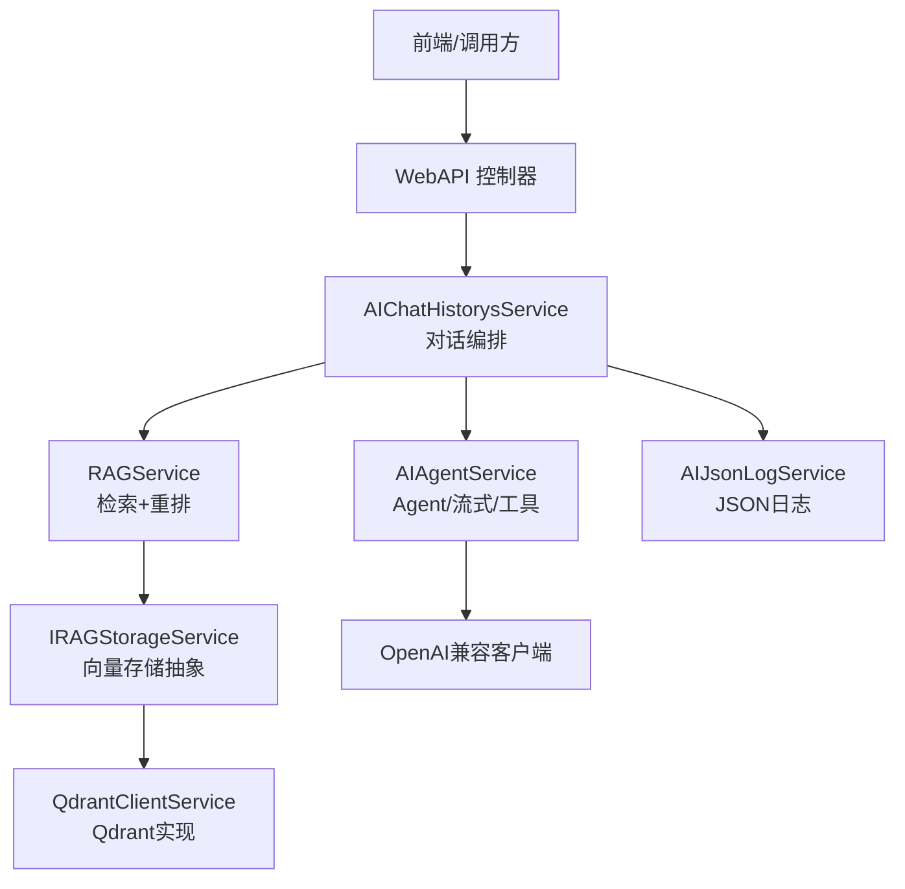
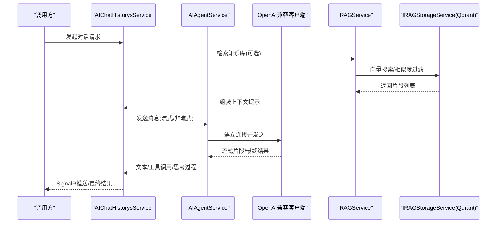
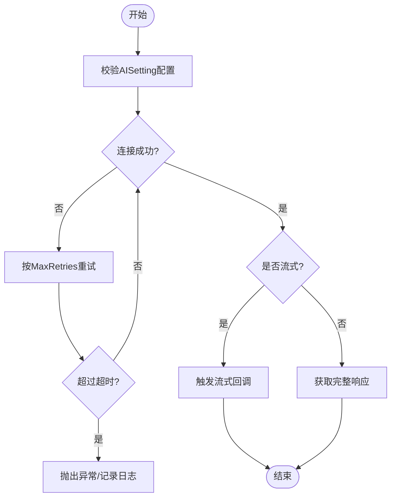
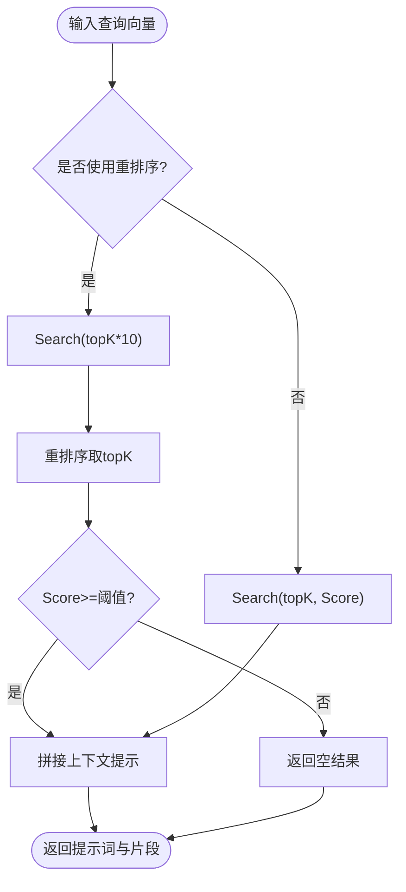
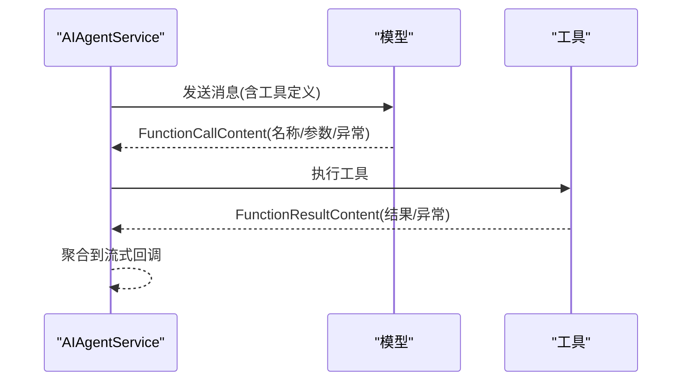
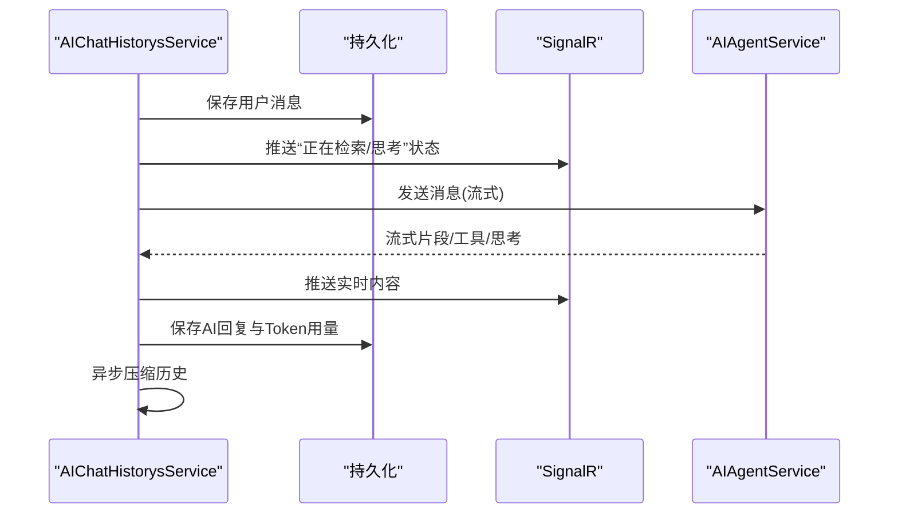
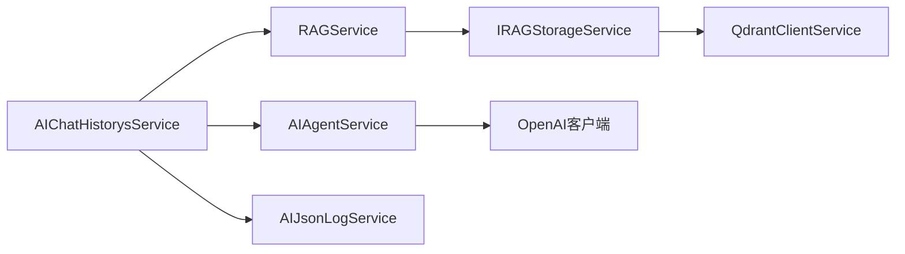

# AI服务问题

<cite>
**本文引用的文件**
- [AISetting.cs](file://Kevin/kevin.Module/kevin.AI.AgentFramework/AISetting.cs)
- [AIAgentService.cs](file://Kevin/kevin.Module/kevin.AI.AgentFramework/AIAgentService.cs)
- [AIChatHistorysService.cs](file://Kevin/Application/Services/AI/AIChatHistorysService.cs)
- [RAGService.cs](file://Kevin/kevin.Module/Kevin.RAG/RAGService.cs)
- [IRAGStorageService.cs](file://Kevin/kevin.Module/Kevin.RAG/Interfaces/IRAGStorageService.cs)
- [QdrantClientSetting.cs](file://Kevin/kevin.Module/Kevin.RAG/Qdrant/Models/QdrantClientSetting.cs)
- [QdrantClientService.cs](file://Kevin/kevin.Module/Kevin.RAG/Qdrant/QdrantClientService.cs)
- [AIJsonLogService.cs](file://Kevin/Application/Services/AI/AIJsonLogService.cs)
- [Program.cs](file://App/WebApi/Program.cs)
</cite>

## 目录
1. [简介](#简介)
2. [项目结构](#项目结构)
3. [核心组件](#核心组件)
4. [架构总览](#架构总览)
5. [详细组件分析](#详细组件分析)
6. [依赖关系分析](#依赖关系分析)
7. [性能考虑](#性能考虑)
8. [故障排除指南](#故障排除指南)
9. [结论](#结论)
10. [附录](#附录)

## 简介
本故障排除文档面向AI服务相关问题，覆盖以下场景：
- AI模型调用失败（网络、鉴权、超时、重试）
- 知识库检索异常（向量数据库连接、集合创建、相似度阈值、重排序）
- 工具执行错误（函数调用与结果回调、自动审批规则）
- 对话历史保存、消息处理与流式响应异常
- Qdrant连接问题排查（集合管理、向量搜索、相似度过滤）

目标是帮助快速定位根因并给出可操作的修复步骤。

## 项目结构
AI能力由多层模块协作完成：
- 应用层服务：AI对话入口、知识库检索、日志记录、消息压缩等
- Agent框架：封装OpenAI兼容客户端、流式输出、工具调用、重试策略
- RAG模块：向量存储抽象接口、RAG编排、重排序服务
- Qdrant实现：向量数据库客户端配置与服务
- WebAPI启动：全局异常处理、中间件初始化

图表来源
- [AIChatHistorysService.cs:180-236](file://Kevin/Application/Services/AI/AIChatHistorysService.cs#L180-L236)
- [AIAgentService.cs:37-195](file://Kevin/kevin.Module/kevin.AI.AgentFramework/AIAgentService.cs#L37-L195)
- [RAGService.cs:19-78](file://Kevin/kevin.Module/Kevin.RAG/RAGService.cs#L19-L78)
- [IRAGStorageService.cs:6-26](file://Kevin/kevin.Module/Kevin.RAG/Interfaces/IRAGStorageService.cs#L6-L26)
- [QdrantClientService.cs](file://Kevin/kevin.Module/Kevin.RAG/Qdrant/QdrantClientService.cs)

章节来源
- [Program.cs:66-95](file://App/WebApi/Program.cs#L66-L95)
- [AIChatHistorysService.cs:180-236](file://Kevin/Application/Services/AI/AIChatHistorysService.cs#L180-L236)
- [AIAgentService.cs:37-195](file://Kevin/kevin.Module/kevin.AI.AgentFramework/AIAgentService.cs#L37-L195)
- [RAGService.cs:19-78](file://Kevin/kevin.Module/Kevin.RAG/RAGService.cs#L19-L78)
- [IRAGStorageService.cs:6-26](file://Kevin/kevin.Module/Kevin.RAG/Interfaces/IRAGStorageService.cs#L6-L26)

## 核心组件
- AISetting：集中配置AI端点、密钥、默认模型、是否启用工具/技能、最大重试次数、网络超时、流式开关及各类回调
- AIAgentService：构建OpenAI兼容客户端，支持流式与非流式调用；处理工具调用、思考过程提取、Token用量统计、异常重试
- AIChatHistorysService：对话主流程，整合知识库检索、文件处理、联网搜索、消息压缩、流式推送、日志记录
- RAGService：根据是否使用重排序服务，选择不同检索路径，组装系统提示词
- IRAGStorageService：向量存储抽象，提供新增与搜索
- QdrantClientService/QdrantClientSetting：Qdrant连接参数与客户端实现
- AIJsonLogService：持久化AI相关JSON日志，便于回溯

章节来源
- [AISetting.cs:1-64](file://Kevin/kevin.Module/kevin.AI.AgentFramework/AISetting.cs#L1-L64)
- [AIAgentService.cs:37-195](file://Kevin/kevin.Module/kevin.AI.AgentFramework/AIAgentService.cs#L37-L195)
- [AIChatHistorysService.cs:110-262](file://Kevin/Application/Services/AI/AIChatHistorysService.cs#L110-L262)
- [RAGService.cs:19-78](file://Kevin/kevin.Module/Kevin.RAG/RAGService.cs#L19-L78)
- [IRAGStorageService.cs:6-26](file://Kevin/kevin.Module/Kevin.RAG/Interfaces/IRAGStorageService.cs#L6-L26)
- [QdrantClientSetting.cs](file://Kevin/kevin.Module/Kevin.RAG/Qdrant/Models/QdrantClientSetting.cs)
- [QdrantClientService.cs](file://Kevin/kevin.Module/Kevin.RAG/Qdrant/QdrantClientService.cs)
- [AIJsonLogService.cs:23-65](file://Kevin/Application/Services/AI/AIJsonLogService.cs#L23-L65)

## 架构总览
AI对话请求从控制器进入应用服务，应用服务负责：
- 读取智能体配置与模型信息
- 可选进行知识库检索与文件解析
- 构造消息与选项，调用Agent服务
- 流式或非流式接收响应，通过SignalR推送
- 异步压缩对话历史并落库
- 记录HTTP/JSON日志以便诊断

图表来源
- [AIChatHistorysService.cs:180-236](file://Kevin/Application/Services/AI/AIChatHistorysService.cs#L180-L236)
- [AIAgentService.cs:96-195](file://Kevin/kevin.Module/kevin.AI.AgentFramework/AIAgentService.cs#L96-L195)
- [RAGService.cs:44-78](file://Kevin/kevin.Module/Kevin.RAG/RAGService.cs#L44-L78)
- [IRAGStorageService.cs:15-26](file://Kevin/kevin.Module/Kevin.RAG/Interfaces/IRAGStorageService.cs#L15-L26)

## 详细组件分析

### AI模型调用失败（网络/鉴权/超时/重试）
- 检查AISetting中AIUrl、AIKeySecret、AIDefaultModel是否正确
- 确认NetworkTimeout与MaxRetries设置合理
- 若IsStreame为true，需确保回调已注册且下游能消费流式数据
- 关注AIAgentService中的异常捕获与重试逻辑，必要时调整重试策略或关闭工具/技能以隔离问题

图表来源
- [AISetting.cs:1-64](file://Kevin/kevin.Module/kevin.AI.AgentFramework/AISetting.cs#L1-L64)
- [AIAgentService.cs:45-53](file://Kevin/kevin.Module/kevin.AI.AgentFramework/AIAgentService.cs#L45-L53)
- [AIAgentService.cs:96-195](file://Kevin/kevin.Module/kevin.AI.AgentFramework/AIAgentService.cs#L96-L195)

章节来源
- [AISetting.cs:1-64](file://Kevin/kevin.Module/kevin.AI.AgentFramework/AISetting.cs#L1-L64)
- [AIAgentService.cs:45-53](file://Kevin/kevin.Module/kevin.AI.AgentFramework/AIAgentService.cs#L45-L53)
- [AIAgentService.cs:96-195](file://Kevin/kevin.Module/kevin.AI.AgentFramework/AIAgentService.cs#L96-L195)

### 知识库检索异常（向量数据库/相似度/重排序）
- 确认RAGService在isRerankModel分支下正确注入重排序服务
- 检查IRAGStorageService.Search的limit与Score阈值是否符合预期
- 若未找到文档，会返回“无相关信息”的系统提示，需核对集合名与嵌入维度
- 重排序时注意topK与Score过滤顺序，避免误删有效片段

图表来源
- [RAGService.cs:19-78](file://Kevin/kevin.Module/Kevin.RAG/RAGService.cs#L19-L78)
- [IRAGStorageService.cs:15-26](file://Kevin/kevin.Module/Kevin.RAG/Interfaces/IRAGStorageService.cs#L15-L26)

章节来源
- [RAGService.cs:19-78](file://Kevin/kevin.Module/Kevin.RAG/RAGService.cs#L19-L78)
- [IRAGStorageService.cs:6-26](file://Kevin/kevin.Module/Kevin.RAG/Interfaces/IRAGStorageService.cs#L6-L26)

### 工具执行错误（函数调用/结果回调/自动审批）
- 流式模式下，工具调用与结果分别通过FunctionCallContent与FunctionResultContent回调上报
- 若工具被禁用(IsAITools=false)，将清空Tools以避免模型尝试调用
- 自动审批规则默认允许所有工具，生产环境建议收紧规则
- 当工具执行出现异常，回调中会包含异常信息，便于定位

图表来源
- [AIAgentService.cs:112-130](file://Kevin/kevin.Module/kevin.AI.AgentFramework/AIAgentService.cs#L112-L130)
- [AIAgentService.cs:54-69](file://Kevin/kevin.Module/kevin.AI.AgentFramework/AIAgentService.cs#L54-L69)

章节来源
- [AIAgentService.cs:54-69](file://Kevin/kevin.Module/kevin.AI.AgentFramework/AIAgentService.cs#L54-L69)
- [AIAgentService.cs:112-130](file://Kevin/kevin.Module/kevin.AI.AgentFramework/AIAgentService.cs#L112-L130)

### 对话历史保存、消息处理与流式响应
- 对话创建时会先写入用户消息，再写入AI回复，并更新会话标题
- 流式响应通过SignalR实时推送，同时累积工具与思考过程内容
- 异步执行消息压缩，将多轮对话压缩为摘要，减少后续上下文长度
- 若启用HTTP日志拦截，可在调试阶段抓取原始请求/响应

图表来源
- [AIChatHistorysService.cs:110-262](file://Kevin/Application/Services/AI/AIChatHistorysService.cs#L110-L262)
- [AIChatHistorysService.cs:473-596](file://Kevin/Application/Services/AI/AIChatHistorysService.cs#L473-L596)
- [AIAgentService.cs:96-195](file://Kevin/kevin.Module/kevin.AI.AgentFramework/AIAgentService.cs#L96-L195)

章节来源
- [AIChatHistorysService.cs:110-262](file://Kevin/Application/Services/AI/AIChatHistorysService.cs#L110-L262)
- [AIChatHistorysService.cs:473-596](file://Kevin/Application/Services/AI/AIChatHistorysService.cs#L473-L596)
- [AIAgentService.cs:96-195](file://Kevin/kevin.Module/kevin.AI.AgentFramework/AIAgentService.cs#L96-L195)

### Qdrant连接与集合问题排查
- 检查QdrantClientSetting中的连接地址、端口、TLS等配置
- 确认IRAGStorageService.Search使用的集合名与RAGService传入一致（如“AIKmss-{id}”）
- 若向量维度不匹配或集合不存在，会导致搜索失败；需在入库前确保集合创建与维度一致
- 相似度阈值Score用于过滤低相关片段，过低可能引入噪声，过高可能导致无结果

章节来源
- [QdrantClientSetting.cs](file://Kevin/kevin.Module/Kevin.RAG/Qdrant/Models/QdrantClientSetting.cs)
- [QdrantClientService.cs](file://Kevin/kevin.Module/Kevin.RAG/Qdrant/QdrantClientService.cs)
- [RAGService.cs:44-78](file://Kevin/kevin.Module/Kevin.RAG/RAGService.cs#L44-L78)
- [IRAGStorageService.cs:15-26](file://Kevin/kevin.Module/Kevin.RAG/Interfaces/IRAGStorageService.cs#L15-L26)

## 依赖关系分析
- AIChatHistorysService依赖AIAgentService、RAGService、SignalR、文件处理、知识库服务等
- AIAgentService依赖OpenAI兼容客户端与日志记录
- RAGService依赖IRAGStorageService与可选的重排序服务
- Qdrant作为IRAGStorageService的具体实现，提供向量检索能力
- Program负责全局异常处理与中间件初始化

图表来源
- [AIChatHistorysService.cs:180-236](file://Kevin/Application/Services/AI/AIChatHistorysService.cs#L180-L236)
- [AIAgentService.cs:37-195](file://Kevin/kevin.Module/kevin.AI.AgentFramework/AIAgentService.cs#L37-L195)
- [RAGService.cs:19-78](file://Kevin/kevin.Module/Kevin.RAG/RAGService.cs#L19-L78)
- [IRAGStorageService.cs:6-26](file://Kevin/kevin.Module/Kevin.RAG/Interfaces/IRAGStorageService.cs#L6-L26)
- [QdrantClientService.cs](file://Kevin/kevin.Module/Kevin.RAG/Qdrant/QdrantClientService.cs)
- [AIJsonLogService.cs:23-65](file://Kevin/Application/Services/AI/AIJsonLogService.cs#L23-L65)

章节来源
- [AIChatHistorysService.cs:180-236](file://Kevin/Application/Services/AI/AIChatHistorysService.cs#L180-L236)
- [AIAgentService.cs:37-195](file://Kevin/kevin.Module/kevin.AI.AgentFramework/AIAgentService.cs#L37-L195)
- [RAGService.cs:19-78](file://Kevin/kevin.Module/Kevin.RAG/RAGService.cs#L19-L78)
- [IRAGStorageService.cs:6-26](file://Kevin/kevin.Module/Kevin.RAG/Interfaces/IRAGStorageService.cs#L6-L26)
- [QdrantClientService.cs](file://Kevin/kevin.Module/Kevin.RAG/Qdrant/QdrantClientService.cs)
- [AIJsonLogService.cs:23-65](file://Kevin/Application/Services/AI/AIJsonLogService.cs#L23-L65)

## 性能考虑
- 合理设置NetworkTimeout与MaxRetries，避免频繁超时与无效重试
- 流式模式可降低首包延迟，但需确保下游能稳定消费
- 知识库检索topK与Score阈值影响召回与精度，需结合业务调优
- 消息压缩可减少上下文长度，降低Token消耗与延迟
- HTTP日志仅在调试开启，避免生产环境开销

[本节为通用指导，无需特定文件引用]

## 故障排除指南

### 一、AI模型调用失败
- 检查AISetting：AIUrl、AIKeySecret、AIDefaultModel、IsStreame、MaxRetries、NetworkTimeout
- 观察AIAgentService异常日志与重试次数，必要时临时关闭工具/技能以隔离问题
- 若流式无输出，确认回调已注册且SignalR通道正常

章节来源
- [AISetting.cs:1-64](file://Kevin/kevin.Module/kevin.AI.AgentFramework/AISetting.cs#L1-L64)
- [AIAgentService.cs:45-53](file://Kevin/kevin.Module/kevin.AI.AgentFramework/AIAgentService.cs#L45-L53)
- [AIAgentService.cs:96-195](file://Kevin/kevin.Module/kevin.AI.AgentFramework/AIAgentService.cs#L96-L195)

### 二、知识库检索异常
- 确认RAGService分支逻辑：是否使用重排序服务，topK与Score阈值是否合理
- 检查IRAGStorageService.Search返回是否为空，核对集合名与嵌入维度
- 若始终无结果，逐步放宽Score阈值或提升topK，定位是检索还是重排序问题

章节来源
- [RAGService.cs:19-78](file://Kevin/kevin.Module/Kevin.RAG/RAGService.cs#L19-L78)
- [IRAGStorageService.cs:15-26](file://Kevin/kevin.Module/Kevin.RAG/Interfaces/IRAGStorageService.cs#L15-L26)

### 三、工具执行错误
- 查看流式回调中的FunctionCallContent与FunctionResultContent，定位具体工具与异常信息
- 若工具不应被自动调用，调整自动审批规则或关闭IsAITools
- 对关键工具增加输入校验与错误边界，避免级联失败

章节来源
- [AIAgentService.cs:54-69](file://Kevin/kevin.Module/kevin.AI.AgentFramework/AIAgentService.cs#L54-L69)
- [AIAgentService.cs:112-130](file://Kevin/kevin.Module/kevin.AI.AgentFramework/AIAgentService.cs#L112-L130)

### 四、对话历史保存与消息处理
- 确认用户消息与AI回复均已落库，会话标题更新正常
- 流式推送是否中断，检查SignalR连接与回调注册
- 消息压缩是否生效，必要时调整ConversationTurnsExceed与压缩提示词

章节来源
- [AIChatHistorysService.cs:110-262](file://Kevin/Application/Services/AI/AIChatHistorysService.cs#L110-L262)
- [AIChatHistorysService.cs:473-596](file://Kevin/Application/Services/AI/AIChatHistorysService.cs#L473-L596)

### 五、Qdrant连接与集合问题
- 检查QdrantClientSetting连接参数，确认服务可达
- 核对集合名是否与RAGService传入一致，确保集合存在且向量维度匹配
- 调整相似度阈值，验证搜索结果数量变化，定位是连接、集合还是阈值问题

章节来源
- [QdrantClientSetting.cs](file://Kevin/kevin.Module/Kevin.RAG/Qdrant/Models/QdrantClientSetting.cs)
- [QdrantClientService.cs](file://Kevin/kevin.Module/Kevin.RAG/Qdrant/QdrantClientService.cs)
- [RAGService.cs:44-78](file://Kevin/kevin.Module/Kevin.RAG/RAGService.cs#L44-L78)

### 六、第三方API连接验证
- 若使用外部重排序服务，确认URL、Key、ModelName配置正确
- 通过最小化请求测试连通性，观察超时与鉴权错误
- 在RAGService中切换不同重排序分支，对比结果差异

章节来源
- [RAGService.cs:31-42](file://Kevin/kevin.Module/Kevin.RAG/RAGService.cs#L31-L42)

### 七、AI工具执行日志分析
- 启用IsHttpLog以捕获HTTP请求/响应，辅助定位网络与协议问题
- 使用AIJsonLogService记录关键JSON数据，便于回溯
- 结合SignalR推送的“工具调用/结果”消息，快速定位执行阶段

章节来源
- [AIAgentService.cs:41-44](file://Kevin/kevin.Module/kevin.AI.AgentFramework/AIAgentService.cs#L41-L44)
- [AIJsonLogService.cs:23-65](file://Kevin/Application/Services/AI/AIJsonLogService.cs#L23-L65)

### 八、全局异常与日志
- 生产环境启用全局异常处理，统一错误格式与日志记录
- 检查Program中异常处理中间件是否生效
- 结合log4Net或其他日志框架，收集堆栈与上下文信息

章节来源
- [Program.cs:66-95](file://App/WebApi/Program.cs#L66-L95)

## 结论
通过分层排查（配置—连接—检索—工具—日志），可快速定位AI服务问题。建议在生产环境：
- 严格校验AISetting与第三方配置
- 合理设置超时与重试，避免雪崩
- 使用流式与消息压缩优化体验与成本
- 完善日志与监控，确保可观测性与可恢复性

[本节为总结性内容，无需特定文件引用]

## 附录
- 常见配置项说明
  - AIUrl：AI服务端点
  - AIKeySecret：鉴权密钥
  - AIDefaultModel：默认模型名称
  - IsStreame：是否启用流式
  - MaxRetries：最大重试次数
  - NetworkTimeout：网络超时（分钟）
  - IsAITools/IsAISkills：是否启用工具/技能
- 检索参数
  - topK：返回片段数量
  - Score：相似度阈值
- 日志与追踪
  - IsHttpLog：HTTP拦截日志
  - AIJsonLogService：JSON日志持久化

[本节为补充说明，无需特定文件引用]