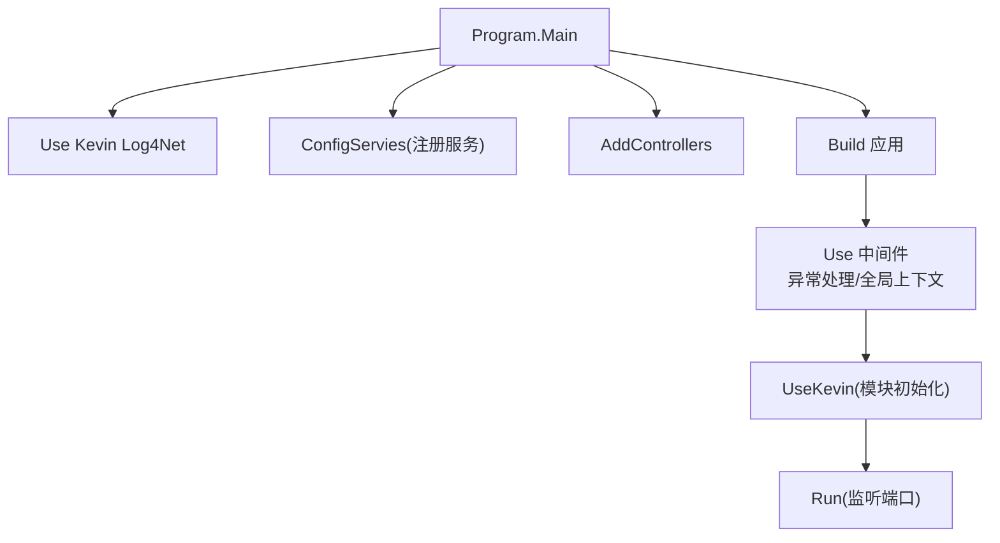
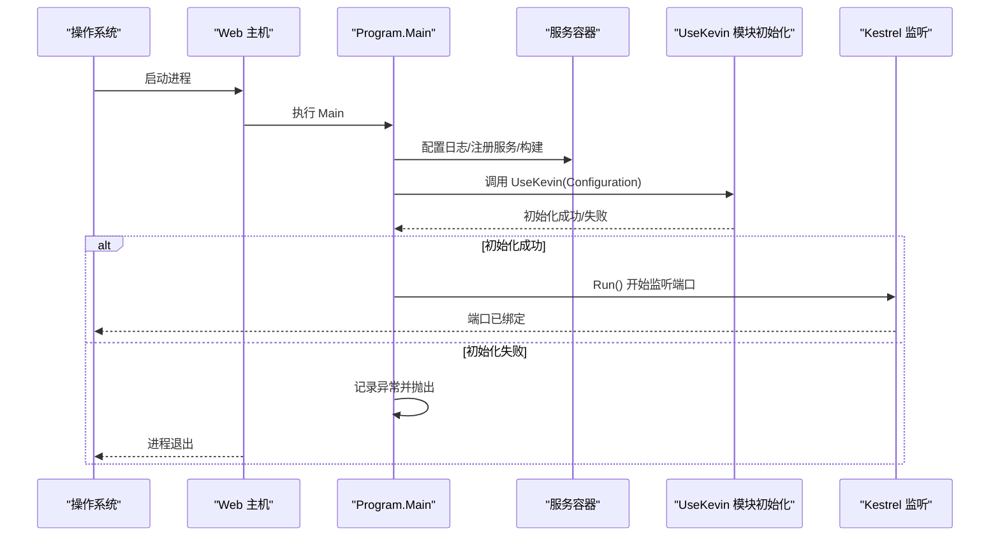
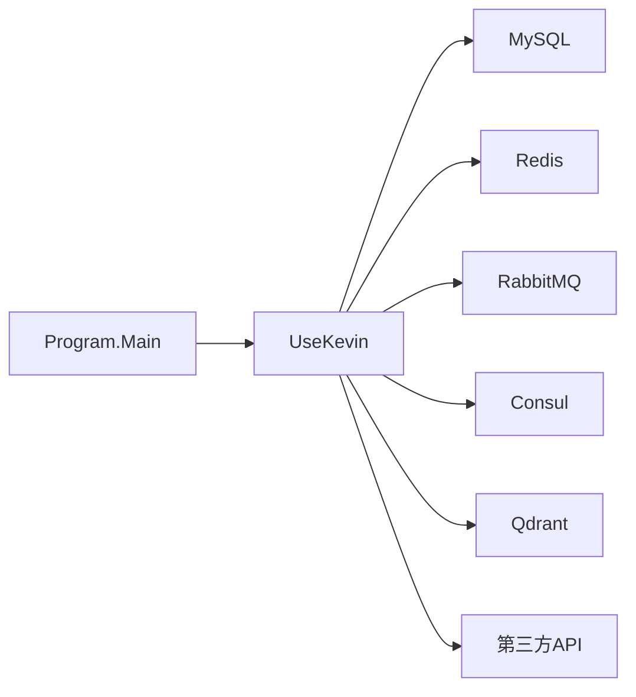

# 启动问题

<cite>
**本文引用的文件**
- [Program.cs](file://App/WebApi/Program.cs)
- [appsettings.json](file://App/WebApi/appsettings.json)
- [appsettings.Development.json](file://App/WebApi/appsettings.Development.json)
- [launchSettings.json](file://App/WebApi/Properties/launchSettings.json)
- [log4.config](file://App/WebApi/LogConfigs/log4.config)
- [ServiceConfiguration.cs](file://Kevin/Kevin.Web.Basics/Extensions/ServiceConfiguration.cs)
- [SYSTEM_DOCUMENTATION.md](file://SYSTEM_DOCUMENTATION.md)
</cite>

## 目录
1. [简介](#简介)
2. [项目结构](#项目结构)
3. [核心组件](#核心组件)
4. [架构总览](#架构总览)
5. [详细组件分析](#详细组件分析)
6. [依赖关系分析](#依赖关系分析)
7. [性能与稳定性考虑](#性能与稳定性考虑)
8. [故障排除指南](#故障排除指南)
9. [结论](#结论)
10. [附录](#附录)

## 简介
本文件面向应用无法启动的常见原因与解决方法，覆盖端口占用、配置文件错误、依赖服务未启动等典型场景。文档提供检查端口占用的命令、验证数据库连接的方法、调试模块初始化错误的步骤，以及日志分析与关键错误信息识别技巧，帮助快速定位并解决启动失败问题。

## 项目结构
- Web 入口：App/WebApi/Program.cs 负责创建主机、配置日志、注册服务、构建中间件管道并运行。
- 配置：App/WebApi/appsettings.json 与 appsettings.Development.json 定义连接字符串、外部服务地址、功能开关等；Properties/launchSettings.json 指定开发环境启动端口与环境变量。
- 日志：App/WebApi/LogConfigs/log4.config 配置按级别分文件的滚动日志。
- 扩展：Kevin/Kevin.Web.Basics/Extensions/ServiceConfiguration.cs 提供 UseKevin 等扩展方法，在启动时完成模块装配与初始化。

图表来源
- [Program.cs:23-85](file://App/WebApi/Program.cs#L23-L85)
- [ServiceConfiguration.cs:296-320](file://Kevin/Kevin.Web.Basics/Extensions/ServiceConfiguration.cs#L296-L320)

章节来源
- [Program.cs:23-85](file://App/WebApi/Program.cs#L23-L85)
- [launchSettings.json:1-36](file://App/WebApi/Properties/launchSettings.json#L1-L36)
- [log4.config:1-137](file://App/WebApi/LogConfigs/log4.config#L1-L137)

## 核心组件
- 启动主流程（Program.Main）
  - 设置环境变量、启用日志、注册服务、构建应用、挂载中间件、调用 UseKevin 初始化模块、运行服务。
  - 捕获异常并记录到日志后抛出，便于上层宿主或进程管理器获取错误信息。
- 配置加载
  - 通过 appsettings.* 与 launchSettings.json 合并加载；Development 环境会覆盖默认配置。
- 模块初始化（UseKevin）
  - 在 Program 中调用 UseKevin(builder.Configuration)，用于集中装配各模块（如缓存、权限、Hangfire、SignalR、Consul 等）。

章节来源
- [Program.cs:23-85](file://App/WebApi/Program.cs#L23-L85)
- [appsettings.json:1-166](file://App/WebApi/appsettings.json#L1-L166)
- [appsettings.Development.json:1-167](file://App/WebApi/appsettings.Development.json#L1-L167)
- [ServiceConfiguration.cs:296-320](file://Kevin/Kevin.Web.Basics/Extensions/ServiceConfiguration.cs#L296-L320)

## 架构总览
下图展示从进程启动到服务就绪的关键阶段，标注了可能失败的环节及对应排查点。

图表来源
- [Program.cs:23-85](file://App/WebApi/Program.cs#L23-L85)
- [ServiceConfiguration.cs:296-320](file://Kevin/Kevin.Web.Basics/Extensions/ServiceConfiguration.cs#L296-L320)

## 详细组件分析

### 启动主流程与异常处理
- 关键点
  - 使用 UseKevinLog4Net 初始化日志系统。
  - 通过 ConfigServies 注入业务与基础设施服务。
  - 在 Development 与非 Development 环境下分别启用不同的异常处理策略。
  - 调用 UseKevin 进行模块级初始化（数据库、缓存、消息队列、信号服务等）。
  - 最后调用 Run 启动 Kestrel 监听端口。
- 常见问题
  - 端口被占用导致 Run 失败。
  - UseKevin 内部依赖服务不可用（数据库、Redis、RabbitMQ、Consul 等）导致初始化异常。
  - 日志系统未正确初始化导致无法输出错误。

章节来源
- [Program.cs:23-85](file://App/WebApi/Program.cs#L23-L85)

### 配置与环境
- 关键配置项
  - ConnectionStrings: dbConnection、redisConnection
  - HangfireSetting/HangfireRedisSetting
  - Jwt、TenantId、CorsSetting、ConsulSetting、RabbitMQ、QdrantClientSetting、OllamaApiSetting、AliRerankApiSetting、DingDingMsgInfo、EmailSetting、SnowflakeIdSetting、CodeGeneratorSetting
- 环境差异
  - Development 环境会覆盖默认配置，注意以实际运行环境为准。
  - launchSettings.json 指定 applicationUrl 为 http://localhost:9901，ASPNETCORE_ENVIRONMENT=Development。

章节来源
- [appsettings.json:1-166](file://App/WebApi/appsettings.json#L1-L166)
- [appsettings.Development.json:1-167](file://App/WebApi/appsettings.Development.json#L1-L167)
- [launchSettings.json:1-36](file://App/WebApi/Properties/launchSettings.json#L1-L36)

### 模块初始化（UseKevin）
- 作用
  - 统一装配各模块（缓存、权限、Hangfire、SignalR、Consul、Swagger 等），并在启动时建立与外部依赖的连接。
- 风险点
  - 任一依赖不可达（数据库、Redis、消息队列、向量库、第三方 API）都会导致初始化失败。
  - 配置项缺失或格式错误会导致解析失败。

章节来源
- [ServiceConfiguration.cs:296-320](file://Kevin/Kevin.Web.Basics/Extensions/ServiceConfiguration.cs#L296-L320)

### 日志系统
- 配置要点
  - log4.config 将不同级别日志写入独立文件（Debug/Info/Warn/Error），位于 Log/ 目录。
  - 根级别设置为 DEBUG，便于开发期捕获更多细节。
- 使用建议
  - 启动失败时优先查看 Error.log 与 Info.log。
  - 若日志为空，检查程序工作目录与磁盘权限。

章节来源
- [log4.config:1-137](file://App/WebApi/LogConfigs/log4.config#L1-L137)

## 依赖关系分析
- 外部依赖
  - MySQL（dbConnection）
  - Redis（redisConnection、HangfireRedisSetting、SignalrRdisSetting）
  - RabbitMQ（RabbitMQ）
  - Consul（ConsulSetting）
  - Qdrant（QdrantClientSetting）
  - 第三方 API（OllamaApiSetting、AliRerankApiSetting、DingDingMsgInfo、EmailSetting）
- 耦合关系
  - Program 依赖 UseKevin 装配模块；UseKevin 依赖上述外部服务。
  - 任何依赖不可用均可能导致启动失败。

图表来源
- [Program.cs:23-85](file://App/WebApi/Program.cs#L23-L85)
- [ServiceConfiguration.cs:296-320](file://Kevin/Kevin.Web.Basics/Extensions/ServiceConfiguration.cs#L296-L320)
- [appsettings.json:1-166](file://App/WebApi/appsettings.json#L1-L166)

章节来源
- [appsettings.json:1-166](file://App/WebApi/appsettings.json#L1-L166)

## 性能与稳定性考虑
- 启动阶段
  - 避免在 UseKevin 中进行耗时同步 I/O；必要时异步化或延迟初始化。
  - 合理设置连接超时与重试策略，防止启动阻塞。
- 运行时
  - 生产环境降低日志级别，减少 IO 压力。
  - 对频繁访问的外部依赖增加缓存与熔断保护。

## 故障排除指南

### 症状一：应用无法启动（端口占用）
- 现象
  - 启动时报错提示端口已被占用，或进程立即退出。
- 排查步骤
  - 检查当前监听端口（默认 9901）是否被其他进程占用。
  - 修改 launchSettings.json 中的 applicationUrl 或环境变量以切换端口。
  - 确认 Kestrel 未被显式限制到其他端口。
- 参考命令
  - Windows: netstat -ano | findstr :9901
  - Linux/macOS: lsof -i :9901 或 ss -tlnp | grep 9901
- 相关位置
  - 启动端口定义于 launchSettings.json。
  - 启动流程见 Program.Main。

章节来源
- [launchSettings.json:1-36](file://App/WebApi/Properties/launchSettings.json#L1-L36)
- [Program.cs:23-85](file://App/WebApi/Program.cs#L23-L85)

### 症状二：数据库连接失败
- 现象
  - 启动时在 UseKevin 或首次访问数据时抛出连接异常。
- 排查步骤
  - 校验 appsettings.* 中 ConnectionStrings.dbConnection 是否正确（服务器、端口、数据库名、用户名、密码）。
  - 使用命令行工具直连数据库验证连通性。
  - 检查防火墙与安全组是否放行端口。
- 参考命令
  - mysql -h 127.0.0.1 -P 3306 -u root -p
- 相关位置
  - 连接字符串定义于 appsettings.json 与 appsettings.Development.json。

章节来源
- [appsettings.json:12-15](file://App/WebApi/appsettings.json#L12-L15)
- [appsettings.Development.json:12-15](file://App/WebApi/appsettings.Development.json#L12-L15)

### 症状三：Redis 连接失败
- 现象
  - Hangfire、SignalR、缓存等模块初始化失败。
- 排查步骤
  - 检查 redisConnection、HangfireRedisSetting、SignalrRdisSetting 的地址、端口、密码、数据库索引。
  - 使用 redis-cli ping 验证连通性与认证。
- 参考命令
  - redis-cli -h 127.0.0.1 -p 6379 -a 123456 ping
- 相关位置
  - Redis 相关配置集中于 appsettings.*。

章节来源
- [appsettings.json:12-45](file://App/WebApi/appsettings.json#L12-L45)
- [appsettings.Development.json:12-45](file://App/WebApi/appsettings.Development.json#L12-L45)

### 症状四：RabbitMQ 连接失败
- 现象
  - 消息队列相关模块初始化失败或任务不执行。
- 排查步骤
  - 检查 RabbitMQ 的 HostName、Port、UserName、Password、VirtualHost。
  - 使用客户端工具或命令行登录验证。
- 参考命令
  - rabbitmqctl list_users / rabbitmqctl list_vhosts
- 相关位置
  - RabbitMQ 配置位于 appsettings.*。

章节来源
- [appsettings.json:92-98](file://App/WebApi/appsettings.json#L92-L98)
- [appsettings.Development.json:92-98](file://App/WebApi/appsettings.Development.json#L92-L98)

### 症状五：Consul/Qdrant/第三方 API 不可达
- 现象
  - 服务发现、向量检索或 AI 能力初始化失败。
- 排查步骤
  - 校验 ConsulSetting 的 ConsulAddress、ServicePort。
  - 校验 QdrantClientSetting.Url 与网络可达性。
  - 校验 OllamaApiSetting/AliRerankApiSetting/DingDingMsgInfo 的 URL、密钥与网络连通性。
- 参考命令
  - curl http://localhost:8500/v1/status/leader
  - curl http://localhost:6333/health
- 相关位置
  - 配置集中在 appsettings.*。

章节来源
- [appsettings.json:51-57](file://App/WebApi/appsettings.json#L51-L57)
- [appsettings.json:133-141](file://App/WebApi/appsettings.json#L133-L141)
- [appsettings.json:155-164](file://App/WebApi/appsettings.json#L155-L164)

### 症状六：模块初始化过程中的错误
- 现象
  - 启动卡在 UseKevin 阶段，随后抛出异常并退出。
- 排查步骤
  - 查看日志文件：Log/Info.log、Log/Error.log。
  - 逐步注释 UseKevin 内的模块装配，定位具体失败模块。
  - 针对失败模块检查其依赖配置与网络连通性。
- 相关位置
  - 日志配置与输出路径见 log4.config。
  - 模块入口见 ServiceConfiguration.UseKevin。

章节来源
- [log4.config:1-137](file://App/WebApi/LogConfigs/log4.config#L1-L137)
- [ServiceConfiguration.cs:296-320](file://Kevin/Kevin.Web.Basics/Extensions/ServiceConfiguration.cs#L296-L320)

### 症状七：环境变量与配置覆盖问题
- 现象
  - 本地开发正常，部署后启动失败或行为不一致。
- 排查步骤
  - 确认 ASPNETCORE_ENVIRONMENT 的值与实际期望一致。
  - 核对 launchSettings.json 与 appsettings.* 的优先级与覆盖关系。
  - 在生产环境中使用环境变量或机密管理替换敏感配置。
- 相关位置
  - 环境变量设置见 launchSettings.json。
  - 配置合并规则遵循 .NET 标准。

章节来源
- [launchSettings.json:1-36](file://App/WebApi/Properties/launchSettings.json#L1-L36)
- [appsettings.json:1-166](file://App/WebApi/appsettings.json#L1-L166)

### 日志分析方法与关键错误识别
- 日志位置
  - 应用日志：Log/Info.log
  - 错误日志：Log/Error.log
  - 调试日志：Log/Debug.log
- 关键错误关键词
  - 端口占用：Bind 失败、Address already in use
  - 数据库：MySqlException、Connection refused、Authentication failed
  - Redis：Redis connection error、NOAUTH、Timeout
  - 消息队列：RabbitMQ connection failed、Access denied
  - 服务发现：Consul client error、Health check failed
  - 向量库：Qdrant connection error、Not found
- 操作建议
  - 启动失败优先查看 Error.log 最近条目。
  - 结合时间戳与堆栈信息定位具体模块。
  - 若日志为空，检查工作目录与磁盘权限。

章节来源
- [log4.config:1-137](file://App/WebApi/LogConfigs/log4.config#L1-L137)
- [SYSTEM_DOCUMENTATION.md:551-624](file://SYSTEM_DOCUMENTATION.md#L551-L624)

## 结论
应用启动失败通常由端口占用、配置错误或依赖服务不可达引起。通过规范化的端口检查、连接串校验、模块隔离与日志分析，可快速定位问题根源。建议在开发与生产环境严格区分配置，完善健康检查与监控告警，提升启动阶段的可见性与可恢复性。

## 附录
- 常用命令速查
  - 端口占用：netstat -ano | findstr :9901
  - 数据库连通：mysql -h 127.0.0.1 -P 3306 -u root -p
  - Redis 连通：redis-cli -h 127.0.0.1 -p 6379 -a 123456 ping
  - Consul 健康：curl http://localhost:8500/v1/status/leader
  - Qdrant 健康：curl http://localhost:6333/health
- 参考文档
  - 启动与运维说明参见 SYSTEM_DOCUMENTATION.md 的“启动失败”与“监控运维”章节。

章节来源
- [SYSTEM_DOCUMENTATION.md:551-624](file://SYSTEM_DOCUMENTATION.md#L551-L624)