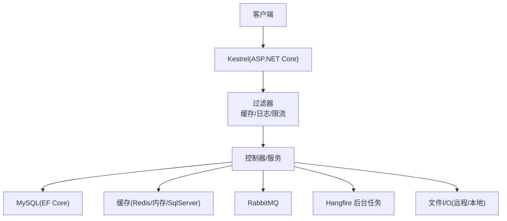
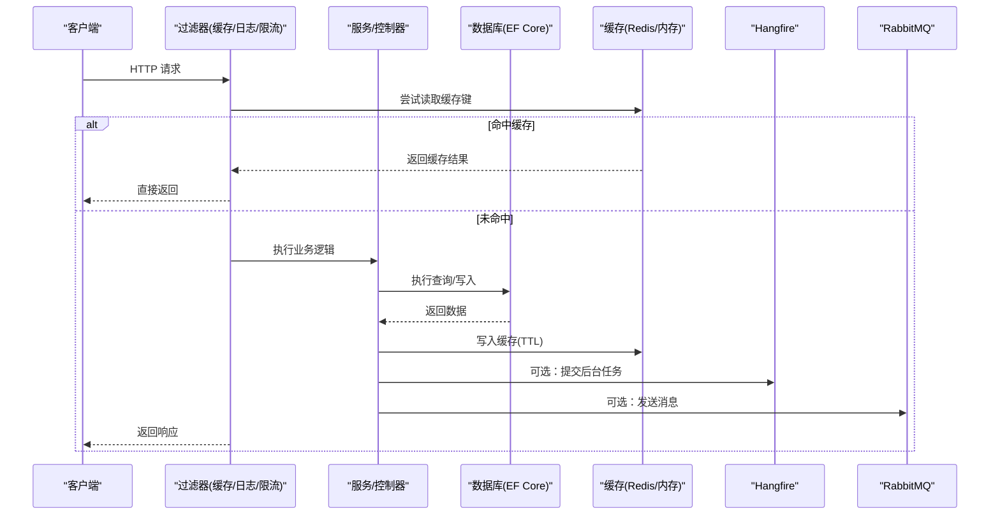
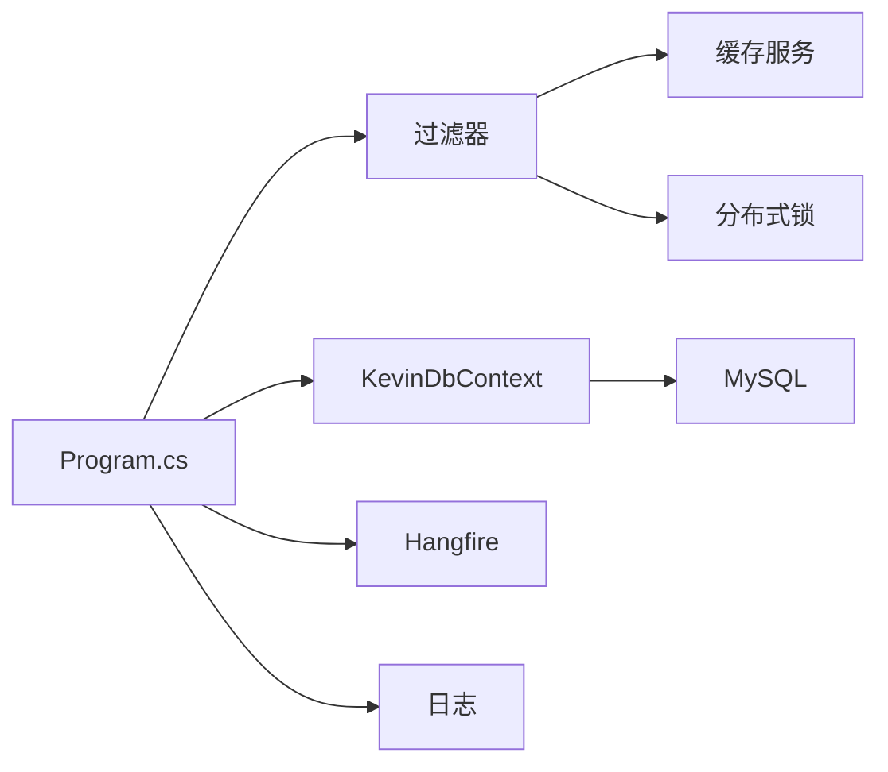

# 性能问题

<cite>
**本文引用的文件**
- [Program.cs](file://App/WebApi/Program.cs)
- [appsettings.json](file://App/WebApi/appsettings.json)
- [KevinDbContext.cs](file://Kevin/Kevin.EntityFrameworkCore/Database/KevinDbContext.cs)
- [CacheDataFilter.cs](file://Kevin/Kevin.Web.Basics/Filters/CacheDataFilter.cs)
- [HttpLogFilter.cs](file://Kevin/Kevin.Web.Basics/Filters/HttpLogFilter.cs)
- [QueueLimitFilter.cs](file://Kevin/Kevin.Web.Basics/Filters/QueueLimitFilter.cs)
- [ServiceCollectionExtensions.cs（缓存）](file://Kevin/kevin.Module/kevin.Cache/ServiceCollectionExtensions.cs)
- [RabbitMQConnection.cs](file://Kevin/kevin.Module/kevin.RabbitMQ/RabbitMQConnection.cs)
- [ApplicationBuilderExtensions.cs（Hangfire）](file://Kevin/kevin.Module/ Kevin.Hangfire/ApplicationBuilderExtensions.cs)
- [RemoteFileDownloader.cs](file://Kevin/kevin.Module/ Kevin.Common/Helper/FileHandleTools/RemoteFileDownloader.cs)
- [FileHelper.cs](file://Kevin/kevin.Module/ Kevin.Common/Helper/FileHelper.cs)
- [SYSTEM_DOCUMENTATION.html](file://vue/kevin.web.vue/public/SYSTEM_DOCUMENTATION.html)
</cite>

## 目录
1. [简介](#简介)
2. [项目结构](#项目结构)
3. [核心组件](#核心组件)
4. [架构总览](#架构总览)
5. [详细组件分析](#详细组件分析)
6. [依赖关系分析](#依赖关系分析)
7. [性能考量与优化建议](#性能考量与优化建议)
8. [故障排查指南](#故障排查指南)
9. [结论](#结论)
10. [附录](#附录)

## 简介
本文件面向生产环境中的性能问题诊断与优化，覆盖 CPU 使用率过高、内存泄漏、响应缓慢等典型场景。结合本项目实际代码，说明如何使用内置的日志、缓存、队列、分布式锁、异步任务等能力进行瓶颈定位与优化；同时给出数据库查询优化（索引设计、SQL 优化、连接池调优）、异步任务处理、文件上传下载、大数据量操作的具体方案。

## 项目结构
- Web 入口与中间件：Program.cs 负责应用启动、全局异常处理、请求体缓冲、GC 堆限制设置、模块初始化。
- 数据访问：EF Core 上下文 KevinDbContext.cs 统一配置 MySQL、拦截器、默认索引字段、领域事件发布、并发控制等。
- 过滤器：CacheDataFilter.cs 提供接口级缓存；HttpLogFilter.cs 记录 HTTP 操作日志；QueueLimitFilter.cs 基于分布式锁实现限流/防重。
- 缓存：kevin.Cache 支持内存、SqlServer、Redis 三种后端。
- 消息与任务：RabbitMQ 连接封装；Hangfire 后台任务与看板集成。
- 文件 I/O：RemoteFileDownloader.cs、FileHelper.cs 提供远程文件流式下载与文件名解析。
- 文档参考：SYSTEM_DOCUMENTATION.html 包含监控入口与性能优化要点。

图表来源
- [Program.cs:23-85](file://App/WebApi/Program.cs#L23-L85)
- [KevinDbContext.cs:83-133](file://Kevin/Kevin.EntityFrameworkCore/Database/KevinDbContext.cs#L83-L133)
- [CacheDataFilter.cs:31-120](file://Kevin/Kevin.Web.Basics/Filters/CacheDataFilter.cs#L31-L120)
- [HttpLogFilter.cs:12-35](file://Kevin/Kevin.Web.Basics/Filters/HttpLogFilter.cs#L12-L35)
- [QueueLimitFilter.cs:31-74](file://Kevin/Kevin.Web.Basics/Filters/QueueLimitFilter.cs#L31-L74)
- [ApplicationBuilderExtensions.cs（Hangfire）:14-36](file://Kevin/kevin.Module/ Kevin.Hangfire/ApplicationBuilderExtensions.cs#L14-L36)

章节来源
- [Program.cs:23-85](file://App/WebApi/Program.cs#L23-L85)
- [appsettings.json:12-15](file://App/WebApi/appsettings.json#L12-L15)

## 核心组件
- 应用启动与运行时约束
  - 启用请求体缓冲以支持多次读取（便于日志/签名校验）。
  - 设置 GC 堆硬限制，避免进程无界增长。
  - 注册日志、控制器、全局异常处理。
- 数据访问层
  - EF Core 配置 MySQL，启用调试拦截器，自动为默认字段添加索引。
  - SaveChanges 中注入租户信息、乐观并发 RowVersion、领域事件发布。
- 缓存与限流
  - 接口级缓存过滤器，按 Action+Query+Body+Token 生成键，支持 TTL。
  - 分布式锁限流，支持阻塞或拒绝策略。
- 日志与可观测性
  - HTTP 结果过滤器记录操作类型与备注。
  - 通过 Hangfire Dashboard、Redis Insight、MySQL 监控工具进行可视化观察。
- 异步与消息
  - RabbitMQ 连接封装，确保连接生命周期管理。
  - Hangfire 后台任务与看板集成，用于耗时任务与重试。
- 文件 I/O
  - 远程文件流式下载，支持断点续传与 Content-Disposition 解析文件名。

章节来源
- [Program.cs:59-80](file://App/WebApi/Program.cs#L59-L80)
- [KevinDbContext.cs:108-133](file://Kevin/Kevin.EntityFrameworkCore/Database/KevinDbContext.cs#L108-L133)
- [KevinDbContext.cs:405-484](file://Kevin/Kevin.EntityFrameworkCore/Database/KevinDbContext.cs#L405-L484)
- [CacheDataFilter.cs:31-120](file://Kevin/Kevin.Web.Basics/Filters/CacheDataFilter.cs#L31-L120)
- [QueueLimitFilter.cs:31-74](file://Kevin/Kevin.Web.Basics/Filters/QueueLimitFilter.cs#L31-L74)
- [HttpLogFilter.cs:12-35](file://Kevin/Kevin.Web.Basics/Filters/HttpLogFilter.cs#L12-L35)
- [RabbitMQConnection.cs:12-48](file://Kevin/kevin.Module/kevin.RabbitMQ/RabbitMQConnection.cs#L12-L48)
- [ApplicationBuilderExtensions.cs（Hangfire）:14-36](file://Kevin/kevin.Module/ Kevin.Hangfire/ApplicationBuilderExtensions.cs#L14-L36)
- [RemoteFileDownloader.cs:17-39](file://Kevin/kevin.Module/ Kevin.Common/Helper/FileHandleTools/RemoteFileDownloader.cs#L17-L39)
- [FileHelper.cs:33-62](file://Kevin/kevin.Module/ Kevin.Common/Helper/FileHelper.cs#L33-L62)

## 架构总览
下图展示一次带缓存与日志记录的 API 请求在系统中的流转路径，以及可能的数据库、缓存、消息与后台任务交互。

图表来源
- [CacheDataFilter.cs:31-120](file://Kevin/Kevin.Web.Basics/Filters/CacheDataFilter.cs#L31-L120)
- [HttpLogFilter.cs:12-35](file://Kevin/Kevin.Web.Basics/Filters/HttpLogFilter.cs#L12-L35)
- [QueueLimitFilter.cs:31-74](file://Kevin/Kevin.Web.Basics/Filters/QueueLimitFilter.cs#L31-L74)
- [KevinDbContext.cs:108-133](file://Kevin/Kevin.EntityFrameworkCore/Database/KevinDbContext.cs#L108-L133)
- [ApplicationBuilderExtensions.cs（Hangfire）:14-36](file://Kevin/kevin.Module/ Kevin.Hangfire/ApplicationBuilderExtensions.cs#L14-L36)
- [RabbitMQConnection.cs:12-48](file://Kevin/kevin.Module/kevin.RabbitMQ/RabbitMQConnection.cs#L12-L48)

## 详细组件分析

### 数据库与查询优化（EF Core + MySQL）
- 默认索引字段
  - 通过配置项 DBDefaultHasIndexFields 自动为常用字段创建索引，减少全表扫描。
- 连接与事务
  - 连接字符串包含 Command Timeout，避免慢查询占用连接过久。
  - SaveChanges 中统一处理多租户、乐观并发、领域事件，注意批量更新时减少对象跟踪开销。
- 查询优化建议
  - 使用投影 Select 仅取必要字段，避免 N+1 查询。
  - 分页使用 Skip/Take，避免一次性加载大量数据。
  - 对高频过滤/排序字段建立复合索引。
  - 避免在 Where 中对列做函数计算，尽量走索引。
- 连接池调优
  - 根据并发与数据库资源调整 Max Pool Size、Command Timeout。
  - 在高并发下优先复用 DbContext 实例，避免频繁创建销毁。

章节来源
- [appsettings.json:12-15](file://App/WebApi/appsettings.json#L12-L15)
- [KevinDbContext.cs:108-133](file://Kevin/Kevin.EntityFrameworkCore/Database/KevinDbContext.cs#L108-L133)
- [KevinDbContext.cs:405-484](file://Kevin/Kevin.EntityFrameworkCore/Database/KevinDbContext.cs#L405-L484)

### 缓存策略（接口级缓存）
- 缓存键生成
  - 基于 Action 名称、QueryString、RequestBody、Authorization Token 组合并 MD5 化，降低碰撞概率。
- 缓存命中与回写
  - OnActionExecuting 命中则直接返回；OnActionExecuted 未命中则写入缓存并设置 TTL。
- 性能影响
  - 大对象缓存需评估序列化成本与内存占用；合理设置 TTL 避免热点过期风暴。
- 适用场景
  - 读多写少、数据一致性要求不高的列表/字典类接口。

章节来源
- [CacheDataFilter.cs:31-120](file://Kevin/Kevin.Web.Basics/Filters/CacheDataFilter.cs#L31-L120)
- [ServiceCollectionExtensions.cs（缓存）:11-41](file://Kevin/kevin.Module/kevin.Cache/ServiceCollectionExtensions.cs#L11-L41)

### 限流与防重（分布式锁）
- 机制
  - 基于 IDistributedLockProvider 获取分布式锁，支持阻塞等待或立即拒绝。
  - 支持按 Token 区分用户维度限流。
- 使用建议
  - 对幂等接口使用 IsBlock=false 排队；对敏感操作使用 IsBlock=true 快速失败。
  - 合理设置锁超时时间，避免死锁与长时间阻塞。

章节来源
- [QueueLimitFilter.cs:31-74](file://Kevin/Kevin.Web.Basics/Filters/QueueLimitFilter.cs#L31-L74)

### 日志与可观测性
- HTTP 日志
  - HttpLogFilter 在结果阶段记录操作类型与备注，便于审计与追踪。
- 监控入口
  - Hangfire Dashboard：http://localhost:9901/pchangfire
  - Redis 监控：Redis Insight 或类似工具
  - MySQL 监控：Prometheus + Grafana
- 建议
  - 生产环境关闭 Debug 级别日志，采用异步写入与轮转策略。

章节来源
- [HttpLogFilter.cs:12-35](file://Kevin/Kevin.Web.Basics/Filters/HttpLogFilter.cs#L12-L35)
- [SYSTEM_DOCUMENTATION.html:1057-1062](file://vue/kevin.web.vue/public/SYSTEM_DOCUMENTATION.html#L1057-L1062)

### 异步任务与消息
- Hangfire
  - 提供后台任务调度与看板，适合耗时任务、重试与延迟执行。
- RabbitMQ
  - 连接封装确保连接生命周期管理，适用于解耦与削峰填谷。
- 建议
  - 将非关键路径任务迁移至后台队列，缩短主线程响应时间。
  - 合理设置消费者并发与重试策略，避免雪崩。

章节来源
- [ApplicationBuilderExtensions.cs（Hangfire）:14-36](file://Kevin/kevin.Module/ Kevin.Hangfire/ApplicationBuilderExtensions.cs#L14-L36)
- [RabbitMQConnection.cs:12-48](file://Kevin/kevin.Module/kevin.RabbitMQ/RabbitMQConnection.cs#L12-L48)

### 文件上传下载与大数据量处理
- 远程文件下载
  - RemoteFileDownloader 支持流式下载与自动解压，避免一次性加载到内存。
  - FileHelper 从 Content-Disposition 解析真实文件名，提升兼容性。
- 上传建议
  - 前端分片上传与进度回调，服务端流式接收与落盘，避免大对象驻留托管堆。
- 大数据量处理
  - 使用分页与游标读取，避免一次性加载全部数据。
  - 导出/导入采用流式读写与分批提交，降低内存峰值。

章节来源
- [RemoteFileDownloader.cs:17-39](file://Kevin/kevin.Module/ Kevin.Common/Helper/FileHandleTools/RemoteFileDownloader.cs#L17-L39)
- [FileHelper.cs:33-62](file://Kevin/kevin.Module/ Kevin.Common/Helper/FileHelper.cs#L33-L62)

## 依赖关系分析
- 启动依赖
  - Program.cs 依赖日志、配置、控制器、全局异常处理与模块初始化。
- 数据依赖
  - KevinDbContext 依赖 MySQL、EF Core 拦截器、配置项（连接串、默认索引字段）。
- 横切关注点
  - 过滤器依赖缓存服务、分布式锁、HTTP 上下文与日志服务。
- 外部依赖
  - Redis（缓存、分布式锁、Hangfire）、RabbitMQ（消息）、Hangfire（任务看板）。

图表来源
- [Program.cs:23-85](file://App/WebApi/Program.cs#L23-L85)
- [KevinDbContext.cs:83-133](file://Kevin/Kevin.EntityFrameworkCore/Database/KevinDbContext.cs#L83-L133)
- [CacheDataFilter.cs:31-120](file://Kevin/Kevin.Web.Basics/Filters/CacheDataFilter.cs#L31-L120)
- [QueueLimitFilter.cs:31-74](file://Kevin/Kevin.Web.Basics/Filters/QueueLimitFilter.cs#L31-L74)
- [ApplicationBuilderExtensions.cs（Hangfire）:14-36](file://Kevin/kevin.Module/ Kevin.Hangfire/ApplicationBuilderExtensions.cs#L14-L36)

## 性能考量与优化建议

### CPU 使用率过高
- 定位方法
  - 使用性能剖析工具（如 dotnet-trace、dotnet-counters）采集 CPU 热点。
  - 检查是否存在同步阻塞调用、循环内重复计算、未使用缓存导致的重复 IO。
- 优化手段
  - 引入缓存（CacheDataFilter）减少重复计算与 IO。
  - 将耗时逻辑移至后台任务（Hangfire）或消息队列（RabbitMQ）。
  - 优化数据库查询，避免 N+1 与全表扫描。

### 内存泄漏
- 定位方法
  - 设置 GC 堆硬限制（已在 Program 中配置），配合内存快照分析托管堆分配。
  - 检查是否持有长生命周期静态引用、未释放的文件流/连接、订阅未取消。
- 优化手段
  - 使用 using 语句确保流与连接及时释放。
  - 避免在过滤器中缓存超大对象；合理设置缓存 TTL。
  - 对 RabbitMQ 连接与模型使用正确生命周期管理。

章节来源
- [Program.cs:79-80](file://App/WebApi/Program.cs#L79-L80)
- [RabbitMQConnection.cs:24-48](file://Kevin/kevin.Module/kevin.RabbitMQ/RabbitMQConnection.cs#L24-L48)
- [CacheDataFilter.cs:31-120](file://Kevin/Kevin.Web.Basics/Filters/CacheDataFilter.cs#L31-L120)

### 响应缓慢
- 常见原因
  - 数据库慢查询、缺少索引、连接池不足。
  - 同步阻塞调用、未使用异步 IO。
  - 大对象序列化与传输。
- 优化手段
  - 为高频查询字段建立索引（DBDefaultHasIndexFields）。
  - 使用分页与投影，减少数据传输量。
  - 启用接口级缓存（TTL 合理设置）。
  - 将耗时任务异步化（Hangfire/RabbitMQ）。

章节来源
- [appsettings.json:12-15](file://App/WebApi/appsettings.json#L12-L15)
- [KevinDbContext.cs:108-133](file://Kevin/Kevin.EntityFrameworkCore/Database/KevinDbContext.cs#L108-L133)
- [CacheDataFilter.cs:31-120](file://Kevin/Kevin.Web.Basics/Filters/CacheDataFilter.cs#L31-L120)

### 数据库查询优化
- 索引设计
  - 为常用过滤/排序字段建立索引；复合索引遵循最左前缀原则。
  - 利用默认索引字段配置，覆盖通用审计字段。
- 查询语句优化
  - 避免 SELECT *，仅选择必要字段。
  - 使用 EXISTS 替代 IN 子查询；避免在 WHERE 中对列使用函数。
  - 合理使用分页与游标，避免一次性加载大量数据。
- 连接池调优
  - 根据业务并发调整 Max Pool Size、Command Timeout。
  - 避免长事务占用连接；拆分大事务为小批次提交。

章节来源
- [appsettings.json:12-15](file://App/WebApi/appsettings.json#L12-L15)
- [KevinDbContext.cs:108-133](file://Kevin/Kevin.EntityFrameworkCore/Database/KevinDbContext.cs#L108-L133)

### 异步任务处理
- 使用 Hangfire 调度后台任务，支持重试、延迟与可视化监控。
- 使用 RabbitMQ 解耦生产消费，削峰填谷。
- 对耗时且非关键路径的操作（如通知、报表生成）迁移至后台。

章节来源
- [ApplicationBuilderExtensions.cs（Hangfire）:14-36](file://Kevin/kevin.Module/ Kevin.Hangfire/ApplicationBuilderExtensions.cs#L14-L36)
- [RabbitMQConnection.cs:12-48](file://Kevin/kevin.Module/kevin.RabbitMQ/RabbitMQConnection.cs#L12-L48)

### 文件上传下载与大数据量操作
- 上传
  - 前端分片上传与进度反馈；服务端流式接收与落盘，避免大对象驻留。
- 下载
  - 使用流式下载（RemoteFileDownloader），按需读取与传输。
- 大数据量
  - 分页读取、分批处理；导出/导入采用流式读写与批量提交。

章节来源
- [RemoteFileDownloader.cs:17-39](file://Kevin/kevin.Module/ Kevin.Common/Helper/FileHandleTools/RemoteFileDownloader.cs#L17-L39)
- [FileHelper.cs:33-62](file://Kevin/kevin.Module/ Kevin.Common/Helper/FileHelper.cs#L33-L62)

## 故障排查指南
- 数据库连接失败
  - 检查 MySQL 服务状态与连接字符串配置。
  - 确认 Command Timeout 与 Max Pool Size 是否合理。
- Redis 连接失败
  - 检查 Redis 服务与密码配置；使用 Redis Insight 验证连通性。
- Qdrant 连接失败
  - 检查服务健康端点与网络可达性。
- Hangfire 看板不可用
  - 确认已启用看板并访问对应路径。
- 日志与监控
  - 查看 HTTP 日志与系统日志；使用 Prometheus/Grafana 监控 MySQL 指标。

章节来源
- [SYSTEM_DOCUMENTATION.html:1057-1133](file://vue/kevin.web.vue/public/SYSTEM_DOCUMENTATION.html#L1057-L1133)

## 结论
本项目在启动阶段设置了 GC 堆限制，提供了接口级缓存、分布式限流、HTTP 日志、后台任务与消息队列等能力，为性能优化与问题定位提供了良好基础。建议在生产环境中结合监控工具持续观测 CPU、内存、数据库与缓存指标，针对热点接口实施缓存与异步化改造，完善数据库索引与查询优化，并通过合理的连接池与事务策略保障系统稳定性与吞吐能力。

## 附录
- 监控入口
  - Hangfire Dashboard：http://localhost:9901/pchangfire
  - Redis 监控：Redis Insight 或类似工具
  - MySQL 监控：Prometheus + Grafana

章节来源
- [SYSTEM_DOCUMENTATION.html:1057-1062](file://vue/kevin.web.vue/public/SYSTEM_DOCUMENTATION.html#L1057-L1062)