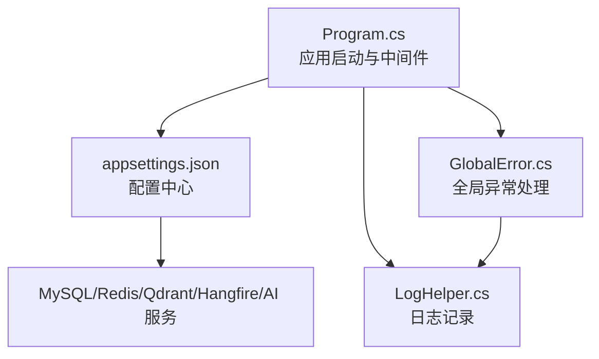
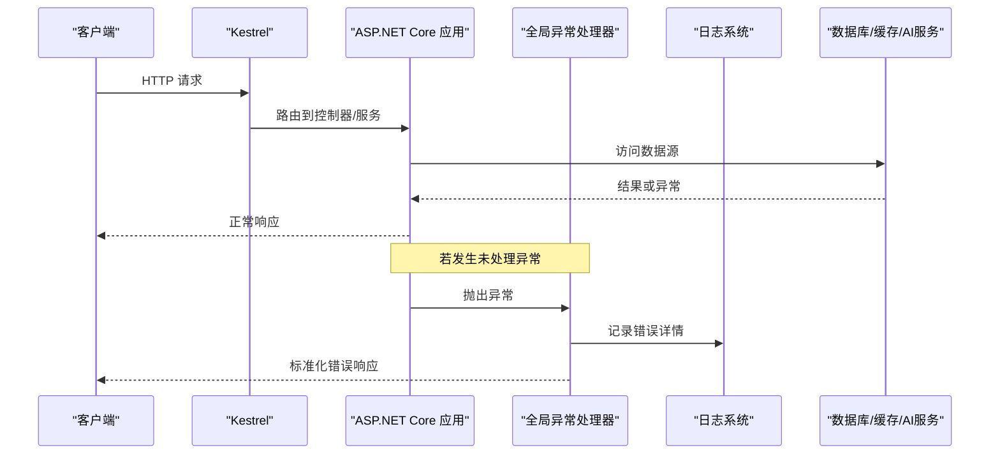
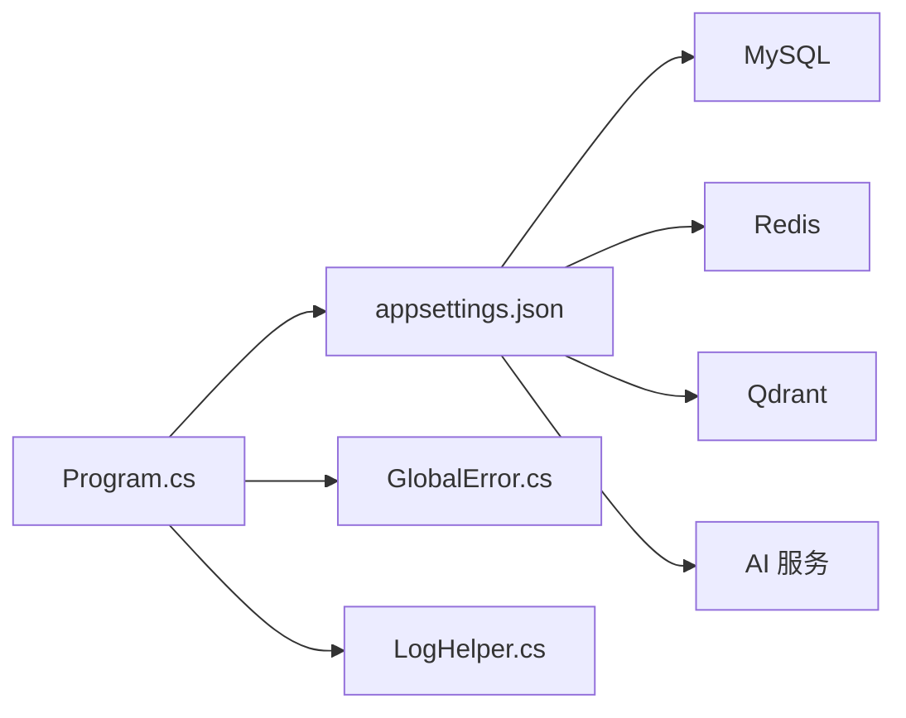

# 故障排除

<cite>
**本文引用的文件**
- [Program.cs](file://App/WebApi/Program.cs)
- [appsettings.json](file://App/WebApi/appsettings.json)
- [GlobalError.cs](file://Kevin/kevin.Module/Kevin.Common/App/Global/GlobalError.cs)
- [LogHelper.cs](file://Kevin/kevin.Module/kevin.log4Net/LogHelper.cs)
- [SYSTEM_DOCUMENTATION.md](file://SYSTEM_DOCUMENTATION.md)
- [环境变量设置.txt](file://Doc/项目相关/环境变量设置.txt)
- [数据库层说明.txt](file://Doc/项目相关/数据库层说明.txt)
- [troubleshooting-guide.md](file://Kevin/kevin.Module/kevin.AI.AgentFramework/Skills/system-ops/system-ops/references/troubleshooting-guide.md)
</cite>

## 目录
1. [简介](#简介)
2. [项目结构](#项目结构)
3. [核心组件](#核心组件)
4. [架构总览](#架构总览)
5. [详细组件分析](#详细组件分析)
6. [依赖关系分析](#依赖关系分析)
7. [性能考虑](#性能考虑)
8. [故障排除指南](#故障排除指南)
9. [结论](#结论)
10. [附录](#附录)

## 简介
本故障排除文档面向 NetCoreKevin 框架的运维与开发团队，聚焦于启动失败、数据库连接问题、Redis 连接异常、AI 服务调用失败等常见问题的诊断与修复；同时提供日志分析方法、性能问题定位手段、系统监控与告警配置建议，以及故障恢复流程与预防措施，帮助快速恢复服务并提升稳定性。

## 项目结构
- Web 入口：App/WebApi/Program.cs 负责应用启动、中间件注册、全局异常处理与初始化。
- 配置中心：App/WebApi/appsettings.json 集中管理数据库、缓存、任务调度、AI 向量库等关键配置。
- 错误处理：Kevin/.../GlobalError.cs 统一捕获未处理异常并输出结构化响应。
- 日志体系：Kevin/.../log4Net/LogHelper.cs 提供按天滚动、按大小切分的日志写入能力。
- 运维文档：SYSTEM_DOCUMENTATION.md 汇总了常见问题、排查步骤与监控指标。
- 环境说明：Doc/项目相关/*.txt 提供环境变量与数据库迁移命令参考。

图表来源
- [Program.cs:23-85](file://App/WebApi/Program.cs#L23-L85)
- [appsettings.json:12-16](file://App/WebApi/appsettings.json#L12-L16)
- [GlobalError.cs:16-64](file://Kevin/kevin.Module/Kevin.Common/App/Global/GlobalError.cs#L16-L64)
- [LogHelper.cs:35-48](file://Kevin/kevin.Module/kevin.log4Net/LogHelper.cs#L35-L48)

章节来源
- [Program.cs:23-85](file://App/WebApi/Program.cs#L23-L85)
- [appsettings.json:12-16](file://App/WebApi/appsettings.json#L12-L16)
- [SYSTEM_DOCUMENTATION.md:533-549](file://SYSTEM_DOCUMENTATION.md#L533-L549)

## 核心组件
- 启动与中间件：在 Program.Main 中完成环境设置、日志启用、服务配置、控制器注册、异常处理管道、堆限制设置与 Kevin 初始化。
- 全局异常：GlobalError 将未处理异常记录到日志，并按业务异常或系统异常返回不同状态码与消息。
- 日志：LogHelper 使用 log4net 实现按日期与大小的滚动日志，便于问题回溯。
- 配置：appsettings.json 包含数据库连接串、Redis、Hangfire、SignalR、CORS、Qdrant、AI 模型等关键配置项。

章节来源
- [Program.cs:23-85](file://App/WebApi/Program.cs#L23-L85)
- [GlobalError.cs:16-64](file://Kevin/kevin.Module/Kevin.Common/App/Global/GlobalError.cs#L16-L64)
- [LogHelper.cs:19-56](file://Kevin/kevin.Module/kevin.log4Net/LogHelper.cs#L19-L56)
- [appsettings.json:12-16](file://App/WebApi/appsettings.json#L12-L16)

## 架构总览
下图展示了请求进入后的关键路径：Kestrel -> 中间件 -> 控制器 -> 服务 -> 数据源（数据库/缓存/外部服务），异常由全局异常处理器捕获并落盘。

图表来源
- [Program.cs:59-83](file://App/WebApi/Program.cs#L59-L83)
- [GlobalError.cs:16-64](file://Kevin/kevin.Module/Kevin.Common/App/Global/GlobalError.cs#L16-L64)
- [LogHelper.cs:35-48](file://Kevin/kevin.Module/kevin.log4Net/LogHelper.cs#L35-L48)

## 详细组件分析

### 启动失败
- 症状：应用无法启动或端口占用。
- 排查要点：
  - 检查端口占用情况与监听地址。
  - 校验环境变量 ASPNETCORE_ENVIRONMENT。
  - 验证 appsettings.json 中的连接字符串与外部服务可达性。
  - 查看 Program.Main 中的异常捕获与日志输出。
- 修复建议：
  - 释放被占用端口或调整监听地址。
  - 修正环境变量与配置文件。
  - 确保 MySQL、Redis、Qdrant 等服务已启动且网络可达。

章节来源
- [Program.cs:23-85](file://App/WebApi/Program.cs#L23-L85)
- [appsettings.json:12-16](file://App/WebApi/appsettings.json#L12-L16)
- [环境变量设置.txt:1-15](file://Doc/项目相关/环境变量设置.txt#L1-L15)
- [SYSTEM_DOCUMENTATION.md:561-583](file://SYSTEM_DOCUMENTATION.md#L561-L583)

### 数据库连接问题
- 症状：EF 迁移失败、查询超时、连接池耗尽。
- 排查要点：
  - 核对 ConnectionStrings.dbConnection 的服务器、端口、数据库名、用户名、密码。
  - 确认 MySQL 服务运行与防火墙策略。
  - 检查 Command Timeout 是否过小导致超时。
  - 观察日志中是否有连接错误或 SQL 执行异常。
- 修复建议：
  - 修正连接串参数与权限。
  - 适当增大超时时间或优化慢查询。
  - 使用数据库监控工具分析慢查询与锁等待。

章节来源
- [appsettings.json:12-16](file://App/WebApi/appsettings.json#L12-L16)
- [SYSTEM_DOCUMENTATION.md:551-559](file://SYSTEM_DOCUMENTATION.md#L551-L559)
- [数据库层说明.txt:25-31](file://Doc/项目相关/数据库层说明.txt#L25-L31)

### Redis 连接异常
- 症状：缓存读写失败、Hangfire 任务不执行、SignalR 广播异常。
- 排查要点：
  - 检查 ConnectionStrings.redisConnection 与 HangfireRedisSetting.RedisConnectionString。
  - 确认 Redis 服务运行、密码与默认库号正确。
  - 观察连接超时与同步超时配置。
- 修复建议：
  - 修正密码、端口、库号与超时参数。
  - 为 Hangfire 与 SignalR 使用独立库避免冲突。
  - 通过 Redis 监控工具检查键空间与内存使用。

章节来源
- [appsettings.json:12-20](file://App/WebApi/appsettings.json#L12-L20)
- [SYSTEM_DOCUMENTATION.md:551-559](file://SYSTEM_DOCUMENTATION.md#L551-L559)

### AI 服务调用失败
- 症状：AI 工具调用报错、知识库检索为空或错误。
- 排查要点：
  - 检查 Qdrant 服务健康与 URL 配置。
  - 校验 OllamaApiSetting、AliRerankApiSetting 的 Url、DefaultModel、ApiKey。
  - 确认 InitData 参数传递是否正确。
  - 查看 Logs/log_*.txt 中的调用链路与错误信息。
- 修复建议：
  - 修正外部服务地址与鉴权信息。
  - 确保向量库集合存在且文档已入库。
  - 对工具方法签名与输入进行校验。

章节来源
- [SYSTEM_DOCUMENTATION.md:585-609](file://SYSTEM_DOCUMENTATION.md#L585-L609)
- [appsettings.json:133-164](file://App/WebApi/appsettings.json#L133-L164)

### 全局异常与日志
- 异常处理：GlobalError 捕获未处理异常，区分用户友好异常与系统异常，记录错误并返回标准 JSON。
- 日志记录：LogHelper 使用 log4net 按天滚动、按大小切分日志，便于问题定位。
- 建议：
  - 生产环境关闭 Debug 级别日志，减少 I/O 压力。
  - 定期清理历史日志，保留近 7 天。
  - 结合 Prometheus/Grafana 采集日志与指标。

章节来源
- [GlobalError.cs:16-64](file://Kevin/kevin.Module/Kevin.Common/App/Global/GlobalError.cs#L16-L64)
- [LogHelper.cs:35-48](file://Kevin/kevin.Module/kevin.log4Net/LogHelper.cs#L35-L48)
- [SYSTEM_DOCUMENTATION.md:533-549](file://SYSTEM_DOCUMENTATION.md#L533-L549)

## 依赖关系分析
- 启动阶段依赖：Program 依赖配置与外部服务（数据库、Redis、Qdrant、AI）。
- 运行时依赖：控制器与服务依赖仓储、缓存、消息队列、第三方 API。
- 风险点：
  - 外部服务不可达导致启动失败或请求失败。
  - 配置不一致引发连接错误。
  - 日志与异常处理缺失导致问题难以定位。

图表来源
- [Program.cs:23-85](file://App/WebApi/Program.cs#L23-L85)
- [appsettings.json:12-16](file://App/WebApi/appsettings.json#L12-L16)
- [GlobalError.cs:16-64](file://Kevin/kevin.Module/Kevin.Common/App/Global/GlobalError.cs#L16-L64)
- [LogHelper.cs:35-48](file://Kevin/kevin.Module/kevin.log4Net/LogHelper.cs#L35-L48)

章节来源
- [Program.cs:23-85](file://App/WebApi/Program.cs#L23-L85)
- [appsettings.json:12-16](file://App/WebApi/appsettings.json#L12-L16)

## 性能考虑
- 数据库优化：索引优化、分页查询、批量操作、读写分离。
- 缓存策略：合理使用 Redis 缓存，控制过期时间与命中率。
- 异步编程：使用 async/await，避免阻塞调用。
- 日志优化：生产环境降低日志级别，异步写入，定期轮转。
- 资源限制：设置 GCHeapHardLimit 防止内存暴涨。

章节来源
- [SYSTEM_DOCUMENTATION.md:657-690](file://SYSTEM_DOCUMENTATION.md#L657-L690)
- [Program.cs:79-80](file://App/WebApi/Program.cs#L79-L80)

## 故障排除指南

### 启动失败
- 症状：应用无法启动。
- 步骤：
  - 检查端口占用。
  - 校验环境变量 ASPNETCORE_ENVIRONMENT。
  - 测试数据库与 Redis 连通性。
  - 查看 Program 启动日志与 GlobalError 输出。

章节来源
- [SYSTEM_DOCUMENTATION.md:561-583](file://SYSTEM_DOCUMENTATION.md#L561-L583)
- [环境变量设置.txt:1-15](file://Doc/项目相关/环境变量设置.txt#L1-L15)

### 数据库连接失败
- 症状：连接超时或认证失败。
- 步骤：
  - 核对连接串参数。
  - 检查 MySQL 服务与权限。
  - 调整 Command Timeout。
  - 查看日志中的 SQL 错误。

章节来源
- [appsettings.json:12-16](file://App/WebApi/appsettings.json#L12-L16)
- [SYSTEM_DOCUMENTATION.md:551-559](file://SYSTEM_DOCUMENTATION.md#L551-L559)

### Redis 连接异常
- 症状：缓存读写失败、Hangfire 任务不执行。
- 步骤：
  - 检查 Redis 服务与密码。
  - 确认 Hangfire 与 SignalR 使用的库号。
  - 调整连接与同步超时。

章节来源
- [appsettings.json:12-20](file://App/WebApi/appsettings.json#L12-L20)
- [SYSTEM_DOCUMENTATION.md:551-559](file://SYSTEM_DOCUMENTATION.md#L551-L559)

### AI 服务调用失败
- 症状：工具调用报错、知识库检索为空。
- 步骤：
  - 检查 Qdrant 健康与 URL。
  - 校验 AI 模型配置与密钥。
  - 查看 InitData 参数与工具签名。
  - 分析日志链路。

章节来源
- [SYSTEM_DOCUMENTATION.md:585-609](file://SYSTEM_DOCUMENTATION.md#L585-L609)
- [appsettings.json:133-164](file://App/WebApi/appsettings.json#L133-L164)

### 日志分析方法
- 日志位置：App/WebApi/Logs/ 下的 log_*.txt、error_*.txt、http_*.txt。
- 级别配置：根据环境调整 Logging.LogLevel，生产环境关闭 Debug。
- 关键信息提取：关注时间、线程、异常堆栈、请求路径与参数。
- 技巧：结合时间窗口过滤、关键字搜索与上下文关联。

章节来源
- [SYSTEM_DOCUMENTATION.md:533-549](file://SYSTEM_DOCUMENTATION.md#L533-L549)
- [LogHelper.cs:35-48](file://Kevin/kevin.Module/kevin.log4Net/LogHelper.cs#L35-L48)

### 性能问题诊断
- CPU 高负载：识别高占用进程，判断是否为预期行为，必要时终止异常进程。
- 内存不足：检查物理内存与进程内存增长，调整缓存配置或扩容。
- 磁盘空间不足：清理临时文件与日志，配置日志轮转。
- 数据库慢查询：使用监控工具分析慢查询与索引命中。

章节来源
- [troubleshooting-guide.md:1-31](file://Kevin/kevin.Module/kevin.AI.AgentFramework/Skills/system-ops/system-ops/references/troubleshooting-guide.md#L1-L31)
- [SYSTEM_DOCUMENTATION.md:657-690](file://SYSTEM_DOCUMENTATION.md#L657-L690)

### 系统监控与告警
- 监控面板：Hangfire Dashboard 用于任务调度可视化。
- 外部监控：Redis Insight、Prometheus + Grafana 用于数据库与缓存监控。
- 告警建议：基于 CPU、内存、磁盘、错误率、慢查询阈值设置告警规则。

章节来源
- [SYSTEM_DOCUMENTATION.md:545-549](file://SYSTEM_DOCUMENTATION.md#L545-L549)

### 故障恢复流程
- 快速恢复：重启服务、回滚配置、切换备用服务。
- 数据一致性：检查事务与消息队列重试机制。
- 验证恢复：冒烟测试关键接口与业务流程。

章节来源
- [SYSTEM_DOCUMENTATION.md:561-583](file://SYSTEM_DOCUMENTATION.md#L561-L583)

### 预防措施
- 配置管理：敏感配置使用环境变量，避免硬编码。
- 安全策略：危险命令拦截、域名白名单、HTTPS 传输。
- 代码质量：输入验证、权限控制、异常分类与日志完善。

章节来源
- [SYSTEM_DOCUMENTATION.md:612-653](file://SYSTEM_DOCUMENTATION.md#L612-L653)

## 结论
通过统一的启动流程、全局异常处理与完善的日志体系，NetCoreKevin 框架具备良好的可观测性与可维护性。结合本文的故障排除指南与性能优化建议，可有效缩短问题定位时间，提升系统稳定性与可靠性。

## 附录
- 环境变量设置参考：Windows/Linux/macOS 下设置 ASPNETCORE_ENVIRONMENT。
- 数据库迁移命令：Add-Migration 与 Update-Database。
- 常用服务地址：API、Swagger、Hangfire 面板。

章节来源
- [环境变量设置.txt:1-15](file://Doc/项目相关/环境变量设置.txt#L1-L15)
- [数据库层说明.txt:25-31](file://Doc/项目相关/数据库层说明.txt#L25-L31)
- [SYSTEM_DOCUMENTATION.md:173-180](file://SYSTEM_DOCUMENTATION.md#L173-L180)