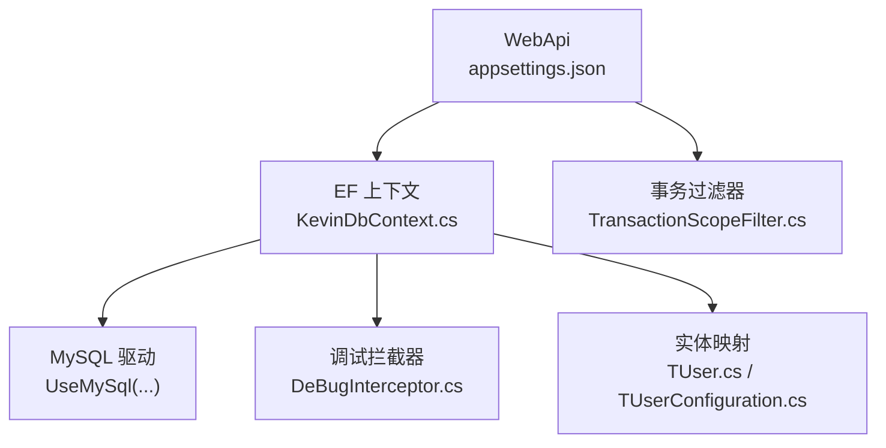
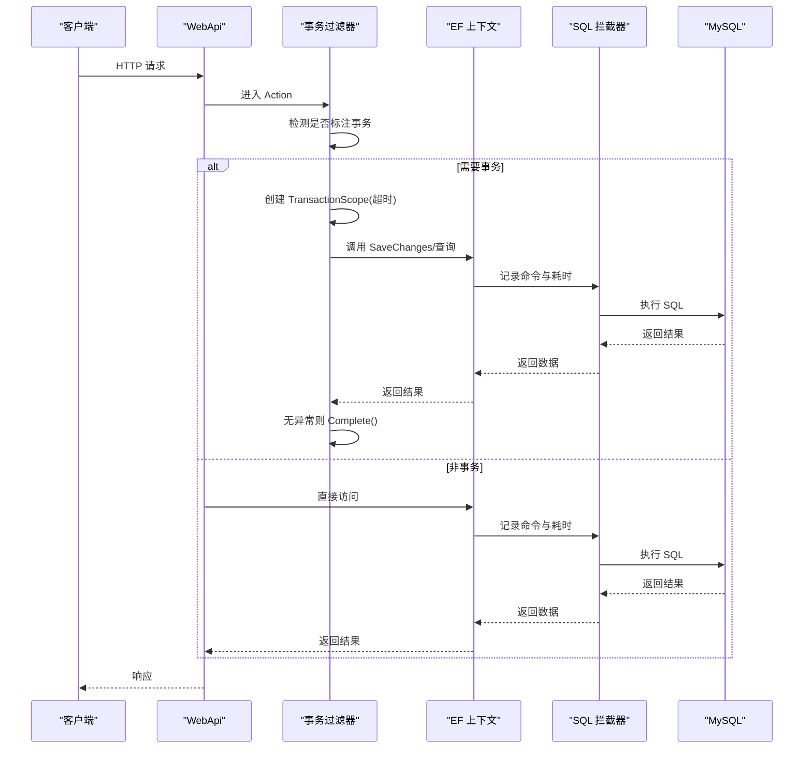
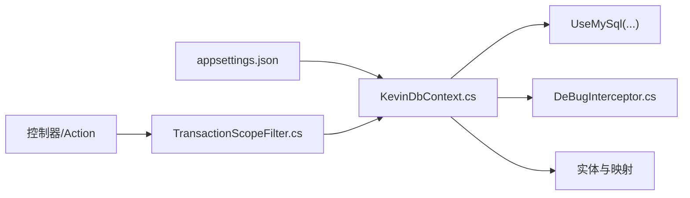

# 数据库问题

<cite>
**本文引用的文件**
- [appsettings.json](file://App/WebApi/appsettings.json)
- [appsettings.Development.json](file://App/WebApi/appsettings.Development.json)
- [KevinDbContext.cs](file://Kevin/Kevin.EntityFrameworkCore/Database/KevinDbContext.cs)
- [DeBugInterceptor.cs](file://Kevin/Kevin.EntityFrameworkCore/Interceptors/DeBugInterceptor.cs)
- [TransactionScopeFilter.cs](file://Kevin/Kevin.Web.Basics/Filters/TransactionScope/TransactionScopeFilter.cs)
- [TUserConfiguration.cs](file://Kevin/Kevin.EntityFrameworkCore/Configuration/TUserConfiguration.cs)
- [TUser.cs](file://Kevin/Domain/Entities/TUser.cs)
- [SYSTEM_DOCUMENTATION.md](file://SYSTEM_DOCUMENTATION.md)
- [数据库层说明.txt](file://Doc/项目相关/数据库层说明.txt)
</cite>

## 目录
1. [简介](#简介)
2. [项目结构](#项目结构)
3. [核心组件](#核心组件)
4. [架构总览](#架构总览)
5. [详细组件分析](#详细组件分析)
6. [依赖关系分析](#依赖关系分析)
7. [性能考虑](#性能考虑)
8. [故障排除指南](#故障排除指南)
9. [结论](#结论)
10. [附录](#附录)

## 简介
本故障排除文档聚焦于数据库相关问题，覆盖连接失败、查询性能问题、事务异常等常见场景的诊断与解决。结合本项目使用的 MySQL + Entity Framework（EF Core）技术栈，提供可操作的检查步骤、配置优化建议与排错流程，帮助快速定位并解决问题。

## 项目结构
本项目采用分层架构：Web API 入口、应用服务、领域模型、仓储实现以及 EF Core 数据访问层。数据库连接字符串在 Web 项目的 appsettings 中配置；EF 上下文与拦截器位于 Kevin.EntityFrameworkCore；事务控制通过 ASP.NET Core 过滤器实现。

图表来源
- [appsettings.json:12-15](file://App/WebApi/appsettings.json#L12-L15)
- [KevinDbContext.cs:83-132](file://Kevin/Kevin.EntityFrameworkCore/Database/KevinDbContext.cs#L83-L132)
- [DeBugInterceptor.cs:1-39](file://Kevin/Kevin.EntityFrameworkCore/Interceptors/DeBugInterceptor.cs#L1-L39)
- [TransactionScopeFilter.cs:1-48](file://Kevin/Kevin.Web.Basics/Filters/TransactionScope/TransactionScopeFilter.cs#L1-L48)
- [TUser.cs:1-99](file://Kevin/Domain/Entities/TUser.cs#L1-L99)
- [TUserConfiguration.cs:1-19](file://Kevin/Kevin.EntityFrameworkCore/Configuration/TUserConfiguration.cs#L1-L19)

章节来源
- [appsettings.json:12-15](file://App/WebApi/appsettings.json#L12-L15)
- [KevinDbContext.cs:83-132](file://Kevin/Kevin.EntityFrameworkCore/Database/KevinDbContext.cs#L83-L132)

## 核心组件
- 数据库连接与选项构建：在 EF 上下文中读取连接字符串并配置 MySQL 提供者、迁移程序集与历史表。
- SQL 日志与慢查询拦截：通过 DbCommandInterceptor 捕获命令执行时长，便于识别慢查询。
- 事务管理：基于 ActionFilter 的 TransactionScope 自动包裹带标记的方法，统一超时与回滚策略。
- 实体映射与种子数据：使用 Fluent API 和注解进行表名、字段名、类型映射及默认索引设置，并提供种子数据配置。

章节来源
- [KevinDbContext.cs:55-132](file://Kevin/Kevin.EntityFrameworkCore/Database/KevinDbContext.cs#L55-L132)
- [DeBugInterceptor.cs:10-35](file://Kevin/Kevin.EntityFrameworkCore/Interceptors/DeBugInterceptor.cs#L10-L35)
- [TransactionScopeFilter.cs:15-44](file://Kevin/Kevin.Web.Basics/Filters/TransactionScope/TransactionScopeFilter.cs#L15-L44)
- [KevinDbContext.cs:165-305](file://Kevin/Kevin.EntityFrameworkCore/Database/KevinDbContext.cs#L165-L305)

## 架构总览
下图展示了从请求进入 Web API 到数据库访问的关键路径，包括连接配置、SQL 拦截与事务边界。

图表来源
- [TransactionScopeFilter.cs:15-44](file://Kevin/Kevin.Web.Basics/Filters/TransactionScope/TransactionScopeFilter.cs#L15-L44)
- [KevinDbContext.cs:83-132](file://Kevin/Kevin.EntityFrameworkCore/Database/KevinDbContext.cs#L83-L132)
- [DeBugInterceptor.cs:10-35](file://Kevin/Kevin.EntityFrameworkCore/Interceptors/DeBugInterceptor.cs#L10-L35)

## 详细组件分析

### 数据库连接与配置
- 连接字符串位置：在 WebApi 的 appsettings 文件中定义 dbConnection，包含服务器地址、端口、数据库名、用户密码、字符集与命令超时等参数。
- EF 上下文加载：KevinDbContext 在构造时读取连接字符串与默认索引字段列表，并在 GetDbContextOptions 中配置 UseMySql、迁移程序集与历史表。
- 环境覆盖：Development 环境配置文件同样包含连接字符串，便于本地调试。

排查要点
- 确认 appsettings 中的 dbConnection 与实际 MySQL 实例一致（主机、端口、库名、账号、密码）。
- 若启动时报连接失败，优先验证网络连通性与 MySQL 服务状态。
- 如需调整连接池或超时，可在连接字符串中增加相应参数（例如最大池大小、连接超时），或在 UseMySql 的配置委托中扩展。

章节来源
- [appsettings.json:12-15](file://App/WebApi/appsettings.json#L12-L15)
- [appsettings.Development.json:12-15](file://App/WebApi/appsettings.Development.json#L12-L15)
- [KevinDbContext.cs:55-132](file://Kevin/Kevin.EntityFrameworkCore/Database/KevinDbContext.cs#L55-L132)

### 慢查询与 SQL 日志
- 拦截器：DeBugInterceptor 继承 DbCommandInterceptor，在 ReaderExecuted 中获取命令执行时长，可用于识别超过阈值的慢查询。
- 当前实现未输出日志，建议在拦截器中接入日志框架，将耗时超过设定阈值的 SQL 与参数写入日志，便于后续分析。

优化建议
- 为常用查询字段添加索引（项目已支持按配置为默认字段加索引）。
- 避免 N+1 查询，合理使用 Include/Select 投影。
- 对复杂查询进行分页与过滤，减少数据传输量。

章节来源
- [DeBugInterceptor.cs:10-35](file://Kevin/Kevin.EntityFrameworkCore/Interceptors/DeBugInterceptor.cs#L10-L35)
- [KevinDbContext.cs:240-247](file://Kevin/Kevin.EntityFrameworkCore/Database/KevinDbContext.cs#L240-L247)

### 事务管理与异常处理
- 事务过滤器：TransactionScopeFilter 在方法上检测到特定特性后，自动创建 TransactionScope，设置超时时间，并在成功时提交，异常或取消时回滚。
- 保存变更增强：KevinDbContext 重写 SaveChanges/SaveChangesAsync，注入领域事件发布、乐观并发 RowVersion 更新、多租户 TenantId 填充等逻辑。

常见问题
- 事务超时：根据业务复杂度调整过滤器中的超时时间。
- 并发冲突：确保实体具备 RowVersion 字段，并在修改时正确更新。
- 多租户隔离：新增数据自动填充 TenantId，避免跨租户数据污染。

章节来源
- [TransactionScopeFilter.cs:15-44](file://Kevin/Kevin.Web.Basics/Filters/TransactionScope/TransactionScopeFilter.cs#L15-L44)
- [KevinDbContext.cs:405-484](file://Kevin/Kevin.EntityFrameworkCore/Database/KevinDbContext.cs#L405-L484)

### 实体映射与导航属性
- 表名与字段名：OnModelCreating 中统一将表名转为小写并加前缀，字段名转为小写下划线格式；bool 映射为 bit，Guid 映射为 char(36)。
- 默认索引：根据配置项为指定字段自动创建索引，提升查询性能。
- 种子数据：通过 Configuration 类（如 TUserConfiguration）注入初始数据。

常见问题
- 实体映射错误：检查 Table/Description 注解与 OnModelCreating 的命名规则是否匹配。
- 导航属性加载：如需延迟加载，启用代理与懒加载；否则显式 Include 导航属性，避免 N+1。
- 类型不匹配：确保 CLR 类型与数据库列类型一致（如 bool/bit、Guid/char(36)）。

章节来源
- [KevinDbContext.cs:165-305](file://Kevin/Kevin.EntityFrameworkCore/Database/KevinDbContext.cs#L165-L305)
- [TUser.cs:1-99](file://Kevin/Domain/Entities/TUser.cs#L1-L99)
- [TUserConfiguration.cs:1-19](file://Kevin/Kevin.EntityFrameworkCore/Configuration/TUserConfiguration.cs#L1-L19)

## 依赖关系分析
- WebApi 通过 appsettings 提供连接字符串与全局配置。
- EF 上下文依赖 MySQL 驱动与迁移程序集，注册调试拦截器。
- 事务过滤器依赖 ASP.NET Core 管道与 System.Transactions。
- 实体与映射依赖注解与 Fluent API，种子数据由 Configuration 注入。

图表来源
- [appsettings.json:12-15](file://App/WebApi/appsettings.json#L12-L15)
- [KevinDbContext.cs:83-132](file://Kevin/Kevin.EntityFrameworkCore/Database/KevinDbContext.cs#L83-L132)
- [DeBugInterceptor.cs:1-39](file://Kevin/Kevin.EntityFrameworkCore/Interceptors/DeBugInterceptor.cs#L1-L39)
- [TransactionScopeFilter.cs:1-48](file://Kevin/Kevin.Web.Basics/Filters/TransactionScope/TransactionScopeFilter.cs#L1-L48)

章节来源
- [KevinDbContext.cs:83-132](file://Kevin/Kevin.EntityFrameworkCore/Database/KevinDbContext.cs#L83-L132)
- [TransactionScopeFilter.cs:15-44](file://Kevin/Kevin.Web.Basics/Filters/TransactionScope/TransactionScopeFilter.cs#L15-L44)

## 性能考虑
- 连接池与超时：在连接字符串中合理设置最大池大小、连接超时与命令超时，避免连接耗尽与长时间阻塞。
- 查询优化：为高频查询字段建立索引；使用分页、投影与条件过滤减少数据量；避免 N+1 查询。
- 日志与监控：启用慢查询拦截并接入日志系统；结合数据库监控工具观察执行计划与锁等待。
- 缓存策略：对读多写少的数据引入缓存（如 Redis），降低数据库压力。

[本节为通用指导，无需具体文件引用]

## 故障排除指南

### 数据库连接失败
症状
- 应用启动或首次访问时报无法连接到 MySQL。

诊断步骤
- 检查 MySQL 服务状态与端口可达性。
- 核对 appsettings 中的 dbConnection 是否正确（主机、端口、库名、用户名、密码）。
- 使用命令行工具测试连接（如 mysql -h ... -u ... -p）。
- 若使用 Docker，注意容器内网络与宿主机地址差异。

解决建议
- 修正连接字符串或网络配置。
- 若连接池耗尽，增大最大池大小或优化连接使用模式。
- 在 UseMySql 配置中增加重试与超时参数（视驱动支持情况）。

章节来源
- [SYSTEM_DOCUMENTATION.md:551-583](file://SYSTEM_DOCUMENTATION.md#L551-L583)
- [appsettings.json:12-15](file://App/WebApi/appsettings.json#L12-L15)
- [KevinDbContext.cs:83-132](file://Kevin/Kevin.EntityFrameworkCore/Database/KevinDbContext.cs#L83-L132)

### 查询性能问题（慢查询）
症状
- 接口响应缓慢，数据库 CPU/IO 升高。

诊断步骤
- 启用并完善 DeBugInterceptor，记录超过阈值的 SQL 与耗时。
- 查看数据库慢查询日志（MySQL slow_query_log），定位热点语句。
- 使用 EXPLAIN 分析执行计划，检查是否存在全表扫描或缺失索引。

解决建议
- 为高频查询字段添加索引（项目支持按配置自动为默认字段加索引）。
- 拆分复杂查询，使用分页与投影减少数据传输。
- 避免 N+1 查询，使用 Include 或 Select 投影。
- 调整连接池与超时，防止长事务占用连接。

章节来源
- [DeBugInterceptor.cs:10-35](file://Kevin/Kevin.EntityFrameworkCore/Interceptors/DeBugInterceptor.cs#L10-L35)
- [KevinDbContext.cs:240-247](file://Kevin/Kevin.EntityFrameworkCore/Database/KevinDbContext.cs#L240-L247)

### 事务异常
症状
- 批量操作部分成功或部分失败；出现超时或死锁。

诊断步骤
- 检查是否使用了事务过滤器，确认方法是否标注事务特性。
- 查看事务超时设置，必要时调大超时时间。
- 分析数据库锁等待与死锁日志，优化更新顺序与索引。

解决建议
- 缩小事务范围，减少长事务持有锁的时间。
- 对高并发更新使用乐观并发（RowVersion）避免冲突。
- 对批量插入/更新考虑分批提交，降低锁竞争。

章节来源
- [TransactionScopeFilter.cs:15-44](file://Kevin/Kevin.Web.Basics/Filters/TransactionScope/TransactionScopeFilter.cs#L15-L44)
- [KevinDbContext.cs:405-484](file://Kevin/Kevin.EntityFrameworkCore/Database/KevinDbContext.cs#L405-L484)

### Entity Framework 相关问题
实体映射错误
- 现象：表名或字段名不符合预期，类型映射异常。
- 排查：检查实体上的注解与 OnModelCreating 的命名规则；确认 bool/bit、Guid/char(36) 映射。
- 解决：统一命名规范或使用 Fluent API 精确映射。

导航属性加载问题
- 现象：关联数据未加载或多次查询导致性能下降。
- 排查：确认是否启用懒加载代理；是否在查询中使用 Include/Select。
- 解决：按需启用懒加载或使用显式加载，避免 N+1。

章节来源
- [KevinDbContext.cs:165-305](file://Kevin/Kevin.EntityFrameworkCore/Database/KevinDbContext.cs#L165-L305)
- [TUser.cs:1-99](file://Kevin/Domain/Entities/TUser.cs#L1-L99)

### 连接池配置优化建议
- 连接数限制：根据并发与数据库承载能力设置最大池大小，避免连接耗尽。
- 超时设置：合理设置连接超时与命令超时，防止请求长时间挂起。
- 重试机制：在驱动或中间件层实现指数退避重试，提高容错性。
- 监控告警：监控连接池使用率与慢查询，及时扩容或优化。

[本节为通用指导，无需具体文件引用]

## 结论
通过合理的连接配置、慢查询拦截、事务管理与实体映射规范，可以有效降低数据库问题的发生概率并提升系统稳定性。建议在生产环境启用完善的日志与监控，持续优化查询与索引，确保在高并发场景下的稳定运行。

[本节为总结，无需具体文件引用]

## 附录
- 数据库迁移命令参考：Add-Migration、Update-Database。
- 支持的数据库驱动与脚手架命令见“数据库层说明”。

章节来源
- [数据库层说明.txt:1-32](file://Doc/项目相关/数据库层说明.txt#L1-L32)