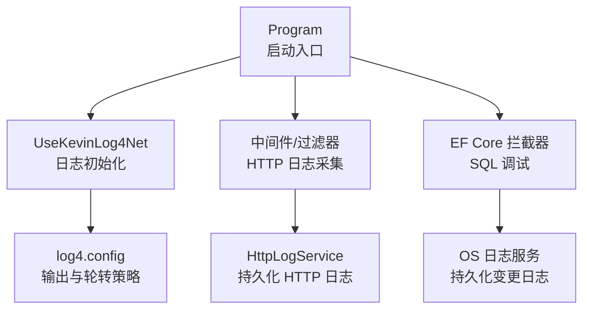
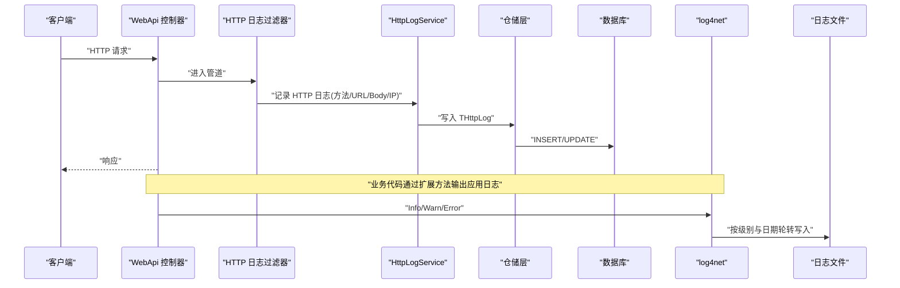
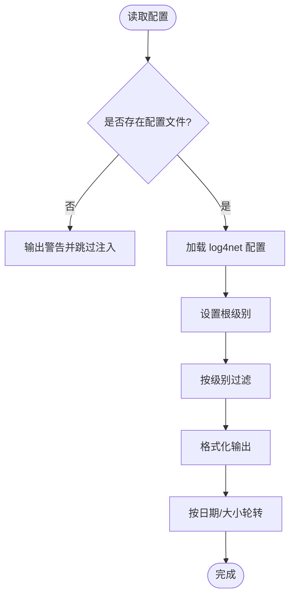
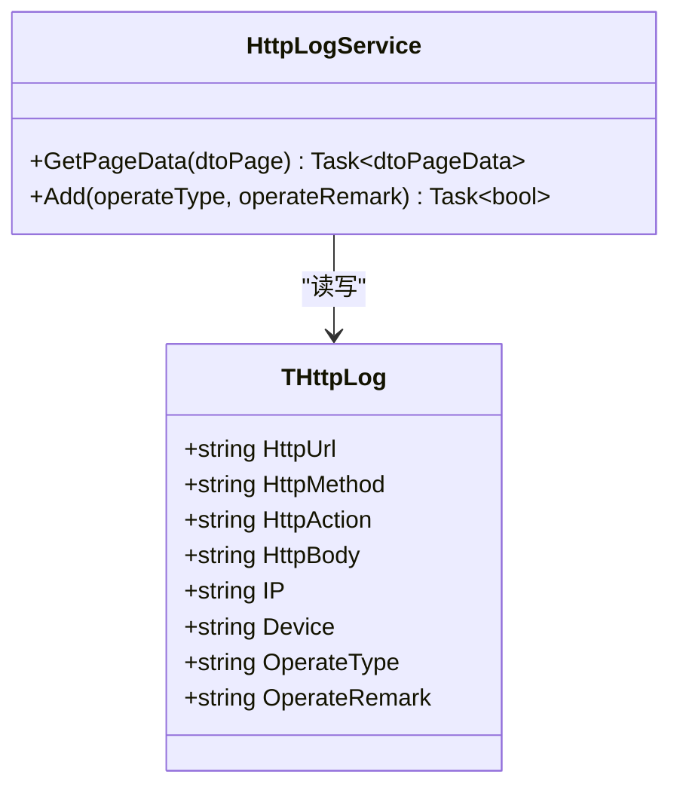
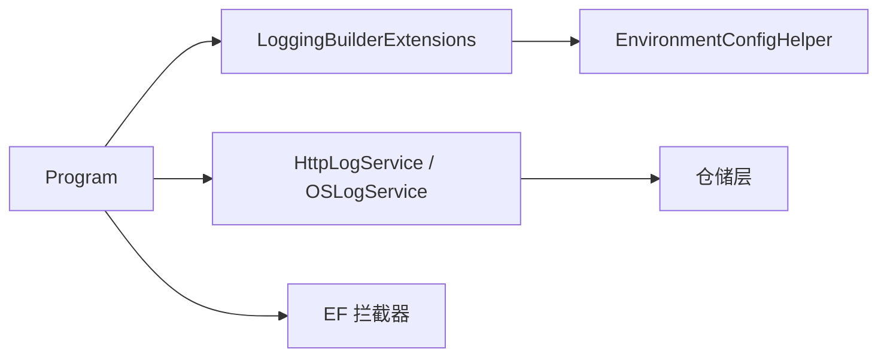

# 日志与调试

<cite>
**本文引用的文件**
- [Program.cs](file://App/WebApi/Program.cs)
- [LoggingBuilderExtensions.cs](file://Kevin/kevin.Module/Kevin.log4Net/LoggingBuilderExtensions.cs)
- [LogHelper.cs](file://Kevin/kevin.Module/Kevin.log4Net/LogHelper.cs)
- [log4.config](file://App/WebApi/LogConfigs/log4.config)
- [appsettings.json](file://App/WebApi/appsettings.json)
- [HttpLogService.cs](file://Kevin/Application/Services/HttpLogService.cs)
- [THttpLog.cs](file://Kevin/Domain/Entities/THttpLog.cs)
- [OSLogService.cs](file://Kevin/Application/Services/OSLogService.cs)
- [TOSLog.cs](file://Kevin/Domain/Entities/TOSLog.cs)
- [TLog.cs](file://Kevin/Domain/Entities/TLog.cs)
- [DeBugInterceptor.cs](file://Kevin/ Kevin.EntityFrameworkCore/Interceptors/DeBugInterceptor.cs)
</cite>

## 目录
1. [简介](#简介)
2. [项目结构](#项目结构)
3. [核心组件](#核心组件)
4. [架构总览](#架构总览)
5. [详细组件分析](#详细组件分析)
6. [依赖关系分析](#依赖关系分析)
7. [性能考虑](#性能考虑)
8. [故障排查指南](#故障排查指南)
9. [结论](#结论)
10. [附录](#附录)

## 简介
本指南面向本项目的日志记录与调试实践，覆盖以下主题：
- 日志级别配置、日志格式定制、日志文件轮转
- 应用程序日志、HTTP 请求日志、数据库操作日志的收集与分析
- 调试技巧与工具使用（断点调试、远程调试、性能分析）
- 错误追踪与异常处理最佳实践，帮助快速定位问题

## 项目结构
本项目采用分层架构，日志能力贯穿基础设施层与应用层：
- WebApi 入口 Program 中启用自定义 log4net 扩展，加载环境相关配置文件
- log4net 通过扩展方法统一接入，支持按环境选择配置文件
- 应用服务提供 HTTP 日志与系统操作日志的分页查询能力
- EF Core 拦截器用于捕获数据库执行信息，辅助排障

图表来源
- [Program.cs:23-85](file://App/WebApi/Program.cs#L23-L85)
- [LoggingBuilderExtensions.cs:9-38](file://Kevin/kevin.Module/Kevin.log4Net/LoggingBuilderExtensions.cs#L9-L38)
- [log4.config:1-137](file://App/WebApi/LogConfigs/log4.config#L1-L137)
- [HttpLogService.cs:17-34](file://Kevin/Application/Services/HttpLogService.cs#L17-L34)
- [OSLogService.cs:15-35](file://Kevin/Application/Services/OSLogService.cs#L15-L35)

章节来源
- [Program.cs:23-85](file://App/WebApi/Program.cs#L23-L85)
- [LoggingBuilderExtensions.cs:9-38](file://Kevin/kevin.Module/Kevin.log4Net/LoggingBuilderExtensions.cs#L9-L38)
- [log4.config:1-137](file://App/WebApi/LogConfigs/log4.config#L1-L137)

## 核心组件
- 日志初始化与配置加载
  - 通过扩展方法在 Program 启动时加载 log4net 配置文件，自动根据环境变量选择对应配置
  - 未找到配置文件时给出警告并跳过注入，便于容器化部署
- 日志输出与轮转
  - 基于 RollingFileAppender，按日期与大小进行轮转，限制最大文件大小与保留数量
  - 为不同级别分别定义 Appender，便于分级归档
- HTTP 日志
  - 通过服务层提供分页查询与新增接口，实体包含请求方法、URL、Body、IP、设备等信息
- 系统操作日志
  - 提供分页查询与过滤能力，记录表名、外键 ID、标记、内容、操作人等
- 数据库调试
  - 通过 EF Core 拦截器捕获 SQL 执行信息，辅助定位慢查询与异常

章节来源
- [LoggingBuilderExtensions.cs:9-38](file://Kevin/kevin.Module/Kevin.log4Net/LoggingBuilderExtensions.cs#L9-L38)
- [log4.config:1-137](file://App/WebApi/LogConfigs/log4.config#L1-L137)
- [HttpLogService.cs:17-34](file://Kevin/Application/Services/HttpLogService.cs#L17-L34)
- [THttpLog.cs:1-78](file://Kevin/Domain/Entities/THttpLog.cs#L1-L78)
- [OSLogService.cs:15-35](file://Kevin/Application/Services/OSLogService.cs#L15-L35)
- [TOSLog.cs:1-77](file://Kevin/Domain/Entities/TOSLog.cs#L1-L77)
- [DeBugInterceptor.cs](file://Kevin/ Kevin.EntityFrameworkCore/Interceptors/DeBugInterceptor.cs)

## 架构总览
下图展示了从请求进入、日志采集到落库与文件输出的整体流程。

图表来源
- [Program.cs:23-85](file://App/WebApi/Program.cs#L23-L85)
- [LoggingBuilderExtensions.cs:9-38](file://Kevin/kevin.Module/Kevin.log4Net/LoggingBuilderExtensions.cs#L9-L38)
- [log4.config:1-137](file://App/WebApi/LogConfigs/log4.config#L1-L137)
- [HttpLogService.cs:17-34](file://Kevin/Application/Services/HttpLogService.cs#L17-L34)

## 详细组件分析

### 日志级别配置与格式定制
- 级别控制
  - 根节点设置全局最低级别，各 Appender 通过 LevelRangeFilter 限定只接收特定级别
  - 可通过修改根节点与各 Appender 的级别实现精细化控制
- 格式定制
  - PatternLayout 的 conversionPattern 可自定义时间、线程、级别、对象、消息等字段
- 多环境配置
  - 扩展方法根据环境变量动态选择配置文件路径，便于开发/测试/生产差异化配置

图表来源
- [LoggingBuilderExtensions.cs:9-38](file://Kevin/kevin.Module/Kevin.log4Net/LoggingBuilderExtensions.cs#L9-L38)
- [log4.config:1-137](file://App/WebApi/LogConfigs/log4.config#L1-L137)

章节来源
- [log4.config:1-137](file://App/WebApi/LogConfigs/log4.config#L1-L137)
- [LoggingBuilderExtensions.cs:9-38](file://Kevin/kevin.Module/Kevin.log4Net/LoggingBuilderExtensions.cs#L9-L38)

### 日志文件轮转
- 轮转策略
  - 同时支持按日期与按大小轮转，避免单文件过大
  - 限制最大文件大小与历史备份数量，防止磁盘占满
- 并发写入
  - 使用最小锁定模式提升多进程并发写入稳定性
- 建议
  - 生产环境建议关闭 Debug 级别，仅保留 Info/Warn/Error
  - 定期清理过期日志或结合外部日志平台集中管理

章节来源
- [log4.config:1-137](file://App/WebApi/LogConfigs/log4.config#L1-L137)

### 应用程序日志
- 使用方式
  - 通过扩展方法将 log4net 集成到 Microsoft.Extensions.Logging
  - 业务代码可直接注入 ILogger 或使用封装的 LogHelper
- 输出位置
  - 依据配置输出至文件，并按级别分文件存储
- 建议
  - 关键路径增加结构化上下文（如租户、用户、请求ID）
  - 避免在高频路径输出过多 Debug 日志

章节来源
- [LoggingBuilderExtensions.cs:9-38](file://Kevin/kevin.Module/Kevin.log4Net/LoggingBuilderExtensions.cs#L9-L38)
- [LogHelper.cs:1-76](file://Kevin/kevin.Module/Kevin.log4Net/LogHelper.cs#L1-L76)

### HTTP 请求日志
- 数据模型
  - 记录请求方法、URL、Body、IP、设备、操作类型与备注等
- 服务接口
  - 提供分页查询与新增接口，支持关键字搜索
- 采集时机
  - 建议在管道早期（过滤器或中间件）采集，确保能捕获异常路径

图表来源
- [THttpLog.cs:1-78](file://Kevin/Domain/Entities/THttpLog.cs#L1-L78)
- [HttpLogService.cs:17-34](file://Kevin/Application/Services/HttpLogService.cs#L17-L34)

章节来源
- [THttpLog.cs:1-78](file://Kevin/Domain/Entities/THttpLog.cs#L1-L78)
- [HttpLogService.cs:17-34](file://Kevin/Application/Services/HttpLogService.cs#L17-L34)

### 数据库操作日志
- 拦截器
  - 通过 EF Core 拦截器捕获 SQL 执行信息，便于定位慢查询与异常
- 关联日志
  - 可将关键 SQL 与 OS 日志关联，形成完整审计链
- 建议
  - 仅在需要时开启详细 SQL 日志，避免影响性能
  - 对敏感字段进行脱敏处理

章节来源
- [DeBugInterceptor.cs](file://Kevin/ Kevin.EntityFrameworkCore/Interceptors/DeBugInterceptor.cs)

### 系统操作日志
- 数据模型
  - 记录表名、外键 ID、标记、内容、操作人、IP、设备等
- 服务接口
  - 提供分页查询与过滤，支持按内容、标记、表名、ID 检索
- 用途
  - 用于审计与回溯，配合 HTTP 日志形成端到端链路

章节来源
- [TOSLog.cs:1-77](file://Kevin/Domain/Entities/TOSLog.cs#L1-L77)
- [OSLogService.cs:15-35](file://Kevin/Application/Services/OSLogService.cs#L15-L35)

### 通用日志实体与事件
- 实体设计
  - 通用日志实体包含标记、类型、内容，并在创建时触发领域事件
- 用途
  - 作为统一日志载体，便于后续扩展与聚合

章节来源
- [TLog.cs:1-46](file://Kevin/Domain/Entities/TLog.cs#L1-L46)

## 依赖关系分析
- Program 依赖日志扩展以初始化 log4net
- 日志扩展依赖环境配置助手以选择配置文件
- 应用服务依赖仓储与上下文访问器以持久化日志
- EF 拦截器依赖 DbContext 生命周期以捕获 SQL

图表来源
- [Program.cs:23-85](file://App/WebApi/Program.cs#L23-L85)
- [LoggingBuilderExtensions.cs:9-38](file://Kevin/kevin.Module/Kevin.log4Net/LoggingBuilderExtensions.cs#L9-L38)
- [HttpLogService.cs:17-34](file://Kevin/Application/Services/HttpLogService.cs#L17-L34)
- [OSLogService.cs:15-35](file://Kevin/Application/Services/OSLogService.cs#L15-L35)
- [DeBugInterceptor.cs](file://Kevin/ Kevin.EntityFrameworkCore/Interceptors/DeBugInterceptor.cs)

章节来源
- [Program.cs:23-85](file://App/WebApi/Program.cs#L23-L85)
- [LoggingBuilderExtensions.cs:9-38](file://Kevin/kevin.Module/Kevin.log4Net/LoggingBuilderExtensions.cs#L9-L38)

## 性能考虑
- 日志级别
  - 生产环境降低默认级别，减少 I/O 压力
- 轮转策略
  - 合理设置文件大小与保留数量，避免频繁滚动
- 异步写入
  - 在高吞吐场景下评估异步写入方案
- 采样与过滤
  - 对高频日志进行采样或条件过滤
- 监控与告警
  - 结合外部日志平台与指标监控，及时发现异常峰值

[本节为通用指导，不直接分析具体文件]

## 故障排查指南
- 常见问题
  - 配置文件未找到：检查环境变量与相对路径解析逻辑
  - 日志未输出：确认根级别与各 Appender 级别是否匹配
  - 文件无法写入：检查权限与磁盘空间
- 定位步骤
  - 查看根级别与对应级别 Appender 的配置
  - 检查 Program 启动时的日志初始化调用
  - 在关键路径增加结构化日志上下文
- 工具与方法
  - 使用调试器在 Program 与过滤器处设置断点
  - 使用远程调试连接运行中的进程
  - 使用性能分析工具（CPU/内存/GC）定位瓶颈

章节来源
- [Program.cs:23-85](file://App/WebApi/Program.cs#L23-L85)
- [LoggingBuilderExtensions.cs:9-38](file://Kevin/kevin.Module/Kevin.log4Net/LoggingBuilderExtensions.cs#L9-L38)
- [log4.config:1-137](file://App/WebApi/LogConfigs/log4.config#L1-L137)

## 结论
本项目通过统一的日志初始化与配置加载机制，结合文件轮转与分级输出，提供了完善的日志能力；通过 HTTP 日志与服务层查询接口，实现了请求级审计；通过 EF 拦截器与系统操作日志，形成了端到端的可观测性。建议在生产环境严格管控日志级别与轮转策略，并结合外部日志平台与监控体系，进一步提升问题定位效率。

## 附录
- 配置项参考
  - 日志级别：在根节点与各 Appender 中设置
  - 轮转策略：按日期与大小组合使用
  - 环境变量：用于选择不同环境的配置文件
- 实用建议
  - 为每个模块定义独立的日志命名空间，便于过滤
  - 对敏感信息进行脱敏后再写入日志
  - 定期审查日志策略，平衡可观测性与成本

[本节为通用指导，不直接分析具体文件]