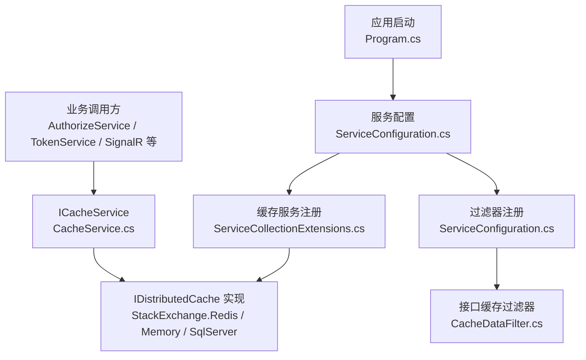
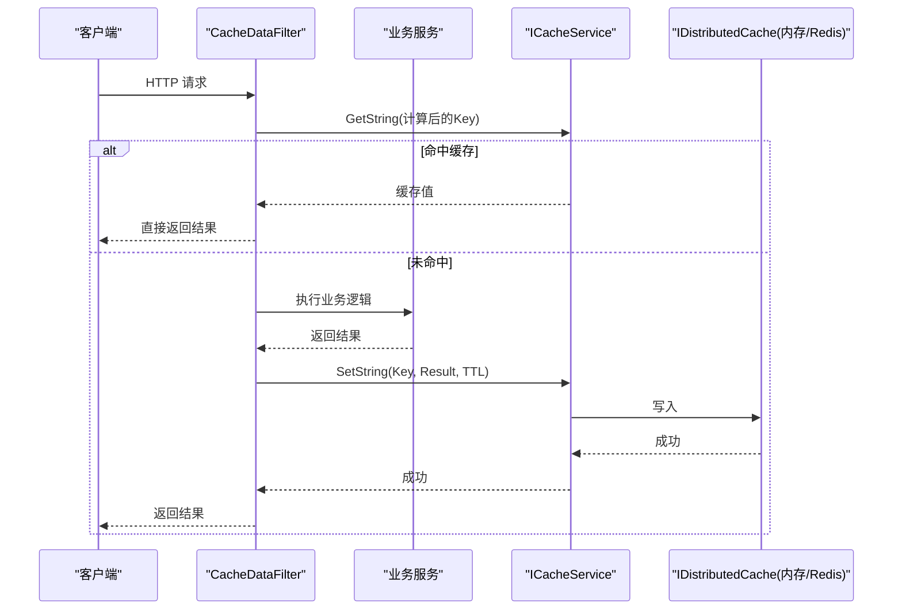
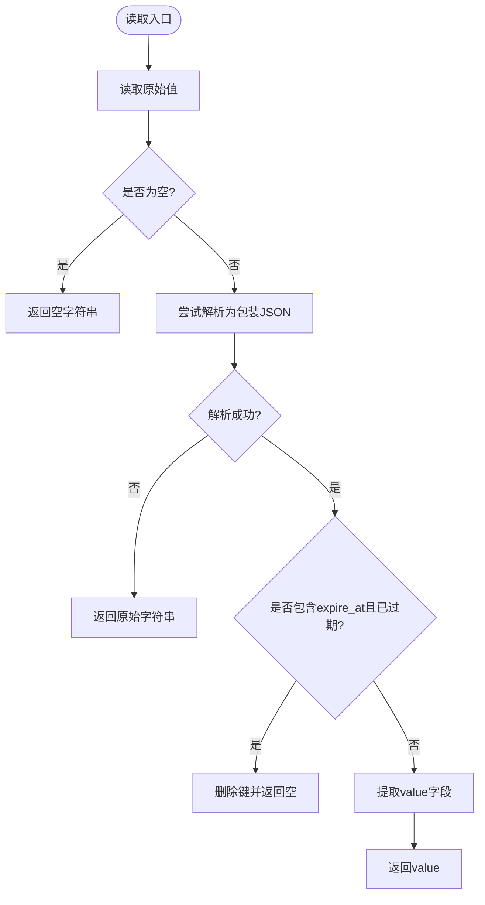
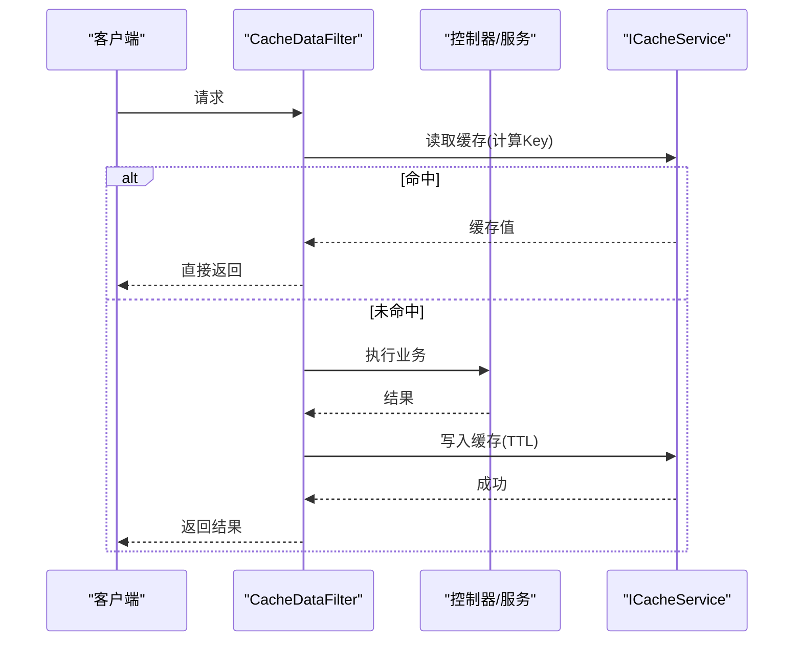
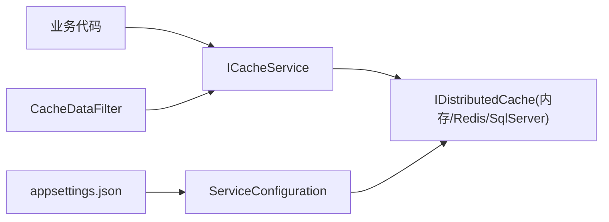
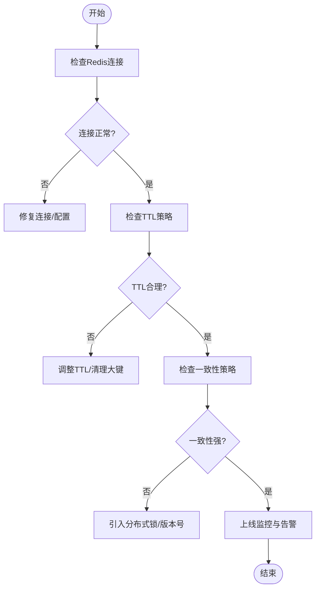

# 缓存问题

<cite>
**本文引用的文件**
- [CacheService.cs](file://Kevin/kevin.Module/kevin.Cache/Service/CacheService.cs)
- [ICacheService.cs](file://Kevin/kevin.Module/kevin.Cache/Service/ICacheService.cs)
- [ServiceCollectionExtensions.cs](file://Kevin/kevin.Module/kevin.Cache/ServiceCollectionExtensions.cs)
- [ApplicationBuilderExtensions.cs](file://Kevin/kevin.Module/kevin.Cache/ApplicationBuilderExtensions.cs)
- [RedisConnectionManager.cs](file://Kevin/kevin.Module/Kevin.Common/Manager/RedisConnectionManager.cs)
- [CacheDataFilter.cs](file://Kevin/Kevin.Web.Basics/Filters/CacheDataFilter.cs)
- [appsettings.json](file://App/WebApi/appsettings.json)
- [ServiceConfiguration.cs](file://Kevin/Kevin.Web.Basics/Extensions/ServiceConfiguration.cs)
- [Program.cs](file://App/WebApi/Program.cs)
</cite>

## 目录
1. [简介](#简介)
2. [项目结构](#项目结构)
3. [核心组件](#核心组件)
4. [架构总览](#架构总览)
5. [详细组件分析](#详细组件分析)
6. [依赖关系分析](#依赖关系分析)
7. [性能考量](#性能考量)
8. [故障排除指南](#故障排除指南)
9. [结论](#结论)
10. [附录](#附录)

## 简介
本文件面向缓存相关问题的诊断与解决，覆盖 Redis 连接失败、缓存数据不一致、内存溢出等典型场景。文档基于仓库中缓存模块的实现与配置，提供可操作的检查步骤、优化建议与分布式一致性方案，帮助快速定位并修复问题。

## 项目结构
缓存能力由 kevin.Cache 模块提供，通过 Microsoft.Extensions.Caching.Distributed 抽象实现，支持内存、SQL Server、Redis 等多种后端。应用启动时注册服务，业务代码通过 ICacheService 访问缓存；同时存在一个基于 ActionFilter 的接口级缓存装饰器 CacheDataFilter，用于对控制器返回结果进行缓存。

图表来源
- [Program.cs:23-85](file://App/WebApi/Program.cs#L23-L85)
- [ServiceConfiguration.cs:121-128](file://Kevin/Kevin.Web.Basics/Extensions/ServiceConfiguration.cs#L121-L128)
- [ServiceCollectionExtensions.cs:11-46](file://Kevin/kevin.Module/kevin.Cache/ServiceCollectionExtensions.cs#L11-L46)
- [CacheDataFilter.cs:17-123](file://Kevin/Kevin.Web.Basics/Filters/CacheDataFilter.cs#L17-L123)
- [CacheService.cs:8-222](file://Kevin/kevin.Module/kevin.Cache/Service/CacheService.cs#L8-L222)

章节来源
- [Program.cs:23-85](file://App/WebApi/Program.cs#L23-L85)
- [ServiceConfiguration.cs:121-128](file://Kevin/Kevin.Web.Basics/Extensions/ServiceConfiguration.cs#L121-L128)
- [ServiceCollectionExtensions.cs:11-46](file://Kevin/kevin.Module/kevin.Cache/ServiceCollectionExtensions.cs#L11-L46)
- [CacheDataFilter.cs:17-123](file://Kevin/Kevin.Web.Basics/Filters/CacheDataFilter.cs#L17-L123)
- [CacheService.cs:8-222](file://Kevin/kevin.Module/kevin.Cache/Service/CacheService.cs#L8-L222)

## 核心组件
- ICacheService/CacheService：统一封装 IDistributedCache 的字符串与对象存取、过期控制、键存在性判断，并对读取路径做包装格式兼容与过期校验。
- ServiceCollectionExtensions：提供 AddKevinMemoryCache、AddKevineRedisCache、AddKevinSqlServerCache 三种后端注册方式，并注入 ICacheService。
- CacheDataFilter：在请求进入和返回阶段读写缓存，按动作名、查询串、请求体、可选 Authorization 头生成唯一键，支持 TTL。
- RedisConnectionManager：为直接使用 StackExchange.Redis 的场景提供单例连接管理（AbortOnConnectFail=false，重试与超时配置）。

章节来源
- [ICacheService.cs:1-69](file://Kevin/kevin.Module/kevin.Cache/Service/ICacheService.cs#L1-L69)
- [CacheService.cs:8-222](file://Kevin/kevin.Module/kevin.Cache/Service/CacheService.cs#L8-L222)
- [ServiceCollectionExtensions.cs:11-46](file://Kevin/kevin.Module/kevin.Cache/ServiceCollectionExtensions.cs#L11-L46)
- [CacheDataFilter.cs:17-123](file://Kevin/Kevin.Web.Basics/Filters/CacheDataFilter.cs#L17-L123)
- [RedisConnectionManager.cs:9-96](file://Kevin/kevin.Module/Kevin.Common/Manager/RedisConnectionManager.cs#L9-L96)

## 架构总览
应用通过 DI 容器获取 ICacheService，底层由 IDistributedCache 实现具体存储。当前默认启用内存缓存，同时提供了 Redis 接入扩展方法；配置文件包含 Redis 连接串。过滤器层可对接口返回进行缓存，提升读性能。

图表来源
- [CacheDataFilter.cs:31-123](file://Kevin/Kevin.Web.Basics/Filters/CacheDataFilter.cs#L31-L123)
- [ServiceCollectionExtensions.cs:11-46](file://Kevin/kevin.Module/kevin.Cache/ServiceCollectionExtensions.cs#L11-L46)
- [CacheService.cs:16-222](file://Kevin/kevin.Module/kevin.Cache/Service/CacheService.cs#L16-L222)

## 详细组件分析

### 缓存服务 CacheService
- 功能要点
  - 提供 Remove/SetString/SetObject/GetString/GetObject/IsContainKey 等方法。
  - 写入时可选择是否设置绝对过期时间；读取时对“包装格式”进行解析与过期校验，兼容旧版原始字符串。
  - 异常处理：写操作捕获异常返回 false；读操作在解析失败或过期时走降级或清理逻辑。
- 复杂度与性能
  - 序列化/反序列化开销与 JSON 大小成正比；大对象频繁存取会放大 CPU 与网络开销。
  - 过期校验在读取时执行，避免脏读，但增加少量解析成本。
- 错误处理
  - 写操作吞异常返回布尔，便于上层容错；Get 系列在空值或过期时抛出异常，需调用方捕获。
- 优化建议
  - 合理设置 TTL，避免热点键长期驻留导致内存压力。
  - 对大对象考虑压缩或拆分键空间。
  - 使用统一的 Key 前缀与命名规范，降低冲突概率。

图表来源
- [CacheService.cs:127-206](file://Kevin/kevin.Module/kevin.Cache/Service/CacheService.cs#L127-L206)

章节来源
- [CacheService.cs:8-222](file://Kevin/kevin.Module/kevin.Cache/Service/CacheService.cs#L8-L222)
- [ICacheService.cs:1-69](file://Kevin/kevin.Module/kevin.Cache/Service/ICacheService.cs#L1-L69)

### 接口级缓存过滤器 CacheDataFilter
- 行为说明
  - OnActionExecuting：根据 ActionDisplayName、Query、Body、可选 Authorization 头生成 MD5 键，尝试从缓存读取并短路响应。
  - OnActionExecuted：若缓存未命中则写入结果，TTL 由属性 TTL（秒）决定。
- 风险点
  - Body 重复读取需要启用缓冲；过滤器内部已处理流复制与复位。
  - 键中包含敏感信息（如 Authorization），需评估安全性与必要性。
- 优化建议
  - 针对高频只读接口开启缓存；写接口应主动失效相关键。
  - 合理设置 TTL，避免过短导致命中率低、过长导致数据陈旧。

图表来源
- [CacheDataFilter.cs:31-123](file://Kevin/Kevin.Web.Basics/Filters/CacheDataFilter.cs#L31-L123)

章节来源
- [CacheDataFilter.cs:17-123](file://Kevin/Kevin.Web.Basics/Filters/CacheDataFilter.cs#L17-L123)

### Redis 连接管理 RedisConnectionManager
- 设计要点
  - 单例 ConnectionMultiplexer，延迟初始化，线程安全。
  - AbortOnConnectFail=false，连接失败不中断进程，后台重连；配置 ConnectRetry 与 ConnectTimeout。
  - 暴露 GetDatabase(db) 以获取指定库。
- 适用场景
  - 当业务直接调用 StackExchange.Redis 时使用；本项目缓存主路径通过 IDistributedCache，此管理器可作为补充。

章节来源
- [RedisConnectionManager.cs:9-96](file://Kevin/kevin.Module/Kevin.Common/Manager/RedisConnectionManager.cs#L9-L96)

### 服务注册与配置
- 缓存后端选择
  - 默认启用内存缓存；可通过 AddKevineRedisCache 切换至 Redis。
  - 连接串位于 appsettings 的 ConnectionStrings.redisConnection。
- 过滤器注册
  - 全局 MVC 过滤器注册在 ServiceConfiguration 中完成。
- 应用启动
  - Program 中构建 WebApplication，加载配置与服务，最终运行。

章节来源
- [ServiceCollectionExtensions.cs:11-46](file://Kevin/kevin.Module/kevin.Cache/ServiceCollectionExtensions.cs#L11-L46)
- [ServiceConfiguration.cs:121-128](file://Kevin/Kevin.Web.Basics/Extensions/ServiceConfiguration.cs#L121-L128)
- [appsettings.json:12-15](file://App/WebApi/appsettings.json#L12-L15)
- [Program.cs:23-85](file://App/WebApi/Program.cs#L23-L85)

## 依赖关系分析
- 松耦合：业务仅依赖 ICacheService；具体存储由 DI 容器注入 IDistributedCache 实现。
- 外部依赖：StackExchange.Redis（Redis 模式）、Microsoft.Extensions.Caching.SqlServer（可选）。
- 过滤器依赖：ICacheService 与 JSON 工具类。

图表来源
- [ServiceCollectionExtensions.cs:11-46](file://Kevin/kevin.Module/kevin.Cache/ServiceCollectionExtensions.cs#L11-L46)
- [ServiceConfiguration.cs:121-128](file://Kevin/Kevin.Web.Basics/Extensions/ServiceConfiguration.cs#L121-L128)
- [appsettings.json:12-15](file://App/WebApi/appsettings.json#L12-L15)

章节来源
- [ServiceCollectionExtensions.cs:11-46](file://Kevin/kevin.Module/kevin.Cache/ServiceCollectionExtensions.cs#L11-L46)
- [ServiceConfiguration.cs:121-128](file://Kevin/Kevin.Web.Basics/Extensions/ServiceConfiguration.cs#L121-L128)
- [appsettings.json:12-15](file://App/WebApi/appsettings.json#L12-L15)

## 性能考量
- 命中率与 TTL
  - 热点读接口适合开启过滤器缓存；TTL 应根据数据更新频率设定，兼顾新鲜度与命中率。
- 序列化成本
  - 大对象序列化/反序列化成本高，建议拆分或限制体积。
- 连接与超时
  - Redis 模式下关注连接池、超时与重试参数；确保网络稳定与服务器资源充足。
- 内存占用
  - 监控缓存键数量与平均大小；必要时采用分级缓存或淘汰策略。

[本节为通用指导，不直接分析具体文件]

## 故障排除指南

### 一、Redis 连接失败
症状
- 启动时报连接异常或运行时缓存读写失败。
- 日志中出现连接失败/恢复事件。

排查步骤
- 验证配置
  - 确认 appsettings.json 中 ConnectionStrings.redisConnection 正确，端口、密码、数据库索引无误。
- 检查服务状态
  - 本地或远程 ping Redis 服务，确认可达性与鉴权通过。
- 观察连接行为
  - 若使用 RedisConnectionManager，注意其 AbortOnConnectFail=false 会在后台重连；若使用 IDistributedCache，请确认已调用 AddKevineRedisCache 并传入正确的配置委托。
- 网络与防火墙
  - 检查云厂商安全组/防火墙规则，放行对应端口。
- 日志与指标
  - 查看应用日志中的连接失败/恢复事件；监控 Redis 服务端连接数与慢查询。

解决建议
- 修正连接串与权限。
- 调整 ConnectTimeout/ConnectRetry（如使用 RedisConnectionManager）。
- 在部署环境确保 Redis 高可用与网络连通。

章节来源
- [appsettings.json:12-15](file://App/WebApi/appsettings.json#L12-L15)
- [ServiceCollectionExtensions.cs:31-41](file://Kevin/kevin.Module/kevin.Cache/ServiceCollectionExtensions.cs#L31-L41)
- [RedisConnectionManager.cs:49-71](file://Kevin/kevin.Module/Kevin.Common/Manager/RedisConnectionManager.cs#L49-L71)

### 二、缓存数据不一致
症状
- 读到的数据与数据库不一致，或不同节点看到不同值。

排查步骤
- 检查写入路径
  - 确认写操作后是否及时更新或删除相关缓存键。
- 检查过期策略
  - 确认 TTL 是否过短导致频繁回源，或过长导致陈旧数据。
- 检查过滤器键生成
  - 确认 CacheDataFilter 的键包含必要维度（如用户身份、租户、查询参数），避免跨上下文污染。
- 并发写冲突
  - 热点键并发写可能导致竞态；结合分布式锁或版本号控制。

解决建议
- 采用“先更新数据库，再删除缓存”的策略，减少短暂不一致窗口。
- 对强一致场景引入分布式锁或消息队列顺序化更新。
- 为关键键添加版本或时间戳，读取时校验。

章节来源
- [CacheDataFilter.cs:58-114](file://Kevin/Kevin.Web.Basics/Filters/CacheDataFilter.cs#L58-L114)
- [CacheService.cs:82-122](file://Kevin/kevin.Module/kevin.Cache/Service/CacheService.cs#L82-L122)

### 三、内存溢出（OOM）
症状
- 进程内存持续增长，出现 GC 压力或 OOM。

排查步骤
- 缓存键规模
  - 统计键数量与平均大小，识别热点键与异常大键。
- 过期策略
  - 检查是否大量键未设置 TTL，或 TTL 过长。
- 序列化体积
  - 检查是否存在超大对象被缓存。
- 其他内存泄漏
  - 结合堆转储分析对象保留链。

解决建议
- 为所有键设置合理 TTL，避免永久驻留。
- 限制缓存对象大小，必要时分片或归档。
- 监控内存与 GC 指标，扩容或优化热点路径。

章节来源
- [CacheService.cs:82-122](file://Kevin/kevin.Module/kevin.Cache/Service/CacheService.cs#L82-L122)
- [CacheDataFilter.cs:110-114](file://Kevin/Kevin.Web.Basics/Filters/CacheDataFilter.cs#L110-L114)

### 四、如何检查 Redis 服务状态
- 命令行检测
  - 使用 redis-cli 连接并执行 ping，确认服务在线与鉴权正确。
- 应用侧检测
  - 临时通过 ICacheService 写入/读取测试键，观察是否成功。
- 监控面板
  - 查看 Redis 客户端连接数、内存使用、命令耗时。

章节来源
- [appsettings.json:12-15](file://App/WebApi/appsettings.json#L12-L15)
- [CacheService.cs:21-32](file://Kevin/kevin.Module/kevin.Cache/Service/CacheService.cs#L21-L32)

### 五、如何验证缓存配置
- 确认已调用 AddKevineRedisCache 并传入配置委托，或使用默认内存缓存。
- 核对 appsettings.json 中 redisConnection 的值与目标 Redis 实例一致。
- 在开发环境可切换为内存缓存进行回归验证。

章节来源
- [ServiceCollectionExtensions.cs:11-41](file://Kevin/kevin.Module/kevin.Cache/ServiceCollectionExtensions.cs#L11-L41)
- [ServiceConfiguration.cs:121-128](file://Kevin/Kevin.Web.Basics/Extensions/ServiceConfiguration.cs#L121-L128)
- [appsettings.json:12-15](file://App/WebApi/appsettings.json#L12-L15)

### 六、如何分析缓存命中率
- 指标采集
  - 在过滤器或服务层记录命中/未命中次数，按接口维度聚合。
- 采样观察
  - 抽样打印关键接口的缓存键与 TTL，评估合理性。
- 调优方向
  - 命中率低：检查 TTL 是否过短、键维度是否过细、是否存在并发写导致频繁失效。
  - 命中率过高但数据陈旧：延长 TTL 或引入失效通知机制。

章节来源
- [CacheDataFilter.cs:31-123](file://Kevin/Kevin.Web.Basics/Filters/CacheDataFilter.cs#L31-L123)
- [CacheService.cs:127-206](file://Kevin/kevin.Module/kevin.Cache/Service/CacheService.cs#L127-L206)

### 七、缓存策略优化建议
- 过期时间设置
  - 读多写少接口：中等 TTL（如 5-30 分钟），平衡新鲜度与性能。
  - 实时性要求高：短 TTL（秒级）+ 异步刷新。
- 内存清理策略
  - 强制 TTL；对热点键设置较短过期；定期扫描并清理异常大键。
- 数据同步机制
  - 写后删缓存；对强一致需求引入分布式锁或消息队列保证顺序更新。
  - 对热点键采用“双写 + 延迟双删”或版本号校验。

章节来源
- [CacheService.cs:82-122](file://Kevin/kevin.Module/kevin.Cache/Service/CacheService.cs#L82-L122)
- [CacheDataFilter.cs:110-114](file://Kevin/Kevin.Web.Basics/Filters/CacheDataFilter.cs#L110-L114)

### 八、分布式缓存一致性与并发冲突解决方案
- 一致性
  - 采用“先更新数据库，再删除缓存”；必要时加分布式锁保护写路径。
  - 对读路径增加版本号或时间戳校验，避免读到中间态。
- 并发冲突
  - 热点键写竞争：使用分布式锁串行化写；读路径允许短暂不一致。
  - 广播失效：通过消息队列通知多实例失效，缩短不一致窗口。
- 防击穿/雪崩
  - 热点键加互斥锁或布隆过滤器；随机化 TTL 避免集中过期。

章节来源
- [RedisConnectionManager.cs:49-71](file://Kevin/kevin.Module/Kevin.Common/Manager/RedisConnectionManager.cs#L49-L71)
- [CacheDataFilter.cs:58-114](file://Kevin/Kevin.Web.Basics/Filters/CacheDataFilter.cs#L58-L114)

## 结论
本项目的缓存体系以 IDistributedCache 为核心，提供灵活的内存/Redis/SqlServer 后端选择，并通过过滤器简化接口级缓存接入。实践中应重点关注连接稳定性、TTL 设计、键空间管理与一致性策略，配合监控与告警持续优化。

[本节为总结性内容，不直接分析具体文件]

## 附录

### A. 常用检查清单
- 连接串与环境变量是否正确
- Redis 服务是否可达与鉴权通过
- 是否已注册正确的缓存后端
- 过滤器 TTL 是否合理
- 是否存在未设置 TTL 的长驻键
- 是否对热点键做了并发保护

### B. 关键流程图（概念）

[本图为概念流程，不映射具体源码，故无图表来源]