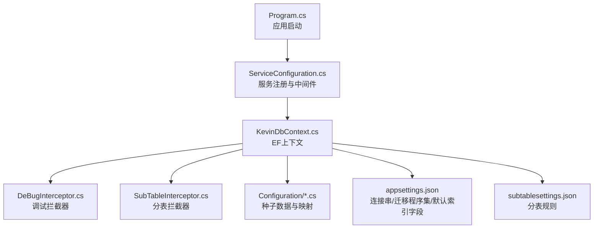
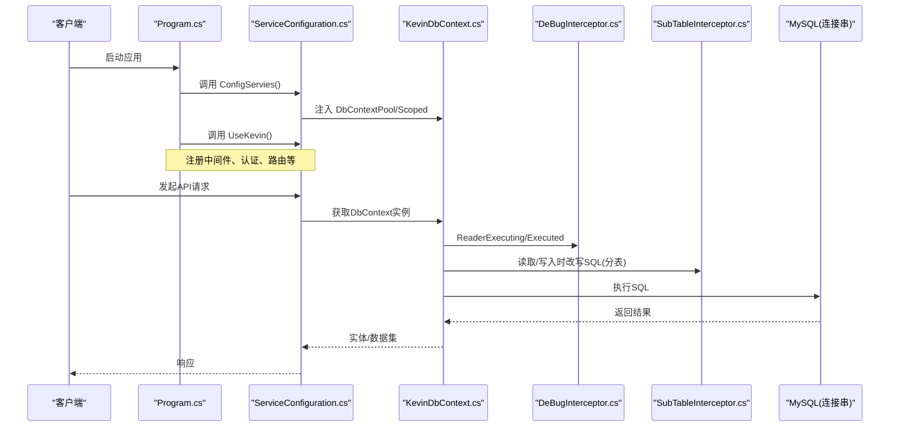
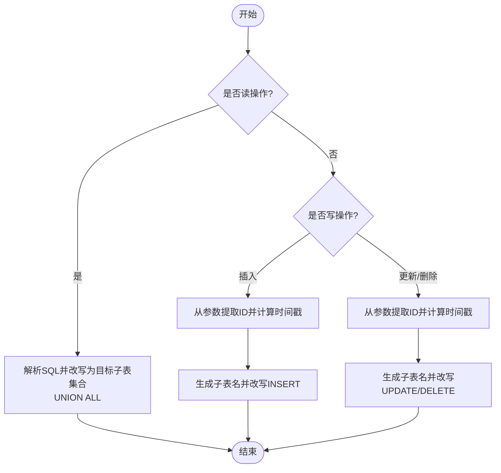
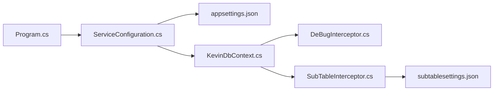

# Entity Framework Core配置

<cite>
**本文引用的文件**
- [KevinDbContext.cs](file://Kevin/Kevin.EntityFrameworkCore/Database/KevinDbContext.cs)
- [DeBugInterceptor.cs](file://Kevin/Kevin.EntityFrameworkCore/Interceptors/DeBugInterceptor.cs)
- [SubTableInterceptor.cs](file://Kevin/Kevin.EntityFrameworkCore/Interceptors/SubTableInterceptor.cs)
- [ServiceConfiguration.cs](file://Kevin/Kevin.Web.Basics/Extensions/ServiceConfiguration.cs)
- [Program.cs](file://App/WebApi/Program.cs)
- [appsettings.json](file://App/WebApi/appsettings.json)
- [subtablesettings.json](file://Kevin/Kevin.EntityFrameworkCore/subtablesettings.json)
- [TRoleConfiguration.cs](file://Kevin/Kevin.EntityFrameworkCore/Configuration/TRoleConfiguration.cs)
- [TUserConfiguration.cs](file://Kevin/Kevin.EntityFrameworkCore/Configuration/TUserConfiguration.cs)
- [TUserBindRoleConfig.cs](file://Kevin/Kevin.EntityFrameworkCore/Configuration/TUserBindRoleConfig.cs)
- [CD.cs](file://Kevin/Domain/Bases/CD.cs)
- [CUD.cs](file://Kevin/Domain/Bases/CUD.cs)
</cite>

## 目录
1. [简介](#简介)
2. [项目结构](#项目结构)
3. [核心组件](#核心组件)
4. [架构总览](#架构总览)
5. [详细组件分析](#详细组件分析)
6. [依赖关系分析](#依赖关系分析)
7. [性能考虑](#性能考虑)
8. [故障排查指南](#故障排查指南)
9. [结论](#结论)
10. [附录](#附录)

## 简介
本文件围绕项目中 Entity Framework Core 的配置与使用进行系统化说明，涵盖 DbContext 的初始化、连接字符串与数据库提供商选择、中间件与服务注册；实体映射（Fluent API、复杂类型映射、关系配置）；自定义拦截器（调试、审计日志、软删除/分表）；迁移管理与部署策略；以及查询优化、批量操作和连接池等性能调优建议。内容基于仓库中实际代码实现，便于读者快速理解并落地实践。

## 项目结构
本项目采用分层架构：WebApi 作为入口，通过服务扩展类统一注册基础设施与业务模块；EF Core 相关能力集中在 Kevin.EntityFrameworkCore 工程，包含 DbContext、实体映射配置与拦截器；领域模型位于 Domain 层，基础基类提供通用字段（如创建/更新时间、软删除、行版本、租户ID）。

图表来源
- [Program.cs:23-85](file://App/WebApi/Program.cs#L23-L85)
- [ServiceConfiguration.cs:48-373](file://Kevin/Kevin.Web.Basics/Extensions/ServiceConfiguration.cs#L48-L373)
- [KevinDbContext.cs:83-133](file://Kevin/Kevin.EntityFrameworkCore/Database/KevinDbContext.cs#L83-L133)
- [DeBugInterceptor.cs:7-35](file://Kevin/Kevin.EntityFrameworkCore/Interceptors/DeBugInterceptor.cs#L7-L35)
- [SubTableInterceptor.cs:9-240](file://Kevin/Kevin.EntityFrameworkCore/Interceptors/SubTableInterceptor.cs#L9-L240)
- [appsettings.json:9-15,99:9-15](file://App/WebApi/appsettings.json#L9-L15)
- [subtablesettings.json:1-11](file://Kevin/Kevin.EntityFrameworkCore/subtablesettings.json#L1-L11)

章节来源
- [Program.cs:23-85](file://App/WebApi/Program.cs#L23-L85)
- [ServiceConfiguration.cs:48-373](file://Kevin/Kevin.Web.Basics/Extensions/ServiceConfiguration.cs#L48-L373)
- [KevinDbContext.cs:83-133](file://Kevin/Kevin.EntityFrameworkCore/Database/KevinDbContext.cs#L83-L133)
- [appsettings.json:9-15,99:9-15](file://App/WebApi/appsettings.json#L9-L15)
- [subtablesettings.json:1-11](file://Kevin/Kevin.EntityFrameworkCore/subtablesettings.json#L1-L11)

## 核心组件
- DbContext：负责数据库连接、模型构建、拦截器注册、保存前处理（领域事件、乐观并发、多租户）、审计日志写入。
- 拦截器：调试拦截器记录慢查询；分表拦截器根据 ID 时间戳将读写路由到按时间分片的子表。
- 服务注册：在 Web 启动阶段注入 DbContext、设置连接串、启用迁移程序集、默认索引字段等。
- 实体映射：自动发现带 TableAttribute 的类型，统一命名规范、列名、注释、类型映射、默认值与索引；并通过 Fluent API 配置种子数据。
- 基础模型：CD/CUD 提供 Id、CreateTime、UpdateTime、IsDelete、DeleteTime、RowVersion、xmin、TenantId 等通用字段。

章节来源
- [KevinDbContext.cs:24-133](file://Kevin/Kevin.EntityFrameworkCore/Database/KevinDbContext.cs#L24-L133)
- [KevinDbContext.cs:165-305](file://Kevin/Kevin.EntityFrameworkCore/Database/KevinDbContext.cs#L165-L305)
- [KevinDbContext.cs:405-583](file://Kevin/Kevin.EntityFrameworkCore/Database/KevinDbContext.cs#L405-L583)
- [DeBugInterceptor.cs:7-35](file://Kevin/Kevin.EntityFrameworkCore/Interceptors/DeBugInterceptor.cs#L7-L35)
- [SubTableInterceptor.cs:9-240](file://Kevin/Kevin.EntityFrameworkCore/Interceptors/SubTableInterceptor.cs#L9-L240)
- [CD.cs:9-73](file://Kevin/Domain/Bases/CD.cs#L9-L73)
- [CUD.cs:7-17](file://Kevin/Domain/Bases/CUD.cs#L7-L17)

## 架构总览
下图展示了从请求进入、服务注册、DbContext 初始化、拦截器执行到数据库访问的整体流程。

图表来源
- [Program.cs:23-85](file://App/WebApi/Program.cs#L23-L85)
- [ServiceConfiguration.cs:48-373](file://Kevin/Kevin.Web.Basics/Extensions/ServiceConfiguration.cs#L48-L373)
- [KevinDbContext.cs:83-133](file://Kevin/Kevin.EntityFrameworkCore/Database/KevinDbContext.cs#L83-L133)
- [DeBugInterceptor.cs:10-35](file://Kevin/Kevin.EntityFrameworkCore/Interceptors/DeBugInterceptor.cs#L10-L35)
- [SubTableInterceptor.cs:12-240](file://Kevin/Kevin.EntityFrameworkCore/Interceptors/SubTableInterceptor.cs#L12-L240)

## 详细组件分析

### DbContext 配置与使用
- 连接字符串与提供商
  - 连接串来源于配置项 dbConnection，支持 MySQL（当前启用），同时保留 SQL Server、SQLite、PostgreSQL 的切换注释示例。
  - 迁移历史表名与迁移程序集由配置 MigrationsAssembly 指定。
- 选项构建
  - 使用 MySQL 提供程序并设置迁移历史表与迁移程序集。
  - 注册调试拦截器 DeBugInterceptor。
  - 可选开启全局懒加载代理与 SQL 日志输出。
- 模型构建
  - 自动扫描程序集中带有 TableAttribute 的类型并加入模型。
  - 统一关闭级联删除为 Restrict。
  - 统一表名为小写并加 t_ 前缀；列名小写；布尔映射 bit；Guid 映射 char(36)。
  - 为配置的默认索引字段添加索引。
  - 通过 DescriptionAttribute 为表和列添加注释。
  - 应用种子数据配置（角色、用户、租户、字典、岗位、部门、权限等）。
- 保存前处理
  - 发布领域事件（基于 MediatR）。
  - 修改实体时更新 RowVersion 用于乐观并发。
  - 新增实体时自动填充 TenantId（多租户）。
  - SaveChangesWithSaveLog 方法对修改实体生成差异日志并写入 TOSLog。

章节来源
- [KevinDbContext.cs:55-133](file://Kevin/Kevin.EntityFrameworkCore/Database/KevinDbContext.cs#L55-L133)
- [KevinDbContext.cs:165-305](file://Kevin/Kevin.EntityFrameworkCore/Database/KevinDbContext.cs#L165-L305)
- [KevinDbContext.cs:405-583](file://Kevin/Kevin.EntityFrameworkCore/Database/KevinDbContext.cs#L405-L583)
- [appsettings.json:9-15,99:9-15](file://App/WebApi/appsettings.json#L9-L15)

### 实体映射与 Fluent API
- 自动映射
  - 通过反射收集所有带 TableAttribute 的类型并注册到模型。
  - 统一命名约定：表名 t_ + 小写类名；列名小写；布尔 bit；Guid char(36)。
  - 默认索引：根据配置 DBDefaultHasIndexFields 为常用字段建索引。
  - 注释：利用 DescriptionAttribute 为表和列添加注释。
- 关系与约束
  - 全局关闭外键级联删除（Restrict），避免误删。
- 种子数据
  - 通过 IEntityTypeConfiguration 配置初始数据（角色、用户、租户、字典、岗位、部门、权限等）。

章节来源
- [KevinDbContext.cs:165-305](file://Kevin/Kevin.EntityFrameworkCore/Database/KevinDbContext.cs#L165-L305)
- [TRoleConfiguration.cs:8-16](file://Kevin/Kevin.EntityFrameworkCore/Configuration/TRoleConfiguration.cs#L8-L16)
- [TUserConfiguration.cs:8-17](file://Kevin/Kevin.EntityFrameworkCore/Configuration/TUserConfiguration.cs#L8-L17)
- [TUserBindRoleConfig.cs:8-17](file://Kevin/Kevin.EntityFrameworkCore/Configuration/TUserBindRoleConfig.cs#L8-L17)

### 自定义拦截器
- 调试拦截器（DeBugInterceptor）
  - 在命令执行前后捕获 SQL 文本与执行耗时，超过阈值可记录日志（当前预留扩展点）。
- 分表拦截器（SubTableInterceptor）
  - 依据 subtablesettings.json 中的 table 与 subtype 规则，在读取时将主表查询改写为 UNION ALL 多个子表；插入时根据 ID 的时间戳片段决定写入子表；更新/删除时按 ID 解析时间戳并改写目标子表。
  - 通过 ID 的二进制时间戳段计算目标时间，从而定位子表后缀。
- 审计日志拦截（SaveChangesWithSaveLog）
  - 在保存前对比旧值与新值，生成变更描述并写入 TOSLog，记录操作人、IP、设备、租户等信息。

图表来源
- [SubTableInterceptor.cs:12-240](file://Kevin/Kevin.EntityFrameworkCore/Interceptors/SubTableInterceptor.cs#L12-L240)
- [subtablesettings.json:1-11](file://Kevin/Kevin.EntityFrameworkCore/subtablesettings.json#L1-L11)

章节来源
- [DeBugInterceptor.cs:7-35](file://Kevin/Kevin.EntityFrameworkCore/Interceptors/DeBugInterceptor.cs#L7-L35)
- [SubTableInterceptor.cs:9-278](file://Kevin/Kevin.EntityFrameworkCore/Interceptors/SubTableInterceptor.cs#L9-L278)
- [KevinDbContext.cs:525-583](file://Kevin/Kevin.EntityFrameworkCore/Database/KevinDbContext.cs#L525-L583)

### 服务注册与中间件
- 服务注册
  - 在 ServiceConfiguration.ConfigServies 中统一注册 JSON 序列化、Kestrel 限制、HSTS、鉴权、权限、缓存、分布式锁、SignalR、RabbitMQ、邮件、AI/RAG、Hangfire、代码生成器等。
  - 为 EF Core 注入 DbContext：先设置静态连接串与默认索引字段，再注册 DbContextPool 与 Scoped 实例。
- 中间件管线
  - Program.Main 中调用 ConfigServies 与 UseKevin，后者注册压缩、HTTPS、跨域、静态文件、Swagger、认证授权、路由、SignalR、Hangfire 等中间件。

章节来源
- [ServiceConfiguration.cs:48-373](file://Kevin/Kevin.Web.Basics/Extensions/ServiceConfiguration.cs#L48-L373)
- [Program.cs:23-85](file://App/WebApi/Program.cs#L23-L85)

### 迁移管理指南
- 迁移程序集
  - 通过 appsettings.json 的 MigrationsAssembly 指定迁移所在程序集（当前为 Kevin.EntityFrameworkCore）。
- 迁移历史表
  - 在 DbContext 中使用 UseMySql 时显式设置迁移历史表名（__efmigrationshistory）。
- 创建与部署
  - 开发环境：使用包管理器控制台或 dotnet CLI 在迁移程序集目录下创建迁移并应用到本地数据库。
  - 测试/生产环境：建议使用 CI/CD 流水线在执行前运行迁移脚本或应用迁移，确保数据库版本与应用一致。
  - 回滚策略：保留历史迁移脚本，必要时按顺序回滚并重新应用。

章节来源
- [appsettings.json:9-15](file://App/WebApi/appsettings.json#L9-L15)
- [KevinDbContext.cs:108-112](file://Kevin/Kevin.EntityFrameworkCore/Database/KevinDbContext.cs#L108-L112)

### 性能调优建议
- 查询优化
  - 利用默认索引字段配置（DBDefaultHasIndexFields）为高频过滤字段建立索引。
  - 谨慎使用 Include 与延迟加载，避免 N+1 查询；必要时使用投影减少数据传输。
- 批量操作
  - 对于大量写入场景，优先使用批量插入库或分批次提交，降低事务开销。
  - 结合分表拦截器，将热点数据分散到不同子表，提升吞吐。
- 连接池与超时
  - 在连接串中合理设置最大连接数与命令超时（当前已配置 Command Timeout=120）。
  - 使用 DbContextPool 提高 DbContext 复用率，减少分配开销。
- 日志与监控
  - 在生产环境关闭详细 SQL 日志，仅在需要时开启；使用调试拦截器记录慢查询。
  - 结合 Hangfire 与日志系统，对长耗时任务进行异步化与追踪。

章节来源
- [appsettings.json:12-15,99:12-15](file://App/WebApi/appsettings.json#L12-L15)
- [KevinDbContext.cs:108-133](file://Kevin/Kevin.EntityFrameworkCore/Database/KevinDbContext.cs#L108-L133)
- [ServiceConfiguration.cs:369-373](file://Kevin/Kevin.Web.Basics/Extensions/ServiceConfiguration.cs#L369-L373)
- [DeBugInterceptor.cs:23-35](file://Kevin/Kevin.EntityFrameworkCore/Interceptors/DeBugInterceptor.cs#L23-L35)

## 依赖关系分析
- 组件耦合
  - Program 依赖 ServiceConfiguration 完成服务与中间件注册。
  - ServiceConfiguration 依赖配置中心（appsettings.json）注入连接串、迁移程序集、默认索引字段等。
  - KevinDbContext 依赖拦截器、配置项与领域事件总线（MediatR）。
  - 分表逻辑依赖外部配置文件 subtablesettings.json。
- 外部依赖
  - MySQL 提供程序、MediatR、SnowflakeId、日志框架等。

图表来源
- [Program.cs:23-85](file://App/WebApi/Program.cs#L23-L85)
- [ServiceConfiguration.cs:48-373](file://Kevin/Kevin.Web.Basics/Extensions/ServiceConfiguration.cs#L48-L373)
- [KevinDbContext.cs:83-133](file://Kevin/Kevin.EntityFrameworkCore/Database/KevinDbContext.cs#L83-L133)
- [SubTableInterceptor.cs:12-240](file://Kevin/Kevin.EntityFrameworkCore/Interceptors/SubTableInterceptor.cs#L12-L240)
- [subtablesettings.json:1-11](file://Kevin/Kevin.EntityFrameworkCore/subtablesettings.json#L1-L11)

章节来源
- [Program.cs:23-85](file://App/WebApi/Program.cs#L23-L85)
- [ServiceConfiguration.cs:48-373](file://Kevin/Kevin.Web.Basics/Extensions/ServiceConfiguration.cs#L48-L373)
- [KevinDbContext.cs:83-133](file://Kevin/Kevin.EntityFrameworkCore/Database/KevinDbContext.cs#L83-L133)
- [SubTableInterceptor.cs:12-240](file://Kevin/Kevin.EntityFrameworkCore/Interceptors/SubTableInterceptor.cs#L12-L240)
- [subtablesettings.json:1-11](file://Kevin/Kevin.EntityFrameworkCore/subtablesettings.json#L1-L11)

## 性能考虑
- 使用 DbContextPool 减少对象分配。
- 为高频查询字段建立索引（DBDefaultHasIndexFields）。
- 控制 Include 与延迟加载范围，避免过度抓取。
- 使用分表拦截器缓解单表压力。
- 合理设置连接串参数（最大连接数、超时）。
- 生产环境关闭冗余日志，按需开启慢查询记录。

[本节为通用指导，不直接分析具体文件]

## 故障排查指南
- 连接失败
  - 检查 appsettings.json 中 dbConnection 是否正确，网络连通性与凭据无误。
- 迁移失败
  - 确认 MigrationsAssembly 指向正确程序集；检查 __efmigrationshistory 表是否存在及权限。
- 分表异常
  - 核对 subtablesettings.json 中 table 与 subtype 配置；确认 ID 时间戳格式与预期一致。
- 慢查询
  - 使用 DeBugInterceptor 捕获执行时间与 SQL；结合索引与查询重写优化。
- 并发冲突
  - 关注 RowVersion/xmin 字段；确保修改路径更新行版本。

章节来源
- [appsettings.json:12-15](file://App/WebApi/appsettings.json#L12-L15)
- [KevinDbContext.cs:108-112](file://Kevin/Kevin.EntityFrameworkCore/Database/KevinDbContext.cs#L108-L112)
- [SubTableInterceptor.cs:12-240](file://Kevin/Kevin.EntityFrameworkCore/Interceptors/SubTableInterceptor.cs#L12-L240)
- [DeBugInterceptor.cs:23-35](file://Kevin/Kevin.EntityFrameworkCore/Interceptors/DeBugInterceptor.cs#L23-L35)
- [CD.cs:41-58](file://Kevin/Domain/Bases/CD.cs#L41-L58)

## 结论
本项目以 KevinDbContext 为核心，结合 Fluent API 与拦截器实现了统一的实体映射、多租户、乐观并发、审计日志与分表能力；通过 ServiceConfiguration 集中注册服务与中间件，配合 appsettings.json 实现灵活配置。建议在大规模数据场景下充分利用分表与索引策略，并结合连接池与批处理优化性能；在迁移与部署环节保持严格的版本控制与回滚预案。

[本节为总结性内容，不直接分析具体文件]

## 附录
- 关键配置项说明
  - MigrationsAssembly：EF 迁移程序集
  - ConnectionStrings.dbConnection：数据库连接串
  - DBDefaultHasIndexFields：默认索引字段列表
  - subtablesettings.json：分表规则（表名与时间戳格式）

章节来源
- [appsettings.json:9-15,99:9-15](file://App/WebApi/appsettings.json#L9-L15)
- [subtablesettings.json:1-11](file://Kevin/Kevin.EntityFrameworkCore/subtablesettings.json#L1-L11)