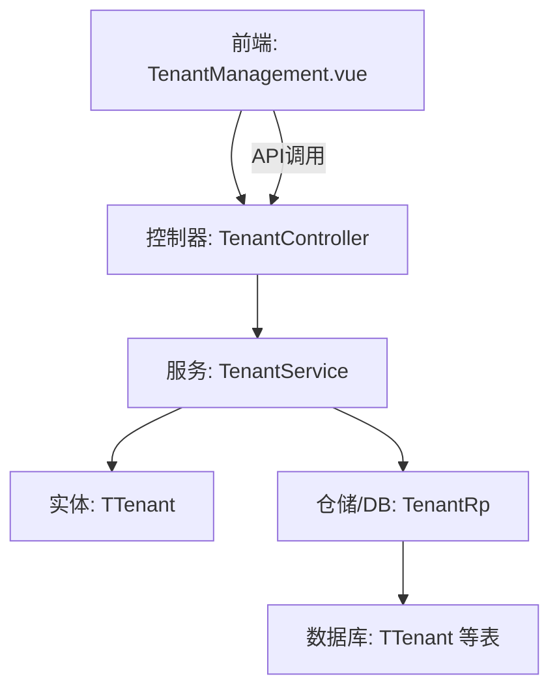
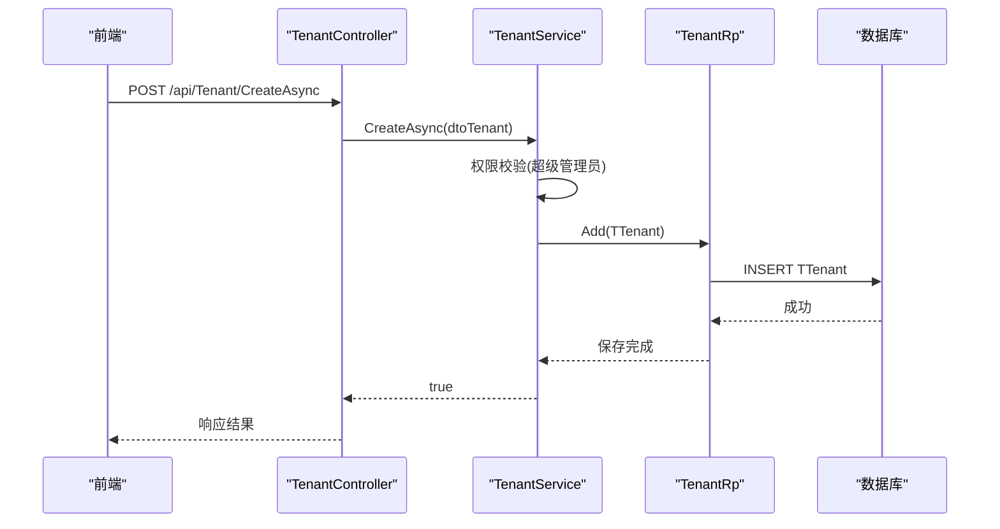
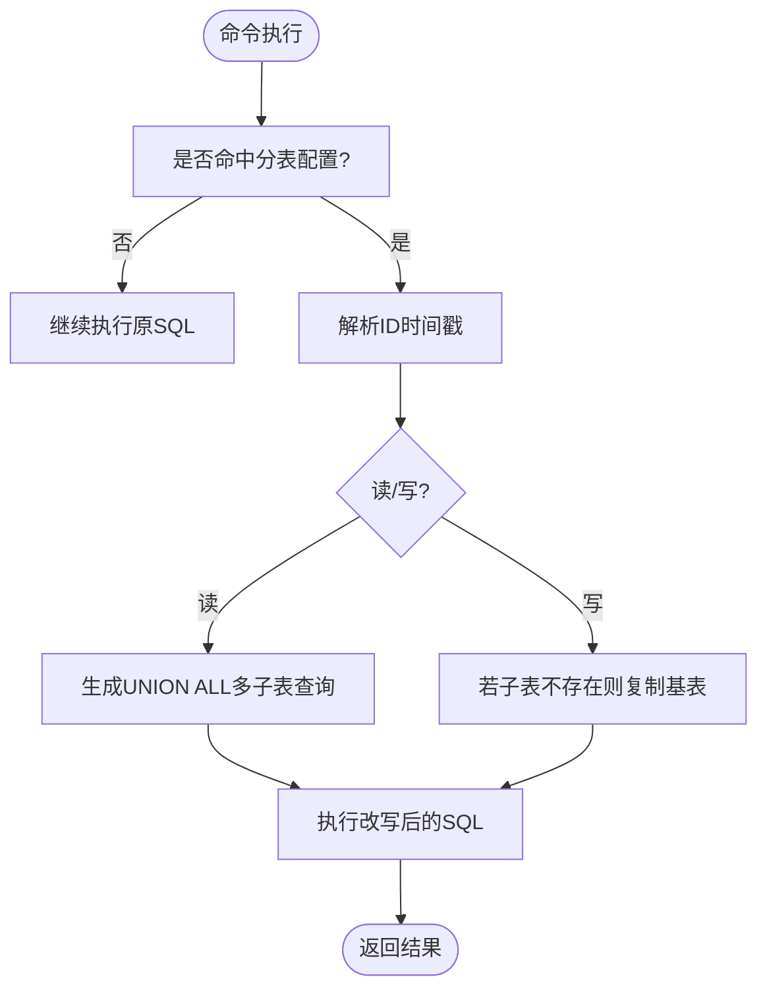
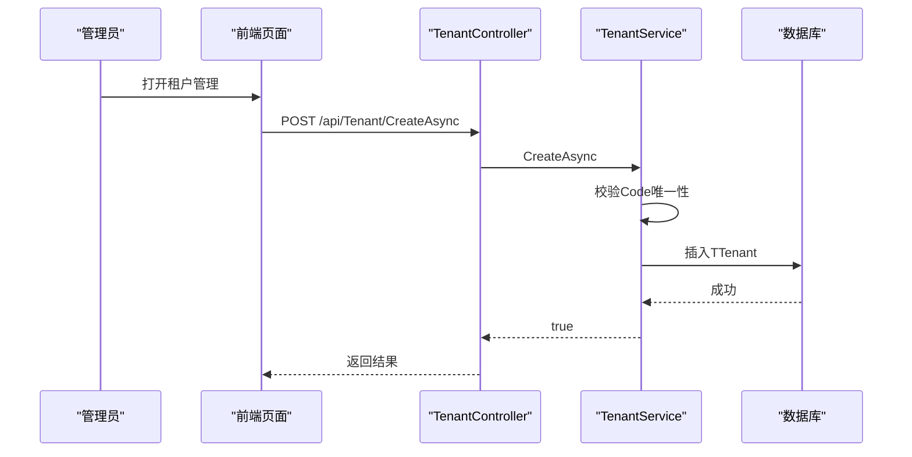
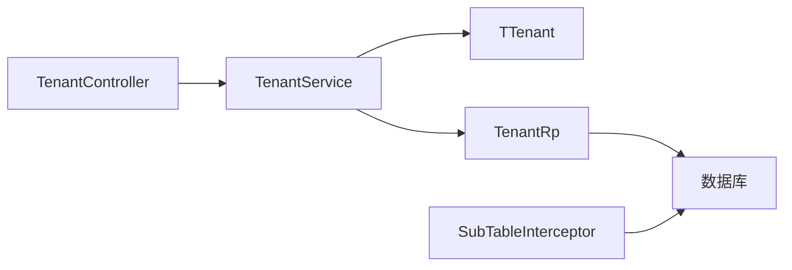

# 多租户数据隔离

<cite>
**本文引用的文件**
- [TenantController.cs](file://Kevin/Kevin.Web.Basics/Controllers/TenantController.cs)
- [TenantService.cs](file://Kevin/Application/Services/TenantService.cs)
- [TTenant.cs](file://Kevin/Domain/Entities/TTenant.cs)
- [TTenantBaseData.cs](file://Kevin/Domain/BaseDatas/TTenantBaseData.cs)
- [AuthorizeService.cs](file://Kevin/Application/Services/AuthorizeService.cs)
- [UserService.cs](file://Kevin/Application/Services/UserService.cs)
- [IUserService.cs](file://Kevin/Domain/Interfaces/IServices/IUserService.cs)
- [SubTableInterceptor.cs](file://Kevin/kevin.Module/Kevin.Common/App/SubTableInterceptor.cs)
- [TenantHelper.cs](file://Kevin/kevin.Module/Kevin.Common/App/TenantHelper.cs)
- [tenant.js](file://vue/kevin.web.vue/src/api/tenant.js)
- [TenantManagement.vue](file://vue/kevin.web.vue/src/pages/TenantManagement.vue)
</cite>

## 目录
1. [简介](#简介)
2. [项目结构](#项目结构)
3. [核心组件](#核心组件)
4. [架构总览](#架构总览)
5. [详细组件分析](#详细组件分析)
6. [依赖关系分析](#依赖关系分析)
7. [性能考虑](#性能考虑)
8. [故障排查指南](#故障排查指南)
9. [结论](#结论)
10. [附录](#附录)

## 简介
本文件系统性阐述该框架的多租户数据隔离机制，涵盖以下方面：
- 多租户架构模式与策略选择（共享数据库、逻辑隔离）
- 租户标识的传递与上下文传播（请求链路中的租户信息）
- 数据访问层的租户过滤实现（EF Core 拦截器与查询条件注入）
- 租户配置管理（注册、激活状态、资源配额控制）
- 多租户场景下的性能优化与安全注意事项

## 项目结构
本项目采用分层架构，围绕“Web API -> 应用服务 -> 领域实体/仓储 -> EF Core”组织代码。多租户能力贯穿各层：
- Web 层：提供租户管理接口与前端页面
- 应用层：封装租户生命周期与业务规则
- 领域层：定义租户实体及基础数据
- 基础设施层：通过 EF Core 拦截器实现数据分表与自动路由

图表来源
- [TenantManagement.vue:1-406](file://vue/kevin.web.vue/src/pages/TenantManagement.vue#L1-L406)
- [TenantController.cs:1-96](file://Kevin/Kevin.Web.Basics/Controllers/TenantController.cs#L1-L96)
- [TenantService.cs:1-282](file://Kevin/Application/Services/TenantService.cs#L1-L282)
- [TTenant.cs:1-56](file://Kevin/Domain/Entities/TTenant.cs#L1-L56)

章节来源
- [TenantController.cs:1-96](file://Kevin/Kevin.Web.Basics/Controllers/TenantController.cs#L1-L96)
- [TenantService.cs:1-282](file://Kevin/Application/Services/TenantService.cs#L1-L282)
- [TTenant.cs:1-56](file://Kevin/Domain/Entities/TTenant.cs#L1-L56)

## 核心组件
- 租户管理控制器：暴露租户分页、创建、编辑、删除、激活/停用等接口
- 租户服务：实现租户CRUD、权限校验、种子数据初始化、状态切换
- 租户实体：承载租户编码、名称、状态，并提供可用性校验
- 基础数据：内置默认租户（种子数据），便于系统启动即有可用租户
- 认证授权：在登录/鉴权流程中校验租户存在性与有效性
- 用户服务：登录时按租户范围检索用户，确保跨租户隔离
- 数据访问拦截器：基于 ID 时间戳进行子表路由与读写分离（分表策略）
- 租户工具：从配置读取默认租户ID，用于种子数据初始化

章节来源
- [TenantController.cs:1-96](file://Kevin/Kevin.Web.Basics/Controllers/TenantController.cs#L1-L96)
- [TenantService.cs:1-282](file://Kevin/Application/Services/TenantService.cs#L1-L282)
- [TTenant.cs:1-56](file://Kevin/Domain/Entities/TTenant.cs#L1-L56)
- [TTenantBaseData.cs:1-13](file://Kevin/Domain/BaseDatas/TTenantBaseData.cs#L1-L13)
- [AuthorizeService.cs:65-93](file://Kevin/Application/Services/AuthorizeService.cs#L65-L93)
- [UserService.cs:123-153](file://Kevin/Application/Services/UserService.cs#L123-L153)
- [SubTableInterceptor.cs:1-278](file://Kevin/kevin.Module/Kevin.Common/App/SubTableInterceptor.cs#L1-L278)
- [TenantHelper.cs:1-25](file://Kevin/kevin.Module/Kevin.Common/App/TenantHelper.cs#L1-L25)

## 架构总览
下图展示一次租户管理的典型请求流，包括前端发起、控制器处理、服务层校验与持久化。

图表来源
- [TenantController.cs:58-69](file://Kevin/Kevin.Web.Basics/Controllers/TenantController.cs#L58-L69)
- [TenantService.cs:111-127](file://Kevin/Application/Services/TenantService.cs#L111-L127)

章节来源
- [TenantController.cs:1-96](file://Kevin/Kevin.Web.Basics/Controllers/TenantController.cs#L1-L96)
- [TenantService.cs:1-282](file://Kevin/Application/Services/TenantService.cs#L1-L282)

## 详细组件分析

### 多租户架构模式与策略
- 策略选择：共享数据库 + 逻辑隔离（每行数据带租户标识），并通过拦截器对特定表进行分表路由，降低运维复杂度并提升扩展性
- 分表策略：根据主键 ID 的时间戳位解析出时间片段，动态映射到物理子表（如 table_YYYYMMDDHHmmss），读路径 UNION ALL 聚合，写路径写入对应子表
- 隔离边界：所有业务查询需携带租户过滤条件；登录、鉴权、数据操作均限定在当前租户范围内

章节来源
- [SubTableInterceptor.cs:1-278](file://Kevin/kevin.Module/Kevin.Common/App/SubTableInterceptor.cs#L1-L278)
- [AuthorizeService.cs:65-93](file://Kevin/Application/Services/AuthorizeService.cs#L65-L93)
- [UserService.cs:123-153](file://Kevin/Application/Services/UserService.cs#L123-L153)

### 租户标识传递与上下文传播
- 请求入口：前端通过 API 调用，控制器接收参数并进入服务层
- 上下文获取：服务层通过当前用户上下文（CurrentUser）获取租户ID，并在后续查询中作为过滤条件
- 登录流程：登录时按租户范围查找用户，成功后将租户ID纳入会话/令牌上下文，后续请求自动继承
- 配置级默认租户：当未显式指定时，可通过配置读取默认租户ID，保证系统初始运行环境可用

章节来源
- [UserService.cs:123-153](file://Kevin/Application/Services/UserService.cs#L123-L153)
- [TenantHelper.cs:1-25](file://Kevin/kevin.Module/Kevin.Common/App/TenantHelper.cs#L1-L25)
- [IUserService.cs:28-35](file://Kevin/Domain/Interfaces/IServices/IUserService.cs#L28-L35)

### 数据访问层租户过滤与拦截器
- 租户过滤：所有业务查询必须包含租户条件（例如 Where(t => t.TenantId == currentTenantId)），避免跨租户数据泄露
- 分表拦截器：在命令执行阶段拦截 SQL，识别目标表并根据 ID 计算时间戳，动态替换为具体子表名；读路径生成 UNION ALL 以合并多个子表结果
- 自动路由：插入/更新/删除时，依据记录 ID 解析时间戳，定位目标子表；若子表不存在则先复制基表结构再写入

图表来源
- [SubTableInterceptor.cs:12-239](file://Kevin/kevin.Module/Kevin.Common/App/SubTableInterceptor.cs#L12-L239)

章节来源
- [SubTableInterceptor.cs:1-278](file://Kevin/kevin.Module/Kevin.Common/App/SubTableInterceptor.cs#L1-L278)

### 租户配置管理（注册、激活、配额）
- 租户注册：通过控制器接口创建租户，服务层校验唯一性并持久化
- 激活状态：支持将租户设置为有效或无效；登录/鉴权时会检查租户状态，失效租户无法使用
- 资源配额：当前仓库未直接体现配额限制逻辑；可在服务层扩展配额校验（如并发、存储上限）或在拦截器层面做限流/熔断

图表来源
- [TenantManagement.vue:1-406](file://vue/kevin.web.vue/src/pages/TenantManagement.vue#L1-L406)
- [TenantController.cs:58-69](file://Kevin/Kevin.Web.Basics/Controllers/TenantController.cs#L58-L69)
- [TenantService.cs:111-127](file://Kevin/Application/Services/TenantService.cs#L111-L127)

章节来源
- [TenantController.cs:1-96](file://Kevin/Kevin.Web.Basics/Controllers/TenantController.cs#L1-L96)
- [TenantService.cs:1-282](file://Kevin/Application/Services/TenantService.cs#L1-L282)
- [TTenant.cs:1-56](file://Kevin/Domain/Entities/TTenant.cs#L1-L56)
- [TTenantBaseData.cs:1-13](file://Kevin/Domain/BaseDatas/TTenantBaseData.cs#L1-L13)

### 安全与权限
- 登录校验：在认证流程中校验租户是否存在且未失效，防止非法租户访问
- 权限控制：租户管理操作限制为超级管理员，避免越权修改租户状态
- 数据隔离：所有查询强制租户过滤，结合分表拦截器进一步降低误用风险

章节来源
- [AuthorizeService.cs:65-93](file://Kevin/Application/Services/AuthorizeService.cs#L65-L93)
- [TenantService.cs:28-45](file://Kevin/Application/Services/TenantService.cs#L28-L45)

## 依赖关系分析
- 控制器依赖服务：TenantController 调用 TenantService
- 服务依赖仓储与实体：TenantService 通过仓储访问数据库，操作 TTenant 实体
- 实体依赖枚举与基础数据：TTenant 使用租户状态枚举，并参与种子数据初始化
- 拦截器依赖配置：SubTableInterceptor 读取分表配置并对 SQL 进行改写

图表来源
- [TenantController.cs:1-96](file://Kevin/Kevin.Web.Basics/Controllers/TenantController.cs#L1-L96)
- [TenantService.cs:1-282](file://Kevin/Application/Services/TenantService.cs#L1-L282)
- [TTenant.cs:1-56](file://Kevin/Domain/Entities/TTenant.cs#L1-L56)
- [SubTableInterceptor.cs:1-278](file://Kevin/kevin.Module/Kevin.Common/App/SubTableInterceptor.cs#L1-L278)

章节来源
- [TenantController.cs:1-96](file://Kevin/Kevin.Web.Basics/Controllers/TenantController.cs#L1-L96)
- [TenantService.cs:1-282](file://Kevin/Application/Services/TenantService.cs#L1-L282)
- [TTenant.cs:1-56](file://Kevin/Domain/Entities/TTenant.cs#L1-L56)
- [SubTableInterceptor.cs:1-278](file://Kevin/kevin.Module/Kevin.Common/App/SubTableInterceptor.cs#L1-L278)

## 性能考虑
- 分表路由：通过拦截器将热点数据分散到多个子表，减少单表膨胀，提高查询与写入吞吐
- 查询聚合：读路径使用 UNION ALL 合并多子表结果，注意索引设计以避免全表扫描
- 租户过滤：在应用层强制添加租户条件，缩小查询范围，配合索引提升性能
- 连接与事务：合理设置连接池大小与事务粒度，避免长事务阻塞
- 缓存策略：对只读、低频变更的租户元数据可引入缓存，减轻数据库压力

[本节为通用指导，不直接分析具体文件]

## 故障排查指南
- 租户不存在：登录或鉴权时报错，检查租户表是否有对应记录且未被删除
- 租户已失效：尝试登录或访问被拒绝，检查租户状态是否为有效
- 非超级管理员无权限：租户管理操作失败，确认当前用户是否为超级管理员
- 分表异常：读不到数据或写入失败，检查拦截器配置与 ID 时间戳解析是否正确
- 默认租户缺失：系统启动后无可用租户，检查配置项与种子数据初始化

章节来源
- [AuthorizeService.cs:65-93](file://Kevin/Application/Services/AuthorizeService.cs#L65-L93)
- [TenantService.cs:28-83](file://Kevin/Application/Services/TenantService.cs#L28-L83)
- [SubTableInterceptor.cs:12-239](file://Kevin/kevin.Module/Kevin.Common/App/SubTableInterceptor.cs#L12-L239)

## 结论
本项目采用“共享数据库 + 逻辑隔离 + 分表路由”的多租户方案，通过服务层租户过滤与 EF Core 拦截器实现数据层面的强隔离与高扩展性。租户管理功能完善，具备注册、激活/停用、权限控制等能力。建议在生产环境中进一步完善配额控制、监控告警与审计日志，以增强系统的可观测性与治理水平。

[本节为总结性内容，不直接分析具体文件]

## 附录
- 前端租户管理：提供租户列表、新增、编辑、删除、激活/停用等操作界面
- API 端点：/api/Tenant/* 提供完整的租户管理能力
- 默认租户：系统启动时通过基础数据初始化一个默认租户，便于快速体验

章节来源
- [tenant.js:1-55](file://vue/kevin.web.vue/src/api/tenant.js#L1-L55)
- [TenantManagement.vue:1-406](file://vue/kevin.web.vue/src/pages/TenantManagement.vue#L1-L406)
- [TTenantBaseData.cs:1-13](file://Kevin/Domain/BaseDatas/TTenantBaseData.cs#L1-L13)