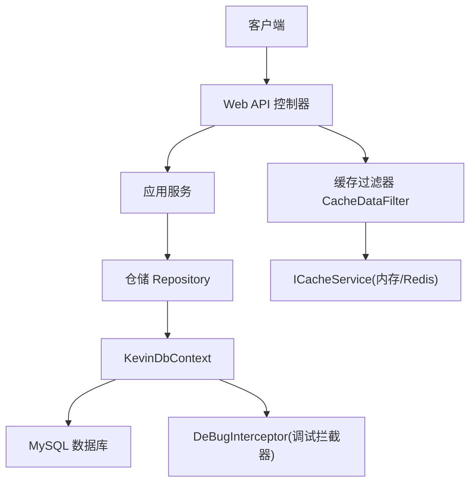
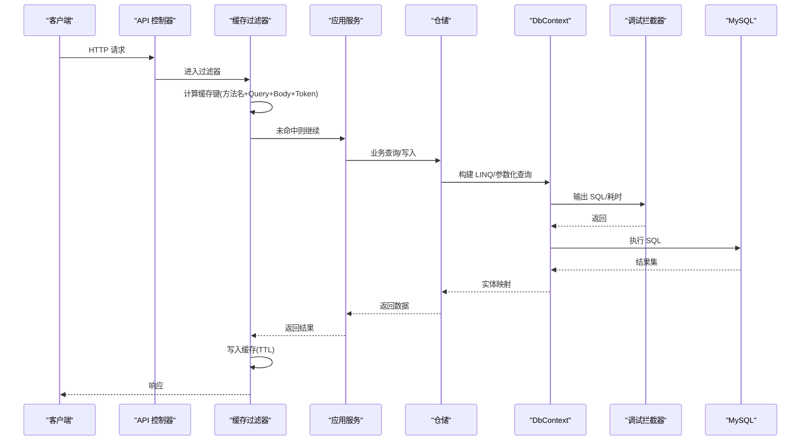
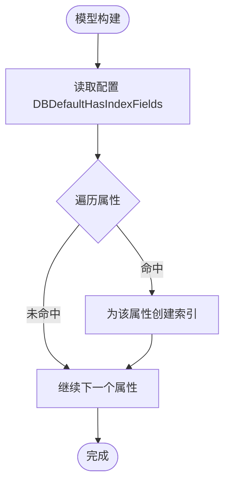
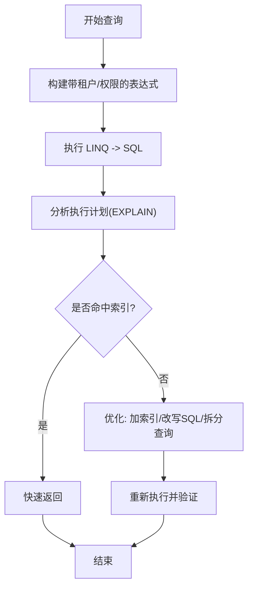
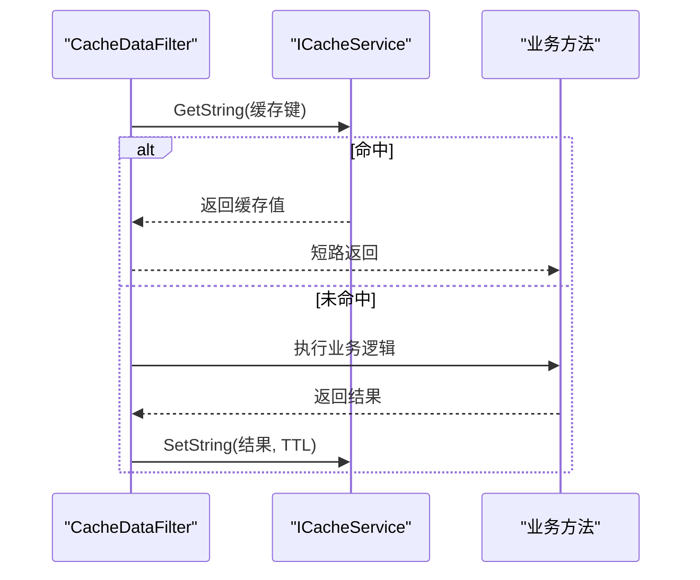
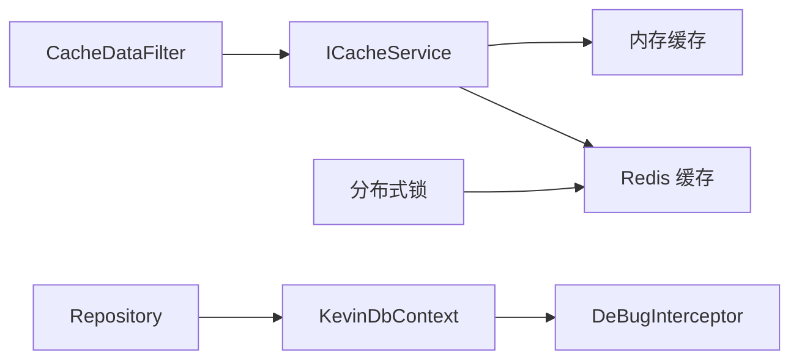

# 性能优化策略

<cite>
**本文引用的文件**
- [KevinDbContext.cs](file://Kevin/Kevin.EntityFrameworkCore/Database/KevinDbContext.cs)
- [Repository.cs](file://Kevin/Kevin.EntityFrameworkCore/_/Data/Repository.cs)
- [ServiceCollectionExtensions.cs（缓存）](file://Kevin/kevin.Module/kevin.Cache/ServiceCollectionExtensions.cs)
- [CacheDataFilter.cs](file://Kevin/Kevin.Web.Basics/Filters/CacheDataFilter.cs)
- [appsettings.json](file://App/WebApi/appsettings.json)
- [ServiceCollectionExtensions.cs（分布式锁）](file://Kevin/kevin.Module/kevin.DistributedLock/ServiceCollectionExtensions.cs)
- [DeBugInterceptor.cs](file://Kevin/Kevin.EntityFrameworkCore/Interceptors/DeBugInterceptor.cs)
- [SYSTEM_DOCUMENTATION.html](file://vue/kevin.web.vue/public/SYSTEM_DOCUMENTATION.html)
</cite>

## 目录
1. [简介](#简介)
2. [项目结构](#项目结构)
3. [核心组件](#核心组件)
4. [架构总览](#架构总览)
5. [详细组件分析](#详细组件分析)
6. [依赖关系分析](#依赖关系分析)
7. [性能考量](#性能考量)
8. [故障排查指南](#故障排查指南)
9. [结论](#结论)
10. [附录](#附录)

## 简介
本指南面向数据库与查询性能优化，结合仓库中的 EF Core 数据访问、缓存机制、连接配置与拦截器能力，系统性地给出索引设计策略、SQL 执行计划分析与慢查询治理、缓存方案（Redis/内存/结果缓存）、连接池配置与管理、批量操作与分页优化、以及大数据量处理建议。内容均以仓库实际实现为依据，并辅以流程图与时序图帮助理解。

## 项目结构
本项目采用分层架构：Web API 层通过控制器调用应用服务，应用服务使用仓储与领域模型，仓储基于 EF Core 的 DbContext 访问 MySQL 数据库；同时提供 Redis/内存缓存、分布式锁、日志与调试拦截器等横切能力。

图表来源
- [CacheDataFilter.cs:17-125](file://Kevin/Kevin.Web.Basics/Filters/CacheDataFilter.cs#L17-L125)
- [Repository.cs:22-175](file://Kevin/Kevin.EntityFrameworkCore/_/Data/Repository.cs#L22-L175)
- [KevinDbContext.cs:83-132](file://Kevin/Kevin.EntityFrameworkCore/Database/KevinDbContext.cs#L83-L132)
- [DeBugInterceptor.cs](file://Kevin/Kevin.EntityFrameworkCore/Interceptors/DeBugInterceptor.cs)

章节来源
- [KevinDbContext.cs:83-132](file://Kevin/Kevin.EntityFrameworkCore/Database/KevinDbContext.cs#L83-L132)
- [Repository.cs:22-175](file://Kevin/Kevin.EntityFrameworkCore/_/Data/Repository.cs#L22-L175)
- [CacheDataFilter.cs:17-125](file://Kevin/Kevin.Web.Basics/Filters/CacheDataFilter.cs#L17-L125)
- [appsettings.json:12-15](file://App/WebApi/appsettings.json#L12-L15)

## 核心组件
- 数据上下文 KevinDbContext：负责 EF Core 模型构建、默认索引字段注入、多租户与乐观并发处理、保存时日志记录、调试拦截器注册等。
- 仓储基类 Repository<T,TId>：封装通用 CRUD、事务、分页/过滤（租户+数据权限）、批量添加/更新/删除。
- 缓存体系：支持内存缓存与 Redis 缓存，并通过 ActionFilter 对接口结果进行缓存。
- 分布式锁：基于 Redis 的分布式锁/信号量/读写锁，用于高并发场景下的资源保护。
- 配置中心：连接字符串、默认索引字段、Redis 连接等均在 appsettings.json 中集中管理。

章节来源
- [KevinDbContext.cs:24-132](file://Kevin/Kevin.EntityFrameworkCore/Database/KevinDbContext.cs#L24-L132)
- [Repository.cs:22-175](file://Kevin/Kevin.EntityFrameworkCore/_/Data/Repository.cs#L22-L175)
- [ServiceCollectionExtensions.cs（缓存）:11-46](file://Kevin/kevin.Module/kevin.Cache/ServiceCollectionExtensions.cs#L11-L46)
- [ServiceCollectionExtensions.cs（分布式锁）:31-48](file://Kevin/kevin.Module/kevin.DistributedLock/ServiceCollectionExtensions.cs#L31-L48)
- [appsettings.json:12-15,98-100:12-15](file://App/WebApi/appsettings.json#L12-L15)

## 架构总览
下图展示了从请求到数据库访问的关键路径，包括缓存命中短路、仓储过滤、EF Core 生成 SQL 及调试拦截。

图表来源
- [CacheDataFilter.cs:31-125](file://Kevin/Kevin.Web.Basics/Filters/CacheDataFilter.cs#L31-L125)
- [Repository.cs:104-163](file://Kevin/Kevin.EntityFrameworkCore/_/Data/Repository.cs#L104-L163)
- [KevinDbContext.cs:117-132](file://Kevin/Kevin.EntityFrameworkCore/Database/KevinDbContext.cs#L117-L132)

## 详细组件分析

### 索引设计与自动索引注入
- 默认索引字段：通过配置项 DBDefaultHasIndexFields 指定一组字段，在 OnModelCreating 中为这些字段自动创建单列索引，便于统一治理高频查询字段。
- 表名前缀与注释：统一前缀 t_ 与字段注释，提升可维护性。
- 外键级联：全局关闭级联删除，避免误删风险。
- 类型映射：bool→bit，Guid→char(36)，适配 MySQL 特性。

图表来源
- [KevinDbContext.cs:206-259](file://Kevin/Kevin.EntityFrameworkCore/Database/KevinDbContext.cs#L206-L259)
- [appsettings.json:98-100](file://App/WebApi/appsettings.json#L98-L100)

章节来源
- [KevinDbContext.cs:206-259](file://Kevin/Kevin.EntityFrameworkCore/Database/KevinDbContext.cs#L206-L259)
- [appsettings.json:98-100](file://App/WebApi/appsettings.json#L98-L100)

### 查询优化与执行计划分析
- 租户与数据权限过滤：仓储基类在 Query/FirstOrDefault/Any 等方法中自动拼接 TenantId 与数据权限条件，确保查询范围最小化，减少扫描行数。
- 调试拦截器：通过 DeBugInterceptor 输出 SQL 与执行信息，便于定位慢查询与缺失索引。
- 执行计划分析建议：
  - 使用 EXPLAIN/EXPLAIN ANALYZE 查看是否走索引、是否存在全表扫描或临时表。
  - 关注 WHERE/JOIN/GROUP BY/ORDER BY 列是否命中索引。
  - 避免 SELECT *，仅选择必要列，降低网络与序列化开销。
  - 将复杂条件下推至数据库侧，减少客户端过滤。

图表来源
- [Repository.cs:63-163](file://Kevin/Kevin.EntityFrameworkCore/_/Data/Repository.cs#L63-L163)
- [KevinDbContext.cs:117-132](file://Kevin/Kevin.EntityFrameworkCore/Database/KevinDbContext.cs#L117-L132)

章节来源
- [Repository.cs:63-163](file://Kevin/Kevin.EntityFrameworkCore/_/Data/Repository.cs#L63-L163)
- [KevinDbContext.cs:117-132](file://Kevin/Kevin.EntityFrameworkCore/Database/KevinDbContext.cs#L117-L132)

### 缓存机制（Redis/内存/结果缓存）
- 缓存后端：支持内存缓存与 Redis 缓存，通过扩展方法注册。
- 接口级缓存：CacheDataFilter 根据“方法名 + QueryString + Body + Token”生成唯一键，命中直接返回，未命中则在响应后写入缓存，支持 TTL。
- 适用场景：读多写少、幂等接口、热点数据。

图表来源
- [CacheDataFilter.cs:31-125](file://Kevin/Kevin.Web.Basics/Filters/CacheDataFilter.cs#L31-L125)
- [ServiceCollectionExtensions.cs（缓存）:11-46](file://Kevin/kevin.Module/kevin.Cache/ServiceCollectionExtensions.cs#L11-L46)

章节来源
- [CacheDataFilter.cs:31-125](file://Kevin/Kevin.Web.Basics/Filters/CacheDataFilter.cs#L31-L125)
- [ServiceCollectionExtensions.cs（缓存）:11-46](file://Kevin/kevin.Module/kevin.Cache/ServiceCollectionExtensions.cs#L11-L46)

### 连接池配置与连接管理
- 连接字符串：位于 appsettings.json 的 ConnectionStrings.dbConnection，包含服务器地址、端口、数据库、用户、密码、字符集、命令超时等。
- 连接池大小：不同数据库驱动的连接池参数由连接字符串控制（如 MySQL 的 maxpoolsize），可根据并发与资源调整。
- 最佳实践：
  - 合理设置最大连接数，避免连接耗尽或过多导致上下文切换开销。
  - 使用异步 I/O 与合适的 Command Timeout，避免长事务阻塞连接。
  - 生产环境启用连接健康检查与重试策略（若驱动支持）。

章节来源
- [appsettings.json:12-15](file://App/WebApi/appsettings.json#L12-L15)
- [KevinDbContext.cs:92-115](file://Kevin/Kevin.EntityFrameworkCore/Database/KevinDbContext.cs#L92-L115)

### 批量操作优化
- 批量添加/更新/删除：仓储提供 AddRange/UpdateRange/RemoveRange，减少往返次数。
- 事务边界：BeginTransaction 配合批量操作，保证一致性。
- 建议：
  - 分批提交，避免单次事务过大导致锁竞争与回滚代价。
  - 大对象/大字段尽量分片写入，降低内存峰值。

章节来源
- [Repository.cs:122-149](file://Kevin/Kevin.EntityFrameworkCore/_/Data/Repository.cs#L122-L149)

### 分页查询优化
- 前端分页：页面组件传递 pageNum/pageSize，后端按页返回，避免一次性加载全部数据。
- 后端优化：
  - 使用 Skip/Take 或等效分页方式，确保 ORDER BY 列有索引。
  - 避免在分页查询中进行大量 JOIN 与函数计算。
  - 对搜索词建立合适索引或使用全文检索。

章节来源
- [SYSTEM_DOCUMENTATION.html:1194-1196](file://vue/kevin.web.vue/public/SYSTEM_DOCUMENTATION.html#L1194-L1196)

### 大数据量处理方案
- 读写分离：文档提及可配置读写分离，将读流量分流至只读副本，减轻主库压力。
- 归档与分区：历史数据归档至冷存储，热数据保留在线库；必要时对大表进行分区。
- 异步任务：借助 Hangfire 等任务队列，将耗时任务异步化，避免阻塞请求链路。

章节来源
- [SYSTEM_DOCUMENTATION.html:1201-1204](file://vue/kevin.web.vue/public/SYSTEM_DOCUMENTATION.html#L1201-L1204)

## 依赖关系分析
- 缓存与过滤器：CacheDataFilter 依赖 ICacheService，后者由 kevin.Cache 模块以内存或 Redis 模式提供。
- 仓储与上下文：Repository 依赖 KevinDbContext，DbContext 注册调试拦截器并配置迁移程序集。
- 分布式锁：基于 Redis 的 Medallion.Threading 提供分布式锁/信号量/读写锁，适用于并发控制。

图表来源
- [CacheDataFilter.cs:31-125](file://Kevin/Kevin.Web.Basics/Filters/CacheDataFilter.cs#L31-L125)
- [ServiceCollectionExtensions.cs（缓存）:11-46](file://Kevin/kevin.Module/kevin.Cache/ServiceCollectionExtensions.cs#L11-L46)
- [Repository.cs:22-175](file://Kevin/Kevin.EntityFrameworkCore/_/Data/Repository.cs#L22-L175)
- [KevinDbContext.cs:117-132](file://Kevin/Kevin.EntityFrameworkCore/Database/KevinDbContext.cs#L117-L132)
- [ServiceCollectionExtensions.cs（分布式锁）:31-48](file://Kevin/kevin.Module/kevin.DistributedLock/ServiceCollectionExtensions.cs#L31-L48)

章节来源
- [ServiceCollectionExtensions.cs（缓存）:11-46](file://Kevin/kevin.Module/kevin.Cache/ServiceCollectionExtensions.cs#L11-L46)
- [ServiceCollectionExtensions.cs（分布式锁）:31-48](file://Kevin/kevin.Module/kevin.DistributedLock/ServiceCollectionExtensions.cs#L31-L48)
- [Repository.cs:22-175](file://Kevin/Kevin.EntityFrameworkCore/_/Data/Repository.cs#L22-L175)
- [KevinDbContext.cs:117-132](file://Kevin/Kevin.EntityFrameworkCore/Database/KevinDbContext.cs#L117-L132)

## 性能考量
- 索引策略
  - 聚簇索引：通常为主键（自增/雪花ID），保证插入顺序与范围扫描效率。
  - 非聚簇索引：为常用过滤/排序/关联列建立，注意选择性高的列优先。
  - 复合索引：遵循最左前缀原则，覆盖常见查询组合，避免冗余索引。
- SQL 优化
  - 使用参数化查询，避免 SQL 注入与重复编译。
  - 减少子查询与函数包裹列，利于索引使用。
  - 合理使用 JOIN 与投影，避免 N+1 查询。
- 缓存策略
  - 热点数据使用 Redis 缓存，短生命周期用内存缓存。
  - 接口级缓存适合幂等 GET 请求，写操作需失效相关缓存。
- 连接池
  - 根据并发与数据库资源调优最大连接数，监控连接池使用率。
  - 避免长事务与同步阻塞调用，释放连接更快。
- 批处理与分页
  - 大批量写入采用 AddRange/RemoveRange 并分批提交。
  - 分页查询确保 ORDER BY 列有索引，避免深分页。

[本节为通用指导，不直接分析具体文件]

## 故障排查指南
- 数据库连接失败
  - 检查 MySQL 服务状态与连接字符串配置。
  - 确认防火墙/安全组放行端口。
- Redis 连接失败
  - 检查 Redis 服务与密码配置。
  - 确认分布式锁/缓存模块已正确注册。
- 慢查询定位
  - 开启调试拦截器，捕获 SQL 与耗时。
  - 使用 EXPLAIN 分析执行计划，补充缺失索引。
- 缓存异常
  - 检查缓存键生成逻辑与 TTL 设置。
  - 观察缓存命中率与内存占用。

章节来源
- [SYSTEM_DOCUMENTATION.html:1057-1080](file://vue/kevin.web.vue/public/SYSTEM_DOCUMENTATION.html#L1057-L1080)
- [KevinDbContext.cs:117-132](file://Kevin/Kevin.EntityFrameworkCore/Database/KevinDbContext.cs#L117-L132)
- [CacheDataFilter.cs:31-125](file://Kevin/Kevin.Web.Basics/Filters/CacheDataFilter.cs#L31-L125)

## 结论
本项目在数据访问层提供了完善的索引注入、租户与权限过滤、调试拦截与批量操作能力；在缓存层支持内存与 Redis 两种后端，并通过过滤器实现接口级结果缓存；在连接管理方面通过连接字符串集中配置，便于调优。结合执行计划分析与合理的索引/分页/批处理策略，可有效提升数据库性能与系统吞吐。

[本节为总结，不直接分析具体文件]

## 附录
- 关键配置项
  - 数据库连接：ConnectionStrings.dbConnection
  - Redis 连接：ConnectionStrings.redisConnection
  - 默认索引字段：DBDefaultHasIndexFields
- 参考文档
  - 性能优化章节与常见问题排查见 SYSTEM_DOCUMENTATION.html

章节来源
- [appsettings.json:12-15,98-100:12-15](file://App/WebApi/appsettings.json#L12-L15)
- [SYSTEM_DOCUMENTATION.html:1057-1080](file://vue/kevin.web.vue/public/SYSTEM_DOCUMENTATION.html#L1057-L1080)