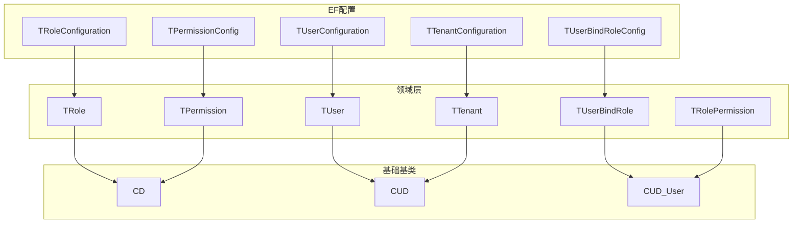
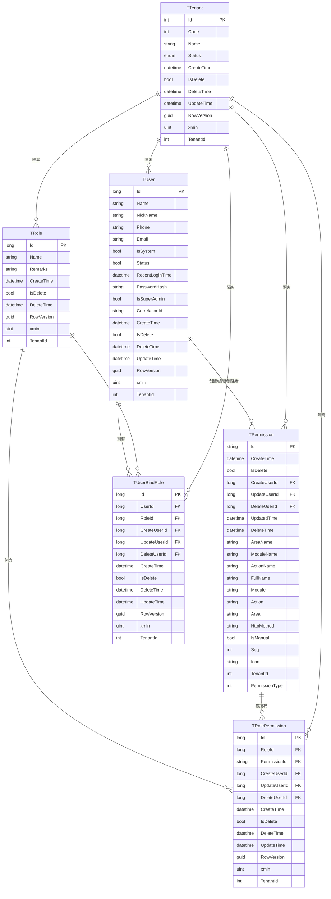
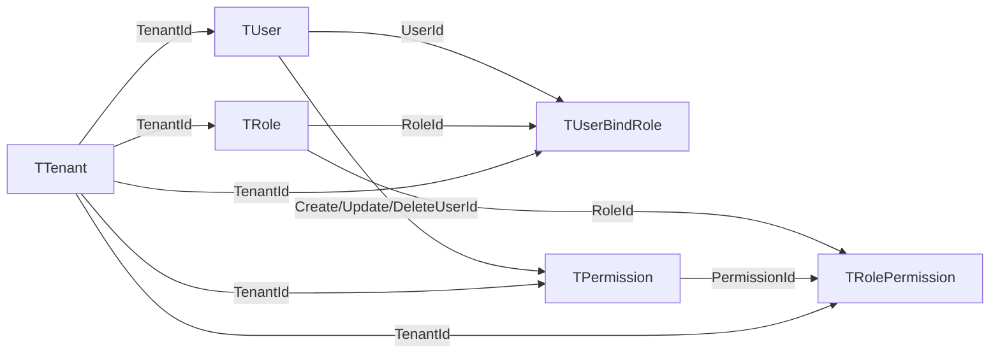
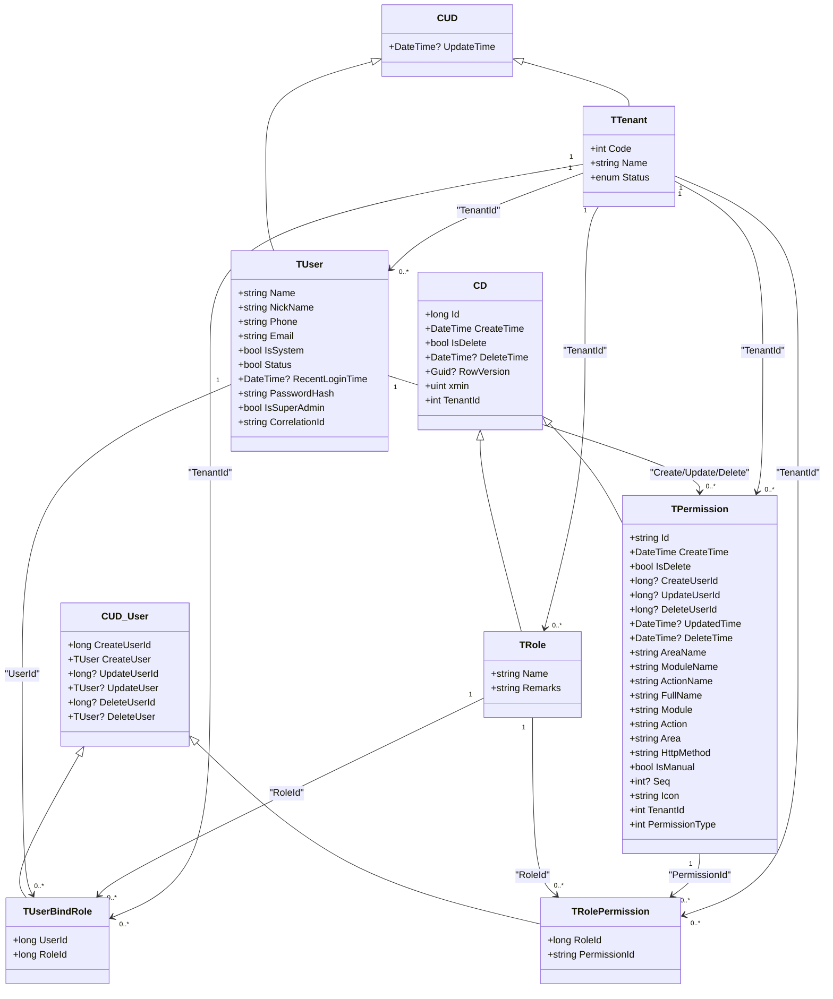

# 数据库表结构

<cite>
**本文引用的文件**
- [TUser.cs](file://Kevin/Domain/Entities/TUser.cs)
- [TRole.cs](file://Kevin/Domain/Entities/TRole.cs)
- [TPermission.cs](file://Kevin/Domain/Entities/TPermission.cs)
- [TTenant.cs](file://Kevin/Domain/Entities/TTenant.cs)
- [TRolePermission.cs](file://Kevin/Domain/Entities/TRolePermission.cs)
- [TUserBindRole.cs](file://Kevin/Domain/Entities/TUserBindRole.cs)
- [CD.cs](file://Kevin/Domain/Bases/CD.cs)
- [CUD.cs](file://Kevin/Domain/Bases/CUD.cs)
- [CUD_User.cs](file://Kevin/Domain/Bases/CUD_User.cs)
- [TUserConfiguration.cs](file://Kevin/ Kevin.EntityFrameworkCore/Configuration/TUserConfiguration.cs)
- [TRoleConfiguration.cs](file://Kevin/ Kevin.EntityFrameworkCore/Configuration/TRoleConfiguration.cs)
- [TPermissionConfig.cs](file://Kevin/ Kevin.EntityFrameworkCore/Configuration/TPermissionConfig.cs)
- [TTenantConfiguration.cs](file://Kevin/ Kevin.EntityFrameworkCore/Configuration/TTenantConfiguration.cs)
- [TUserBindRoleConfig.cs](file://Kevin/ Kevin.EntityFrameworkCore/Configuration/TUserBindRoleConfig.cs)
- [TUserBaseData.cs](file://Kevin/Domain/BaseDatas/TUserBaseData.cs)
- [TRoleBaseData.cs](file://Kevin/Domain/BaseDatas/TRoleBaseData.cs)
- [TTenantBaseData.cs](file://Kevin/Domain/BaseDatas/TTenantBaseData.cs)
</cite>

## 目录
1. [简介](#简介)
2. [项目结构](#项目结构)
3. [核心组件](#核心组件)
4. [架构总览](#架构总览)
5. [详细组件分析](#详细组件分析)
6. [依赖关系分析](#依赖关系分析)
7. [性能考虑](#性能考虑)
8. [故障排查指南](#故障排查指南)
9. [结论](#结论)
10. [附录](#附录)

## 简介
本文件面向系统的数据层设计，聚焦于多租户权限体系的核心实体：用户、角色、权限、租户及其关联关系。文档基于领域模型与EF配置，给出字段定义、数据类型与约束、主外键关系、索引策略与性能优化建议，并提供ER图与数据字典，帮助读者快速理解并正确使用该数据模型。

## 项目结构
- 领域实体位于 Domain/Entities，承载业务语义与基础审计字段；
- 基础基类位于 Domain/Bases，提供统一的创建、更新、删除、并发控制与租户隔离字段；
- EF配置位于 Kevin.EntityFrameworkCore/Configuration，负责种子数据与实体映射；
- 种子数据位于 Domain/BaseDatas，用于初始化默认租户、管理员用户与角色等。

图表来源
- [TUser.cs:1-99](file://Kevin/Domain/Entities/TUser.cs#L1-L99)
- [TRole.cs:1-41](file://Kevin/Domain/Entities/TRole.cs#L1-L41)
- [TPermission.cs:1-154](file://Kevin/Domain/Entities/TPermission.cs#L1-L154)
- [TTenant.cs:1-56](file://Kevin/Domain/Entities/TTenant.cs#L1-L56)
- [TRolePermission.cs:1-29](file://Kevin/Domain/Entities/TRolePermission.cs#L1-L29)
- [TUserBindRole.cs:1-22](file://Kevin/Domain/Entities/TUserBindRole.cs#L1-L22)
- [CD.cs:1-76](file://Kevin/Domain/Bases/CD.cs#L1-L76)
- [CUD.cs:1-19](file://Kevin/Domain/Bases/CUD.cs#L1-L19)
- [CUD_User.cs:1-42](file://Kevin/Domain/Bases/CUD_User.cs#L1-L42)
- [TUserConfiguration.cs:1-19](file://Kevin/ Kevin.EntityFrameworkCore/Configuration/TUserConfiguration.cs#L1-L19)
- [TRoleConfiguration.cs:1-18](file://Kevin/ Kevin.EntityFrameworkCore/Configuration/TRoleConfiguration.cs#L1-L18)
- [TPermissionConfig.cs:1-18](file://Kevin/ Kevin.EntityFrameworkCore/Configuration/TPermissionConfig.cs#L1-L18)
- [TTenantConfiguration.cs:1-18](file://Kevin/ Kevin.EntityFrameworkCore/Configuration/TTenantConfiguration.cs#L1-L18)
- [TUserBindRoleConfig.cs:1-19](file://Kevin/ Kevin.EntityFrameworkCore/Configuration/TUserBindRoleConfig.cs#L1-L19)

章节来源
- [TUser.cs:1-99](file://Kevin/Domain/Entities/TUser.cs#L1-L99)
- [TRole.cs:1-41](file://Kevin/Domain/Entities/TRole.cs#L1-L41)
- [TPermission.cs:1-154](file://Kevin/Domain/Entities/TPermission.cs#L1-L154)
- [TTenant.cs:1-56](file://Kevin/Domain/Entities/TTenant.cs#L1-L56)
- [CD.cs:1-76](file://Kevin/Domain/Bases/CD.cs#L1-L76)
- [CUD.cs:1-19](file://Kevin/Domain/Bases/CUD.cs#L1-L19)
- [CUD_User.cs:1-42](file://Kevin/Domain/Bases/CUD_User.cs#L1-L42)

## 核心组件
- 用户（TUser）：登录认证、账号状态、最近登录时间、密码哈希、是否超级管理员、第三方关联ID等。
- 角色（TRole）：角色名称、备注，作为权限的聚合单元。
- 权限（TPermission）：模块/动作/HTTP方法/图标/序号/手动标记/类型/租户ID等，支撑菜单、功能、数据、接口级权限。
- 租户（TTenant）：租户编码、名称、状态，贯穿所有实体的租户隔离。
- 用户-角色绑定（TUserBindRole）：实现用户与角色的多对多关系。
- 角色-权限绑定（TRolePermission）：实现角色与权限的多对多关系。

章节来源
- [TUser.cs:1-99](file://Kevin/Domain/Entities/TUser.cs#L1-L99)
- [TRole.cs:1-41](file://Kevin/Domain/Entities/TRole.cs#L1-L41)
- [TPermission.cs:1-154](file://Kevin/Domain/Entities/TPermission.cs#L1-L154)
- [TTenant.cs:1-56](file://Kevin/Domain/Entities/TTenant.cs#L1-L56)
- [TUserBindRole.cs:1-22](file://Kevin/Domain/Entities/TUserBindRole.cs#L1-L22)
- [TRolePermission.cs:1-29](file://Kevin/Domain/Entities/TRolePermission.cs#L1-L29)

## 架构总览
下图展示核心实体之间的关系：用户与角色通过绑定表建立多对多；角色与权限通过绑定表建立多对多；权限与用户通过“创建/编辑/删除人”形成弱关联；所有核心表均包含租户ID以实现多租户隔离。

图表来源
- [TUser.cs:1-99](file://Kevin/Domain/Entities/TUser.cs#L1-L99)
- [TRole.cs:1-41](file://Kevin/Domain/Entities/TRole.cs#L1-L41)
- [TPermission.cs:1-154](file://Kevin/Domain/Entities/TPermission.cs#L1-L154)
- [TTenant.cs:1-56](file://Kevin/Domain/Entities/TTenant.cs#L1-L56)
- [TUserBindRole.cs:1-22](file://Kevin/Domain/Entities/TUserBindRole.cs#L1-L22)
- [TRolePermission.cs:1-29](file://Kevin/Domain/Entities/TRolePermission.cs#L1-L29)
- [CD.cs:1-76](file://Kevin/Domain/Bases/CD.cs#L1-L76)
- [CUD.cs:1-19](file://Kevin/Domain/Bases/CUD.cs#L1-L19)
- [CUD_User.cs:1-42](file://Kevin/Domain/Bases/CUD_User.cs#L1-L42)

## 详细组件分析

### 用户表（TUser）
- 设计意图：存储系统用户基本信息、认证相关字段与账号状态，支持超级管理员与第三方账号关联。
- 关键字段
  - 标识：继承自基类的长整型主键Id
  - 基本属性：Name、NickName、Phone、Email
  - 认证与安全：PasswordHash、IsSuperAdmin、CorrelationId
  - 状态与审计：Status、RecentLoginTime、CreateTime、UpdateTime、DeleteTime、IsDelete、RowVersion/xmin、TenantId
- 约束与校验
  - 密码采用SHA256哈希存储；提供修改与验证方法
  - 超级管理员禁止删除
- 关系
  - 与TUserBindRole一对多（作为UserId）
  - 与TPermission存在创建/编辑/删除人的弱关联（CreateUserId/UpdateUserId/DeleteUserId）
  - 与TTenant通过TenantId进行多租户隔离

章节来源
- [TUser.cs:1-99](file://Kevin/Domain/Entities/TUser.cs#L1-L99)
- [CD.cs:1-76](file://Kevin/Domain/Bases/CD.cs#L1-L76)
- [CUD.cs:1-19](file://Kevin/Domain/Bases/CUD.cs#L1-L19)
- [CUD_User.cs:1-42](file://Kevin/Domain/Bases/CUD_User.cs#L1-L42)

### 角色表（TRole）
- 设计意图：以角色为粒度组织权限集合，便于批量授权。
- 关键字段
  - 标识：长整型主键Id
  - 业务字段：Name、Remarks
  - 审计与隔离：CreateTime、DeleteTime、IsDelete、RowVersion/xmin、TenantId
- 约束与校验
  - 名称长度限制
- 关系
  - 与TUserBindRole一对多（作为RoleId）
  - 与TRolePermission一对多（作为RoleId）
  - 与TTenant通过TenantId隔离

章节来源
- [TRole.cs:1-41](file://Kevin/Domain/Entities/TRole.cs#L1-L41)
- [CD.cs:1-76](file://Kevin/Domain/Bases/CD.cs#L1-L76)

### 权限表（TPermission）
- 设计意图：描述系统可访问的最小权限单元，覆盖菜单、功能、数据、接口等多维度。
- 关键字段
  - 标识：字符串主键Id
  - 模块与动作：AreaName、ModuleName、ActionName、FullName、Module、Action、Area、HttpMethod
  - 元数据：Icon、Seq、IsManual、PermissionType
  - 审计与隔离：CreateTime、UpdatedTime、DeleteTime、IsDelete、CreateUserId/UpdateUserId/DeleteUserId、TenantId
- 约束与校验
  - 非手动添加的权限禁止修改
- 关系
  - 与TRolePermission一对多（作为PermissionId）
  - 与TUser存在创建/编辑/删除人的弱关联
  - 与TTenant通过TenantId隔离

章节来源
- [TPermission.cs:1-154](file://Kevin/Domain/Entities/TPermission.cs#L1-L154)
- [CD.cs:1-76](file://Kevin/Domain/Bases/CD.cs#L1-L76)

### 租户表（TTenant）
- 设计意图：多租户隔离的根实体，承载租户编码、名称与状态。
- 关键字段
  - 标识：长整型主键Id
  - 业务字段：Code、Name、Status
  - 审计与隔离：CreateTime、DeleteTime、IsDelete、UpdateTime、RowVersion/xmin、TenantId
- 约束与校验
  - 提供可用性检查：已删除或失效状态不可用
- 关系
  - 作为所有核心表的租户隔离维度（TenantId）

章节来源
- [TTenant.cs:1-56](file://Kevin/Domain/Entities/TTenant.cs#L1-L56)
- [CD.cs:1-76](file://Kevin/Domain/Bases/CD.cs#L1-L76)

### 用户-角色绑定表（TUserBindRole）
- 设计意图：实现用户与角色的多对多关系。
- 关键字段
  - 标识：长整型主键Id
  - 关联：UserId、RoleId
  - 审计：CreateUserId/UpdateUserId/DeleteUserId、CreateTime、UpdateTime、DeleteTime、IsDelete、RowVersion/xmin、TenantId
- 关系
  - 与TUser一对多（UserId）
  - 与TRole一对多（RoleId）
  - 与TTenant通过TenantId隔离

章节来源
- [TUserBindRole.cs:1-22](file://Kevin/Domain/Entities/TUserBindRole.cs#L1-L22)
- [CUD_User.cs:1-42](file://Kevin/Domain/Bases/CUD_User.cs#L1-L42)
- [CD.cs:1-76](file://Kevin/Domain/Bases/CD.cs#L1-L76)

### 角色-权限绑定表（TRolePermission）
- 设计意图：实现角色与权限的多对多关系。
- 关键字段
  - 标识：长整型主键Id
  - 关联：RoleId、PermissionId
  - 审计：CreateUserId/UpdateUserId/DeleteUserId、CreateTime、UpdateTime、DeleteTime、IsDelete、RowVersion/xmin、TenantId
- 关系
  - 与TRole一对多（RoleId）
  - 与TPermission一对多（PermissionId）
  - 与TTenant通过TenantId隔离

章节来源
- [TRolePermission.cs:1-29](file://Kevin/Domain/Entities/TRolePermission.cs#L1-L29)
- [CUD_User.cs:1-42](file://Kevin/Domain/Bases/CUD_User.cs#L1-L42)
- [CD.cs:1-76](file://Kevin/Domain/Bases/CD.cs#L1-L76)

## 依赖关系分析
- 实体间耦合
  - 强耦合：TUserBindRole同时依赖TUser与TRole；TRolePermission同时依赖TRole与TPermission
  - 弱耦合：TPermission通过CreateUserId/UpdateUserId/DeleteUserId引用TUser，属于审计追踪
  - 多租户隔离：所有核心表均含TenantId，查询需带上租户条件
- 配置与种子数据
  - EF配置类仅承担HasData注入，不改变实体关系
  - 种子数据提供初始管理员用户、角色与租户，便于本地开发联调

图表来源
- [TUser.cs:1-99](file://Kevin/Domain/Entities/TUser.cs#L1-L99)
- [TRole.cs:1-41](file://Kevin/Domain/Entities/TRole.cs#L1-L41)
- [TPermission.cs:1-154](file://Kevin/Domain/Entities/TPermission.cs#L1-L154)
- [TTenant.cs:1-56](file://Kevin/Domain/Entities/TTenant.cs#L1-L56)
- [TUserBindRole.cs:1-22](file://Kevin/Domain/Entities/TUserBindRole.cs#L1-L22)
- [TRolePermission.cs:1-29](file://Kevin/Domain/Entities/TRolePermission.cs#L1-L29)

章节来源
- [TUserConfiguration.cs:1-19](file://Kevin/ Kevin.EntityFrameworkCore/Configuration/TUserConfiguration.cs#L1-L19)
- [TRoleConfiguration.cs:1-18](file://Kevin/ Kevin.EntityFrameworkCore/Configuration/TRoleConfiguration.cs#L1-L18)
- [TPermissionConfig.cs:1-18](file://Kevin/ Kevin.EntityFrameworkCore/Configuration/TPermissionConfig.cs#L1-L18)
- [TTenantConfiguration.cs:1-18](file://Kevin/ Kevin.EntityFrameworkCore/Configuration/TTenantConfiguration.cs#L1-L18)
- [TUserBindRoleConfig.cs:1-19](file://Kevin/ Kevin.EntityFrameworkCore/Configuration/TUserBindRoleConfig.cs#L1-L19)

## 性能考虑
- 索引策略建议
  - 唯一性/查询热点
    - TUser: (TenantId, Name)、(TenantId, Phone)、(TenantId, Email) 建立唯一或普通索引，加速登录与注册校验
    - TRole: (TenantId, Name) 唯一索引，避免同租户重名
    - TPermission: (TenantId, Module, Action)、(TenantId, Area, Module, Action) 复合索引，加速按模块/动作检索
    - TUserBindRole: (UserId)、(RoleId)、(TenantId, UserId)、(TenantId, RoleId) 复合索引，加速角色分配与查询
    - TRolePermission: (RoleId)、(PermissionId)、(TenantId, RoleId)、(TenantId, PermissionId) 复合索引，加速授权计算
    - TTenant: (Code) 唯一索引，加速租户路由
  - 审计与软删除
    - 为IsDelete与CreateTime/UpdateTime建立组合索引，提升分页与列表查询效率
  - 并发控制
    - 使用RowVersion/xmin进行乐观锁，减少写冲突
- 查询优化
  - 所有跨表查询必须携带TenantId过滤，避免全库扫描
  - 权限计算时优先走角色-权限缓存或物化视图，降低实时JOIN开销
  - 分页查询使用有序列（如CreateTime或Id）+ 游标式分页，避免深分页
- 存储效率
  - 合理设置字符串长度（如Name、Remarks、Module/Action等），避免过度分配
  - 将高频读字段（如Status、PermissionType）纳入覆盖索引，减少回表
  - 大对象或日志类表分表/归档，保持核心表轻量

[本节为通用性能建议，不直接分析具体代码文件]

## 故障排查指南
- 常见错误与定位
  - 重复键冲突：检查TUser(TenantId, Name/Phone/Email)、TRole(TenantId, Name)、TTenant(Code)的唯一约束
  - 权限修改失败：TPermission的非手动项禁止修改，需确认IsManual标志
  - 租户不可用：TTenant.IsInactiveCheck抛出异常，检查IsDelete与Status
  - 删除保护：TUser.DeleteCheck阻止删除超级管理员
- 调试建议
  - 开启EF日志，查看实际SQL与参数
  - 核对TenantId是否正确注入到当前上下文
  - 检查种子数据是否成功写入（参考各Configuration中的HasData）

章节来源
- [TPermission.cs:145-151](file://Kevin/Domain/Entities/TPermission.cs#L145-L151)
- [TTenant.cs:43-53](file://Kevin/Domain/Entities/TTenant.cs#L43-L53)
- [TUser.cs:89-95](file://Kevin/Domain/Entities/TUser.cs#L89-L95)
- [TUserConfiguration.cs:10-16](file://Kevin/ Kevin.EntityFrameworkCore/Configuration/TUserConfiguration.cs#L10-L16)
- [TRoleConfiguration.cs:10-15](file://Kevin/ Kevin.EntityFrameworkCore/Configuration/TRoleConfiguration.cs#L10-L15)
- [TPermissionConfig.cs:10-15](file://Kevin/ Kevin.EntityFrameworkCore/Configuration/TPermissionConfig.cs#L10-L15)
- [TTenantConfiguration.cs:10-15](file://Kevin/ Kevin.EntityFrameworkCore/Configuration/TTenantConfiguration.cs#L10-L15)
- [TUserBindRoleConfig.cs:10-16](file://Kevin/ Kevin.EntityFrameworkCore/Configuration/TUserBindRoleConfig.cs#L10-L16)

## 结论
本数据模型围绕“租户隔离 + RBAC权限”构建，通过用户、角色、权限及绑定表实现细粒度授权，并以统一基类保障审计与并发安全。建议在应用层严格遵循租户上下文传递，配合合理的索引设计与查询策略，确保系统在规模扩展下的性能与稳定性。

## 附录

### ER图（代码级）

图表来源
- [CD.cs:1-76](file://Kevin/Domain/Bases/CD.cs#L1-L76)
- [CUD.cs:1-19](file://Kevin/Domain/Bases/CUD.cs#L1-L19)
- [CUD_User.cs:1-42](file://Kevin/Domain/Bases/CUD_User.cs#L1-L42)
- [TUser.cs:1-99](file://Kevin/Domain/Entities/TUser.cs#L1-L99)
- [TRole.cs:1-41](file://Kevin/Domain/Entities/TRole.cs#L1-L41)
- [TPermission.cs:1-154](file://Kevin/Domain/Entities/TPermission.cs#L1-L154)
- [TTenant.cs:1-56](file://Kevin/Domain/Entities/TTenant.cs#L1-L56)
- [TUserBindRole.cs:1-22](file://Kevin/Domain/Entities/TUserBindRole.cs#L1-L22)
- [TRolePermission.cs:1-29](file://Kevin/Domain/Entities/TRolePermission.cs#L1-L29)

### 数据字典（核心表）
- TUser
  - 字段：Id、Name、NickName、Phone、Email、IsSystem、Status、RecentLoginTime、PasswordHash、IsSuperAdmin、CorrelationId、CreateTime、UpdateTime、DeleteTime、IsDelete、RowVersion、xmin、TenantId
  - 说明：用户账号与认证信息，支持多租户隔离与软删除
- TRole
  - 字段：Id、Name、Remarks、CreateTime、DeleteTime、IsDelete、RowVersion、xmin、TenantId
  - 说明：角色定义，用于权限聚合
- TPermission
  - 字段：Id、CreateTime、IsDelete、CreateUserId、UpdateUserId、DeleteUserId、UpdatedTime、DeleteTime、AreaName、ModuleName、ActionName、FullName、Module、Action、Area、HttpMethod、IsManual、Seq、Icon、TenantId、PermissionType
  - 说明：权限点定义，覆盖菜单/功能/数据/接口
- TTenant
  - 字段：Id、Code、Name、Status、CreateTime、DeleteTime、IsDelete、UpdateTime、RowVersion、xmin、TenantId
  - 说明：租户主数据，驱动多租户隔离
- TUserBindRole
  - 字段：Id、UserId、RoleId、CreateUserId、UpdateUserId、DeleteUserId、CreateTime、UpdateTime、DeleteTime、IsDelete、RowVersion、xmin、TenantId
  - 说明：用户与角色绑定
- TRolePermission
  - 字段：Id、RoleId、PermissionId、CreateUserId、UpdateUserId、DeleteUserId、CreateTime、UpdateTime、DeleteTime、IsDelete、RowVersion、xmin、TenantId
  - 说明：角色与权限绑定

章节来源
- [TUser.cs:1-99](file://Kevin/Domain/Entities/TUser.cs#L1-L99)
- [TRole.cs:1-41](file://Kevin/Domain/Entities/TRole.cs#L1-L41)
- [TPermission.cs:1-154](file://Kevin/Domain/Entities/TPermission.cs#L1-L154)
- [TTenant.cs:1-56](file://Kevin/Domain/Entities/TTenant.cs#L1-L56)
- [TUserBindRole.cs:1-22](file://Kevin/Domain/Entities/TUserBindRole.cs#L1-L22)
- [TRolePermission.cs:1-29](file://Kevin/Domain/Entities/TRolePermission.cs#L1-L29)
- [CD.cs:1-76](file://Kevin/Domain/Bases/CD.cs#L1-L76)
- [CUD.cs:1-19](file://Kevin/Domain/Bases/CUD.cs#L1-L19)
- [CUD_User.cs:1-42](file://Kevin/Domain/Bases/CUD_User.cs#L1-L42)