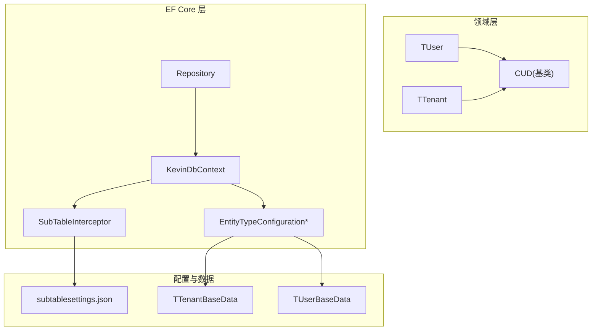
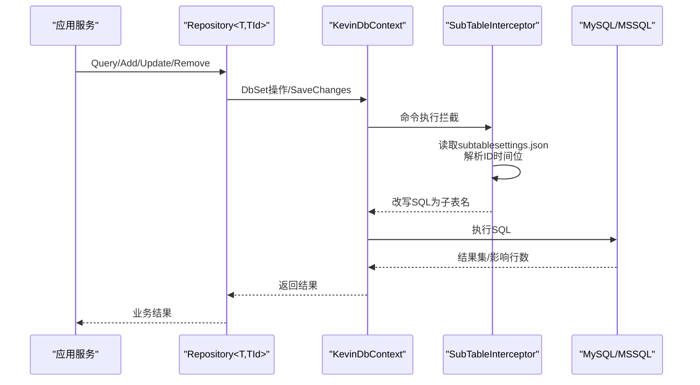
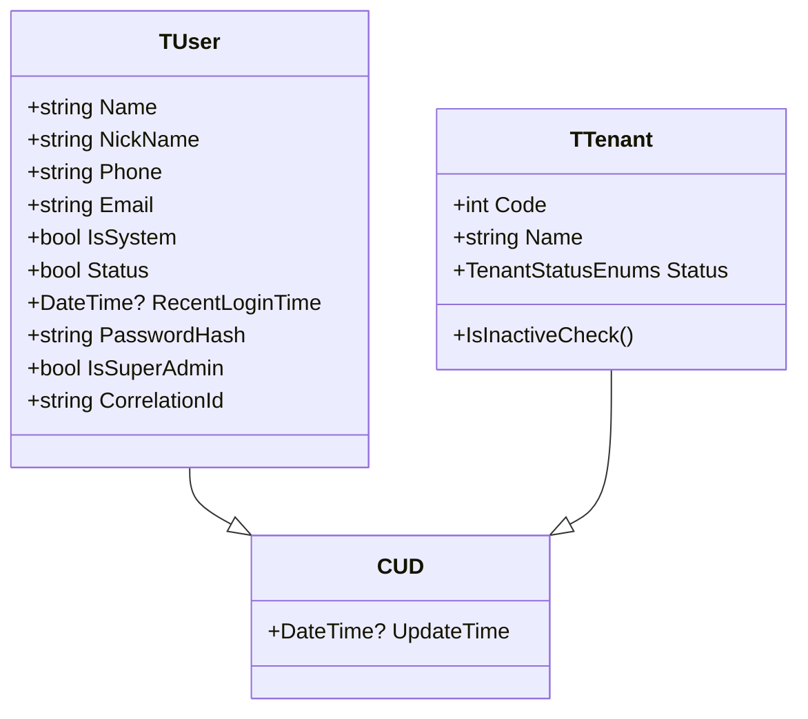
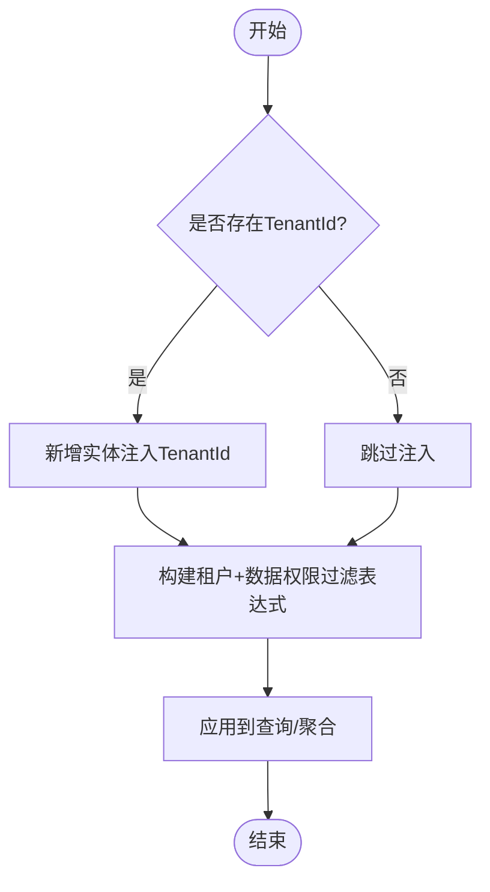
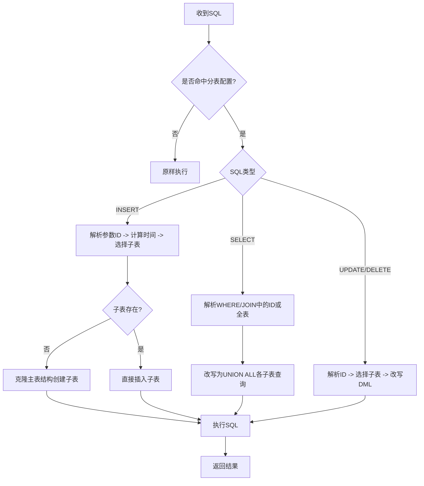
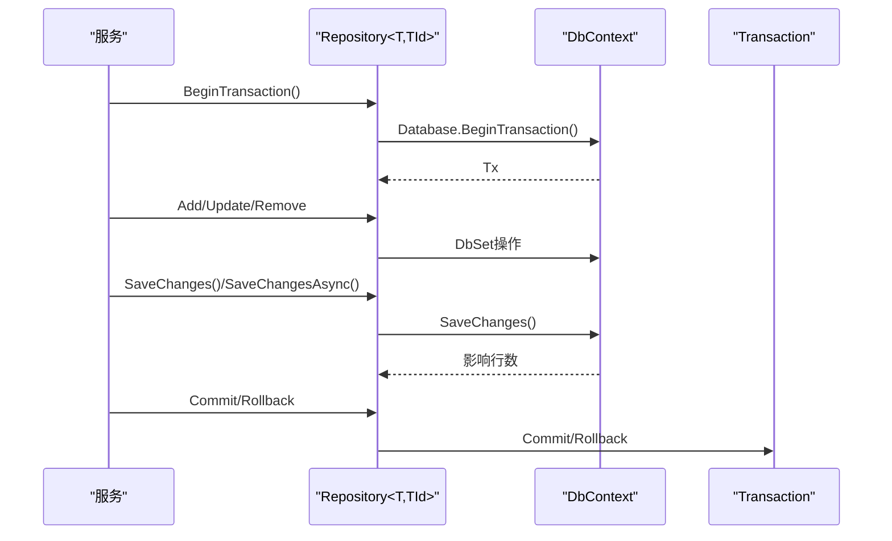
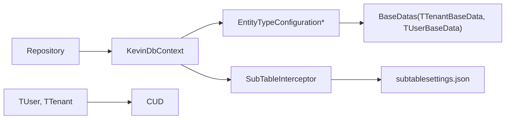
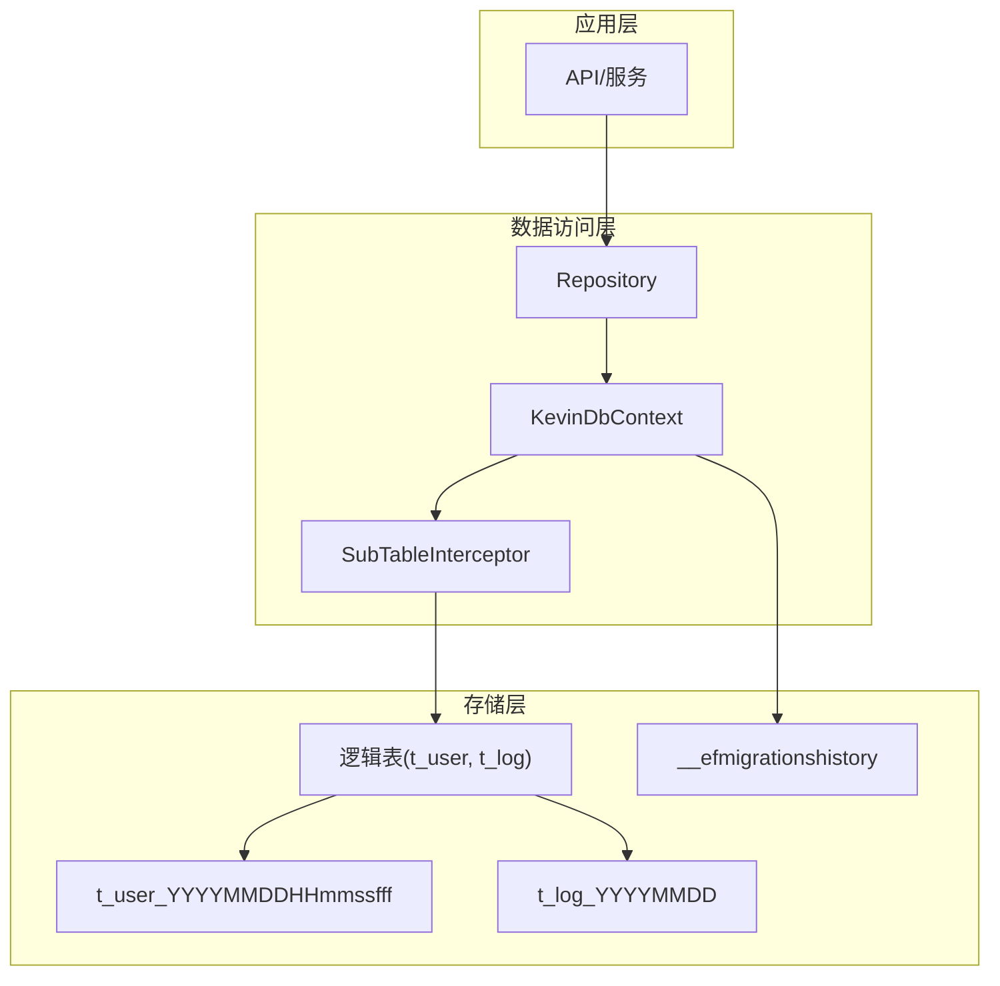

# 数据库设计

<cite>
**本文引用的文件**
- [KevinDbContext.cs](file://Kevin/ Kevin.EntityFrameworkCore/Database/KevinDbContext.cs)
- [SubTableInterceptor.cs](file://Kevin/ Kevin.EntityFrameworkCore/Interceptors/SubTableInterceptor.cs)
- [subtablesettings.json](file://Kevin/ Kevin.EntityFrameworkCore/subtablesettings.json)
- [Repository.cs](file://Kevin/ Kevin.EntityFrameworkCore/_/Data/Repository.cs)
- [TTenantConfiguration.cs](file://Kevin/ Kevin.EntityFrameworkCore/Configuration/TTenantConfiguration.cs)
- [TUserBaseData.cs](file://Kevin/ Domain/BaseDatas/TUserBaseData.cs)
- [TTenantBaseData.cs](file://Kevin/ Domain/BaseDatas/TTenantBaseData.cs)
- [TTenant.cs](file://Kevin/ Domain/Entities/TTenant.cs)
- [TUser.cs](file://Kevin/ Domain/Entities/TUser.cs)
- [CUD.cs](file://Kevin/ Domain/Bases/CUD.cs)
</cite>

## 目录
1. [简介](#简介)
2. [项目结构](#项目结构)
3. [核心组件](#核心组件)
4. [架构总览](#架构总览)
5. [详细组件分析](#详细组件分析)
6. [依赖关系分析](#依赖关系分析)
7. [性能考虑](#性能考虑)
8. [故障排查指南](#故障排查指南)
9. [结论](#结论)
10. [附录](#附录)

## 简介
本文件面向 NetCoreKevin 框架的数据库设计与实现，聚焦以下目标：
- 数据库架构图与表结构设计（核心实体、关联关系、索引）
- 多租户数据隔离策略（分表/分库、查询过滤）
- Entity Framework Core 配置与使用（实体映射、关系配置、迁移管理）
- 数据访问模式（仓储模式、查询优化、事务管理）
- 数据库性能优化建议（索引策略、查询优化、缓存机制）
- 数据迁移脚本与备份恢复方案

## 项目结构
本项目采用分层架构，数据库相关能力集中在 EF Core 层与领域模型层：
- 领域实体位于 Domain/Entities，基础基类在 Domain/Bases
- EF 上下文与配置位于 Kevin.EntityFrameworkCore
- 仓储抽象与通用实现位于 Kevin.EntityFrameworkCore/_/Data
- 子表拦截器用于按时间维度进行物理分表
- 种子数据与初始化配置位于 Domain/BaseDatas 与 Configuration

图表来源
- [KevinDbContext.cs:165-303](file://Kevin/ Kevin.EntityFrameworkCore/Database/KevinDbContext.cs#L165-L303)
- [SubTableInterceptor.cs:1-278](file://Kevin/ Kevin.EntityFrameworkCore/Interceptors/SubTableInterceptor.cs#L1-L278)
- [Repository.cs:22-175](file://Kevin/ Kevin.EntityFrameworkCore/_/Data/Repository.cs#L22-L175)
- [TTenantConfiguration.cs:8-18](file://Kevin/ Kevin.EntityFrameworkCore/Configuration/TTenantConfiguration.cs#L8-L18)
- [TUserBaseData.cs:1-18](file://Kevin/ Domain/BaseDatas/TUserBaseData.cs#L1-L18)
- [TTenantBaseData.cs:1-13](file://Kevin/ Domain/BaseDatas/TTenantBaseData.cs#L1-L13)

章节来源
- [KevinDbContext.cs:165-303](file://Kevin/ Kevin.EntityFrameworkCore/Database/KevinDbContext.cs#L165-L303)
- [Repository.cs:22-175](file://Kevin/ Kevin.EntityFrameworkCore/_/Data/Repository.cs#L22-L175)

## 核心组件
- 数据库上下文 KevinDbContext：负责连接串、默认索引字段、自动表名/列名转换、全局外键行为、种子数据注册、保存前处理（多租户注入、乐观并发、领域事件）。
- 仓储 Repository<T,TId>：封装增删改查、默认租户与数据权限过滤、事务开启、异步保存。
- 子表拦截器 SubTableInterceptor：根据 snowflake id 的时间位解析出时间，动态将 SQL 路由到 t_user_YYYYMMDDHHmmssfff、t_log_YYYYMMDD 等物理子表。
- 实体与配置：TTenant、TUser 等实体继承 CUD；种子数据通过 EntityTypeConfiguration 注入。

章节来源
- [KevinDbContext.cs:24-133](file://Kevin/ Kevin.EntityFrameworkCore/Database/KevinDbContext.cs#L24-L133)
- [Repository.cs:63-163](file://Kevin/ Kevin.EntityFrameworkCore/_/Data/Repository.cs#L63-L163)
- [SubTableInterceptor.cs:12-239](file://Kevin/ Kevin.EntityFrameworkCore/Interceptors/SubTableInterceptor.cs#L12-L239)
- [TTenant.cs:6-55](file://Kevin/ Domain/Entities/TTenant.cs#L6-L55)
- [TUser.cs:6-99](file://Kevin/ Domain/Entities/TUser.cs#L6-L99)
- [CUD.cs:1-19](file://Kevin/ Domain/Bases/CUD.cs#L1-L19)

## 架构总览
下图展示从应用调用到数据库执行的完整链路，包括仓储、上下文、拦截器与子表路由。

图表来源
- [Repository.cs:22-175](file://Kevin/ Kevin.EntityFrameworkCore/_/Data/Repository.cs#L22-L175)
- [KevinDbContext.cs:83-133](file://Kevin/ Kevin.EntityFrameworkCore/Database/KevinDbContext.cs#L83-L133)
- [SubTableInterceptor.cs:12-239](file://Kevin/ Kevin.EntityFrameworkCore/Interceptors/SubTableInterceptor.cs#L12-L239)
- [subtablesettings.json:1-11](file://Kevin/ Kevin.EntityFrameworkCore/subtablesettings.json#L1-L11)

## 详细组件分析

### 实体与表结构
- 基类 CUD：提供创建、更新、删除等公共字段（如更新时间），所有业务实体继承该基类以统一审计字段。
- 用户 TUser：包含用户名、昵称、手机、邮箱、状态、最近登录时间、密码哈希、是否系统用户、是否超级管理员、第三方关联Id等。
- 租户 TTenant：包含租户编码、名称、状态，并提供可用性校验方法。
- 表命名规则：由上下文统一转换为小写并加前缀“t_”，例如 t_user、t_tenant。
- 列命名与类型：列名转为小写下划线格式；bool 映射为 bit；Guid 映射为 char(36)。
- 注释：支持 DescriptionAttribute 注解生成表/列注释。

图表来源
- [CUD.cs:1-19](file://Kevin/ Domain/Bases/CUD.cs#L1-L19)
- [TUser.cs:6-99](file://Kevin/ Domain/Entities/TUser.cs#L6-L99)
- [TTenant.cs:6-55](file://Kevin/ Domain/Entities/TTenant.cs#L6-L55)

章节来源
- [KevinDbContext.cs:206-259](file://Kevin/ Kevin.EntityFrameworkCore/Database/KevinDbContext.cs#L206-L259)
- [TUser.cs:6-99](file://Kevin/ Domain/Entities/TUser.cs#L6-L99)
- [TTenant.cs:6-55](file://Kevin/ Domain/Entities/TTenant.cs#L6-L55)
- [CUD.cs:1-19](file://Kevin/ Domain/Bases/CUD.cs#L1-L19)

### 多租户数据隔离策略
- 写入时注入 TenantId：在 SaveChanges/SaveChangesAsync 中，对新增实体自动设置 TenantId。
- 查询时过滤：仓储层默认附加租户与数据权限过滤表达式，确保跨租户数据隔离。
- 可选全局过滤器：上下文中预留了 HasQueryFilter 的多租户过滤代码片段，可按需启用。
- 数据权限：基于当前用户的模块数据权限集合，进一步限制可访问数据的创建者范围。

图表来源
- [KevinDbContext.cs:428-483](file://Kevin/ Kevin.EntityFrameworkCore/Database/KevinDbContext.cs#L428-L483)
- [Repository.cs:63-163](file://Kevin/ Kevin.EntityFrameworkCore/_/Data/Repository.cs#L63-L163)

章节来源
- [KevinDbContext.cs:428-483](file://Kevin/ Kevin.EntityFrameworkCore/Database/KevinDbContext.cs#L428-L483)
- [Repository.cs:63-163](file://Kevin/ Kevin.EntityFrameworkCore/_/Data/Repository.cs#L63-L163)

### 数据分片与子表机制
- 配置：subtablesettings.json 声明需要分表的逻辑表名与时间格式（如 t_user 使用 yyyyMMddHHmmssfff，t_log 使用 yyyyMMdd）。
- 插入：拦截器根据 snowflake id 的时间位计算时间戳，若子表不存在则克隆主表结构，再插入到对应子表。
- 查询：拦截器识别查询中的主表名，根据条件或全量扫描，将 SQL 改写为 UNION ALL 多个子表查询。
- 更新/删除：根据 id 定位时间位，改写为对具体子表的 DML 语句。

图表来源
- [SubTableInterceptor.cs:12-239](file://Kevin/ Kevin.EntityFrameworkCore/Interceptors/SubTableInterceptor.cs#L12-L239)
- [subtablesettings.json:1-11](file://Kevin/ Kevin.EntityFrameworkCore/subtablesettings.json#L1-L11)

章节来源
- [SubTableInterceptor.cs:12-239](file://Kevin/ Kevin.EntityFrameworkCore/Interceptors/SubTableInterceptor.cs#L12-L239)
- [subtablesettings.json:1-11](file://Kevin/ Kevin.EntityFrameworkCore/subtablesettings.json#L1-L11)

### Entity Framework Core 配置与使用
- 连接与驱动：默认使用 MySQL 8.0.22，可通过配置切换其他数据库。
- 迁移历史表：__efmigrationshistory。
- 实体发现：自动扫描程序集中带 TableAttribute 的类型并加入模型。
- 表/列命名：统一小写下划线命名，bool/bit、Guid/char(36) 类型映射。
- 默认索引：根据配置项 DBDefaultHasIndexFields 自动为指定属性添加索引。
- 种子数据：通过 EntityTypeConfiguration 注册初始数据（租户、用户、字典等）。
- 级联删除：全局关闭外键级联删除，避免误删。

章节来源
- [KevinDbContext.cs:83-133](file://Kevin/ Kevin.EntityFrameworkCore/Database/KevinDbContext.cs#L83-L133)
- [KevinDbContext.cs:165-303](file://Kevin/ Kevin.EntityFrameworkCore/Database/KevinDbContext.cs#L165-L303)
- [TTenantConfiguration.cs:8-18](file://Kevin/ Kevin.EntityFrameworkCore/Configuration/TTenantConfiguration.cs#L8-L18)
- [TUserBaseData.cs:1-18](file://Kevin/ Domain/BaseDatas/TUserBaseData.cs#L1-L18)
- [TTenantBaseData.cs:1-13](file://Kevin/ Domain/BaseDatas/TTenantBaseData.cs#L1-L13)

### 数据访问模式（仓储、查询优化、事务）
- 仓储接口与实现：Repository<T,TId> 提供 Add/Update/Remove/Query/FirstOrDefault/Any/BeginTransaction/SaveChanges 等方法。
- 默认过滤：Query/FirstOrDefault/Any 默认附加租户与数据权限过滤，减少重复条件编写。
- 事务：通过 BeginTransaction 获取 IDbContextTransaction，便于跨多个仓储操作的原子性。
- 日志与变更：SaveChangesWithSaveLog 记录修改差异并写入 OS 日志表。

图表来源
- [Repository.cs:132-149](file://Kevin/ Kevin.EntityFrameworkCore/_/Data/Repository.cs#L132-L149)
- [KevinDbContext.cs:405-483](file://Kevin/ Kevin.EntityFrameworkCore/Database/KevinDbContext.cs#L405-L483)

章节来源
- [Repository.cs:22-175](file://Kevin/ Kevin.EntityFrameworkCore/_/Data/Repository.cs#L22-L175)
- [KevinDbContext.cs:405-483](file://Kevin/ Kevin.EntityFrameworkCore/Database/KevinDbContext.cs#L405-L483)

## 依赖关系分析
- 仓储依赖 DbContext，DbContext 依赖配置与拦截器。
- 子表拦截器依赖 subtablesettings.json 配置。
- 种子数据依赖 BaseDatas 与 EntityTypeConfiguration。
- 领域实体依赖基类 CUD。

图表来源
- [Repository.cs:22-175](file://Kevin/ Kevin.EntityFrameworkCore/_/Data/Repository.cs#L22-L175)
- [KevinDbContext.cs:165-303](file://Kevin/ Kevin.EntityFrameworkCore/Database/KevinDbContext.cs#L165-L303)
- [SubTableInterceptor.cs:12-239](file://Kevin/ Kevin.EntityFrameworkCore/Interceptors/SubTableInterceptor.cs#L12-L239)
- [subtablesettings.json:1-11](file://Kevin/ Kevin.EntityFrameworkCore/subtablesettings.json#L1-L11)
- [TUserBaseData.cs:1-18](file://Kevin/ Domain/BaseDatas/TUserBaseData.cs#L1-L18)
- [TTenantBaseData.cs:1-13](file://Kevin/ Domain/BaseDatas/TTenantBaseData.cs#L1-L13)
- [CUD.cs:1-19](file://Kevin/ Domain/Bases/CUD.cs#L1-L19)

章节来源
- [Repository.cs:22-175](file://Kevin/ Kevin.EntityFrameworkCore/_/Data/Repository.cs#L22-L175)
- [KevinDbContext.cs:165-303](file://Kevin/ Kevin.EntityFrameworkCore/Database/KevinDbContext.cs#L165-L303)

## 性能考虑
- 索引策略
  - 默认索引：通过 DBDefaultHasIndexFields 为高频查询字段自动建索引。
  - 复合索引：针对常见查询条件组合（如租户+状态、创建时间范围）建立复合索引。
  - 唯一索引：对业务唯一键（如手机号、邮箱、租户编码）建立唯一约束。
- 查询优化
  - 使用仓储默认过滤，避免重复条件导致的全表扫描。
  - 分页与投影：仅选取必要字段，减少网络与内存开销。
  - 避免 N+1：尽量使用 Include/Select 预加载或批量查询。
- 缓存机制
  - 读多写少的基础数据（字典、地区、角色权限）建议使用内存缓存或分布式缓存。
  - 热点查询结果缓存，注意失效策略与一致性。
- 分表与归档
  - 高吞吐写入表（日志、消息）启用子表机制，按时间分片，降低单表体积。
  - 定期归档历史数据至冷存储，保留热数据在在线库。
- 连接池与批处理
  - 合理设置连接池大小，避免连接耗尽。
  - 批量插入/更新以减少往返次数。

[本节为通用指导，不直接引用具体文件]

## 故障排查指南
- 多租户数据不可见
  - 检查仓储调用是否启用了默认租户过滤（isTenant=true）。
  - 确认当前上下文已正确注入 TenantId。
- 子表未生效
  - 核对 subtablesettings.json 配置是否正确。
  - 检查 snowflake id 是否包含有效时间位。
  - 确认拦截器已注册并在管道中生效。
- 种子数据未初始化
  - 检查 EntityTypeConfiguration 是否被 ApplyConfiguration 调用。
  - 确认数据库中存在 __efmigrationshistory 且版本一致。
- 事务未提交/回滚
  - 确保在异常路径显式 Rollback，正常路径 Commit。
  - 使用 using 包裹事务，确保资源释放。

章节来源
- [Repository.cs:63-163](file://Kevin/ Kevin.EntityFrameworkCore/_/Data/Repository.cs#L63-L163)
- [KevinDbContext.cs:428-483](file://Kevin/ Kevin.EntityFrameworkCore/Database/KevinDbContext.cs#L428-L483)
- [SubTableInterceptor.cs:12-239](file://Kevin/ Kevin.EntityFrameworkCore/Interceptors/SubTableInterceptor.cs#L12-L239)
- [KevinDbContext.cs:165-303](file://Kevin/ Kevin.EntityFrameworkCore/Database/KevinDbContext.cs#L165-L303)

## 结论
NetCoreKevin 框架通过统一的 EF 上下文、仓储抽象、子表拦截器与种子数据配置，实现了：
- 清晰的实体与表结构规范
- 强大多租户隔离（写入注入、查询过滤）
- 灵活的分表机制（基于 snowflake id 的时间位）
- 标准化的数据访问与事务管理
结合合理的索引、缓存与归档策略，可在保证一致性的同时获得良好的扩展性与性能。

[本节为总结，不直接引用具体文件]

## 附录

### 数据库架构图（概念）

[此图为概念示意，不绑定具体源码行号]

### 数据迁移与备份恢复
- 迁移管理
  - 使用 EF Core 迁移工具生成并应用迁移脚本，确保数据库结构与代码一致。
  - 生产环境建议采用自动化流水线执行迁移，并保留回滚脚本。
- 备份策略
  - 定期全量备份与增量备份，结合子表归档策略降低备份体积。
  - 异地容灾与演练，确保恢复可用。
- 恢复流程
  - 先恢复元数据与核心表，再恢复业务表；验证完整性后上线。

[本节为通用指导，不直接引用具体文件]