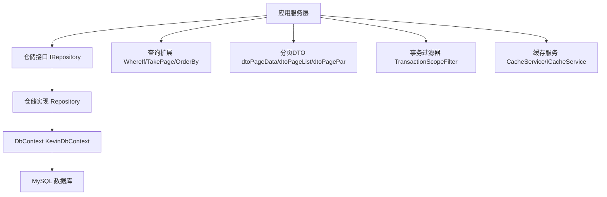
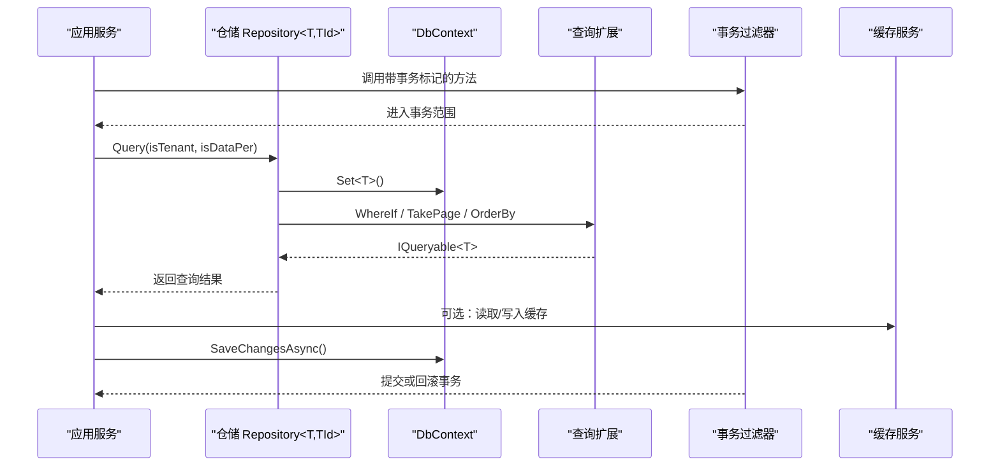
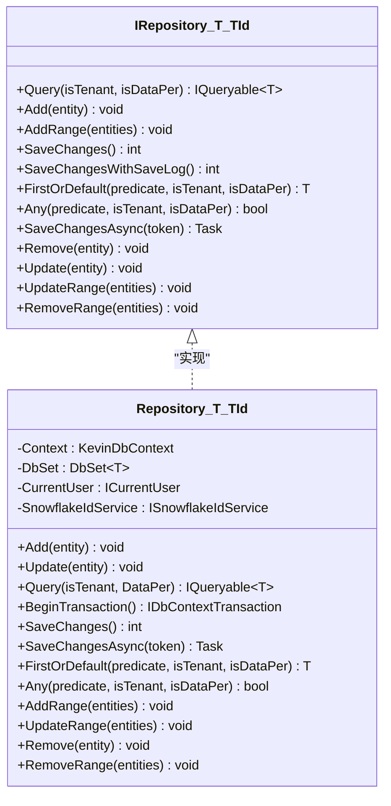
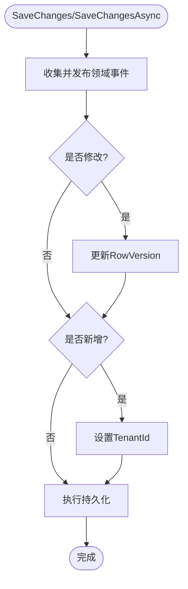
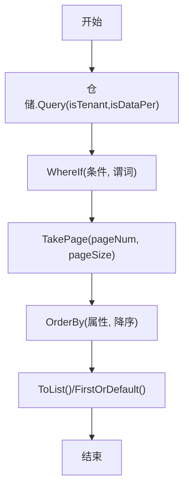
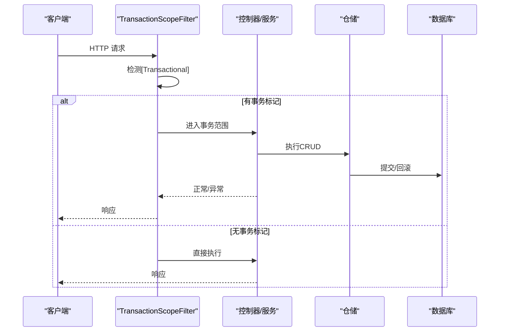
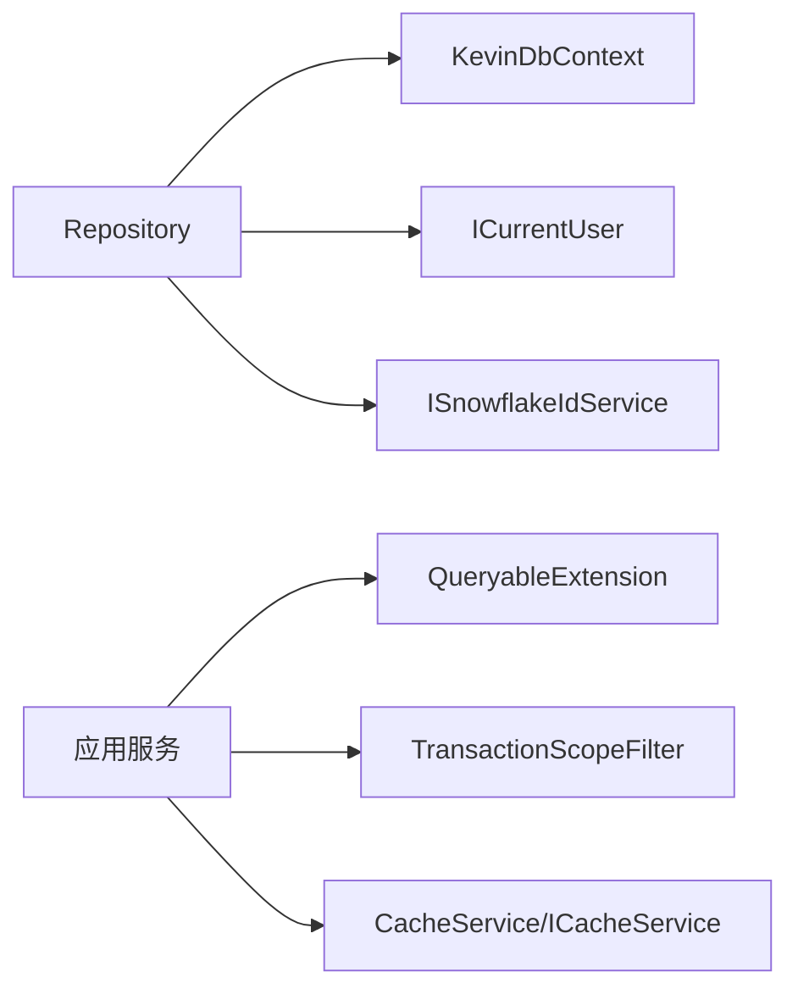

# 数据访问模式

<cite>
**本文引用的文件**
- [IRepository`.cs](file://Kevin/kevin.Share/Interfaces/IRepository`.cs)
- [IBaseRepository.cs](file://Kevin/kevin.Share/Interfaces/IBaseRepository.cs)
- [Repository.cs](file://Kevin/Kevin.EntityFrameworkCore/_/Data/Repository.cs)
- [KevinDbContext.cs](file://Kevin/Kevin.EntityFrameworkCore/Database/KevinDbContext.cs)
- [QueryableExtension.cs](file://Kevin/kevin.Module/Kevin.Common/Extension/QueryableExtension.cs)
- [dtoPageData.cs](file://Kevin/kevin.Share/Dtos/dtoPageData.cs)
- [dtoPageList.cs](file://Kevin/kevin.Share/Dtos/dtoPageList.cs)
- [dtoPagePar.cs](file://Kevin/kevin.Share/Dtos/dtoPagePar.cs)
- [TransactionScopeFilter.cs](file://Kevin/kevin.Web.Basics/Filters/TransactionScope/TransactionScopeFilter.cs)
- [CacheService.cs](file://Kevin/kevin.Module/kevin.Cache/Service/CacheService.cs)
- [ICacheService.cs](file://Kevin/kevin.Module/kevin.Cache/Service/ICacheService.cs)
- [ServiceCollectionExtensions.cs](file://Kevin/kevin.Module/kevin.Cache/ServiceCollectionExtensions.cs)
- [ApplicationBuilderExtensions.cs](file://Kevin/kevin.Module/kevin.Cache/ApplicationBuilderExtensions.cs)
</cite>

## 目录
1. [简介](#简介)
2. [项目结构](#项目结构)
3. [核心组件](#核心组件)
4. [架构总览](#架构总览)
5. [详细组件分析](#详细组件分析)
6. [依赖关系分析](#依赖关系分析)
7. [性能考虑](#性能考虑)
8. [故障排查指南](#故障排查指南)
9. [结论](#结论)
10. [附录](#附录)

## 简介
本文件围绕仓储模式在本代码库中的实现，系统阐述通用仓储接口设计、具体实现类、CRUD封装（含分页、条件筛选与排序）、事务管理（本地事务与分布式事务策略）、查询优化技巧（N+1问题、批量操作、异步查询）以及缓存策略（内存缓存、分布式缓存、查询结果缓存）。目标是帮助读者快速理解并高效使用该项目的数据访问层。

## 项目结构
本项目采用分层架构：领域实体位于 Domain，仓储接口在 Share/Interfaces，仓储实现在 EntityFrameworkCore 模块，数据库上下文与配置在 Database，扩展方法在 Common/Extension，分页 DTO 在 Share/Dtos，事务过滤器在 Web.Basics/Filters，缓存能力在 kevin.Cache 模块。

图表来源
- [Repository.cs:22-175](file://Kevin/Kevin.EntityFrameworkCore/_/Data/Repository.cs#L22-L175)
- [KevinDbContext.cs:24-133](file://Kevin/Kevin.EntityFrameworkCore/Database/KevinDbContext.cs#L24-L133)
- [QueryableExtension.cs:9-103](file://Kevin/kevin.Module/Kevin.Common/Extension/QueryableExtension.cs#L9-L103)
- [dtoPageData.cs:7-50](file://Kevin/kevin.Share/Dtos/dtoPageData.cs#L7-L50)
- [dtoPageList.cs:9-27](file://Kevin/kevin.Share/Dtos/dtoPageList.cs#L9-L27)
- [dtoPagePar.cs:3-48](file://Kevin/kevin.Share/Dtos/dtoPagePar.cs#L3-L48)
- [TransactionScopeFilter.cs:12-46](file://Kevin/kevin.Web.Basics/Filters/TransactionScope/TransactionScopeFilter.cs#L12-L46)
- [CacheService.cs](file://Kevin/kevin.Module/kevin.Cache/Service/CacheService.cs)
- [ICacheService.cs](file://Kevin/kevin.Module/kevin.Cache/Service/ICacheService.cs)

章节来源
- [Repository.cs:22-175](file://Kevin/Kevin.EntityFrameworkCore/_/Data/Repository.cs#L22-L175)
- [KevinDbContext.cs:24-133](file://Kevin/Kevin.EntityFrameworkCore/Database/KevinDbContext.cs#L24-L133)
- [QueryableExtension.cs:9-103](file://Kevin/kevin.Module/Kevin.Common/Extension/QueryableExtension.cs#L9-L103)
- [dtoPageData.cs:7-50](file://Kevin/kevin.Share/Dtos/dtoPageData.cs#L7-L50)
- [dtoPageList.cs:9-27](file://Kevin/kevin.Share/Dtos/dtoPageList.cs#L9-L27)
- [dtoPagePar.cs:3-48](file://Kevin/kevin.Share/Dtos/dtoPagePar.cs#L3-L48)
- [TransactionScopeFilter.cs:12-46](file://Kevin/kevin.Web.Basics/Filters/TransactionScope/TransactionScopeFilter.cs#L12-L46)

## 核心组件
- 通用仓储接口：定义 Query、Add/Update/Remove、批量操作、保存变更、FirstOrDefault/Any 等基础能力，支持租户隔离与数据权限过滤参数。
- 仓储实现：基于 EF Core 的 DbSet 提供 CRUD，内置默认租户过滤和数据权限过滤表达式构建，提供事务边界与异步保存。
- 数据库上下文：统一模型配置、字段命名、索引、默认值、多租户注入、乐观并发、领域事件发布、审计日志记录。
- 查询扩展：提供条件式 Where、分页 TakePage、动态排序 OrderBy 等常用查询组合。
- 分页 DTO：统一的请求与响应分页结构，便于跨层传递分页参数与结果。
- 事务过滤器：通过 ActionFilter 自动为标注的方法开启分布式事务范围，简化业务事务编排。
- 缓存服务：提供缓存抽象与注册扩展，用于内存/分布式缓存与查询结果缓存。

章节来源
- [IRepository`.cs:11-36](file://Kevin/kevin.Share/Interfaces/IRepository`.cs#L11-L36)
- [Repository.cs:22-175](file://Kevin/Kevin.EntityFrameworkCore/_/Data/Repository.cs#L22-L175)
- [KevinDbContext.cs:165-305](file://Kevin/Kevin.EntityFrameworkCore/Database/KevinDbContext.cs#L165-L305)
- [QueryableExtension.cs:19-103](file://Kevin/kevin.Module/Kevin.Common/Extension/QueryableExtension.cs#L19-L103)
- [dtoPageData.cs:7-50](file://Kevin/kevin.Share/Dtos/dtoPageData.cs#L7-L50)
- [dtoPageList.cs:9-27](file://Kevin/kevin.Share/Dtos/dtoPageList.cs#L9-L27)
- [dtoPagePar.cs:3-48](file://Kevin/kevin.Share/Dtos/dtoPagePar.cs#L3-L48)
- [TransactionScopeFilter.cs:12-46](file://Kevin/kevin.Web.Basics/Filters/TransactionScope/TransactionScopeFilter.cs#L12-L46)
- [CacheService.cs](file://Kevin/kevin.Module/kevin.Cache/Service/CacheService.cs)
- [ICacheService.cs](file://Kevin/kevin.Module/kevin.Cache/Service/ICacheService.cs)

## 架构总览
仓储模式在本项目中以“接口 + 泛型实现”的方式解耦业务与持久化细节。仓储通过 DbContext 访问数据库，结合查询扩展与分页 DTO 完成复杂查询；通过事务过滤器与 DbContext 的事务 API 组合实现本地/分布式事务；通过缓存服务对热点数据进行缓存。

图表来源
- [Repository.cs:155-163](file://Kevin/Kevin.EntityFrameworkCore/_/Data/Repository.cs#L155-L163)
- [QueryableExtension.cs:58-103](file://Kevin/kevin.Module/Kevin.Common/Extension/QueryableExtension.cs#L58-L103)
- [TransactionScopeFilter.cs:15-44](file://Kevin/kevin.Web.Basics/Filters/TransactionScope/TransactionScopeFilter.cs#L15-L44)
- [CacheService.cs](file://Kevin/kevin.Module/kevin.Cache/Service/CacheService.cs)

## 详细组件分析

### 仓储接口与实现
- 接口职责：定义按条件查询、增删改、批量操作、保存变更、存在性判断等通用能力；Query 支持租户与数据权限开关。
- 实现要点：
  - 构造时解析 DbContext、DbSet、当前用户、雪花ID服务等依赖。
  - 内部构建默认租户与数据权限过滤表达式，并在 FirstOrDefault/Any/Query 中合并到谓词。
  - 提供 BeginTransaction 与 SaveChanges/SaveChangesAsync 封装。
  - 提供 Add/AddRange/Update/UpdateRange/Remove/RemoveRange 等批量操作。

图表来源
- [IRepository`.cs:11-36](file://Kevin/kevin.Share/Interfaces/IRepository`.cs#L11-L36)
- [Repository.cs:22-175](file://Kevin/Kevin.EntityFrameworkCore/_/Data/Repository.cs#L22-L175)

章节来源
- [IRepository`.cs:11-36](file://Kevin/kevin.Share/Interfaces/IRepository`.cs#L11-L36)
- [Repository.cs:22-175](file://Kevin/Kevin.EntityFrameworkCore/_/Data/Repository.cs#L22-L175)

### 数据库上下文与领域事件
- 模型配置：自动发现实体、统一表名前缀与字段名、布尔/Guid类型映射、默认索引、默认值、注释。
- 多租户：新增时自动填充 TenantId；查询时可结合仓储的租户过滤。
- 乐观并发：修改时更新 RowVersion。
- 领域事件：在 SaveChanges/SaveChangesAsync 前收集并发布领域事件。
- 审计日志：SaveChangesWithSaveLog 对比旧值与新值，生成 TOSLog 记录。

图表来源
- [KevinDbContext.cs:405-484](file://Kevin/Kevin.EntityFrameworkCore/Database/KevinDbContext.cs#L405-L484)
- [KevinDbContext.cs:525-583](file://Kevin/Kevin.EntityFrameworkCore/Database/KevinDbContext.cs#L525-L583)

章节来源
- [KevinDbContext.cs:165-305](file://Kevin/Kevin.EntityFrameworkCore/Database/KevinDbContext.cs#L165-L305)
- [KevinDbContext.cs:405-484](file://Kevin/Kevin.EntityFrameworkCore/Database/KevinDbContext.cs#L405-L484)
- [KevinDbContext.cs:525-583](file://Kevin/Kevin.EntityFrameworkCore/Database/KevinDbContext.cs#L525-L583)

### 分页、条件筛选与排序
- 分页 DTO：dtoPageData/dtoPagePar 提供 pageNum、pageSize、GetSkip 等；dtoPageList 作为分页结果载体。
- 查询扩展：WhereIf/WhereIfNotNull/WhereIfNotNullOrEmpty 实现条件拼接；TakePage 实现分页；OrderBy 支持动态排序。
- 典型用法：先使用仓储 Query 获取带租户/权限过滤的 IQueryable，再链式调用扩展方法进行筛选、排序、分页。

图表来源
- [QueryableExtension.cs:19-103](file://Kevin/kevin.Module/Kevin.Common/Extension/QueryableExtension.cs#L19-L103)
- [dtoPageData.cs:7-50](file://Kevin/kevin.Share/Dtos/dtoPageData.cs#L7-L50)
- [dtoPagePar.cs:3-48](file://Kevin/kevin.Share/Dtos/dtoPagePar.cs#L3-L48)
- [dtoPageList.cs:9-27](file://Kevin/kevin.Share/Dtos/dtoPageList.cs#L9-L27)

章节来源
- [QueryableExtension.cs:19-103](file://Kevin/kevin.Module/Kevin.Common/Extension/QueryableExtension.cs#L19-L103)
- [dtoPageData.cs:7-50](file://Kevin/kevin.Share/Dtos/dtoPageData.cs#L7-L50)
- [dtoPagePar.cs:3-48](file://Kevin/kevin.Share/Dtos/dtoPagePar.cs#L3-L48)
- [dtoPageList.cs:9-27](file://Kevin/kevin.Share/Dtos/dtoPageList.cs#L9-L27)

### 事务管理（本地与分布式）
- 本地事务：仓储暴露 BeginTransaction 与 SaveChangesAsync，可在业务层手动控制事务边界。
- 分布式事务：通过 TransactionScopeFilter 在控制器动作上启用 TransactionScope，自动包裹整个请求处理流程，异常或取消则回滚。
- 建议：
  - 写操作优先使用事务过滤器保证一致性。
  - 读操作避免不必要的事务，减少锁竞争。
  - 长事务拆分为多个短事务，降低死锁风险。

图表来源
- [TransactionScopeFilter.cs:15-44](file://Kevin/kevin.Web.Basics/Filters/TransactionScope/TransactionScopeFilter.cs#L15-L44)
- [Repository.cs:132-149](file://Kevin/Kevin.EntityFrameworkCore/_/Data/Repository.cs#L132-L149)

章节来源
- [TransactionScopeFilter.cs:15-44](file://Kevin/kevin.Web.Basics/Filters/TransactionScope/TransactionScopeFilter.cs#L15-L44)
- [Repository.cs:132-149](file://Kevin/Kevin.EntityFrameworkCore/_/Data/Repository.cs#L132-L149)

### 查询优化技巧
- N+1 问题：
  - 使用 Include/ThenInclude 预加载关联数据（在仓储之上通过扩展方法组合）。
  - 将多次查询合并为一次 SQL，避免循环内逐条查询。
- 批量操作：
  - 使用 AddRange/UpdateRange/RemoveRange 减少往返次数。
  - 大批量写入可考虑分批次提交，避免事务过大。
- 异步查询：
  - 使用 SaveChangesAsync 与异步 LINQ 方法（ToListAsync/FirstOrDefaultAsync），提高吞吐。
- 条件与分页：
  - 使用 WhereIf 系列按需拼接条件，避免无效查询。
  - 使用 TakePage 进行服务端分页，限制返回行数。

章节来源
- [Repository.cs:122-130](file://Kevin/Kevin.EntityFrameworkCore/_/Data/Repository.cs#L122-L130)
- [Repository.cs:146-149](file://Kevin/Kevin.EntityFrameworkCore/_/Data/Repository.cs#L146-L149)
- [QueryableExtension.cs:58-103](file://Kevin/kevin.Module/Kevin.Common/Extension/QueryableExtension.cs#L58-L103)

### 缓存策略
- 缓存服务：
  - ICacheService 定义缓存读写接口，CacheService 提供实现。
  - ServiceCollectionExtensions 与 ApplicationBuilderExtensions 提供 DI 注册与中间件集成点。
- 适用场景：
  - 热点字典/配置：内存缓存，低延迟。
  - 跨实例共享数据：分布式缓存（如 Redis），需结合过期策略与失效机制。
  - 查询结果缓存：对只读且变化不频繁的数据进行缓存，注意缓存键设计与失效时机。
- 最佳实践：
  - 合理设置过期时间，避免脏读。
  - 对高并发写热点数据，采用写扩散或延迟双删策略。
  - 缓存穿透/雪崩防护：空值缓存、随机过期、限流降级。

章节来源
- [ICacheService.cs](file://Kevin/kevin.Module/kevin.Cache/Service/ICacheService.cs)
- [CacheService.cs](file://Kevin/kevin.Module/kevin.Cache/Service/CacheService.cs)
- [ServiceCollectionExtensions.cs](file://Kevin/kevin.Module/kevin.Cache/ServiceCollectionExtensions.cs)
- [ApplicationBuilderExtensions.cs](file://Kevin/kevin.Module/kevin.Cache/ApplicationBuilderExtensions.cs)

## 依赖关系分析
- 仓储实现依赖 DbContext、当前用户、雪花ID服务，体现关注点分离。
- 查询扩展独立于仓储，可被任意 IQueryable 使用，提升复用性。
- 事务过滤器与仓储解耦，通过 ASP.NET 管道注入事务语义。
- 缓存服务通过 DI 注册，可被服务层或仓储层按需使用。

图表来源
- [Repository.cs:24-52](file://Kevin/Kevin.EntityFrameworkCore/_/Data/Repository.cs#L24-L52)
- [TransactionScopeFilter.cs:15-44](file://Kevin/kevin.Web.Basics/Filters/TransactionScope/TransactionScopeFilter.cs#L15-L44)
- [QueryableExtension.cs:9-103](file://Kevin/kevin.Module/Kevin.Common/Extension/QueryableExtension.cs#L9-L103)
- [CacheService.cs](file://Kevin/kevin.Module/kevin.Cache/Service/CacheService.cs)

章节来源
- [Repository.cs:24-52](file://Kevin/Kevin.EntityFrameworkCore/_/Data/Repository.cs#L24-L52)
- [TransactionScopeFilter.cs:15-44](file://Kevin/kevin.Web.Basics/Filters/TransactionScope/TransactionScopeFilter.cs#L15-L44)
- [QueryableExtension.cs:9-103](file://Kevin/kevin.Module/Kevin.Common/Extension/QueryableExtension.cs#L9-L103)
- [CacheService.cs](file://Kevin/kevin.Module/kevin.Cache/Service/CacheService.cs)

## 性能考虑
- 索引与查询：
  - 利用默认索引字段配置与业务索引，确保高频查询列命中索引。
  - 使用投影 Select 仅取必要字段，减少网络与内存开销。
- 连接与事务：
  - 避免长事务，缩短持有锁的时间。
  - 合理使用异步与并行度，避免线程池饥饿。
- 缓存：
  - 对读多写少的数据引入缓存，降低数据库压力。
  - 合理设置过期与失效策略，平衡一致性与性能。
- 批处理：
  - 批量插入/更新/删除，减少往返次数。
  - 大事务拆分，避免锁冲突与超时。

## 故障排查指南
- 查询结果为空：
  - 检查租户过滤与数据权限过滤参数是否正确。
  - 确认 WhereIf 条件是否误判导致无匹配。
- 事务未生效：
  - 确认控制器方法是否标注事务特性，过滤器是否启用。
  - 检查是否存在异常或取消导致未 Complete。
- 性能退化：
  - 排查 N+1 查询，增加预加载或合并查询。
  - 检查是否缺少索引或使用了非选择性条件。
- 缓存不一致：
  - 核对缓存键与失效策略，确保写路径正确清理缓存。
  - 观察缓存命中率与过期行为。

章节来源
- [Repository.cs:63-121](file://Kevin/Kevin.EntityFrameworkCore/_/Data/Repository.cs#L63-L121)
- [TransactionScopeFilter.cs:15-44](file://Kevin/kevin.Web.Basics/Filters/TransactionScope/TransactionScopeFilter.cs#L15-L44)
- [QueryableExtension.cs:58-103](file://Kevin/kevin.Module/Kevin.Common/Extension/QueryableExtension.cs#L58-L103)

## 结论
本项目通过通用仓储接口与实现、EF Core 上下文、查询扩展、分页 DTO、事务过滤器与缓存服务，构建了完整的数据访问体系。遵循本文的最佳实践，可有效提升开发效率、数据一致性与系统性能。建议在业务中优先使用条件式查询与分页、合理使用事务与缓存，并结合监控与日志持续优化。

## 附录
- 分页 DTO 字段说明：
  - pageNum/pageSize：页码与每页大小，GetSkip 计算跳过行数。
  - total/List/data：总数与数据集合。
  - StartTime/EndTime：时间范围筛选。
- 查询扩展方法：
  - WhereIf/WhereIfNotNull/WhereIfNotNullOrEmpty：条件式筛选。
  - TakePage：分页。
  - OrderBy：动态排序。

章节来源
- [dtoPageData.cs:7-50](file://Kevin/kevin.Share/Dtos/dtoPageData.cs#L7-L50)
- [dtoPageList.cs:9-27](file://Kevin/kevin.Share/Dtos/dtoPageList.cs#L9-L27)
- [dtoPagePar.cs:3-48](file://Kevin/kevin.Share/Dtos/dtoPagePar.cs#L3-L48)
- [QueryableExtension.cs:19-103](file://Kevin/kevin.Module/Kevin.Common/Extension/QueryableExtension.cs#L19-L103)