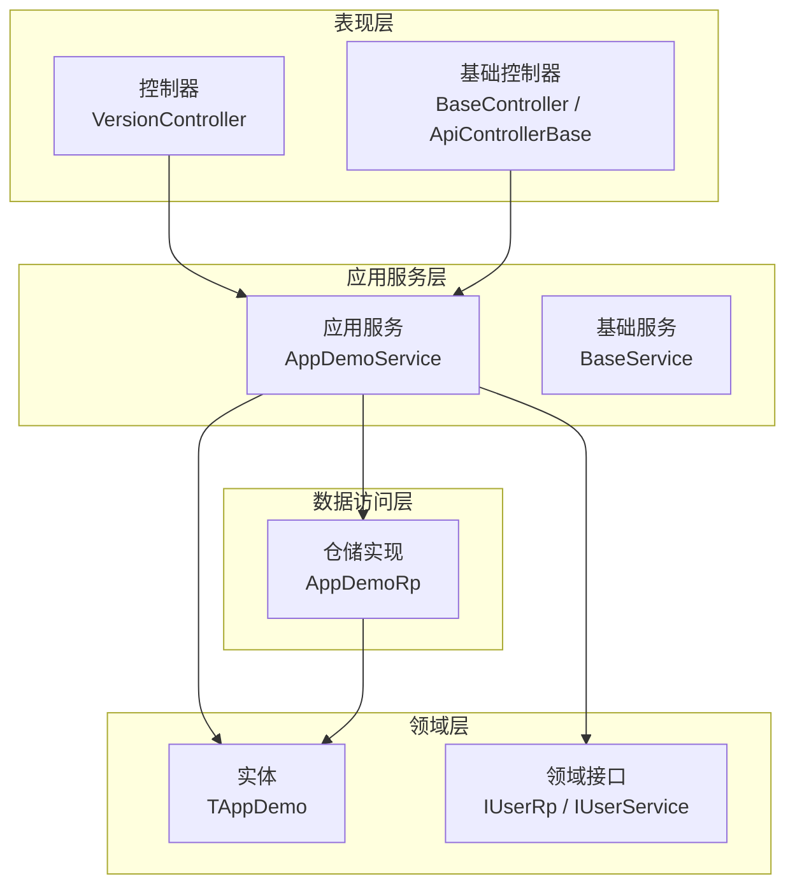
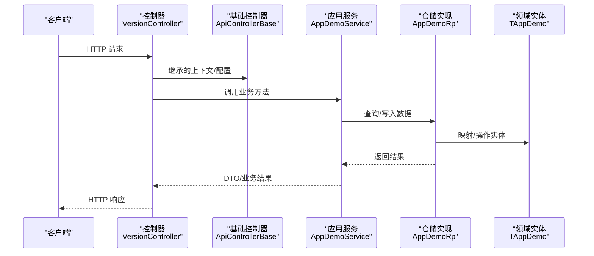
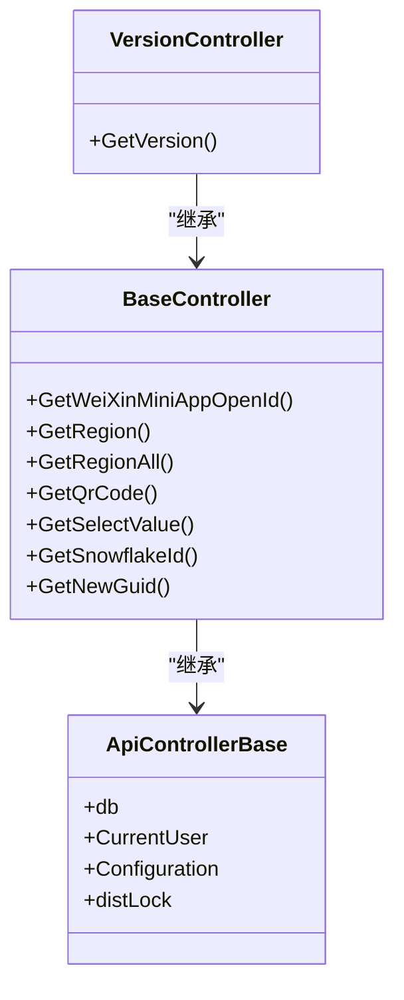
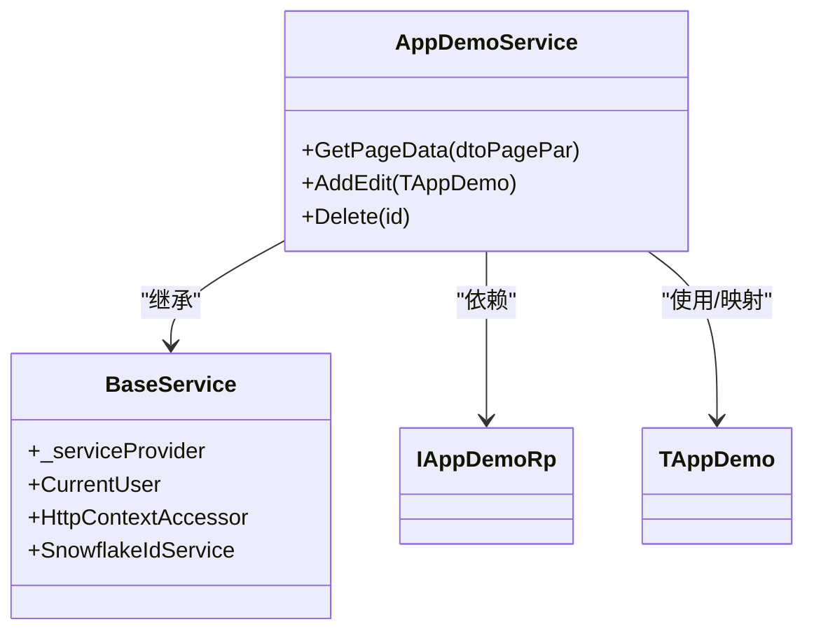
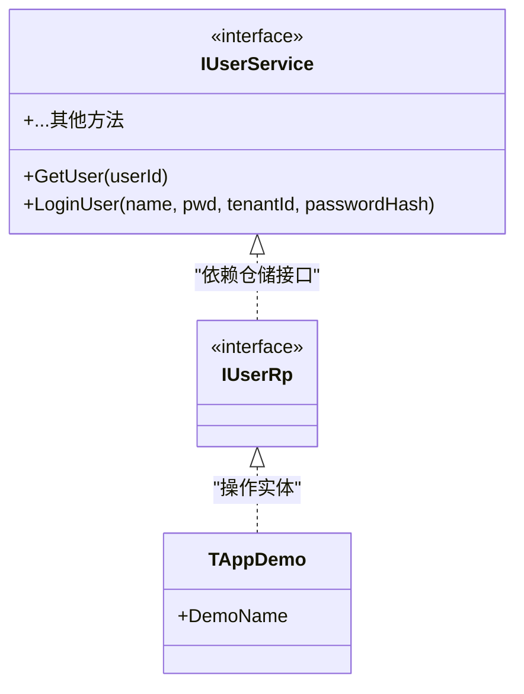
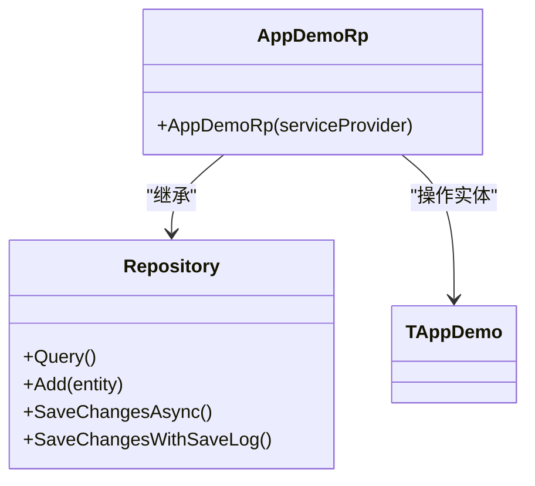
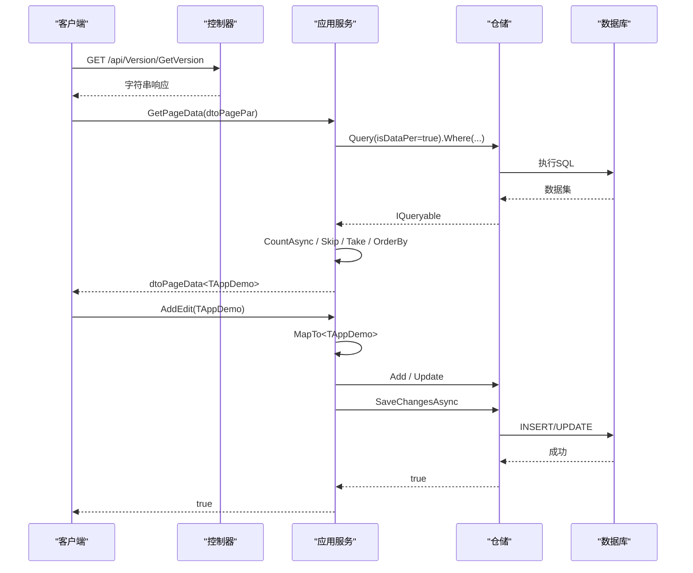
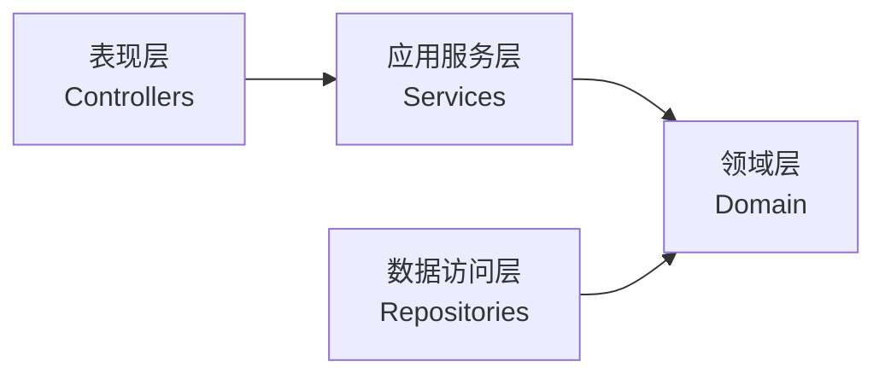

# 分层设计

<cite>
**本文引用的文件**
- [VersionController.cs](file://App/WebApi/Controllers/v1/VersionController.cs)
- [BaseController.cs](file://Kevin/Kevin.Web.Basics/Controllers/BaseController.cs)
- [ApiControllerBase.cs](file://Kevin/Kevin.Web.Basics/Controllers/ApiControllerBase.cs)
- [AppDemoService.cs](file://App/Application/Services/v1/AppDemoService.cs)
- [BaseService.cs](file://Kevin/Application/Services/BaseService.cs)
- [TAppDemo.cs](file://App/Domain/Entities/TAppDemo.cs)
- [IUserRp.cs](file://Kevin/Domain/Interfaces/IRepositories/IUserRp.cs)
- [IUserService.cs](file://Kevin/Domain/Interfaces/IServices/IUserService.cs)
- [AppDemoRp.cs](file://App/RepositorieRps/Repositories/v1/AppDemoRp.cs)
</cite>

## 目录
1. [简介](#简介)
2. [项目结构](#项目结构)
3. [核心组件](#核心组件)
4. [架构总览](#架构总览)
5. [详细组件分析](#详细组件分析)
6. [依赖关系分析](#依赖关系分析)
7. [性能考虑](#性能考虑)
8. [故障排查指南](#故障排查指南)
9. [结论](#结论)
10. [附录](#附录)

## 简介
本文件为 NetCoreKevin 框架的分层设计文档，围绕四层架构进行系统化说明：表现层（Controllers）、应用服务层（Services）、领域层（Domain）、数据访问层（Repositories）。重点阐述每层的职责边界、接口设计与依赖方向，并通过具体示例展示跨层协作模式，包括DTO转换、异常处理、事务管理等横切关注点的处理方式。

## 项目结构
- 表现层（WebApi）：负责HTTP请求解析、路由与响应格式化，位于 App/WebApi/Controllers 与 Kevin/Kevin.Web.Basics/Controllers。
- 应用服务层（Application）：编排业务用例、协调领域对象与仓储，位于 App/Application/Services 与 Kevin/Application/Services。
- 领域层（Domain）：定义实体、领域接口与共享类型，位于 App/Domain 与 Kevin/Domain。
- 数据访问层（Repositories）：封装持久化操作，位于 App/RepositorieRps/Repositories 与 Kevin/RepositorieRps/Repositories。

图表来源
- [VersionController.cs:1-25](file://App/WebApi/Controllers/v1/VersionController.cs#L1-L25)
- [BaseController.cs:1-147](file://Kevin/Kevin.Web.Basics/Controllers/BaseController.cs#L1-L147)
- [ApiControllerBase.cs:1-22](file://Kevin/Kevin.Web.Basics/Controllers/ApiControllerBase.cs#L1-L22)
- [AppDemoService.cs:1-84](file://App/Application/Services/v1/AppDemoService.cs#L1-L84)
- [BaseService.cs:1-41](file://Kevin/Application/Services/BaseService.cs#L1-L41)
- [TAppDemo.cs:1-23](file://App/Domain/Entities/TAppDemo.cs#L1-L23)
- [IUserRp.cs:1-11](file://Kevin/Domain/Interfaces/IRepositories/IUserRp.cs#L1-L11)
- [IUserService.cs:1-175](file://Kevin/Domain/Interfaces/IServices/IUserService.cs#L1-L175)
- [AppDemoRp.cs:1-14](file://App/RepositorieRps/Repositories/v1/AppDemoRp.cs#L1-L14)

章节来源
- [VersionController.cs:1-25](file://App/WebApi/Controllers/v1/VersionController.cs#L1-L25)
- [BaseController.cs:1-147](file://Kevin/Kevin.Web.Basics/Controllers/BaseController.cs#L1-L147)
- [ApiControllerBase.cs:1-22](file://Kevin/Kevin.Web.Basics/Controllers/ApiControllerBase.cs#L1-L22)
- [AppDemoService.cs:1-84](file://App/Application/Services/v1/AppDemoService.cs#L1-L84)
- [BaseService.cs:1-41](file://Kevin/Application/Services/BaseService.cs#L1-L41)
- [TAppDemo.cs:1-23](file://App/Domain/Entities/TAppDemo.cs#L1-L23)
- [IUserRp.cs:1-11](file://Kevin/Domain/Interfaces/IRepositories/IUserRp.cs#L1-L11)
- [IUserService.cs:1-175](file://Kevin/Domain/Interfaces/IServices/IUserService.cs#L1-L175)
- [AppDemoRp.cs:1-14](file://App/RepositorieRps/Repositories/v1/AppDemoRp.cs#L1-L14)

## 核心组件
- 表现层
  - 控制器基类提供统一的上下文、配置、分布式锁等能力；业务控制器继承并暴露API。
  - 版本控制器演示了路由、版本控制与权限注解的使用。
- 应用服务层
  - 基础服务注入当前用户、雪花ID等服务，供各业务服务复用。
  - 业务服务编排用例，调用仓储完成CRUD，并进行DTO映射与异常处理。
- 领域层
  - 实体定义表结构与字段约束；领域接口抽象仓储与服务契约。
- 数据访问层
  - 仓储实现基于通用Repository，提供查询、新增、更新、删除与保存变更。

章节来源
- [ApiControllerBase.cs:1-22](file://Kevin/Kevin.Web.Basics/Controllers/ApiControllerBase.cs#L1-L22)
- [BaseController.cs:1-147](file://Kevin/Kevin.Web.Basics/Controllers/BaseController.cs#L1-L147)
- [VersionController.cs:1-25](file://App/WebApi/Controllers/v1/VersionController.cs#L1-L25)
- [BaseService.cs:1-41](file://Kevin/Application/Services/BaseService.cs#L1-L41)
- [AppDemoService.cs:1-84](file://App/Application/Services/v1/AppDemoService.cs#L1-L84)
- [TAppDemo.cs:1-23](file://App/Domain/Entities/TAppDemo.cs#L1-L23)
- [IUserRp.cs:1-11](file://Kevin/Domain/Interfaces/IRepositories/IUserRp.cs#L1-L11)
- [IUserService.cs:1-175](file://Kevin/Domain/Interfaces/IServices/IUserService.cs#L1-L175)
- [AppDemoRp.cs:1-14](file://App/RepositorieRps/Repositories/v1/AppDemoRp.cs#L1-L14)

## 架构总览
下图展示了从HTTP请求到数据持久化的完整调用链，以及各层之间的依赖方向。

图表来源
- [VersionController.cs:1-25](file://App/WebApi/Controllers/v1/VersionController.cs#L1-L25)
- [ApiControllerBase.cs:1-22](file://Kevin/Kevin.Web.Basics/Controllers/ApiControllerBase.cs#L1-L22)
- [AppDemoService.cs:1-84](file://App/Application/Services/v1/AppDemoService.cs#L1-L84)
- [AppDemoRp.cs:1-14](file://App/RepositorieRps/Repositories/v1/AppDemoRp.cs#L1-L14)
- [TAppDemo.cs:1-23](file://App/Domain/Entities/TAppDemo.cs#L1-L23)

## 详细组件分析

### 表现层（Controllers）
- 职责边界
  - 接收HTTP请求，参数校验与绑定，调用应用服务，统一返回格式。
  - 通过基础控制器获取当前用户、配置、数据库上下文与分布式锁等横切能力。
- 关键实现
  - 版本控制器演示了路由、版本控制与跳过授权的场景。
  - 基础控制器提供通用API（如地区级联、二维码生成、雪花ID等）。
- 依赖方向
  - 仅依赖应用服务接口与基础能力，不直接访问仓储或实体。

图表来源
- [ApiControllerBase.cs:1-22](file://Kevin/Kevin.Web.Basics/Controllers/ApiControllerBase.cs#L1-L22)
- [BaseController.cs:1-147](file://Kevin/Kevin.Web.Basics/Controllers/BaseController.cs#L1-L147)
- [VersionController.cs:1-25](file://App/WebApi/Controllers/v1/VersionController.cs#L1-L25)

章节来源
- [VersionController.cs:1-25](file://App/WebApi/Controllers/v1/VersionController.cs#L1-L25)
- [BaseController.cs:1-147](file://Kevin/Kevin.Web.Basics/Controllers/BaseController.cs#L1-L147)
- [ApiControllerBase.cs:1-22](file://Kevin/Kevin.Web.Basics/Controllers/ApiControllerBase.cs#L1-L22)

### 应用服务层（Services）
- 职责边界
  - 编排用例：读取/写入领域对象、组合多个仓储操作、处理业务规则。
  - 负责DTO与实体之间的映射、分页、排序、异常抛出。
- 关键实现
  - 基础服务提供当前用户、雪花ID等通用能力。
  - 业务服务演示了分页查询、新增/编辑、软删除与异常处理。
- 依赖方向
  - 依赖领域实体与仓储接口，不感知UI细节。

图表来源
- [BaseService.cs:1-41](file://Kevin/Application/Services/BaseService.cs#L1-L41)
- [AppDemoService.cs:1-84](file://App/Application/Services/v1/AppDemoService.cs#L1-L84)
- [TAppDemo.cs:1-23](file://App/Domain/Entities/TAppDemo.cs#L1-L23)

章节来源
- [BaseService.cs:1-41](file://Kevin/Application/Services/BaseService.cs#L1-L41)
- [AppDemoService.cs:1-84](file://App/Application/Services/v1/AppDemoService.cs#L1-L84)

### 领域层（Domain）
- 职责边界
  - 定义实体模型、领域接口与共享类型，承载核心业务语义。
  - 不包含基础设施细节（如EF配置、外部服务调用）。
- 关键实现
  - 实体包含表名、字段长度与描述等元数据。
  - 领域接口抽象仓储与服务契约，便于替换实现与测试。

图表来源
- [TAppDemo.cs:1-23](file://App/Domain/Entities/TAppDemo.cs#L1-L23)
- [IUserRp.cs:1-11](file://Kevin/Domain/Interfaces/IRepositories/IUserRp.cs#L1-L11)
- [IUserService.cs:1-175](file://Kevin/Domain/Interfaces/IServices/IUserService.cs#L1-L175)

章节来源
- [TAppDemo.cs:1-23](file://App/Domain/Entities/TAppDemo.cs#L1-L23)
- [IUserRp.cs:1-11](file://Kevin/Domain/Interfaces/IRepositories/IUserRp.cs#L1-L11)
- [IUserService.cs:1-175](file://Kevin/Domain/Interfaces/IServices/IUserService.cs#L1-L175)

### 数据访问层（Repositories）
- 职责边界
  - 封装对数据库的增删改查，屏蔽ORM细节。
  - 提供统一查询入口与保存变更方法。
- 关键实现
  - 仓储实现继承通用Repository，按实体维度组织。
- 依赖方向
  - 依赖领域实体，不依赖上层服务或控制器。

图表来源
- [AppDemoRp.cs:1-14](file://App/RepositorieRps/Repositories/v1/AppDemoRp.cs#L1-L14)
- [TAppDemo.cs:1-23](file://App/Domain/Entities/TAppDemo.cs#L1-L23)

章节来源
- [AppDemoRp.cs:1-14](file://App/RepositorieRps/Repositories/v1/AppDemoRp.cs#L1-L14)
- [TAppDemo.cs:1-23](file://App/Domain/Entities/TAppDemo.cs#L1-L23)

### 协作流程示例：分页查询与新增/编辑

图表来源
- [VersionController.cs:1-25](file://App/WebApi/Controllers/v1/VersionController.cs#L1-L25)
- [AppDemoService.cs:1-84](file://App/Application/Services/v1/AppDemoService.cs#L1-L84)
- [AppDemoRp.cs:1-14](file://App/RepositorieRps/Repositories/v1/AppDemoRp.cs#L1-L14)

## 依赖关系分析
- 依赖方向
  - 表现层 → 应用服务层
  - 应用服务层 → 领域层（实体与接口）
  - 数据访问层 → 领域层（实体）
- 耦合与内聚
  - 通过接口隔离仓储与服务，降低耦合度。
  - 基础服务与基础控制器提升内聚性，减少重复代码。
- 循环依赖
  - 未见循环引用；仓储仅依赖实体，服务依赖仓储接口与实体。

图表来源
- [IUserService.cs:1-175](file://Kevin/Domain/Interfaces/IServices/IUserService.cs#L1-L175)
- [IUserRp.cs:1-11](file://Kevin/Domain/Interfaces/IRepositories/IUserRp.cs#L1-L11)
- [AppDemoService.cs:1-84](file://App/Application/Services/v1/AppDemoService.cs#L1-L84)
- [AppDemoRp.cs:1-14](file://App/RepositorieRps/Repositories/v1/AppDemoRp.cs#L1-L14)

## 性能考虑
- 查询优化
  - 在服务层使用延迟查询（Skip/Take/OrderBy）以减少内存占用。
  - 合理使用索引与投影，避免全表扫描与多余列加载。
- 分页策略
  - 通过dtoPagePar传递页码与大小，在服务层计算skip与take。
- 并发与一致性
  - 结合分布式锁与事务范围确保高并发下的数据一致性。
- 缓存
  - 对热点只读数据可引入缓存层，降低数据库压力。

## 故障排查指南
- 常见异常
  - 数据不存在或已删除时抛出友好异常，便于前端提示。
- 日志与追踪
  - 利用基础控制器与服务的上下文信息记录请求轨迹。
- 事务管理
  - 在需要原子性的多步操作中，使用事务范围或仓储提供的保存方法确保一致性。
- 定位步骤
  - 检查控制器入参与路由是否正确。
  - 检查服务层是否进行了必要的存在性校验与异常抛出。
  - 检查仓储查询条件与数据库索引是否合理。

章节来源
- [AppDemoService.cs:1-84](file://App/Application/Services/v1/AppDemoService.cs#L1-L84)
- [BaseController.cs:1-147](file://Kevin/Kevin.Web.Basics/Controllers/BaseController.cs#L1-L147)

## 结论
NetCoreKevin 采用清晰的分层架构，职责边界明确、依赖方向单向，有利于扩展与维护。通过接口抽象与基础组件复用，实现了良好的内聚性与低耦合。建议在后续开发中继续遵循该分层原则，完善DTO规范、异常体系与事务边界，以提升系统的可维护性与稳定性。

## 附录
- 术语
  - DTO：数据传输对象，用于层间数据传递。
  - 实体：领域模型，表示业务概念与状态。
  - 仓储：数据访问抽象，封装持久化逻辑。
- 最佳实践
  - 控制器保持薄，复杂逻辑下沉至服务层。
  - 服务层专注用例编排，避免直接操作数据库。
  - 领域层保持纯净，不依赖基础设施。
  - 仓储层聚焦数据访问，提供一致的查询与保存接口。