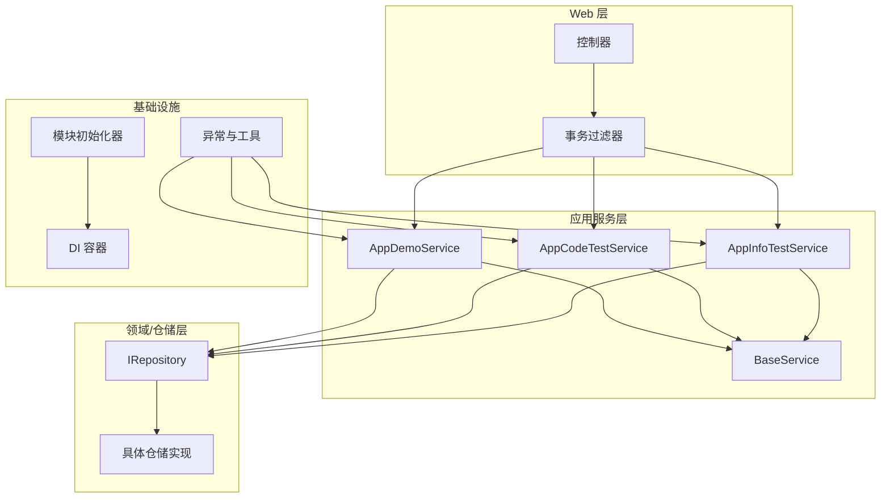
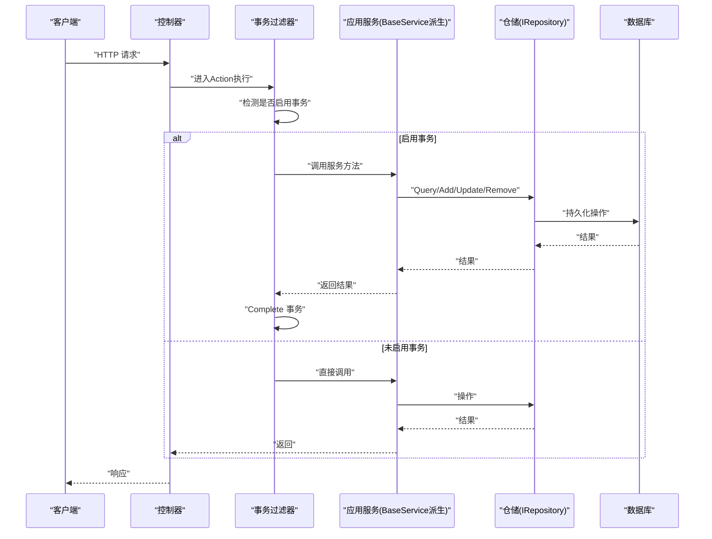
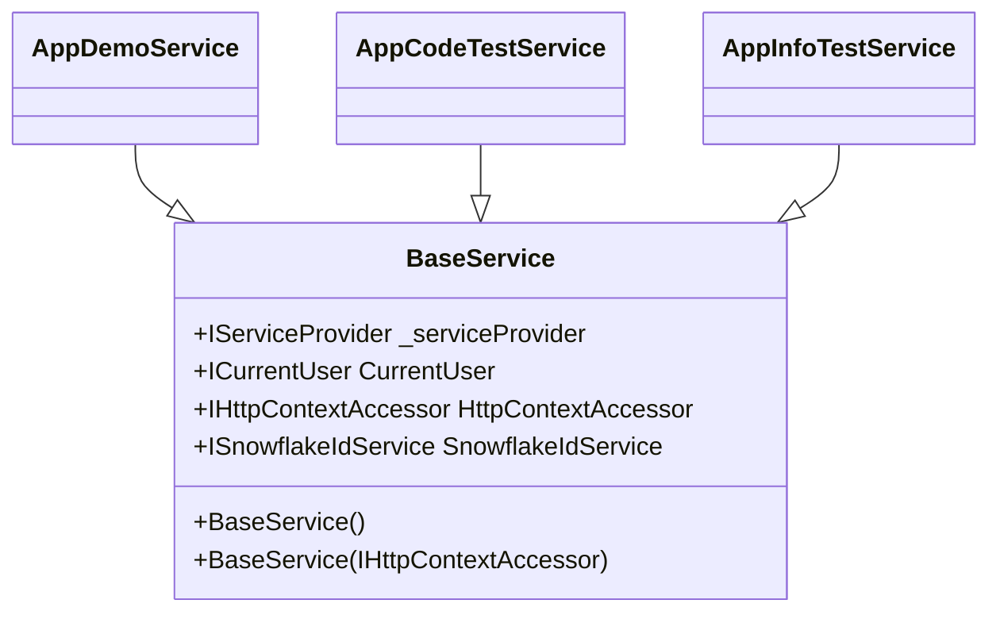
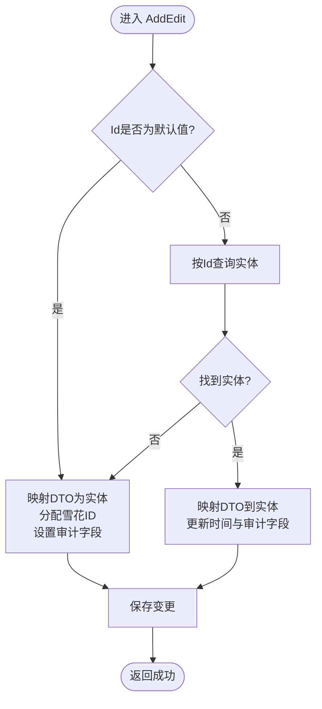
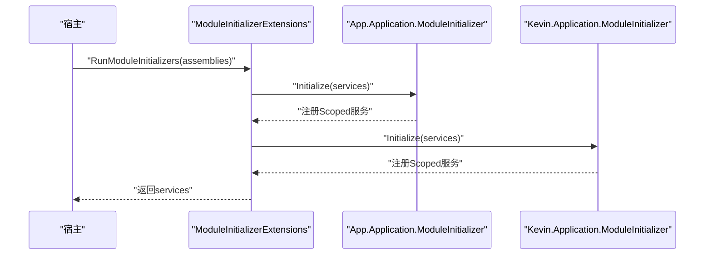
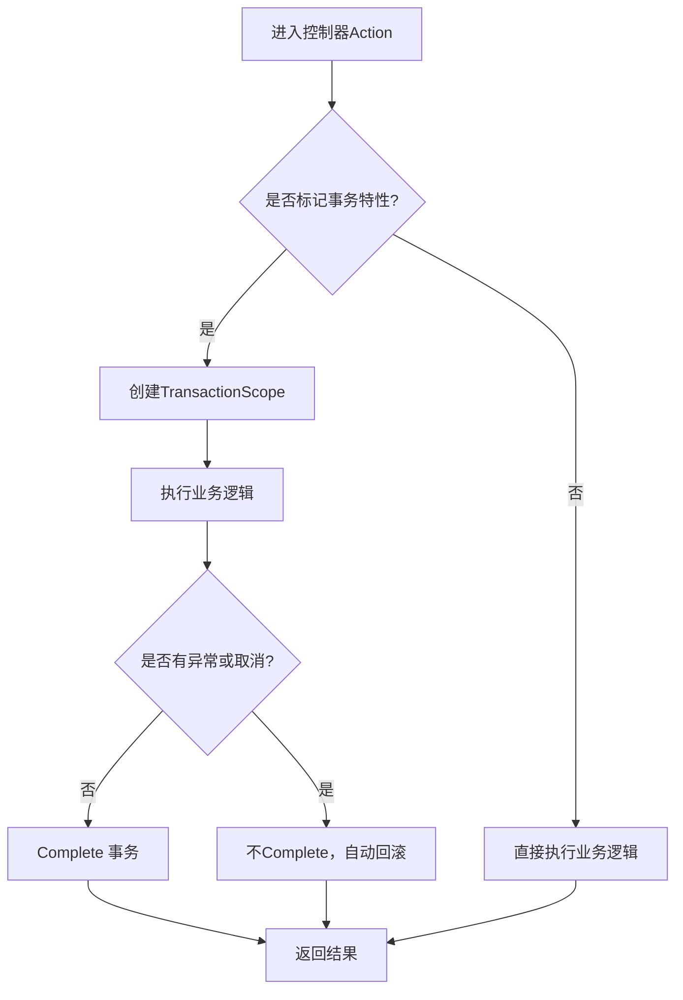
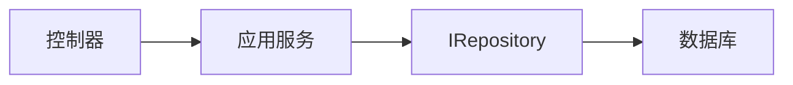
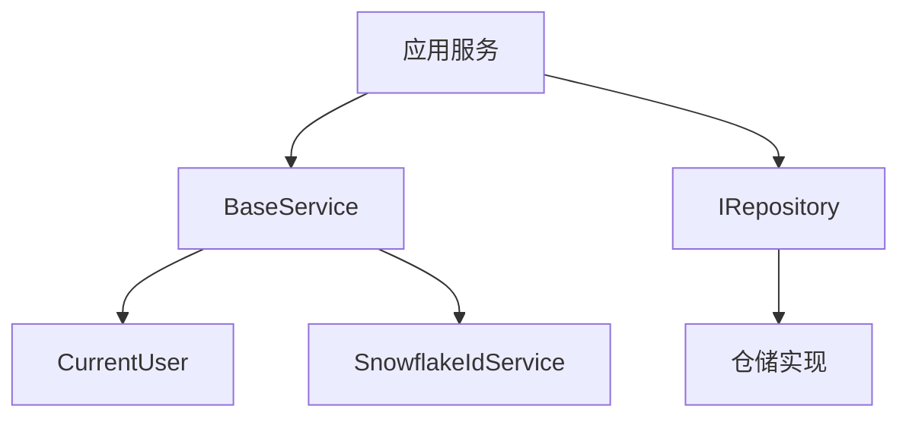

# 应用服务层设计

<cite>
**本文引用的文件**
- [BaseService.cs](file://Kevin/Application/Services/BaseService.cs)
- [AppDemoService.cs](file://App/Application/Services/v1/AppDemoService.cs)
- [AppCodeTestService.cs](file://App/Application/Services/v1/AppCodeTestService.cs)
- [AppInfoTestService.cs](file://App/Application/Services/v1/AppInfoTest/AppInfoTestService.cs)
- [ModuleInitializer.cs（应用模块）](file://App/Application/ModuleInitializer.cs)
- [ModuleInitializer.cs（核心应用模块）](file://Kevin/Application/ModuleInitializer.cs)
- [IModuleInitializer.cs](file://Kevin/kevin.Module/kevin.Ioc/TieredServiceRegistration/IModuleInitializer.cs)
- [ModuleInitializerExtensions.cs](file://Kevin/kevin.Module/kevin.Ioc/TieredServiceRegistration/ModuleInitializerExtensions.cs)
- [TransactionScopeFilter.cs](file://Kevin/ Kevin.Web.Basics/Filters/TransactionScope/TransactionScopeFilter.cs)
- [IRepository<T,TId>.cs](file://Kevin/kevin.Share/Interfaces/IRepository`.cs)
- [IBaseRepository.cs](file://Kevin/kevin.Share/Interfaces/IBaseRepository.cs)
- [ObjectExtension.cs](file://Kevin/kevin.Module/Kevin.Common/Extension/ObjectExtension.cs)
- [UserFriendlyException.cs](file://Kevin/kevin.Module/Kevin.Common/App/Exceptions/UserFriendlyException.cs)
</cite>

## 目录
1. [简介](#简介)
2. [项目结构](#项目结构)
3. [核心组件](#核心组件)
4. [架构总览](#架构总览)
5. [详细组件分析](#详细组件分析)
6. [依赖关系分析](#依赖关系分析)
7. [性能考量](#性能考量)
8. [故障排查指南](#故障排查指南)
9. [结论](#结论)
10. [附录](#附录)

## 简介
本文件面向 NetCoreKevin 框架的应用服务层，系统化阐述其职责边界与设计模式。重点覆盖：
- BaseService 基类的通用能力与生命周期管理
- 服务注册、依赖注入与模块化装配
- 事务处理与异常处理机制
- 领域对象协调、DTO 转换与数据验证
- 服务层与领域层、数据访问层的交互模式
- 单元测试与集成测试的最佳实践

## 项目结构
应用服务层位于 App.Application 与 Kevin.Application 两个模块中，采用分层与模块化组织：
- 应用服务实现位于 App/Application/Services/v1，继承自 BaseService，并对接仓储接口
- 核心应用服务与公共能力位于 Kevin/Application/Services
- 服务注册通过各模块的 ModuleInitializer 完成，统一由 IModuleInitializer 扩展方法扫描并初始化
- 数据访问通过 IRepository<T, TId> 抽象，具体实现在 RepositorieRps 层
- Web 层通过过滤器提供基于特性的事务边界

图表来源
- [ModuleInitializerExtensions.cs:15-34](file://Kevin/kevin.Module/kevin.Ioc/TieredServiceRegistration/ModuleInitializerExtensions.cs#L15-L34)
- [ModuleInitializer.cs（应用模块）:12-19](file://App/Application/ModuleInitializer.cs#L12-L19)
- [ModuleInitializer.cs（核心应用模块）:17-27](file://Kevin/Application/ModuleInitializer.cs#L17-L27)
- [TransactionScopeFilter.cs:15-44](file://Kevin/ Kevin.Web.Basics/Filters/TransactionScope/TransactionScopeFilter.cs#L15-L44)
- [IRepository<T,TId>.cs:11-36](file://Kevin/kevin.Share/Interfaces/IRepository`.cs#L11-L36)

章节来源
- [ModuleInitializer.cs（应用模块）:12-19](file://App/Application/ModuleInitializer.cs#L12-L19)
- [ModuleInitializer.cs（核心应用模块）:17-27](file://Kevin/Application/ModuleInitializer.cs#L17-L27)
- [ModuleInitializerExtensions.cs:15-34](file://Kevin/kevin.Module/kevin.Ioc/TieredServiceRegistration/ModuleInitializerExtensions.cs#L15-L34)

## 核心组件
- BaseService：为所有应用服务提供当前用户上下文、雪花ID生成、HTTP 上下文访问等通用能力；在构造函数中从 HttpContext.RequestServices 解析依赖，保证请求级作用域一致性。
- 应用服务示例：AppDemoService、AppCodeTestService、AppInfoTestService 展示统一的 CRUD 编排模式：分页查询、新增/编辑、逻辑删除，以及 DTO 到实体映射、租户与创建者信息填充。
- 模块初始化器：通过 IModuleInitializer 约定，集中注册 Scoped 服务，并将服务加入全局集合以便跨模块发现。
- 事务过滤器：基于 ActionFilter 对标注了特定特性的控制器动作自动包裹 TransactionScope，实现声明式事务。
- 仓储接口：IRepository<T, TId> 定义 Query、Add、Update、Remove、SaveChangesAsync 等基础操作，支持租户与数据权限过滤参数。
- 对象映射：ObjectExtension 提供 MapTo/MapToList 等扩展，简化 DTO 与实体之间的转换。
- 异常体系：UserFriendlyException 用于向调用方返回友好的业务异常信息。

章节来源
- [BaseService.cs:7-39](file://Kevin/Application/Services/BaseService.cs#L7-L39)
- [AppDemoService.cs:6-82](file://App/Application/Services/v1/AppDemoService.cs#L6-L82)
- [AppCodeTestService.cs:6-82](file://App/Application/Services/v1/AppCodeTestService.cs#L6-L82)
- [AppInfoTestService.cs:10-85](file://App/Application/Services/v1/AppInfoTest/AppInfoTestService.cs#L10-L85)
- [ModuleInitializer.cs（应用模块）:12-19](file://App/Application/ModuleInitializer.cs#L12-L19)
- [ModuleInitializer.cs（核心应用模块）:17-27](file://Kevin/Application/ModuleInitializer.cs#L17-L27)
- [TransactionScopeFilter.cs:15-44](file://Kevin/ Kevin.Web.Basics/Filters/TransactionScope/TransactionScopeFilter.cs#L15-L44)
- [IRepository<T,TId>.cs:11-36](file://Kevin/kevin.Share/Interfaces/IRepository`.cs#L11-L36)
- [ObjectExtension.cs:29-50](file://Kevin/kevin.Module/Kevin.Common/Extension/ObjectExtension.cs#L29-L50)
- [UserFriendlyException.cs:6-19](file://Kevin/kevin.Module/Kevin.Common/App/Exceptions/UserFriendlyException.cs#L6-L19)

## 架构总览
应用服务层作为“用例编排层”，负责：
- 接收来自控制器的输入（DTO），进行校验与转换
- 协调领域对象与仓储操作，组合多个步骤形成业务流程
- 使用 BaseService 提供的上下文与工具，确保多租户、审计字段、分布式ID等横切关注点一致
- 通过事务过滤器或显式 SaveChangesAsync 保障数据一致性
- 抛出 UserFriendlyException 表达业务规则违反

图表来源
- [TransactionScopeFilter.cs:15-44](file://Kevin/ Kevin.Web.Basics/Filters/TransactionScope/TransactionScopeFilter.cs#L15-L44)
- [IRepository<T,TId>.cs:11-36](file://Kevin/kevin.Share/Interfaces/IRepository`.cs#L11-L36)
- [AppDemoService.cs:14-82](file://App/Application/Services/v1/AppDemoService.cs#L14-L82)

## 详细组件分析

### BaseService 基类
- 职责边界
  - 提供 CurrentUser 上下文（用户ID、租户ID等）
  - 提供 SnowflakeIdService 分布式ID生成
  - 提供 HttpContextAccessor 以获取 RequestServices 解析依赖
- 生命周期管理
  - 构造时优先从 HttpContext.RequestServices 解析 Scoped 服务；非 HTTP 场景回退到 new 实例，保证可测试性与后台任务可用性
- 设计要点
  - 将横切关注点（用户、租户、ID）下沉到基类，减少重复代码
  - 通过构造函数注入 IHttpContextAccessor，避免静态访问

图表来源
- [BaseService.cs:7-39](file://Kevin/Application/Services/BaseService.cs#L7-L39)
- [AppDemoService.cs:6-12](file://App/Application/Services/v1/AppDemoService.cs#L6-L12)
- [AppCodeTestService.cs:6-12](file://App/Application/Services/v1/AppCodeTestService.cs#L6-L12)
- [AppInfoTestService.cs:10-16](file://App/Application/Services/v1/AppInfoTest/AppInfoTestService.cs#L10-L16)

章节来源
- [BaseService.cs:7-39](file://Kevin/Application/Services/BaseService.cs#L7-L39)

### 应用服务示例：AppDemoService / AppCodeTestService / AppInfoTestService
- 统一模式
  - 分页查询：使用 Repository.Query(isDataPer: true) 结合 Where/Skip/Take/OrderByDescending
  - 新增/编辑：根据 Id 判断新增或更新，填充 CreateTime/UpdateTime/CreateUserId/UpdateUserId/TenantId
  - 删除：逻辑删除，设置 IsDelete/DeleteTime，并通过 SaveChangesWithSaveLog 保存
  - 异常：找不到数据时抛出 UserFriendlyException
- DTO 转换：使用 ObjectExtension.MapTo 将入参 DTO 映射为领域实体
- 依赖注入：通过构造函数注入 IHttpContextAccessor 与对应仓储接口

图表来源
- [AppDemoService.cs:26-64](file://App/Application/Services/v1/AppDemoService.cs#L26-L64)
- [AppCodeTestService.cs:26-64](file://App/Application/Services/v1/AppCodeTestService.cs#L26-L64)
- [AppInfoTestService.cs:30-68](file://App/Application/Services/v1/AppInfoTest/AppInfoTestService.cs#L30-L68)
- [ObjectExtension.cs:29-50](file://Kevin/kevin.Module/Kevin.Common/Extension/ObjectExtension.cs#L29-L50)

章节来源
- [AppDemoService.cs:14-82](file://App/Application/Services/v1/AppDemoService.cs#L14-L82)
- [AppCodeTestService.cs:14-82](file://App/Application/Services/v1/AppCodeTestService.cs#L14-L82)
- [AppInfoTestService.cs:18-85](file://App/Application/Services/v1/AppInfoTest/AppInfoTestService.cs#L18-L85)

### 服务生命周期管理与模块化管理
- 服务生命周期
  - 应用服务通过 Scoped 生命周期注册，每个请求一个实例，保证线程安全与上下文隔离
- 模块初始化
  - 各模块实现 IModuleInitializer，在 Initialize 中批量注册 Scoped 服务，并写入全局集合
  - 通过 ModuleInitializerExtensions.RunModuleInitializers 扫描程序集并执行初始化

图表来源
- [ModuleInitializerExtensions.cs:15-34](file://Kevin/kevin.Module/kevin.Ioc/TieredServiceRegistration/ModuleInitializerExtensions.cs#L15-L34)
- [ModuleInitializer.cs（应用模块）:12-19](file://App/Application/ModuleInitializer.cs#L12-L19)
- [ModuleInitializer.cs（核心应用模块）:17-27](file://Kevin/Application/ModuleInitializer.cs#L17-L27)

章节来源
- [ModuleInitializer.cs（应用模块）:12-19](file://App/Application/ModuleInitializer.cs#L12-L19)
- [ModuleInitializer.cs（核心应用模块）:17-27](file://Kevin/Application/ModuleInitializer.cs#L17-L27)
- [ModuleInitializerExtensions.cs:15-34](file://Kevin/kevin.Module/kevin.Ioc/TieredServiceRegistration/ModuleInitializerExtensions.cs#L15-L34)

### 事务处理机制
- 基于特性的事务
  - 控制器动作若标注特定特性，则 TransactionScopeFilter 会为其开启 TransactionScope，并在无异常且未取消时提交
  - 超时时间默认配置为分钟级，可根据需要调整
- 服务层保存
  - 服务方法内部通过 SaveChangesAsync 或 SaveChangesWithSaveLog 提交更改
  - 当配合过滤器使用时，建议仅在必要时显式保存，避免重复提交

图表来源
- [TransactionScopeFilter.cs:15-44](file://Kevin/ Kevin.Web.Basics/Filters/TransactionScope/TransactionScopeFilter.cs#L15-L44)

章节来源
- [TransactionScopeFilter.cs:15-44](file://Kevin/ Kevin.Web.Basics/Filters/TransactionScope/TransactionScopeFilter.cs#L15-L44)

### 异常处理机制
- 业务异常
  - 使用 UserFriendlyException 表达业务规则违反（如数据不存在或已删除）
- 统一捕获
  - 建议在 Web 层通过全局异常处理器将业务异常转换为友好响应
- 最佳实践
  - 在服务层抛出自描述异常，避免向上层暴露技术细节
  - 记录必要日志，便于问题定位

章节来源
- [UserFriendlyException.cs:6-19](file://Kevin/kevin.Module/Kevin.Common/App/Exceptions/UserFriendlyException.cs#L6-L19)
- [AppDemoService.cs:58-60](file://App/Application/Services/v1/AppDemoService.cs#L58-L60)
- [AppDemoService.cs:76-79](file://App/Application/Services/v1/AppDemoService.cs#L76-L79)

### 依赖注入与服务注册方式
- 服务注册
  - 通过 IocHelper.BatchAddScopeds 批量注册实现了 IService/IBaseRepository 的服务/仓储为 Scoped
  - 同时写入 GlobalServices 全局集合，供其他模块发现
- 关键类型
  - IModuleInitializer：模块初始化契约
  - ModuleInitializerExtensions：扫描并执行模块初始化
  - CurrentUser：当前用户上下文，注册为 Scoped

章节来源
- [ModuleInitializer.cs（应用模块）:12-19](file://App/Application/ModuleInitializer.cs#L12-L19)
- [ModuleInitializer.cs（核心应用模块）:17-27](file://Kevin/Application/ModuleInitializer.cs#L17-L27)
- [ModuleInitializerExtensions.cs:15-34](file://Kevin/kevin.Module/kevin.Ioc/TieredServiceRegistration/ModuleInitializerExtensions.cs#L15-L34)

### 服务层与领域层、数据访问层的交互模式
- 服务层
  - 编排用例：校验、转换、调用仓储、组合结果
- 领域层
  - 实体与领域规则：通过仓储接口与领域模型交互
- 数据访问层
  - IRepository<T, TId> 提供统一的数据访问抽象，支持租户与数据权限过滤
- 典型流程
  - 控制器 -> 应用服务 -> 仓储 -> 数据库

图表来源
- [IRepository<T,TId>.cs:11-36](file://Kevin/kevin.Share/Interfaces/IRepository`.cs#L11-L36)
- [AppDemoService.cs:14-82](file://App/Application/Services/v1/AppDemoService.cs#L14-L82)

章节来源
- [IRepository<T,TId>.cs:11-36](file://Kevin/kevin.Share/Interfaces/IRepository`.cs#L11-L36)

### DTO 转换与数据验证
- DTO 转换
  - 使用 ObjectExtension.MapTo/MapToList 将 DTO 映射为实体，或将实体映射为 DTO
- 数据验证
  - 建议在服务入口对关键参数进行校验，不符合规则即抛出 UserFriendlyException
  - 复杂验证可封装为验证器或服务内校验方法

章节来源
- [ObjectExtension.cs:29-50](file://Kevin/kevin.Module/Kevin.Common/Extension/ObjectExtension.cs#L29-L50)
- [AppDemoService.cs:38-45](file://App/Application/Services/v1/AppDemoService.cs#L38-L45)

### 单元测试与集成测试最佳实践
- 单元测试
  - 针对 BaseService 派生服务，使用 Mock 仓储接口，验证新增/更新/删除分支逻辑
  - 模拟 CurrentUser 与 SnowflakeIdService，确保审计字段与ID生成路径正确
- 集成测试
  - 启动完整 DI 容器，使用真实或内存数据库，端到端验证事务与保存行为
  - 利用 TransactionScopeFilter 的行为，确认事务提交/回滚符合预期

[本节为通用指导，不直接分析具体文件]

## 依赖关系分析
- 组件耦合
  - 应用服务依赖 BaseService 与仓储接口，低耦合、高内聚
  - 仓储接口屏蔽底层实现细节，便于替换与测试
- 外部依赖
  - DI 容器：Microsoft.Extensions.DependencyInjection
  - 事务：System.Transactions.TransactionScope
  - 映射：Mapster/AutoMapper（通过 ObjectExtension）
- 循环依赖风险
  - 通过接口解耦与模块化初始化，降低循环依赖概率

图表来源
- [BaseService.cs:7-39](file://Kevin/Application/Services/BaseService.cs#L7-L39)
- [IRepository<T,TId>.cs:11-36](file://Kevin/kevin.Share/Interfaces/IRepository`.cs#L11-L36)

章节来源
- [BaseService.cs:7-39](file://Kevin/Application/Services/BaseService.cs#L7-L39)
- [IRepository<T,TId>.cs:11-36](file://Kevin/kevin.Share/Interfaces/IRepository`.cs#L11-L36)

## 性能考量
- 分页查询
  - 使用 Skip/Take 与 CountAsync 分离计数与取数，避免全表加载
- 数据权限
  - Query(isDataPer: true) 仅查询当前用户可见数据，减少不必要数据
- 事务范围
  - 合理划分事务边界，避免长事务影响并发
- 映射开销
  - 批量映射时使用 MapToList，减少重复配置与反射成本

[本节为通用指导，不直接分析具体文件]

## 故障排查指南
- 常见问题
  - 数据不存在或已删除：检查查询条件与逻辑删除标志，确认抛出 UserFriendlyException 的路径
  - 事务未提交：确认是否启用事务特性，或是否在 SaveChangesAsync 后出现异常导致回滚
  - 依赖解析失败：检查 ModuleInitializer 是否正确注册 Scoped 服务
- 诊断建议
  - 在服务方法入口记录关键参数与上下文
  - 在仓储层记录 SQL 或执行计划，辅助定位慢查询

章节来源
- [UserFriendlyException.cs:6-19](file://Kevin/kevin.Module/Kevin.Common/App/Exceptions/UserFriendlyException.cs#L6-L19)
- [TransactionScopeFilter.cs:15-44](file://Kevin/ Kevin.Web.Basics/Filters/TransactionScope/TransactionScopeFilter.cs#L15-L44)
- [ModuleInitializer.cs（应用模块）:12-19](file://App/Application/ModuleInitializer.cs#L12-L19)

## 结论
NetCoreKevin 的应用服务层通过 BaseService 统一横切关注点，结合模块化 DI 与声明式事务，形成了清晰的分层与稳定的交付能力。服务层专注于用例编排与领域协调，借助仓储接口与 DTO 映射工具，保持高内聚与低耦合。遵循本文的实践，可有效提升可维护性、可测试性与可扩展性。

## 附录
- 术语
  - 应用服务：用例编排层，协调领域与数据访问
  - 仓储：数据访问抽象，屏蔽持久化细节
  - 事务过滤器：基于特性的事务边界管理
- 参考路径
  - 服务实现：App/Application/Services/v1
  - 核心应用：Kevin/Application/Services
  - 仓储接口：Kevin/kevin.Share/Interfaces
  - 模块初始化：各模块 ModuleInitializer

[本节为补充说明，不直接分析具体文件]