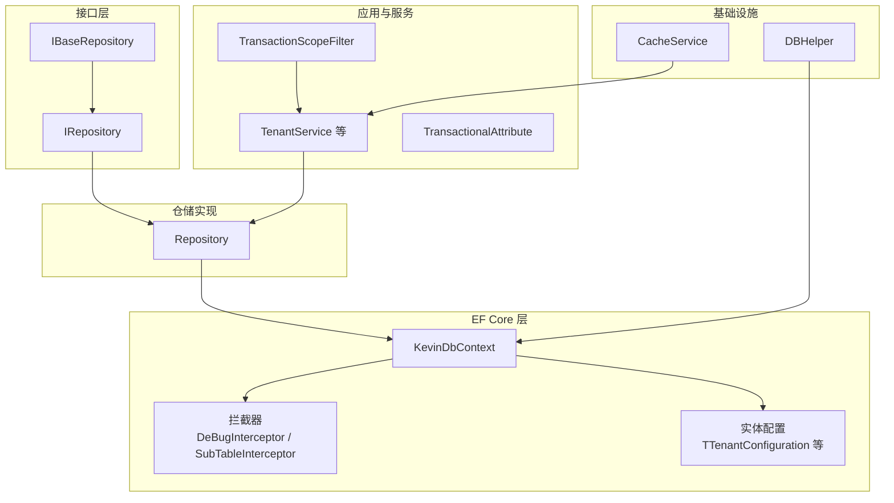
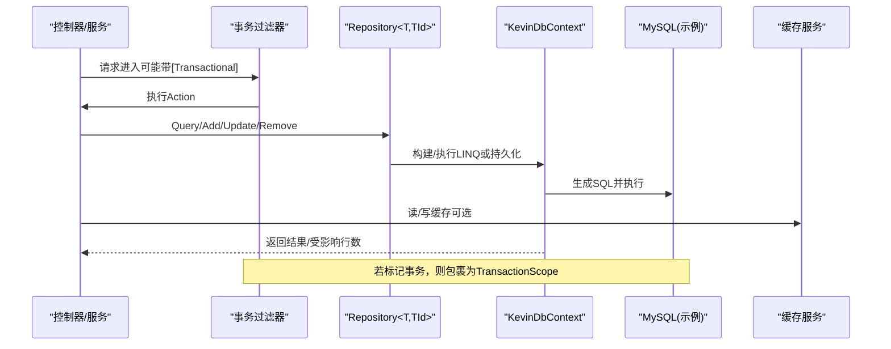
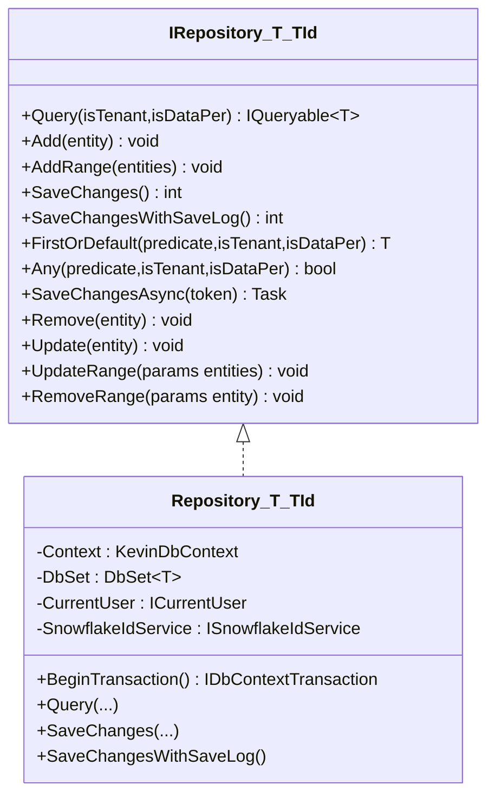
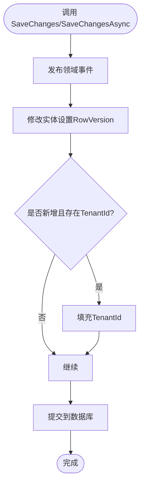
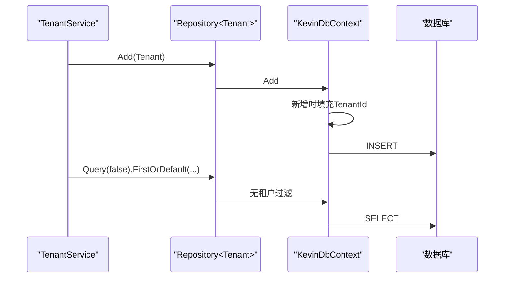
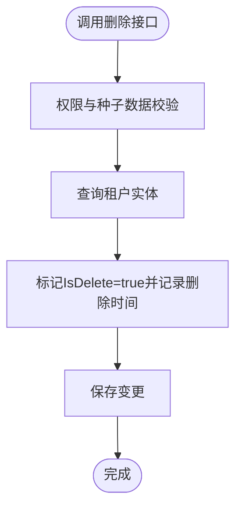
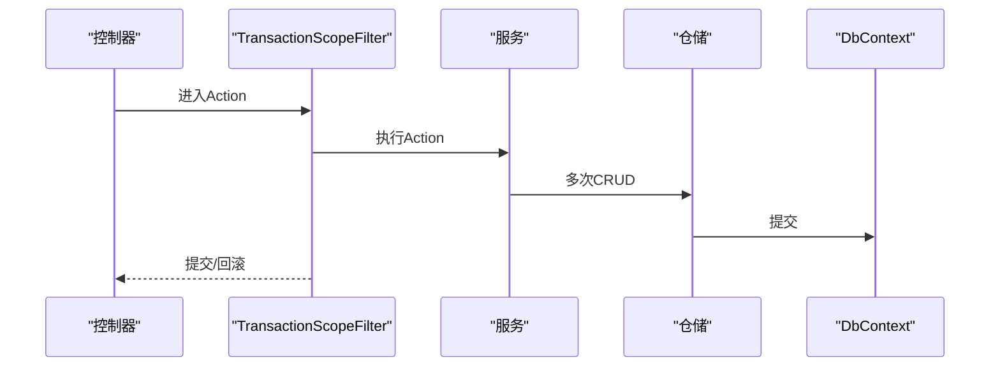
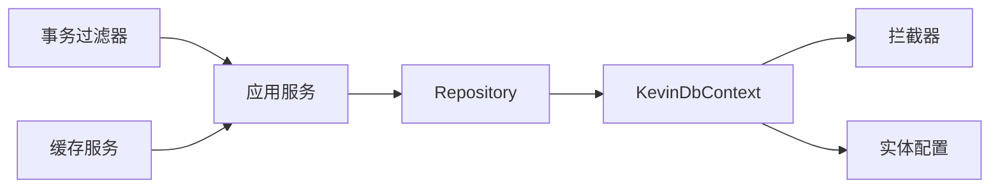

# 数据访问层设计

<cite>
**本文引用的文件**
- [IRepository`.cs](file://Kevin/kevin.Share/Interfaces/IRepository`.cs)
- [IBaseRepository.cs](file://Kevin/kevin.Share/Interfaces/IBaseRepository.cs)
- [Repository.cs](file://Kevin/Kevin.EntityFrameworkCore/_/Data/Repository.cs)
- [KevinDbContext.cs](file://Kevin/Kevin.EntityFrameworkCore/Database/KevinDbContext.cs)
- [SubTableInterceptor.cs](file://Kevin/Kevin.EntityFrameworkCore/Interceptors/SubTableInterceptor.cs)
- [TTenant.cs](file://Kevin/Domain/Entities/TTenant.cs)
- [TTenantConfiguration.cs](file://Kevin/Kevin.EntityFrameworkCore/Configuration/TTenantConfiguration.cs)
- [TenantService.cs](file://Kevin/Application/Services/TenantService.cs)
- [TransactionalAttribute.cs](file://Kevin/Kevin.Web.Basics/Filters/TransactionScope/Attribute/TransactionalAttribute.cs)
- [TransactionScopeFilter.cs](file://Kevin/Kevin.Web.Basics/Filters/TransactionScope/TransactionScopeFilter.cs)
- [CacheService.cs](file://Kevin/kevin.Module/kevin.Cache/Service/CacheService.cs)
- [DBHelper.cs](file://Kevin/kevin.Module/kevin.Common/Helper/DBHelper.cs)
</cite>

## 目录
1. [简介](#简介)
2. [项目结构](#项目结构)
3. [核心组件](#核心组件)
4. [架构总览](#架构总览)
5. [详细组件分析](#详细组件分析)
6. [依赖关系分析](#依赖关系分析)
7. [性能考虑](#性能考虑)
8. [故障排查指南](#故障排查指南)
9. [结论](#结论)
10. [附录](#附录)

## 简介
本文件面向 NetCoreKevin 框架的数据访问层，系统性阐述仓储模式实现、Entity Framework Core 配置与使用、CRUD 与复杂查询、事务管理、多租户隔离、软删除与审计日志、连接池与缓存策略、并发控制等主题。文档以代码级为依据，提供可视化图示与最佳实践建议，帮助读者快速理解并高效使用该框架的数据访问能力。

## 项目结构
数据访问相关代码主要分布在以下模块：
- 接口定义：kevin.Share/Interfaces（仓储接口）
- EF Core 上下文与配置：Kevin.EntityFrameworkCore/Database、Configuration、Interceptors
- 仓储基类实现：Kevin.EntityFrameworkCore/_/Data
- 领域实体与种子数据：Domain/Entities、BaseDatas
- 应用服务与事务过滤器：Application/Services、Web.Basics/Filters/TransactionScope
- 缓存与数据库工具：kevin.Module/kevin.Cache、kevin.Module/kevin.Common/Helper

图表来源
- [IRepository`.cs:11-36](file://Kevin/kevin.Share/Interfaces/IRepository`.cs#L11-L36)
- [Repository.cs:22-173](file://Kevin/Kevin.EntityFrameworkCore/_/Data/Repository.cs#L22-L173)
- [KevinDbContext.cs:83-133](file://Kevin/Kevin.EntityFrameworkCore/Database/KevinDbContext.cs#L83-L133)
- [SubTableInterceptor.cs:9-39](file://Kevin/Kevin.EntityFrameworkCore/Interceptors/SubTableInterceptor.cs#L9-L39)
- [TTenantConfiguration.cs:8-17](file://Kevin/Kevin.EntityFrameworkCore/Configuration/TTenantConfiguration.cs#L8-L17)
- [TenantService.cs:123-160](file://Kevin/Application/Services/TenantService.cs#L123-L160)
- [TransactionalAttribute.cs:1-10](file://Kevin/Kevin.Web.Basics/Filters/TransactionScope/Attribute/TransactionalAttribute.cs#L1-L10)
- [TransactionScopeFilter.cs:1-32](file://Kevin/Kevin.Web.Basics/Filters/TransactionScope/TransactionScopeFilter.cs#L1-L32)
- [CacheService.cs:88-196](file://Kevin/kevin.Module/kevin.Cache/Service/CacheService.cs#L88-L196)
- [DBHelper.cs:44-78](file://Kevin/kevin.Module/kevin.Common/Helper/DBHelper.cs#L44-L78)

章节来源
- [IRepository`.cs:11-36](file://Kevin/kevin.Share/Interfaces/IRepository`.cs#L11-L36)
- [Repository.cs:22-173](file://Kevin/Kevin.EntityFrameworkCore/_/Data/Repository.cs#L22-L173)
- [KevinDbContext.cs:83-133](file://Kevin/Kevin.EntityFrameworkCore/Database/KevinDbContext.cs#L83-L133)

## 核心组件
- 仓储接口 IRepository<T, TId>：定义通用查询、新增、批量操作、保存、删除、更新及异步保存等方法，支持租户过滤与数据权限过滤参数。
- 仓储基类 Repository<T, TId>：基于 EF Core 的 DbSet 实现 CRUD，封装租户与数据权限表达式注入，统一事务与保存入口。
- DbContext KevinDbContext：负责数据库连接、实体映射、全局配置（表名前缀、列名、索引、默认值）、领域事件发布、乐观并发、多租户字段填充、审计日志记录等。
- 拦截器：调试 SQL 拦截器与分表拦截器（可选启用）。
- 实体与配置：通过特性与 IEntityTypeConfiguration 完成表/列注释、种子数据注入等。
- 事务过滤器：基于 ActionFilter 在方法标注后自动开启分布式事务范围。
- 缓存与工具：分布式缓存包装与过期校验；原生 ADO.NET 辅助工具。

章节来源
- [IRepository`.cs:11-36](file://Kevin/kevin.Share/Interfaces/IRepository`.cs#L11-L36)
- [Repository.cs:22-173](file://Kevin/Kevin.EntityFrameworkCore/_/Data/Repository.cs#L22-L173)
- [KevinDbContext.cs:165-305](file://Kevin/Kevin.EntityFrameworkCore/Database/KevinDbContext.cs#L165-L305)
- [SubTableInterceptor.cs:9-39](file://Kevin/Kevin.EntityFrameworkCore/Interceptors/SubTableInterceptor.cs#L9-L39)
- [TTenantConfiguration.cs:8-17](file://Kevin/Kevin.EntityFrameworkCore/Configuration/TTenantConfiguration.cs#L8-L17)
- [TransactionalAttribute.cs:1-10](file://Kevin/Kevin.Web.Basics/Filters/TransactionScope/Attribute/TransactionalAttribute.cs#L1-L10)
- [TransactionScopeFilter.cs:1-32](file://Kevin/Kevin.Web.Basics/Filters/TransactionScope/TransactionScopeFilter.cs#L1-L32)
- [CacheService.cs:88-196](file://Kevin/kevin.Module/kevin.Cache/Service/CacheService.cs#L88-L196)
- [DBHelper.cs:44-78](file://Kevin/kevin.Module/kevin.Common/Helper/DBHelper.cs#L44-L78)

## 架构总览
下图展示从控制器到仓储再到 EF Core 的调用链，以及事务、缓存、审计等横切关注点。

图表来源
- [TransactionScopeFilter.cs:15-32](file://Kevin/Kevin.Web.Basics/Filters/TransactionScope/TransactionScopeFilter.cs#L15-L32)
- [Repository.cs:155-163](file://Kevin/Kevin.EntityFrameworkCore/_/Data/Repository.cs#L155-L163)
- [KevinDbContext.cs:83-133](file://Kevin/Kevin.EntityFrameworkCore/Database/KevinDbContext.cs#L83-L133)
- [CacheService.cs:88-196](file://Kevin/kevin.Module/kevin.Cache/Service/CacheService.cs#L88-L196)

## 详细组件分析

### 仓储模式：IRepository 与 Repository
- 接口职责
  - 查询：Query(isTenant, isDataPer) 返回 IQueryable，支持按当前租户与用户数据权限动态拼接条件。
  - 增删改：Add/Update/Remove 及其批量版本。
  - 保存：SaveChanges/SaveChangesAsync 与 SaveChangesWithSaveLog（带审计日志）。
  - 便捷查询：FirstOrDefault/Any 支持传入租户与权限开关。
- 基类实现要点
  - 通过 CurrentUser.TenantId 与 CurrentUser.UserId 动态构造过滤表达式。
  - 对 CreateUserId 做数据权限过滤（可配置）。
  - 统一事务入口 BeginTransaction，便于跨仓储事务。
  - 将保存委托至 DbContext，保证领域事件、乐观并发、多租户字段填充、审计日志等横切逻辑生效。

图表来源
- [IRepository`.cs:11-36](file://Kevin/kevin.Share/Interfaces/IRepository`.cs#L11-L36)
- [Repository.cs:22-173](file://Kevin/Kevin.EntityFrameworkCore/_/Data/Repository.cs#L22-L173)

章节来源
- [IRepository`.cs:11-36](file://Kevin/kevin.Share/Interfaces/IRepository`.cs#L11-L36)
- [Repository.cs:22-173](file://Kevin/Kevin.EntityFrameworkCore/_/Data/Repository.cs#L22-L173)

### Entity Framework Core 配置与使用
- 连接与驱动
  - 默认使用 MySQL 8.0.22，迁移历史表与迁移程序集可通过配置获取。
  - 支持切换其他数据库（注释中保留 SQL Server/SQLite/Npgsql 示例）。
- 实体映射与约定
  - 自动扫描带有 Table 特性的类型并注册为实体。
  - 统一表名前缀 t_ 与小写命名，列名小写，布尔映射 bit，Guid 映射 char(36)。
  - 根据配置为指定字段添加索引，设置默认值，写入表/列注释。
  - 关闭所有外键级联删除，避免误删。
- 领域事件与变更追踪
  - 在 SaveChanges/SaveChangesAsync 中发布领域事件（Add/Modified/Deleted）。
  - 修改时自动生成 RowVersion 用于乐观并发。
  - 新增时自动填充 TenantId（当存在且有效）。
- 审计日志
  - SaveChangesWithSaveLog 会对比旧值与新值，记录变更内容、IP、设备、操作人、租户等信息到系统日志表。
- 拦截器
  - DeBugInterceptor：调试 SQL。
  - SubTableInterceptor：按配置进行分表路由（可选启用）。

图表来源
- [KevinDbContext.cs:405-484](file://Kevin/Kevin.EntityFrameworkCore/Database/KevinDbContext.cs#L405-L484)
- [KevinDbContext.cs:525-583](file://Kevin/Kevin.EntityFrameworkCore/Database/KevinDbContext.cs#L525-L583)

章节来源
- [KevinDbContext.cs:83-133](file://Kevin/Kevin.EntityFrameworkCore/Database/KevinDbContext.cs#L83-L133)
- [KevinDbContext.cs:165-305](file://Kevin/Kevin.EntityFrameworkCore/Database/KevinDbContext.cs#L165-L305)
- [KevinDbContext.cs:405-484](file://Kevin/Kevin.EntityFrameworkCore/Database/KevinDbContext.cs#L405-L484)
- [KevinDbContext.cs:525-583](file://Kevin/Kevin.EntityFrameworkCore/Database/KevinDbContext.cs#L525-L583)
- [SubTableInterceptor.cs:9-39](file://Kevin/Kevin.EntityFrameworkCore/Interceptors/SubTableInterceptor.cs#L9-L39)

### 多租户数据隔离
- 租户上下文注入：DbContext 构造函数注入 CurrentUser，读取 TenantId。
- 写入侧隔离：新增实体自动填充 TenantId。
- 查询侧隔离：仓储 Query/FirstOrDefault/Any 根据 CurrentUser.TenantId 动态追加过滤条件。
- 种子数据：通过 TTenantConfiguration 注入初始租户数据。

图表来源
- [TenantService.cs:123-160](file://Kevin/Application/Services/TenantService.cs#L123-L160)
- [Repository.cs:63-121](file://Kevin/Kevin.EntityFrameworkCore/_/Data/Repository.cs#L63-L121)
- [KevinDbContext.cs:428-439](file://Kevin/Kevin.EntityFrameworkCore/Database/KevinDbContext.cs#L428-L439)
- [TTenantConfiguration.cs:8-17](file://Kevin/Kevin.EntityFrameworkCore/Configuration/TTenantConfiguration.cs#L8-L17)

章节来源
- [TenantService.cs:123-160](file://Kevin/Application/Services/TenantService.cs#L123-L160)
- [Repository.cs:63-121](file://Kevin/Kevin.EntityFrameworkCore/_/Data/Repository.cs#L63-L121)
- [KevinDbContext.cs:428-439](file://Kevin/Kevin.EntityFrameworkCore/Database/KevinDbContext.cs#L428-L439)
- [TTenantConfiguration.cs:8-17](file://Kevin/Kevin.EntityFrameworkCore/Configuration/TTenantConfiguration.cs#L8-L17)

### 软删除机制
- 业务层软删除：TenantService.DeleteAsync 将 IsDelete 置真并记录 DeleteTime，再保存。
- 仓储查询：默认查询通常不包含软删除过滤，可在具体仓储扩展 Where(e => !e.IsDelete) 或在 DbContext 中使用全局查询过滤器。

图表来源
- [TenantService.cs:129-151](file://Kevin/Application/Services/TenantService.cs#L129-L151)

章节来源
- [TenantService.cs:129-151](file://Kevin/Application/Services/TenantService.cs#L129-L151)

### 审计日志记录
- 触发点：SaveChangesWithSaveLog。
- 行为：对比修改前后值，记录变更详情、操作人、IP、设备、租户信息到系统日志表。
- 适用场景：关键主数据的变更审计。

章节来源
- [KevinDbContext.cs:525-583](file://Kevin/Kevin.EntityFrameworkCore/Database/KevinDbContext.cs#L525-L583)

### 事务管理
- 声明式事务：在控制器方法上标注 [Transactional]，由 TransactionScopeFilter 自动开启 TransactionScope。
- 编程式事务：仓储提供 BeginTransaction，配合 DbContext 的事务 API 使用。
- 注意：确保异步链路正确传播（已启用 AsyncFlow）。

图表来源
- [TransactionalAttribute.cs:1-10](file://Kevin/Kevin.Web.Basics/Filters/TransactionScope/Attribute/TransactionalAttribute.cs#L1-L10)
- [TransactionScopeFilter.cs:15-32](file://Kevin/Kevin.Web.Basics/Filters/TransactionScope/TransactionScopeFilter.cs#L15-L32)
- [Repository.cs:132-149](file://Kevin/Kevin.EntityFrameworkCore/_/Data/Repository.cs#L132-L149)

章节来源
- [TransactionalAttribute.cs:1-10](file://Kevin/Kevin.Web.Basics/Filters/TransactionScope/Attribute/TransactionalAttribute.cs#L1-L10)
- [TransactionScopeFilter.cs:15-32](file://Kevin/Kevin.Web.Basics/Filters/TransactionScope/TransactionScopeFilter.cs#L15-L32)
- [Repository.cs:132-149](file://Kevin/Kevin.EntityFrameworkCore/_/Data/Repository.cs#L132-L149)

### 数据迁移
- 迁移程序集：通过配置项 MigrationsAssembly 指定。
- 迁移历史表：统一命名为 __efmigrationshistory。
- 建议：在部署流程中执行迁移脚本或命令行工具，确保模型与数据库一致。

章节来源
- [KevinDbContext.cs:83-115](file://Kevin/Kevin.EntityFrameworkCore/Database/KevinDbContext.cs#L83-L115)

### 查询优化与性能调优
- 索引策略：通过配置 DBDefaultHasIndexFields 为常用查询字段自动创建索引。
- 分页与投影：在服务层使用 Select 仅选择必要字段，减少网络传输。
- 延迟加载：默认关闭，按需启用 UseLazyLoadingProxies，避免 N+1。
- 只读查询：使用 AsNoTracking 提升读取性能（可在仓储扩展方法中统一封装）。
- 批量操作：优先使用 AddRange/UpdateRange/RemoveRange 减少往返。
- 连接池：在连接字符串中配置最大连接数（如 Max Pool Size），结合应用并发度调整。

章节来源
- [KevinDbContext.cs:240-247](file://Kevin/Kevin.EntityFrameworkCore/Database/KevinDbContext.cs#L240-L247)
- [KevinDbContext.cs:125-131](file://Kevin/Kevin.EntityFrameworkCore/Database/KevinDbContext.cs#L125-L131)

### 缓存策略
- 分布式缓存：CacheService 提供 Set/Get 字符串与对象方法，内部序列化并附加过期时间戳，读取时校验过期。
- 使用建议：热点字典、配置、会话态数据适合缓存；注意缓存穿透与雪崩防护。

章节来源
- [CacheService.cs:88-196](file://Kevin/kevin.Module/kevin.Cache/Service/CacheService.cs#L88-L196)

### 并发控制
- 乐观锁：修改实体时自动更新 RowVersion 字段，可在仓储或服务层比较版本号以避免覆盖更新。
- 悲观锁：必要时可使用 EF 的 ForUpdate（数据库支持时）或外部分布式锁。

章节来源
- [KevinDbContext.cs:418-426](file://Kevin/Kevin.EntityFrameworkCore/Database/KevinDbContext.cs#L418-L426)
- [KevinDbContext.cs:461-468](file://Kevin/Kevin.EntityFrameworkCore/Database/KevinDbContext.cs#L461-L468)

## 依赖关系分析
- 低耦合：仓储接口与实现分离，DbContext 作为基础设施被仓储依赖。
- 横切关注点：事务、审计、领域事件、租户隔离通过 DbContext 与过滤器集中处理。
- 可扩展性：实体配置采用 IEntityTypeConfiguration，便于模块化维护。

图表来源
- [Repository.cs:22-173](file://Kevin/Kevin.EntityFrameworkCore/_/Data/Repository.cs#L22-L173)
- [KevinDbContext.cs:83-133](file://Kevin/Kevin.EntityFrameworkCore/Database/KevinDbContext.cs#L83-L133)
- [TransactionScopeFilter.cs:15-32](file://Kevin/Kevin.Web.Basics/Filters/TransactionScope/TransactionScopeFilter.cs#L15-L32)
- [CacheService.cs:88-196](file://Kevin/kevin.Module/kevin.Cache/Service/CacheService.cs#L88-L196)

章节来源
- [Repository.cs:22-173](file://Kevin/Kevin.EntityFrameworkCore/_/Data/Repository.cs#L22-L173)
- [KevinDbContext.cs:83-133](file://Kevin/Kevin.EntityFrameworkCore/Database/KevinDbContext.cs#L83-L133)

## 性能考虑
- 合理索引：利用 DBDefaultHasIndexFields 为高频查询字段建索引。
- 减少往返：批量插入/更新/删除。
- 只读优化：AsNoTracking、Select 投影。
- 连接池：根据并发与数据库资源调整最大连接数。
- 缓存：热点数据缓存，降低数据库压力。
- 懒加载：谨慎启用，避免 N+1 问题。

## 故障排查指南
- 连接失败：检查连接字符串与数据库驱动版本；确认迁移程序集路径正确。
- 查询异常：确认租户上下文是否正确注入；检查仓储查询参数 isTenant/isDataPer。
- 事务未生效：确认方法是否标注 [Transactional]，且过滤器已注册。
- 审计缺失：确认调用的是 SaveChangesWithSaveLog。
- 缓存异常：检查 Key 是否存在、序列化格式与过期时间。

章节来源
- [KevinDbContext.cs:83-133](file://Kevin/Kevin.EntityFrameworkCore/Database/KevinDbContext.cs#L83-L133)
- [Repository.cs:63-121](file://Kevin/Kevin.EntityFrameworkCore/_/Data/Repository.cs#L63-L121)
- [TransactionScopeFilter.cs:15-32](file://Kevin/Kevin.Web.Basics/Filters/TransactionScope/TransactionScopeFilter.cs#L15-L32)
- [KevinDbContext.cs:525-583](file://Kevin/Kevin.EntityFrameworkCore/Database/KevinDbContext.cs#L525-L583)
- [CacheService.cs:88-196](file://Kevin/kevin.Module/kevin.Cache/Service/CacheService.cs#L88-L196)

## 结论
NetCoreKevin 的数据访问层以仓储模式为核心，结合 EF Core 的强大能力，提供了多租户隔离、软删除、审计日志、乐观并发、事务管理等企业级特性。通过合理的索引、缓存与批量操作策略，可在保证一致性的同时获得良好性能。建议在业务层遵循“最小权限查询”“批量操作”“显式事务边界”的最佳实践，以获得稳定高效的系统表现。

## 附录
- 常见用法指引
  - CRUD 操作：通过仓储的 Add/Update/Remove 与 SaveChanges 系列方法完成。
  - 复杂查询：使用 Query 返回 IQueryable，在服务层组合条件与投影。
  - 事务：在控制器方法标注 [Transactional]，或使用仓储 BeginTransaction。
  - 迁移：配置 MigrationsAssembly，执行迁移命令。
  - 多租户：确保 CurrentUser 注入正确，仓储查询默认按租户过滤。
  - 审计：使用 SaveChangesWithSaveLog 记录变更。
  - 缓存：使用 CacheService 存取热点数据。
  - 直连数据库：使用 DBHelper 执行自定义 SQL。

章节来源
- [Repository.cs:54-173](file://Kevin/Kevin.EntityFrameworkCore/_/Data/Repository.cs#L54-L173)
- [TenantService.cs:123-160](file://Kevin/Application/Services/TenantService.cs#L123-L160)
- [TransactionalAttribute.cs:1-10](file://Kevin/Kevin.Web.Basics/Filters/TransactionScope/Attribute/TransactionalAttribute.cs#L1-L10)
- [TransactionScopeFilter.cs:15-32](file://Kevin/Kevin.Web.Basics/Filters/TransactionScope/TransactionScopeFilter.cs#L15-L32)
- [KevinDbContext.cs:83-133](file://Kevin/Kevin.EntityFrameworkCore/Database/KevinDbContext.cs#L83-L133)
- [CacheService.cs:88-196](file://Kevin/kevin.Module/kevin.Cache/Service/CacheService.cs#L88-L196)
- [DBHelper.cs:44-78](file://Kevin/kevin.Module/kevin.Common/Helper/DBHelper.cs#L44-L78)