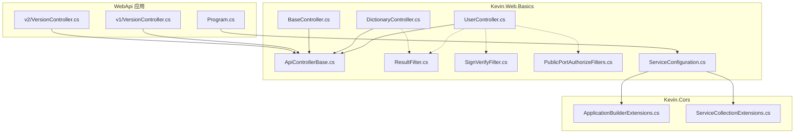
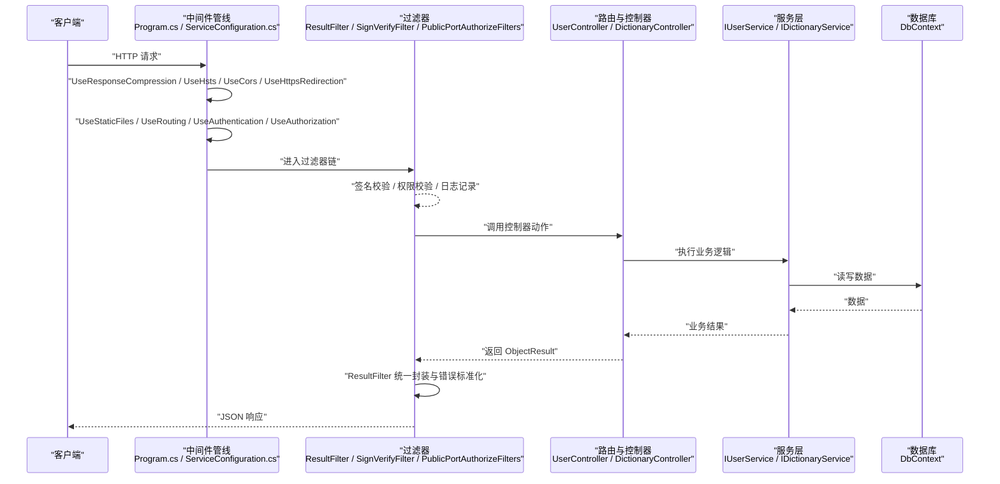
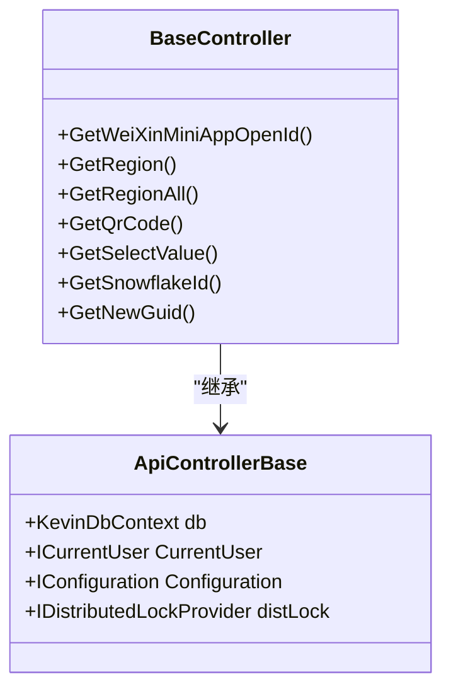
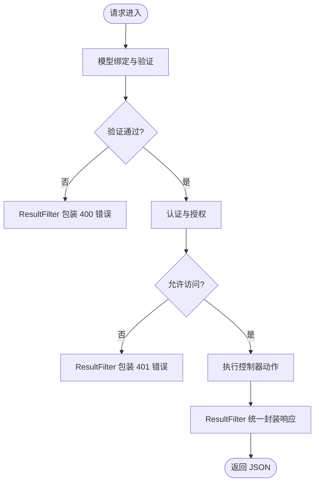
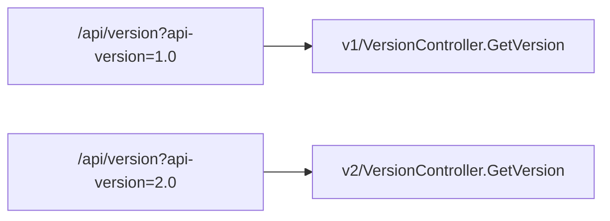
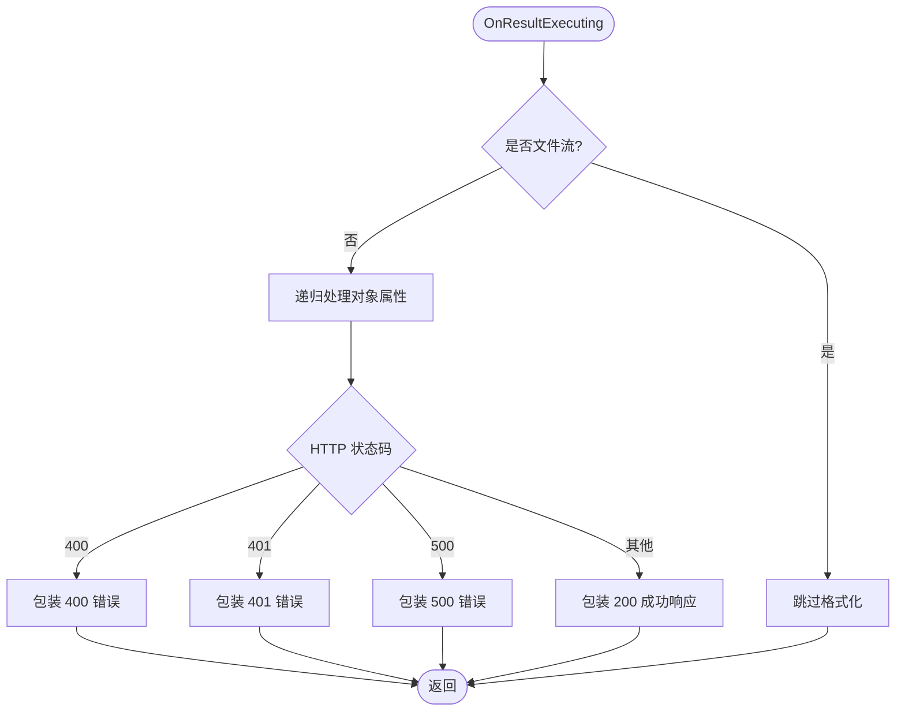
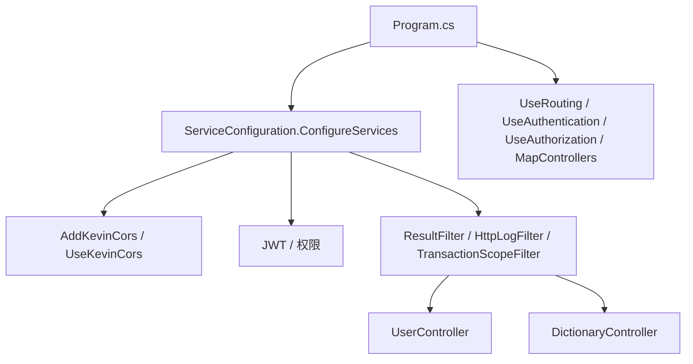
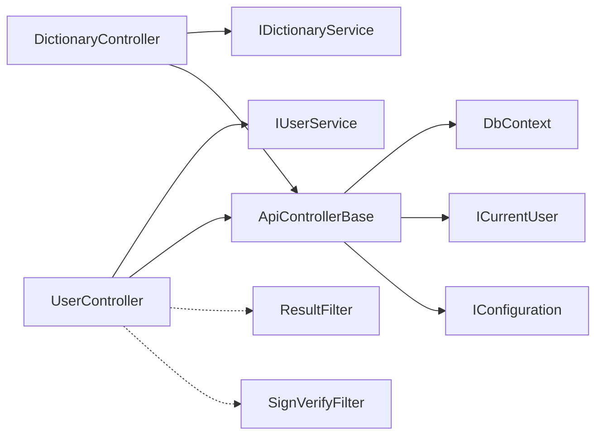

# 表现层设计

<cite>
**本文引用的文件**
- [ApiControllerBase.cs](file://Kevin/Kevin.Web.Basics/Controllers/ApiControllerBase.cs)
- [BaseController.cs](file://Kevin/Kevin.Web.Basics/Controllers/BaseController.cs)
- [UserController.cs](file://Kevin/Kevin.Web.Basics/Controllers/UserController.cs)
- [DictionaryController.cs](file://Kevin/Kevin.Web.Basics/Controllers/DictionaryController.cs)
- [VersionController (v1).cs](file://App/WebApi/Controllers/v1/VersionController.cs)
- [VersionController (v2).cs](file://App/WebApi/Controllers/v2/VersionController.cs)
- [ServiceConfiguration.cs](file://Kevin/Kevin.Web.Basics/Extensions/ServiceConfiguration.cs)
- [Program.cs](file://App/WebApi/Program.cs)
- [ResultFilter.cs](file://Kevin/Kevin.Web.Basics/Filters/ResultFilter.cs)
- [PublicPortAuthorizeFilters.cs](file://Kevin/Kevin.Web.Basics/Filters/PublicPortAuthorizeFilters.cs)
- [SignVerifyFilter.cs](file://Kevin/Kevin.Web.Basics/Filters/SignVerifyFilter.cs)
- [ApplicationBuilderExtensions.cs (CORS)](file://Kevin/kevin.Module/Kevin.Cors/ApplicationBuilderExtensions.cs)
- [ServiceCollectionExtensions.cs (CORS)](file://Kevin/kevin.Module/Kevin.Cors/ServiceCollectionExtensions.cs)
</cite>

## 目录
1. [简介](#简介)
2. [项目结构](#项目结构)
3. [核心组件](#核心组件)
4. [架构总览](#架构总览)
5. [详细组件分析](#详细组件分析)
6. [依赖关系分析](#依赖关系分析)
7. [性能考虑](#性能考虑)
8. [故障排查指南](#故障排查指南)
9. [结论](#结论)
10. [附录：RESTful API 示例与最佳实践](#附录restful-api-示例与最佳实践)

## 简介
本章节面向 NetCoreKevin 框架的表现层，聚焦控制器层的设计原则与实现模式。内容涵盖 BaseController 与 ApiControllerBase 的基础能力、HTTP 请求处理流程、参数绑定与验证、API 版本控制策略、路由配置规范、响应格式化与错误处理机制，以及中间件管道中的横切关注点（跨域、认证授权、签名校验等）。同时提供 RESTful API 的 GET/POST/PUT/DELETE 实现范式与最佳实践。

## 项目结构
表现层位于 WebApi 应用与 Kevin.Web.Basics 模块中：
- 控制器基类与通用控制器：ApiControllerBase、BaseController
- 业务控制器：UserController、DictionaryController 等
- 版本化控制器示例：App/WebApi/Controllers/v1、v2
- 过滤器：ResultFilter、SignVerifyFilter、PublicPortAuthorizeFilters 等
- 服务注册与中间件管线：ServiceConfiguration、Program、CORS 扩展

图表来源
- [Program.cs:49-83](file://App/WebApi/Program.cs#L49-L83)
- [ServiceConfiguration.cs:93-117](file://Kevin/Kevin.Web.Basics/Extensions/ServiceConfiguration.cs#L93-L117)
- [ServiceConfiguration.cs:294-323](file://Kevin/Kevin.Web.Basics/Extensions/ServiceConfiguration.cs#L294-L323)
- [ApplicationBuilderExtensions.cs:7-11](file://Kevin/kevin.Module/Kevin.Cors/ApplicationBuilderExtensions.cs#L7-L11)
- [ServiceCollectionExtensions.cs:9-30](file://Kevin/kevin.Module/Kevin.Cors/ServiceCollectionExtensions.cs#L9-L30)

章节来源
- [Program.cs:49-83](file://App/WebApi/Program.cs#L49-L83)
- [ServiceConfiguration.cs:93-117](file://Kevin/Kevin.Web.Basics/Extensions/ServiceConfiguration.cs#L93-L117)
- [ServiceConfiguration.cs:294-323](file://Kevin/Kevin.Web.Basics/Extensions/ServiceConfiguration.cs#L294-L323)

## 核心组件
- ApiControllerBase：为所有 API 控制器提供共享能力，包括数据库上下文、当前用户、配置、分布式锁等依赖注入。
- BaseController：在 ApiControllerBase 基础上提供系统级通用接口（如地区数据、二维码、字典值、ID 生成等），并标注 ApiVersionNeutral 以不参与版本路由。
- 业务控制器：UserController、DictionaryController 等，演示了基于特性的路由、版本控制、权限、日志、缓存、事务等横切关注点的组合使用。
- 全局结果过滤器 ResultFilter：统一包装返回体、标准化错误码与消息、对 null 值进行安全替换，避免前端解析异常。
- 认证与签名过滤器：PublicPortAuthorizeFilters（对外密钥）、SignVerifyFilter（Token+时间戳+Body/Query 签名）用于外部接口安全。
- CORS 与中间件：通过 ServiceConfiguration 集中注册跨域、静态文件、鉴权、路由与端点映射。

章节来源
- [ApiControllerBase.cs:9-20](file://Kevin/Kevin.Web.Basics/Controllers/ApiControllerBase.cs#L9-L20)
- [BaseController.cs:14-17](file://Kevin/Kevin.Web.Basics/Controllers/BaseController.cs#L14-L17)
- [ResultFilter.cs:13-162](file://Kevin/Kevin.Web.Basics/Filters/ResultFilter.cs#L13-L162)
- [PublicPortAuthorizeFilters.cs:15-56](file://Kevin/Kevin.Web.Basics/Filters/PublicPortAuthorizeFilters.cs#L15-L56)
- [SignVerifyFilter.cs:13-105](file://Kevin/Kevin.Web.Basics/Filters/SignVerifyFilter.cs#L13-L105)
- [ServiceConfiguration.cs:93-117](file://Kevin/Kevin.Web.Basics/Extensions/ServiceConfiguration.cs#L93-L117)
- [ServiceConfiguration.cs:294-323](file://Kevin/Kevin.Web.Basics/Extensions/ServiceConfiguration.cs#L294-L323)

## 架构总览
下图展示了从 HTTP 请求进入至控制器方法执行、过滤器拦截、结果格式化的完整链路。

图表来源
- [Program.cs:49-83](file://App/WebApi/Program.cs#L49-L83)
- [ServiceConfiguration.cs:93-117](file://Kevin/Kevin.Web.Basics/Extensions/ServiceConfiguration.cs#L93-L117)
- [ServiceConfiguration.cs:294-323](file://Kevin/Kevin.Web.Basics/Extensions/ServiceConfiguration.cs#L294-L323)
- [ResultFilter.cs:120-154](file://Kevin/Kevin.Web.Basics/Filters/ResultFilter.cs#L120-L154)

## 详细组件分析

### 控制器基类与基础功能
- ApiControllerBase
  - 提供 DbContext、CurrentUser、IConfiguration、IDistributedLockProvider 等常用依赖，便于控制器直接访问。
- BaseController
  - 继承自 ApiControllerBase，提供系统级通用接口（地区级联、二维码、字典值、雪花/GUID 等）。
  - 使用 ApiVersionNeutral 标记，使其不受版本路由影响。

图表来源
- [ApiControllerBase.cs:9-20](file://Kevin/Kevin.Web.Basics/Controllers/ApiControllerBase.cs#L9-L20)
- [BaseController.cs:14-147](file://Kevin/Kevin.Web.Basics/Controllers/BaseController.cs#L14-L147)

章节来源
- [ApiControllerBase.cs:9-20](file://Kevin/Kevin.Web.Basics/Controllers/ApiControllerBase.cs#L9-L20)
- [BaseController.cs:14-147](file://Kevin/Kevin.Web.Basics/Controllers/BaseController.cs#L14-L147)

### HTTP 请求处理流程与参数绑定
- 参数绑定
  - FromQuery、FromBody、FromRoute 由 ASP.NET Core 自动完成；复杂对象支持模型绑定与验证。
- 验证机制
  - 使用 DataAnnotations（如 Required）进行参数校验；结合 ResultFilter 将 400 错误统一包装为标准 JSON。
- 典型流程
  - Program 启动时注册 MVC、JSON 序列化选项、全局过滤器；UseRouting 后启用认证与授权；端点映射 MapControllers。

图表来源
- [ServiceConfiguration.cs:93-117](file://Kevin/Kevin.Web.Basics/Extensions/ServiceConfiguration.cs#L93-L117)
- [ServiceConfiguration.cs:294-323](file://Kevin/Kevin.Web.Basics/Extensions/ServiceConfiguration.cs#L294-L323)
- [ResultFilter.cs:120-154](file://Kevin/Kevin.Web.Basics/Filters/ResultFilter.cs#L120-L154)

章节来源
- [ServiceConfiguration.cs:93-117](file://Kevin/Kevin.Web.Basics/Extensions/ServiceConfiguration.cs#L93-L117)
- [ServiceConfiguration.cs:294-323](file://Kevin/Kevin.Web.Basics/Extensions/ServiceConfiguration.cs#L294-L323)
- [ResultFilter.cs:120-154](file://Kevin/Kevin.Web.Basics/Filters/ResultFilter.cs#L120-L154)

### API 版本控制策略与路由规范
- 版本控制
  - 使用 ApiVersion 特性声明控制器版本；v1、v2 分别独立控制器，便于演进与兼容。
  - BaseController 使用 ApiVersionNeutral 不参与版本路由。
- 路由规范
  - 推荐采用 api/[controller]/[action] 或 api/[controller] 风格；GET 可省略 action 名，其他方法建议显式指定。
- 示例
  - v1 与 v2 的 VersionController 展示不同路由与行为差异。

图表来源
- [VersionController (v1).cs:9-22](file://App/WebApi/Controllers/v1/VersionController.cs#L9-L22)
- [VersionController (v2).cs:10-23](file://App/WebApi/Controllers/v2/VersionController.cs#L10-L23)
- [BaseController.cs:14-17](file://Kevin/Kevin.Web.Basics/Controllers/BaseController.cs#L14-L17)

章节来源
- [VersionController (v1).cs:9-22](file://App/WebApi/Controllers/v1/VersionController.cs#L9-L22)
- [VersionController (v2).cs:10-23](file://App/WebApi/Controllers/v2/VersionController.cs#L10-L23)
- [BaseController.cs:14-17](file://Kevin/Kevin.Web.Basics/Controllers/BaseController.cs#L14-L17)

### 响应格式化与错误处理机制
- 统一响应
  - ResultFilter 将成功响应包装为包含 code、msg、IsSuccess、data 的标准结构；失败状态码（400/401/500）统一转换为标准 JSON。
- 空值处理
  - 对字符串属性 null 替换为空串；对 List 类型 null 替换为空集合，避免前端解析异常。
- 递归深度保护
  - 设置最大递归深度，防止深层嵌套导致的性能问题或栈溢出。

图表来源
- [ResultFilter.cs:26-154](file://Kevin/Kevin.Web.Basics/Filters/ResultFilter.cs#L26-L154)

章节来源
- [ResultFilter.cs:26-154](file://Kevin/Kevin.Web.Basics/Filters/ResultFilter.cs#L26-L154)

### 中间件管道与横切关注点
- 跨域（CORS）
  - 通过 ServiceConfiguration 注册 AddKevinCors 与 UseKevinCors，默认允许任意源与方法，支持凭据。
- 认证与授权
  - 使用 JWT 认证与权限模块；控制器可通过 Authorize/SkipAuthority 控制访问策略。
- 签名与密钥校验
  - SignVerifyFilter：对非本地 IP 的请求进行 Token+Time+Body/Query 签名校验，防重放与篡改。
  - PublicPortAuthorizeFilters：对外接口通过 appId/appSecret 头进行固定时间比较的安全校验。
- 日志与事务
  - HttpLogFilter 记录 HTTP 日志；TransactionScopeFilter 提供事务边界控制。

图表来源
- [ServiceConfiguration.cs:93-117](file://Kevin/Kevin.Web.Basics/Extensions/ServiceConfiguration.cs#L93-L117)
- [ServiceConfiguration.cs:294-323](file://Kevin/Kevin.Web.Basics/Extensions/ServiceConfiguration.cs#L294-L323)
- [SignVerifyFilter.cs:23-94](file://Kevin/Kevin.Web.Basics/Filters/SignVerifyFilter.cs#L23-L94)
- [PublicPortAuthorizeFilters.cs:32-45](file://Kevin/Kevin.Web.Basics/Filters/PublicPortAuthorizeFilters.cs#L32-L45)

章节来源
- [ServiceConfiguration.cs:93-117](file://Kevin/Kevin.Web.Basics/Extensions/ServiceConfiguration.cs#L93-L117)
- [ServiceConfiguration.cs:294-323](file://Kevin/Kevin.Web.Basics/Extensions/ServiceConfiguration.cs#L294-L323)
- [SignVerifyFilter.cs:23-94](file://Kevin/Kevin.Web.Basics/Filters/SignVerifyFilter.cs#L23-L94)
- [PublicPortAuthorizeFilters.cs:32-45](file://Kevin/Kevin.Web.Basics/Filters/PublicPortAuthorizeFilters.cs#L32-L45)

## 依赖关系分析
- 控制器依赖
  - UserController、DictionaryController 依赖各自的服务接口（IUserService、IDictionaryService），并通过构造函数注入。
- 基类依赖
  - ApiControllerBase 通过 IocProperty 注入 DbContext、CurrentUser、Configuration、DistributedLockProvider。
- 过滤器依赖
  - ResultFilter 依赖 HttpContext、JsonHelper 等；SignVerifyFilter 依赖 HttpContextAccessor、CryptoHelper、DateTimeHelper。
- 服务注册
  - ServiceConfiguration 集中注册 MVC、JSON 转换器、版本控制、CORS、SignalR、Hangfire、RabbitMQ、邮件、AI/RAG 等。

图表来源
- [UserController.cs:22-37](file://Kevin/Kevin.Web.Basics/Controllers/UserController.cs#L22-L37)
- [DictionaryController.cs:16-28](file://Kevin/Kevin.Web.Basics/Controllers/DictionaryController.cs#L16-L28)
- [ApiControllerBase.cs:9-20](file://Kevin/Kevin.Web.Basics/Controllers/ApiControllerBase.cs#L9-L20)
- [ServiceConfiguration.cs:93-117](file://Kevin/Kevin.Web.Basics/Extensions/ServiceConfiguration.cs#L93-L117)

章节来源
- [UserController.cs:22-37](file://Kevin/Kevin.Web.Basics/Controllers/UserController.cs#L22-L37)
- [DictionaryController.cs:16-28](file://Kevin/Kevin.Web.Basics/Controllers/DictionaryController.cs#L16-L28)
- [ApiControllerBase.cs:9-20](file://Kevin/Kevin.Web.Basics/Controllers/ApiControllerBase.cs#L9-L20)
- [ServiceConfiguration.cs:93-117](file://Kevin/Kevin.Web.Basics/Extensions/ServiceConfiguration.cs#L93-L117)

## 性能考虑
- JSON 序列化优化
  - 自定义 DateTime/Long 转换器，提升序列化性能与可读性；设置 MaxDepth 限制递归深度。
- 请求大小与同步 IO
  - 调整 Kestrel 与 FormOptions 的最大请求体大小，必要时启用同步 IO（谨慎评估）。
- 压缩与 HSTS
  - 启用响应压缩与 HSTS，减少带宽占用并增强安全性。
- 过滤器与缓存
  - ResultFilter 递归处理需控制深度；CacheDataFilter 可用于热点数据缓存，降低数据库压力。

章节来源
- [ServiceConfiguration.cs:55-66](file://Kevin/Kevin.Web.Basics/Extensions/ServiceConfiguration.cs#L55-L66)
- [ServiceConfiguration.cs:107-117](file://Kevin/Kevin.Web.Basics/Extensions/ServiceConfiguration.cs#L107-L117)
- [ResultFilter.cs:16-18](file://Kevin/Kevin.Web.Basics/Filters/ResultFilter.cs#L16-L18)

## 故障排查指南
- 400 错误
  - 检查模型绑定与验证规则；确认 ResultFilter 是否正确包装错误信息。
- 401 未授权
  - 检查 JWT 令牌、权限策略、SignVerifyFilter 的 Token/Time/Body 签名是否匹配；确认 PublicPortAuthorizeFilters 的 appId/appSecret 是否正确。
- 500 内部错误
  - 查看日志输出；确认 ResultFilter 已捕获并包装异常；检查服务层与数据库访问是否有未处理异常。
- 跨域问题
  - 确认 UseKevinCors 已启用且配置正确；浏览器控制台查看预检请求与响应头。

章节来源
- [ResultFilter.cs:120-154](file://Kevin/Kevin.Web.Basics/Filters/ResultFilter.cs#L120-L154)
- [SignVerifyFilter.cs:23-94](file://Kevin/Kevin.Web.Basics/Filters/SignVerifyFilter.cs#L23-L94)
- [PublicPortAuthorizeFilters.cs:32-45](file://Kevin/Kevin.Web.Basics/Filters/PublicPortAuthorizeFilters.cs#L32-L45)
- [ServiceConfiguration.cs:294-323](file://Kevin/Kevin.Web.Basics/Extensions/ServiceConfiguration.cs#L294-L323)

## 结论
NetCoreKevin 的表现层通过统一的基类、过滤器与中间件实现了高内聚、低耦合的控制器架构。ApiControllerBase 提供基础设施能力，BaseController 沉淀通用接口；ResultFilter 确保一致的响应格式与错误处理；CORS、认证授权、签名校验等横切关注点通过过滤器与中间件解耦。配合版本化控制器与规范的路由策略，框架具备良好的可扩展性与可维护性。

## 附录：RESTful API 示例与最佳实践
- GET
  - 使用 [HttpGet] 或默认路由；查询参数通过 FromQuery 或模型绑定获取。
  - 示例路径参考：[UserController.GetUser:44-50](file://Kevin/Kevin.Web.Basics/Controllers/UserController.cs#L44-L50)、[DictionaryController.GetTypeList:40-47](file://Kevin/Kevin.Web.Basics/Controllers/DictionaryController.cs#L40-L47)
- POST
  - 使用 [HttpPost]；复杂对象通过 [FromBody] 绑定；注意验证规则与事务边界。
  - 示例路径参考：[UserController.EditUser:153-160](file://Kevin/Kevin.Web.Basics/Controllers/UserController.cs#L153-L160)、[DictionaryController.AddEdit:58-65](file://Kevin/Kevin.Web.Basics/Controllers/DictionaryController.cs#L58-L65)
- PUT
  - 推荐使用 [HttpPut] 更新资源；结合模型验证与事务。
  - 可在现有 POST 接口上改造为 PUT，语义更明确。
- DELETE
  - 使用 [HttpDelete] 删除资源；确保幂等性与权限控制。
  - 示例路径参考：[UserController.DeleteUser:182-189](file://Kevin/Kevin.Web.Basics/Controllers/UserController.cs#L182-L189)、[DictionaryController.Delete:67-74](file://Kevin/Kevin.Web.Basics/Controllers/DictionaryController.cs#L67-L74)
- 版本控制
  - 使用 [ApiVersion] 声明版本；保持向后兼容，逐步迁移客户端。
  - 示例路径参考：[VersionController v1:9-22](file://App/WebApi/Controllers/v1/VersionController.cs#L9-L22)、[VersionController v2:10-23](file://App/WebApi/Controllers/v2/VersionController.cs#L10-L23)
- 横切关注点
  - 认证授权：[Authorize] / [SkipAuthority]
  - 签名校验：[SignVerifyFilter]
  - 日志记录：[HttpLog]
  - 缓存：[CacheDataFilter]
  - 事务：[Transactional]

章节来源
- [UserController.cs:44-189](file://Kevin/Kevin.Web.Basics/Controllers/UserController.cs#L44-L189)
- [DictionaryController.cs:30-74](file://Kevin/Kevin.Web.Basics/Controllers/DictionaryController.cs#L30-L74)
- [VersionController (v1).cs:9-22](file://App/WebApi/Controllers/v1/VersionController.cs#L9-L22)
- [VersionController (v2).cs:10-23](file://App/WebApi/Controllers/v2/VersionController.cs#L10-L23)