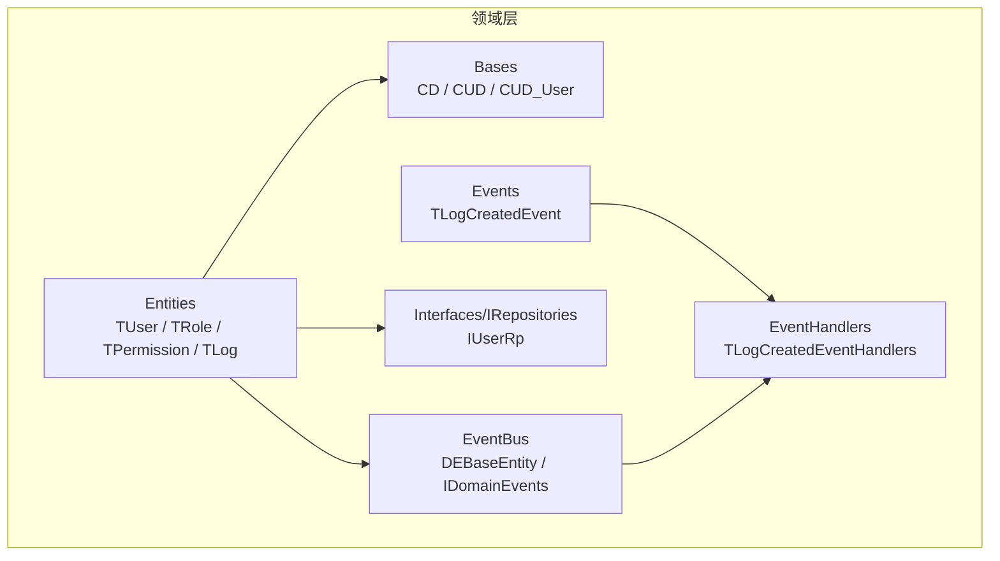
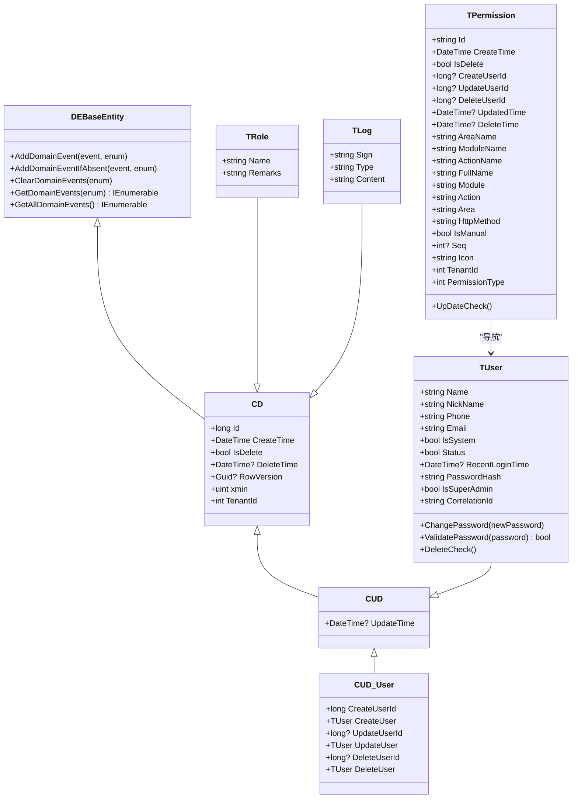
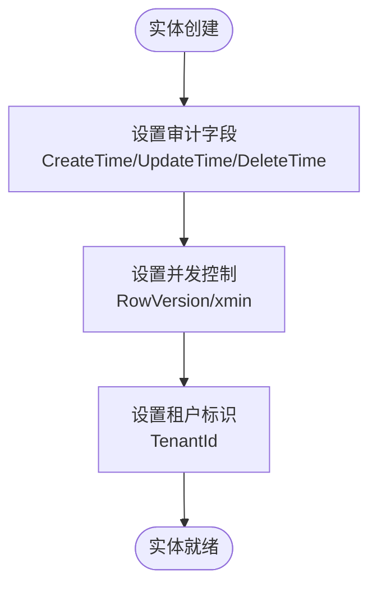
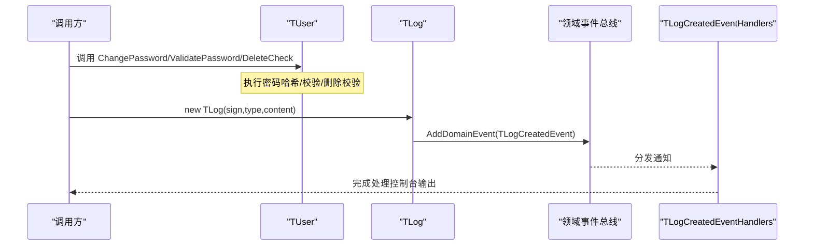
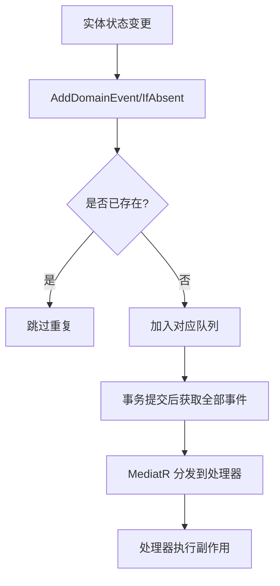
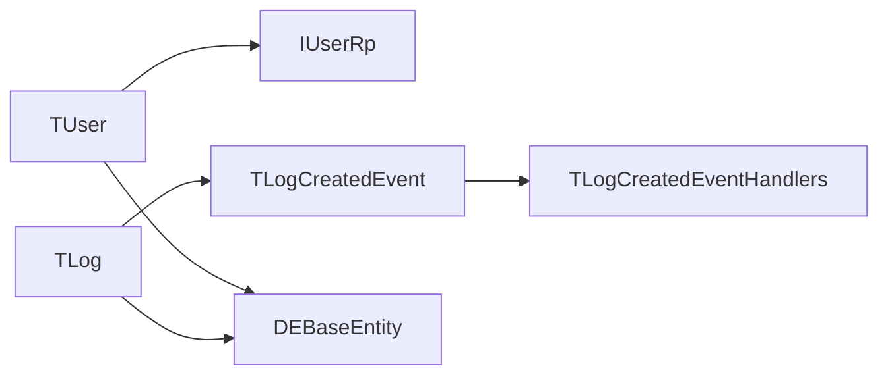

# 领域层设计

<cite>
**本文引用的文件**
- [TUser.cs](file://Kevin/Domain/Entities/TUser.cs)
- [TRole.cs](file://Kevin/Domain/Entities/TRole.cs)
- [TPermission.cs](file://Kevin/Domain/Entities/TPermission.cs)
- [TLog.cs](file://Kevin/Domain/Entities/TLog.cs)
- [CD.cs](file://Kevin/Domain/Bases/CD.cs)
- [CUD.cs](file://Kevin/Domain/Bases/CUD.cs)
- [CUD_User.cs](file://Kevin/Domain/Bases/CUD_User.cs)
- [TUserBaseData.cs](file://Kevin/Domain/BaseDatas/TUserBaseData.cs)
- [TLogCreatedEvent.cs](file://Kevin/Domain/Events/TLogCreatedEvent.cs)
- [TLogCreatedEventHandlers.cs](file://Kevin/Domain/EventHandlers/TLogCreatedEventHandlers.cs)
- [DEBaseEntity.cs](file://Kevin/kevin.Module/kevin.Domain.EventBus/DEBaseEntity.cs)
- [IDomainEvents.cs](file://Kevin/kevin.Module/kevin.Domain.EventBus/IDomainEvents.cs)
- [ServiceCollectionExtensions.cs](file://Kevin/kevin.Module/kevin.Domain.EventBus/ServiceCollectionExtensions.cs)
- [IUserRp.cs](file://Kevin/Domain/Interfaces/IRepositories/IUserRp.cs)
</cite>

## 目录
1. [简介](#简介)
2. [项目结构](#项目结构)
3. [核心组件](#核心组件)
4. [架构总览](#架构总览)
5. [详细组件分析](#详细组件分析)
6. [依赖关系分析](#依赖关系分析)
7. [性能考量](#性能考量)
8. [故障排查指南](#故障排查指南)
9. [结论](#结论)
10. [附录](#附录)

## 简介
本文件面向 NetCoreKevin 框架的领域层，围绕领域驱动设计（DDD）的核心概念与实践进行系统化说明。重点覆盖：
- 实体设计原则与继承体系
- 值对象与属性验证规则
- 聚合根与业务逻辑封装
- 数据一致性保证
- 领域事件的设计模式与处理机制
- 与其他层的解耦、接口抽象与依赖倒置原则的应用
- 领域服务的使用方式与示例路径

## 项目结构
领域层位于 Kevin/Domain 及其相关模块中，采用分层组织：
- Bases：通用基类（CD、CUD、CUD_User），提供审计字段、并发控制、租户隔离等能力
- Entities：领域实体（如 TUser、TRole、TPermission、TLog），承载业务状态与行为
- Events/EventHandlers：领域事件定义与处理器，基于 MediatR 实现事件发布/订阅
- Interfaces/IRepositories：仓储接口，体现依赖倒置
- BaseDatas：种子数据配置，用于初始化基础数据
- kevin.Domain.EventBus：领域事件总线基础设施（DEBaseEntity、IDomainEvents、MediatR 注册扩展）

图表来源
- [CD.cs:1-76](file://Kevin/Domain/Bases/CD.cs#L1-L76)
- [CUD.cs:1-19](file://Kevin/Domain/Bases/CUD.cs#L1-L19)
- [CUD_User.cs:1-42](file://Kevin/Domain/Bases/CUD_User.cs#L1-L42)
- [TUser.cs:1-99](file://Kevin/Domain/Entities/TUser.cs#L1-L99)
- [TRole.cs:1-41](file://Kevin/Domain/Entities/TRole.cs#L1-L41)
- [TPermission.cs:1-154](file://Kevin/Domain/Entities/TPermission.cs#L1-L154)
- [TLog.cs:1-46](file://Kevin/Domain/Entities/TLog.cs#L1-L46)
- [TLogCreatedEvent.cs:1-7](file://Kevin/Domain/Events/TLogCreatedEvent.cs#L1-L7)
- [TLogCreatedEventHandlers.cs:1-15](file://Kevin/Domain/EventHandlers/TLogCreatedEventHandlers.cs#L1-L15)
- [DEBaseEntity.cs:1-116](file://Kevin/kevin.Module/kevin.Domain.EventBus/DEBaseEntity.cs#L1-L116)
- [IDomainEvents.cs:1-23](file://Kevin/kevin.Module/kevin.Domain.EventBus/IDomainEvents.cs#L1-L23)
- [IUserRp.cs:1-11](file://Kevin/Domain/Interfaces/IRepositories/IUserRp.cs#L1-L11)

章节来源
- [CD.cs:1-76](file://Kevin/Domain/Bases/CD.cs#L1-L76)
- [CUD.cs:1-19](file://Kevin/Domain/Bases/CUD.cs#L1-L19)
- [CUD_User.cs:1-42](file://Kevin/Domain/Bases/CUD_User.cs#L1-L42)
- [TUser.cs:1-99](file://Kevin/Domain/Entities/TUser.cs#L1-L99)
- [TRole.cs:1-41](file://Kevin/Domain/Entities/TRole.cs#L1-L41)
- [TPermission.cs:1-154](file://Kevin/Domain/Entities/TPermission.cs#L1-L154)
- [TLog.cs:1-46](file://Kevin/Domain/Entities/TLog.cs#L1-L46)
- [TLogCreatedEvent.cs:1-7](file://Kevin/Domain/Events/TLogCreatedEvent.cs#L1-L7)
- [TLogCreatedEventHandlers.cs:1-15](file://Kevin/Domain/EventHandlers/TLogCreatedEventHandlers.cs#L1-L15)
- [DEBaseEntity.cs:1-116](file://Kevin/kevin.Module/kevin.Domain.EventBus/DEBaseEntity.cs#L1-L116)
- [IDomainEvents.cs:1-23](file://Kevin/kevin.Module/kevin.Domain.EventBus/IDomainEvents.cs#L1-L23)
- [IUserRp.cs:1-11](file://Kevin/Domain/Interfaces/IRepositories/IUserRp.cs#L1-L11)

## 核心组件
- 实体基类体系
  - CD：提供 Id、CreateTime、IsDelete、DeleteTime、RowVersion/xmin（并发控制）、TenantId（多租户）
  - CUD：在 CD 基础上增加 UpdateTime
  - CUD_User：在 CUD 基础上增加 CreateUserId/UpdateUserId/DeleteUserId 及对应导航属性
- 领域实体
  - TUser：用户实体，包含密码哈希、最近登录时间、超级管理员标记、第三方关联等；内置变更密码、校验密码、删除校验等业务方法
  - TRole：角色实体，名称长度限制、备注
  - TPermission：权限实体，包含模块/动作/HTTP 方法、是否手动添加、排序、图标、租户、权限类型；更新前校验“仅允许手动添加项修改”
  - TLog：日志实体，构造时发布“创建”领域事件
- 领域事件与处理
  - TLogCreatedEvent：基于 MediatR 的通知类型
  - TLogCreatedEventHandlers：控制台输出日志内容
  - DEBaseEntity：实体级事件收集器，按 Add/Modified/Deleted/Other 分类管理事件，支持去重与清理
  - IDomainEvents：事件集合操作契约
  - ServiceCollectionExtensions：将 MediatR 从指定程序集扫描并注册
- 仓储接口
  - IUserRp：对 TUser 的仓储接口，体现依赖倒置

章节来源
- [CD.cs:1-76](file://Kevin/Domain/Bases/CD.cs#L1-L76)
- [CUD.cs:1-19](file://Kevin/Domain/Bases/CUD.cs#L1-L19)
- [CUD_User.cs:1-42](file://Kevin/Domain/Bases/CUD_User.cs#L1-L42)
- [TUser.cs:1-99](file://Kevin/Domain/Entities/TUser.cs#L1-L99)
- [TRole.cs:1-41](file://Kevin/Domain/Entities/TRole.cs#L1-L41)
- [TPermission.cs:1-154](file://Kevin/Domain/Entities/TPermission.cs#L1-L154)
- [TLog.cs:1-46](file://Kevin/Domain/Entities/TLog.cs#L1-L46)
- [TLogCreatedEvent.cs:1-7](file://Kevin/Domain/Events/TLogCreatedEvent.cs#L1-L7)
- [TLogCreatedEventHandlers.cs:1-15](file://Kevin/Domain/EventHandlers/TLogCreatedEventHandlers.cs#L1-L15)
- [DEBaseEntity.cs:1-116](file://Kevin/kevin.Module/kevin.Domain.EventBus/DEBaseEntity.cs#L1-L116)
- [IDomainEvents.cs:1-23](file://Kevin/kevin.Module/kevin.Domain.EventBus/IDomainEvents.cs#L1-L23)
- [ServiceCollectionExtensions.cs:1-22](file://Kevin/kevin.Module/kevin.Domain.EventBus/ServiceCollectionExtensions.cs#L1-L22)
- [IUserRp.cs:1-11](file://Kevin/Domain/Interfaces/IRepositories/IUserRp.cs#L1-L11)

## 架构总览
领域层通过基类体系统一审计与并发控制，实体内聚业务规则，使用领域事件实现跨边界的副作用解耦，并通过仓储接口与持久化实现解耦。

图表来源
- [DEBaseEntity.cs:1-116](file://Kevin/kevin.Module/kevin.Domain.EventBus/DEBaseEntity.cs#L1-L116)
- [CD.cs:1-76](file://Kevin/Domain/Bases/CD.cs#L1-L76)
- [CUD.cs:1-19](file://Kevin/Domain/Bases/CUD.cs#L1-L19)
- [CUD_User.cs:1-42](file://Kevin/Domain/Bases/CUD_User.cs#L1-L42)
- [TUser.cs:1-99](file://Kevin/Domain/Entities/TUser.cs#L1-L99)
- [TRole.cs:1-41](file://Kevin/Domain/Entities/TRole.cs#L1-L41)
- [TPermission.cs:1-154](file://Kevin/Domain/Entities/TPermission.cs#L1-L154)
- [TLog.cs:1-46](file://Kevin/Domain/Entities/TLog.cs#L1-L46)

## 详细组件分析

### 实体基类与继承体系
- 设计要点
  - 统一审计字段：Create/Update/Delete 时间与操作人（可选）
  - 并发控制：RowVersion/xmin 双重兼容，避免并发写入冲突
  - 多租户：TenantId 贯穿所有实体，便于数据隔离
  - 可拓展性：新增基类只需组合现有能力
- 复杂度
  - 内存占用：每个实体携带少量元数据字段，开销可控
  - 查询性能：索引建议覆盖 Id、TenantId、IsDelete

图表来源
- [CD.cs:1-76](file://Kevin/Domain/Bases/CD.cs#L1-L76)
- [CUD.cs:1-19](file://Kevin/Domain/Bases/CUD.cs#L1-L19)
- [CUD_User.cs:1-42](file://Kevin/Domain/Bases/CUD_User.cs#L1-L42)

章节来源
- [CD.cs:1-76](file://Kevin/Domain/Bases/CD.cs#L1-L76)
- [CUD.cs:1-19](file://Kevin/Domain/Bases/CUD.cs#L1-L19)
- [CUD_User.cs:1-42](file://Kevin/Domain/Bases/CUD_User.cs#L1-L42)

### 领域实体与业务规则
- TUser
  - 业务方法：变更密码、校验密码、删除前校验（禁止删除超级管理员）
  - 属性约束：字符串长度、布尔默认值、敏感信息（密码哈希）
- TRole
  - 属性约束：名称长度限制、备注长度限制
- TPermission
  - 业务规则：非手动添加的权限禁止修改（UpDateCheck）
  - 属性约束：模块/动作/HTTP 方法、排序、图标、权限类型
- TLog
  - 构造即发布“创建”领域事件，体现“状态变化即事件”的原则

图表来源
- [TUser.cs:1-99](file://Kevin/Domain/Entities/TUser.cs#L1-L99)
- [TLog.cs:1-46](file://Kevin/Domain/Entities/TLog.cs#L1-L46)
- [TLogCreatedEvent.cs:1-7](file://Kevin/Domain/Events/TLogCreatedEvent.cs#L1-L7)
- [TLogCreatedEventHandlers.cs:1-15](file://Kevin/Domain/EventHandlers/TLogCreatedEventHandlers.cs#L1-L15)

章节来源
- [TUser.cs:1-99](file://Kevin/Domain/Entities/TUser.cs#L1-L99)
- [TRole.cs:1-41](file://Kevin/Domain/Entities/TRole.cs#L1-L41)
- [TPermission.cs:1-154](file://Kevin/Domain/Entities/TPermission.cs#L1-L154)
- [TLog.cs:1-46](file://Kevin/Domain/Entities/TLog.cs#L1-L46)

### 领域事件设计与处理机制
- 事件模型
  - 基于 MediatR 的 INotification 记录类型，轻量且不可变
- 事件收集
  - DEBaseEntity 维护四类事件队列（Add/Modified/Deleted/Other），支持去重与清理
- 事件注册
  - ServiceCollectionExtensions 将 MediatR 从指定程序集扫描注册
- 事件处理
  - TLogCreatedEventHandlers 作为示例处理器，演示异步处理与取消令牌支持

图表来源
- [DEBaseEntity.cs:1-116](file://Kevin/kevin.Module/kevin.Domain.EventBus/DEBaseEntity.cs#L1-L116)
- [IDomainEvents.cs:1-23](file://Kevin/kevin.Module/kevin.Domain.EventBus/IDomainEvents.cs#L1-L23)
- [ServiceCollectionExtensions.cs:1-22](file://Kevin/kevin.Module/kevin.Domain.EventBus/ServiceCollectionExtensions.cs#L1-L22)
- [TLogCreatedEvent.cs:1-7](file://Kevin/Domain/Events/TLogCreatedEvent.cs#L1-L7)
- [TLogCreatedEventHandlers.cs:1-15](file://Kevin/Domain/EventHandlers/TLogCreatedEventHandlers.cs#L1-L15)

章节来源
- [DEBaseEntity.cs:1-116](file://Kevin/kevin.Module/kevin.Domain.EventBus/DEBaseEntity.cs#L1-L116)
- [IDomainEvents.cs:1-23](file://Kevin/kevin.Module/kevin.Domain.EventBus/IDomainEvents.cs#L1-L23)
- [ServiceCollectionExtensions.cs:1-22](file://Kevin/kevin.Module/kevin.Domain.EventBus/ServiceCollectionExtensions.cs#L1-L22)
- [TLogCreatedEvent.cs:1-7](file://Kevin/Domain/Events/TLogCreatedEvent.cs#L1-L7)
- [TLogCreatedEventHandlers.cs:1-15](file://Kevin/Domain/EventHandlers/TLogCreatedEventHandlers.cs#L1-L15)

### 值对象与属性验证
- 值对象实践
  - 本项目以强类型实体为主，值对象可通过只读属性或 DTO 表达不变量（例如邮箱格式、手机号格式）
- 属性验证
  - 使用 DataAnnotations 进行长度限制与描述标注（如 StringLength、MaxLength）
  - 业务校验在实体方法中集中实现（如 TPermission.UpDateCheck、TUser.DeleteCheck）

章节来源
- [TRole.cs:1-41](file://Kevin/Domain/Entities/TRole.cs#L1-L41)
- [TPermission.cs:1-154](file://Kevin/Domain/Entities/TPermission.cs#L1-L154)
- [TUser.cs:1-99](file://Kevin/Domain/Entities/TUser.cs#L1-L99)

### 聚合根与业务逻辑封装
- 聚合边界
  - TUser、TRole、TPermission、TLog 各自作为聚合根，封装自身状态与不变式
- 业务逻辑内聚
  - 密码哈希与校验、权限修改限制、删除保护等均在实体内部实现，避免散落至应用层
- 数据一致性
  - 通过基类的并发控制字段与实体内校验保障一致性

章节来源
- [TUser.cs:1-99](file://Kevin/Domain/Entities/TUser.cs#L1-L99)
- [TPermission.cs:1-154](file://Kevin/Domain/Entities/TPermission.cs#L1-L154)
- [CD.cs:1-76](file://Kevin/Domain/Bases/CD.cs#L1-L76)

### 领域服务与接口抽象
- 领域服务
  - 可在 Application 层编排多个聚合的操作，保持领域无状态
- 接口抽象与依赖倒置
  - 仓储接口（如 IUserRp）定义数据访问契约，具体实现置于基础设施层
  - 领域层不依赖具体数据库实现，仅依赖接口

章节来源
- [IUserRp.cs:1-11](file://Kevin/Domain/Interfaces/IRepositories/IUserRp.cs#L1-L11)

### 种子数据与初始化
- TUserBaseData 提供初始用户数据，便于系统启动时注入基础账号

章节来源
- [TUserBaseData.cs:1-18](file://Kevin/Domain/BaseDatas/TUserBaseData.cs#L1-L18)

## 依赖关系分析
- 耦合与内聚
  - 实体高内聚：业务规则集中在实体方法中
  - 低耦合：通过仓储接口与事件总线解耦持久化与副作用
- 外部依赖
  - MediatR：事件分发
  - EF Core 特性：并发控制（ConcurrencyCheck）
- 循环依赖
  - 当前未见循环引用；事件处理器仅消费事件，不反向依赖实体

图表来源
- [TUser.cs:1-99](file://Kevin/Domain/Entities/TUser.cs#L1-L99)
- [TLog.cs:1-46](file://Kevin/Domain/Entities/TLog.cs#L1-L46)
- [TLogCreatedEvent.cs:1-7](file://Kevin/Domain/Events/TLogCreatedEvent.cs#L1-L7)
- [TLogCreatedEventHandlers.cs:1-15](file://Kevin/Domain/EventHandlers/TLogCreatedEventHandlers.cs#L1-L15)
- [DEBaseEntity.cs:1-116](file://Kevin/kevin.Module/kevin.Domain.EventBus/DEBaseEntity.cs#L1-L116)
- [IUserRp.cs:1-11](file://Kevin/Domain/Interfaces/IRepositories/IUserRp.cs#L1-L11)

章节来源
- [TUser.cs:1-99](file://Kevin/Domain/Entities/TUser.cs#L1-L99)
- [TLog.cs:1-46](file://Kevin/Domain/Entities/TLog.cs#L1-L46)
- [TLogCreatedEvent.cs:1-7](file://Kevin/Domain/Events/TLogCreatedEvent.cs#L1-L7)
- [TLogCreatedEventHandlers.cs:1-15](file://Kevin/Domain/EventHandlers/TLogCreatedEventHandlers.cs#L1-L15)
- [DEBaseEntity.cs:1-116](file://Kevin/kevin.Module/kevin.Domain.EventBus/DEBaseEntity.cs#L1-L116)
- [IUserRp.cs:1-11](file://Kevin/Domain/Interfaces/IRepositories/IUserRp.cs#L1-L11)

## 性能考量
- 并发控制
  - 使用 RowVersion/xmin 减少锁竞争，提高写并发
- 事件处理
  - 领域事件为异步处理，避免阻塞主流程；注意处理器中的 I/O 操作应异步化
- 查询优化
  - 对常用过滤字段（如 TenantId、IsDelete）建立索引，提升分页与筛选性能
- 内存占用
  - 事件队列仅在事务期间持有，提交后及时清理，避免长期驻留

[本节为通用指导，无需特定文件来源]

## 故障排查指南
- 常见错误
  - 非手动权限修改被拒绝：检查 TPermission.UpDateCheck 的 IsManual 标志
  - 超级管理员删除失败：检查 TUser.DeleteCheck 的 IsSuperAdmin 标志
  - 事件未触发：确认实体是否正确调用 AddDomainEvent/IfAbsent，以及 MediatR 是否已注册
- 定位步骤
  - 查看实体方法抛出的异常类型与消息
  - 检查领域事件队列内容与处理器日志输出
  - 核对仓储实现与上下文事务边界

章节来源
- [TPermission.cs:1-154](file://Kevin/Domain/Entities/TPermission.cs#L1-L154)
- [TUser.cs:1-99](file://Kevin/Domain/Entities/TUser.cs#L1-L99)
- [TLogCreatedEventHandlers.cs:1-15](file://Kevin/Domain/EventHandlers/TLogCreatedEventHandlers.cs#L1-L15)

## 结论
NetCoreKevin 领域层通过清晰的基类体系、内聚的实体行为、基于 MediatR 的领域事件机制以及仓储接口抽象，实现了高内聚、低耦合的领域模型设计。该设计既保证了业务规则的集中与一致，又为跨进程/跨服务的扩展提供了良好基础。

[本节为总结性内容，无需特定文件来源]

## 附录
- 代码片段路径（示例）
  - 定义实体与业务方法：[TUser.cs:1-99](file://Kevin/Domain/Entities/TUser.cs#L1-L99)、[TPermission.cs:1-154](file://Kevin/Domain/Entities/TPermission.cs#L1-L154)
  - 发布领域事件：[TLog.cs:1-46](file://Kevin/Domain/Entities/TLog.cs#L1-L46)
  - 定义事件与处理器：[TLogCreatedEvent.cs:1-7](file://Kevin/Domain/Events/TLogCreatedEvent.cs#L1-L7)、[TLogCreatedEventHandlers.cs:1-15](file://Kevin/Domain/EventHandlers/TLogCreatedEventHandlers.cs#L1-L15)
  - 事件总线基础设施：[DEBaseEntity.cs:1-116](file://Kevin/kevin.Module/kevin.Domain.EventBus/DEBaseEntity.cs#L1-L116)、[IDomainEvents.cs:1-23](file://Kevin/kevin.Module/kevin.Domain.EventBus/IDomainEvents.cs#L1-L23)、[ServiceCollectionExtensions.cs:1-22](file://Kevin/kevin.Module/kevin.Domain.EventBus/ServiceCollectionExtensions.cs#L1-L22)
  - 仓储接口抽象：[IUserRp.cs:1-11](file://Kevin/Domain/Interfaces/IRepositories/IUserRp.cs#L1-L11)

[本节为参考链接汇总，无需特定文件来源]