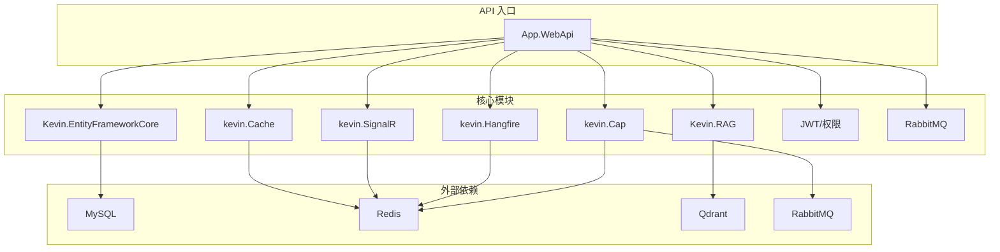
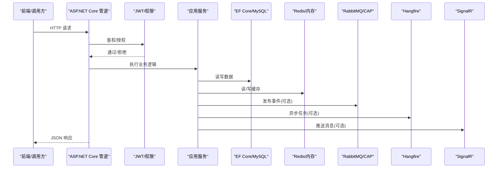
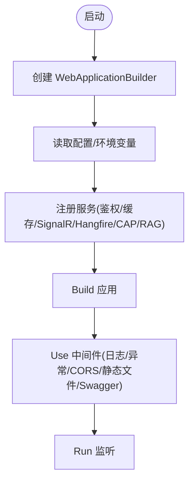
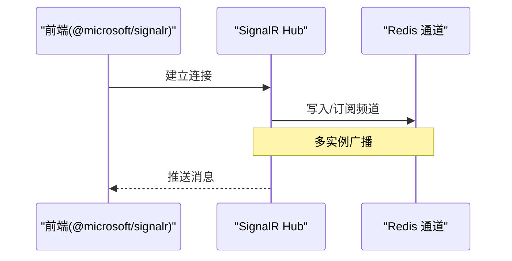
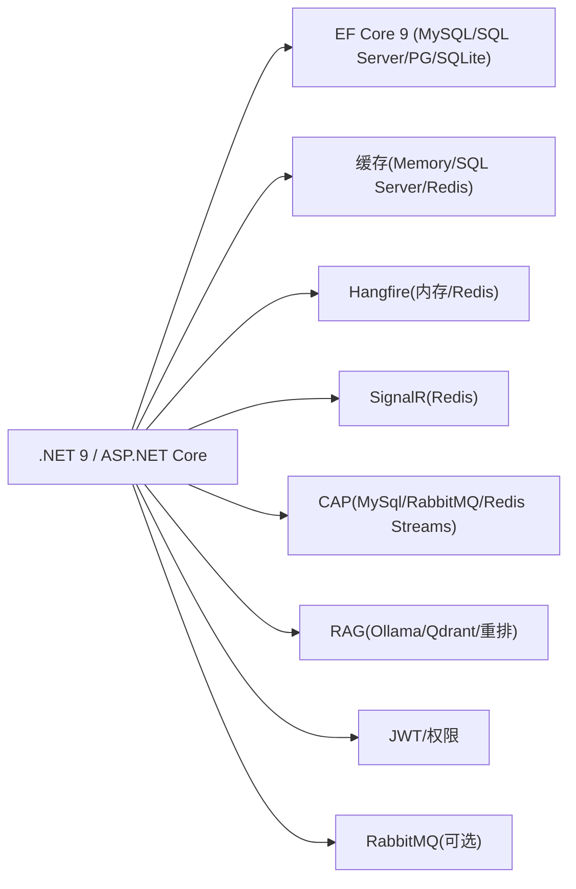

# 技术选型

<cite>
**本文引用的文件**
- [App.WebApi.csproj](file://App/WebApi/App.WebApi.csproj)
- [Program.cs](file://App/WebApi/Program.cs)
- [ServiceConfiguration.cs](file://Kevin/Kevin.Web.Basics/Extensions/ServiceConfiguration.cs)
- [Kevin.EntityFrameworkCore.csproj](file://Kevin/Kevin.EntityFrameworkCore/Kevin.EntityFrameworkCore.csproj)
- [appsettings.json](file://App/WebApi/appsettings.json)
- [kevin.Cache.csproj](file://Kevin/kevin.Module/kevin.Cache/kevin.Cache.csproj)
- [Kevin.SignalR.csproj](file://Kevin/kevin.Module/kevin.SignalR/Kevin.SignalR.csproj)
- [ServiceCollectionExtensions.cs](file://Kevin/kevin.Module/kevin.SignalR/ServiceCollectionExtensions.cs)
- [Kevin.Hangfire.csproj](file://Kevin/kevin.Module/kevin.Hangfire/Kevin.Hangfire.csproj)
- [kevin.Cap.csproj](file://Kevin/kevin.Module/kevin.Cap/kevin.Cap.csproj)
- [Kevin.RAG.csproj](file://Kevin/kevin.Module/Kevin.RAG/Kevin.RAG.csproj)
- [package.json](file://vue/kevin.web.vue/package.json)
- [数据库层说明.txt](file://Doc/项目相关/数据库层说明.txt)
- [说明.txt](file://Kevin/Kevin.Web.Basics/txt/说明.txt)
</cite>

## 目录
1. [引言](#引言)
2. [项目结构](#项目结构)
3. [核心组件](#核心组件)
4. [架构总览](#架构总览)
5. [详细组件分析](#详细组件分析)
6. [依赖关系分析](#依赖关系分析)
7. [性能考量](#性能考量)
8. [故障排查指南](#故障排查指南)
9. [结论](#结论)
10. [附录：升级与迁移指南](#附录：升级与迁移指南)

## 引言
本技术选型文档基于 NetCoreKevin 框架的实际代码与配置，系统阐述后端与前端技术栈的选择理由、版本兼容性、中间件与第三方服务集成方案，以及架构层面的性能、可扩展性、可维护性与社区支持等考量。同时提供面向未来的技术升级路径与迁移建议，帮助团队在保持业务连续性的前提下平滑演进。

## 项目结构
NetCoreKevin 采用分层与模块化设计：
- App 层：应用边界（WebApi、Application、Domain、Repositories）
- Kevin 核心模块：领域、基础设施与通用能力（EF Core、缓存、消息、SignalR、Hangfire、CAP、RAG/Qdrant/Ollama、权限、日志、短信、文件存储、AI Agent 等）
- Vue 前端：Vue 3 + Ant Design Vue + Axios + SignalR 客户端

图表来源
- [Program.cs:23-85](file://App/WebApi/Program.cs#L23-L85)
- [ServiceConfiguration.cs:48-347](file://Kevin/Kevin.Web.Basics/Extensions/ServiceConfiguration.cs#L48-L347)
- [Kevin.EntityFrameworkCore.csproj:18-32](file://Kevin/Kevin.EntityFrameworkCore/Kevin.EntityFrameworkCore.csproj#L18-L32)
- [kevin.Cache.csproj:9-19](file://Kevin/kevin.Module/kevin.Cache/kevin.Cache.csproj#L9-L19)
- [Kevin.SignalR.csproj:9-12](file://Kevin/kevin.Module/kevin.SignalR/Kevin.SignalR.csproj#L9-L12)
- [Kevin.Hangfire.csproj:9-16](file://Kevin/kevin.Module/kevin.Hangfire/Kevin.Hangfire.csproj#L9-L16)
- [kevin.Cap.csproj:9-16](file://Kevin/kevin.Module/kevin.Cap/kevin.Cap.csproj#L9-L16)
- [Kevin.RAG.csproj:9-14](file://Kevin/kevin.Module/Kevin.RAG/Kevin.RAG.csproj#L9-L14)

章节来源
- [Program.cs:23-85](file://App/WebApi/Program.cs#L23-L85)
- [ServiceConfiguration.cs:48-347](file://Kevin/Kevin.Web.Basics/Extensions/ServiceConfiguration.cs#L48-L347)

## 核心组件
- 后端运行时与框架
  - .NET 9.0 与 ASP.NET Core：统一现代化运行时，跨平台、高性能、云原生友好
  - EF Core 9.x：多数据库支持（SQL Server、SQLite、PostgreSQL、MySQL），懒加载、迁移工具链完善
  - 缓存：内存缓存 + SQL Server 缓存 + Redis 缓存（StackExchange.Redis）
  - 任务调度：Hangfire（内存/Redis 存储）
  - 实时通信：SignalR（StackExchange.Redis 持久化）
  - 分布式事件总线：CAP（MySql/RabbitMQ/Redis Streams）
  - AI/RAG：Ollama 嵌入模型、Qdrant 向量检索、阿里重排 API
  - 认证授权：JWT + 自定义权限体系
  - 消息队列：RabbitMQ（可选）
  - 日志：log4net
- 前端技术栈
  - Vue 3 + Vue Router 4
  - Ant Design Vue 4
  - Axios 1.x
  - @microsoft/signalr 10.x（浏览器端实时通信）

章节来源
- [App.WebApi.csproj:1-8](file://App/WebApi/App.WebApi.csproj#L1-L8)
- [Kevin.EntityFrameworkCore.csproj:18-32](file://Kevin/Kevin.EntityFrameworkCore/Kevin.EntityFrameworkCore.csproj#L18-L32)
- [kevin.Cache.csproj:9-19](file://Kevin/kevin.Module/kevin.Cache/kevin.Cache.csproj#L9-L19)
- [Kevin.Hangfire.csproj:9-16](file://Kevin/kevin.Module/kevin.Hangfire/Kevin.Hangfire.csproj#L9-L16)
- [Kevin.SignalR.csproj:9-12](file://Kevin/kevin.Module/kevin.SignalR/Kevin.SignalR.csproj#L9-L12)
- [kevin.Cap.csproj:9-16](file://Kevin/kevin.Module/kevin.Cap/kevin.Cap.csproj#L9-L16)
- [Kevin.RAG.csproj:9-14](file://Kevin/kevin.Module/Kevin.RAG/Kevin.RAG.csproj#L9-L14)
- [package.json:16-36](file://vue/kevin.web.vue/package.json#L16-L36)

## 架构总览
整体采用“API 网关 + 领域服务 + 数据访问 + 基础设施”的分层架构，结合模块化扩展点（Hangfire、SignalR、CAP、RAG、权限、日志等）。通过统一的 ServiceConfiguration 完成服务注册与中间件装配，确保高内聚、低耦合与可插拔。

图表来源
- [Program.cs:23-85](file://App/WebApi/Program.cs#L23-L85)
- [ServiceConfiguration.cs:48-347](file://Kevin/Kevin.Web.Basics/Extensions/ServiceConfiguration.cs#L48-L347)

## 详细组件分析

### 后端运行时与 ORM：.NET 9 + ASP.NET Core + EF Core 9
- 选择理由
  - .NET 9 提供更高性能、更好 GC 行为与云原生支持；ASP.NET Core 成熟稳定，生态完善
  - EF Core 9 对多数据库的兼容性好，迁移与建模工具链完善，满足企业级复杂场景
- 版本与兼容性
  - 目标框架 net9.0；EF Core 9.x；MySQL 驱动使用 MySql.EntityFrameworkCore 或 Pomelo.EntityFrameworkCore.MySql
- 关键实现
  - Program 中构建 WebApplication 并启用日志、异常处理、全局初始化
  - ServiceConfiguration 集中注册 MVC、JSON 序列化、CORS、鉴权、缓存、SignalR、Hangfire、CAP、RAG 等
  - EF Core DbContext 连接字符串注入与池化

图表来源
- [Program.cs:23-85](file://App/WebApi/Program.cs#L23-L85)
- [ServiceConfiguration.cs:48-347](file://Kevin/Kevin.Web.Basics/Extensions/ServiceConfiguration.cs#L48-L347)
- [Kevin.EntityFrameworkCore.csproj:18-32](file://Kevin/Kevin.EntityFrameworkCore/Kevin.EntityFrameworkCore.csproj#L18-L32)

章节来源
- [App.WebApi.csproj:1-8](file://App/WebApi/App.WebApi.csproj#L1-L8)
- [Program.cs:23-85](file://App/WebApi/Program.cs#L23-L85)
- [ServiceConfiguration.cs:48-347](file://Kevin/Kevin.Web.Basics/Extensions/ServiceConfiguration.cs#L48-L347)
- [Kevin.EntityFrameworkCore.csproj:18-32](file://Kevin/Kevin.EntityFrameworkCore/Kevin.EntityFrameworkCore.csproj#L18-L32)
- [数据库层说明.txt:1-31](file://Doc/项目相关/数据库层说明.txt#L1-L31)

### 缓存：内存 + SQL Server + Redis
- 选择理由
  - 内存缓存用于轻量、进程内热点数据；SQL Server 缓存适合共享会话；Redis 提供分布式缓存与锁能力
- 版本与兼容性
  - Microsoft.Extensions.Caching.Memory/SqlServer/StackExchangeRedis 均为 9.x，与 .NET 9 对齐
- 关键实现
  - 分布式锁通过 Redis 实现（AddKevinDistributedLockRedis）
  - SignalR 与 Hangfire 均支持 Redis 作为持久化存储

章节来源
- [kevin.Cache.csproj:9-19](file://Kevin/kevin.Module/kevin.Cache/kevin.Cache.csproj#L9-L19)
- [ServiceConfiguration.cs:121-128](file://Kevin/Kevin.Web.Basics/Extensions/ServiceConfiguration.cs#L121-L128)

### 任务调度：Hangfire
- 选择理由
  - 成熟的后台任务与定时任务解决方案，支持多种存储（内存/Redis/数据库）
- 版本与兼容性
  - Hangfire.AspNetCore 1.8.x，Redis 存储使用 Hangfire.Redis.StackExchange 1.12.x
- 关键实现
  - 默认使用内存存储（便于开发），生产可切换至 Redis
  - 提供基础认证面板

章节来源
- [Kevin.Hangfire.csproj:9-16](file://Kevin/kevin.Module/kevin.Hangfire/Kevin.Hangfire.csproj#L9-L16)
- [ServiceConfiguration.cs:267-279](file://Kevin/Kevin.Web.Basics/Extensions/ServiceConfiguration.cs#L267-L279)
- [ServiceConfiguration.cs:338-344](file://Kevin/Kevin.Web.Basics/Extensions/ServiceConfiguration.cs#L338-L344)

### 实时通信：SignalR（服务端 + 客户端）
- 选择理由
  - 原生支持双向实时通信，配合 Redis 可实现水平扩展
- 版本与兼容性
  - Microsoft.AspNetCore.SignalR.StackExchangeRedis 9.x；前端使用 @microsoft/signalr 10.x
- 关键实现
  - 服务端通过 AddKevinSignalRRedis 配置 Redis 集群参数
  - 客户端通过 @microsoft/signalr 建立连接并订阅频道

图表来源
- [Kevin.SignalR.csproj:9-12](file://Kevin/kevin.Module/kevin.SignalR/Kevin.SignalR.csproj#L9-L12)
- [ServiceCollectionExtensions.cs:9-41](file://Kevin/kevin.Module/kevin.SignalR/ServiceCollectionExtensions.cs#L9-L41)
- [package.json:24-25](file://vue/kevin.web.vue/package.json#L24-L25)

章节来源
- [Kevin.SignalR.csproj:9-12](file://Kevin/kevin.Module/kevin.SignalR/Kevin.SignalR.csproj#L9-L12)
- [ServiceCollectionExtensions.cs:9-41](file://Kevin/kevin.Module/kevin.SignalR/ServiceCollectionExtensions.cs#L9-L41)
- [package.json:24-25](file://vue/kevin.web.vue/package.json#L24-L25)

### 分布式事件总线：CAP
- 选择理由
  - 以数据库为最终一致性保障的事件总线，支持多种存储与传输（MySql、RabbitMQ、Redis Streams）
- 版本与兼容性
  - DotNetCore.CAP 8.4.x，适配 .NET 9
- 关键实现
  - 通过 CAP 的 MySql/RabbitMQ/Redis Streams 存储进行事件发布与消费
  - 与业务解耦，提升可扩展性与容错性

章节来源
- [kevin.Cap.csproj:9-16](file://Kevin/kevin.Module/kevin.Cap/kevin.Cap.csproj#L9-L16)
- [说明.txt:1-14](file://Kevin/Kevin.Web.Basics/txt/说明.txt#L1-L14)

### AI/RAG：Ollama + Qdrant + 重排 API
- 选择理由
  - Ollama 提供本地/云端嵌入模型能力；Qdrant 高性能向量检索；阿里重排优化召回质量
- 版本与兼容性
  - OllamaSharp、Qdrant.Client、Microsoft.Extensions.VectorData.Abstractions 等
- 关键实现
  - 通过 AddRAGQdrantAndOllama 注入配置与客户端
  - 结合业务实体进行向量化与检索

章节来源
- [Kevin.RAG.csproj:9-14](file://Kevin/kevin.Module/Kevin.RAG/Kevin.RAG.csproj#L9-L14)
- [ServiceConfiguration.cs:230-254](file://Kevin/Kevin.Web.Basics/Extensions/ServiceConfiguration.cs#L230-L254)
- [appsettings.json:133-159](file://App/WebApi/appsettings.json#L133-L159)

### 认证与权限：JWT + 自定义权限
- 选择理由
  - JWT 无状态、易扩展；自定义权限体系满足细粒度控制
- 版本与兼容性
  - System.IdentityModel.Tokens.Jwt 8.x；与 .NET 9 兼容
- 关键实现
  - 通过 AddKevinAuthenticationJwt 与 AddKevinAuthorizationPermission 完成注册

章节来源
- [kevin.Cache.csproj:18-18](file://Kevin/kevin.Module/kevin.Cache/kevin.Cache.csproj#L18-L18)
- [ServiceConfiguration.cs:79-88](file://Kevin/Kevin.Web.Basics/Extensions/ServiceConfiguration.cs#L79-L88)

### 消息队列：RabbitMQ（可选）
- 选择理由
  - 高吞吐、可靠的消息传递；与 CAP 结合实现事件驱动架构
- 版本与兼容性
  - 自定义封装，配置项包含 HostName、Port、用户名密码、VirtualHost
- 关键实现
  - 通过 AddKevinRabbitMQ 注入选项

章节来源
- [ServiceConfiguration.cs:182-194](file://Kevin/Kevin.Web.Basics/Extensions/ServiceConfiguration.cs#L182-L194)
- [appsettings.json:92-98](file://App/WebApi/appsettings.json#L92-L98)

### 前端技术栈：Vue 3 + Ant Design Vue + Axios + SignalR
- 选择理由
  - Vue 3 组合式 API 与生态成熟；Ant Design Vue 提供企业级 UI；Axios 简化 HTTP 调用；@microsoft/signalr 实现实时通信
- 版本与兼容性
  - Vue 3.2+、Ant Design Vue 4.x、Axios 1.x、@microsoft/signalr 10.x
- 适用场景
  - 管理后台、数据可视化、实时通知、AI 对话界面等

章节来源
- [package.json:16-36](file://vue/kevin.web.vue/package.json#L16-L36)

## 依赖关系分析
- 运行时与框架
  - .NET 9 与 ASP.NET Core 提供统一基座
- 数据访问
  - EF Core 9 对接 MySQL/SQL Server/PostgreSQL/SQLite
- 缓存与锁
  - 内存/SQL Server/Redis 三种缓存策略；Redis 分布式锁
- 任务与事件
  - Hangfire 负责后台任务；CAP 负责事件总线（MySql/RabbitMQ/Redis Streams）
- 实时通信
  - SignalR 服务端 + Redis 持久化；前端 @microsoft/signalr
- AI/RAG
  - Ollama 嵌入、Qdrant 向量检索、阿里重排

图表来源
- [App.WebApi.csproj:1-8](file://App/WebApi/App.WebApi.csproj#L1-L8)
- [Kevin.EntityFrameworkCore.csproj:18-32](file://Kevin/Kevin.EntityFrameworkCore/Kevin.EntityFrameworkCore.csproj#L18-L32)
- [kevin.Cache.csproj:9-19](file://Kevin/kevin.Module/kevin.Cache/kevin.Cache.csproj#L9-L19)
- [Kevin.Hangfire.csproj:9-16](file://Kevin/kevin.Module/kevin.Hangfire/Kevin.Hangfire.csproj#L9-L16)
- [Kevin.SignalR.csproj:9-12](file://Kevin/kevin.Module/kevin.SignalR/Kevin.SignalR.csproj#L9-L12)
- [kevin.Cap.csproj:9-16](file://Kevin/kevin.Module/kevin.Cap/kevin.Cap.csproj#L9-L16)
- [Kevin.RAG.csproj:9-14](file://Kevin/kevin.Module/Kevin.RAG/Kevin.RAG.csproj#L9-L14)

章节来源
- [App.WebApi.csproj:1-8](file://App/WebApi/App.WebApi.csproj#L1-L8)
- [Kevin.EntityFrameworkCore.csproj:18-32](file://Kevin/Kevin.EntityFrameworkCore/Kevin.EntityFrameworkCore.csproj#L18-L32)
- [kevin.Cache.csproj:9-19](file://Kevin/kevin.Module/kevin.Cache/kevin.Cache.csproj#L9-L19)
- [Kevin.Hangfire.csproj:9-16](file://Kevin/kevin.Module/kevin.Hangfire/Kevin.Hangfire.csproj#L9-L16)
- [Kevin.SignalR.csproj:9-12](file://Kevin/kevin.Module/kevin.SignalR/Kevin.SignalR.csproj#L9-L12)
- [kevin.Cap.csproj:9-16](file://Kevin/kevin.Module/kevin.Cap/kevin.Cap.csproj#L9-L16)
- [Kevin.RAG.csproj:9-14](file://Kevin/kevin.Module/Kevin.RAG/Kevin.RAG.csproj#L9-L14)

## 性能考量
- 数据库
  - 使用 EF Core 懒加载与索引字段配置，减少 N+1 查询与全表扫描
  - 连接池与命令超时合理设置，避免资源耗尽
- 缓存
  - 热点数据优先走 Redis，降低数据库压力
  - 分布式锁避免并发冲突
- 任务与事件
  - 耗时操作放入 Hangfire 异步执行
  - 通过 CAP 将同步调用转为异步事件，削峰填谷
- 实时通信
  - SignalR 使用 Redis 持久化，支持多实例横向扩展
- 前端
  - Axios 拦截器统一错误处理与重试
  - SignalR 客户端合理设置心跳与重连策略

[本节为通用指导，不直接分析具体文件]

## 故障排查指南
- 常见配置问题
  - 数据库连接串、Redis 连接串、SignalR Redis 配置不一致导致连接失败
  - Hangfire 面板登录凭据未正确配置
- 常见问题定位
  - 检查 Program 中的异常处理与日志输出
  - 确认 ServiceConfiguration 中各模块是否成功注册
  - 核对 appsettings.* 环境配置差异
- 建议步骤
  - 先验证数据库连通性
  - 再验证 Redis 连通性
  - 最后验证 SignalR/Hangfire/CAP 的中间件链路

章节来源
- [Program.cs:23-92](file://App/WebApi/Program.cs#L23-L92)
- [ServiceConfiguration.cs:48-347](file://Kevin/Kevin.Web.Basics/Extensions/ServiceConfiguration.cs#L48-L347)
- [appsettings.json:12-45](file://App/WebApi/appsettings.json#L12-L45)

## 结论
NetCoreKevin 基于 .NET 9 与 ASP.NET Core 构建了高性能、可扩展的企业级后端平台。通过 EF Core 的多数据库支持、Redis 缓存与分布式锁、Hangfire 任务调度、CAP 事件总线、SignalR 实时通信以及 RAG/AI 能力，满足了现代应用的多样化需求。前端采用 Vue 3 + Ant Design Vue + Axios + SignalR，提供了良好的用户体验与交互能力。整体架构清晰、模块化程度高，具备良好的可维护性与社区支持。

[本节为总结，不直接分析具体文件]

## 附录：升级与迁移指南
- .NET 与 ASP.NET Core
  - 升级到 .NET 9 LTS，关注 GC、HTTP/3、AOT 等新特性
  - 逐步替换已弃用 API，遵循官方迁移指南
- EF Core
  - 升级至最新 9.x 版本，评估迁移脚本与查询行为变化
  - 针对 MySQL/SQL Server/PostgreSQL 分别验证连接与性能
- Redis
  - 升级 StackExchange.Redis 与 Redis 服务器版本，注意协议与集群兼容性
  - 调整连接池、超时与重试策略
- Hangfire
  - 升级 Hangfire 及存储驱动，评估存储迁移（内存→Redis/数据库）
- CAP
  - 升级至 8.x，评估存储与传输（MySql/RabbitMQ/Redis Streams）迁移
- SignalR
  - 升级服务端与客户端库，调整心跳与重连配置
- RAG/AI
  - 跟踪 Ollama、Qdrant、重排 API 的版本更新，评估模型与接口变更
- 前端
  - 升级 Vue 3、Ant Design Vue、Axios、@microsoft/signalr，关注破坏性变更
  - 重构与测试覆盖，确保向后兼容

[本节为通用指导，不直接分析具体文件]