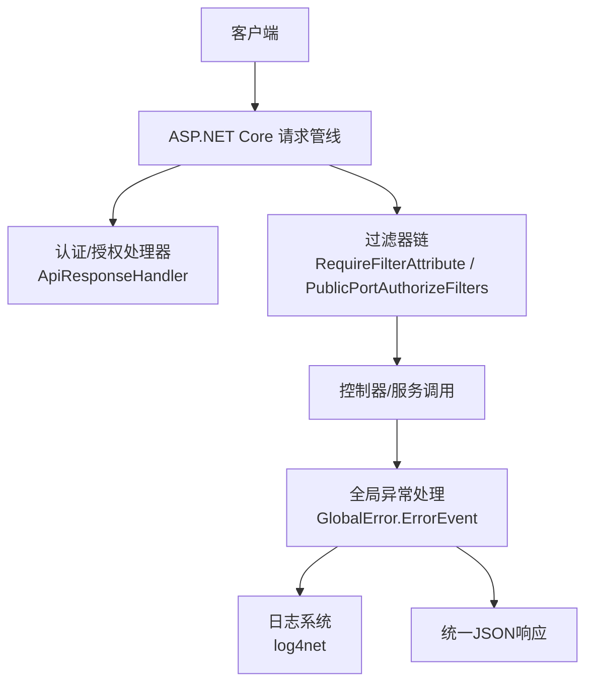
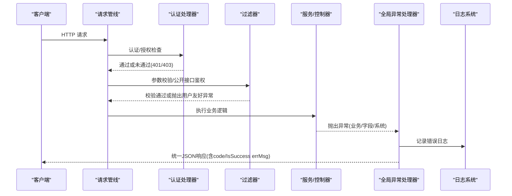
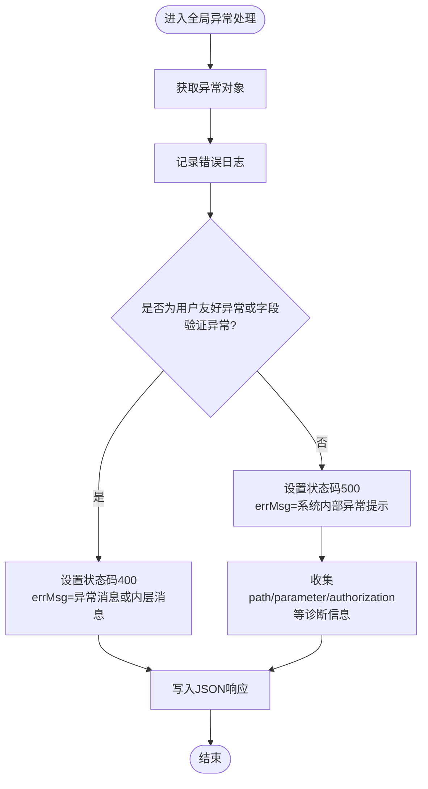
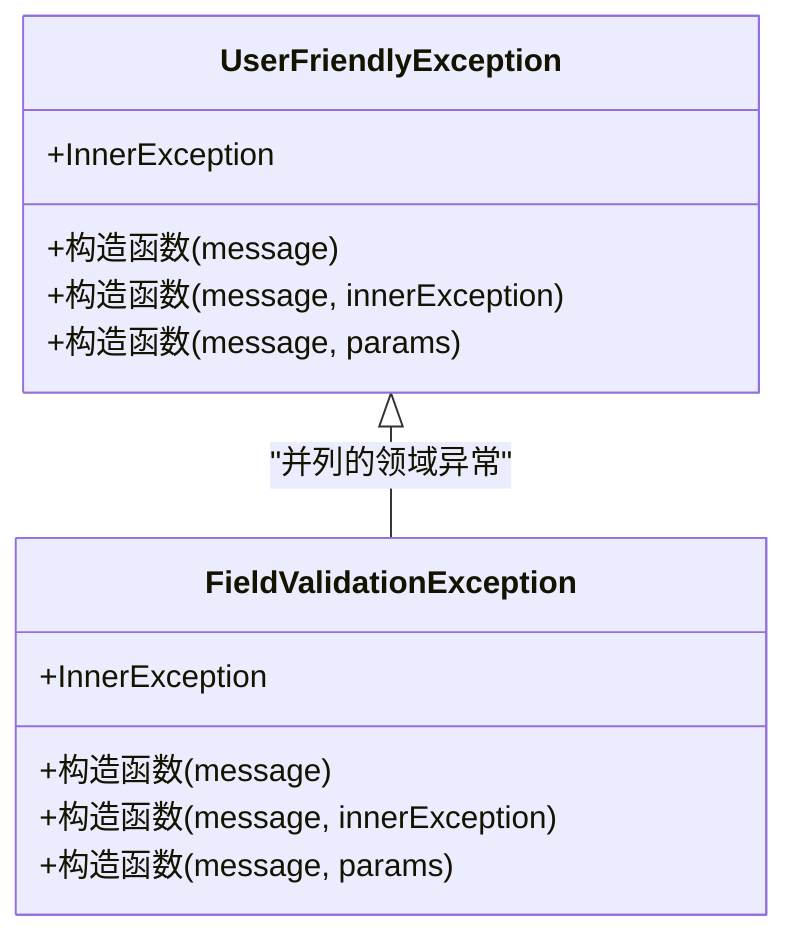
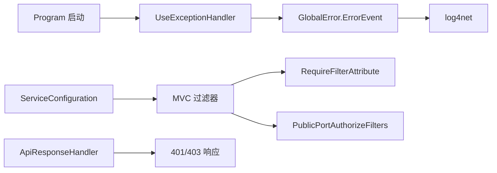

# 异常处理流程

<cite>
**本文引用的文件**
- [Program.cs](file://App/WebApi/Program.cs)
- [GlobalError.cs](file://Kevin/kevin.Module/Kevin.Common/App/Global/GlobalError.cs)
- [UserFriendlyException.cs](file://Kevin/kevin.Module/Kevin.Common/App/Exceptions/UserFriendlyException.cs)
- [FieldValidationException.cs](file://Kevin/kevin.Share/FieldValidationException.cs)
- [ApiResponseHandler.cs](file://Kevin/Domain/Auth/ApiResponseHandler.cs)
- [RequireFilterAttribute.cs](file://Kevin/Kevin.Web.Basics/Filters/RequireFilterAttribute.cs)
- [PublicPortAuthorizeFilters.cs](file://Kevin/Kevin.Web.Basics/Filters/PublicPortAuthorizeFilters.cs)
- [ServiceConfiguration.cs](file://Kevin/ Kevin.Web.Basics/Extensions/ServiceConfiguration.cs)
- [ResultFilter.cs](file://Kevin/ Kevin.Web.Basics/Filters/ResultFilter.cs)
- [LoggingBuilderExtensions.cs](file://Kevin/kevin.Module/Kevin.log4Net/LoggingBuilderExtensions.cs)
- [LogHelper.cs](file://Kevin/kevin.Module/Kevin.log4Net/LogHelper.cs)
- [log4.config](file://App/WebApi/LogConfigs/log4.config)
- [PermissionService.cs](file://Kevin/Application/Services/PermissionService.cs)
</cite>

## 目录
1. [简介](#简介)
2. [项目结构](#项目结构)
3. [核心组件](#核心组件)
4. [架构总览](#架构总览)
5. [详细组件分析](#详细组件分析)
6. [依赖关系分析](#依赖关系分析)
7. [性能考虑](#性能考虑)
8. [故障排查指南](#故障排查指南)
9. [结论](#结论)
10. [附录](#附录)

## 简介
本文件面向 NetCoreKevin 框架的异常处理机制，系统化说明从底层抛出到上层捕获、再到统一响应与日志记录的完整链路。重点覆盖：
- 全局异常处理器对业务异常、用户友好异常的分类处理
- UserFriendlyException 的使用场景与设计模式
- 字段校验异常与权限相关异常的处理方式与安全考量
- 统一错误响应格式与日志记录机制
- 最佳实践：信息脱敏、调试支持与可观测性

## 项目结构
异常处理涉及 Web 管道、过滤器、认证处理器、全局异常中间件与日志子系统，关键位置如下：
- 应用启动管线注册全局异常处理中间件
- 控制器层通过过滤器进行参数校验与公开接口鉴权
- 业务服务中抛出用户友好异常或字段验证异常
- 全局异常处理器统一输出 JSON 并记录日志
- 认证处理器统一返回 401/403 响应

图表来源
- [Program.cs:59-77](file://App/WebApi/Program.cs#L59-L77)
- [ApiResponseHandler.cs:23-35](file://Kevin/Domain/Auth/ApiResponseHandler.cs#L23-L35)
- [RequireFilterAttribute.cs:8-19](file://Kevin/ Kevin.Web.Basics/Filters/RequireFilterAttribute.cs#L8-L19)
- [PublicPortAuthorizeFilters.cs:32-45](file://Kevin/ Kevin.Web.Basics/Filters/PublicPortAuthorizeFilters.cs#L32-L45)
- [GlobalError.cs:16-65](file://Kevin/kevin.Module/Kevin.Common/App/Global/GlobalError.cs#L16-L65)
- [LoggingBuilderExtensions.cs:9-37](file://Kevin/kevin.Module/Kevin.log4Net/LoggingBuilderExtensions.cs#L9-L37)

章节来源
- [Program.cs:59-77](file://App/WebApi/Program.cs#L59-L77)
- [ServiceConfiguration.cs:92-100](file://Kevin/ Kevin.Web.Basics/Extensions/ServiceConfiguration.cs#L92-L100)

## 核心组件
- 全局异常处理器：负责捕获所有未处理异常，分类输出状态码与统一 JSON，并记录日志
- 用户友好异常：用于向调用方返回明确、安全的业务提示
- 字段验证异常：用于模型绑定与数据校验失败时的统一提示
- 认证处理器：统一处理未认证（401）与禁止访问（403）场景
- 过滤器：在动作执行前进行参数校验与公开接口密钥校验
- 日志系统：基于 log4net 的滚动文件日志，支持按环境加载配置

章节来源
- [GlobalError.cs:16-65](file://Kevin/kevin.Module/Kevin.Common/App/Global/GlobalError.cs#L16-L65)
- [UserFriendlyException.cs:6-19](file://Kevin/kevin.Module/Kevin.Common/App/Exceptions/UserFriendlyException.cs#L6-L19)
- [FieldValidationException.cs:5-18](file://Kevin/kevin.Share/FieldValidationException.cs#L5-L18)
- [ApiResponseHandler.cs:23-35](file://Kevin/Domain/Auth/ApiResponseHandler.cs#L23-L35)
- [RequireFilterAttribute.cs:8-19](file://Kevin/ Kevin.Web.Basics/Filters/RequireFilterAttribute.cs#L8-L19)
- [PublicPortAuthorizeFilters.cs:32-45](file://Kevin/ Kevin.Web.Basics/Filters/PublicPortAuthorizeFilters.cs#L32-L45)
- [LoggingBuilderExtensions.cs:9-37](file://Kevin/kevin.Module/Kevin.log4Net/LoggingBuilderExtensions.cs#L9-L37)

## 架构总览
下图展示一次典型请求的异常处理路径：从控制器或服务抛出异常，经过滤器与认证处理器，最终由全局异常处理器统一处理并写回响应。

图表来源
- [Program.cs:59-77](file://App/WebApi/Program.cs#L59-L77)
- [ApiResponseHandler.cs:23-35](file://Kevin/Domain/Auth/ApiResponseHandler.cs#L23-L35)
- [RequireFilterAttribute.cs:8-19](file://Kevin/ Kevin.Web.Basics/Filters/RequireFilterAttribute.cs#L8-L19)
- [PublicPortAuthorizeFilters.cs:32-45](file://Kevin/ Kevin.Web.Basics/Filters/PublicPortAuthorizeFilters.cs#L32-L45)
- [GlobalError.cs:16-65](file://Kevin/kevin.Module/Kevin.Common/App/Global/GlobalError.cs#L16-L65)
- [LoggingBuilderExtensions.cs:9-37](file://Kevin/kevin.Module/Kevin.log4Net/LoggingBuilderExtensions.cs#L9-L37)

## 详细组件分析

### 全局异常处理器（GlobalError）
- 职责：获取异常对象，记录错误日志；根据异常类型决定状态码与响应体
- 分类策略：
  - 用户友好异常与字段验证异常：返回 400，errMsg 取自异常消息或内层异常消息
  - 其他异常：返回 500，errMsg 为系统内部异常提示
- 安全注意：非用户友好异常时，会收集请求路径、参数、Authorization 头等信息用于诊断（需在生产环境中评估是否脱敏）

图表来源
- [GlobalError.cs:16-65](file://Kevin/kevin.Module/Kevin.Common/App/Global/GlobalError.cs#L16-L65)

章节来源
- [GlobalError.cs:16-65](file://Kevin/kevin.Module/Kevin.Common/App/Global/GlobalError.cs#L16-L65)

### 用户友好异常（UserFriendlyException）
- 设计目的：将“期望被调用方理解”的业务错误以明确、安全的方式返回
- 使用场景：
  - 资源不存在或已删除
  - 业务规则不满足（如重复操作、权限不足）
  - 参数语义正确但业务不可用
- 抛出处示例：
  - 业务服务中遇到数据缺失或重复时抛出
  - 过滤器中模型验证失败时抛出

图表来源
- [UserFriendlyException.cs:6-19](file://Kevin/kevin.Module/Kevin.Common/App/Exceptions/UserFriendlyException.cs#L6-L19)
- [FieldValidationException.cs:5-18](file://Kevin/kevin.Share/FieldValidationException.cs#L5-L18)

章节来源
- [UserFriendlyException.cs:6-19](file://Kevin/kevin.Module/Kevin.Common/App/Exceptions/UserFriendlyException.cs#L6-L19)
- [FieldValidationException.cs:5-18](file://Kevin/kevin.Share/FieldValidationException.cs#L5-L18)
- [PermissionService.cs:243-265](file://Kevin/Application/Services/PermissionService.cs#L243-L265)
- [RequireFilterAttribute.cs:8-19](file://Kevin/ Kevin.Web.Basics/Filters/RequireFilterAttribute.cs#L8-L19)

### 字段验证异常（FieldValidationException）
- 触发点：模型绑定或自定义验证失败时，过滤器将其转换为统一的用户友好异常
- 行为：全局异常处理器识别后返回 400，errMsg 包含验证失败信息

章节来源
- [RequireFilterAttribute.cs:8-19](file://Kevin/ Kevin.Web.Basics/Filters/RequireFilterAttribute.cs#L8-L19)
- [GlobalError.cs:28-37](file://Kevin/kevin.Module/Kevin.Common/App/Global/GlobalError.cs#L28-L37)

### 认证与授权异常（ApiResponseHandler）
- 未认证（401）：当认证失败时，直接返回统一的 JSON 响应
- 禁止访问（403）：当授权失败时，返回统一的 JSON 响应
- 安全建议：确保敏感信息不在响应中泄露

章节来源
- [ApiResponseHandler.cs:23-35](file://Kevin/Domain/Auth/ApiResponseHandler.cs#L23-L35)

### 过滤器链中的异常处理
- 参数校验过滤器：在动作执行前校验 ModelState，失败则抛出用户友好异常
- 公开接口鉴权过滤器：校验 appId/appSecret，失败返回 401 并终止请求
- 结果过滤器：对返回值进行格式化（如 null 转空字符串），不影响异常流

章节来源
- [RequireFilterAttribute.cs:8-19](file://Kevin/ Kevin.Web.Basics/Filters/RequireFilterAttribute.cs#L8-L19)
- [PublicPortAuthorizeFilters.cs:32-45](file://Kevin/ Kevin.Web.Basics/Filters/PublicPortAuthorizeFilters.cs#L32-L45)
- [ResultFilter.cs:13-44](file://Kevin/ Kevin.Web.Basics/Filters/ResultFilter.cs#L13-L44)

### 日志记录机制
- 全局异常处理器使用 log4net 记录错误日志
- 日志配置按环境加载，支持滚动文件与多级别过滤
- 生产环境建议开启结构化日志与采样，避免大体积日志影响性能

章节来源
- [GlobalError.cs:20-20](file://Kevin/kevin.Module/Kevin.Common/App/Global/GlobalError.cs#L20-L20)
- [LoggingBuilderExtensions.cs:9-37](file://Kevin/kevin.Module/Kevin.log4Net/LoggingBuilderExtensions.cs#L9-L37)
- [LogHelper.cs:35-48](file://Kevin/kevin.Module/Kevin.log4Net/LogHelper.cs#L35-L48)
- [log4.config:87-132](file://App/WebApi/LogConfigs/log4.config#L87-L132)

## 依赖关系分析
- Program 在构建阶段启用全局异常处理中间件
- ServiceConfiguration 注册 MVC 过滤器（结果过滤器、HTTP 日志、事务范围）
- ApiResponseHandler 作为认证处理器参与认证/授权流程
- GlobalError 依赖 log4net 进行错误日志记录
- RequireFilterAttribute 与 PublicPortAuthorizeFilters 在动作执行前介入

图表来源
- [Program.cs:59-77](file://App/WebApi/Program.cs#L59-L77)
- [ServiceConfiguration.cs:92-100](file://Kevin/ Kevin.Web.Basics/Extensions/ServiceConfiguration.cs#L92-L100)
- [GlobalError.cs:16-65](file://Kevin/kevin.Module/Kevin.Common/App/Global/GlobalError.cs#L16-L65)
- [ApiResponseHandler.cs:23-35](file://Kevin/Domain/Auth/ApiResponseHandler.cs#L23-L35)

章节来源
- [Program.cs:59-77](file://App/WebApi/Program.cs#L59-L77)
- [ServiceConfiguration.cs:92-100](file://Kevin/ Kevin.Web.Basics/Extensions/ServiceConfiguration.cs#L92-L100)

## 性能考虑
- 全局异常处理仅在发生异常时执行，开销可控
- 日志写入采用滚动文件，避免单文件过大；生产环境建议合理配置文件大小与保留份数
- 对于高频错误，建议结合监控告警与采样策略，减少 I/O 压力
- 结果过滤器递归深度限制，防止深层嵌套导致的性能问题或栈溢出

章节来源
- [ResultFilter.cs:13-18](file://Kevin/ Kevin.Web.Basics/Filters/ResultFilter.cs#L13-L18)
- [LogHelper.cs:35-48](file://Kevin/kevin.Module/Kevin.log4Net/LogHelper.cs#L35-L48)
- [log4.config:87-132](file://App/WebApi/LogConfigs/log4.config#L87-L132)

## 故障排查指南
- 定位步骤：
  - 查看全局异常处理器输出的 JSON 响应，确认 code 与 errMsg
  - 检查 log4net 错误日志，获取异常堆栈与上下文信息
  - 若为认证/授权问题，关注 ApiResponseHandler 返回的 401/403
  - 若为参数校验问题，关注 RequireFilterAttribute 抛出的用户友好异常
- 常见问题：
  - 未注册用户友好异常导致返回 500：应在业务层抛出 UserFriendlyException 或 FieldValidationException
  - 生产环境未启用全局异常处理：确认 Program 中已注册 UseExceptionHandler
  - 日志未落盘：检查 log4net 配置文件路径与环境变量

章节来源
- [GlobalError.cs:16-65](file://Kevin/kevin.Module/Kevin.Common/App/Global/GlobalError.cs#L16-L65)
- [ApiResponseHandler.cs:23-35](file://Kevin/Domain/Auth/ApiResponseHandler.cs#L23-L35)
- [RequireFilterAttribute.cs:8-19](file://Kevin/ Kevin.Web.Basics/Filters/RequireFilterAttribute.cs#L8-L19)
- [Program.cs:59-77](file://App/WebApi/Program.cs#L59-L77)
- [LoggingBuilderExtensions.cs:9-37](file://Kevin/kevin.Module/Kevin.log4Net/LoggingBuilderExtensions.cs#L9-L37)

## 结论
NetCoreKevin 框架通过“过滤器 + 认证处理器 + 全局异常处理器 + 日志系统”的分层设计，实现了从业务异常到统一响应的闭环处理。推荐在实践中：
- 业务层优先抛出用户友好异常，避免将内部细节暴露给调用方
- 严格区分用户友好异常与系统异常，便于前端差异化处理
- 生产环境对诊断信息进行脱敏，避免敏感信息泄露
- 结合日志与监控，建立异常告警与快速定位能力

## 附录
- 统一响应格式要点：
  - code：HTTP 状态码或业务状态码
  - IsSuccess：布尔值，表示是否成功
  - errMsg：面向用户的错误描述
- 最佳实践：
  - 参数校验失败统一抛出用户友好异常
  - 资源不存在或业务规则不满足时抛出用户友好异常
  - 认证/授权失败由认证处理器统一返回 401/403
  - 日志中避免记录敏感信息，必要时进行掩码处理
  - 开发环境可使用开发者异常页辅助调试，生产环境关闭

章节来源
- [GlobalError.cs:21-37](file://Kevin/kevin.Module/Kevin.Common/App/Global/GlobalError.cs#L21-L37)
- [ApiResponseHandler.cs:23-35](file://Kevin/Domain/Auth/ApiResponseHandler.cs#L23-L35)
- [RequireFilterAttribute.cs:8-19](file://Kevin/ Kevin.Web.Basics/Filters/RequireFilterAttribute.cs#L8-L19)
- [PublicPortAuthorizeFilters.cs:32-45](file://Kevin/ Kevin.Web.Basics/Filters/PublicPortAuthorizeFilters.cs#L32-L45)
- [log4.config:87-132](file://App/WebApi/LogConfigs/log4.config#L87-L132)