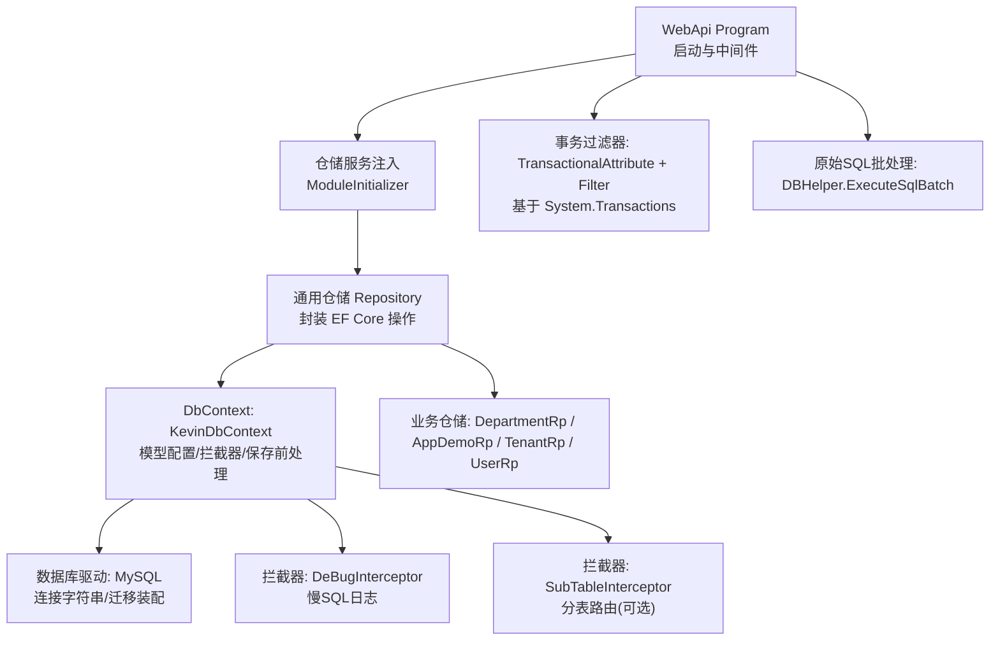
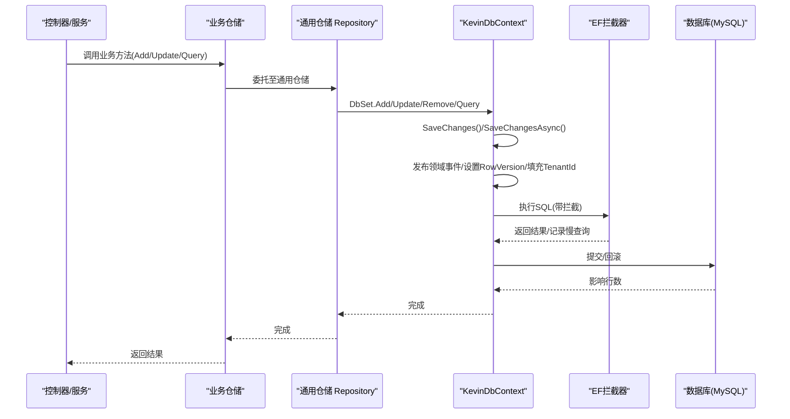
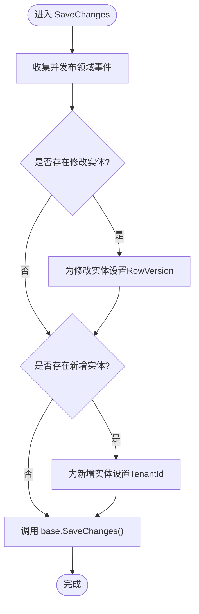
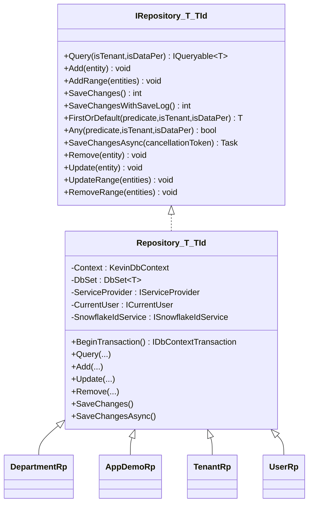
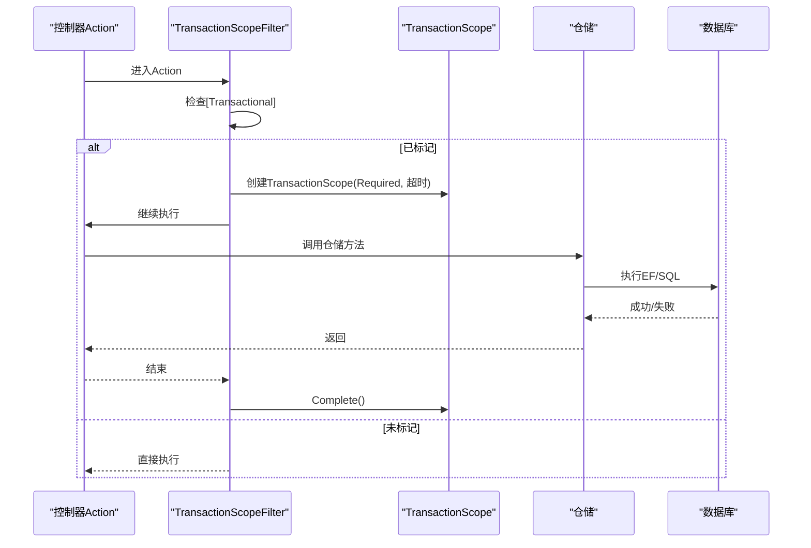
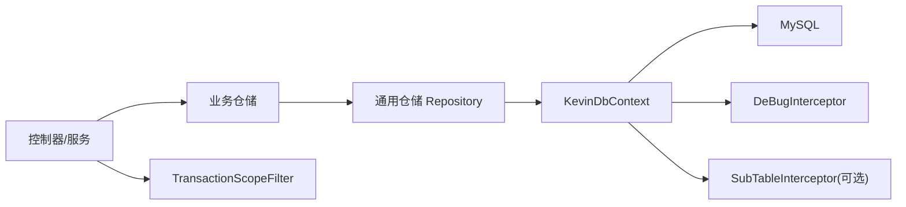

# 持久化流程

<cite>
**本文引用的文件**
- [KevinDbContext.cs](file://Kevin/ Kevin.EntityFrameworkCore /Database/KevinDbContext.cs)
- [Repository.cs](file://Kevin/ Kevin.EntityFrameworkCore /_/Data/Repository.cs)
- [IRepository`.cs](file://Kevin/ kevin.Share /Interfaces/IRepository`.cs)
- [IBaseRepository.cs](file://Kevin/ kevin.Share /Interfaces/IBaseRepository.cs)
- [DepartmentRp.cs](file://Kevin/ RepositorieRps /Repositories/Organizational/DepartmentRp.cs)
- [AppDemoRp.cs](file://App/ RepositorieRps /Repositories/v1/AppDemoRp.cs)
- [TenantRp.cs](file://Kevin/ RepositorieRps /Repositories/TenantRp.cs)
- [UserRp.cs](file://Kevin/ RepositorieRps /Repositories/UserRp.cs)
- [ModuleInitializer.cs](file://App/ RepositorieRps /ModuleInitializer.cs)
- [TransactionalAttribute.cs](file://Kevin/ Kevin.Web.Basics /Filters/TransactionScope/Attribute/TransactionalAttribute.cs)
- [TransactionScopeFilter.cs](file://Kevin/ Kevin.Web.Basics /Filters/TransactionScope/TransactionScopeFilter.cs)
- [DeBugInterceptor.cs](file://Kevin/ Kevin.EntityFrameworkCore /Interceptors/DeBugInterceptor.cs)
- [SubTableInterceptor.cs](file://Kevin/ Kevin.EntityFrameworkCore /Interceptors/SubTableInterceptor.cs)
- [DBHelper.cs](file://Kevin/ kevin.Module /Kevin.Common/Helper/DBHelper.cs)
- [Program.cs](file://App/ WebApi /Program.cs)
- [TUserConfiguration.cs](file://Kevin/ Kevin.EntityFrameworkCore /Configuration/TUserConfiguration.cs)
- [TUser.cs](file://Kevin/ Domain /Entities/TUser.cs)
</cite>

## 目录
1. [简介](#简介)
2. [项目结构](#项目结构)
3. [核心组件](#核心组件)
4. [架构总览](#架构总览)
5. [详细组件分析](#详细组件分析)
6. [依赖关系分析](#依赖关系分析)
7. [性能考虑](#性能考虑)
8. [故障排查指南](#故障排查指南)
9. [结论](#结论)
10. [附录](#附录)

## 简介
本文件面向 NetCoreKevin 框架的持久化层，系统化阐述从应用层到数据库的完整数据持久化流程。重点覆盖：
- Entity Framework Core 的配置与使用方式
- DbContext 生命周期管理与连接池配置
- 仓储模式（通用仓储与业务仓储）的设计与实现
- 事务管理机制（本地事务与分布式事务）
- 数据变更跟踪、批量操作与查询优化策略
- 持久化层的最佳实践与性能调优建议

## 项目结构
本项目采用分层与模块化组织，持久化相关代码主要分布在以下位置：
- 领域实体与配置：Domain/Entities、EntityFrameworkCore/Configuration
- 数据上下文与拦截器：EntityFrameworkCore/Database、EntityFrameworkCore/Interceptors
- 仓储接口与基类：kevin.Share/Interfaces、EntityFrameworkCore/_/Data
- 业务仓储实现：RepositorieRps/Repositories
- 模块初始化与服务注册：App.RepositorieRps/ModuleInitializer
- Web 层事务控制：Kevin.Web.Basics/Filters/TransactionScope
- 辅助工具：kevin.Module/Kevin.Common/Helper/DBHelper

图表来源
- [Program.cs:23-85](file://App/WebApi/Program.cs#L23-L85)
- [ModuleInitializer.cs:12-19](file://App/RepositorieRps/ModuleInitializer.cs#L12-L19)
- [Repository.cs:24-42](file://Kevin/ Kevin.EntityFrameworkCore /_/Data/Repository.cs#L24-L42)
- [KevinDbContext.cs:83-132](file://Kevin/ Kevin.EntityFrameworkCore /Database/KevinDbContext.cs#L83-L132)
- [DeBugInterceptor.cs:19-31](file://Kevin/ Kevin.EntityFrameworkCore /Interceptors/DeBugInterceptor.cs#L19-L31)
- [SubTableInterceptor.cs:12-39](file://Kevin/ Kevin.EntityFrameworkCore /Interceptors/SubTableInterceptor.cs#L12-L39)
- [DBHelper.cs:145-186](file://Kevin/ kevin.Module /Kevin.Common/Helper/DBHelper.cs#L145-L186)

章节来源
- [Program.cs:23-85](file://App/WebApi/Program.cs#L23-L85)
- [ModuleInitializer.cs:12-19](file://App/RepositorieRps/ModuleInitializer.cs#L12-L19)

## 核心组件
- DbContext：KevinDbContext 负责 EF Core 模型构建、全局配置、保存前处理（多租户、乐观并发、领域事件发布）、以及自定义 SaveChangesWithSaveLog 审计。
- 仓储基类：Repository<T, TId> 封装 DbSet 的增删改查、分页查询、事务 BeginTransaction、批量更新/删除等，并内置租户过滤与数据权限过滤。
- 业务仓储：各业务仓储继承 Repository<T, TId> 暴露领域语义方法（如 DepartmentRp、AppDemoRp、TenantRp、UserRp）。
- 事务控制：通过 ActionFilter 检测标记了 [Transactional] 的方法，使用 System.Transactions.TransactionScope 包裹执行；同时提供仓储级 IDbContextTransaction 用于细粒度事务。
- 拦截器：DeBugInterceptor 记录慢查询；SubTableInterceptor 支持按配置进行分表路由（当前默认未启用）。
- 原始 SQL：DBHelper 提供 ExecuteSql/ExecuteSqlBatch，便于在特定场景绕过 EF Core 直接执行 SQL。

章节来源
- [KevinDbContext.cs:83-132](file://Kevin/ Kevin.EntityFrameworkCore /Database/KevinDbContext.cs#L83-L132)
- [Repository.cs:24-173](file://Kevin/ Kevin.EntityFrameworkCore /_/Data/Repository.cs#L24-L173)
- [DepartmentRp.cs:5-10](file://Kevin/ RepositorieRps /Repositories/Organizational/DepartmentRp.cs#L5-L10)
- [AppDemoRp.cs:7-12](file://App/ RepositorieRps /Repositories/v1/AppDemoRp.cs#L7-L12)
- [TenantRp.cs:3-8](file://Kevin/ RepositorieRps /Repositories/TenantRp.cs#L3-L8)
- [UserRp.cs:4-9](file://Kevin/ RepositorieRps /Repositories/UserRp.cs#L4-L9)
- [TransactionalAttribute.cs:6-9](file://Kevin/ Kevin.Web.Basics /Filters/TransactionScope/Attribute/TransactionalAttribute.cs#L6-L9)
- [TransactionScopeFilter.cs:12-32](file://Kevin/ Kevin.Web.Basics /Filters/TransactionScope/TransactionScopeFilter.cs#L12-L32)
- [DeBugInterceptor.cs:19-31](file://Kevin/ Kevin.EntityFrameworkCore /Interceptors/DeBugInterceptor.cs#L19-L31)
- [SubTableInterceptor.cs:12-39](file://Kevin/ Kevin.EntityFrameworkCore /Interceptors/SubTableInterceptor.cs#L12-L39)
- [DBHelper.cs:145-186](file://Kevin/ kevin.Module /Kevin.Common/Helper/DBHelper.cs#L145-L186)

## 架构总览
下图展示了从控制器调用到数据库写入的端到端流程，包括仓储、DbContext、拦截器与事务控制。

图表来源
- [Repository.cs:54-149](file://Kevin/ Kevin.EntityFrameworkCore /_/Data/Repository.cs#L54-L149)
- [KevinDbContext.cs:405-484](file://Kevin/ Kevin.EntityFrameworkCore /Database/KevinDbContext.cs#L405-L484)
- [DeBugInterceptor.cs:19-31](file://Kevin/ Kevin.EntityFrameworkCore /Interceptors/DeBugInterceptor.cs#L19-L31)
- [KevinDbContext.cs:83-132](file://Kevin/ Kevin.EntityFrameworkCore /Database/KevinDbContext.cs#L83-L132)

## 详细组件分析

### DbContext 配置与生命周期
- 连接与驱动：在 GetDbContextOptions 中读取连接字符串并配置 MySQL 驱动，指定迁移程序集与历史表名。
- 全局配置：OnModelCreating 中统一设置表名前缀、字段名小写、注释、类型映射（bool->bit、Guid->char(36)），并为默认索引列添加索引。
- 种子数据：集中 ApplyConfiguration 注册种子数据配置。
- 保存前处理：
  - 发布领域事件（基于 MediatR）
  - 修改时自动刷新 RowVersion（乐观并发）
  - 新增时自动填充 TenantId（多租户）
- 审计：SaveChangesWithSaveLog 对比旧值与新值，记录变更日志。

图表来源
- [KevinDbContext.cs:405-484](file://Kevin/ Kevin.EntityFrameworkCore /Database/KevinDbContext.cs#L405-L484)
- [KevinDbContext.cs:165-303](file://Kevin/ Kevin.EntityFrameworkCore /Database/KevinDbContext.cs#L165-L303)

章节来源
- [KevinDbContext.cs:83-132](file://Kevin/ Kevin.EntityFrameworkCore /Database/KevinDbContext.cs#L83-L132)
- [KevinDbContext.cs:165-303](file://Kevin/ Kevin.EntityFrameworkCore /Database/KevinDbContext.cs#L165-L303)
- [KevinDbContext.cs:405-484](file://Kevin/ Kevin.EntityFrameworkCore /Database/KevinDbContext.cs#L405-L484)
- [TUserConfiguration.cs:8-16](file://Kevin/ Kevin.EntityFrameworkCore /Configuration/TUserConfiguration.cs#L8-L16)

### 仓储模式设计
- 接口定义：IRepository<T, TId> 定义通用 CRUD、批量操作、异步保存、条件查询（支持租户与数据权限）。
- 基类实现：Repository<T, TId> 通过 IServiceProvider 获取 DbContext、CurrentUser、SnowflakeIdService，封装常用操作，并提供 BeginTransaction。
- 业务仓储：每个业务仓储继承 Repository<T, TId>，可在此基础上扩展领域方法。
- 服务注册：ModuleInitializer 使用 BatchAddScopeds 将仓储以 Scoped 生命周期批量注册，便于请求级隔离。

图表来源
- [IRepository`.cs:11-36](file://Kevin/ kevin.Share /Interfaces/IRepository`.cs#L11-L36)
- [Repository.cs:22-173](file://Kevin/ Kevin.EntityFrameworkCore /_/Data/Repository.cs#L22-L173)
- [DepartmentRp.cs:5-10](file://Kevin/ RepositorieRps /Repositories/Organizational/DepartmentRp.cs#L5-L10)
- [AppDemoRp.cs:7-12](file://App/ RepositorieRps /Repositories/v1/AppDemoRp.cs#L7-L12)
- [TenantRp.cs:3-8](file://Kevin/ RepositorieRps /Repositories/TenantRp.cs#L3-L8)
- [UserRp.cs:4-9](file://Kevin/ RepositorieRps /Repositories/UserRp.cs#L4-L9)

章节来源
- [IRepository`.cs:11-36](file://Kevin/ kevin.Share /Interfaces/IRepository`.cs#L11-L36)
- [Repository.cs:24-173](file://Kevin/ Kevin.EntityFrameworkCore /_/Data/Repository.cs#L24-L173)
- [ModuleInitializer.cs:12-19](file://App/RepositorieRps/ModuleInitializer.cs#L12-L19)

### 事务管理
- 控制器级事务：通过 [Transactional] 属性配合 TransactionScopeFilter，在 Action 执行期间开启 System.Transactions.TransactionScope，超时默认10分钟，支持异步流。
- 仓储级事务：Repository.BeginTransaction 返回 IDbContextTransaction，可在仓储内部组合多个 EF 操作为一个原子单元。
- 分布式事务：项目文档提及 CAP + RabbitMQ 能力，可用于跨服务的一致性保障；具体集成需结合 CAP 订阅/发布与消息持久化策略。

图表来源
- [TransactionalAttribute.cs:6-9](file://Kevin/ Kevin.Web.Basics /Filters/TransactionScope/Attribute/TransactionalAttribute.cs#L6-L9)
- [TransactionScopeFilter.cs:12-32](file://Kevin/ Kevin.Web.Basics /Filters/TransactionScope/TransactionScopeFilter.cs#L12-L32)
- [Repository.cs:132-135](file://Kevin/ Kevin.EntityFrameworkCore /_/Data/Repository.cs#L132-L135)

章节来源
- [TransactionalAttribute.cs:6-9](file://Kevin/ Kevin.Web.Basics /Filters/TransactionScope/Attribute/TransactionalAttribute.cs#L6-L9)
- [TransactionScopeFilter.cs:12-32](file://Kevin/ Kevin.Web.Basics /Filters/TransactionScope/TransactionScopeFilter.cs#L12-L32)
- [Repository.cs:132-135](file://Kevin/ Kevin.EntityFrameworkCore /_/Data/Repository.cs#L132-L135)

### 数据变更跟踪与优化
- 变更跟踪增强：
  - 修改实体自动设置 RowVersion 实现乐观并发
  - 新增实体自动填充 TenantId 实现多租户隔离
  - 领域事件在 SaveChanges 前后发布，解耦副作用逻辑
- 审计：SaveChangesWithSaveLog 对比原值与新值，记录变更明细到日志表。
- 批量操作：
  - AddRange/UpdateRange/RemoveRange 减少往返次数
  - DBHelper.ExecuteSqlBatch 用于绕过 EF 的超大批量 SQL 执行
- 查询优化：
  - 默认索引列配置（DBDefaultHasIndexFields）
  - 租户与数据权限表达式自动拼接，避免全表扫描
  - 慢查询拦截器输出耗时与 SQL，辅助定位瓶颈

章节来源
- [KevinDbContext.cs:405-484](file://Kevin/ Kevin.EntityFrameworkCore /Database/KevinDbContext.cs#L405-L484)
- [KevinDbContext.cs:525-583](file://Kevin/ Kevin.EntityFrameworkCore /Database/KevinDbContext.cs#L525-L583)
- [Repository.cs:63-121](file://Kevin/ Kevin.EntityFrameworkCore /_/Data/Repository.cs#L63-L121)
- [DBHelper.cs:145-186](file://Kevin/ kevin.Module /Kevin.Common/Helper/DBHelper.cs#L145-L186)
- [DeBugInterceptor.cs:19-31](file://Kevin/ Kevin.EntityFrameworkCore /Interceptors/DeBugInterceptor.cs#L19-L31)

### 实体与配置示例
- 实体：TUser 展示基础字段、描述注解、密码哈希方法与删除校验。
- 配置：TUserConfiguration 使用 HasData 注入种子数据，体现 EF Core 配置分离与可维护性。

章节来源
- [TUser.cs:9-95](file://Kevin/ Domain /Entities/TUser.cs#L9-L95)
- [TUserConfiguration.cs:8-16](file://Kevin/ Kevin.EntityFrameworkCore /Configuration/TUserConfiguration.cs#L8-L16)

## 依赖关系分析
- 服务注册：ModuleInitializer 通过 IocHelper.BatchAddScopeds 将仓储以 Scoped 生命周期批量注入，确保每个请求拥有独立的 DbContext 实例。
- 依赖链：
  - 控制器/服务 -> 业务仓储 -> 通用仓储 -> DbContext -> 数据库
  - 拦截器作为横切关注点嵌入 EF 执行管道
  - 事务过滤器在控制器层包装执行上下文

图表来源
- [ModuleInitializer.cs:12-19](file://App/RepositorieRps/ModuleInitializer.cs#L12-L19)
- [Repository.cs:24-42](file://Kevin/ Kevin.EntityFrameworkCore /_/Data/Repository.cs#L24-L42)
- [KevinDbContext.cs:83-132](file://Kevin/ Kevin.EntityFrameworkCore /Database/KevinDbContext.cs#L83-L132)
- [DeBugInterceptor.cs:19-31](file://Kevin/ Kevin.EntityFrameworkCore /Interceptors/DeBugInterceptor.cs#L19-L31)
- [SubTableInterceptor.cs:12-39](file://Kevin/ Kevin.EntityFrameworkCore /Interceptors/SubTableInterceptor.cs#L12-L39)
- [TransactionScopeFilter.cs:12-32](file://Kevin/ Kevin.Web.Basics /Filters/TransactionScope/TransactionScopeFilter.cs#L12-L32)

章节来源
- [ModuleInitializer.cs:12-19](file://App/RepositorieRps/ModuleInitializer.cs#L12-L19)

## 性能考虑
- 连接池与驱动：
  - 使用 MySQL 驱动并在连接字符串中合理设置最大连接数（例如 Max Pool Size），避免连接耗尽
  - 根据负载调整命令超时与连接超时
- 查询优化：
  - 利用默认索引列配置减少热点字段扫描
  - 合理使用 Query 的 isTenant/isDataPer 参数，避免不必要的权限过滤
  - 使用 AsNoTracking 提升只读查询性能（可在仓储扩展中引入）
- 批量操作：
  - 优先使用 AddRange/UpdateRange/RemoveRange
  - 超大数据量时使用 DBHelper.ExecuteSqlBatch 或分片提交
- 慢查询监控：
  - 借助 DeBugInterceptor 捕获超过阈值的 SQL 并输出日志
  - 结合数据库慢查询日志与执行计划分析
- 事务边界：
  - 尽量缩小事务范围，避免长事务持有锁
  - 对跨服务的强一致性需求，结合 CAP 与消息队列实现最终一致

## 故障排查指南
- 慢查询问题：
  - 查看 DeBugInterceptor 输出的慢查询日志，定位高耗时 SQL
  - 检查是否缺少索引或存在 N+1 查询
- 事务异常：
  - 确认控制器方法是否正确标注 [Transactional]
  - 检查仓储内手动事务与外层事务的嵌套行为
- 多租户数据污染：
  - 确认 CurrentUser.TenantId 是否正确注入
  - 检查 Query 的 isTenant 参数是否被误关闭
- 乐观并发冲突：
  - 检查实体是否包含 RowVersion 字段
  - 确认并发更新时的版本号是否正确传递
- 分表路由异常：
  - 若启用 SubTableInterceptor，检查 subtablesettings.json 配置与 SQL 匹配规则

章节来源
- [DeBugInterceptor.cs:19-31](file://Kevin/ Kevin.EntityFrameworkCore /Interceptors/DeBugInterceptor.cs#L19-L31)
- [TransactionScopeFilter.cs:12-32](file://Kevin/ Kevin.Web.Basics /Filters/TransactionScope/TransactionScopeFilter.cs#L12-L32)
- [Repository.cs:63-121](file://Kevin/ Kevin.EntityFrameworkCore /_/Data/Repository.cs#L63-L121)
- [KevinDbContext.cs:405-484](file://Kevin/ Kevin.EntityFrameworkCore /Database/KevinDbContext.cs#L405-L484)
- [SubTableInterceptor.cs:12-39](file://Kevin/ Kevin.EntityFrameworkCore /Interceptors/SubTableInterceptor.cs#L12-L39)

## 结论
NetCoreKevin 的持久化层以 EF Core 为核心，通过 DbContext 的全局配置与拦截器机制，实现了多租户、乐观并发、领域事件与审计的统一处理。仓储模式提供了清晰的抽象与复用能力，结合控制器级事务与仓储级事务，满足多种一致性需求。通过默认索引、批量操作与慢查询监控等手段，系统具备良好的可扩展性与性能基础。建议在大规模数据场景下结合 CAP 与消息队列实现分布式一致性，并持续优化查询与事务边界。

## 附录
- 关键路径参考：
  - 启动与中间件：[Program.cs:23-85](file://App/WebApi/Program.cs#L23-L85)
  - 仓储服务注入：[ModuleInitializer.cs:12-19](file://App/RepositorieRps/ModuleInitializer.cs#L12-L19)
  - 仓储基类实现：[Repository.cs:24-173](file://Kevin/ Kevin.EntityFrameworkCore /_/Data/Repository.cs#L24-L173)
  - DbContext 配置与保存：[KevinDbContext.cs:83-132](file://Kevin/ Kevin.EntityFrameworkCore /Database/KevinDbContext.cs#L83-L132), [KevinDbContext.cs:405-484](file://Kevin/ Kevin.EntityFrameworkCore /Database/KevinDbContext.cs#L405-L484)
  - 事务控制：[TransactionalAttribute.cs:6-9](file://Kevin/ Kevin.Web.Basics /Filters/TransactionScope/Attribute/TransactionalAttribute.cs#L6-L9), [TransactionScopeFilter.cs:12-32](file://Kevin/ Kevin.Web.Basics /Filters/TransactionScope/TransactionScopeFilter.cs#L12-L32)
  - 拦截器：[DeBugInterceptor.cs:19-31](file://Kevin/ Kevin.EntityFrameworkCore /Interceptors/DeBugInterceptor.cs#L19-L31), [SubTableInterceptor.cs:12-39](file://Kevin/ Kevin.EntityFrameworkCore /Interceptors/SubTableInterceptor.cs#L12-L39)
  - 原始SQL批处理：[DBHelper.cs:145-186](file://Kevin/ kevin.Module /Kevin.Common/Helper/DBHelper.cs#L145-L186)
  - 实体与配置：[TUser.cs:9-95](file://Kevin/ Domain /Entities/TUser.cs#L9-L95), [TUserConfiguration.cs:8-16](file://Kevin/ Kevin.EntityFrameworkCore /Configuration/TUserConfiguration.cs#L8-L16)