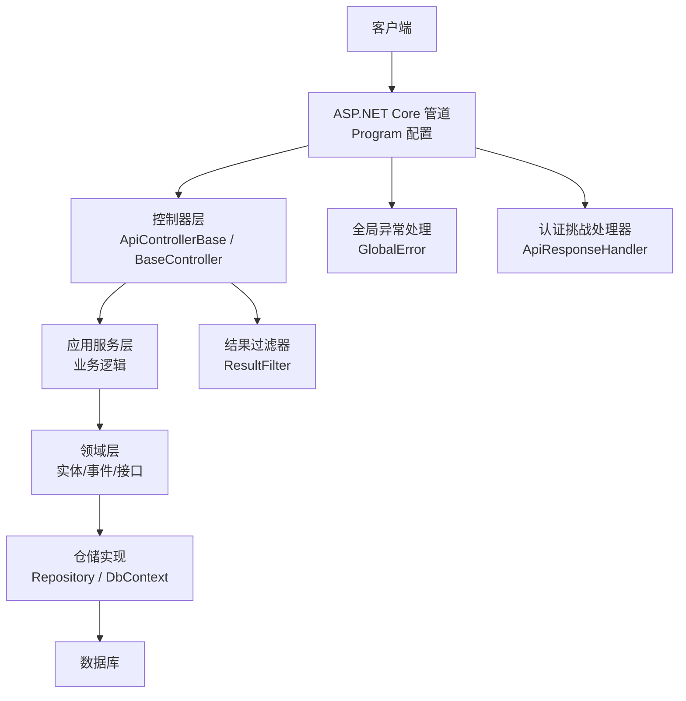
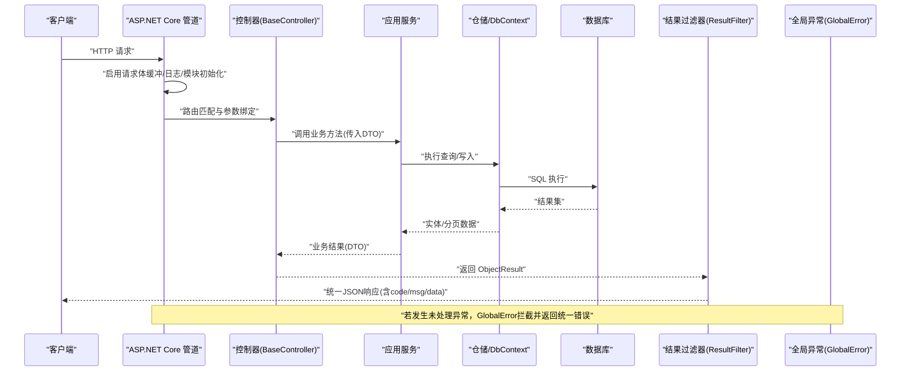
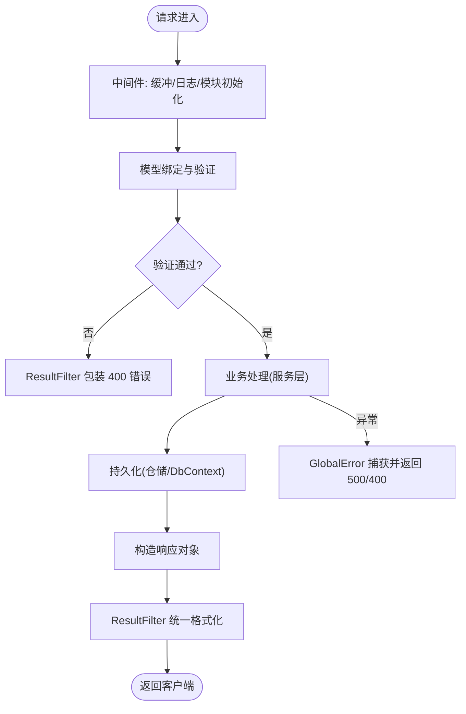
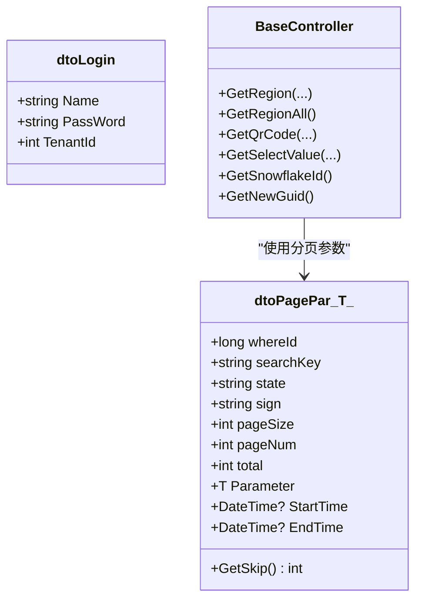
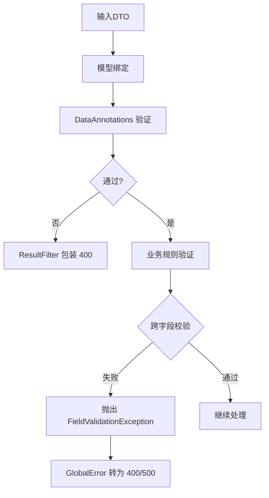
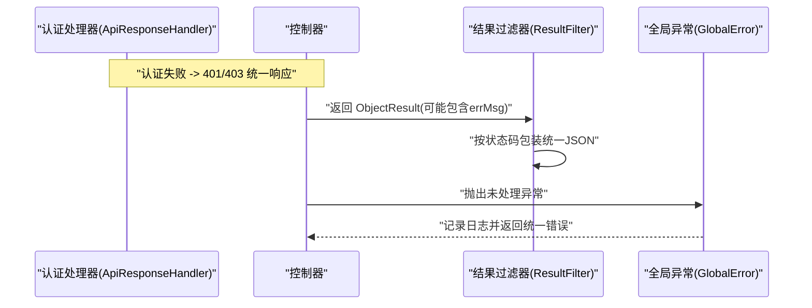
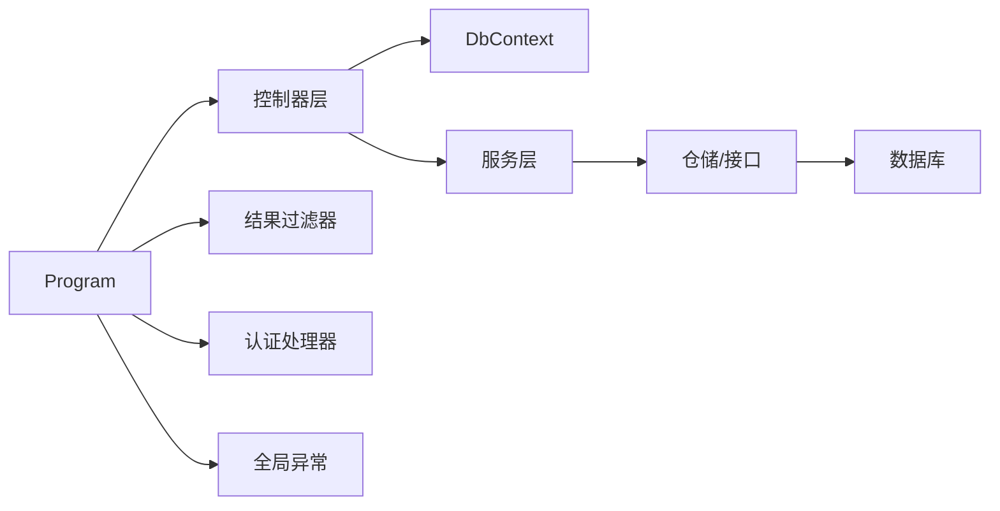

# 数据流设计

<cite>
**本文引用的文件**
- [Program.cs](file://App/WebApi/Program.cs)
- [ApiControllerBase.cs](file://Kevin/Kevin.Web.Basics/Controllers/ApiControllerBase.cs)
- [BaseController.cs](file://Kevin/Kevin.Web.Basics/Controllers/BaseController.cs)
- [ResultFilter.cs](file://Kevin/Kevin.Web.Basics/Filters/ResultFilter.cs)
- [ApiResponseHandler.cs](file://Kevin/Domain/Auth/ApiResponseHandler.cs)
- [GlobalError.cs](file://Kevin/kevin.Module/Kevin.Common/App/Global/GlobalError.cs)
- [FieldValidationException.cs](file://Kevin/kevin.Share/FieldValidationException.cs)
- [EnumOfAttribute.cs](file://Kevin/kevin.Module/Kevin.Common/Validator/EnumOfAttribute.cs)
- [dtoLogin.cs](file://Kevin/kevin.Share/Dtos/dtoLogin.cs)
- [dtoPagePar.cs](file://Kevin/kevin.Share/Dtos/dtoPagePar.cs)
</cite>

## 目录
1. [简介](#简介)
2. [项目结构](#项目结构)
3. [核心组件](#核心组件)
4. [架构总览](#架构总览)
5. [详细组件分析](#详细组件分析)
6. [依赖关系分析](#依赖关系分析)
7. [性能考虑](#性能考虑)
8. [故障排查指南](#故障排查指南)
9. [结论](#结论)
10. [附录](#附录)

## 简介
本文件面向 NetCoreKevin 框架，系统化描述从 HTTP 请求进入 ASP.NET Core 管道到响应返回的完整数据流转过程。内容覆盖：
- 请求解析、参数绑定与模型验证
- 业务处理与服务调用
- 数据持久化（EF Core）
- 统一响应序列化与错误包装
- DTO 在各层间的传递方式
- 异常处理流程（从底层异常到上层错误响应）
- 数据流图与不同请求类型的处理路径
- 性能优化建议与最佳实践

## 项目结构
本项目采用分层架构：Web API 入口在 App/WebApi；基础控制器与过滤器位于 Kevin/Kevin.Web.Basics；领域实体、服务接口与仓储接口位于 Domain；共享 DTO、校验器与全局异常处理位于 kevin.Share 与 Kevin.Common。

图表来源
- [Program.cs:23-85](file://App/WebApi/Program.cs#L23-L85)
- [ApiControllerBase.cs:9-20](file://Kevin/Kevin.Web.Basics/Controllers/ApiControllerBase.cs#L9-L20)
- [BaseController.cs:14-17](file://Kevin/Kevin.Web.Basics/Controllers/BaseController.cs#L14-L17)
- [ResultFilter.cs:13-145](file://Kevin/Kevin.Web.Basics/Filters/ResultFilter.cs#L13-L145)
- [GlobalError.cs:16-65](file://Kevin/kevin.Module/Kevin.Common/App/Global/GlobalError.cs#L16-L65)
- [ApiResponseHandler.cs:23-32](file://Kevin/Domain/Auth/ApiResponseHandler.cs#L23-L32)

章节来源
- [Program.cs:23-85](file://App/WebApi/Program.cs#L23-L85)

## 核心组件
- 程序启动与管道配置：Program 中启用日志、控制器、异常处理中间件、缓存与 Kevin 模块初始化，并开启请求体缓冲以便多次读取。
- 控制器基类：ApiControllerBase 提供 EF Core 上下文、当前用户、配置与分布式锁等常用能力注入；BaseController 继承并暴露通用端点。
- 结果过滤器：ResultFilter 对 ObjectResult 进行空值规范化，并将不同状态码转换为统一 JSON 响应格式。
- 认证挑战处理器：ApiResponseHandler 将未授权/禁止访问转换为统一 JSON 401/403 响应。
- 全局异常处理：GlobalError 捕获未处理异常，记录日志，区分友好异常与系统异常，输出统一错误响应。
- 验证机制：使用 DataAnnotations 与自定义验证特性（如枚举校验、非空校验），结合 FieldValidationException 表达字段级错误。
- DTO：统一的输入输出模型，如 dtoLogin（带 Required 校验）、dtoPagePar（分页参数封装）。

章节来源
- [Program.cs:23-85](file://App/WebApi/Program.cs#L23-L85)
- [ApiControllerBase.cs:9-20](file://Kevin/Kevin.Web.Basics/Controllers/ApiControllerBase.cs#L9-L20)
- [BaseController.cs:14-17](file://Kevin/Kevin.Web.Basics/Controllers/BaseController.cs#L14-L17)
- [ResultFilter.cs:13-145](file://Kevin/Kevin.Web.Basics/Filters/ResultFilter.cs#L13-L145)
- [ApiResponseHandler.cs:23-32](file://Kevin/Domain/Auth/ApiResponseHandler.cs#L23-L32)
- [GlobalError.cs:16-65](file://Kevin/kevin.Module/Kevin.Common/App/Global/GlobalError.cs#L16-L65)
- [EnumOfAttribute.cs:8-46](file://Kevin/kevin.Module/Kevin.Common/Validator/EnumOfAttribute.cs#L8-L46)
- [FieldValidationException.cs:5-18](file://Kevin/kevin.Share/FieldValidationException.cs#L5-L18)
- [dtoLogin.cs:9-37](file://Kevin/kevin.Share/Dtos/dtoLogin.cs#L9-L37)
- [dtoPagePar.cs:3-48](file://Kevin/kevin.Share/Dtos/dtoPagePar.cs#L3-L48)

## 架构总览
下图展示一次典型 REST 请求的数据流：从 Kestrel 接收请求，经过中间件、控制器、服务、仓储、数据库，再到统一的结果过滤与异常处理，最终返回标准化响应。

图表来源
- [Program.cs:23-85](file://App/WebApi/Program.cs#L23-L85)
- [BaseController.cs:14-17](file://Kevin/Kevin.Web.Basics/Controllers/BaseController.cs#L14-L17)
- [ResultFilter.cs:111-145](file://Kevin/Kevin.Web.Basics/Filters/ResultFilter.cs#L111-L145)
- [GlobalError.cs:16-65](file://Kevin/kevin.Module/Kevin.Common/App/Global/GlobalError.cs#L16-L65)

## 详细组件分析

### 请求生命周期与数据流
- 启动阶段：Program 设置环境、注册日志、构建服务容器、添加控制器、启用异常处理中间件、初始化 Kevin 模块。
- 请求阶段：管道启用请求体缓冲，确保后续可重复读取；路由匹配到控制器动作；模型绑定与验证；调用服务；持久化；返回结果。
- 响应阶段：ResultFilter 对返回值进行空值归一化，并按状态码包装为统一 JSON；认证失败由 ApiResponseHandler 返回统一 401/403；未处理异常由 GlobalError 捕获并返回统一错误。

图表来源
- [Program.cs:59-85](file://App/WebApi/Program.cs#L59-L85)
- [ResultFilter.cs:111-145](file://Kevin/Kevin.Web.Basics/Filters/ResultFilter.cs#L111-L145)
- [GlobalError.cs:16-65](file://Kevin/kevin.Module/Kevin.Common/App/Global/GlobalError.cs#L16-L65)

章节来源
- [Program.cs:23-85](file://App/WebApi/Program.cs#L23-L85)
- [ResultFilter.cs:111-145](file://Kevin/Kevin.Web.Basics/Filters/ResultFilter.cs#L111-L145)
- [GlobalError.cs:16-65](file://Kevin/kevin.Module/Kevin.Common/App/Global/GlobalError.cs#L16-L65)

### DTO 设计与跨层传递
- 输入 DTO：以 dtoLogin 为例，使用 DataAnnotations 标注必填项，便于模型绑定阶段的自动验证。
- 分页 DTO：dtoPagePar<T> 封装分页参数、搜索条件、时间范围与自定义参数，便于服务层复用。
- 传递方式：
  - 控制器动作参数或FromBody 接收 DTO
  - 服务层接收 DTO，进行业务规则校验与转换
  - 仓储层操作实体，必要时再映射为 DTO 返回
  - ResultFilter 将任意对象序列化为统一 JSON 结构

图表来源
- [dtoLogin.cs:9-37](file://Kevin/kevin.Share/Dtos/dtoLogin.cs#L9-L37)
- [dtoPagePar.cs:3-48](file://Kevin/kevin.Share/Dtos/dtoPagePar.cs#L3-L48)
- [BaseController.cs:46-145](file://Kevin/Kevin.Web.Basics/Controllers/BaseController.cs#L46-L145)

章节来源
- [dtoLogin.cs:9-37](file://Kevin/kevin.Share/Dtos/dtoLogin.cs#L9-L37)
- [dtoPagePar.cs:3-48](file://Kevin/kevin.Share/Dtos/dtoPagePar.cs#L3-L48)
- [BaseController.cs:46-145](file://Kevin/Kevin.Web.Basics/Controllers/BaseController.cs#L46-L145)

### 数据验证机制
- 模型验证：基于 DataAnnotations（如 Required），在模型绑定后自动执行，失败时 ResultFilter 会将其包装为 400 错误响应。
- 业务规则验证：在服务层进行复杂规则检查，可抛出 FieldValidationException 表达字段级错误。
- 跨字段验证：可在服务层组合多个字段进行校验（例如密码与确认密码一致性），并通过 FieldValidationException 返回具体信息。
- 自定义验证特性：如 EnumOfAttribute 用于枚举值校验，NotNullOrEmptyAttribute 用于非空校验，增强声明式验证能力。

图表来源
- [EnumOfAttribute.cs:8-46](file://Kevin/kevin.Module/Kevin.Common/Validator/EnumOfAttribute.cs#L8-L46)
- [FieldValidationException.cs:5-18](file://Kevin/kevin.Share/FieldValidationException.cs#L5-L18)
- [ResultFilter.cs:111-145](file://Kevin/Kevin.Web.Basics/Filters/ResultFilter.cs#L111-L145)
- [GlobalError.cs:16-65](file://Kevin/kevin.Module/Kevin.Common/App/Global/GlobalError.cs#L16-L65)

章节来源
- [EnumOfAttribute.cs:8-46](file://Kevin/kevin.Module/Kevin.Common/Validator/EnumOfAttribute.cs#L8-L46)
- [FieldValidationException.cs:5-18](file://Kevin/kevin.Share/FieldValidationException.cs#L5-L18)
- [ResultFilter.cs:111-145](file://Kevin/Kevin.Web.Basics/Filters/ResultFilter.cs#L111-L145)
- [GlobalError.cs:16-65](file://Kevin/kevin.Module/Kevin.Common/App/Global/GlobalError.cs#L16-L65)

### 异常处理流程
- 认证失败：ApiResponseHandler 将未认证/禁止访问转换为统一 JSON 401/403 响应。
- 模型验证失败：ResultFilter 根据状态码与 Items 中的错误信息包装为 400 响应。
- 业务异常：服务层抛出 FieldValidationException 或 UserFriendlyException，GlobalError 识别并返回 400；其他异常返回 500。
- 未处理异常：GlobalError 捕获并记录日志，输出统一错误响应。

图表来源
- [ApiResponseHandler.cs:23-32](file://Kevin/Domain/Auth/ApiResponseHandler.cs#L23-L32)
- [ResultFilter.cs:111-145](file://Kevin/Kevin.Web.Basics/Filters/ResultFilter.cs#L111-L145)
- [GlobalError.cs:16-65](file://Kevin/kevin.Module/Kevin.Common/App/Global/GlobalError.cs#L16-L65)

章节来源
- [ApiResponseHandler.cs:23-32](file://Kevin/Domain/Auth/ApiResponseHandler.cs#L23-L32)
- [ResultFilter.cs:111-145](file://Kevin/Kevin.Web.Basics/Filters/ResultFilter.cs#L111-L145)
- [GlobalError.cs:16-65](file://Kevin/kevin.Module/Kevin.Common/App/Global/GlobalError.cs#L16-L65)

### 数据持久化与实体映射
- 控制器基类提供 EF Core 上下文（db），可直接在控制器中进行简单查询（如区域数据）。
- 推荐模式：控制器仅做参数接收与结果包装，业务逻辑下沉至服务层，数据访问通过仓储接口与 DbContext 完成。
- 分页场景：使用 dtoPagePar<T> 封装分页参数，服务层计算 Skip/Take 并返回分页结果。

章节来源
- [ApiControllerBase.cs:9-20](file://Kevin/Kevin.Web.Basics/Controllers/ApiControllerBase.cs#L9-L20)
- [BaseController.cs:46-92](file://Kevin/Kevin.Web.Basics/Controllers/BaseController.cs#L46-L92)
- [dtoPagePar.cs:3-48](file://Kevin/kevin.Share/Dtos/dtoPagePar.cs#L3-L48)

## 依赖关系分析
- Program 依赖日志、配置、控制器、异常处理中间件与 Kevin 模块初始化。
- 控制器依赖 DbContext、CurrentUser、Configuration、分布式锁等基础设施。
- 过滤器依赖 HttpContext 与统一 JSON 工具，负责响应包装。
- 认证处理器依赖 ASP.NET Core 认证管线，负责统一 401/403 响应。
- 全局异常处理依赖日志与 HttpContextAccessor，负责统一错误响应。

图表来源
- [Program.cs:23-85](file://App/WebApi/Program.cs#L23-L85)
- [ApiControllerBase.cs:9-20](file://Kevin/Kevin.Web.Basics/Controllers/ApiControllerBase.cs#L9-L20)
- [ResultFilter.cs:111-145](file://Kevin/Kevin.Web.Basics/Filters/ResultFilter.cs#L111-L145)
- [ApiResponseHandler.cs:23-32](file://Kevin/Domain/Auth/ApiResponseHandler.cs#L23-L32)
- [GlobalError.cs:16-65](file://Kevin/kevin.Module/Kevin.Common/App/Global/GlobalError.cs#L16-L65)

章节来源
- [Program.cs:23-85](file://App/WebApi/Program.cs#L23-L85)
- [ApiControllerBase.cs:9-20](file://Kevin/Kevin.Web.Basics/Controllers/ApiControllerBase.cs#L9-L20)

## 性能考虑
- 请求体缓冲：Program 中启用缓冲以支持多次读取，注意在高吞吐场景下避免过大 Body 导致内存压力。
- 响应序列化：ResultFilter 递归处理对象属性，建议在复杂对象上减少深层嵌套，或使用投影 DTO 降低反射开销。
- 数据库访问：优先使用投影与分页（dtoPagePar），避免全表扫描与 N+1 查询。
- 日志与调试：仅在必要位置记录关键日志，避免高频 IO。
- 缓存策略：对热点字典、配置等数据引入缓存，减少数据库压力。
- GC 限制：Program 中设置了堆硬限制，需结合实际负载调优。

[本节为通用性能建议，不直接分析具体文件]

## 故障排查指南
- 400 错误：常见于模型验证失败或业务规则校验失败。检查 DTO 上的验证注解与服务层抛出的 FieldValidationException。
- 401/403 错误：认证或权限问题。检查 Authorization 头与权限配置，确认 ApiResponseHandler 是否被正确触发。
- 500 错误：系统内部异常。查看 GlobalError 记录的日志与请求参数，定位异常栈。
- 响应为空：ResultFilter 会将 null 字符串置为空串、null List 实例化为空集合，确保前端稳定消费。

章节来源
- [ResultFilter.cs:111-145](file://Kevin/Kevin.Web.Basics/Filters/ResultFilter.cs#L111-L145)
- [ApiResponseHandler.cs:23-32](file://Kevin/Domain/Auth/ApiResponseHandler.cs#L23-L32)
- [GlobalError.cs:16-65](file://Kevin/kevin.Module/Kevin.Common/App/Global/GlobalError.cs#L16-L65)
- [FieldValidationException.cs:5-18](file://Kevin/kevin.Share/FieldValidationException.cs#L5-L18)

## 结论
NetCoreKevin 框架通过清晰的层次划分与统一的中间件机制，实现了从请求到响应的标准化数据流。借助 DTO、验证特性与统一过滤器/异常处理，系统在易用性、一致性与可维护性方面具备良好基础。建议在实际项目中遵循“控制器薄、服务厚”的原则，合理拆分职责，持续优化数据访问与响应序列化路径，以获得更佳的稳定性与性能表现。

## 附录
- 统一响应结构：包含 code、IsSuccess、msg、data（或 errMsg）字段，便于前端统一处理。
- 分页参数：dtoPagePar<T> 提供 GetSkip 等方法简化分页计算。
- 登录 DTO：dtoLogin 使用 Required 注解确保必填字段完整性。

章节来源
- [ResultFilter.cs:111-145](file://Kevin/Kevin.Web.Basics/Filters/ResultFilter.cs#L111-L145)
- [dtoPagePar.cs:3-48](file://Kevin/kevin.Share/Dtos/dtoPagePar.cs#L3-L48)
- [dtoLogin.cs:9-37](file://Kevin/kevin.Share/Dtos/dtoLogin.cs#L9-L37)