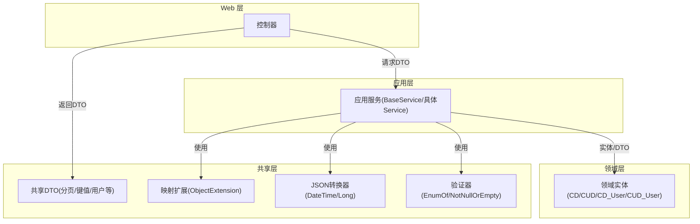
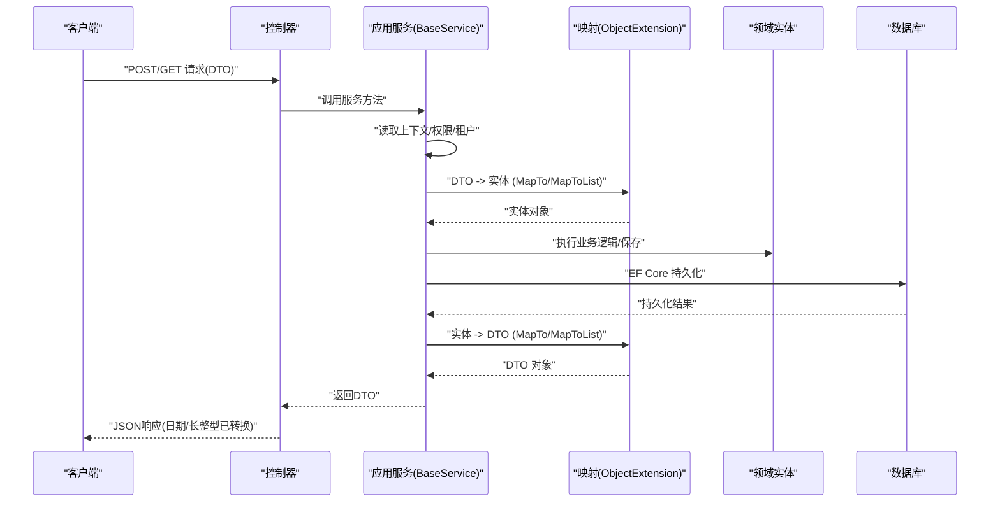
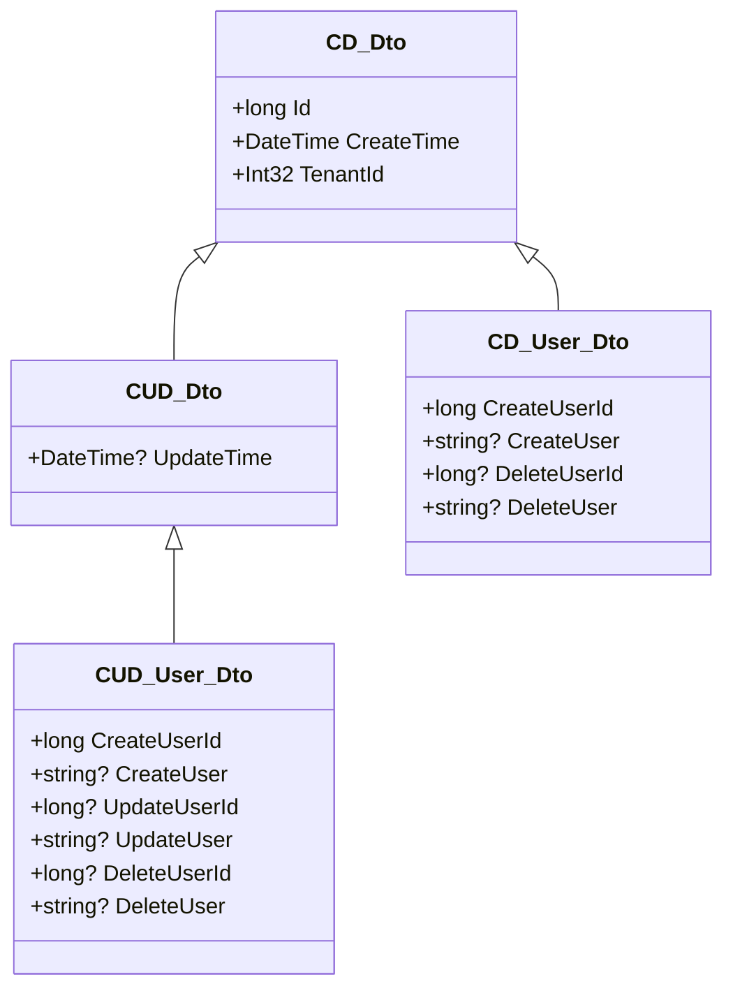
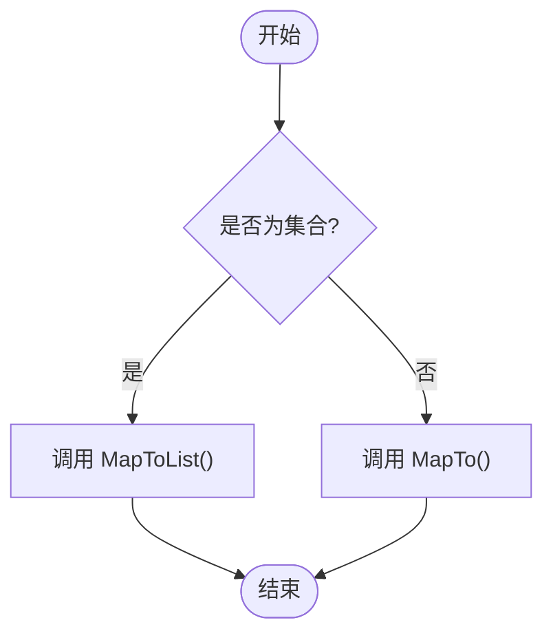
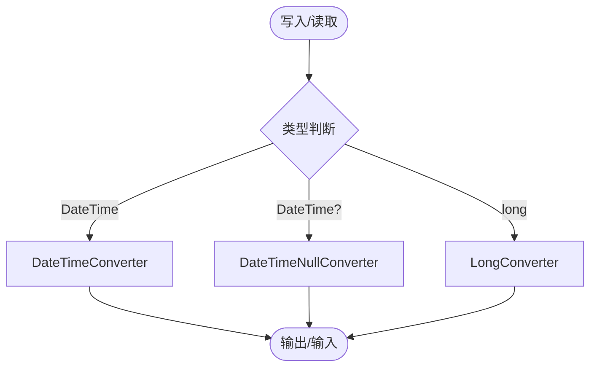
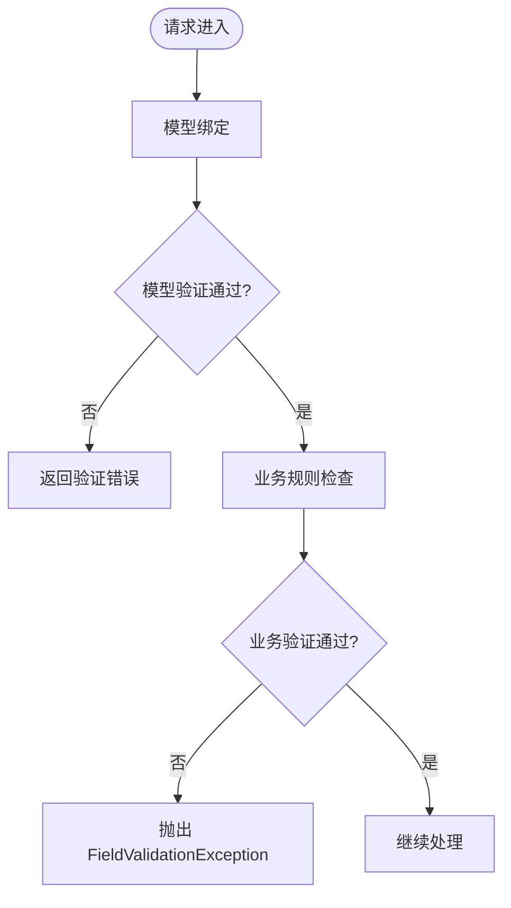
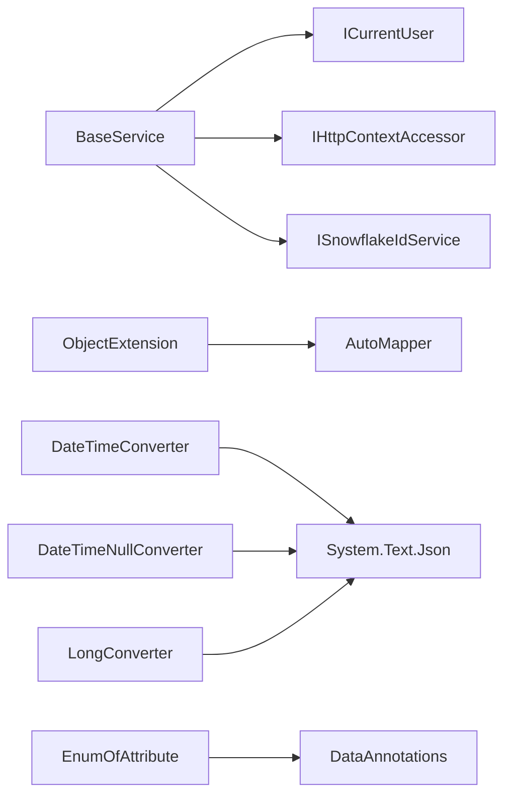

# 数据转换机制

<cite>
**本文引用的文件**
- [CD_Dto.cs](file://Kevin/kevin.Share/Dtos/Bases/CD_Dto.cs)
- [CUD_Dto.cs](file://Kevin/kevin.Share/Dtos/Bases/CUD_Dto.cs)
- [CD_User_Dto.cs](file://Kevin/kevin.Share/Dtos/Bases/CD_User_Dto.cs)
- [CUD_User_Dto.cs](file://Kevin/kevin.Share/Dtos/Bases/CUD_User_Dto.cs)
- [CD.cs](file://Kevin/Domain/Bases/CD.cs)
- [CUD.cs](file://Kevin/Domain/Bases/CUD.cs)
- [CD_User.cs](file://Kevin/Domain/Bases/CD_User.cs)
- [CUD_User.cs](file://Kevin/Domain/Bases/CUD_User.cs)
- [ObjectExtension.cs](file://Kevin/kevin.Module/Kevin.Common/Extension/ObjectExtension.cs)
- [DateTimeConverter.cs](file://Kevin/kevin.Module/Kevin.Common/Helper/Json/DateTimeConverter.cs)
- [DateTimeNullConverter.cs](file://Kevin/kevin.Module/Kevin.Common/Helper/Json/DateTimeNullConverter.cs)
- [LongConverter.cs](file://Kevin/kevin.Module/Kevin.Common/Helper/Json/LongConverter.cs)
- [JsonExtension.cs](file://Kevin/kevin.Module/Kevin.Common/Extension/JsonExtension.cs)
- [EnumOfAttribute.cs](file://Kevin/kevin.Module/Kevin.Common/Validator/EnumOfAttribute.cs)
- [FieldValidationException.cs](file://Kevin/kevin.Share/FieldValidationException.cs)
- [dtoPageData.cs](file://Kevin/kevin.Share/Dtos/dtoPageData.cs)
- [UserService.cs](file://Kevin/Application/Services/UserService.cs)
- [BaseService.cs](file://Kevin/Application/Services/BaseService.cs)
</cite>

## 目录
1. [简介](#简介)
2. [项目结构](#项目结构)
3. [核心组件](#核心组件)
4. [架构总览](#架构总览)
5. [详细组件分析](#详细组件分析)
6. [依赖关系分析](#依赖关系分析)
7. [性能考虑](#性能考虑)
8. [故障排查指南](#故障排查指南)
9. [结论](#结论)
10. [附录](#附录)

## 简介
本文件面向 NetCoreKevin 框架的数据转换机制，聚焦于数据传输对象（DTO）的设计模式、在各层间的传递方式、实体与 DTO 的映射策略、JSON 序列化与反序列化（含日期时间格式化）、以及数据验证规则的定义与执行。文档同时提供最佳实践与性能优化建议，帮助团队在统一规范下高效实现数据层的解耦与可维护性。

## 项目结构
本项目采用分层架构：
- Domain 层：定义领域实体与基础基类（如 CD、CUD、CD_User、CUD_User），承载业务语义与通用审计字段。
- Application 层：服务层（BaseService 及具体 Service），负责编排业务流程、调用仓储、进行 DTO 与实体的双向转换。
- WebApi/Web.Basics 层：控制器接收请求 DTO，调用应用服务，返回响应 DTO。
- Share/Common 层：提供共享 DTO（分页、键值对等）、通用扩展（AutoMapper 封装、JSON 工具）、验证器（自定义特性）。

图表来源
- [ObjectExtension.cs:40-135](file://Kevin/kevin.Module/Kevin.Common/Extension/ObjectExtension.cs#L40-L135)
- [DateTimeConverter.cs:1-41](file://Kevin/kevin.Module/Kevin.Common/Helper/Json/DateTimeConverter.cs#L1-L41)
- [DateTimeNullConverter.cs:1-35](file://Kevin/kevin.Module/Kevin.Common/Helper/Json/DateTimeNullConverter.cs#L1-L35)
- [EnumOfAttribute.cs:1-47](file://Kevin/kevin.Module/Kevin.Common/Validator/EnumOfAttribute.cs#L1-L47)

章节来源
- [ObjectExtension.cs:40-135](file://Kevin/kevin.Module/Kevin.Common/Extension/ObjectExtension.cs#L40-L135)
- [dtoPageData.cs:1-52](file://Kevin/kevin.Share/Dtos/dtoPageData.cs#L1-L52)

## 核心组件
- 基础 DTO 体系
  - CD_Dto：包含 Id、CreateTime、TenantId，作为所有“创建+删除”场景的 DTO 基类。
  - CUD_Dto：继承 CD_Dto，增加 UpdateTime，用于“增删改”场景。
  - CD_User_Dto：在 CD_Dto 基础上增加 CreateUserId/DeleteUserId 及其显示名 CreateUser/DeleteUser。
  - CUD_User_Dto：在 CUD_Dto 基础上增加 Create/Update/Delete 三态用户信息。
- 基础实体体系
  - CD：包含 Id、CreateTime、IsDelete、DeleteTime、RowVersion/xmin、TenantId。
  - CUD：继承 CD，增加 UpdateTime。
  - CD_User：在 CD 基础上增加 CreateUserId/CreateUser、DeleteUserId/DeleteUser。
  - CUD_User：在 CUD 基础上增加 Create/Update/Delete 三态用户信息。
- 映射与转换
  - ObjectExtension 提供基于 AutoMapper 的 MapTo/MapToList 扩展方法，支持单条与集合映射，并允许传入配置委托以定制映射规则。
- JSON 序列化
  - DateTimeConverter/DateTimeNullConverter：统一日期时间格式为 yyyy/MM/dd HH:mm:ss，兼容字符串解析。
  - LongConverter：将 long 序列化为字符串以避免前端精度丢失。
  - JsonExtension：Newtonsoft.Json 默认设置（命名策略、日期格式、缩进等）。
- 验证
  - EnumOfAttribute：校验枚举值是否有效。
  - NotNullOrEmptyAttribute：非空校验。
  - FieldValidationException：业务验证异常类型。

章节来源
- [CD_Dto.cs:1-32](file://Kevin/kevin.Share/Dtos/Bases/CD_Dto.cs#L1-L32)
- [CUD_Dto.cs:1-15](file://Kevin/kevin.Share/Dtos/Bases/CUD_Dto.cs#L1-L15)
- [CD_User_Dto.cs:1-22](file://Kevin/kevin.Share/Dtos/Bases/CD_User_Dto.cs#L1-L22)
- [CUD_User_Dto.cs:1-32](file://Kevin/kevin.Share/Dtos/Bases/CUD_User_Dto.cs#L1-L32)
- [CD.cs:1-76](file://Kevin/Domain/Bases/CD.cs#L1-L76)
- [CUD.cs:1-18](file://Kevin/Domain/Bases/CUD.cs#L1-L18)
- [CD_User.cs:1-30](file://Kevin/Domain/Bases/CD_User.cs#L1-L30)
- [CUD_User.cs:1-41](file://Kevin/Domain/Bases/CUD_User.cs#L1-L41)
- [ObjectExtension.cs:40-135](file://Kevin/kevin.Module/Kevin.Common/Extension/ObjectExtension.cs#L40-L135)
- [DateTimeConverter.cs:1-41](file://Kevin/kevin.Module/Kevin.Common/Helper/Json/DateTimeConverter.cs#L1-L41)
- [DateTimeNullConverter.cs:1-35](file://Kevin/kevin.Module/Kevin.Common/Helper/Json/DateTimeNullConverter.cs#L1-L35)
- [LongConverter.cs:1-29](file://Kevin/kevin.Module/Kevin.Common/Helper/Json/LongConverter.cs#L1-L29)
- [JsonExtension.cs:1-44](file://Kevin/kevin.Module/Kevin.Common/Extension/JsonExtension.cs#L1-L44)
- [EnumOfAttribute.cs:1-47](file://Kevin/kevin.Module/Kevin.Common/Validator/EnumOfAttribute.cs#L1-L47)
- [FieldValidationException.cs:1-19](file://Kevin/kevin.Share/FieldValidationException.cs#L1-L19)

## 架构总览
数据转换贯穿“控制器 -> 应用服务 -> 领域实体 -> 持久化”的全链路：
- 控制器接收请求 DTO（如分页查询参数、新增/编辑表单），调用应用服务。
- 应用服务通过 BaseService 获取当前用户、雪花ID等服务，完成业务编排。
- 应用服务使用 ObjectExtension 提供的 MapTo/MapToList 将 DTO 转换为实体或反向转换；必要时手动赋值复杂字段。
- 实体经 EF Core 持久化，返回结果再转换为 DTO 返回给客户端。
- JSON 序列化统一由自定义转换器处理日期时间与长整型，保证前后端一致性与精度安全。
- 验证通过 DataAnnotations 与自定义验证器在模型绑定阶段或业务层执行。

图表来源
- [ObjectExtension.cs:40-135](file://Kevin/kevin.Module/Kevin.Common/Extension/ObjectExtension.cs#L40-L135)
- [DateTimeConverter.cs:1-41](file://Kevin/kevin.Module/Kevin.Common/Helper/Json/DateTimeConverter.cs#L1-L41)
- [DateTimeNullConverter.cs:1-35](file://Kevin/kevin.Module/Kevin.Common/Helper/Json/DateTimeNullConverter.cs#L1-L35)
- [LongConverter.cs:1-29](file://Kevin/kevin.Module/Kevin.Common/Helper/Json/LongConverter.cs#L1-L29)

## 详细组件分析

### 基础 DTO 与实体设计
- 设计原则
  - 基类抽象共性：CD/CUD 提供通用审计字段（创建时间、更新时间、删除标记、行版本、租户隔离）。
  - 用户关联：CD_User/CUD_User 在基类上叠加创建/更新/删除操作人信息，便于审计追踪。
  - DTO 与实体分离：DTO 仅暴露对外契约，屏蔽内部实现细节（如导航属性、敏感字段）。
- 关键成员说明
  - CD_Dto：Id、CreateTime、TenantId。
  - CUD_Dto：在 CD_Dto 基础上增加 UpdateTime。
  - CD_User_Dto：CreateUserId/CreateUser、DeleteUserId/DeleteUser。
  - CUD_User_Dto：Create/Update/Delete 三态用户信息。
  - 对应实体：CD/CUD/CD_User/CUD_User 具备相同语义，但包含更多基础设施字段（如 IsDelete、RowVersion/xmin）。

图表来源
- [CD_Dto.cs:1-32](file://Kevin/kevin.Share/Dtos/Bases/CD_Dto.cs#L1-L32)
- [CUD_Dto.cs:1-15](file://Kevin/kevin.Share/Dtos/Bases/CUD_Dto.cs#L1-L15)
- [CD_User_Dto.cs:1-22](file://Kevin/kevin.Share/Dtos/Bases/CD_User_Dto.cs#L1-L22)
- [CUD_User_Dto.cs:1-32](file://Kevin/kevin.Share/Dtos/Bases/CUD_User_Dto.cs#L1-L32)

章节来源
- [CD_Dto.cs:1-32](file://Kevin/kevin.Share/Dtos/Bases/CD_Dto.cs#L1-L32)
- [CUD_Dto.cs:1-15](file://Kevin/kevin.Share/Dtos/Bases/CUD_Dto.cs#L1-L15)
- [CD_User_Dto.cs:1-22](file://Kevin/kevin.Share/Dtos/Bases/CD_User_Dto.cs#L1-L22)
- [CUD_User_Dto.cs:1-32](file://Kevin/kevin.Share/Dtos/Bases/CUD_User_Dto.cs#L1-L32)
- [CD.cs:1-76](file://Kevin/Domain/Bases/CD.cs#L1-L76)
- [CUD.cs:1-18](file://Kevin/Domain/Bases/CUD.cs#L1-L18)
- [CD_User.cs:1-30](file://Kevin/Domain/Bases/CD_User.cs#L1-L30)
- [CUD_User.cs:1-41](file://Kevin/Domain/Bases/CUD_User.cs#L1-L41)

### 实体与 DTO 的映射策略
- 自动映射
  - 使用 ObjectExtension 提供的 MapTo/MapToList 扩展方法，基于 AutoMapper 实现字段名匹配映射。
  - 支持传入配置委托以覆盖默认行为（例如忽略某些字段、重命名字段、处理复杂类型）。
- 手动映射
  - 当存在复杂嵌套或需要业务计算时，在服务层进行手动赋值（参考 UserService 中的部分赋值逻辑）。
- 推荐实践
  - 简单字段优先使用自动映射；复杂逻辑或跨域聚合使用手动映射。
  - 在 Service 中集中管理映射规则，避免散落在各处。

图表来源
- [ObjectExtension.cs:40-135](file://Kevin/kevin.Module/Kevin.Common/Extension/ObjectExtension.cs#L40-L135)

章节来源
- [ObjectExtension.cs:40-135](file://Kevin/kevin.Module/Kevin.Common/Extension/ObjectExtension.cs#L40-L135)
- [UserService.cs:521-544](file://Kevin/Application/Services/UserService.cs#L521-L544)

### JSON 序列化与反序列化
- 日期时间格式化
  - DateTimeConverter/DateTimeNullConverter 统一输出格式为 yyyy/MM/dd HH:mm:ss，并在反序列化时兼容字符串输入。
- 长整型精度保护
  - LongConverter 将 long 序列化为字符串，避免 JavaScript 精度丢失问题。
- Newtonsoft 默认设置
  - JsonExtension 提供全局默认设置（命名策略、日期格式、缩进等），适用于 Newtonsoft 场景。
- 使用建议
  - 在 API 启动时注册 System.Text.Json 的自定义转换器，确保全局生效。
  - 对于历史代码或第三方库，可使用 JsonExtension 的 Newtonsoft 能力。

图表来源
- [DateTimeConverter.cs:1-41](file://Kevin/kevin.Module/Kevin.Common/Helper/Json/DateTimeConverter.cs#L1-L41)
- [DateTimeNullConverter.cs:1-35](file://Kevin/kevin.Module/Kevin.Common/Helper/Json/DateTimeNullConverter.cs#L1-L35)
- [LongConverter.cs:1-29](file://Kevin/kevin.Module/Kevin.Common/Helper/Json/LongConverter.cs#L1-L29)
- [JsonExtension.cs:1-44](file://Kevin/kevin.Module/Kevin.Common/Extension/JsonExtension.cs#L1-L44)

章节来源
- [DateTimeConverter.cs:1-41](file://Kevin/kevin.Module/Kevin.Common/Helper/Json/DateTimeConverter.cs#L1-L41)
- [DateTimeNullConverter.cs:1-35](file://Kevin/kevin.Module/Kevin.Common/Helper/Json/DateTimeNullConverter.cs#L1-L35)
- [LongConverter.cs:1-29](file://Kevin/kevin.Module/Kevin.Common/Helper/Json/LongConverter.cs#L1-L29)
- [JsonExtension.cs:1-44](file://Kevin/kevin.Module/Kevin.Common/Extension/JsonExtension.cs#L1-L44)

### 数据验证规则与执行机制
- 模型验证
  - 使用 DataAnnotations 与自定义验证器（如 EnumOfAttribute、NotNullOrEmptyAttribute）在模型绑定阶段进行校验。
- 业务验证
  - 在服务层进行更复杂的业务规则检查，抛出 FieldValidationException 以统一错误处理。
- 执行流程
  - 控制器接收请求后，框架自动执行模型验证；若失败则返回相应错误。
  - 进入服务层后，继续执行业务验证，必要时抛出异常并由全局过滤器捕获。

图表来源
- [EnumOfAttribute.cs:1-47](file://Kevin/kevin.Module/Kevin.Common/Validator/EnumOfAttribute.cs#L1-L47)
- [FieldValidationException.cs:1-19](file://Kevin/kevin.Share/FieldValidationException.cs#L1-L19)

章节来源
- [EnumOfAttribute.cs:1-47](file://Kevin/kevin.Module/Kevin.Common/Validator/EnumOfAttribute.cs#L1-L47)
- [FieldValidationException.cs:1-19](file://Kevin/kevin.Share/FieldValidationException.cs#L1-L19)

### 分页与列表传输
- dtoPageData<T> 提供分页参数（pageSize、pageNum）、查询条件（whereId、searchKey、state、sign）、时间范围（StartTime、EndTime）以及数据容器 data 和总数 total。
- GetSkip() 计算偏移量，配合仓储层进行分页查询。

章节来源
- [dtoPageData.cs:1-52](file://Kevin/kevin.Share/Dtos/dtoPageData.cs#L1-L52)

## 依赖关系分析
- 服务基类 BaseService 提供当前用户、HTTP 上下文访问、雪花 ID 服务等依赖注入能力，支撑各具体 Service 的统一初始化。
- ObjectExtension 依赖 AutoMapper，提供统一的映射入口。
- JSON 转换器依赖 System.Text.Json.Serialization，用于全局序列化配置。
- 验证器依赖 DataAnnotations，便于声明式校验。

图表来源
- [BaseService.cs:1-41](file://Kevin/Application/Services/BaseService.cs#L1-L41)
- [ObjectExtension.cs:40-135](file://Kevin/kevin.Module/Kevin.Common/Extension/ObjectExtension.cs#L40-L135)
- [DateTimeConverter.cs:1-41](file://Kevin/kevin.Module/Kevin.Common/Helper/Json/DateTimeConverter.cs#L1-L41)
- [DateTimeNullConverter.cs:1-35](file://Kevin/kevin.Module/Kevin.Common/Helper/Json/DateTimeNullConverter.cs#L1-L35)
- [LongConverter.cs:1-29](file://Kevin/kevin.Module/Kevin.Common/Helper/Json/LongConverter.cs#L1-L29)
- [EnumOfAttribute.cs:1-47](file://Kevin/kevin.Module/Kevin.Common/Validator/EnumOfAttribute.cs#L1-L47)

章节来源
- [BaseService.cs:1-41](file://Kevin/Application/Services/BaseService.cs#L1-L41)
- [ObjectExtension.cs:40-135](file://Kevin/kevin.Module/Kevin.Common/Extension/ObjectExtension.cs#L40-L135)

## 性能考虑
- 映射性能
  - 尽量复用 AutoMapper 配置，避免每次调用都创建新的 MapperConfiguration。
  - 对高频路径使用 MapToList 批量转换，减少循环开销。
- JSON 序列化
  - 使用 System.Text.Json 的自定义转换器，避免 Newtonsoft 的性能损耗。
  - 对大对象启用压缩与按需序列化（如忽略无关字段）。
- 分页与查询
  - 合理使用 dtoPageData 的分页参数，避免一次性加载大量数据。
  - 在仓储层使用投影（Select）只取必要字段，减少内存占用。
- 验证
  - 将轻量验证放在模型绑定阶段，复杂验证放在服务层，避免重复校验。

[本节为通用指导，不直接分析具体文件]

## 故障排查指南
- 日期时间格式不一致
  - 检查是否使用了 DateTimeConverter/DateTimeNullConverter，并确保在 API 启动时正确注册。
  - 确认前端期望的日期格式与服务端输出一致。
- 长整型精度丢失
  - 确认 LongConverter 已启用，后端将 long 序列化为字符串。
- 映射失败或字段缺失
  - 检查 DTO 与实体字段名是否一致；如需重命名，请在 MapTo 的配置委托中指定。
  - 对于复杂类型，确认是否存在合适的映射规则。
- 验证未生效
  - 确认模型绑定阶段是否触发了验证；检查自定义验证器是否正确标注在 DTO 属性上。
  - 业务验证异常是否被全局过滤器捕获并返回标准错误格式。

章节来源
- [DateTimeConverter.cs:1-41](file://Kevin/kevin.Module/Kevin.Common/Helper/Json/DateTimeConverter.cs#L1-L41)
- [DateTimeNullConverter.cs:1-35](file://Kevin/kevin.Module/Kevin.Common/Helper/Json/DateTimeNullConverter.cs#L1-L35)
- [LongConverter.cs:1-29](file://Kevin/kevin.Module/Kevin.Common/Helper/Json/LongConverter.cs#L1-L29)
- [ObjectExtension.cs:40-135](file://Kevin/kevin.Module/Kevin.Common/Extension/ObjectExtension.cs#L40-L135)
- [EnumOfAttribute.cs:1-47](file://Kevin/kevin.Module/Kevin.Common/Validator/EnumOfAttribute.cs#L1-L47)
- [FieldValidationException.cs:1-19](file://Kevin/kevin.Share/FieldValidationException.cs#L1-L19)

## 结论
NetCoreKevin 框架通过清晰的 DTO/实体分层、统一的映射与 JSON 序列化机制、以及可扩展的验证体系，实现了数据转换的可维护性与高性能。遵循本文的最佳实践，可在保证一致性的前提下提升开发效率与系统稳定性。

[本节为总结，不直接分析具体文件]

## 附录
- 最佳实践清单
  - 使用 CD/CUD 系列基类统一审计字段。
  - 优先使用 ObjectExtension 的 MapTo/MapToList 进行简单映射。
  - 复杂映射在服务层集中处理，保持可读性与可测试性。
  - 全局注册 JSON 转换器，确保日期与长整型一致性。
  - 使用 DataAnnotations 与自定义验证器进行声明式校验。
  - 合理分页，避免全表扫描与大对象传输。
- 常见问题速查
  - 日期格式：yyyy/MM/dd HH:mm:ss。
  - 长整型：序列化为字符串。
  - 分页：dtoPageData<T> 的 pageSize/pageNum 与 GetSkip()。

[本节为补充信息，不直接分析具体文件]