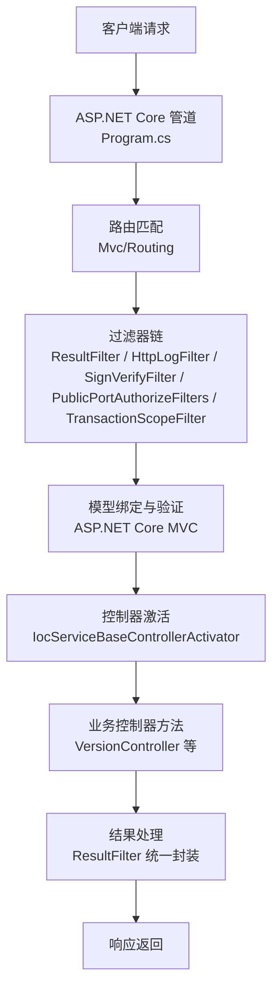
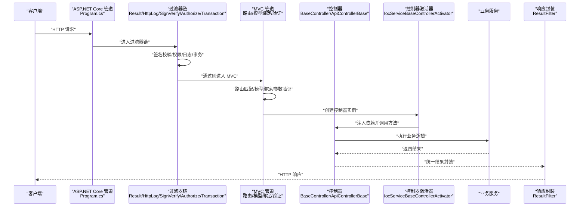
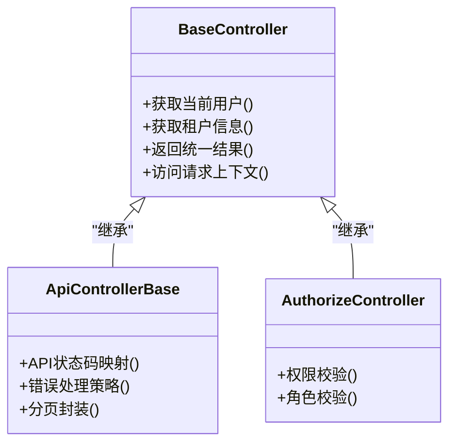
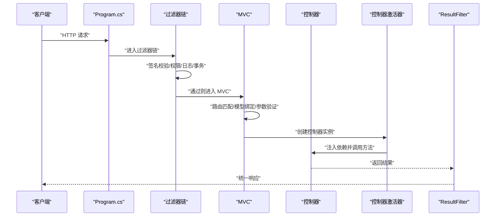
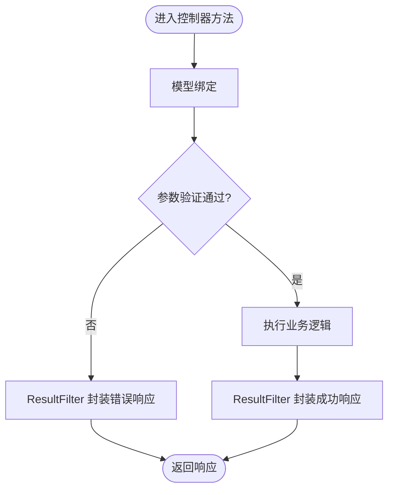
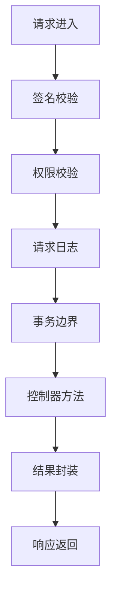
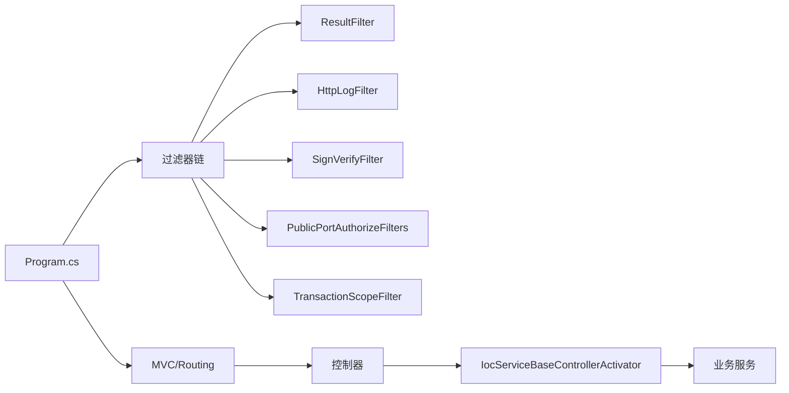

# 请求处理流程

<cite>
**本文引用的文件**
- [Program.cs](file://App/WebApi/Program.cs)
- [BaseController.cs](file://Kevin/Kevin.Web.Basics/Controllers/BaseController.cs)
- [ApiControllerBase.cs](file://Kevin/Kevin.Web.Basics/Controllers/ApiControllerBase.cs)
- [AuthorizeController.cs](file://Kevin/Kevin.Web.Basics/Controllers/AuthorizeController.cs)
- [VersionController.cs](file://App/WebApi/Controllers/v1/VersionController.cs)
- [ServiceConfiguration.cs](file://Kevin/Kevin.Web.Basics/Extensions/ServiceConfiguration.cs)
- [ResultFilter.cs](file://Kevin/Kevin.Web.Basics/Filters/ResultFilter.cs)
- [HttpLogFilter.cs](file://Kevin/Kevin.Web.Basics/Filters/HttpLogFilter.cs)
- [SignVerifyFilter.cs](file://Kevin/Kevin.Web.Basics/Filters/SignVerifyFilter.cs)
- [PublicPortAuthorizeFilters.cs](file://Kevin/Kevin.Web.Basics/Filters/PublicPortAuthorizeFilters.cs)
- [TransactionScopeFilter.cs](file://Kevin/Kevin.Web.Basics/Filters/TransactionScope/TransactionScopeFilter.cs)
- [RequireFilterAttribute.cs](file://Kevin/Kevin.Web.Basics/Filters/RequireFilterAttribute.cs)
- [CacheDataFilter.cs](file://Kevin/Kevin.Web.Basics/Filters/CacheDataFilter.cs)
- [QueueLimitFilter.cs](file://Kevin/Kevin.Web.Basics/Filters/QueueLimitFilter.cs)
- [KevinHttpContext.cs](file://Kevin/kevin.Module/Kevin.Common/App/KevinHttpContext.cs)
- [TenantHelper.cs](file://Kevin/kevin.Module/Kevin.Common/App/TenantHelper.cs)
- [CurrentUser.cs](file://Kevin/Application/Services/CurrentUser.cs)
- [AuthorizeAction.cs](file://Kevin/Domain/Auth/AuthorizeAction.cs)
- [ApiResponseHandler.cs](file://Kevin/Domain/Auth/ApiResponseHandler.cs)
- [IocServiceBaseControllerActivator.cs](file://Kevin/kevin.Module/kevin.Ioc/IocServiceBaseControllerActivator.cs)
- [ServiceCollectionExtensions.cs](file://Kevin/kevin.Module/kevin.Ioc/ServiceCollectionExtensions.cs)
</cite>

## 目录
1. [简介](#简介)
2. [项目结构](#项目结构)
3. [核心组件](#核心组件)
4. [架构总览](#架构总览)
5. [详细组件分析](#详细组件分析)
6. [依赖关系分析](#依赖关系分析)
7. [性能考虑](#性能考虑)
8. [故障排查指南](#故障排查指南)
9. [结论](#结论)
10. [附录](#附录)

## 简介
本文面向 NetCoreKevin 框架，系统化阐述 HTTP 请求从进入 ASP.NET Core 管道到控制器方法执行的完整过程。重点覆盖中间件管线、路由解析、模型绑定与参数验证、过滤器链执行、控制器继承层次（BaseController 与 ApiControllerBase）的职责分工，以及请求上下文信息（用户、租户、请求元数据）的获取方式。文末提供时序图、流程图与最佳实践建议，帮助读者快速理解并优化请求处理链路。

## 项目结构
- Web 入口与管道配置位于应用层 Program.cs，负责服务注册、中间件顺序与特性开关。
- 基础控制器与通用过滤器位于 Kevin.Web.Basics：
  - 控制器基类：BaseController、ApiControllerBase、AuthorizeController
  - 过滤器：ResultFilter、HttpLogFilter、SignVerifyFilter、PublicPortAuthorizeFilters、TransactionScopeFilter、RequireFilterAttribute、CacheDataFilter、QueueLimitFilter
- 模块扩展与服务装配位于 kevin.Module：
  - Ioc 模块：IocServiceBaseControllerActivator、ServiceCollectionExtensions
  - 公共上下文：KevinHttpContext、TenantHelper
  - 认证授权：AuthorizeAction、ApiResponseHandler
- 示例控制器位于 App/WebApi/Controllers/v1/VersionController.cs，用于演示版本化 API 的路由与响应。

图表来源
- [Program.cs:1-200](file://App/WebApi/Program.cs#L1-L200)
- [ServiceConfiguration.cs:1-200](file://Kevin/Kevin.Web.Basics/Extensions/ServiceConfiguration.cs#L1-L200)
- [ResultFilter.cs:1-200](file://Kevin/Kevin.Web.Basics/Filters/ResultFilter.cs#L1-L200)
- [HttpLogFilter.cs:1-200](file://Kevin/Kevin.Web.Basics/Filters/HttpLogFilter.cs#L1-L200)
- [SignVerifyFilter.cs:1-200](file://Kevin/Kevin.Web.Basics/Filters/SignVerifyFilter.cs#L1-L200)
- [PublicPortAuthorizeFilters.cs:1-200](file://Kevin/Kevin.Web.Basics/Filters/PublicPortAuthorizeFilters.cs#L1-L200)
- [TransactionScopeFilter.cs:1-200](file://Kevin/Kevin.Web.Basics/Filters/TransactionScope/TransactionScopeFilter.cs#L1-L200)
- [IocServiceBaseControllerActivator.cs:1-200](file://Kevin/kevin.Module/kevin.Ioc/IocServiceBaseControllerActivator.cs#L1-L200)

章节来源
- [Program.cs:1-200](file://App/WebApi/Program.cs#L1-L200)
- [ServiceConfiguration.cs:1-200](file://Kevin/Kevin.Web.Basics/Extensions/ServiceConfiguration.cs#L1-L200)

## 核心组件
- 管道与中间件：在 Program.cs 中按顺序注册认证、日志、签名校验、权限、事务等中间件或过滤器，确保请求在进入控制器前完成安全与审计前置检查。
- 控制器基类：
  - BaseController：提供通用能力（如上下文访问、统一返回封装、租户与用户信息便捷获取）。
  - ApiControllerBase：在 BaseController 基础上增加 API 风格约定（如状态码映射、错误处理策略）。
  - AuthorizeController：基于 Base 控制器实现鉴权相关逻辑（如角色/权限校验）。
- 过滤器：
  - ResultFilter：统一结果包装、异常捕获与响应格式化。
  - HttpLogFilter：记录请求/响应日志，便于追踪与审计。
  - SignVerifyFilter：对请求进行签名校验，防止篡改。
  - PublicPortAuthorizeFilters：针对公开端口的访问控制。
  - TransactionScopeFilter：为控制器方法提供事务边界。
  - RequireFilterAttribute：声明式要求（如必须携带某些头或参数）。
  - CacheDataFilter：缓存命中与写入策略。
  - QueueLimitFilter：限流保护。
- 上下文与租户：
  - KevinHttpContext：封装 HttpContext 常用操作，暴露当前请求元数据。
  - TenantHelper：租户识别与切换。
  - CurrentUser：当前登录用户信息。
- 控制器激活：
  - IocServiceBaseControllerActivator：自定义控制器激活器，结合 IoC 容器注入依赖。
  - ServiceCollectionExtensions：集中注册控制器与过滤器。

章节来源
- [BaseController.cs:1-200](file://Kevin/Kevin.Web.Basics/Controllers/BaseController.cs#L1-L200)
- [ApiControllerBase.cs:1-200](file://Kevin/Kevin.Web.Basics/Controllers/ApiControllerBase.cs#L1-L200)
- [AuthorizeController.cs:1-200](file://Kevin/Kevin.Web.Basics/Controllers/AuthorizeController.cs#L1-L200)
- [ResultFilter.cs:1-200](file://Kevin/Kevin.Web.Basics/Filters/ResultFilter.cs#L1-L200)
- [HttpLogFilter.cs:1-200](file://Kevin/Kevin.Web.Basics/Filters/HttpLogFilter.cs#L1-L200)
- [SignVerifyFilter.cs:1-200](file://Kevin/Kevin.Web.Basics/Filters/SignVerifyFilter.cs#L1-L200)
- [PublicPortAuthorizeFilters.cs:1-200](file://Kevin/Kevin.Web.Basics/Filters/PublicPortAuthorizeFilters.cs#L1-L200)
- [TransactionScopeFilter.cs:1-200](file://Kevin/Kevin.Web.Basics/Filters/TransactionScope/TransactionScopeFilter.cs#L1-L200)
- [RequireFilterAttribute.cs:1-200](file://Kevin/Kevin.Web.Basics/Filters/RequireFilterAttribute.cs#L1-L200)
- [CacheDataFilter.cs:1-200](file://Kevin/Kevin.Web.Basics/Filters/CacheDataFilter.cs#L1-L200)
- [QueueLimitFilter.cs:1-200](file://Kevin/Kevin.Web.Basics/Filters/QueueLimitFilter.cs#L1-L200)
- [KevinHttpContext.cs:1-200](file://Kevin/kevin.Module/Kevin.Common/App/KevinHttpContext.cs#L1-L200)
- [TenantHelper.cs:1-200](file://Kevin/kevin.Module/Kevin.Common/App/TenantHelper.cs#L1-L200)
- [CurrentUser.cs:1-200](file://Kevin/Application/Services/CurrentUser.cs#L1-L200)
- [IocServiceBaseControllerActivator.cs:1-200](file://Kevin/kevin.Module/kevin.Ioc/IocServiceBaseControllerActivator.cs#L1-L200)
- [ServiceCollectionExtensions.cs:1-200](file://Kevin/kevin.Module/kevin.Ioc/ServiceCollectionExtensions.cs#L1-L200)

## 架构总览
下图展示了请求从进入 ASP.NET Core 管道到控制器方法执行的端到端流程，包括中间件、过滤器、模型绑定、控制器激活与结果封装。

图表来源
- [Program.cs:1-200](file://App/WebApi/Program.cs#L1-L200)
- [ResultFilter.cs:1-200](file://Kevin/Kevin.Web.Basics/Filters/ResultFilter.cs#L1-L200)
- [HttpLogFilter.cs:1-200](file://Kevin/Kevin.Web.Basics/Filters/HttpLogFilter.cs#L1-L200)
- [SignVerifyFilter.cs:1-200](file://Kevin/Kevin.Web.Basics/Filters/SignVerifyFilter.cs#L1-L200)
- [PublicPortAuthorizeFilters.cs:1-200](file://Kevin/Kevin.Web.Basics/Filters/PublicPortAuthorizeFilters.cs#L1-L200)
- [TransactionScopeFilter.cs:1-200](file://Kevin/Kevin.Web.Basics/Filters/TransactionScope/TransactionScopeFilter.cs#L1-L200)
- [IocServiceBaseControllerActivator.cs:1-200](file://Kevin/kevin.Module/kevin.Ioc/IocServiceBaseControllerActivator.cs#L1-L200)

## 详细组件分析

### 控制器继承层次与职责分工
- BaseController：
  - 职责：提供统一的上下文访问、租户与用户信息获取、通用返回封装、跨域/缓存/日志等横切能力入口。
  - 关键点：封装 KevinHttpContext、TenantHelper、CurrentUser 的使用；定义标准响应格式。
- ApiControllerBase：
  - 职责：在 BaseController 之上强化 API 行为，如状态码映射、错误处理策略、分页/列表统一封装。
  - 关键点：与 ResultFilter 配合，确保所有 API 响应一致。
- AuthorizeController：
  - 职责：承载鉴权相关逻辑，如角色/权限校验、访问控制策略。
  - 关键点：与 PublicPortAuthorizeFilters、RequireFilterAttribute 协同工作。

图表来源
- [BaseController.cs:1-200](file://Kevin/Kevin.Web.Basics/Controllers/BaseController.cs#L1-L200)
- [ApiControllerBase.cs:1-200](file://Kevin/Kevin.Web.Basics/Controllers/ApiControllerBase.cs#L1-L200)
- [AuthorizeController.cs:1-200](file://Kevin/Kevin.Web.Basics/Controllers/AuthorizeController.cs#L1-L200)

章节来源
- [BaseController.cs:1-200](file://Kevin/Kevin.Web.Basics/Controllers/BaseController.cs#L1-L200)
- [ApiControllerBase.cs:1-200](file://Kevin/Kevin.Web.Basics/Controllers/ApiControllerBase.cs#L1-L200)
- [AuthorizeController.cs:1-200](file://Kevin/Kevin.Web.Basics/Controllers/AuthorizeController.cs#L1-L200)

### 请求处理时序（含过滤器与模型绑定）

图表来源
- [Program.cs:1-200](file://App/WebApi/Program.cs#L1-L200)
- [ResultFilter.cs:1-200](file://Kevin/Kevin.Web.Basics/Filters/ResultFilter.cs#L1-L200)
- [HttpLogFilter.cs:1-200](file://Kevin/Kevin.Web.Basics/Filters/HttpLogFilter.cs#L1-L200)
- [SignVerifyFilter.cs:1-200](file://Kevin/Kevin.Web.Basics/Filters/SignVerifyFilter.cs#L1-L200)
- [PublicPortAuthorizeFilters.cs:1-200](file://Kevin/Kevin.Web.Basics/Filters/PublicPortAuthorizeFilters.cs#L1-L200)
- [TransactionScopeFilter.cs:1-200](file://Kevin/Kevin.Web.Basics/Filters/TransactionScope/TransactionScopeFilter.cs#L1-L200)
- [IocServiceBaseControllerActivator.cs:1-200](file://Kevin/kevin.Module/kevin.Ioc/IocServiceBaseControllerActivator.cs#L1-L200)

章节来源
- [Program.cs:1-200](file://App/WebApi/Program.cs#L1-L200)
- [ResultFilter.cs:1-200](file://Kevin/Kevin.Web.Basics/Filters/ResultFilter.cs#L1-L200)
- [HttpLogFilter.cs:1-200](file://Kevin/Kevin.Web.Basics/Filters/HttpLogFilter.cs#L1-L200)
- [SignVerifyFilter.cs:1-200](file://Kevin/Kevin.Web.Basics/Filters/SignVerifyFilter.cs#L1-L200)
- [PublicPortAuthorizeFilters.cs:1-200](file://Kevin/Kevin.Web.Basics/Filters/PublicPortAuthorizeFilters.cs#L1-L200)
- [TransactionScopeFilter.cs:1-200](file://Kevin/Kevin.Web.Basics/Filters/TransactionScope/TransactionScopeFilter.cs#L1-L200)
- [IocServiceBaseControllerActivator.cs:1-200](file://Kevin/kevin.Module/kevin.Ioc/IocServiceBaseControllerActivator.cs#L1-L200)

### 模型绑定与参数验证机制
- 路由解析：由 ASP.NET Core MVC 根据路由模板与方法签名匹配控制器与动作。
- 模型绑定：将请求体、查询字符串、路径参数、表单数据绑定到控制器方法的参数或 DTO。
- 参数验证：使用数据注解或自定义验证规则，在模型绑定后触发验证；若失败，ResultFilter 可统一封装错误响应。
- 关键位置：
  - Program.cs：注册 MVC 与路由。
  - ResultFilter：捕获验证失败并返回统一错误格式。
  - 控制器方法：标注验证属性或使用验证器。

图表来源
- [Program.cs:1-200](file://App/WebApi/Program.cs#L1-L200)
- [ResultFilter.cs:1-200](file://Kevin/Kevin.Web.Basics/Filters/ResultFilter.cs#L1-L200)

章节来源
- [Program.cs:1-200](file://App/WebApi/Program.cs#L1-L200)
- [ResultFilter.cs:1-200](file://Kevin/Kevin.Web.Basics/Filters/ResultFilter.cs#L1-L200)

### 过滤器链与横切关注点
- ResultFilter：统一响应封装、异常捕获、状态码映射。
- HttpLogFilter：记录请求/响应详情，便于审计与排障。
- SignVerifyFilter：校验请求签名，防止篡改与重放。
- PublicPortAuthorizeFilters：对公开端口进行访问控制。
- TransactionScopeFilter：为控制器方法提供事务边界，保证数据一致性。
- RequireFilterAttribute：声明式要求（如必须携带特定头或参数）。
- CacheDataFilter：缓存命中与写入策略，减少重复计算。
- QueueLimitFilter：限流保护，避免系统过载。

图表来源
- [SignVerifyFilter.cs:1-200](file://Kevin/Kevin.Web.Basics/Filters/SignVerifyFilter.cs#L1-L200)
- [PublicPortAuthorizeFilters.cs:1-200](file://Kevin/Kevin.Web.Basics/Filters/PublicPortAuthorizeFilters.cs#L1-L200)
- [HttpLogFilter.cs:1-200](file://Kevin/Kevin.Web.Basics/Filters/HttpLogFilter.cs#L1-L200)
- [TransactionScopeFilter.cs:1-200](file://Kevin/Kevin.Web.Basics/Filters/TransactionScope/TransactionScopeFilter.cs#L1-L200)
- [ResultFilter.cs:1-200](file://Kevin/Kevin.Web.Basics/Filters/ResultFilter.cs#L1-L200)

章节来源
- [SignVerifyFilter.cs:1-200](file://Kevin/Kevin.Web.Basics/Filters/SignVerifyFilter.cs#L1-L200)
- [PublicPortAuthorizeFilters.cs:1-200](file://Kevin/Kevin.Web.Basics/Filters/PublicPortAuthorizeFilters.cs#L1-L200)
- [HttpLogFilter.cs:1-200](file://Kevin/Kevin.Web.Basics/Filters/HttpLogFilter.cs#L1-L200)
- [TransactionScopeFilter.cs:1-200](file://Kevin/Kevin.Web.Basics/Filters/TransactionScope/TransactionScopeFilter.cs#L1-L200)
- [ResultFilter.cs:1-200](file://Kevin/Kevin.Web.Basics/Filters/ResultFilter.cs#L1-L200)

### 请求上下文信息的获取
- 用户信息：通过 CurrentUser 获取当前登录用户身份与角色。
- 租户信息：通过 TenantHelper 识别与切换租户上下文。
- 请求元数据：通过 KevinHttpContext 访问 HttpContext，获取 IP、UA、请求头、Cookie 等。
- 典型用法：
  - 在 BaseController 中封装便捷方法，供具体控制器直接调用。
  - 在过滤器中读取上下文以进行审计、限流或权限判断。

章节来源
- [CurrentUser.cs:1-200](file://Kevin/Application/Services/CurrentUser.cs#L1-L200)
- [TenantHelper.cs:1-200](file://Kevin/kevin.Module/Kevin.Common/App/TenantHelper.cs#L1-L200)
- [KevinHttpContext.cs:1-200](file://Kevin/kevin.Module/Kevin.Common/App/KevinHttpContext.cs#L1-L200)
- [BaseController.cs:1-200](file://Kevin/Kevin.Web.Basics/Controllers/BaseController.cs#L1-L200)

### 不同类型请求的处理路径
- 版本化 API：v1/VersionController 展示版本化路由与响应格式。
- 鉴权接口：AuthorizeController 及其派生类，结合 PublicPortAuthorizeFilters 与 RequireFilterAttribute 进行访问控制。
- 文件上传/下载：FileController 结合缓存与限流过滤器，保障稳定性。
- 日志与监控：LogController 结合 HttpLogFilter 输出审计日志。

章节来源
- [VersionController.cs:1-200](file://App/WebApi/Controllers/v1/VersionController.cs#L1-L200)
- [AuthorizeController.cs:1-200](file://Kevin/Kevin.Web.Basics/Controllers/AuthorizeController.cs#L1-L200)
- [PublicPortAuthorizeFilters.cs:1-200](file://Kevin/Kevin.Web.Basics/Filters/PublicPortAuthorizeFilters.cs#L1-L200)
- [RequireFilterAttribute.cs:1-200](file://Kevin/Kevin.Web.Basics/Filters/RequireFilterAttribute.cs#L1-L200)

## 依赖关系分析
- Program.cs 作为入口，注册 MVC、路由、中间件与过滤器。
- ServiceConfiguration.cs 集中配置服务与过滤器。
- IocServiceBaseControllerActivator 与 ServiceCollectionExtensions 负责控制器激活与依赖注入。
- 过滤器之间形成链式依赖，ResultFilter 通常置于末尾以统一封装响应。
- 控制器基类依赖上下文与租户工具，向上游过滤器提供上下文信息。

图表来源
- [Program.cs:1-200](file://App/WebApi/Program.cs#L1-L200)
- [ServiceConfiguration.cs:1-200](file://Kevin/Kevin.Web.Basics/Extensions/ServiceConfiguration.cs#L1-L200)
- [ResultFilter.cs:1-200](file://Kevin/Kevin.Web.Basics/Filters/ResultFilter.cs#L1-L200)
- [HttpLogFilter.cs:1-200](file://Kevin/Kevin.Web.Basics/Filters/HttpLogFilter.cs#L1-L200)
- [SignVerifyFilter.cs:1-200](file://Kevin/Kevin.Web.Basics/Filters/SignVerifyFilter.cs#L1-L200)
- [PublicPortAuthorizeFilters.cs:1-200](file://Kevin/Kevin.Web.Basics/Filters/PublicPortAuthorizeFilters.cs#L1-L200)
- [TransactionScopeFilter.cs:1-200](file://Kevin/Kevin.Web.Basics/Filters/TransactionScope/TransactionScopeFilter.cs#L1-L200)
- [IocServiceBaseControllerActivator.cs:1-200](file://Kevin/kevin.Module/kevin.Ioc/IocServiceBaseControllerActivator.cs#L1-L200)

章节来源
- [Program.cs:1-200](file://App/WebApi/Program.cs#L1-L200)
- [ServiceConfiguration.cs:1-200](file://Kevin/Kevin.Web.Basics/Extensions/ServiceConfiguration.cs#L1-L200)
- [IocServiceBaseControllerActivator.cs:1-200](file://Kevin/kevin.Module/kevin.Ioc/IocServiceBaseControllerActivator.cs#L1-L200)

## 性能考虑
- 过滤器顺序优化：将轻量级过滤器（如日志、签名校验）置于前面，减少后续开销。
- 模型绑定与验证：尽量使用强类型 DTO，减少反射与动态绑定成本。
- 缓存策略：合理使用 CacheDataFilter 缓存热点数据，降低数据库压力。
- 限流保护：启用 QueueLimitFilter 防止突发流量导致系统过载。
- 事务边界：仅在必要时使用 TransactionScopeFilter，避免长事务影响吞吐。
- 响应封装：ResultFilter 统一封装可减少重复代码，但应避免在过滤器中进行重型计算。

[本节为通用指导，不直接分析具体文件]

## 故障排查指南
- 请求未到达控制器：检查 Program.cs 中间件顺序与过滤器是否提前拦截。
- 参数验证失败：查看 ResultFilter 的错误封装与 ModelState 状态。
- 签名校验失败：核对 SignVerifyFilter 的签名算法与密钥配置。
- 权限不足：确认 PublicPortAuthorizeFilters 与 RequireFilterAttribute 的配置。
- 事务回滚：检查 TransactionScopeFilter 的异常捕获与提交时机。
- 上下文为空：确认 KevinHttpContext、TenantHelper、CurrentUser 的初始化与生命周期。

章节来源
- [ResultFilter.cs:1-200](file://Kevin/Kevin.Web.Basics/Filters/ResultFilter.cs#L1-L200)
- [SignVerifyFilter.cs:1-200](file://Kevin/Kevin.Web.Basics/Filters/SignVerifyFilter.cs#L1-L200)
- [PublicPortAuthorizeFilters.cs:1-200](file://Kevin/Kevin.Web.Basics/Filters/PublicPortAuthorizeFilters.cs#L1-L200)
- [TransactionScopeFilter.cs:1-200](file://Kevin/Kevin.Web.Basics/Filters/TransactionScope/TransactionScopeFilter.cs#L1-L200)
- [KevinHttpContext.cs:1-200](file://Kevin/kevin.Module/Kevin.Common/App/KevinHttpContext.cs#L1-L200)
- [TenantHelper.cs:1-200](file://Kevin/kevin.Module/Kevin.Common/App/TenantHelper.cs#L1-L200)
- [CurrentUser.cs:1-200](file://Kevin/Application/Services/CurrentUser.cs#L1-L200)

## 结论
NetCoreKevin 框架通过清晰的管道与过滤器链、统一的控制器基类与结果封装，实现了高内聚、低耦合的请求处理体系。借助上下文与租户工具，开发者可以便捷地获取用户与租户信息；通过模型绑定与验证机制，确保数据质量与安全。合理配置过滤器顺序与性能策略，可进一步提升系统吞吐与稳定性。

[本节为总结性内容，不直接分析具体文件]

## 附录
- 最佳实践
  - 在 Program.cs 中明确中间件顺序，确保安全与审计前置。
  - 使用 BaseController/ApiControllerBase 统一返回格式与错误处理。
  - 利用过滤器实现横切关注点，保持控制器方法专注业务逻辑。
  - 使用 RequireFilterAttribute 声明式约束，提升可读性与可维护性。
  - 结合 CacheDataFilter 与 QueueLimitFilter 提升性能与稳定性。
- 参考路径
  - 入口与配置：[Program.cs](file://App/WebApi/Program.cs)
  - 控制器基类：[BaseController.cs](file://Kevin/Kevin.Web.Basics/Controllers/BaseController.cs)、[ApiControllerBase.cs](file://Kevin/Kevin.Web.Basics/Controllers/ApiControllerBase.cs)
  - 过滤器：[ResultFilter.cs](file://Kevin/Kevin.Web.Basics/Filters/ResultFilter.cs)、[HttpLogFilter.cs](file://Kevin/Kevin.Web.Basics/Filters/HttpLogFilter.cs)、[SignVerifyFilter.cs](file://Kevin/Kevin.Web.Basics/Filters/SignVerifyFilter.cs)、[PublicPortAuthorizeFilters.cs](file://Kevin/Kevin.Web.Basics/Filters/PublicPortAuthorizeFilters.cs)、[TransactionScopeFilter.cs](file://Kevin/Kevin.Web.Basics/Filters/TransactionScope/TransactionScopeFilter.cs)、[RequireFilterAttribute.cs](file://Kevin/Kevin.Web.Basics/Filters/RequireFilterAttribute.cs)、[CacheDataFilter.cs](file://Kevin/Kevin.Web.Basics/Filters/CacheDataFilter.cs)、[QueueLimitFilter.cs](file://Kevin/Kevin.Web.Basics/Filters/QueueLimitFilter.cs)
  - 上下文与租户：[KevinHttpContext.cs](file://Kevin/kevin.Module/Kevin.Common/App/KevinHttpContext.cs)、[TenantHelper.cs](file://Kevin/kevin.Module/Kevin.Common/App/TenantHelper.cs)、[CurrentUser.cs](file://Kevin/Application/Services/CurrentUser.cs)
  - 控制器激活：[IocServiceBaseControllerActivator.cs](file://Kevin/kevin.Module/kevin.Ioc/IocServiceBaseControllerActivator.cs)、[ServiceCollectionExtensions.cs](file://Kevin/kevin.Module/kevin.Ioc/ServiceCollectionExtensions.cs)
  - 示例控制器：[VersionController.cs](file://App/WebApi/Controllers/v1/VersionController.cs)

[本节为参考与指引，不直接分析具体文件]