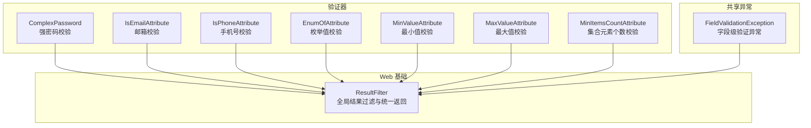
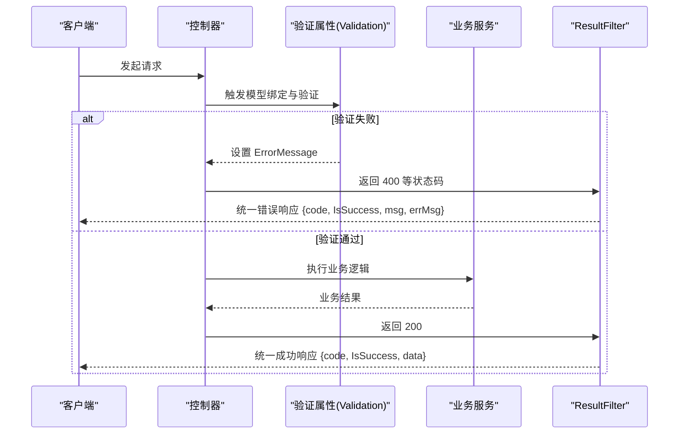
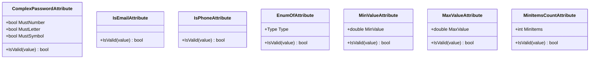
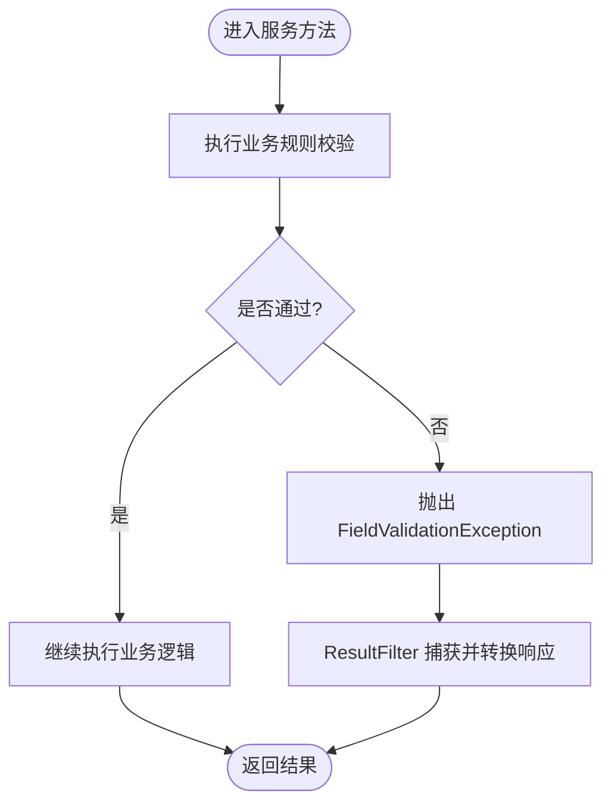
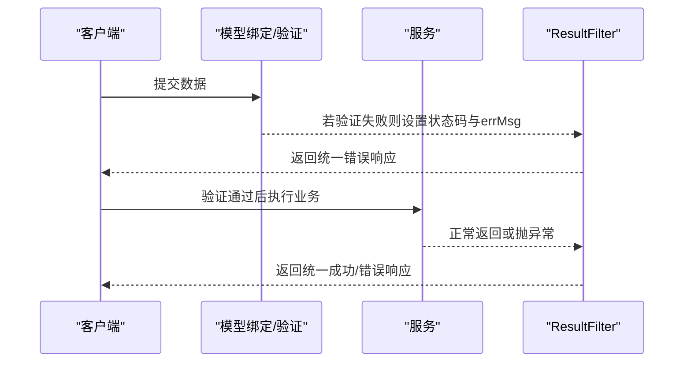
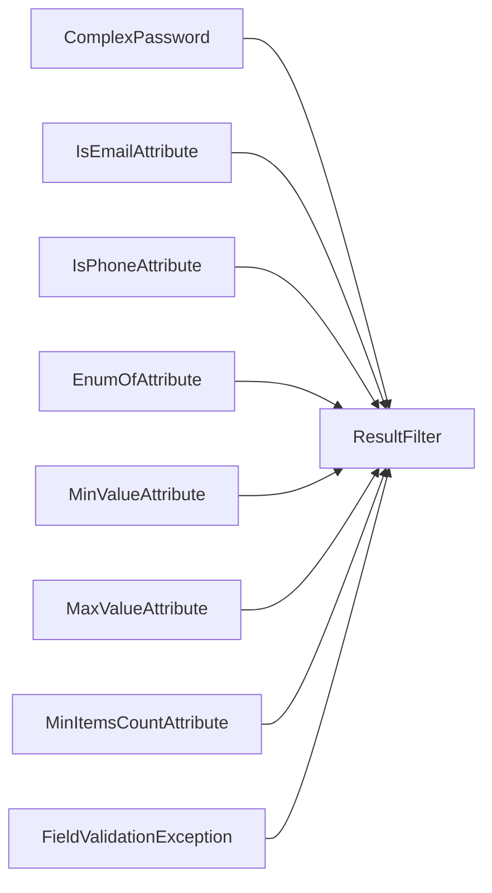

# 验证机制

<cite>
**本文引用的文件**
- [ComplexPassword.cs](file://Kevin/kevin.Module/Kevin.Common/Validator/ComplexPassword.cs)
- [IsEmailAttribute.cs](file://Kevin/kevin.Module/Kevin.Common/Validator/IsEmailAttribute.cs)
- [IsPhoneAttribute.cs](file://Kevin/kevin.Module/Kevin.Common/Validator/IsPhoneAttribute.cs)
- [EnumOfAttribute.cs](file://Kevin/kevin.Module/Kevin.Common/Validator/EnumOfAttribute.cs)
- [MaxValueAttribute.cs](file://Kevin/kevin.Module/Kevin.Common/Validator/MaxValueAttribute.cs)
- [MinValueAttribute.cs](file://Kevin/kevin.Module/Kevin.Common/Validator/MinValueAttribute.cs)
- [MinItemsCountAttribute.cs](file://Kevin/kevin.Module/Kevin.Common/Validator/MinItemsCountAttribute.cs)
- [FieldValidationException.cs](file://Kevin/kevin.Share/FieldValidationException.cs)
- [ResultFilter.cs](file://Kevin/Kevin.Web.Basics/Filters/ResultFilter.cs)
</cite>

## 目录
1. [简介](#简介)
2. [项目结构](#项目结构)
3. [核心组件](#核心组件)
4. [架构总览](#架构总览)
5. [详细组件分析](#详细组件分析)
6. [依赖关系分析](#依赖关系分析)
7. [性能考虑](#性能考虑)
8. [故障排查指南](#故障排查指南)
9. [结论](#结论)
10. [附录](#附录)

## 简介
本文件面向 NetCoreKevin 框架的“数据验证”能力，系统化阐述模型层、业务层与跨字段验证的分层策略；说明自定义验证属性（如 ComplexPassword、IsEmailAttribute、IsPhoneAttribute 等）的实现与使用方式；解释验证错误的收集与统一返回格式；并给出异步验证实现要点与性能优化建议，以及常见场景的最佳实践。

## 项目结构
验证相关代码主要分布在以下位置：
- 自定义验证器：Kevin/kevin.Module/Kevin.Common/Validator
- 领域共享异常：Kevin/kevin.Share/FieldValidationException.cs
- 全局结果过滤器（统一响应封装）：Kevin/Kevin.Web.Basics/Filters/ResultFilter.cs

**图表来源**
- [ComplexPassword.cs:1-95](file://Kevin/kevin.Module/Kevin.Common/Validator/ComplexPassword.cs#L1-L95)
- [IsEmailAttribute.cs:1-107](file://Kevin/kevin.Module/Kevin.Common/Validator/IsEmailAttribute.cs#L1-L107)
- [IsPhoneAttribute.cs:1-32](file://Kevin/kevin.Module/Kevin.Common/Validator/IsPhoneAttribute.cs#L1-L32)
- [EnumOfAttribute.cs:1-47](file://Kevin/kevin.Module/Kevin.Common/Validator/EnumOfAttribute.cs#L1-L47)
- [MinValueAttribute.cs:1-47](file://Kevin/kevin.Module/Kevin.Common/Validator/MinValueAttribute.cs#L1-L47)
- [MaxValueAttribute.cs:1-46](file://Kevin/kevin.Module/Kevin.Common/Validator/MaxValueAttribute.cs#L1-L46)
- [MinItemsCountAttribute.cs:1-59](file://Kevin/kevin.Module/Kevin.Common/Validator/MinItemsCountAttribute.cs#L1-L59)
- [FieldValidationException.cs:1-20](file://Kevin/kevin.Share/FieldValidationException.cs#L1-L20)
- [ResultFilter.cs:1-162](file://Kevin/Kevin.Web.Basics/Filters/ResultFilter.cs#L1-L162)

**章节来源**
- [ComplexPassword.cs:1-95](file://Kevin/kevin.Module/Kevin.Common/Validator/ComplexPassword.cs#L1-L95)
- [IsEmailAttribute.cs:1-107](file://Kevin/kevin.Module/Kevin.Common/Validator/IsEmailAttribute.cs#L1-L107)
- [IsPhoneAttribute.cs:1-32](file://Kevin/kevin.Module/Kevin.Common/Validator/IsPhoneAttribute.cs#L1-L32)
- [EnumOfAttribute.cs:1-47](file://Kevin/kevin.Module/Kevin.Common/Validator/EnumOfAttribute.cs#L1-L47)
- [MinValueAttribute.cs:1-47](file://Kevin/kevin.Module/Kevin.Common/Validator/MinValueAttribute.cs#L1-L47)
- [MaxValueAttribute.cs:1-46](file://Kevin/kevin.Module/Kevin.Common/Validator/MaxValueAttribute.cs#L1-L46)
- [MinItemsCountAttribute.cs:1-59](file://Kevin/kevin.Module/Kevin.Common/Validator/MinItemsCountAttribute.cs#L1-L59)
- [FieldValidationException.cs:1-20](file://Kevin/kevin.Share/FieldValidationException.cs#L1-L20)
- [ResultFilter.cs:1-162](file://Kevin/Kevin.Web.Basics/Filters/ResultFilter.cs#L1-L162)

## 核心组件
- 自定义验证属性（继承自 ValidationAttribute）
  - ComplexPassword：强密码强度校验（长度、数字、字母、特殊符号组合）
  - IsEmailAttribute：邮箱格式与有效性校验（支持白名单/黑名单与 MX 记录检查）
  - IsPhoneAttribute：大陆手机号格式校验
  - EnumOfAttribute：枚举值合法性校验
  - MinValueAttribute / MaxValueAttribute：数值范围校验
  - MinItemsCountAttribute：集合最小元素个数校验
- 领域共享异常
  - FieldValidationException：用于抛出字段级验证错误
- 全局结果过滤器
  - ResultFilter：统一响应体封装、状态码映射、空值归一化

**章节来源**
- [ComplexPassword.cs:1-95](file://Kevin/kevin.Module/Kevin.Common/Validator/ComplexPassword.cs#L1-L95)
- [IsEmailAttribute.cs:1-107](file://Kevin/kevin.Module/Kevin.Common/Validator/IsEmailAttribute.cs#L1-L107)
- [IsPhoneAttribute.cs:1-32](file://Kevin/kevin.Module/Kevin.Common/Validator/IsPhoneAttribute.cs#L1-L32)
- [EnumOfAttribute.cs:1-47](file://Kevin/kevin.Module/Kevin.Common/Validator/EnumOfAttribute.cs#L1-L47)
- [MinValueAttribute.cs:1-47](file://Kevin/kevin.Module/Kevin.Common/Validator/MinValueAttribute.cs#L1-L47)
- [MaxValueAttribute.cs:1-46](file://Kevin/kevin.Module/Kevin.Common/Validator/MaxValueAttribute.cs#L1-L46)
- [MinItemsCountAttribute.cs:1-59](file://Kevin/kevin.Module/Kevin.Common/Validator/MinItemsCountAttribute.cs#L1-L59)
- [FieldValidationException.cs:1-20](file://Kevin/kevin.Share/FieldValidationException.cs#L1-L20)
- [ResultFilter.cs:1-162](file://Kevin/Kevin.Web.Basics/Filters/ResultFilter.cs#L1-L162)

## 架构总览
NetCoreKevin 的验证体系采用“声明式 + 过滤器”的组合：
- 模型层：在 DTO/实体上通过自定义验证属性进行字段级约束
- 业务层：在服务方法内可结合 FieldValidationException 进行业务规则校验
- 跨字段：可在服务层或控制器层对多字段组合进行校验（例如密码复杂度与确认密码一致性）
- 统一返回：ResultFilter 将不同状态码与异常转换为统一的 JSON 结构

**图表来源**
- [ResultFilter.cs:120-152](file://Kevin/Kevin.Web.Basics/Filters/ResultFilter.cs#L120-L152)
- [ComplexPassword.cs:44-91](file://Kevin/kevin.Module/Kevin.Common/Validator/ComplexPassword.cs#L44-L91)
- [IsEmailAttribute.cs:44-104](file://Kevin/kevin.Module/Kevin.Common/Validator/IsEmailAttribute.cs#L44-L104)
- [IsPhoneAttribute.cs:16-29](file://Kevin/kevin.Module/Kevin.Common/Validator/IsPhoneAttribute.cs#L16-L29)

## 详细组件分析

### 模型层验证（自定义验证属性）
- ComplexPassword
  - 功能：校验密码长度与复杂度（数字、字母、特殊符号），支持配置最小/最大长度
  - 关键点：通过正则表达式组合条件，失败时设置 ErrorMessage
  - 适用场景：注册、修改密码等
- IsEmailAttribute
  - 功能：邮箱格式校验，可选开启有效性检查（MX 记录解析），支持域名白/黑名单
  - 关键点：DNS 查询与 IP 私有地址判断，失败时设置 ErrorMessage
  - 适用场景：用户信息、通知邮箱等
- IsPhoneAttribute
  - 功能：大陆手机号格式校验
  - 关键点：调用扩展方法进行匹配，失败时设置 ErrorMessage
  - 适用场景：登录、短信验证码等
- EnumOfAttribute / NotNullOrEmptyAttribute
  - 功能：枚举值合法性与非空校验
  - 适用场景：状态码、类型字段等
- MinValueAttribute / MaxValueAttribute
  - 功能：数值范围校验
  - 适用场景：价格、数量、百分比等
- MinItemsCountAttribute
  - 功能：集合最小元素个数校验
  - 适用场景：多选、批量操作等

**图表来源**
- [ComplexPassword.cs:9-91](file://Kevin/kevin.Module/Kevin.Common/Validator/ComplexPassword.cs#L9-L91)
- [IsEmailAttribute.cs:14-104](file://Kevin/kevin.Module/Kevin.Common/Validator/IsEmailAttribute.cs#L14-L104)
- [IsPhoneAttribute.cs:9-29](file://Kevin/kevin.Module/Kevin.Common/Validator/IsPhoneAttribute.cs#L9-L29)
- [EnumOfAttribute.cs:8-29](file://Kevin/kevin.Module/Kevin.Common/Validator/EnumOfAttribute.cs#L8-L29)
- [MinValueAttribute.cs:9-35](file://Kevin/kevin.Module/Kevin.Common/Validator/MinValueAttribute.cs#L9-L35)
- [MaxValueAttribute.cs:9-35](file://Kevin/kevin.Module/Kevin.Common/Validator/MaxValueAttribute.cs#L9-L35)
- [MinItemsCountAttribute.cs:9-56](file://Kevin/kevin.Module/Kevin.Common/Validator/MinItemsCountAttribute.cs#L9-L56)

**章节来源**
- [ComplexPassword.cs:9-91](file://Kevin/kevin.Module/Kevin.Common/Validator/ComplexPassword.cs#L9-L91)
- [IsEmailAttribute.cs:14-104](file://Kevin/kevin.Module/Kevin.Common/Validator/IsEmailAttribute.cs#L14-L104)
- [IsPhoneAttribute.cs:9-29](file://Kevin/kevin.Module/Kevin.Common/Validator/IsPhoneAttribute.cs#L9-L29)
- [EnumOfAttribute.cs:8-29](file://Kevin/kevin.Module/Kevin.Common/Validator/EnumOfAttribute.cs#L8-L29)
- [MinValueAttribute.cs:9-35](file://Kevin/kevin.Module/Kevin.Common/Validator/MinValueAttribute.cs#L9-L35)
- [MaxValueAttribute.cs:9-35](file://Kevin/kevin.Module/Kevin.Common/Validator/MaxValueAttribute.cs#L9-L35)
- [MinItemsCountAttribute.cs:9-56](file://Kevin/kevin.Module/Kevin.Common/Validator/MinItemsCountAttribute.cs#L9-L56)

### 业务层验证（FieldValidationException）
- 用途：在服务方法中执行更复杂的业务规则校验（如权限、资源可用性、外部系统校验等）
- 行为：抛出 FieldValidationException，由上层捕获并转化为统一错误响应
- 最佳实践：将业务规则集中在服务层，保持控制器薄、DTO 仅承载输入输出

**图表来源**
- [FieldValidationException.cs:5-17](file://Kevin/kevin.Share/FieldValidationException.cs#L5-L17)
- [ResultFilter.cs:120-152](file://Kevin/Kevin.Web.Basics/Filters/ResultFilter.cs#L120-L152)

**章节来源**
- [FieldValidationException.cs:5-17](file://Kevin/kevin.Share/FieldValidationException.cs#L5-L17)
- [ResultFilter.cs:120-152](file://Kevin/Kevin.Web.Basics/Filters/ResultFilter.cs#L120-L152)

### 跨字段验证
- 推荐位置：服务层或控制器层，针对多个字段进行联合校验（如密码与确认密码一致、有效期区间合法等）
- 实现方式：
  - 在 DTO 上使用多个验证属性完成单字段约束
  - 在服务方法中对多字段进行二次校验，必要时抛出 FieldValidationException
- 示例思路：比较两个字段值、计算派生字段、访问外部资源进行校验

[本节为概念性说明，不直接分析具体文件]

### 验证错误的收集与统一返回
- 模型层错误：验证属性通过设置 ErrorMessage 交由 MVC 管道处理，最终由 ResultFilter 统一包装
- 业务层错误：抛出 FieldValidationException，由 ResultFilter 捕获并转换为统一错误结构
- 统一返回格式：
  - 成功：{ code: 200, IsSuccess: true, msg: "success", data: ... }
  - 失败：{ code: 4xx/5xx, IsSuccess: false, msg: "errmsg", errMsg: "..." }
- 空值归一化：ResultFilter 会将字符串 null 转为 ""，List null 转为空集合，提升前端体验

**图表来源**
- [ResultFilter.cs:120-152](file://Kevin/Kevin.Web.Basics/Filters/ResultFilter.cs#L120-L152)
- [FieldValidationException.cs:5-17](file://Kevin/kevin.Share/FieldValidationException.cs#L5-L17)

**章节来源**
- [ResultFilter.cs:120-152](file://Kevin/Kevin.Web.Basics/Filters/ResultFilter.cs#L120-L152)
- [FieldValidationException.cs:5-17](file://Kevin/kevin.Share/FieldValidationException.cs#L5-L17)

### 异步验证的实现与性能考虑
- 现状：部分验证器（如 IsEmailAttribute）在执行 DNS/MX 查询时使用同步阻塞方式（task.Result），存在线程阻塞风险
- 改进建议：
  - 将同步阻塞改为真正的异步流程（例如在控制器或服务层使用 async/await 编排）
  - 对网络 I/O 增加超时与重试策略，避免长时间阻塞
  - 对频繁使用的校验引入缓存（如域名 MX 记录缓存）
  - 限制递归深度与反射遍历次数（ResultFilter 已内置最大递归深度保护）

**章节来源**
- [IsEmailAttribute.cs:77-97](file://Kevin/kevin.Module/Kevin.Common/Validator/IsEmailAttribute.cs#L77-L97)
- [ResultFilter.cs:16-18](file://Kevin/Kevin.Web.Basics/Filters/ResultFilter.cs#L16-L18)

## 依赖关系分析
- 验证器之间相互独立，均基于 System.ComponentModel.DataAnnotations 的 ValidationAttribute
- 结果过滤器 ResultFilter 作为横切关注点，统一处理所有控制器的返回结果
- 领域异常 FieldValidationException 被业务层抛出，由 ResultFilter 捕获并转换为统一响应

**图表来源**
- [ResultFilter.cs:120-152](file://Kevin/Kevin.Web.Basics/Filters/ResultFilter.cs#L120-L152)
- [FieldValidationException.cs:5-17](file://Kevin/kevin.Share/FieldValidationException.cs#L5-L17)
- [ComplexPassword.cs:9-91](file://Kevin/kevin.Module/Kevin.Common/Validator/ComplexPassword.cs#L9-L91)
- [IsEmailAttribute.cs:14-104](file://Kevin/kevin.Module/Kevin.Common/Validator/IsEmailAttribute.cs#L14-L104)
- [IsPhoneAttribute.cs:9-29](file://Kevin/kevin.Module/Kevin.Common/Validator/IsPhoneAttribute.cs#L9-L29)
- [EnumOfAttribute.cs:8-29](file://Kevin/kevin.Module/Kevin.Common/Validator/EnumOfAttribute.cs#L8-L29)
- [MinValueAttribute.cs:9-35](file://Kevin/kevin.Module/Kevin.Common/Validator/MinValueAttribute.cs#L9-L35)
- [MaxValueAttribute.cs:9-35](file://Kevin/kevin.Module/Kevin.Common/Validator/MaxValueAttribute.cs#L9-L35)
- [MinItemsCountAttribute.cs:9-56](file://Kevin/kevin.Module/Kevin.Common/Validator/MinItemsCountAttribute.cs#L9-L56)

**章节来源**
- [ResultFilter.cs:120-152](file://Kevin/Kevin.Web.Basics/Filters/ResultFilter.cs#L120-L152)
- [FieldValidationException.cs:5-17](file://Kevin/kevin.Share/FieldValidationException.cs#L5-L17)

## 性能考虑
- 避免在验证器中进行重型 I/O 或复杂计算；如需网络请求，尽量异步化并加超时
- 合理使用缓存：对 DNS/MX 查询结果进行短期缓存，降低重复开销
- 控制反射与序列化成本：ResultFilter 已限制递归深度，避免深层对象导致的性能问题
- 批量校验：对集合类字段使用 MinItemsCountAttribute 等轻量校验，减少多次往返

[本节提供通用指导，不直接分析具体文件]

## 故障排查指南
- 常见问题
  - 邮箱校验失败：检查域名是否在黑名单、MX 记录是否存在、是否为私有 IP
  - 密码强度不足：确认是否满足数字、字母、特殊符号及长度要求
  - 手机号格式错误：确认是否为有效的大陆 11 位手机号
  - 统一错误响应为空：检查 ResultFilter 是否正确注册，以及状态码是否被正确设置
- 定位步骤
  - 查看验证属性的 ErrorMessage 内容
  - 检查 ResultFilter 中的状态码分支与 errMsg 来源
  - 对于业务异常，捕获 FieldValidationException 并记录日志

**章节来源**
- [IsEmailAttribute.cs:44-104](file://Kevin/kevin.Module/Kevin.Common/Validator/IsEmailAttribute.cs#L44-L104)
- [ComplexPassword.cs:44-91](file://Kevin/kevin.Module/Kevin.Common/Validator/ComplexPassword.cs#L44-L91)
- [IsPhoneAttribute.cs:16-29](file://Kevin/kevin.Module/Kevin.Common/Validator/IsPhoneAttribute.cs#L16-L29)
- [ResultFilter.cs:120-152](file://Kevin/Kevin.Web.Basics/Filters/ResultFilter.cs#L120-L152)

## 结论
NetCoreKevin 的验证机制以“声明式验证属性 + 全局结果过滤器”为核心，实现了从模型到业务的分层校验与统一响应。通过丰富的自定义验证器覆盖常见场景，并结合 FieldValidationException 处理复杂业务规则。建议在后续迭代中进一步优化异步验证与网络 I/O 的性能表现，并持续完善跨字段校验的最佳实践。

## 附录
- 常用验证器速查
  - 强密码：ComplexPassword
  - 邮箱：IsEmailAttribute
  - 手机号：IsPhoneAttribute
  - 枚举：EnumOfAttribute
  - 数值范围：MinValueAttribute / MaxValueAttribute
  - 集合大小：MinItemsCountAttribute
- 统一响应字段
  - code：HTTP 状态码或业务码
  - IsSuccess：是否成功
  - msg：消息摘要
  - errMsg：详细错误信息
  - data：业务数据

[本节为补充说明，不直接分析具体文件]