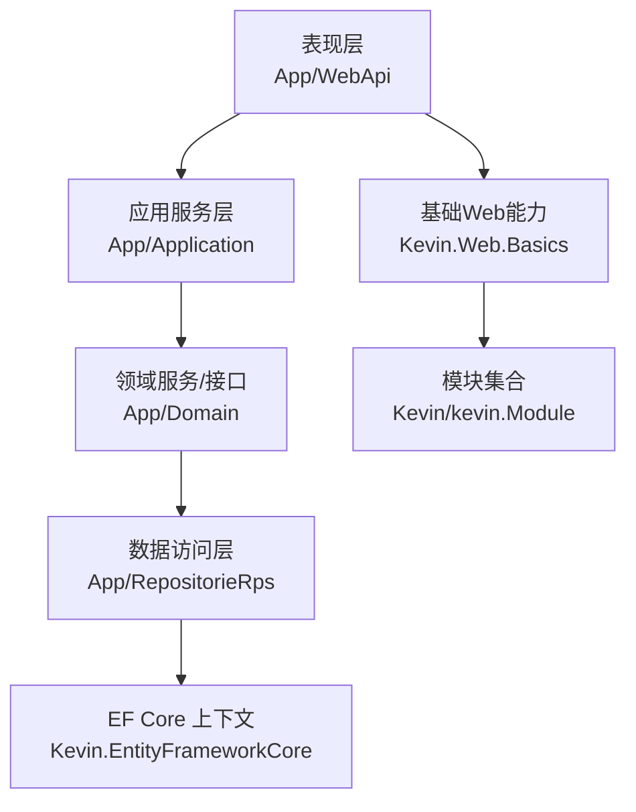
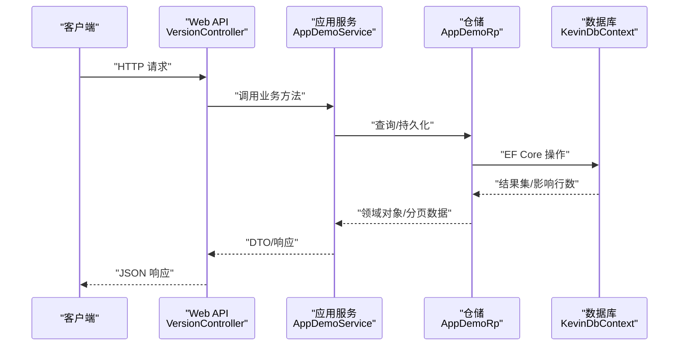
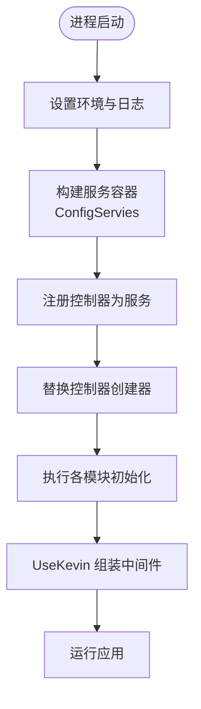
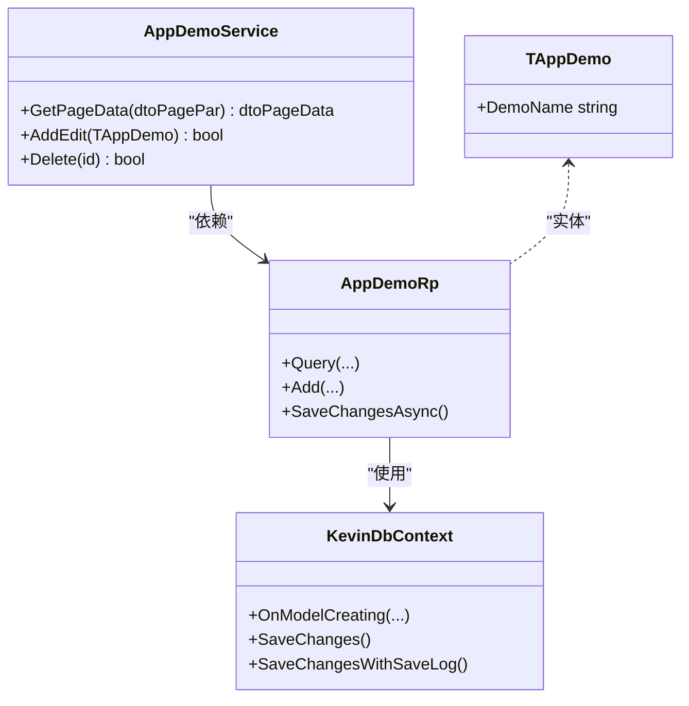
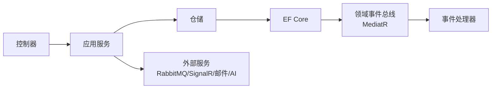
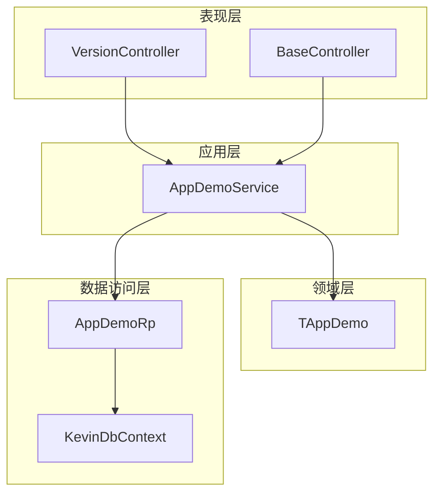

# 整体架构

<cite>
**本文引用的文件**
- [Program.cs](file://App/WebApi/Program.cs)
- [ServiceConfiguration.cs](file://Kevin/Kevin.Web.Basics/Extensions/ServiceConfiguration.cs)
- [ServiceCollectionExtensions.cs](file://Kevin/kevin.Module/kevin.Ioc/ServiceCollectionExtensions.cs)
- [ModuleInitializer.cs（应用层）](file://App/Application/ModuleInitializer.cs)
- [ModuleInitializer.cs（领域层）](file://App/Domain/ModuleInitializer.cs)
- [ModuleInitializer.cs（仓储层）](file://App/RepositorieRps/ModuleInitializer.cs)
- [BaseController.cs](file://Kevin/Kevin.Web.Basics/Controllers/BaseController.cs)
- [VersionController.cs](file://App/WebApi/Controllers/v1/VersionController.cs)
- [AppDemoService.cs](file://App/Application/Services/v1/AppDemoService.cs)
- [TAppDemo.cs](file://App/Domain/Entities/TAppDemo.cs)
- [AppDemoRp.cs](file://App/RepositorieRps/Repositories/v1/AppDemoRp.cs)
- [KevinDbContext.cs](file://Kevin/Kevin.EntityFrameworkCore/Database/KevinDbContext.cs)
</cite>

## 目录
1. [简介](#简介)
2. [项目结构](#项目结构)
3. [核心组件](#核心组件)
4. [架构总览](#架构总览)
5. [详细组件分析](#详细组件分析)
6. [依赖关系分析](#依赖关系分析)
7. [性能考量](#性能考量)
8. [故障排查指南](#故障排查指南)
9. [结论](#结论)
10. [附录](#附录)

## 简介
本文件为 NetCoreKevin 框架的整体架构文档，聚焦分层架构设计、模块化理念、启动流程与关键交互。系统采用表现层（Web API）、应用服务层、领域服务层、数据访问层的清晰分层，并通过反射驱动的模块初始化机制实现松耦合的扩展能力。同时集成认证授权、缓存、消息队列、SignalR、AI/RAG、代码生成等通用能力，形成企业级 Agent 框架底座。

## 项目结构
- 表现层：App/WebApi 提供对外 HTTP API；基础控制器与过滤器位于 Kevin/Kevin.Web.Basics。
- 应用服务层：App/Application 编排业务用例，调用领域与基础设施能力。
- 领域层：App/Domain 定义实体、接口与领域事件；Kevin/Domain 提供通用领域模型与配置。
- 数据访问层：App/RepositorieRps 实现具体仓储；Kevin.EntityFrameworkCore 封装 EF Core 上下文与配置。
- 公共模块：Kevin/kevin.Module 下包含鉴权、缓存、消息、SignalR、RAG、代码生成等可插拔模块。

图表来源
- [Program.cs:23-85](file://App/WebApi/Program.cs#L23-L85)
- [ServiceConfiguration.cs:48-347](file://Kevin/Kevin.Web.Basics/Extensions/ServiceConfiguration.cs#L48-L347)

章节来源
- [Program.cs:23-85](file://App/WebApi/Program.cs#L23-L85)
- [ServiceConfiguration.cs:48-347](file://Kevin/Kevin.Web.Basics/Extensions/ServiceConfiguration.cs#L48-L347)

## 核心组件
- 启动与管道：Program.cs 构建 WebApplication，注册日志、服务、中间件，并调用 UseKevin 完成统一管线装配。
- 服务配置：ServiceConfiguration.ConfigServies 集中注册 JWT、权限、缓存、分布式锁、SignalR、MQ、邮件、AI/RAG、代码生成、Hangfire 等能力。
- 模块初始化：通过替换 ControllerActivator 触发反射扫描，执行各模块 ModuleInitializer.Initialize，批量注入 IService、IBaseRepository 等。
- 数据访问：KevinDbContext 统一管理连接、模型映射、种子数据、领域事件发布、多租户与审计日志。
- 控制器基类：BaseController 提供通用能力与示例接口；VersionController 演示版本化 API。

章节来源
- [Program.cs:23-85](file://App/WebApi/Program.cs#L23-L85)
- [ServiceConfiguration.cs:48-347](file://Kevin/Kevin.Web.Basics/Extensions/ServiceConfiguration.cs#L48-L347)
- [ServiceCollectionExtensions.cs:10-15](file://Kevin/kevin.Module/kevin.Ioc/ServiceCollectionExtensions.cs#L10-L15)
- [ModuleInitializer.cs（应用层）:12-19](file://App/Application/ModuleInitializer.cs#L12-L19)
- [ModuleInitializer.cs（仓储层）:12-19](file://App/RepositorieRps/ModuleInitializer.cs#L12-L19)
- [KevinDbContext.cs:83-133](file://Kevin/Kevin.EntityFrameworkCore/Database/KevinDbContext.cs#L83-L133)
- [BaseController.cs:14-146](file://Kevin/Kevin.Web.Basics/Controllers/BaseController.cs#L14-L146)

## 架构总览
系统采用“表现层 → 应用服务层 → 领域层 → 数据访问层”的分层架构，结合模块化与反射驱动的服务发现与注入，实现高内聚、低耦合的可扩展体系。

图表来源
- [VersionController.cs:9-22](file://App/WebApi/Controllers/v1/VersionController.cs#L9-L22)
- [AppDemoService.cs:14-24](file://App/Application/Services/v1/AppDemoService.cs#L14-L24)
- [AppDemoRp.cs:7-12](file://App/RepositorieRps/Repositories/v1/AppDemoRp.cs#L7-L12)
- [KevinDbContext.cs:165-305](file://Kevin/Kevin.EntityFrameworkCore/Database/KevinDbContext.cs#L165-L305)

## 详细组件分析

### 启动流程（从 Program.cs 到模块初始化）
- 环境变量与日志：设置环境并启用自定义日志。
- 服务构建：ConfigServies 集中注册所有能力（JWT、权限、缓存、SignalR、MQ、AI/RAG、代码生成、Hangfire 等）。
- 控制器与服务：将控制器作为服务注册，并替换默认创建器以支持反射式模块初始化。
- 中间件管线：UseKevin 统一挂载跨域、静态文件、Swagger、路由、认证授权、SignalR、Hangfire 等。
- 模块初始化：ReplaceIocControllerActivator 触发各模块 ModuleInitializer.Initialize，完成 IService、IBaseRepository 等批量注入。

图表来源
- [Program.cs:23-85](file://App/WebApi/Program.cs#L23-L85)
- [ServiceConfiguration.cs:48-347](file://Kevin/Kevin.Web.Basics/Extensions/ServiceConfiguration.cs#L48-L347)
- [ServiceCollectionExtensions.cs:10-15](file://Kevin/kevin.Module/kevin.Ioc/ServiceCollectionExtensions.cs#L10-L15)
- [ModuleInitializer.cs（应用层）:12-19](file://App/Application/ModuleInitializer.cs#L12-L19)
- [ModuleInitializer.cs（仓储层）:12-19](file://App/RepositorieRps/ModuleInitializer.cs#L12-L19)

章节来源
- [Program.cs:23-85](file://App/WebApi/Program.cs#L23-L85)
- [ServiceConfiguration.cs:48-347](file://Kevin/Kevin.Web.Basics/Extensions/ServiceConfiguration.cs#L48-L347)
- [ServiceCollectionExtensions.cs:10-15](file://Kevin/kevin.Module/kevin.Ioc/ServiceCollectionExtensions.cs#L10-L15)
- [ModuleInitializer.cs（应用层）:12-19](file://App/Application/ModuleInitializer.cs#L12-L19)
- [ModuleInitializer.cs（仓储层）:12-19](file://App/RepositorieRps/ModuleInitializer.cs#L12-L19)

### 表现层（Web API）
- 控制器组织：按版本划分（v1/v2），使用 ApiVersioning 进行版本管理。
- 基础能力：ApiControllerBase/BaseController 提供通用方法与权限控制、雪花ID、字典、二维码等。
- 示例接口：VersionController 展示版本化 API 的基本用法。

章节来源
- [VersionController.cs:9-22](file://App/WebApi/Controllers/v1/VersionController.cs#L9-L22)
- [BaseController.cs:14-146](file://Kevin/Kevin.Web.Basics/Controllers/BaseController.cs#L14-L146)

### 应用服务层
- 职责：编排用例、参数校验、事务边界、调用领域与基础设施。
- 示例：AppDemoService 实现分页查询、新增/更新、删除，并借助仓储与当前用户上下文填充租户与审计字段。

章节来源
- [AppDemoService.cs:14-81](file://App/Application/Services/v1/AppDemoService.cs#L14-L81)

### 领域服务层
- 职责：定义领域实体、接口与领域事件；承载核心业务规则。
- 示例：TAppDemo 继承基础实体，体现表名、字段描述等元数据约定。

章节来源
- [TAppDemo.cs:8-21](file://App/Domain/Entities/TAppDemo.cs#L8-L21)

### 数据访问层
- 仓储实现：AppDemoRp 基于 Repository<T, TId> 提供 CRUD 与查询能力。
- EF Core 上下文：KevinDbContext 负责连接字符串、模型映射、种子数据、全局拦截、领域事件发布、多租户与审计日志。

图表来源
- [AppDemoService.cs:14-81](file://App/Application/Services/v1/AppDemoService.cs#L14-L81)
- [AppDemoRp.cs:7-12](file://App/RepositorieRps/Repositories/v1/AppDemoRp.cs#L7-L12)
- [KevinDbContext.cs:165-305](file://Kevin/Kevin.EntityFrameworkCore/Database/KevinDbContext.cs#L165-L305)
- [TAppDemo.cs:8-21](file://App/Domain/Entities/TAppDemo.cs#L8-L21)

章节来源
- [AppDemoRp.cs:7-12](file://App/RepositorieRps/Repositories/v1/AppDemoRp.cs#L7-L12)
- [KevinDbContext.cs:83-133](file://Kevin/Kevin.EntityFrameworkCore/Database/KevinDbContext.cs#L83-L133)
- [KevinDbContext.cs:165-305](file://Kevin/Kevin.EntityFrameworkCore/Database/KevinDbContext.cs#L165-L305)
- [KevinDbContext.cs:405-583](file://Kevin/Kevin.EntityFrameworkCore/Database/KevinDbContext.cs#L405-L583)

### 模块化架构与通信机制
- 反射驱动模块初始化：通过替换控制器创建器，扫描引用程序集并执行 IModuleInitializer.Initialize，实现 IService、IBaseRepository 的批量注入。
- 通信机制：
  - 同步调用：控制器 → 应用服务 → 仓储 → EF Core。
  - 异步事件：领域事件通过 MediatR 在 SaveChanges 时发布，解耦副作用处理。
  - 外部集成：RabbitMQ、SignalR、邮件、AI/RAG、代码生成等通过扩展方法集中注册。

图表来源
- [ServiceCollectionExtensions.cs:10-15](file://Kevin/kevin.Module/kevin.Ioc/ServiceCollectionExtensions.cs#L10-L15)
- [ServiceConfiguration.cs:131-284](file://Kevin/Kevin.Web.Basics/Extensions/ServiceConfiguration.cs#L131-L284)
- [KevinDbContext.cs:405-524](file://Kevin/Kevin.EntityFrameworkCore/Database/KevinDbContext.cs#L405-L524)

章节来源
- [ServiceCollectionExtensions.cs:10-15](file://Kevin/kevin.Module/kevin.Ioc/ServiceCollectionExtensions.cs#L10-L15)
- [ServiceConfiguration.cs:131-284](file://Kevin/Kevin.Web.Basics/Extensions/ServiceConfiguration.cs#L131-L284)
- [KevinDbContext.cs:405-524](file://Kevin/Kevin.EntityFrameworkCore/Database/KevinDbContext.cs#L405-L524)

## 依赖关系分析
- 表现层依赖应用服务与基础 Web 能力。
- 应用服务依赖领域接口与仓储抽象。
- 仓储依赖 EF Core 上下文与共享基础设施。
- 模块间通过反射与 DI 容器解耦，避免硬编码依赖。

图表来源
- [VersionController.cs:9-22](file://App/WebApi/Controllers/v1/VersionController.cs#L9-L22)
- [BaseController.cs:14-146](file://Kevin/Kevin.Web.Basics/Controllers/BaseController.cs#L14-L146)
- [AppDemoService.cs:14-81](file://App/Application/Services/v1/AppDemoService.cs#L14-L81)
- [AppDemoRp.cs:7-12](file://App/RepositorieRps/Repositories/v1/AppDemoRp.cs#L7-L12)
- [KevinDbContext.cs:165-305](file://Kevin/Kevin.EntityFrameworkCore/Database/KevinDbContext.cs#L165-L305)
- [TAppDemo.cs:8-21](file://App/Domain/Entities/TAppDemo.cs#L8-L21)

章节来源
- [VersionController.cs:9-22](file://App/WebApi/Controllers/v1/VersionController.cs#L9-L22)
- [AppDemoService.cs:14-81](file://App/Application/Services/v1/AppDemoService.cs#L14-L81)
- [AppDemoRp.cs:7-12](file://App/RepositorieRps/Repositories/v1/AppDemoRp.cs#L7-L12)
- [KevinDbContext.cs:165-305](file://Kevin/Kevin.EntityFrameworkCore/Database/KevinDbContext.cs#L165-L305)
- [TAppDemo.cs:8-21](file://App/Domain/Entities/TAppDemo.cs#L8-L21)

## 性能考量
- 请求体大小与同步 IO：已放开最大请求体大小并允许同步 IO，适合大文件上传与兼容旧逻辑。
- JSON 序列化：自定义转换器与深度限制，兼顾可读性与安全性。
- 数据库：
  - 连接池与 DbContext 池化提升并发吞吐。
  - 默认索引列配置减少热点查询开销。
  - 关闭级联删除避免意外级联影响。
- 缓存与分布式锁：内存缓存与 Redis 分布式锁降低竞争与重复计算。
- 中间件顺序：认证授权置于路由之后，确保正确生效。

[本节为通用指导，不直接分析具体文件]

## 故障排查指南
- 启动失败：检查 Program.cs 中异常捕获与日志输出，确认 UseKevin 是否成功挂载中间件。
- 服务未注册：确认各模块 ModuleInitializer.Initialize 是否被反射执行，以及 IService/IBaseRepository 是否批量注入。
- 数据库问题：核对连接字符串、迁移程序集、MySQL 版本与历史表配置；检查 OnModelCreating 中的表/字段映射与索引。
- 领域事件未触发：确认 SaveChanges/SaveChangesWithSaveLog 中 MediatorEventBus 的执行路径与 IMediator 注入。
- 权限/认证：确认 UseAuthentication/UseAuthorization 位置与策略配置。

章节来源
- [Program.cs:23-92](file://App/WebApi/Program.cs#L23-L92)
- [ServiceConfiguration.cs:296-347](file://Kevin/Kevin.Web.Basics/Extensions/ServiceConfiguration.cs#L296-L347)
- [ServiceCollectionExtensions.cs:10-15](file://Kevin/kevin.Module/kevin.Ioc/ServiceCollectionExtensions.cs#L10-L15)
- [KevinDbContext.cs:83-133](file://Kevin/Kevin.EntityFrameworkCore/Database/KevinDbContext.cs#L83-L133)
- [KevinDbContext.cs:405-524](file://Kevin/Kevin.EntityFrameworkCore/Database/KevinDbContext.cs#L405-L524)

## 结论
NetCoreKevin 通过清晰的分层与模块化设计，实现了可扩展的企业级后端框架。反射驱动的模块初始化与统一的 ServiceConfiguration 使系统具备强内聚与弱耦合特性；EF Core 上下文集中处理模型、事件、多租户与审计，保障数据一致性与可观测性。结合丰富的基础设施集成（认证、缓存、消息、SignalR、AI/RAG 等），该框架能够快速支撑复杂业务场景与 AI Agent 能力。

[本节为总结性内容，不直接分析具体文件]

## 附录
- 关键入口与扩展点：
  - 启动入口：Program.Main
  - 服务配置：ServiceConfiguration.ConfigServies
  - 模块初始化：ServiceCollectionExtensions.ReplaceIocControllerActivator
  - 数据访问：KevinDbContext.OnModelCreating / SaveChanges*
- 常用配置项：
  - 连接字符串：dbConnection
  - 默认索引字段：DBDefaultHasIndexFields
  - CORS、SignalR、RabbitMQ、Email、Aliyun Asr、SnowflakeId、CodeGenerator、Hangfire 等

[本节为补充信息，不直接分析具体文件]