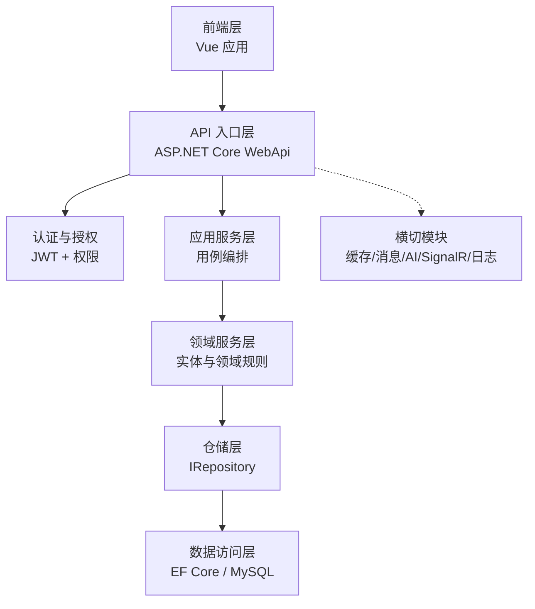
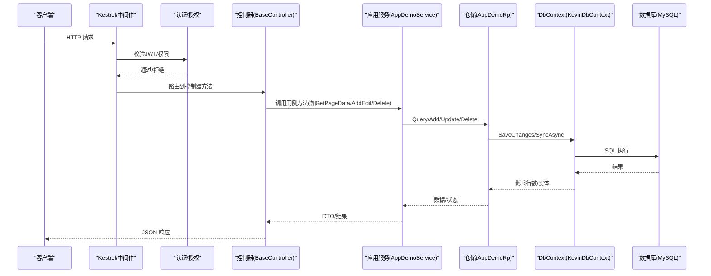
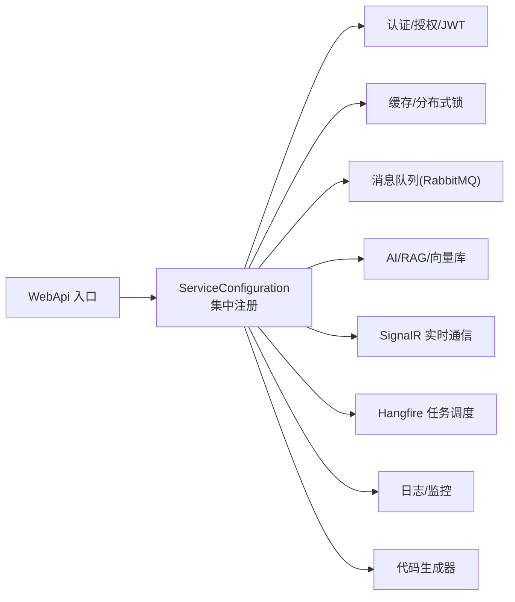
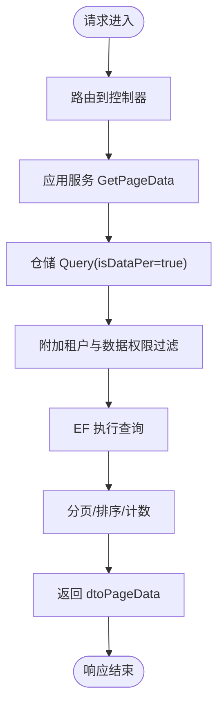
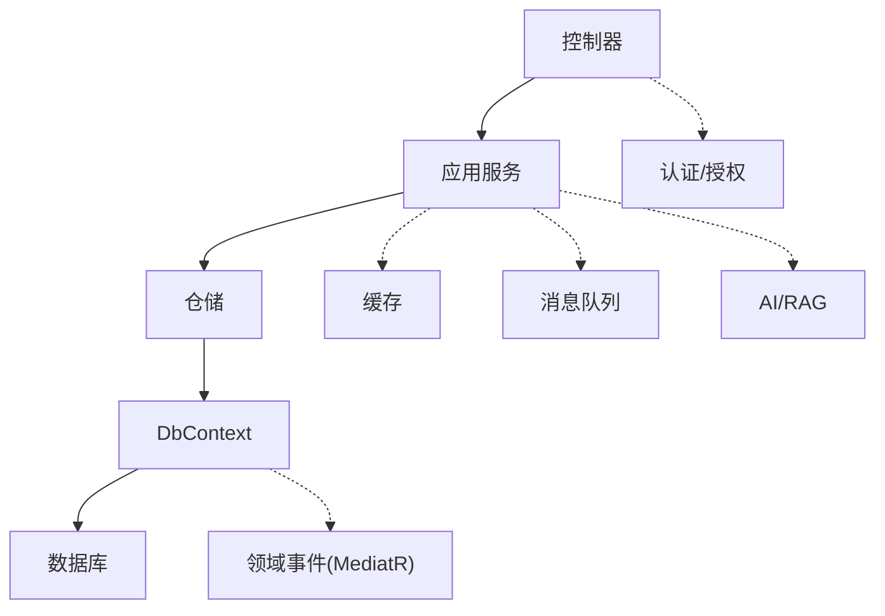

# 架构设计

<cite>
**本文引用的文件**
- [Program.cs](file://App/WebApi/Program.cs)
- [ServiceConfiguration.cs](file://Kevin/Kevin.Web.Basics/Extensions/ServiceConfiguration.cs)
- [BaseController.cs](file://Kevin/Kevin.Web.Basics/Controllers/BaseController.cs)
- [ApiControllerBase.cs](file://Kevin/Kevin.Web.Basics/Controllers/ApiControllerBase.cs)
- [ModuleInitializer.cs（应用层）](file://App/Application/ModuleInitializer.cs)
- [ModuleInitializer.cs（领域层）](file://App/Domain/ModuleInitializer.cs)
- [KevinDbContext.cs](file://Kevin/Kevin.EntityFrameworkCore/Database/KevinDbContext.cs)
- [Repository.cs](file://Kevin/Kevin.EntityFrameworkCore/_/Data/Repository.cs)
- [AppDemoService.cs](file://App/Application/Services/v1/AppDemoService.cs)
- [TAppDemo.cs](file://App/Domain/Entities/TAppDemo.cs)
- [AppDemoRp.cs](file://App/RepositorieRps/Repositories/v1/AppDemoRp.cs)
</cite>

## 目录
1. [简介](#简介)
2. [项目结构](#项目结构)
3. [核心组件](#核心组件)
4. [架构总览](#架构总览)
5. [详细组件分析](#详细组件分析)
6. [依赖关系分析](#依赖关系分析)
7. [性能考虑](#性能考虑)
8. [故障排查指南](#故障排查指南)
9. [结论](#结论)
10. [附录](#附录)

## 简介
本文件为 NetCoreKevin 框架的架构设计文档，面向前后端开发者与系统架构师。文档从分层架构、模块化设计、数据流处理、关键技术决策与设计模式等维度，系统化阐述整体架构与实现方式，并提供可视化图表与排错指引，帮助读者快速理解并高效使用框架。

## 项目结构
NetCoreKevin 采用典型的多层+模块化架构：
- 前端层：Vue 工程位于 vue/kevin.web.vue，负责页面交互与 API 调用。
- API 网关/入口层：WebApi 作为 ASP.NET Core 宿主，统一接入中间件、认证、路由与控制器。
- 应用服务层：App.Application 提供用例编排与业务编排能力，通过服务接口暴露功能。
- 领域服务层：App.Domain 定义实体、领域事件与领域接口，承载核心领域规则。
- 仓储层：App.RepositorieRps 基于通用仓储封装具体实体的数据访问。
- 数据访问层：Kevin.EntityFrameworkCore 提供 DbContext、配置、拦截器与通用 Repository。
- 基础模块：Kevin.Module 提供鉴权、缓存、消息队列、AI/RAG、SignalR、日志、代码生成等横切能力。

**图示来源**
- [Program.cs:23-85](file://App/WebApi/Program.cs#L23-L85)
- [ServiceConfiguration.cs:48-374](file://Kevin/Kevin.Web.Basics/Extensions/ServiceConfiguration.cs#L48-L374)

**章节来源**
- [Program.cs:23-85](file://App/WebApi/Program.cs#L23-L85)
- [ServiceConfiguration.cs:48-374](file://Kevin/Kevin.Web.Basics/Extensions/ServiceConfiguration.cs#L48-L374)

## 核心组件
- 应用启动与管道：Program 构建 WebApplication，注册日志、异常处理、全局服务上下文；ServiceConfiguration 集中注册跨域、认证、权限、缓存、消息队列、AI/RAG、SignalR、Hangfire、Swagger、静态文件等能力。
- 控制器基类：ApiControllerBase 注入 DbContext、CurrentUser、Configuration、分布式锁；BaseController 提供常用系统能力（如地区级联、二维码、雪花ID）。
- 应用服务：AppDemoService 演示分页查询、新增/编辑、删除等用例，调用仓储完成持久化。
- 领域实体：TAppDemo 继承基础实体，体现字段约定与表映射。
- 仓储实现：AppDemoRp 继承通用 Repository，复用租户过滤、数据权限、事务与审计保存。
- 数据访问：KevinDbContext 统一模型配置、多租户、乐观并发、领域事件发布、审计日志等。

**章节来源**
- [ServiceConfiguration.cs:48-374](file://Kevin/Kevin.Web.Basics/Extensions/ServiceConfiguration.cs#L48-L374)
- [BaseController.cs:11-146](file://Kevin/Kevin.Web.Basics/Controllers/BaseController.cs#L11-L146)
- [ApiControllerBase.cs:9-20](file://Kevin/Kevin.Web.Basics/Controllers/ApiControllerBase.cs#L9-L20)
- [AppDemoService.cs:6-82](file://App/Application/Services/v1/AppDemoService.cs#L6-L82)
- [TAppDemo.cs:8-21](file://App/Domain/Entities/TAppDemo.cs#L8-L21)
- [AppDemoRp.cs:3-12](file://App/RepositorieRps/Repositories/v1/AppDemoRp.cs#L3-L12)
- [KevinDbContext.cs:24-583](file://Kevin/Kevin.EntityFrameworkCore/Database/KevinDbContext.cs#L24-L583)

## 架构总览
下图展示请求从进入 WebApi 到返回响应的完整链路，涵盖认证、权限、应用服务、仓储与数据库访问，以及横切关注点（日志、缓存、消息、AI/RAG、SignalR 等）。

**图示来源**
- [Program.cs:23-85](file://App/WebApi/Program.cs#L23-L85)
- [ServiceConfiguration.cs:92-119](file://Kevin/Kevin.Web.Basics/Extensions/ServiceConfiguration.cs#L92-L119)
- [BaseController.cs:11-146](file://Kevin/Kevin.Web.Basics/Controllers/BaseController.cs#L11-L146)
- [AppDemoService.cs:14-82](file://App/Application/Services/v1/AppDemoService.cs#L14-L82)
- [Repository.cs:24-173](file://Kevin/Kevin.EntityFrameworkCore/_/Data/Repository.cs#L24-L173)
- [KevinDbContext.cs:165-303](file://Kevin/Kevin.EntityFrameworkCore/Database/KevinDbContext.cs#L165-L303)

## 详细组件分析

### 分层与职责
- 前端层：发起 HTTP 请求，渲染 UI，管理本地状态。
- API 网关层：统一入口，负责中间件管线、认证授权、版本控制、Swagger、静态资源、SignalR 等。
- 应用服务层：编排用例，协调领域服务与外部依赖，进行输入输出转换与业务校验。
- 领域服务层：定义实体、领域事件与领域接口，承载核心业务规则。
- 仓储层：对数据访问进行抽象，统一分页、排序、过滤、事务与审计。
- 数据访问层：基于 EF Core 的 DbContext，负责模型映射、迁移、拦截器、领域事件发布与审计日志。

**章节来源**
- [ServiceConfiguration.cs:48-374](file://Kevin/Kevin.Web.Basics/Extensions/ServiceConfiguration.cs#L48-L374)
- [AppDemoService.cs:6-82](file://App/Application/Services/v1/AppDemoService.cs#L6-L82)
- [Repository.cs:24-173](file://Kevin/Kevin.EntityFrameworkCore/_/Data/Repository.cs#L24-L173)
- [KevinDbContext.cs:24-583](file://Kevin/Kevin.EntityFrameworkCore/Database/KevinDbContext.cs#L24-L583)

### 模块化架构
- 模块划分：按领域与横切能力拆分为多个子模块（如 Kevin.Authentication.Jwt、Kevin.SignalR、Kevin.RabbitMQ、Kevin.RAG、Kevin.CodeGenerator 等），通过扩展方法集中注册。
- 初始化机制：各模块提供 ModuleInitializer，在应用启动时批量扫描并注册服务，便于解耦与可插拔。
- 依赖关系：上层依赖下层接口，避免反向耦合；横切能力以扩展形式注入，不影响业务模块。

**图示来源**
- [ServiceConfiguration.cs:79-284](file://Kevin/Kevin.Web.Basics/Extensions/ServiceConfiguration.cs#L79-L284)
- [ModuleInitializer.cs（应用层）:10-19](file://App/Application/ModuleInitializer.cs#L10-L19)
- [ModuleInitializer.cs（领域层）:7-13](file://App/Domain/ModuleInitializer.cs#L7-L13)

**章节来源**
- [ServiceConfiguration.cs:79-284](file://Kevin/Kevin.Web.Basics/Extensions/ServiceConfiguration.cs#L79-L284)
- [ModuleInitializer.cs（应用层）:10-19](file://App/Application/ModuleInitializer.cs#L10-L19)
- [ModuleInitializer.cs（领域层）:7-13](file://App/Domain/ModuleInitializer.cs#L7-L13)

### 数据流处理流程（请求到响应）
以下流程图展示了分页查询的关键路径：控制器接收参数 -> 应用服务组装查询 -> 仓储附加租户/数据权限过滤 -> EF 执行 SQL -> 返回分页结果。

**图示来源**
- [BaseController.cs:11-146](file://Kevin/Kevin.Web.Basics/Controllers/BaseController.cs#L11-L146)
- [AppDemoService.cs:14-24](file://App/Application/Services/v1/AppDemoService.cs#L14-L24)
- [Repository.cs:63-163](file://Kevin/Kevin.EntityFrameworkCore/_/Data/Repository.cs#L63-L163)

**章节来源**
- [AppDemoService.cs:14-24](file://App/Application/Services/v1/AppDemoService.cs#L14-L24)
- [Repository.cs:63-163](file://Kevin/Kevin.EntityFrameworkCore/_/Data/Repository.cs#L63-L163)

### 关键技术与设计模式
- 依赖注入：通过 ServiceCollection 集中注册，控制器与服务均支持 DI；使用生命周期（Singleton/Scoped/Transient）管理对象。
- 仓储模式：通用 Repository<T,TId> 封装 CRUD、分页、事务、审计保存；具体 Rp 仅声明构造与继承。
- DTO 模式：应用服务对外暴露 DTO（如 dtoPageData），屏蔽内部实体细节。
- 领域事件：在 SaveChanges 中收集并发布领域事件，解耦副作用逻辑。
- 多租户与数据权限：仓储默认附加 TenantId 与 CreateUserId 的数据权限过滤，保障隔离与安全。
- 乐观并发：修改实体时更新 RowVersion，防止覆盖写。
- 横切关注点：认证、授权、日志、缓存、消息队列、SignalR、Hangfire、AI/RAG 等以模块扩展方式注入。

**章节来源**
- [ServiceConfiguration.cs:48-374](file://Kevin/Kevin.Web.Basics/Extensions/ServiceConfiguration.cs#L48-L374)
- [Repository.cs:24-173](file://Kevin/Kevin.EntityFrameworkCore/_/Data/Repository.cs#L24-L173)
- [KevinDbContext.cs:405-583](file://Kevin/Kevin.EntityFrameworkCore/Database/KevinDbContext.cs#L405-L583)

### 系统边界与集成模式
- 系统边界：WebApi 作为对外边界，暴露 RESTful API；内部通过模块与扩展方法组织能力。
- 集成模式：
  - 外部服务：短信、语音识别、邮件、云存储、向量库、LLM 等通过配置注入。
  - 异步通信：RabbitMQ 用于消息发布/订阅；SignalR 用于实时推送。
  - 任务调度：Hangfire 用于后台任务。
  - 缓存：内存或 Redis 缓存，提升读性能。
  - 鉴权：JWT 令牌 + 权限校验，保护 API。

**章节来源**
- [ServiceConfiguration.cs:121-284](file://Kevin/Kevin.Web.Basics/Extensions/ServiceConfiguration.cs#L121-L284)

## 依赖关系分析
- 控制器依赖应用服务，应用服务依赖仓储接口，仓储依赖 EF Core DbContext。
- 横切模块通过扩展方法注入，不直接耦合业务模块。
- 领域事件通过 MediatR 在数据持久化后发布，解耦后续处理。

**图示来源**
- [BaseController.cs:11-146](file://Kevin/Kevin.Web.Basics/Controllers/BaseController.cs#L11-L146)
- [AppDemoService.cs:6-82](file://App/Application/Services/v1/AppDemoService.cs#L6-L82)
- [Repository.cs:24-173](file://Kevin/Kevin.EntityFrameworkCore/_/Data/Repository.cs#L24-L173)
- [KevinDbContext.cs:405-524](file://Kevin/Kevin.EntityFrameworkCore/Database/KevinDbContext.cs#L405-L524)

**章节来源**
- [BaseController.cs:11-146](file://Kevin/Kevin.Web.Basics/Controllers/BaseController.cs#L11-L146)
- [AppDemoService.cs:6-82](file://App/Application/Services/v1/AppDemoService.cs#L6-L82)
- [Repository.cs:24-173](file://Kevin/Kevin.EntityFrameworkCore/_/Data/Repository.cs#L24-L173)
- [KevinDbContext.cs:405-524](file://Kevin/Kevin.EntityFrameworkCore/Database/KevinDbContext.cs#L405-L524)

## 性能考虑
- 连接池与上下文池：DbContextPool 提高 DbContext 复用率，降低分配开销。
- 查询优化：仓储默认附加租户与数据权限过滤，减少不必要的数据传输；合理使用分页与投影。
- 缓存策略：热点数据使用内存或 Redis 缓存，降低数据库压力。
- 异步与并发：全面使用异步 API，避免阻塞线程；合理设置最大请求体大小与同步 IO 开关。
- 压缩与编码：启用响应压缩与宽松 JSON 编码，减少带宽占用。
- 日志与审计：仅在必要时记录变更差异，避免频繁写入造成性能瓶颈。

[本节为通用性能建议，无需特定文件引用]

## 故障排查指南
- 启动失败：检查 Program 中的异常捕获与日志输出；确认环境变量与配置文件正确加载。
- 认证失败：确认 JWT 配置与 UseAuthentication/UseAuthorization 顺序；检查令牌签发与验证配置。
- 权限不足：核对权限策略与角色绑定；确认 CurrentUser 是否正确注入。
- 数据权限异常：检查仓储 Query 是否启用 isDataPer；确认用户模块数据权限集合。
- 领域事件未触发：确认 SaveChanges 中已启用领域事件发布；检查 IMediator 是否注入。
- 审计日志缺失：确认 SaveChangesWithSaveLog 的使用；检查 SnowflakeId 与 HttpContextAccessor 可用性。

**章节来源**
- [Program.cs:23-92](file://App/WebApi/Program.cs#L23-L92)
- [ServiceConfiguration.cs:92-119](file://Kevin/Kevin.Web.Basics/Extensions/ServiceConfiguration.cs#L92-L119)
- [KevinDbContext.cs:405-583](file://Kevin/Kevin.EntityFrameworkCore/Database/KevinDbContext.cs#L405-L583)

## 结论
NetCoreKevin 框架通过清晰的分层与模块化设计，结合依赖注入、仓储模式、DTO 模式与领域事件，提供了可扩展、易维护的企业级后端基础。统一的中间件管线与横切能力注入，使得认证、权限、缓存、消息、AI/RAG、SignalR 等能力可插拔且易于组合。遵循本文档的分层与规范，可快速搭建稳定高效的业务系统。

[本节为总结性内容，无需特定文件引用]

## 附录
- 示例用例：AppDemoService 展示了分页查询、新增/编辑、删除的标准实现，可作为新模块开发的参考模板。
- 代码生成：框架内置代码生成器，可自动生成服务、仓储、接口等样板代码，提升开发效率。

**章节来源**
- [AppDemoService.cs:14-82](file://App/Application/Services/v1/AppDemoService.cs#L14-L82)
- [ServiceConfiguration.cs:256-264](file://Kevin/Kevin.Web.Basics/Extensions/ServiceConfiguration.cs#L256-L264)