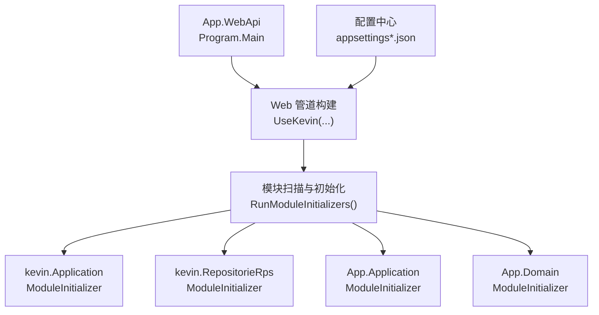
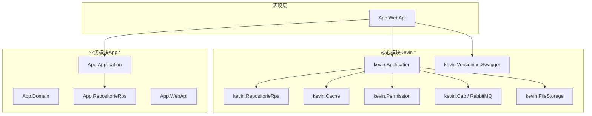
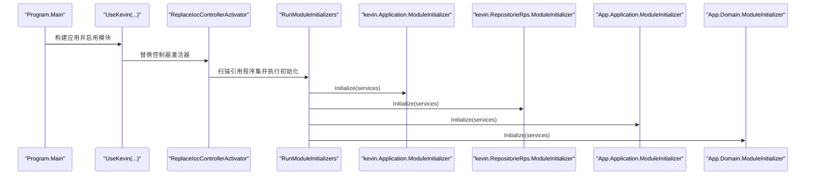
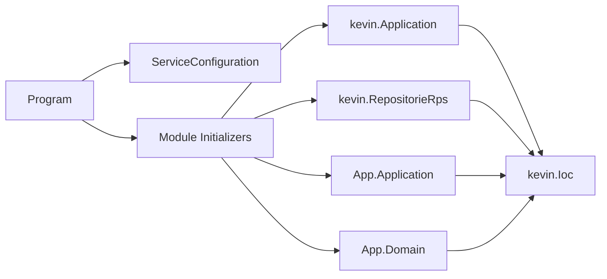
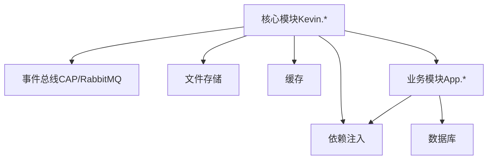

# 模块化设计

<cite>
**本文引用的文件**
- [Program.cs](file://App/WebApi/Program.cs)
- [IModuleInitializer.cs](file://Kevin/kevin.Module/kevin.Ioc/TieredServiceRegistration/IModuleInitializer.cs)
- [ServiceCollectionExtensions.cs（Ioc）](file://Kevin/kevin.Module/kevin.Ioc/ServiceCollectionExtensions.cs)
- [ModuleInitializer.cs（App.Application）](file://App/Application/ModuleInitializer.cs)
- [ModuleInitializer.cs（App.Domain）](file://App/Domain/ModuleInitializer.cs)
- [ModuleInitializer.cs（kevin.Application）](file://Kevin/Application/ModuleInitializer.cs)
- [ModuleInitializer.cs（kevin.RepositorieRps）](file://Kevin/RepositorieRps/ModuleInitializer.cs)
- [appsettings.json](file://App/WebApi/appsettings.json)
- [appsettings.Development.json](file://App/WebApi/appsettings.Development.json)
- [ServiceConfiguration.cs](file://Kevin/Kevin.Web.Basics/Extensions/ServiceConfiguration.cs)
- [KevinAllModuleMarker.cs](file://Kevin/kevin.Module/Kevin.ALL.Module/KevinAllModuleMarker.cs)
</cite>

## 目录
1. [简介](#简介)
2. [项目结构](#项目结构)
3. [核心组件](#核心组件)
4. [架构总览](#架构总览)
5. [详细组件分析](#详细组件分析)
6. [依赖关系分析](#依赖关系分析)
7. [性能考虑](#性能考虑)
8. [故障排查指南](#故障排查指南)
9. [结论](#结论)
10. [附录：模块开发指南与集成示例](#附录：模块开发指南与集成示例)

## 简介
本文件面向 NetCoreKevin 框架的模块化设计，系统性阐述模块注册、发现与加载机制；明确核心模块（Kevin.*）与业务模块（App.*）的职责边界与依赖关系；说明模块间通信（事件总线、依赖注入、服务发现）；描述模块生命周期（初始化、配置、销毁）；并提供新模块创建、接口定义与功能实现的实践指南，以及模块依赖图与集成示例。

## 项目结构
- 应用入口位于 App.WebApi，负责启动 Web 主机、配置日志、构建服务容器并启用中间件管线。
- 模块化基础设施位于 Kevin/kevin.Module，提供 IModuleInitializer 接口与模块扫描/执行扩展。
- 各层模块（Application、Domain、RepositorieRps）通过各自的 ModuleInitializer 实现 IService/IBaseRepository 等批量注册。
- 配置集中在 appsettings.json 及其环境覆盖文件中，包含数据库、Redis、Hangfire、JWT、代码生成器区域映射等。

图表来源
- [Program.cs:23-85](file://App/WebApi/Program.cs#L23-L85)
- [ServiceCollectionExtensions.cs（Ioc）:10-15](file://Kevin/kevin.Module/kevin.Ioc/ServiceCollectionExtensions.cs#L10-L15)

章节来源
- [Program.cs:23-85](file://App/WebApi/Program.cs#L23-L85)
- [appsettings.json:1-38](file://App/WebApi/appsettings.json#L1-L38)
- [appsettings.Development.json:1-38](file://App/WebApi/appsettings.Development.json#L1-L38)

## 核心组件
- IModuleInitializer：模块初始化契约，所有模块需实现 Initialize(IServiceCollection) 以完成服务注册与能力装配。
- ServiceCollectionExtensions.ReplaceIocControllerActivator：替换控制器激活器，触发模块扫描与初始化。
- 各层 ModuleInitializer：在各自程序集中实现 IService/IBaseRepository 等的批量注册，并通过全局集合暴露给运行时使用。
- Program：应用启动时调用 UseKevin，进而驱动模块初始化流程。

章节来源
- [IModuleInitializer.cs:5-15](file://Kevin/kevin.Module/kevin.Ioc/TieredServiceRegistration/IModuleInitializer.cs#L5-L15)
- [ServiceCollectionExtensions.cs（Ioc）:10-15](file://Kevin/kevin.Module/kevin.Ioc/ServiceCollectionExtensions.cs#L10-L15)
- [ModuleInitializer.cs（kevin.Application）:15-27](file://Kevin/Application/ModuleInitializer.cs#L15-L27)
- [ModuleInitializer.cs（kevin.RepositorieRps）:10-19](file://Kevin/RepositorieRps/ModuleInitializer.cs#L10-L19)
- [ModuleInitializer.cs（App.Application）:10-19](file://App/Application/ModuleInitializer.cs#L10-L19)
- [ModuleInitializer.cs（App.Domain）:7-13](file://App/Domain/ModuleInitializer.cs#L7-L13)

## 架构总览
NetCoreKevin 采用“分层 + 模块化”的架构：
- 表现层（App.WebApi）仅负责请求接入与中间件编排。
- 核心能力由 Kevin.* 模块提供（如 AI、权限、缓存、消息队列、存储等）。
- 业务领域由 App.* 模块承载（实体、仓储、服务、API 控制器）。
- 模块之间通过依赖注入解耦，通过事件总线（CAP/RabbitMQ）进行异步通信，通过服务发现（Consul）支持分布式部署。

图表来源
- [Program.cs:23-85](file://App/WebApi/Program.cs#L23-L85)
- [ModuleInitializer.cs（kevin.Application）:15-27](file://Kevin/Application/ModuleInitializer.cs#L15-L27)
- [ModuleInitializer.cs（kevin.RepositorieRps）:10-19](file://Kevin/RepositorieRps/ModuleInitializer.cs#L10-L19)
- [ModuleInitializer.cs（App.Application）:10-19](file://App/Application/ModuleInitializer.cs#L10-L19)
- [ModuleInitializer.cs（App.Domain）:7-13](file://App/Domain/ModuleInitializer.cs#L7-L13)

## 详细组件分析

### 模块注册与发现机制
- 入口：Program 中调用 UseKevin(builder.Configuration)，内部会执行 ReplaceIocControllerActivator。
- 替换控制器激活器后，立即执行 RunModuleInitializers(ReflectionScheduler.GetAllReferencedAssemblies())，扫描引用程序集并调用每个模块的 IModuleInitializer.Initialize。
- 各模块在 Initialize 中完成服务注册与全局集合填充。

图表来源
- [Program.cs:23-85](file://App/WebApi/Program.cs#L23-L85)
- [ServiceCollectionExtensions.cs（Ioc）:10-15](file://Kevin/kevin.Module/kevin.Ioc/ServiceCollectionExtensions.cs#L10-L15)
- [ModuleInitializer.cs（kevin.Application）:15-27](file://Kevin/Application/ModuleInitializer.cs#L15-L27)
- [ModuleInitializer.cs（kevin.RepositorieRps）:10-19](file://Kevin/RepositorieRps/ModuleInitializer.cs#L10-L19)
- [ModuleInitializer.cs（App.Application）:10-19](file://App/Application/ModuleInitializer.cs#L10-L19)
- [ModuleInitializer.cs（App.Domain）:7-13](file://App/Domain/ModuleInitializer.cs#L7-L13)

章节来源
- [Program.cs:23-85](file://App/WebApi/Program.cs#L23-L85)
- [ServiceCollectionExtensions.cs（Ioc）:10-15](file://Kevin/kevin.Module/kevin.Ioc/ServiceCollectionExtensions.cs#L10-L15)

### 核心模块（Kevin.*）职责划分
- kevin.Application：注册应用层服务（如 AI 工具、消息、当前用户上下文等），并批量注册 IService 到全局集合。
- kevin.RepositorieRps：批量注册 IBaseRepository 到全局集合，支撑数据访问抽象。
- kevin.Cache、kevin.Permission、kevin.Cap/RabbitMQ、kevin.FileStorage、kevin.Versioning.Swagger：分别提供缓存、权限、事件总线与消息队列、文件存储、Swagger 版本化等横切能力。

章节来源
- [ModuleInitializer.cs（kevin.Application）:15-27](file://Kevin/Application/ModuleInitializer.cs#L15-L27)
- [ModuleInitializer.cs（kevin.RepositorieRps）:10-19](file://Kevin/RepositorieRps/ModuleInitializer.cs#L10-L19)

### 业务模块（App.*）职责划分
- App.Domain：定义业务实体与领域事件处理器，模块初始化用于领域相关服务注入。
- App.Application：实现业务服务，批量注册 IService 到全局集合，供上层调用。
- App.RepositorieRps：实现具体仓储逻辑，对接数据访问层。
- App.WebApi：对外暴露 API 控制器，编排中间件与路由。

章节来源
- [ModuleInitializer.cs（App.Domain）:7-13](file://App/Domain/ModuleInitializer.cs#L7-L13)
- [ModuleInitializer.cs（App.Application）:10-19](file://App/Application/ModuleInitializer.cs#L10-L19)

### 模块间通信机制
- 依赖注入：通过 IModuleInitializer 统一在服务容器中注册服务，跨模块通过接口解耦。
- 事件总线：基于 CAP 与 RabbitMQ 的分布式事件通信，确保最终一致性与可靠投递。
- 服务发现：通过 Consul 扩展（可启用）实现服务注册与发现，支撑微服务/分布式部署。

章节来源
- [appsettings.json:117-149](file://App/WebApi/appsettings.json#L117-L149)
- [appsettings.Development.json:117-150](file://App/WebApi/appsettings.Development.json#L117-L150)

### 模块生命周期管理
- 初始化：模块启动时，RunModuleInitializers 按引用顺序调用各模块 Initialize，完成服务注册与全局集合填充。
- 配置：通过 appsettings.json 与环境覆盖文件注入配置项（数据库、Redis、Hangfire、JWT、代码生成器等）。
- 销毁：遵循 .NET DI 生命周期（Transient/Scoped/Singleton），由宿主在应用关闭时释放资源。

章节来源
- [Program.cs:23-85](file://App/WebApi/Program.cs#L23-L85)
- [appsettings.json:1-38](file://App/WebApi/appsettings.json#L1-L38)
- [appsettings.Development.json:1-38](file://App/WebApi/appsettings.Development.json#L1-L38)

## 依赖关系分析
- Program 依赖 Web 基础扩展（ServiceConfiguration）与日志、HTTP 客户端等模块。
- 模块初始化依赖反射调度器扫描引用程序集，因此需要确保模块程序集被正确引用（例如 Kevin.ALL.Module 作为占位程序集）。
- 各层 ModuleInitializer 依赖 kevin.Ioc 提供的批量注册能力与 GlobalServices 全局集合。

图表来源
- [Program.cs:23-85](file://App/WebApi/Program.cs#L23-L85)
- [ServiceCollectionExtensions.cs（Ioc）:10-15](file://Kevin/kevin.Module/kevin.Ioc/ServiceCollectionExtensions.cs#L10-L15)
- [KevinAllModuleMarker.cs:1-10](file://Kevin/kevin.Module/Kevin.ALL.Module/KevinAllModuleMarker.cs#L1-L10)

章节来源
- [Program.cs:23-85](file://App/WebApi/Program.cs#L23-L85)
- [KevinAllModuleMarker.cs:1-10](file://Kevin/kevin.Module/Kevin.ALL.Module/KevinAllModuleMarker.cs#L1-L10)

## 性能考虑
- 批量服务注册：通过 IocHelper.BatchAddScopeds 减少重复代码，提升启动效率。
- 中间件优化：仅在开发环境启用开发者异常页，生产环境使用统一异常处理。
- 配置分离：不同环境使用独立配置文件，避免不必要的配置加载开销。
- 缓存与异步：合理使用缓存与异步 IO，降低数据库与外部服务压力。

[本节为通用指导，不直接分析具体文件]

## 故障排查指南
- 模块未初始化：检查是否调用了 UseKevin 与 ReplaceIocControllerActivator，确认模块程序集已被引用。
- 服务未找到：确认对应 ModuleInitializer 已实现 IService/IBaseRepository 的批量注册。
- 配置错误：核对 appsettings.json 中的连接字符串、Redis、Hangfire、JWT 等配置是否正确。
- 事件总线问题：检查 CAP/RabbitMQ 配置与连接状态，确认消息生产者/消费者正常。

章节来源
- [Program.cs:23-85](file://App/WebApi/Program.cs#L23-L85)
- [ModuleInitializer.cs（kevin.Application）:15-27](file://Kevin/Application/ModuleInitializer.cs#L15-L27)
- [ModuleInitializer.cs（kevin.RepositorieRps）:10-19](file://Kevin/RepositorieRps/ModuleInitializer.cs#L10-L19)
- [appsettings.json:1-38](file://App/WebApi/appsettings.json#L1-L38)

## 结论
NetCoreKevin 通过 IModuleInitializer 与反射扫描实现了松耦合的模块化架构。核心模块提供横切能力，业务模块聚焦领域实现，二者通过依赖注入与事件总线协作。该设计便于扩展与维护，适合企业级 SaaS 与微服务场景。

[本节为总结性内容，不直接分析具体文件]

## 附录：模块开发指南与集成示例

### 如何创建新模块
- 新建一个类库项目，实现 IModuleInitializer 接口，并在 Initialize 中注册服务。
- 将模块程序集加入主应用引用，确保能被反射扫描到。
- 如需作为聚合标记，可参考 Kevin.ALL.Module 的占位类做法。

章节来源
- [IModuleInitializer.cs:5-15](file://Kevin/kevin.Module/kevin.Ioc/TieredServiceRegistration/IModuleInitializer.cs#L5-L15)
- [KevinAllModuleMarker.cs:1-10](file://Kevin/kevin.Module/Kevin.ALL.Module/KevinAllModuleMarker.cs#L1-L10)

### 如何定义模块接口与实现
- 在 Domain 层定义接口（如 IServices、IRepositories）。
- 在 Application 层实现接口，并在 ModuleInitializer 中批量注册 IService。
- 在 RepositorieRps 层实现仓储接口，并在 ModuleInitializer 中批量注册 IBaseRepository。

章节来源
- [ModuleInitializer.cs（kevin.Application）:15-27](file://Kevin/Application/ModuleInitializer.cs#L15-L27)
- [ModuleInitializer.cs（kevin.RepositorieRps）:10-19](file://Kevin/RepositorieRps/ModuleInitializer.cs#L10-L19)
- [ModuleInitializer.cs（App.Application）:10-19](file://App/Application/ModuleInitializer.cs#L10-L19)

### 模块依赖图（概念）

[此图为概念示意，不直接映射具体源码文件]

### 集成示例（启动流程）
- 在 Program 中启用日志、配置服务、添加控制器、构建应用。
- 调用 UseKevin 完成模块初始化与服务装配。
- 运行应用后，可通过 Swagger 或 API 调用验证模块功能。

章节来源
- [Program.cs:23-85](file://App/WebApi/Program.cs#L23-L85)