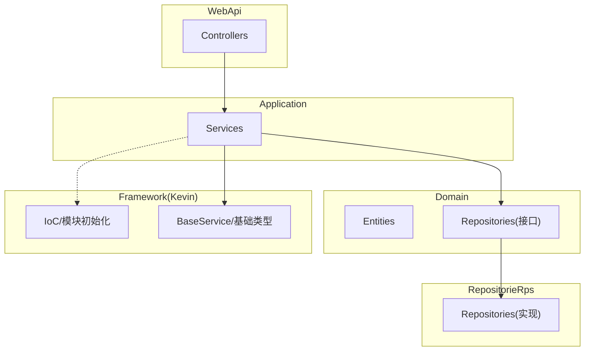
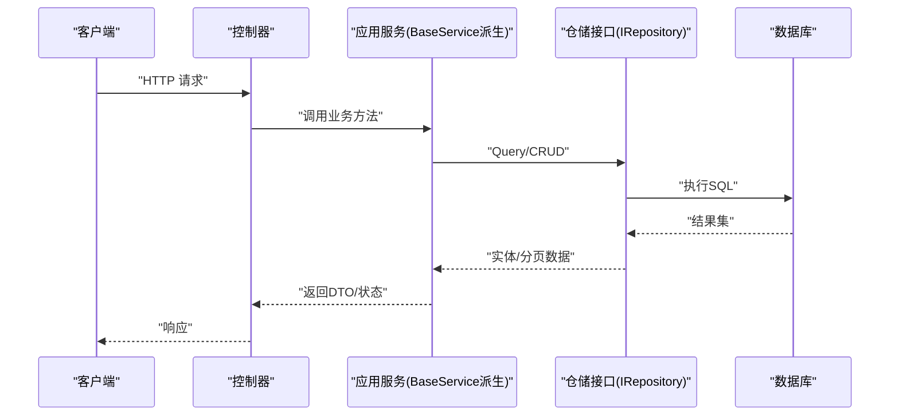
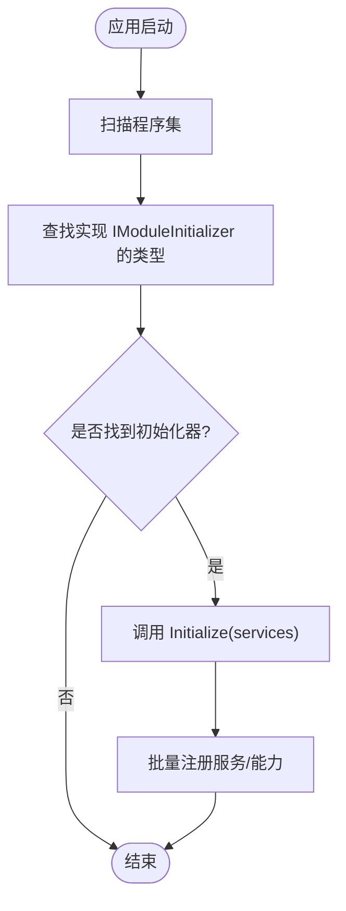
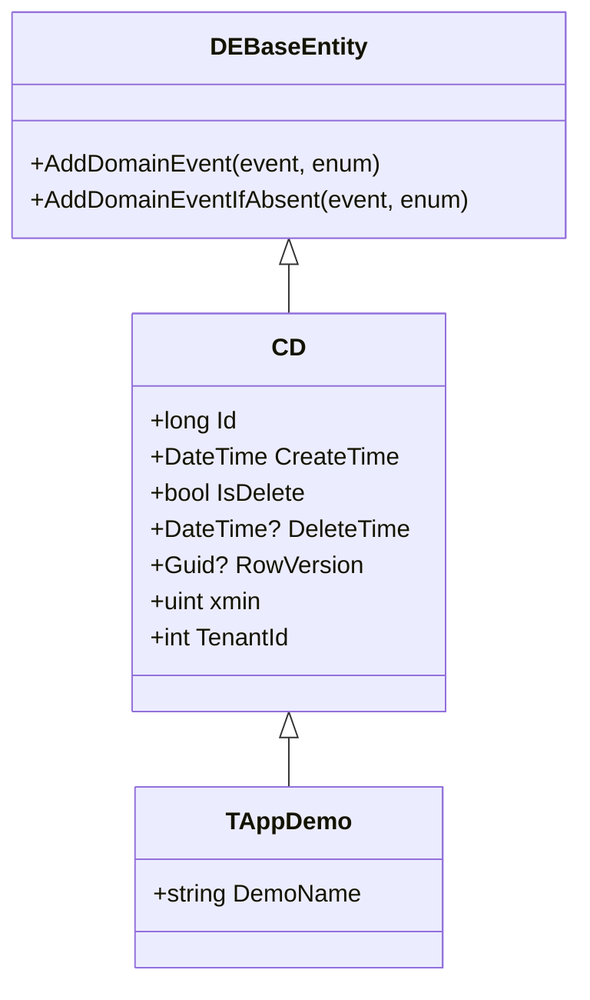
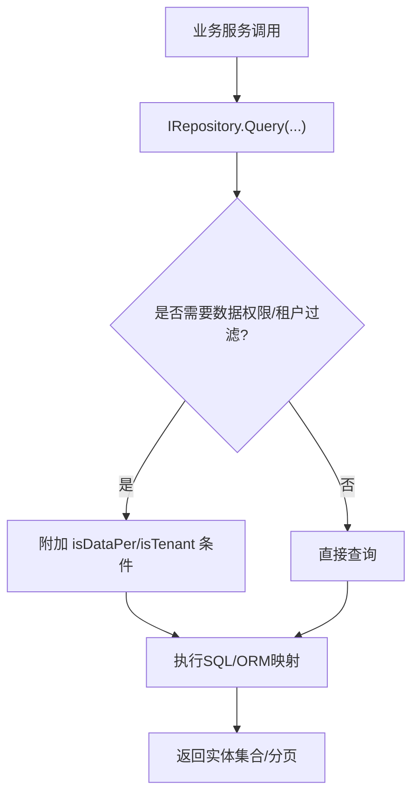
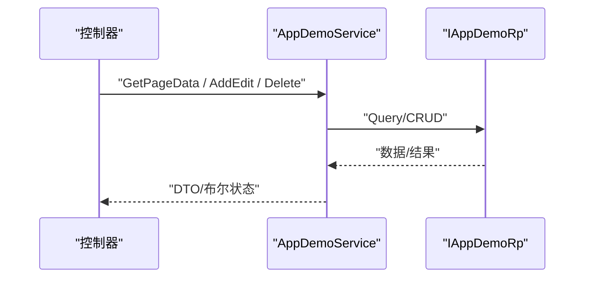
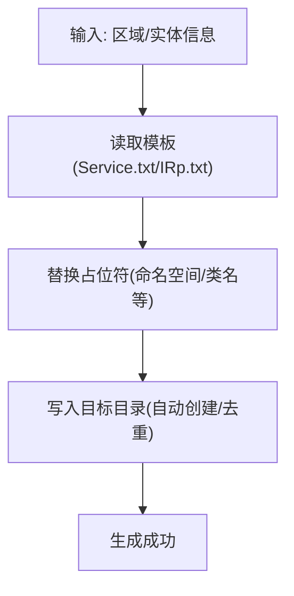
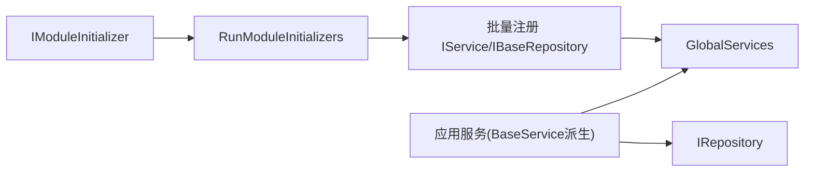

# 模块开发指南

<cite>
**本文引用的文件**
- [ModuleInitializer.cs](file://App/Application/ModuleInitializer.cs)
- [ModuleInitializer.cs](file://App/Domain/ModuleInitializer.cs)
- [ModuleInitializer.cs](file://App/RepositorieRps/ModuleInitializer.cs)
- [ModuleInitializer.cs](file://Kevin/Application/ModuleInitializer.cs)
- [ModuleInitializer.cs](file://Kevin/RepositorieRps/ModuleInitializer.cs)
- [IModuleInitializer.cs](file://Kevin/kevin.Module/kevin.Ioc/TieredServiceRegistration/IModuleInitializer.cs)
- [ModuleInitializerExtensions.cs](file://Kevin/kevin.Module/kevin.Ioc/TieredServiceRegistration/ModuleInitializerExtensions.cs)
- [BaseService.cs](file://Kevin/Application/Services/BaseService.cs)
- [IRepository`.cs](file://Kevin/kevin.Share/Interfaces/IRepository`.cs)
- [IBaseRepository.cs](file://Kevin/kevin.Share/Interfaces/IBaseRepository.cs)
- [TAppDemo.cs](file://App/Domain/Entities/TAppDemo.cs)
- [AppDemoService.cs](file://App/Application/Services/v1/AppDemoService.cs)
- [Service.txt](file://Kevin/kevin.Module/kevin.CodeGenerator/BuildCodeTemplate/Service.txt)
- [IRp.txt](file://Kevin/kevin.Module/kevin.CodeGenerator/BuildCodeTemplate/IRp.txt)
- [CodeGeneratorService.cs](file://Kevin/kevin.Module/kevin.CodeGenerator/CodeGeneratorService.cs)
- [ICodeGeneratorService.cs](file://Kevin/kevin.Module/kevin.CodeGenerator/ICodeGeneratorService.cs)
- [DEBaseEntity.cs](file://Kevin/kevin.Module/kevin.Domain.EventBus/DEBaseEntity.cs)
- [CD.cs](file://Kevin/Domain/Bases/CD.cs)
- [GlobalUsings.cs](file://Kevin/Domain/GlobalUsings.cs)
</cite>

## 目录
1. [简介](#简介)
2. [项目结构](#项目结构)
3. [核心组件](#核心组件)
4. [架构总览](#架构总览)
5. [详细组件分析](#详细组件分析)
6. [依赖关系分析](#依赖关系分析)
7. [性能考虑](#性能考虑)
8. [故障排查指南](#故障排查指南)
9. [结论](#结论)
10. [附录](#附录)

## 简介
本指南面向希望在 NetCoreKevin 框架中从零开始创建新业务模块的开发者。内容涵盖：
- 模块划分与命名约定、代码组织规范
- 使用内置代码生成器快速生成实体、DTO、仓储接口与服务控制器骨架
- 模块接口定义规范与实现要求
- 测试策略（单元测试、集成测试、模拟对象）
- 完整示例：从需求到部署上线的全流程
- 版本管理与向后兼容性建议

## 项目结构
NetCoreKevin 采用分层与模块化结合的组织方式，典型分层如下：
- WebApi：对外暴露 API（控制器层）
- Application：应用服务（编排领域逻辑、调用仓储）
- Domain：领域模型、事件、领域服务接口
- RepositorieRps：仓储实现（数据访问）
- Kevin.*：框架共享能力（IoC、权限、缓存、消息等）
- App.*：业务模块（可按功能域拆分多个子模块）

**图示来源**
- [ModuleInitializer.cs:10-26](file://App/Application/ModuleInitializer.cs#L10-L26)
- [ModuleInitializer.cs:15-29](file://Kevin/Application/ModuleInitializer.cs#L15-L29)
- [BaseService.cs:7-39](file://Kevin/Application/Services/BaseService.cs#L7-L39)

**章节来源**
- [ModuleInitializer.cs:10-26](file://App/Application/ModuleInitializer.cs#L10-L26)
- [ModuleInitializer.cs:15-29](file://Kevin/Application/ModuleInitializer.cs#L15-L29)
- [BaseService.cs:7-39](file://Kevin/Application/Services/BaseService.cs#L7-L39)

## 核心组件
- 模块初始化器：每个模块提供 ModuleInitializer 实现 IModuleInitializer，用于注册服务、扩展能力。
- IoC 批量注册：通过 IocHelper.BatchAddScopeds 自动扫描并注册 IService、IBaseRepository 等接口与实现。
- 基础服务：BaseService 提供当前用户、雪花ID、上下文等通用能力，所有应用服务继承它。
- 仓储接口：IRepository<T,TId> 提供统一查询、增删改、分页、并发控制等能力。
- 代码生成器：基于模板自动生成 Service、Repository 接口等代码，提升一致性。

**章节来源**
- [IModuleInitializer.cs:5-15](file://Kevin/kevin.Module/kevin.Ioc/TieredServiceRegistration/IModuleInitializer.cs#L5-L15)
- [ModuleInitializerExtensions.cs:15-33](file://Kevin/kevin.Module/kevin.Ioc/TieredServiceRegistration/ModuleInitializerExtensions.cs#L15-L33)
- [ModuleInitializer.cs:12-19](file://App/Application/ModuleInitializer.cs#L12-L19)
- [ModuleInitializer.cs:12-18](file://App/RepositorieRps/ModuleInitializer.cs#L12-L18)
- [BaseService.cs:7-39](file://Kevin/Application/Services/BaseService.cs#L7-L39)
- [IRepository`.cs:6-36](file://Kevin/kevin.Share/Interfaces/IRepository`.cs#L6-L36)
- [CodeGeneratorService.cs:179-204](file://Kevin/kevin.Module/kevin.CodeGenerator/CodeGeneratorService.cs#L179-L204)
- [ICodeGeneratorService.cs:5-24](file://Kevin/kevin.Module/kevin.CodeGenerator/ICodeGeneratorService.cs#L5-L24)

## 架构总览
下图展示了请求从控制器到应用服务、仓储再到数据库的典型调用链，以及模块初始化阶段的服务注册过程。

**图示来源**
- [AppDemoService.cs:14-80](file://App/Application/Services/v1/AppDemoService.cs#L14-L80)
- [IRepository`.cs:11-36](file://Kevin/kevin.Share/Interfaces/IRepository`.cs#L11-L36)

## 详细组件分析

### 模块初始化与服务注册
- 每个模块需实现 IModuleInitializer.Initialize，在其中完成服务注册或全局能力装配。
- 框架在启动时通过 RunModuleInitializers 扫描并执行各模块的初始化器。
- 推荐做法：
  - Application 层：批量注册 IService 到 GlobalServices，便于跨层消费。
  - RepositorieRps 层：批量注册 IBaseRepository 到 GlobalServices。
  - 特定服务：按需 AddScoped/AddSingleton 注册。

**图示来源**
- [ModuleInitializerExtensions.cs:15-33](file://Kevin/kevin.Module/kevin.Ioc/TieredServiceRegistration/ModuleInitializerExtensions.cs#L15-L33)
- [ModuleInitializer.cs:12-19](file://App/Application/ModuleInitializer.cs#L12-L19)
- [ModuleInitializer.cs:12-18](file://App/RepositorieRps/ModuleInitializer.cs#L12-L18)

**章节来源**
- [ModuleInitializer.cs:10-26](file://App/Application/ModuleInitializer.cs#L10-L26)
- [ModuleInitializer.cs:12-18](file://App/RepositorieRps/ModuleInitializer.cs#L12-L18)
- [ModuleInitializer.cs:15-29](file://Kevin/Application/ModuleInitializer.cs#L15-L29)
- [ModuleInitializerExtensions.cs:15-33](file://Kevin/kevin.Module/kevin.Ioc/TieredServiceRegistration/ModuleInitializerExtensions.cs#L15-L33)

### 实体与基础字段
- 实体基类：CD/DEBaseEntity 提供 Id、CreateTime、IsDelete、DeleteTime、RowVersion/xmin、TenantId 等通用字段。
- 业务实体：如 TAppDemo 继承 CUD_User（含用户相关审计字段），并通过特性标注表名与描述。
- 领域事件：DEBaseEntity 支持添加领域事件，便于后续事件驱动处理。

**图示来源**
- [DEBaseEntity.cs:6-43](file://Kevin/kevin.Module/kevin.Domain.EventBus/DEBaseEntity.cs#L6-L43)
- [CD.cs:9-73](file://Kevin/Domain/Bases/CD.cs#L9-L73)
- [TAppDemo.cs:8-21](file://App/Domain/Entities/TAppDemo.cs#L8-L21)

**章节来源**
- [DEBaseEntity.cs:6-43](file://Kevin/kevin.Module/kevin.Domain.EventBus/DEBaseEntity.cs#L6-L43)
- [CD.cs:9-73](file://Kevin/Domain/Bases/CD.cs#L9-L73)
- [TAppDemo.cs:8-21](file://App/Domain/Entities/TAppDemo.cs#L8-L21)

### 仓储接口与实现
- 仓储接口：IRepository<T,TId> 提供 Query、Add、Update、Remove、SaveChanges 等通用方法，支持租户与数据权限过滤。
- 批量注册：RepositorieRps 模块通过 IocHelper 将实现的仓储注入到 GlobalServices，供上层消费。

**图示来源**
- [IRepository`.cs:11-36](file://Kevin/kevin.Share/Interfaces/IRepository`.cs#L11-L36)
- [ModuleInitializer.cs:12-18](file://App/RepositorieRps/ModuleInitializer.cs#L12-L18)

**章节来源**
- [IRepository`.cs:11-36](file://Kevin/kevin.Share/Interfaces/IRepository`.cs#L11-L36)
- [ModuleInitializer.cs:12-18](file://App/RepositorieRps/ModuleInitializer.cs#L12-L18)

### 应用服务与控制器
- 应用服务：继承 BaseService，持有 CurrentUser、SnowflakeIdService 等能力；通过构造注入仓储接口进行数据操作。
- 控制器：按 v1/v2 等版本划分，调用应用服务完成业务编排。
- 示例：AppDemoService 演示了分页查询、新增/编辑、软删除的标准流程。

**图示来源**
- [AppDemoService.cs:14-80](file://App/Application/Services/v1/AppDemoService.cs#L14-L80)
- [BaseService.cs:7-39](file://Kevin/Application/Services/BaseService.cs#L7-L39)

**章节来源**
- [AppDemoService.cs:14-80](file://App/Application/Services/v1/AppDemoService.cs#L14-L80)
- [BaseService.cs:7-39](file://Kevin/Application/Services/BaseService.cs#L7-L39)

### 代码生成器与模板
- 代码生成器：提供 GetAreaNames、GetAreaNameEntityItems、BulidCode 等方法，根据配置生成代码。
- 模板文件：Service.txt、IRp.txt 等定义了生成的服务与仓储接口模板，包含占位符替换逻辑。
- 使用方式：在应用中注册 AddKevinCodeGenerator，并在需要时调用生成接口产出代码。

**图示来源**
- [ICodeGeneratorService.cs:5-24](file://Kevin/kevin.Module/kevin.CodeGenerator/ICodeGeneratorService.cs#L5-L24)
- [CodeGeneratorService.cs:179-204](file://Kevin/kevin.Module/kevin.CodeGenerator/CodeGeneratorService.cs#L179-L204)
- [Service.txt:1-34](file://Kevin/kevin.Module/kevin.CodeGenerator/BuildCodeTemplate/Service.txt#L1-L34)
- [IRp.txt:1-11](file://Kevin/kevin.Module/kevin.CodeGenerator/BuildCodeTemplate/IRp.txt#L1-L11)

**章节来源**
- [ICodeGeneratorService.cs:5-24](file://Kevin/kevin.Module/kevin.CodeGenerator/ICodeGeneratorService.cs#L5-L24)
- [CodeGeneratorService.cs:179-204](file://Kevin/kevin.Module/kevin.CodeGenerator/CodeGeneratorService.cs#L179-L204)
- [Service.txt:1-34](file://Kevin/kevin.Module/kevin.CodeGenerator/BuildCodeTemplate/Service.txt#L1-L34)
- [IRp.txt:1-11](file://Kevin/kevin.Module/kevin.CodeGenerator/BuildCodeTemplate/IRp.txt#L1-L11)

## 依赖关系分析
- 模块初始化依赖：RunModuleInitializers 依赖 IModuleInitializer 的实现，通过反射发现并调用。
- 应用服务依赖：BaseService 依赖 HttpContextAccessor、CurrentUser、SnowflakeIdService。
- 仓储依赖：IRepository<T,TId> 被应用服务注入，具体实现由 RepositorieRps 模块注册。
- 全局服务容器：GlobalServices 作为集中式服务容器，便于跨模块获取已注册实例。

**图示来源**
- [ModuleInitializerExtensions.cs:15-33](file://Kevin/kevin.Module/kevin.Ioc/TieredServiceRegistration/ModuleInitializerExtensions.cs#L15-L33)
- [ModuleInitializer.cs:12-19](file://App/Application/ModuleInitializer.cs#L12-L19)
- [ModuleInitializer.cs:12-18](file://App/RepositorieRps/ModuleInitializer.cs#L12-L18)
- [BaseService.cs:7-39](file://Kevin/Application/Services/BaseService.cs#L7-L39)

**章节来源**
- [ModuleInitializerExtensions.cs:15-33](file://Kevin/kevin.Module/kevin.Ioc/TieredServiceRegistration/ModuleInitializerExtensions.cs#L15-L33)
- [ModuleInitializer.cs:12-19](file://App/Application/ModuleInitializer.cs#L12-L19)
- [ModuleInitializer.cs:12-18](file://App/RepositorieRps/ModuleInitializer.cs#L12-L18)
- [BaseService.cs:7-39](file://Kevin/Application/Services/BaseService.cs#L7-L39)

## 性能考虑
- 分页查询：优先使用 IQueryable 的分页与排序，避免全量加载。
- 数据权限：合理使用 isDataPer 参数，减少不必要的数据拉取。
- 事务与日志：保存变更时使用 SaveChangesWithSaveLog 记录审计日志，注意在高并发场景下的开销。
- 并发控制：利用 RowVersion/xmin 防止覆盖更新。
- 异步化：尽量使用异步方法，提高吞吐。

[本节为通用性能建议，不直接分析具体文件]

## 故障排查指南
- 模块未生效：检查对应模块的 ModuleInitializer 是否正确实现并被扫描执行。
- 服务未解析：确认是否在 Initialize 中完成批量注册或显式 AddScoped。
- 数据权限异常：核对 Query 调用是否开启 isDataPer，以及权限配置是否正确。
- 并发冲突：出现行版本冲突时，提示用户刷新并重试。
- 生成代码失败：检查模板路径与占位符替换逻辑，确保目录存在且无同名冲突。

**章节来源**
- [ModuleInitializer.cs:12-19](file://App/Application/ModuleInitializer.cs#L12-L19)
- [ModuleInitializer.cs:12-18](file://App/RepositorieRps/ModuleInitializer.cs#L12-L18)
- [IRepository`.cs:11-36](file://Kevin/kevin.Share/Interfaces/IRepository`.cs#L11-L36)
- [CodeGeneratorService.cs:179-204](file://Kevin/kevin.Module/kevin.CodeGenerator/CodeGeneratorService.cs#L179-L204)

## 结论
通过统一的模块初始化、分层架构、仓储抽象与代码生成器，NetCoreKevin 提供了高效、一致的模块开发体验。遵循本指南可快速构建高质量的业务模块，并确保可维护性与可扩展性。

[本节为总结性内容，不直接分析具体文件]

## 附录

### 从零开始创建新模块的步骤
1. 规划模块边界与命名
   - 建议在 App 下按功能域新建子模块（如 App.Order、App.Payment）。
   - 保持分层一致：Application、Domain、RepositorieRps。
2. 定义实体与基础字段
   - 继承合适的基类（如 CUD_User），标注表名与描述。
3. 编写仓储接口与实现
   - 接口继承 IRepository<T,TId>，实现放在 RepositorieRps 模块。
4. 编写应用服务
   - 继承 BaseService，注入仓储接口，实现业务编排。
5. 注册模块初始化器
   - 在 Application 与 RepositorieRps 分别实现 ModuleInitializer，完成服务注册。
6. 使用代码生成器
   - 通过 CodeGenerator 生成 Service、IRp 等模板代码，减少重复劳动。
7. 编写控制器
   - 在 WebApi 下按版本划分控制器，调用应用服务。
8. 编写测试
   - 单元测试：针对服务与工具方法。
   - 集成测试：验证控制器到仓储的端到端流程。
   - 模拟对象：对第三方依赖进行 Mock。
9. 版本管理与向后兼容
   - API 版本化：使用 v1/v2 目录区分。
   - 实体演进：新增字段而非删除，保留旧字段一段时间。
   - 迁移脚本：配合 EF Core 迁移管理数据库变更。
10. 部署上线
    - 环境配置：appsettings、环境变量。
    - 容器化：Dockerfile 与镜像构建。
    - 监控与日志：启用日志与链路追踪。

**章节来源**
- [TAppDemo.cs:8-21](file://App/Domain/Entities/TAppDemo.cs#L8-L21)
- [AppDemoService.cs:14-80](file://App/Application/Services/v1/AppDemoService.cs#L14-L80)
- [ModuleInitializer.cs:12-19](file://App/Application/ModuleInitializer.cs#L12-L19)
- [ModuleInitializer.cs:12-18](file://App/RepositorieRps/ModuleInitializer.cs#L12-L18)
- [ICodeGeneratorService.cs:5-24](file://Kevin/kevin.Module/kevin.CodeGenerator/ICodeGeneratorService.cs#L5-L24)

### 模块接口定义规范与实现要求
- 接口命名：以 I 开头，动词+名词形式（如 IAppDemoService）。
- 方法设计：输入 DTO，输出 DTO 或基本类型；分页统一使用 dtoPagePar/dtoPageData。
- 错误处理：抛出友好异常（如 UserFriendlyException），避免泄露内部细节。
- 权限与租户：在仓储查询时启用 isDataPer/isTenant，保证数据隔离。
- 事务边界：在应用服务层控制事务范围，必要时使用框架事务过滤器。

**章节来源**
- [AppDemoService.cs:14-80](file://App/Application/Services/v1/AppDemoService.cs#L14-L80)
- [IRepository`.cs:11-36](file://Kevin/kevin.Share/Interfaces/IRepository`.cs#L11-L36)

### 测试策略
- 单元测试
  - 针对服务方法：使用内存仓储或 Mock 仓储接口。
  - 校验输入参数与返回值结构。
- 集成测试
  - 启动最小化宿主，连接测试数据库，验证控制器到仓储的完整链路。
- 模拟对象
  - 对第三方服务（如短信、邮件、存储）使用 Mock，确保测试稳定性。

[本节为通用测试建议，不直接分析具体文件]