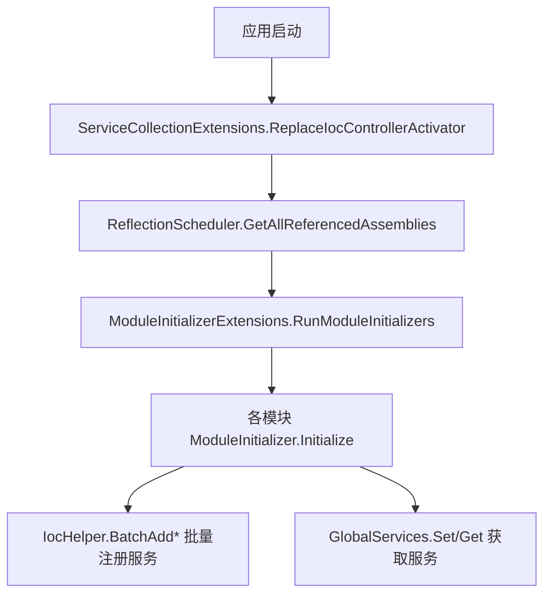
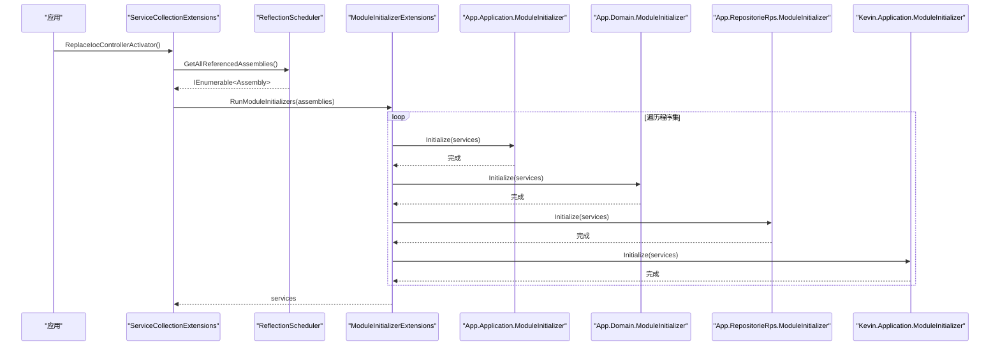
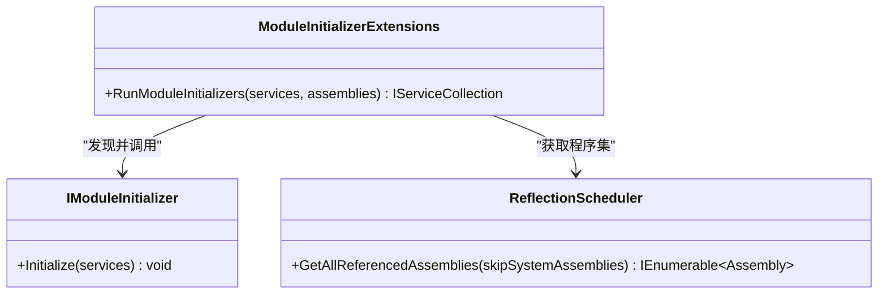
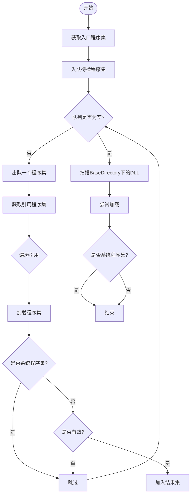
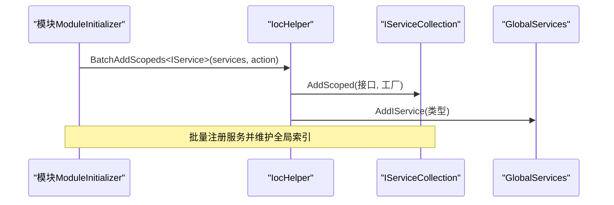
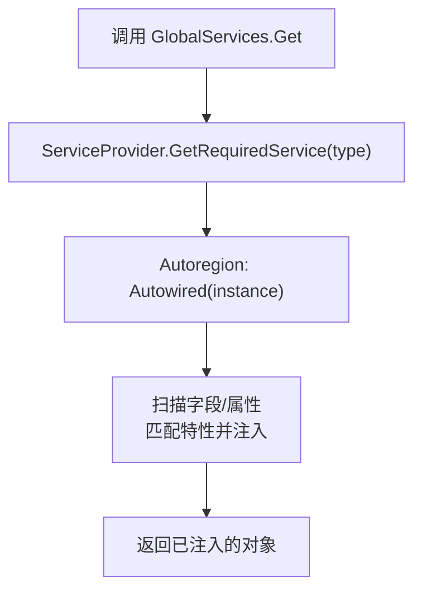

# 模块注册机制

<cite>
**本文引用的文件**
- [IModuleInitializer.cs](file://Kevin/kevin.Module/kevin.Ioc/TieredServiceRegistration/IModuleInitializer.cs)
- [ModuleInitializerExtensions.cs](file://Kevin/kevin.Module/kevin.Ioc/TieredServiceRegistration/ModuleInitializerExtensions.cs)
- [ReflectionScheduler.cs](file://Kevin/kevin.Module/kevin.Ioc/TieredServiceRegistration/ReflectionScheduler.cs)
- [ServiceCollectionExtensions.cs](file://Kevin/kevin.Module/kevin.Ioc/ServiceCollectionExtensions.cs)
- [IocHelper.cs](file://Kevin/kevin.Module/kevin.Ioc/IocHelper.cs)
- [ServiceProviderAutowiredDIExtension.cs](file://Kevin/kevin.Module/Kevin.Common/Extension/ServiceProviderAutowiredDIExtension.cs)
- [GlobalServices.cs](file://Kevin/kevin.Module/Kevin.Common/App/Global/GlobalServices.cs)
- [App.Application/ModuleInitializer.cs](file://App/Application/ModuleInitializer.cs)
- [App.Domain/ModuleInitializer.cs](file://App/Domain/ModuleInitializer.cs)
- [App.RepositorieRps/ModuleInitializer.cs](file://App/RepositorieRps/ModuleInitializer.cs)
- [Kevin.Application/ModuleInitializer.cs](file://Kevin/Application/ModuleInitializer.cs)
</cite>

## 目录
1. [简介](#简介)
2. [项目结构](#项目结构)
3. [核心组件](#核心组件)
4. [架构总览](#架构总览)
5. [详细组件分析](#详细组件分析)
6. [依赖关系与加载顺序](#依赖关系与加载顺序)
7. [性能考量](#性能考量)
8. [故障排查指南](#故障排查指南)
9. [结论](#结论)
10. [附录：示例与最佳实践](#附录示例与最佳实践)

## 简介
本文件面向 NetCoreKevin 框架的“模块注册机制”，系统性说明以下主题：
- 模块的发现与注册流程，包括 IModuleInitializer 接口的设计与实现方式。
- 依赖注入容器中服务的自动发现与注册机制，涵盖程序集扫描、特性标记与服务绑定。
- 模块间的依赖管理与加载顺序控制策略。
- 模块注册的配置选项与可扩展点。
- 通过具体代码路径展示如何注册新模块并处理模块依赖。

该机制以“约定优于配置”为核心思想：每个模块提供 ModuleInitializer 实现，框架在启动时自动扫描并调用其 Initialize 方法完成服务注册；同时提供批量反射注册工具，简化跨程序集的服务发现与绑定。

## 项目结构
从模块注册视角看，关键目录与职责如下：
- kevin.Ioc/TieredServiceRegistration：模块初始化器接口、扩展方法与程序集调度器。
- kevin.Ioc：IOC 帮助类与控制器激活器替换入口。
- Kevin.Common：全局服务容器与自动注入扩展。
- App.* 与 Kevin.*：各业务模块的 ModuleInitializer 实现，负责各自服务注册。

图表来源
- [ServiceCollectionExtensions.cs:10-15](file://Kevin/kevin.Module/kevin.Ioc/ServiceCollectionExtensions.cs#L10-L15)
- [ReflectionScheduler.cs:104-167](file://Kevin/kevin.Module/kevin.Ioc/TieredServiceRegistration/ReflectionScheduler.cs#L104-L167)
- [ModuleInitializerExtensions.cs:15-34](file://Kevin/kevin.Module/kevin.Ioc/TieredServiceRegistration/ModuleInitializerExtensions.cs#L15-L34)
- [IocHelper.cs:25-78](file://Kevin/kevin.Module/kevin.Ioc/IocHelper.cs#L25-L78)
- [GlobalServices.cs:45-77](file://Kevin/kevin.Module/Kevin.Common/App/Global/GlobalServices.cs#L45-L77)

章节来源
- [ServiceCollectionExtensions.cs:10-15](file://Kevin/kevin.Module/kevin.Ioc/ServiceCollectionExtensions.cs#L10-L15)
- [ReflectionScheduler.cs:104-167](file://Kevin/kevin.Module/kevin.Ioc/TieredServiceRegistration/ReflectionScheduler.cs#L104-L167)
- [ModuleInitializerExtensions.cs:15-34](file://Kevin/kevin.Module/kevin.Ioc/TieredServiceRegistration/ModuleInitializerExtensions.cs#L15-L34)

## 核心组件
- IModuleInitializer：模块初始化器契约，定义 Initialize(IServiceCollection) 用于模块内服务注册。
- ModuleInitializerExtensions：遍历传入的程序集集合，查找并实例化所有实现了 IModuleInitializer 的类型，依次调用 Initialize。
- ReflectionScheduler：负责收集需要扫描的程序集（排除系统程序集），并保证有效性。
- ServiceCollectionExtensions：将控制器创建器替换为基于 IOC 的实现，并触发模块初始化。
- IocHelper：提供批量按基接口或约定扫描并注册服务的能力（Scoped/Transient/Singleton）。
- GlobalServices：提供静态 ServiceProvider 访问与自动注入能力，便于非 DI 场景获取服务。
- AutowiredDIExtension：对对象字段/属性进行自动注入，支持工厂式提供者。

章节来源
- [IModuleInitializer.cs:8-15](file://Kevin/kevin.Module/kevin.Ioc/TieredServiceRegistration/IModuleInitializer.cs#L8-L15)
- [ModuleInitializerExtensions.cs:15-34](file://Kevin/kevin.Module/kevin.Ioc/TieredServiceRegistration/ModuleInitializerExtensions.cs#L15-L34)
- [ReflectionScheduler.cs:104-167](file://Kevin/kevin.Module/kevin.Ioc/TieredServiceRegistration/ReflectionScheduler.cs#L104-L167)
- [ServiceCollectionExtensions.cs:10-15](file://Kevin/kevin.Module/kevin.Ioc/ServiceCollectionExtensions.cs#L10-L15)
- [IocHelper.cs:25-78](file://Kevin/kevin.Module/kevin.Ioc/IocHelper.cs#L25-L78)
- [GlobalServices.cs:45-77](file://Kevin/kevin.Module/Kevin.Common/App/Global/GlobalServices.cs#L45-L77)
- [ServiceProviderAutowiredDIExtension.cs:15-55](file://Kevin/kevin.Module/Kevin.Common/Extension/ServiceProviderAutowiredDIExtension.cs#L15-L55)

## 架构总览
下图展示了从应用启动到模块服务注册的完整时序：

图表来源
- [ServiceCollectionExtensions.cs:10-15](file://Kevin/kevin.Module/kevin.Ioc/ServiceCollectionExtensions.cs#L10-L15)
- [ReflectionScheduler.cs:104-167](file://Kevin/kevin.Module/kevin.Ioc/TieredServiceRegistration/ReflectionScheduler.cs#L104-L167)
- [ModuleInitializerExtensions.cs:15-34](file://Kevin/kevin.Module/kevin.Ioc/TieredServiceRegistration/ModuleInitializerExtensions.cs#L15-L34)
- [App.Application/ModuleInitializer.cs:10-19](file://App/Application/ModuleInitializer.cs#L10-L19)
- [App.Domain/ModuleInitializer.cs:7-13](file://App/Domain/ModuleInitializer.cs#L7-L13)
- [App.RepositorieRps/ModuleInitializer.cs:10-19](file://App/RepositorieRps/ModuleInitializer.cs#L10-L19)
- [Kevin.Application/ModuleInitializer.cs:15-27](file://Kevin/Application/ModuleInitializer.cs#L15-L27)

## 详细组件分析

### 模块初始化器接口与执行器
- IModuleInitializer：统一入口 Initialize(IServiceCollection)，模块在此完成自身服务注册。
- ModuleInitializerExtensions：扫描 assemblies，筛选非抽象且实现 IModuleInitializer 的类型，使用 Activator.CreateInstance 实例化后调用 Initialize。若无法创建实例则抛出异常。

图表来源
- [IModuleInitializer.cs:8-15](file://Kevin/kevin.Module/kevin.Ioc/TieredServiceRegistration/IModuleInitializer.cs#L8-L15)
- [ModuleInitializerExtensions.cs:15-34](file://Kevin/kevin.Module/kevin.Ioc/TieredServiceRegistration/ModuleInitializerExtensions.cs#L15-L34)
- [ReflectionScheduler.cs:104-167](file://Kevin/kevin.Module/kevin.Ioc/TieredServiceRegistration/ReflectionScheduler.cs#L104-L167)

章节来源
- [IModuleInitializer.cs:8-15](file://Kevin/kevin.Module/kevin.Ioc/TieredServiceRegistration/IModuleInitializer.cs#L8-L15)
- [ModuleInitializerExtensions.cs:15-34](file://Kevin/kevin.Module/kevin.Ioc/TieredServiceRegistration/ModuleInitializerExtensions.cs#L15-L34)

### 程序集扫描与过滤
- ReflectionScheduler.GetAllReferencedAssemblies：
  - 从入口程序集开始，递归收集引用程序集。
  - 跳过 Microsoft 官方程序集（可通过 IsSystemAssembly 判断）。
  - 扫描 BaseDirectory 下 DLL，尝试加载并验证有效性。
  - 去重与有效性检查避免加载失败或重复。

图表来源
- [ReflectionScheduler.cs:104-167](file://Kevin/kevin.Module/kevin.Ioc/TieredServiceRegistration/ReflectionScheduler.cs#L104-L167)
- [ReflectionScheduler.cs:15-46](file://Kevin/kevin.Module/kevin.Ioc/TieredServiceRegistration/ReflectionScheduler.cs#L15-L46)
- [ReflectionScheduler.cs:175-187](file://Kevin/kevin.Module/kevin.Ioc/TieredServiceRegistration/ReflectionScheduler.cs#L175-L187)

章节来源
- [ReflectionScheduler.cs:104-167](file://Kevin/kevin.Module/kevin.Ioc/TieredServiceRegistration/ReflectionScheduler.cs#L104-L167)

### 服务自动发现与绑定
- IocHelper.BatchAddScopeds/Transients/Singletons：
  - 在当前程序集及可选的全域程序集中，查找继承自指定基接口（如 IService、IBaseRepository）的具体类型。
  - 将其实现的接口（排除 IDisposable 与基接口本身）以对应生命周期注册到 DI。
  - 支持回调 action 用于额外操作（如记录日志、加入全局索引等）。
- GlobalServices：
  - 提供 Set(provider) 设置最终 ServiceProvider。
  - Get<T>() 获取服务并进行自动注入（Autowired）。

图表来源
- [IocHelper.cs:25-78](file://Kevin/kevin.Module/kevin.Ioc/IocHelper.cs#L25-L78)
- [App.Application/ModuleInitializer.cs:12-19](file://App/Application/ModuleInitializer.cs#L12-L19)
- [GlobalServices.cs:45-77](file://Kevin/kevin.Module/Kevin.Common/App/Global/GlobalServices.cs#L45-L77)

章节来源
- [IocHelper.cs:25-78](file://Kevin/kevin.Module/kevin.Ioc/IocHelper.cs#L25-L78)
- [App.Application/ModuleInitializer.cs:12-19](file://App/Application/ModuleInitializer.cs#L12-L19)
- [GlobalServices.cs:45-77](file://Kevin/kevin.Module/Kevin.Common/App/Global/GlobalServices.cs#L45-L77)

### 自动注入扩展
- AutowiredDIExtension.Autowired：
  - 对对象的公共/私有字段和属性进行扫描，寻找带有 IServiceProviderFactory<IServiceProvider> 特性的成员，调用工厂获取服务并赋值。
  - 支持静态与实例成员。
- GlobalServices.Get<T>()：
  - 通过 ServiceProvider.GetRequiredService 获取服务，并调用 Autowired 完成依赖注入。

图表来源
- [GlobalServices.cs:61-77](file://Kevin/kevin.Module/Kevin.Common/App/Global/GlobalServices.cs#L61-L77)
- [ServiceProviderAutowiredDIExtension.cs:15-55](file://Kevin/kevin.Module/Kevin.Common/Extension/ServiceProviderAutowiredDIExtension.cs#L15-L55)

章节来源
- [GlobalServices.cs:61-77](file://Kevin/kevin.Module/Kevin.Common/App/Global/GlobalServices.cs#L61-L77)
- [ServiceProviderAutowiredDIExtension.cs:15-55](file://Kevin/kevin.Module/Kevin.Common/Extension/ServiceProviderAutowiredDIExtension.cs#L15-L55)

## 依赖关系与加载顺序
- 当前实现中，模块初始化顺序由 ReflectionScheduler 返回的程序集顺序决定，随后 ModuleInitializerExtensions 按序遍历并调用 Initialize。
- 若存在明确的模块间依赖顺序需求，可在模块内部通过显式注册顺序控制，或在后续扩展中引入“模块元数据+拓扑排序”的策略。
- 对于运行时动态加载的程序集，ReflectionScheduler 会尝试加载并校验有效性，但不会改变既有顺序语义。

建议：
- 在模块初始化中尽量保持幂等与可重入，避免强依赖外部顺序。
- 如需严格顺序，可在模块初始化中延迟注册或使用事件/钩子协调。

章节来源
- [ModuleInitializerExtensions.cs:15-34](file://Kevin/kevin.Module/kevin.Ioc/TieredServiceRegistration/ModuleInitializerExtensions.cs#L15-L34)
- [ReflectionScheduler.cs:104-167](file://Kevin/kevin.Module/kevin.Ioc/TieredServiceRegistration/ReflectionScheduler.cs#L104-L167)

## 性能考量
- 程序集扫描与反射：
  - ReflectionScheduler 会递归加载引用程序集并扫描类型，建议在开发环境启用，生产环境按需优化（例如缓存已加载程序集列表）。
- 批量注册：
  - IocHelper 的批量注册会遍历多个程序集，注意 isAllAssemblys 参数对性能的影响。
- 自动注入：
  - Autowired 会在每次 Get<T>() 时进行反射扫描，建议仅在必要时使用或通过缓存减少开销。

[本节为通用指导，不直接分析具体文件]

## 故障排查指南
常见问题与定位要点：
- 模块未执行：
  - 确认模块程序集已被 ReflectionScheduler 收集（非系统程序集、有效程序集）。
  - 确认模块包含实现 IModuleInitializer 的非抽象类。
- 初始化失败：
  - ModuleInitializerExtensions 在无法创建实例时会抛出异常，检查构造函数依赖与可用服务。
- 服务未注册：
  - 检查模块 Initialize 中是否正确调用 IocHelper.BatchAdd* 或手动 services.AddScoped/Transient/Singleton。
- 循环依赖：
  - 若使用自定义拓扑排序，需确保无环依赖；当前框架未内置模块级拓扑排序。

章节来源
- [ModuleInitializerExtensions.cs:15-34](file://Kevin/kevin.Module/kevin.Ioc/TieredServiceRegistration/ModuleInitializerExtensions.cs#L15-L34)
- [ReflectionScheduler.cs:175-187](file://Kevin/kevin.Module/kevin.Ioc/TieredServiceRegistration/ReflectionScheduler.cs#L175-L187)

## 结论
NetCoreKevin 的模块注册机制以 IModuleInitializer 为核心，结合程序集扫描与批量反射注册，实现了“零侵入”的模块化服务装配。通过 ServiceCollectionExtensions 的统一入口，框架在启动阶段自动发现并执行所有模块的初始化逻辑，从而将关注点集中在模块自身的职责上。对于更复杂的依赖顺序与配置管理，可在现有基础上扩展模块元数据与排序策略。

[本节为总结性内容，不直接分析具体文件]

## 附录：示例与最佳实践

### 如何注册一个新模块
步骤：
1. 新建模块程序集，添加 ModuleInitializer 类实现 IModuleInitializer。
2. 在 Initialize 中注册服务：
   - 使用 IocHelper.BatchAddScopeds/Transients/Singletons 批量注册。
   - 或手动 services.AddScoped/Transient/Singleton 注册特定服务。
3. 确保模块程序集被应用引用，以便 ReflectionScheduler 能够发现。

参考路径：
- [App.Application/ModuleInitializer.cs:10-19](file://App/Application/ModuleInitializer.cs#L10-L19)
- [App.RepositorieRps/ModuleInitializer.cs:10-19](file://App/RepositorieRps/ModuleInitializer.cs#L10-L19)
- [Kevin.Application/ModuleInitializer.cs:15-27](file://Kevin/Application/ModuleInitializer.cs#L15-L27)

### 如何处理模块依赖
- 当前顺序由程序集加载顺序决定，建议在模块初始化中避免强依赖其他模块的初始化时机。
- 如需显式顺序，可在模块初始化中使用延迟注册或事件协调。

参考路径：
- [ModuleInitializerExtensions.cs:15-34](file://Kevin/kevin.Module/kevin.Ioc/TieredServiceRegistration/ModuleInitializerExtensions.cs#L15-L34)
- [ReflectionScheduler.cs:104-167](file://Kevin/kevin.Module/kevin.Ioc/TieredServiceRegistration/ReflectionScheduler.cs#L104-L167)

### 配置选项与扩展点
- ReflectionScheduler.GetAllReferencedAssemblies(skipSystemAssemblies=true)：可控制是否跳过系统程序集。
- IocHelper.BatchAdd* 的 isAllAssemblys 参数：控制是否扫描全域程序集。
- GlobalServices.Set(provider)：在模块注册结束时设置 ServiceProvider，供全局静态访问。

参考路径：
- [ReflectionScheduler.cs:104-167](file://Kevin/kevin.Module/kevin.Ioc/TieredServiceRegistration/ReflectionScheduler.cs#L104-L167)
- [IocHelper.cs:25-78](file://Kevin/kevin.Module/kevin.Ioc/IocHelper.cs#L25-L78)
- [GlobalServices.cs:45-77](file://Kevin/kevin.Module/Kevin.Common/App/Global/GlobalServices.cs#L45-L77)