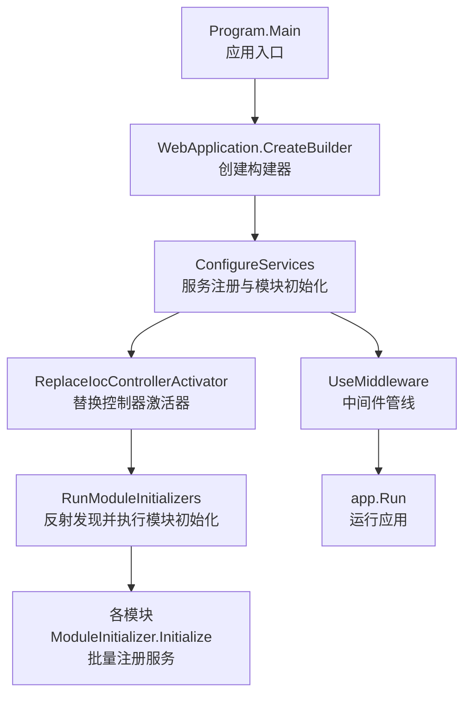
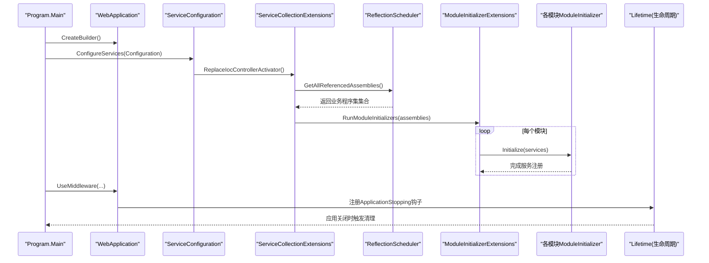
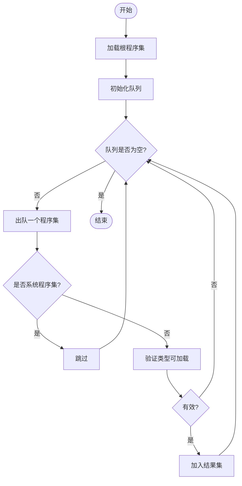
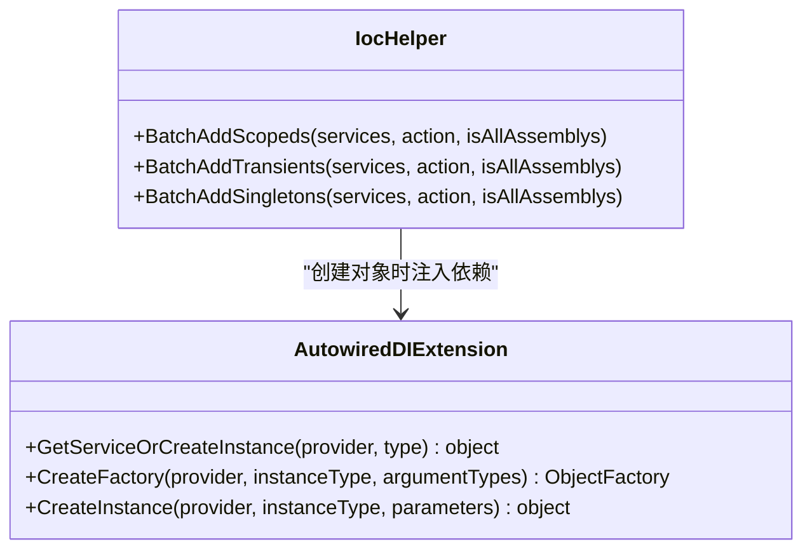
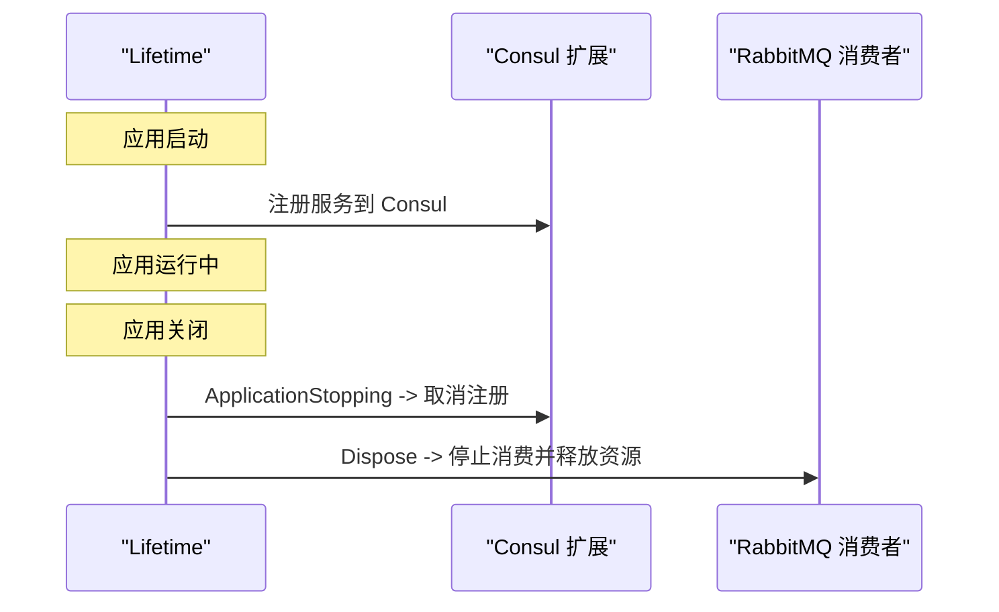
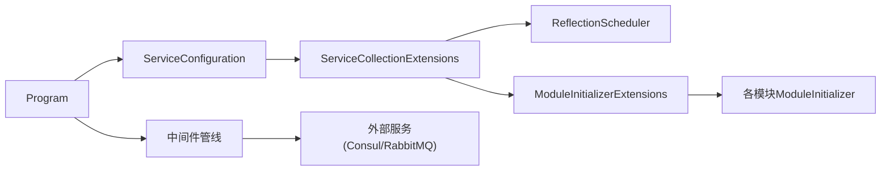

# 模块生命周期管理

<cite>
**本文引用的文件**
- [Program.cs](file://App/WebApi/Program.cs)
- [ServiceConfiguration.cs](file://Kevin/Kevin.Web.Basics/Extensions/ServiceConfiguration.cs)
- [ServiceCollectionExtensions.cs](file://Kevin/kevin.Module/kevin.Ioc/ServiceCollectionExtensions.cs)
- [ModuleInitializerExtensions.cs](file://Kevin/kevin.Module/kevin.Ioc/TieredServiceRegistration/ModuleInitializerExtensions.cs)
- [IModuleInitializer.cs](file://Kevin/kevin.Module/kevin.Ioc/TieredServiceRegistration/IModuleInitializer.cs)
- [ReflectionScheduler.cs](file://Kevin/kevin.Module/kevin.Ioc/TieredServiceRegistration/ReflectionScheduler.cs)
- [IocHelper.cs](file://Kevin/kevin.Module/kevin.Ioc/IocHelper.cs)
- [ServiceProviderAutowiredDIExtension.cs](file://Kevin/kevin.Module/kevin.Ioc/Extension/ServiceProviderAutowiredDIExtension.cs)
- [EnvironmentConfigHelper.cs](file://Kevin/kevin.Module/Kevin.Common/Helper/EnvironmentConfigHelper.cs)
- [ConfigHelper.cs](file://Kevin/kevin.Module/Kevin.Common/Helper/ConfigHelper.cs)
- [KevinDbContext.cs](file://Kevin/Kevin.EntityFrameworkCore/Database/KevinDbContext.cs)
- [RabbitMQConsumerService.cs](file://Kevin/kevin.Module/kevin.RabbitMQ/RabbitMQConsumerService.cs)
- [ApplicationBuilderExtensions.cs（Consul）](file://Kevin/kevin.Module/kevin.Consul/ApplicationBuilderExtensions.cs)
- [Application ModuleInitializer.cs](file://App/Application/ModuleInitializer.cs)
- [Domain ModuleInitializer.cs](file://App/Domain/ModuleInitializer.cs)
</cite>

## 目录
1. [简介](#简介)
2. [项目结构](#项目结构)
3. [核心组件](#核心组件)
4. [架构总览](#架构总览)
5. [详细组件分析](#详细组件分析)
6. [依赖关系分析](#依赖关系分析)
7. [性能考量](#性能考量)
8. [故障排查指南](#故障排查指南)
9. [结论](#结论)
10. [附录](#附录)

## 简介
本文件面向 NetCoreKevin 框架的“模块生命周期管理”，系统阐述从应用启动到销毁的全流程，包括：
- 初始化阶段、配置加载、服务注册与运行时管理
- 反射调度器的工作原理与模块自动发现机制
- 不同生命周期阶段的服务注册策略（单例、作用域、瞬态）
- 模块配置管理最佳实践（环境变量、配置文件、动态更新）
- 生命周期钩子使用示例与性能优化建议

## 项目结构
该框架采用模块化设计，通过统一的入口 Program 构建 Web 应用，集中进行日志、中间件、服务与模块的装配。各功能模块以独立程序集形式存在，并通过 IModuleInitializer 接口实现“自描述式”的模块初始化与服务注册。反射调度器负责在启动时扫描并执行所有模块的初始化逻辑。

图表来源
- [Program.cs:23-85](file://App/WebApi/Program.cs#L23-L85)
- [ServiceConfiguration.cs:1-193](file://Kevin/Kevin.Web.Basics/Extensions/ServiceConfiguration.cs#L1-L193)
- [ServiceCollectionExtensions.cs:10-15](file://Kevin/kevin.Module/kevin.Ioc/ServiceCollectionExtensions.cs#L10-L15)
- [ModuleInitializerExtensions.cs:15-34](file://Kevin/kevin.Module/kevin.Ioc/TieredServiceRegistration/ModuleInitializerExtensions.cs#L15-L34)

章节来源
- [Program.cs:23-85](file://App/WebApi/Program.cs#L23-L85)
- [ServiceConfiguration.cs:1-193](file://Kevin/Kevin.Web.Basics/Extensions/ServiceConfiguration.cs#L1-L193)

## 核心组件
- 应用入口与构建器：Program.Main 负责环境设置、日志、服务构建与中间件管线装配。
- 服务扩展：ServiceConfiguration 集中注册缓存、文件存储、消息队列、权限、信号量等模块能力。
- IOC 扩展：ServiceCollectionExtensions.ReplaceIocControllerActivator 统一替换控制器激活器，并触发模块初始化。
- 模块初始化器：IModuleInitializer 定义 Initialize 方法；各模块提供具体实现，完成服务注册与资源准备。
- 反射调度器：ReflectionScheduler 负责按引用关系遍历程序集，过滤系统程序集，确保仅对业务模块执行初始化。
- 批量注册工具：IocHelper 提供 AddScoped/AddTransient/AddSingleton 的批量注册能力，支持跨程序集扫描。
- 自动注入扩展：ServiceProviderAutowiredDIExtension 为动态创建的对象提供字段/属性注入能力。
- 配置与环境：EnvironmentConfigHelper 与 ConfigHelper 提供环境变量读取与配置节访问。
- 数据库上下文：KevinDbContext 根据配置加载连接字符串与索引字段等。
- 生命周期钩子：Consul 服务注册在 ApplicationStopping 中注销；RabbitMQ 消费者在 Dispose 中释放资源。

章节来源
- [Program.cs:23-85](file://App/WebApi/Program.cs#L23-L85)
- [ServiceConfiguration.cs:1-193](file://Kevin/Kevin.Web.Basics/Extensions/ServiceConfiguration.cs#L1-L193)
- [ServiceCollectionExtensions.cs:10-15](file://Kevin/kevin.Module/kevin.Ioc/ServiceCollectionExtensions.cs#L10-L15)
- [ModuleInitializerExtensions.cs:15-34](file://Kevin/kevin.Module/kevin.Ioc/TieredServiceRegistration/ModuleInitializerExtensions.cs#L15-L34)
- [IModuleInitializer.cs:8-15](file://Kevin/kevin.Module/kevin.Ioc/TieredServiceRegistration/IModuleInitializer.cs#L8-L15)
- [ReflectionScheduler.cs:107-168](file://Kevin/kevin.Module/kevin.Ioc/TieredServiceRegistration/ReflectionScheduler.cs#L107-L168)
- [IocHelper.cs:25-78](file://Kevin/kevin.Module/kevin.Ioc/IocHelper.cs#L25-L78)
- [ServiceProviderAutowiredDIExtension.cs:63-76](file://Kevin/kevin.Module/kevin.Ioc/Extension/ServiceProviderAutowiredDIExtension.cs#L63-L76)
- [EnvironmentConfigHelper.cs:21-40](file://Kevin/kevin.Module/Kevin.Common/Helper/EnvironmentConfigHelper.cs#L21-L40)
- [ConfigHelper.cs:14-31](file://Kevin/kevin.Module/Kevin.Common/Helper/ConfigHelper.cs#L14-L31)
- [KevinDbContext.cs:75-101](file://Kevin/Kevin.EntityFrameworkCore/Database/KevinDbContext.cs#L75-L101)
- [ApplicationBuilderExtensions.cs（Consul）:29-38](file://Kevin/kevin.Module/kevin.Consul/ApplicationBuilderExtensions.cs#L29-L38)
- [RabbitMQConsumerService.cs:110-129](file://Kevin/kevin.Module/kevin.RabbitMQ/RabbitMQConsumerService.cs#L110-L129)

## 架构总览
下图展示了从应用启动到模块初始化的关键调用链，以及服务注册与生命周期钩子的位置。

图表来源
- [Program.cs:23-85](file://App/WebApi/Program.cs#L23-L85)
- [ServiceConfiguration.cs:1-193](file://Kevin/Kevin.Web.Basics/Extensions/ServiceConfiguration.cs#L1-L193)
- [ServiceCollectionExtensions.cs:10-15](file://Kevin/kevin.Module/kevin.Ioc/ServiceCollectionExtensions.cs#L10-L15)
- [ModuleInitializerExtensions.cs:15-34](file://Kevin/kevin.Module/kevin.Ioc/TieredServiceRegistration/ModuleInitializerExtensions.cs#L15-L34)
- [ReflectionScheduler.cs:107-168](file://Kevin/kevin.Module/kevin.Ioc/TieredServiceRegistration/ReflectionScheduler.cs#L107-L168)

## 详细组件分析

### 反射调度器与模块自动发现
- 工作原理
  - ReflectionScheduler 从根程序集开始，按引用关系广度优先遍历所有依赖程序集。
  - 跳过 Microsoft 官方程序集，避免无关扫描。
  - 对每个程序集尝试 GetTypes 与 DefinedTypes 列表化，捕获 ReflectionTypeLoadException 以判定无效程序集。
  - 最终返回有效的业务程序集集合，供模块初始化器执行。
- 模块自动发现
  - ServiceCollectionExtensions.ReplaceIocControllerActivator 调用 ReflectionScheduler.GetAllReferencedAssemblies() 获取程序集集合。
  - ModuleInitializerExtensions.RunModuleInitializers 遍历程序集，查找实现 IModuleInitializer 的非抽象类型，实例化并调用 Initialize。
- 复杂度与性能
  - 时间复杂度近似 O(N+M)，N 为程序集数量，M 为类型总数；反射开销集中在 GetTypes 与 DefinedTypes。
  - 建议仅在启动阶段执行一次，避免重复扫描。

图表来源
- [ReflectionScheduler.cs:107-168](file://Kevin/kevin.Module/kevin.Ioc/TieredServiceRegistration/ReflectionScheduler.cs#L107-L168)
- [ReflectionScheduler.cs:175-187](file://Kevin/kevin.Module/kevin.Ioc/TieredServiceRegistration/ReflectionScheduler.cs#L175-L187)

章节来源
- [ReflectionScheduler.cs:107-168](file://Kevin/kevin.Module/kevin.Ioc/TieredServiceRegistration/ReflectionScheduler.cs#L107-L168)
- [ReflectionScheduler.cs:175-187](file://Kevin/kevin.Module/kevin.Ioc/TieredServiceRegistration/ReflectionScheduler.cs#L175-L187)
- [ServiceCollectionExtensions.cs:10-15](file://Kevin/kevin.Module/kevin.Ioc/ServiceCollectionExtensions.cs#L10-L15)
- [ModuleInitializerExtensions.cs:15-34](file://Kevin/kevin.Module/kevin.Ioc/TieredServiceRegistration/ModuleInitializerExtensions.cs#L15-L34)

### 服务注册策略（单例、作用域、瞬态）
- 批量注册工具
  - IocHelper.BatchAddScopeds：将实现指定接口的服务以作用域生命周期注册，并可选择跨程序集扫描。
  - IocHelper.BatchAddTransients：以瞬态生命周期注册。
  - IocHelper.BatchAddSingletons：以单例生命周期注册。
- 自动注入增强
  - ServiceProviderAutowiredDIExtension.GetServiceOrCreateInstance 在创建对象后自动注入字段与属性，便于非 DI 管理的对象也能获得依赖。
- 使用建议
  - 短生命周期、无状态服务：瞬态。
  - 请求级共享资源：作用域。
  - 全局共享、线程安全且昂贵资源：单例。

图表来源
- [IocHelper.cs:25-78](file://Kevin/kevin.Module/kevin.Ioc/IocHelper.cs#L25-L78)
- [IocHelper.cs:85-139](file://Kevin/kevin.Module/kevin.Ioc/IocHelper.cs#L85-L139)
- [IocHelper.cs:146-199](file://Kevin/kevin.Module/kevin.Ioc/IocHelper.cs#L146-L199)
- [ServiceProviderAutowiredDIExtension.cs:63-76](file://Kevin/kevin.Module/kevin.Ioc/Extension/ServiceProviderAutowiredDIExtension.cs#L63-L76)

章节来源
- [IocHelper.cs:25-78](file://Kevin/kevin.Module/kevin.Ioc/IocHelper.cs#L25-L78)
- [IocHelper.cs:85-139](file://Kevin/kevin.Module/kevin.Ioc/IocHelper.cs#L85-L139)
- [IocHelper.cs:146-199](file://Kevin/kevin.Module/kevin.Ioc/IocHelper.cs#L146-L199)
- [ServiceProviderAutowiredDIExtension.cs:63-76](file://Kevin/kevin.Module/kevin.Ioc/Extension/ServiceProviderAutowiredDIExtension.cs#L63-L76)

### 模块初始化器与生命周期钩子
- 模块初始化器
  - 各模块实现 IModuleInitializer.Initialize，在其中完成服务注册与资源准备。例如：
    - App.Application 模块：批量注册 IService 的作用域服务，并记录日志。
    - App.Domain 模块：领域层服务注入完成提示。
- 生命周期钩子
  - Consul 服务注册：在 ApplicationStopping 中取消注册，确保进程退出时清理服务发现。
  - RabbitMQ 消费者：实现 IDisposable，在 Dispose 中停止消费并释放连接与通道。

图表来源
- [ApplicationBuilderExtensions.cs（Consul）:29-38](file://Kevin/kevin.Module/kevin.Consul/ApplicationBuilderExtensions.cs#L29-L38)
- [RabbitMQConsumerService.cs:110-129](file://Kevin/kevin.Module/kevin.RabbitMQ/RabbitMQConsumerService.cs#L110-L129)

章节来源
- [Application ModuleInitializer.cs:10-19](file://App/Application/ModuleInitializer.cs#L10-L19)
- [Domain ModuleInitializer.cs:7-13](file://App/Domain/ModuleInitializer.cs#L7-L13)
- [ApplicationBuilderExtensions.cs（Consul）:29-38](file://Kevin/kevin.Module/kevin.Consul/ApplicationBuilderExtensions.cs#L29-L38)
- [RabbitMQConsumerService.cs:110-129](file://Kevin/kevin.Module/kevin.RabbitMQ/RabbitMQConsumerService.cs#L110-L129)

### 配置管理与环境变量
- 环境变量
  - EnvironmentConfigHelper 读取 NETCORE_ENVIRONMENT 或 ASPNETCORE_ENVIRONMENT，用于区分开发、测试、正式环境。
- 配置中心
  - ConfigHelper 提供静态 IConfiguration 访问，支持 GetSection<T> 与 GetValue。
- 数据库配置
  - KevinDbContext 在构造时从 Configuration 读取连接字符串与默认索引字段等。
- 最佳实践
  - 使用环境变量切换环境，配置文件承载具体参数。
  - 敏感信息通过环境变量注入，避免硬编码。
  - 动态配置更新可通过重新加载 Configuration 源并结合缓存失效策略实现。

章节来源
- [EnvironmentConfigHelper.cs:21-40](file://Kevin/kevin.Module/Kevin.Common/Helper/EnvironmentConfigHelper.cs#L21-L40)
- [ConfigHelper.cs:14-31](file://Kevin/kevin.Module/Kevin.Common/Helper/ConfigHelper.cs#L14-L31)
- [KevinDbContext.cs:75-101](file://Kevin/Kevin.EntityFrameworkCore/Database/KevinDbContext.cs#L75-L101)

## 依赖关系分析
- 入口依赖
  - Program 依赖 ServiceConfiguration 进行服务装配，再调用 kevin.Ioc 扩展进行模块初始化。
- 模块依赖
  - 各模块通过 IModuleInitializer 暴露初始化点，由反射调度器统一发现与执行。
- 运行时依赖
  - 中间件与外部服务（如 Consul、RabbitMQ）在应用生命周期内注册与释放。

图表来源
- [Program.cs:23-85](file://App/WebApi/Program.cs#L23-L85)
- [ServiceConfiguration.cs:1-193](file://Kevin/Kevin.Web.Basics/Extensions/ServiceConfiguration.cs#L1-L193)
- [ServiceCollectionExtensions.cs:10-15](file://Kevin/kevin.Module/kevin.Ioc/ServiceCollectionExtensions.cs#L10-L15)
- [ModuleInitializerExtensions.cs:15-34](file://Kevin/kevin.Module/kevin.Ioc/TieredServiceRegistration/ModuleInitializerExtensions.cs#L15-L34)
- [ReflectionScheduler.cs:107-168](file://Kevin/kevin.Module/kevin.Ioc/TieredServiceRegistration/ReflectionScheduler.cs#L107-L168)

章节来源
- [Program.cs:23-85](file://App/WebApi/Program.cs#L23-L85)
- [ServiceConfiguration.cs:1-193](file://Kevin/Kevin.Web.Basics/Extensions/ServiceConfiguration.cs#L1-L193)
- [ServiceCollectionExtensions.cs:10-15](file://Kevin/kevin.Module/kevin.Ioc/ServiceCollectionExtensions.cs#L10-L15)
- [ModuleInitializerExtensions.cs:15-34](file://Kevin/kevin.Module/kevin.Ioc/TieredServiceRegistration/ModuleInitializerExtensions.cs#L15-L34)
- [ReflectionScheduler.cs:107-168](file://Kevin/kevin.Module/kevin.Ioc/TieredServiceRegistration/ReflectionScheduler.cs#L107-L168)

## 性能考量
- 反射扫描
  - 反射在启动阶段执行，建议限制扫描范围（跳过系统程序集），避免重复加载。
- 服务注册
  - 批量注册时尽量限定程序集范围，减少不必要的 AppDomain.CurrentDomain.GetAssemblies 遍历。
- 对象创建
  - 使用 GetServiceOrCreateInstance 结合 Autowired 可减少手动 new 与依赖解析成本。
- 资源释放
  - 长生命周期资源（连接、通道）应在生命周期钩子中正确释放，避免内存泄漏。
- 中间件与管道
  - 合理放置中间件顺序，减少不必要的数据缓冲与转换。

[本节为通用指导，不直接分析具体文件]

## 故障排查指南
- 模块未初始化
  - 检查模块是否实现 IModuleInitializer 并在程序集中被反射发现。
  - 确认 ReflectionScheduler 未跳过该程序集（非 Microsoft 公司标识）。
- 服务未注册
  - 确认模块 Initialize 中已调用批量注册方法，且 isAllAssemblys 参数符合预期。
- 配置为空或未生效
  - 检查 EnvironmentConfigHelper 是否正确读取环境变量。
  - 确认 ConfigHelper 已在合适时机初始化 IConfiguration。
- 数据库连接失败
  - 核对 KevinDbContext 读取的连接字符串与索引字段配置。
- 资源未释放
  - 检查 RabbitMQ 消费者是否在 Dispose 中停止消费并释放连接。
  - 检查 Consul 服务是否在 ApplicationStopping 中取消注册。

章节来源
- [ModuleInitializerExtensions.cs:15-34](file://Kevin/kevin.Module/kevin.Ioc/TieredServiceRegistration/ModuleInitializerExtensions.cs#L15-L34)
- [ReflectionScheduler.cs:107-168](file://Kevin/kevin.Module/kevin.Ioc/TieredServiceRegistration/ReflectionScheduler.cs#L107-L168)
- [IocHelper.cs:25-78](file://Kevin/kevin.Module/kevin.Ioc/IocHelper.cs#L25-L78)
- [EnvironmentConfigHelper.cs:21-40](file://Kevin/kevin.Module/Kevin.Common/Helper/EnvironmentConfigHelper.cs#L21-L40)
- [ConfigHelper.cs:14-31](file://Kevin/kevin.Module/Kevin.Common/Helper/ConfigHelper.cs#L14-L31)
- [KevinDbContext.cs:75-101](file://Kevin/Kevin.EntityFrameworkCore/Database/KevinDbContext.cs#L75-L101)
- [RabbitMQConsumerService.cs:110-129](file://Kevin/kevin.Module/kevin.RabbitMQ/RabbitMQConsumerService.cs#L110-L129)
- [ApplicationBuilderExtensions.cs（Consul）:29-38](file://Kevin/kevin.Module/kevin.Consul/ApplicationBuilderExtensions.cs#L29-L38)

## 结论
NetCoreKevin 框架通过统一的入口、反射调度器与模块初始化器实现了松耦合的模块生命周期管理。服务注册策略清晰，生命周期钩子完善，配合环境变量与配置文件管理，能够满足多环境部署与动态配置需求。遵循本文的最佳实践与性能建议，可在保证可维护性的同时提升启动效率与运行稳定性。

## 附录
- 常用生命周期选择建议
  - 瞬态：轻量、无状态、频繁创建与销毁。
  - 作用域：请求级共享、包含数据库上下文等。
  - 单例：全局共享、线程安全、昂贵资源。
- 配置优先级建议
  - 环境变量 > 环境特定配置文件 > 默认配置文件。
- 动态配置更新
  - 通过重新加载配置源并结合缓存失效策略实现运行时更新。

[本节为通用指导，不直接分析具体文件]