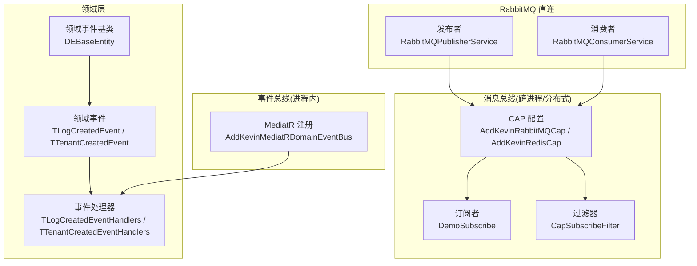
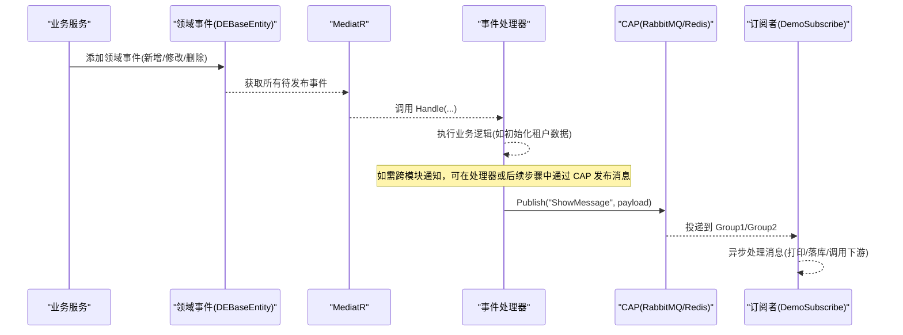
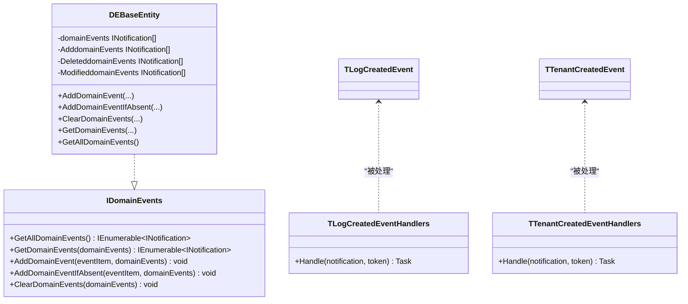
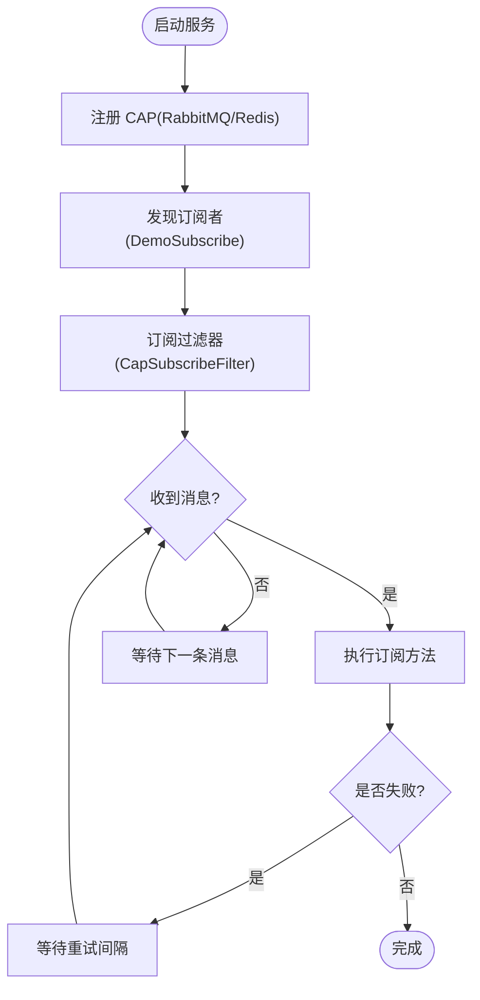
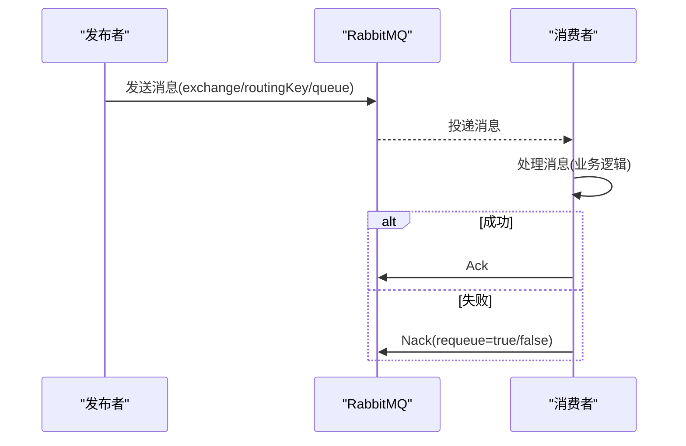
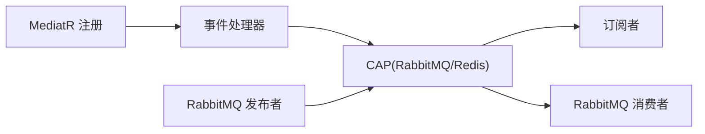

# 模块间通信

<cite>
**本文引用的文件**
- [ServiceCollectionExtensions.cs](file://Kevin/kevin.Module/kevin.Domain.EventBus/ServiceCollectionExtensions.cs)
- [DEBaseEntity.cs](file://Kevin/kevin.Module/kevin.Domain.EventBus/DEBaseEntity.cs)
- [IDomainEvents.cs](file://Kevin/kevin.Module/kevin.Domain.EventBus/IDomainEvents.cs)
- [EventBusEnums.cs](file://Kevin/kevin.Module/kevin.Domain.EventBus/EventBusEnums.cs)
- [TLogCreatedEvent.cs](file://Kevin/Domain/Events/TLogCreatedEvent.cs)
- [TTenantCreatedEvent.cs](file://Kevin/Domain/Events/TTenantCreatedEvent.cs)
- [TLogCreatedEventHandlers.cs](file://Kevin/Domain/EventHandlers/TLogCreatedEventHandlers.cs)
- [TTenantCreatedEventHandlers.cs](file://Kevin/Domain/EventHandlers/TTenantCreatedEventHandlers.cs)
- [ServiceCollectionExtensions.cs](file://Kevin/kevin.Module/kevin.Cap/ServiceCollectionExtensions.cs)
- [CapSubscribeFilter.cs](file://Kevin/kevin.Module/kevin.Cap/Filter/CapSubscribeFilter.cs)
- [DemoSubscribe.cs](file://Kevin/kevin.Module/kevin.Cap/Subscribes/DemoSubscribe.cs)
- [RabbitMQPublisherService.cs](file://Kevin/kevin.Module/kevin.RabbitMQ/RabbitMQPublisherService.cs)
- [IRabbitMQPublisherService.cs](file://Kevin/kevin.Module/kevin.RabbitMQ/Interfaces/IRabbitMQPublisherService.cs)
- [RabbitMQConsumerService.cs](file://Kevin/kevin.Module/kevin.RabbitMQ/RabbitMQConsumerService.cs)
- [IRabbitMQConsumer.cs](file://Kevin/kevin.Module/kevin.RabbitMQ/Interfaces/IRabbitMQConsumer.cs)
</cite>

## 目录
1. [简介](#简介)
2. [项目结构](#项目结构)
3. [核心组件](#核心组件)
4. [架构总览](#架构总览)
5. [详细组件分析](#详细组件分析)
6. [依赖关系分析](#依赖关系分析)
7. [性能考虑](#性能考虑)
8. [故障排查指南](#故障排查指南)
9. [结论](#结论)
10. [附录：使用指南与示例](#附录使用指南与示例)

## 简介
本文件面向 NetCoreKevin 框架的“模块间通信”主题，系统性阐述事件驱动架构的实现机制、CAP 消息队列在跨模块异步通信中的应用、以及 RabbitMQ 直连发布/订阅模式。文档覆盖领域事件的定义、发布与订阅、分布式事务保证（通过 CAP）、错误处理策略，并提供用户创建、订单状态变更等典型业务场景的落地方案与最佳实践。

## 项目结构
本项目采用模块化分层设计，围绕“领域事件 + 消息总线 + 持久化存储”实现模块解耦与可靠通信：
- 领域层：定义领域事件与处理器，基于 MediatR 实现进程内事件分发。
- 基础设施层：提供 CAP 集成（支持 RabbitMQ/Redis）和 RabbitMQ 直连客户端，用于跨服务/跨进程的消息传递与分布式事务保障。
- 应用/业务层：在服务中触发领域事件或发送消息，由处理器或消费者完成后续业务编排。

图表来源
- [ServiceCollectionExtensions.cs:13-48](file://Kevin/kevin.Module/kevin.Cap/ServiceCollectionExtensions.cs#L13-L48)
- [ServiceCollectionExtensions.cs:13-19](file://Kevin/kevin.Module/kevin.Domain.EventBus/ServiceCollectionExtensions.cs#L13-L19)
- [DEBaseEntity.cs:9-113](file://Kevin/kevin.Module/kevin.Domain.EventBus/DEBaseEntity.cs#L9-L113)
- [TLogCreatedEvent.cs:5-5](file://Kevin/Domain/Events/TLogCreatedEvent.cs#L5-L5)
- [TTenantCreatedEvent.cs:5-5](file://Kevin/Domain/Events/TTenantCreatedEvent.cs#L5-L5)
- [TLogCreatedEventHandlers.cs:6-13](file://Kevin/Domain/EventHandlers/TLogCreatedEventHandlers.cs#L6-L13)
- [TTenantCreatedEventHandlers.cs:7-25](file://Kevin/Domain/EventHandlers/TTenantCreatedEventHandlers.cs#L7-L25)
- [DemoSubscribe.cs:5-28](file://Kevin/kevin.Module/kevin.Cap/Subscribes/DemoSubscribe.cs#L5-L28)
- [CapSubscribeFilter.cs:9-48](file://Kevin/kevin.Module/kevin.Cap/Filter/CapSubscribeFilter.cs#L9-L48)
- [RabbitMQPublisherService.cs:10-34](file://Kevin/kevin.Module/kevin.RabbitMQ/RabbitMQPublisherService.cs#L10-L34)
- [RabbitMQConsumerService.cs:9-112](file://Kevin/kevin.Module/kevin.RabbitMQ/RabbitMQConsumerService.cs#L9-L112)

章节来源
- [ServiceCollectionExtensions.cs:13-48](file://Kevin/kevin.Module/kevin.Cap/ServiceCollectionExtensions.cs#L13-L48)
- [ServiceCollectionExtensions.cs:13-19](file://Kevin/kevin.Module/kevin.Domain.EventBus/ServiceCollectionExtensions.cs#L13-L19)
- [DEBaseEntity.cs:9-113](file://Kevin/kevin.Module/kevin.Domain.EventBus/DEBaseEntity.cs#L9-L113)

## 核心组件
- 领域事件与处理器：基于 MediatR 的 INotification/INotificationHandler 模型，实现进程内事件驱动。
- 领域事件聚合：DEBaseEntity 提供按操作类型（新增/修改/删除/其他）的事件收集与去重能力，便于在事务边界统一提交。
- CAP 消息总线：封装 RabbitMQ/Redis 传输与持久化，提供失败重试、分组消费、可视化 Dashboard 等能力。
- RabbitMQ 直连客户端：提供轻量级发布/消费接口，适用于需要精细控制确认、死信、TTL 的场景。

章节来源
- [TLogCreatedEvent.cs:5-5](file://Kevin/Domain/Events/TLogCreatedEvent.cs#L5-L5)
- [TTenantCreatedEvent.cs:5-5](file://Kevin/Domain/Events/TTenantCreatedEvent.cs#L5-L5)
- [TLogCreatedEventHandlers.cs:6-13](file://Kevin/Domain/EventHandlers/TLogCreatedEventHandlers.cs#L6-L13)
- [TTenantCreatedEventHandlers.cs:7-25](file://Kevin/Domain/EventHandlers/TTenantCreatedEventHandlers.cs#L7-L25)
- [DEBaseEntity.cs:9-113](file://Kevin/kevin.Module/kevin.Domain.EventBus/DEBaseEntity.cs#L9-L113)
- [ServiceCollectionExtensions.cs:13-48](file://Kevin/kevin.Module/kevin.Cap/ServiceCollectionExtensions.cs#L13-L48)
- [RabbitMQPublisherService.cs:10-34](file://Kevin/kevin.Module/kevin.RabbitMQ/RabbitMQPublisherService.cs#L10-L34)
- [RabbitMQConsumerService.cs:9-112](file://Kevin/kevin.Module/kevin.RabbitMQ/RabbitMQConsumerService.cs#L9-L112)

## 架构总览
下图展示从“领域事件”到“跨模块消息”的完整链路：
- 进程内：实体/服务触发领域事件 → MediatR 分发给处理器 → 处理器执行业务逻辑（如初始化数据）。
- 跨进程：通过 CAP 将关键事件持久化并投递至消息中间件，消费者以组方式并行处理，具备失败重试与可观测性。
- 可选：对强一致性要求更高的场景，可使用 RabbitMQ 直连客户端配合事务/确认机制。

图表来源
- [DEBaseEntity.cs:93-113](file://Kevin/kevin.Module/kevin.Domain.EventBus/DEBaseEntity.cs#L93-L113)
- [ServiceCollectionExtensions.cs:13-19](file://Kevin/kevin.Module/kevin.Domain.EventBus/ServiceCollectionExtensions.cs#L13-L19)
- [TTenantCreatedEventHandlers.cs:14-25](file://Kevin/Domain/EventHandlers/TTenantCreatedEventHandlers.cs#L14-L25)
- [ServiceCollectionExtensions.cs:13-48](file://Kevin/kevin.Module/kevin.Cap/ServiceCollectionExtensions.cs#L13-L48)
- [DemoSubscribe.cs:5-28](file://Kevin/kevin.Module/kevin.Cap/Subscribes/DemoSubscribe.cs#L5-L28)

## 详细组件分析

### 领域事件与处理器（MediatR）
- 事件定义：使用 record 实现不可变事件载荷，继承 MediatR 的 INotification。
- 处理器：实现 INotificationHandler<TEvent>，在 Handle 中执行副作用（日志、初始化、调用服务等）。
- 事件聚合：DEBaseEntity 将事件按操作类型分类收集，支持去重（避免同一事务重复触发），并在合适时机一次性获取与清理。

图表来源
- [IDomainEvents.cs:5-21](file://Kevin/kevin.Module/kevin.Domain.EventBus/IDomainEvents.cs#L5-L21)
- [DEBaseEntity.cs:9-113](file://Kevin/kevin.Module/kevin.Domain.EventBus/DEBaseEntity.cs#L9-L113)
- [TLogCreatedEvent.cs:5-5](file://Kevin/Domain/Events/TLogCreatedEvent.cs#L5-L5)
- [TTenantCreatedEvent.cs:5-5](file://Kevin/Domain/Events/TTenantCreatedEvent.cs#L5-L5)
- [TLogCreatedEventHandlers.cs:6-13](file://Kevin/Domain/EventHandlers/TLogCreatedEventHandlers.cs#L6-L13)
- [TTenantCreatedEventHandlers.cs:7-25](file://Kevin/Domain/EventHandlers/TTenantCreatedEventHandlers.cs#L7-L25)

章节来源
- [DEBaseEntity.cs:24-72](file://Kevin/kevin.Module/kevin.Domain.EventBus/DEBaseEntity.cs#L24-L72)
- [DEBaseEntity.cs:93-113](file://Kevin/kevin.Module/kevin.Domain.EventBus/DEBaseEntity.cs#L93-L113)
- [TLogCreatedEventHandlers.cs:6-13](file://Kevin/Domain/EventHandlers/TLogCreatedEventHandlers.cs#L6-L13)
- [TTenantCreatedEventHandlers.cs:7-25](file://Kevin/Domain/EventHandlers/TTenantCreatedEventHandlers.cs#L7-L25)

### CAP 消息总线（RabbitMQ/Redis）
- 服务注册：提供 AddKevinRabbitMQCap 与 AddKevinRedisCap，分别接入 RabbitMQ 或 Redis 作为传输层，并启用 Dashboard 与 JSON 编码器。
- 失败重试与并发：内置 FailedRetryCount、FailedRetryInterval、ConsumerThreadCount 等参数，支持失败重试与多消费者并行。
- 订阅者：通过 [CapSubscribe] 注解声明 Topic 与 Group，实现多组广播消费。
- 过滤器：CapSubscribeFilter 提供执行前/后/异常钩子，便于统一日志、指标与错误处理。

图表来源
- [ServiceCollectionExtensions.cs:13-48](file://Kevin/kevin.Module/kevin.Cap/ServiceCollectionExtensions.cs#L13-L48)
- [DemoSubscribe.cs:5-28](file://Kevin/kevin.Module/kevin.Cap/Subscribes/DemoSubscribe.cs#L5-L28)
- [CapSubscribeFilter.cs:9-48](file://Kevin/kevin.Module/kevin.Cap/Filter/CapSubscribeFilter.cs#L9-L48)

章节来源
- [ServiceCollectionExtensions.cs:13-48](file://Kevin/kevin.Module/kevin.Cap/ServiceCollectionExtensions.cs#L13-L48)
- [DemoSubscribe.cs:5-28](file://Kevin/kevin.Module/kevin.Cap/Subscribes/DemoSubscribe.cs#L5-L28)
- [CapSubscribeFilter.cs:9-48](file://Kevin/kevin.Module/kevin.Cap/Filter/CapSubscribeFilter.cs#L9-L48)

### RabbitMQ 直连发布/消费者
- 发布者：RabbitMQPublisherService 暴露 Send 方法，支持交换机、路由键、队列、确认机制、TTL、死信交换机等高级特性。
- 消费者：RabbitMQConsumerService 提供 StartConsume，支持手动确认（Ack/Nack）、预取数量、取消消费等。
- 适用场景：需要对消息投递进行细粒度控制（如幂等、补偿、死信路由）时使用。

图表来源
- [RabbitMQPublisherService.cs:10-34](file://Kevin/kevin.Module/kevin.RabbitMQ/RabbitMQPublisherService.cs#L10-L34)
- [IRabbitMQPublisherService.cs:5-25](file://Kevin/kevin.Module/kevin.RabbitMQ/Interfaces/IRabbitMQPublisherService.cs#L5-L25)
- [RabbitMQConsumerService.cs:22-89](file://Kevin/kevin.Module/kevin.RabbitMQ/RabbitMQConsumerService.cs#L22-L89)
- [IRabbitMQConsumer.cs:3-41](file://Kevin/kevin.Module/kevin.RabbitMQ/Interfaces/IRabbitMQConsumer.cs#L3-L41)

章节来源
- [RabbitMQPublisherService.cs:10-34](file://Kevin/kevin.Module/kevin.RabbitMQ/RabbitMQPublisherService.cs#L10-L34)
- [RabbitMQConsumerService.cs:22-89](file://Kevin/kevin.Module/kevin.RabbitMQ/RabbitMQConsumerService.cs#L22-L89)

## 依赖关系分析
- 领域事件与处理器：松耦合，通过 MediatR 解耦；处理器可依赖服务接口，避免直接耦合具体实现。
- CAP 与订阅者：通过 CapSubscribe 注解绑定 Topic，支持多组广播；过滤器统一横切关注点。
- RabbitMQ 直连：发布者与消费者通过交换器/路由键/队列约定协议，需确保两端一致。

图表来源
- [ServiceCollectionExtensions.cs:13-19](file://Kevin/kevin.Module/kevin.Domain.EventBus/ServiceCollectionExtensions.cs#L13-L19)
- [ServiceCollectionExtensions.cs:13-48](file://Kevin/kevin.Module/kevin.Cap/ServiceCollectionExtensions.cs#L13-L48)
- [RabbitMQPublisherService.cs:10-34](file://Kevin/kevin.Module/kevin.RabbitMQ/RabbitMQPublisherService.cs#L10-L34)
- [RabbitMQConsumerService.cs:9-112](file://Kevin/kevin.Module/kevin.RabbitMQ/RabbitMQConsumerService.cs#L9-L112)

章节来源
- [ServiceCollectionExtensions.cs:13-48](file://Kevin/kevin.Module/kevin.Cap/ServiceCollectionExtensions.cs#L13-L48)
- [ServiceCollectionExtensions.cs:13-19](file://Kevin/kevin.Module/kevin.Domain.EventBus/ServiceCollectionExtensions.cs#L13-L19)

## 性能考虑
- 事件去重：DEBaseEntity 的 AddDomainEventIfAbsent 避免同一事务内重复触发相同事件，降低处理器重复执行开销。
- 消费者并发：CAP 的 ConsumerThreadCount 控制并行度，注意大于 1 时不保证顺序；必要时使用单线程或有序队列。
- 失败重试：合理设置 FailedRetryCount 与 FailedRetryInterval，避免雪崩；结合死信队列与告警。
- 序列化：JSON 编码器已配置 UnicodeRanges.All，确保中文等多字节字符正确传输。
- 确认机制：RabbitMQ 直连消费者建议关闭 autoAck，使用手动 Ack/Nack 保证可靠性。

[本节为通用指导，不直接分析具体文件]

## 故障排查指南
- 订阅方法异常：通过 CapSubscribeFilter.OnSubscribeExceptionAsync 捕获异常，记录上下文并决定是否重试。
- 消息未消费：检查 CAP 的 DefaultGroupName、TopicNamePrefix、Version 是否与生产者一致；查看 Dashboard 中的失败列表。
- 消费者崩溃：确认消费者是否正确 Ack/Nack；若 requeue=false，消息可能进入死信队列，需人工干预。
- 领域事件未触发：确认实体是否继承 DEBaseEntity 并正确调用 AddDomainEvent；确认 MediatR 已注册相关程序集。

章节来源
- [CapSubscribeFilter.cs:9-48](file://Kevin/kevin.Module/kevin.Cap/Filter/CapSubscribeFilter.cs#L9-L48)
- [RabbitMQConsumerService.cs:67-84](file://Kevin/kevin.Module/kevin.RabbitMQ/RabbitMQConsumerService.cs#L67-L84)
- [DEBaseEntity.cs:24-72](file://Kevin/kevin.Module/kevin.Domain.EventBus/DEBaseEntity.cs#L24-L72)

## 结论
NetCoreKevin 框架通过“领域事件 + MediatR + CAP/RabbitMQ”的组合，实现了进程内与跨进程的模块解耦通信。领域事件聚焦业务语义，CAP 提供可靠的异步消息与分布式事务保障，RabbitMQ 直连满足精细化控制需求。遵循本文的设计原则与实践，可有效提升系统的可扩展性、可维护性与稳定性。

[本节为总结，不直接分析具体文件]

## 附录：使用指南与示例

### 事件总线使用指南
- 事件定义：在 Domain/Events 下定义事件记录，继承 INotification。
- 处理器实现：在 Domain/EventHandlers 下实现 INotificationHandler<TEvent>，注入所需服务。
- 注册与触发：在模块初始化中注册 MediatR；在业务逻辑中通过 DEBaseEntity 收集事件，并在事务提交后统一发布。

章节来源
- [TLogCreatedEvent.cs:5-5](file://Kevin/Domain/Events/TLogCreatedEvent.cs#L5-L5)
- [TTenantCreatedEvent.cs:5-5](file://Kevin/Domain/Events/TTenantCreatedEvent.cs#L5-L5)
- [TLogCreatedEventHandlers.cs:6-13](file://Kevin/Domain/EventHandlers/TLogCreatedEventHandlers.cs#L6-L13)
- [TTenantCreatedEventHandlers.cs:7-25](file://Kevin/Domain/EventHandlers/TTenantCreatedEventHandlers.cs#L7-L25)
- [ServiceCollectionExtensions.cs:13-19](file://Kevin/kevin.Module/kevin.Domain.EventBus/ServiceCollectionExtensions.cs#L13-L19)
- [DEBaseEntity.cs:24-72](file://Kevin/kevin.Module/kevin.Domain.EventBus/DEBaseEntity.cs#L24-L72)

### CAP 消息队列使用指南
- 注册：在启动时调用 AddKevinRabbitMQCap 或 AddKevinRedisCap，配置连接信息与重试策略。
- 发布：在处理器或服务中通过 CAP 的发布 API 发送消息（Topic 与版本需与订阅方一致）。
- 订阅：在订阅者类中使用 [CapSubscribe] 声明 Topic 与 Group，实现异步处理逻辑。
- 监控：启用 Dashboard，观察消息吞吐、失败重试与延迟情况。

章节来源
- [ServiceCollectionExtensions.cs:13-48](file://Kevin/kevin.Module/kevin.Cap/ServiceCollectionExtensions.cs#L13-L48)
- [DemoSubscribe.cs:5-28](file://Kevin/kevin.Module/kevin.Cap/Subscribes/DemoSubscribe.cs#L5-L28)
- [CapSubscribeFilter.cs:9-48](file://Kevin/kevin.Module/kevin.Cap/Filter/CapSubscribeFilter.cs#L9-L48)

### 实际通信场景示例

#### 场景一：用户创建事件（跨模块通知）
- 触发点：用户服务创建用户成功后，在领域层抛出用户创建事件。
- 处理器：订阅该事件，负责初始化用户权限、默认角色、审计日志等。
- 跨模块：如需通知其他服务（如推荐系统、积分系统），可在处理器中通过 CAP 发布“用户已创建”消息，多个消费者组并行处理。

章节来源
- [TTenantCreatedEventHandlers.cs:7-25](file://Kevin/Domain/EventHandlers/TTenantCreatedEventHandlers.cs#L7-L25)
- [ServiceCollectionExtensions.cs:13-48](file://Kevin/kevin.Module/kevin.Cap/ServiceCollectionExtensions.cs#L13-L48)

#### 场景二：订单状态变更（最终一致性）
- 触发点：订单服务更新订单状态后，发布“订单状态变更”事件。
- 处理器：库存服务、物流服务、财务服务分别订阅该事件，执行各自的状态同步与后续流程。
- 可靠性：借助 CAP 的重试与持久化，确保最终一致性；失败消息进入重试队列，直至成功或达到阈值。

章节来源
- [ServiceCollectionExtensions.cs:13-48](file://Kevin/kevin.Module/kevin.Cap/ServiceCollectionExtensions.cs#L13-L48)
- [DemoSubscribe.cs:5-28](file://Kevin/kevin.Module/kevin.Cap/Subscribes/DemoSubscribe.cs#L5-L28)

#### 场景三：高可靠直连 RabbitMQ（强控制）
- 发布者：在关键业务中通过 RabbitMQPublisherService 发送消息，开启确认机制与 TTL，配置死信交换机。
- 消费者：使用 RabbitMQConsumerService 手动 Ack/Nack，确保处理成功才确认，失败则重新入队或进入死信队列。

章节来源
- [RabbitMQPublisherService.cs:10-34](file://Kevin/kevin.Module/kevin.RabbitMQ/RabbitMQPublisherService.cs#L10-L34)
- [RabbitMQConsumerService.cs:67-84](file://Kevin/kevin.Module/kevin.RabbitMQ/RabbitMQConsumerService.cs#L67-L84)