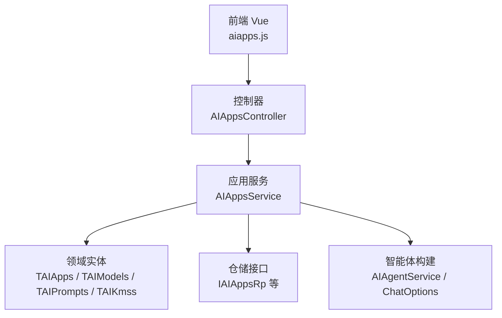
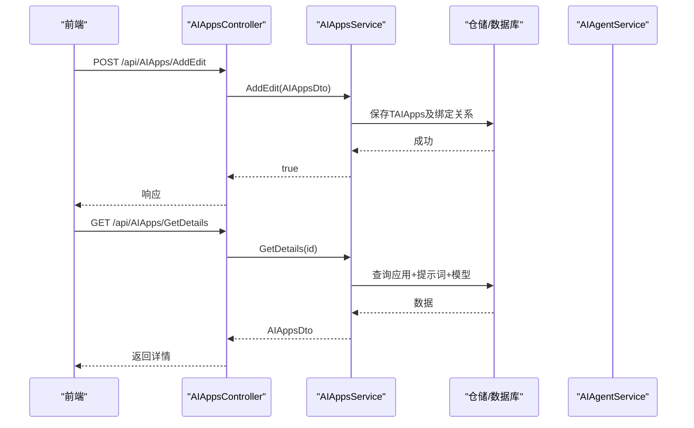
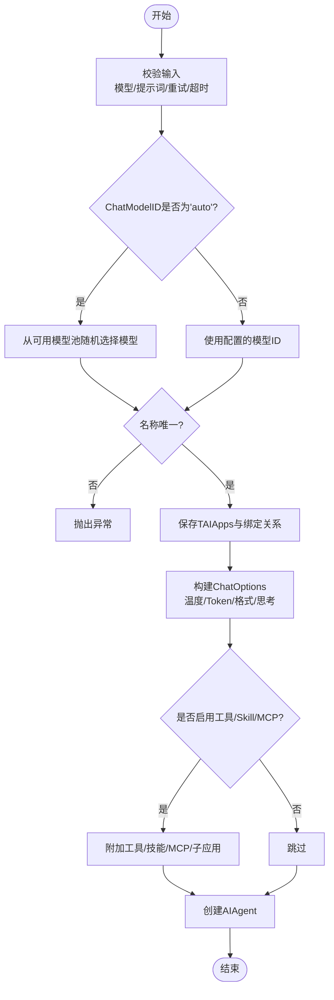
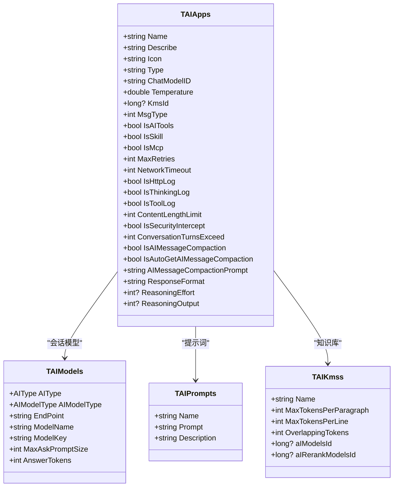

# AI应用管理

<cite>
**本文引用的文件**
- [TAIApps.cs](file://Kevin/Domain/Entities/AI/TAIApps.cs)
- [AIAppsService.cs](file://Kevin/Application/Services/AI/AIAppsService.cs)
- [AIAppsController.cs](file://Kevin/ Kevin.Web.Basics/Controllers/AI/AIAppsController.cs)
- [AIAppsDto.cs](file://Kevin/kevin.Share/Dtos/AI/AIAppsDto.cs)
- [TAIPrompts.cs](file://Kevin/Domain/Entities/AI/TAIPrompts.cs)
- [TAIModels.cs](file://Kevin/Domain/Entities/AI/TAIModels.cs)
- [TAIKmss.cs](file://Kevin/Domain/Entities/AI/TAIKmss.cs)
- [aiapps.js](file://vue/kevin.web.vue/src/api/ai/aiapps.js)
</cite>

## 更新摘要
**变更内容**
- 新增自动模式支持：ChatModelID字段现在支持"auto"值，系统会自动从可用模型池中随机选择模型
- 增强了模型选择的可靠性：通过自动模式减少手动配置工作，提高系统稳定性
- 更新了相关服务逻辑：在多个关键路径中实现了自动模式解析和模型选择逻辑

## 目录
1. [简介](#简介)
2. [项目结构](#项目结构)
3. [核心组件](#核心组件)
4. [架构总览](#架构总览)
5. [详细组件分析](#详细组件分析)
6. [依赖关系分析](#依赖关系分析)
7. [性能与稳定性](#性能与稳定性)
8. [故障排查指南](#故障排查指南)
9. [结论](#结论)
10. [附录：配置模板与API示例](#附录配置模板与api示例)

## 简介
本章节面向"AI应用管理"能力，覆盖AI应用的创建、配置、启用/禁用（通过删除标记）、模型选择、参数配置、权限与绑定、生命周期管理、版本控制（通过编辑更新）、监控统计（日志开关）等。重点解读TAIApps实体的各项配置项，包括温度、最大token数、知识库关联、提示词绑定、消息类型、工具开关、安全拦截、对话压缩策略等，并提供前端调用示例与部署注意事项。

**更新** 新增了自动模式支持，允许应用配置为自动选择模型，提升系统可靠性和减少手动配置工作。

## 项目结构
AI应用管理采用典型的分层架构：
- 表现层：Web API控制器暴露REST接口
- 应用服务层：编排业务逻辑、组装Agent选项、处理绑定关系
- 领域实体：持久化AI应用、模型、提示词、知识库等
- 数据访问层：仓储接口与实现（由框架注入）
- 前端：Vue页面通过JS API调用后端接口

图表来源
- [AIAppsController.cs:17-121](file://Kevin/ Kevin.Web.Basics/Controllers/AI/AIAppsController.cs#L17-L121)
- [AIAppsService.cs:16-565](file://Kevin/Application/Services/AI/AIAppsService.cs#L16-L565)
- [TAIApps.cs:9-218](file://Kevin/Domain/Entities/AI/TAIApps.cs#L9-L218)
- [TAIModels.cs:8-69](file://Kevin/Domain/Entities/AI/TAIModels.cs#L8-L69)
- [TAIPrompts.cs:6-30](file://Kevin/Domain/Entities/AI/TAIPrompts.cs#L6-L30)
- [TAIKmss.cs:6-45](file://Kevin/Domain/Entities/AI/TAIKmss.cs#L6-L45)

章节来源
- [AIAppsController.cs:17-121](file://Kevin/ Kevin.Web.Basics/Controllers/AI/AIAppsController.cs#L17-L121)
- [AIAppsService.cs:16-565](file://Kevin/Application/Services/AI/AIAppsService.cs#L16-L565)

## 核心组件
- 控制器：提供分页查询、全部列表、可用列表、新增/编辑、初始化、详情、删除等接口
- 应用服务：负责校验、CRUD、绑定关系维护、Agent选项装配、子应用引用、技能/工具/MCP加载、消息压缩策略等
- 领域实体：定义AI应用及其相关模型、提示词、知识库的字段与约束
- DTO：对外传输对象，包含校验规则与默认值

章节来源
- [AIAppsController.cs:31-119](file://Kevin/ Kevin.Web.Basics/Controllers/AI/AIAppsController.cs#L31-L119)
- [AIAppsService.cs:57-565](file://Kevin/Application/Services/AI/AIAppsService.cs#L57-L565)
- [AIAppsDto.cs:7-266](file://Kevin/kevin.Share/Dtos/AI/AIAppsDto.cs#L7-L266)
- [TAIApps.cs:9-218](file://Kevin/Domain/Entities/AI/TAIApps.cs#L9-L218)

## 架构总览
AI应用从创建到运行的关键流程如下：
- 创建/编辑：校验必填项、唯一性、保存实体与绑定关系
- 运行期：根据应用配置动态生成ChatOptions与Agent，挂载工具/技能/MCP、设置消息存储与压缩策略
- 调用链：控制器接收请求→服务层组装Agent→调用底层AI客户端→返回结果

图表来源
- [AIAppsController.cs:65-105](file://Kevin/ Kevin.Web.Basics/Controllers/AI/AIAppsController.cs#L65-L105)
- [AIAppsService.cs:170-259](file://Kevin/Application/Services/AI/AIAppsService.cs#L170-L259)
- [AIAppsService.cs:321-459](file://Kevin/Application/Services/AI/AIAppsService.cs#L321-L459)

## 详细组件分析

### TAIApps 实体与配置项说明
- 基础信息
  - 名称、描述、图标、类型：用于展示与管理
  - 会话模型ID：关联TAIModels，决定使用的聊天模型，现支持"auto"自动模式
  - Rerank模型ID：可选的重排模型
- 生成与检索参数
  - 温度：影响回答随机性（运行时按百分比换算为0-1范围）
  - 相似度、向量匹配数、重排数量：RAG检索与重排参数
- 知识与提示
  - 知识库ID：关联TAIKmss，用于检索增强
  - 提示词绑定：关联TAIPrompts，作为系统提示词的一部分
- 输出与安全
  - 消息类型：非流式文本、流式文本、图片、音频、视频、文件、链接、卡片
  - 是否开启AI工具、Skill、MCP：控制能力开关
  - 是否记录HTTP日志、思考过程日志、工具调用日志：便于调试与监控
  - 内容长度限制：对知识库、搜索、工具、文件等内容进行截断
  - 安全拦截：对Python脚本与Shell命令进行安全过滤
- 网络与重试
  - 最大重试次数、超时时间（分钟）
- 授权与配额
  - 授权白名单：域名前缀列表，*表示所有
  - 对话消息数量限制：控制上下文大小
- 对话压缩
  - 轮次阈值、是否自动压缩、是否自动获取压缩、压缩策略提示词
- 模型行为
  - 返回格式：Text或Json
  - 思考能力与输出：None/Low/Medium/High/ExtraHigh；None/Summary/Full
  - 是否开启MCP工具

**更新** 会话模型ID现在支持"auto"值，当设置为"auto"时，系统会在运行时自动从可用模型池中随机选择一个模型，提高了系统的灵活性和可靠性。

章节来源
- [TAIApps.cs:13-218](file://Kevin/Domain/Entities/AI/TAIApps.cs#L13-L218)
- [AIAppsDto.cs:42-266](file://Kevin/kevin.Share/Dtos/AI/AIAppsDto.cs#L42-L266)

### 应用服务：创建、配置、启用/禁用、生命周期
- 创建与编辑
  - 校验：模型ID、提示词、重试次数、超时时间等
  - 唯一性：名称在租户内唯一
  - 保存：写入TAIApps并批量更新绑定关系（工具/技能/MCP、外部绑定ID）
- 启用/禁用
  - 通过软删除标记实现"禁用"，保留历史数据
- 生命周期
  - 新建：初始化ID、创建人、租户、时间戳
  - 更新：更新时间、更新人、租户隔离
  - 删除：标记删除并记录删除时间
- Agent装配
  - 根据应用配置生成ChatOptions（温度、最大输出token、返回格式、思考能力/输出）
  - 装配聊天历史提供者，支持对话压缩与轮次限制
  - 条件装配：AI工具、Skill、MCP、子应用引用（最多三级）
  - 最终通过AIAgentService创建OpenAI兼容Agent，传入端点、密钥、流式、日志、重试、超时等

**更新** 新增了自动模式支持，在多个关键路径中实现了ChatModelID为"auto"时的自动模型选择逻辑：
- 在GetAppAIAgentOptions方法中，当检测到ChatModelID为"auto"时，会从可用模型列表中随机选择一个模型
- 在GetAppAIAgent方法中，同样实现了自动模式解析，确保子应用也能正确使用自动模式
- 在任务处理服务中也添加了相应的自动模式支持

图表来源
- [AIAppsService.cs:170-259](file://Kevin/Application/Services/AI/AIAppsService.cs#L170-L259)
- [AIAppsService.cs:321-459](file://Kevin/Application/Services/AI/AIAppsService.cs#L321-L459)
- [AIAppsService.cs:460-562](file://Kevin/Application/Services/AI/AIAppsService.cs#L460-L562)

章节来源
- [AIAppsService.cs:57-565](file://Kevin/Application/Services/AI/AIAppsService.cs#L57-L565)

### 控制器：API入口
- 列表与分页：支持关键字搜索、租户隔离
- 全部列表：带缓存过滤器
- 我的可用列表：基于用户/角色绑定关系过滤
- 新增/编辑：透传DTO至服务层
- 初始化：返回可绑定的技能/工具清单
- 详情：返回应用完整配置与绑定关系
- 删除：软删除

章节来源
- [AIAppsController.cs:31-119](file://Kevin/ Kevin.Web.Basics/Controllers/AI/AIAppsController.cs#L31-L119)

### 模型、提示词、知识库
- 模型（TAIModels）
  - 类型与模型类型：聊天/嵌入/重排
  - 端点、名称、密钥、部署名
  - 提问最大token数、回答最大token数
- 提示词（TAIPrompts）
  - 名称、提示词内容、描述
- 知识库（TAIKmss）
  - 段落/行最大token、重叠token
  - 矢量化模型ID、重排模型ID

章节来源
- [TAIModels.cs:8-69](file://Kevin/Domain/Entities/AI/TAIModels.cs#L8-L69)
- [TAIPrompts.cs:6-30](file://Kevin/Domain/Entities/AI/TAIPrompts.cs#L6-L30)
- [TAIKmss.cs:6-45](file://Kevin/Domain/Entities/AI/TAIKmss.cs#L6-L45)

### 自动模式实现详解
**新增功能** 自动模式的核心实现逻辑：

1. **模型检测与选择**：
   - 当ChatModelID设置为"auto"时，系统会调用`aIModelsService.GetNoPerALLList(1)`获取所有可用的聊天模型
   - 如果没有任何可用模型，会抛出友好的异常提示
   - 从可用模型列表中随机选择一个模型ID

2. **多位置支持**：
   - 主应用创建：在`GetAppAIAgentOptions`方法中实现
   - 子应用创建：在`GetAppAIAgent`方法中实现
   - 任务处理：在`KevinAITasksService`中实现
   - 聊天历史处理：在`AIChatHistorysService`中实现

3. **错误处理**：
   - 当没有可用模型时，提供明确的错误提示信息
   - 确保系统在异常情况下仍能给出合理的反馈

**Section sources**
- [AIAppsService.cs:371-389](file://Kevin/Application/Services/AI/AIAppsService.cs#L371-L389)
- [AIAppsService.cs:470-481](file://Kevin/Application/Services/AI/AIAppsService.cs#L470-L481)
- [KevinAITasksService.cs:186-201](file://Kevin/Application/Services/AI/KevinAITasksService.cs#L186-L201)
- [AIChatHistorysService.cs:134-145](file://Kevin/Application/Services/AI/AIChatHistorysService.cs#L134-L145)

## 依赖关系分析
- 控制器依赖服务接口，服务依赖仓储与多个AI能力服务
- 应用服务依赖：
  - 技能/工具管理服务：获取与绑定
  - 聊天消息存储：会话历史与压缩
  - 智能体服务：创建Agent
  - 模型/提示词服务：读取配置
- 实体间关系：
  - TAIApps 关联 TAIModels（会话模型）、TAIPrompts（提示词）、TAIKmss（知识库）

图表来源
- [TAIApps.cs:9-218](file://Kevin/Domain/Entities/AI/TAIApps.cs#L9-L218)
- [TAIModels.cs:8-69](file://Kevin/Domain/Entities/AI/TAIModels.cs#L8-L69)
- [TAIPrompts.cs:6-30](file://Kevin/Domain/Entities/AI/TAIPrompts.cs#L6-L30)
- [TAIKmss.cs:6-45](file://Kevin/Domain/Entities/AI/TAIKmss.cs#L6-L45)

章节来源
- [AIAppsService.cs:16-565](file://Kevin/Application/Services/AI/AIAppsService.cs#L16-L565)

## 性能与稳定性
- 并发与吞吐
  - 合理设置最大重试次数与超时时间，避免雪崩
  - 使用流式消息类型可降低首包延迟
- 上下文与压缩
  - 对话轮次阈值与自动压缩策略控制上下文大小，降低token消耗
  - 内容长度限制防止超长输入导致失败
- 检索优化
  - 调整相似度、向量匹配数、重排数量以平衡召回与精度
- 日志与监控
  - HTTP日志、思考过程日志、工具调用日志按需开启，生产环境建议仅开启必要项
- **自动模式优化**
  - 自动模式减少了模型选择的复杂性，降低了配置错误的风险
  - 随机选择模型可以提高负载均衡，避免单点故障
  - 建议在模型配置充足的情况下使用自动模式以获得更好的稳定性

[本节为通用指导，不直接分析具体文件]

## 故障排查指南
- 常见错误
  - 未选择会话模型或提示词为空：服务层校验会抛出字段验证异常
  - 名称重复：新增/编辑时检查唯一性
  - 数据不存在或已删除：详情/编辑/删除时若找不到记录将抛出友好异常
  - **自动模式无可用模型**：当ChatModelID设置为"auto"但没有可用模型时，会抛出明确的用户友好异常
- 定位方法
  - 开启HTTP日志、思考过程日志、工具调用日志，结合重试与超时参数定位问题
  - 检查授权白名单与模型端点/密钥是否正确
  - 确认技能/工具/MCP是否已正确绑定并可用
  - **检查模型配置**：确保至少有一个可用的聊天模型配置

**更新** 针对自动模式的故障排查：
- 检查是否有至少一个可用的聊天模型配置
- 确认模型的端点、密钥、模型名称等配置是否正确
- 查看系统日志中的模型选择相关信息
- 验证模型的可用性状态

章节来源
- [AIAppsDto.cs:87-105](file://Kevin/kevin.Share/Dtos/AI/AIAppsDto.cs#L87-L105)
- [AIAppsService.cs:170-259](file://Kevin/Application/Services/AI/AIAppsService.cs#L170-L259)
- [AIAppsService.cs:300-315](file://Kevin/Application/Services/AI/AIAppsService.cs#L300-L315)
- [AIAppsService.cs:381-389](file://Kevin/Application/Services/AI/AIAppsService.cs#L381-L389)

## 结论
AI应用管理提供了完整的创建、配置、启用/禁用、模型选择、参数调优、权限与绑定、生命周期管理与监控能力。通过TAIApps的丰富配置项，可以灵活适配不同场景的AI需求，并结合知识库、提示词、工具与技能构建强大的智能体。

**更新** 新增的自动模式功能进一步简化了模型配置流程，提高了系统的可靠性和易用性。通过在ChatModelID字段中设置"auto"值，系统会自动从可用模型池中选择合适的模型，减少了手动配置的工作量和出错概率。建议在模型配置充足的生产环境中使用自动模式，以获得更好的稳定性和负载均衡效果。

建议在上线前充分评估温度、token限制、重试与超时、日志开关等参数，确保稳定性与成本可控。对于需要高可用性的应用场景，推荐使用自动模式来降低运维复杂度。

## 附录：配置模板与API示例

### 配置模板（JSON）
以下为新增/编辑AI应用时可参考的请求体结构（字段含义见上文说明）：
- 名称、描述、图标、类型
- 会话模型ID、重排模型ID
- 温度、相似度、向量匹配数、重排数量
- 知识库ID、提示词ID
- 消息类型、是否开启AI工具/Skill/MCP
- 最大重试次数、超时时间、授权白名单
- 对话消息限制、思考过程日志、工具调用日志、内容长度限制、安全拦截
- 对话轮次阈值、自动压缩开关、压缩策略提示词
- 返回格式、思考能力、思考输出

**更新** 会话模型ID现在支持以下值：
- 具体的模型ID字符串：使用指定的模型
- "auto"：系统自动从可用模型池中随机选择模型

章节来源
- [AIAppsDto.cs:7-266](file://Kevin/kevin.Share/Dtos/AI/AIAppsDto.cs#L7-L266)

### API调用示例（前端）
- 获取分页列表：POST /api/AIApps/GetPageData
- 获取全部列表：GET /api/AIApps/GetALLList
- 获取我的可用列表：GET /api/AIApps/GetMyALLList
- 新增或编辑：POST /api/AIApps/AddEdit
- 初始化（技能/工具清单）：GET /api/AIApps/NewInitialization
- 获取详情：GET /api/AIApps/GetDetails?Id=...
- 删除：DELETE /api/AIApps/Delete?Id=...

章节来源
- [aiapps.js:1-23](file://vue/kevin.web.vue/src/api/ai/aiapps.js#L1-L23)
- [AIAppsController.cs:31-119](file://Kevin/ Kevin.Web.Basics/Controllers/AI/AIAppsController.cs#L31-L119)

### 部署与运行要点
- 模型配置：确保TAIModels中的端点、密钥、模型名称正确
- 提示词与知识库：提前准备并绑定到应用
- 权限与绑定：根据需要为用户/角色绑定可用应用
- 日志与监控：生产环境谨慎开启日志，避免过多IO开销
- 流式与非流式：根据前端能力选择消息类型
- **自动模式部署**：
  - 确保至少配置一个可用的聊天模型
  - 在生产环境中建议使用自动模式以提高系统稳定性
  - 定期监控模型使用情况，确保负载均衡

**更新** 自动模式的使用建议：
- 在模型配置充足的环境中优先使用自动模式
- 对于需要特定模型的业务场景，仍可使用固定模型ID
- 定期检查模型可用性，确保自动模式能正常工作
- 结合监控告警机制，及时发现模型不可用的情况

[本节为通用指导，不直接分析具体文件]