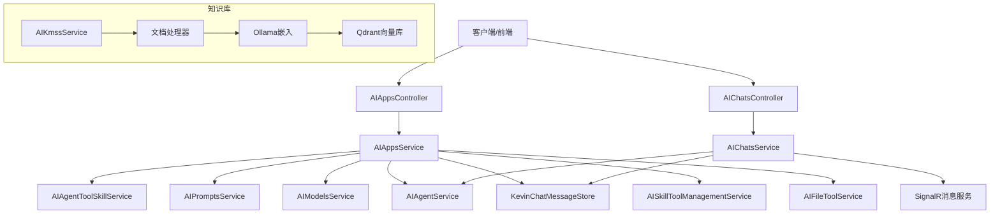
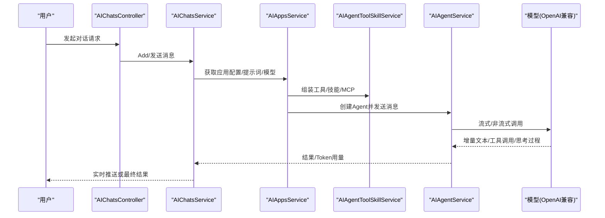
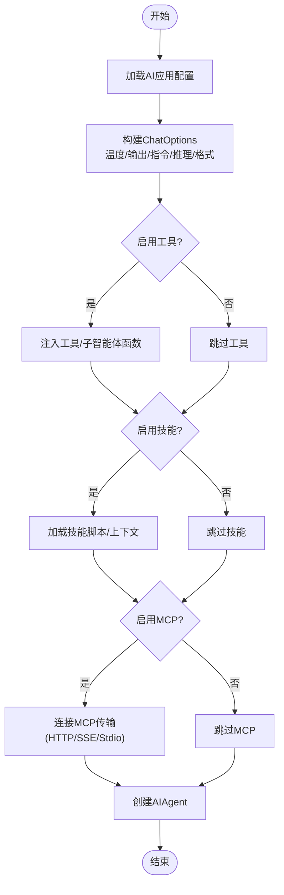
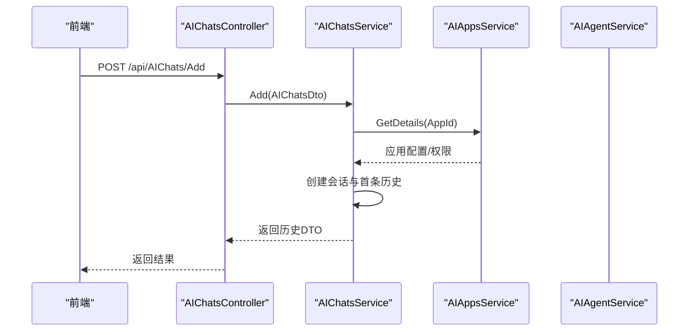
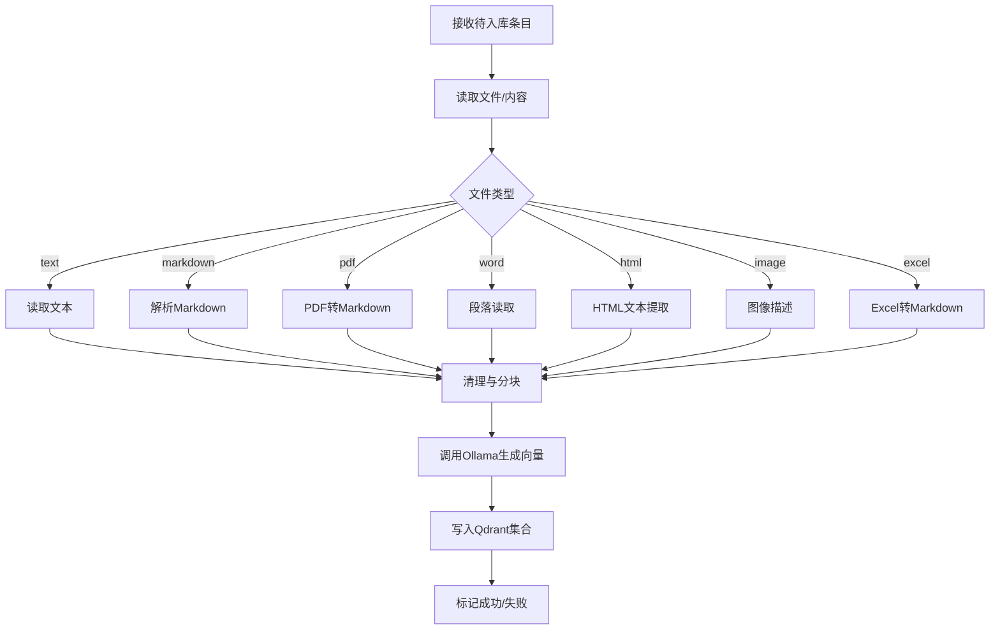
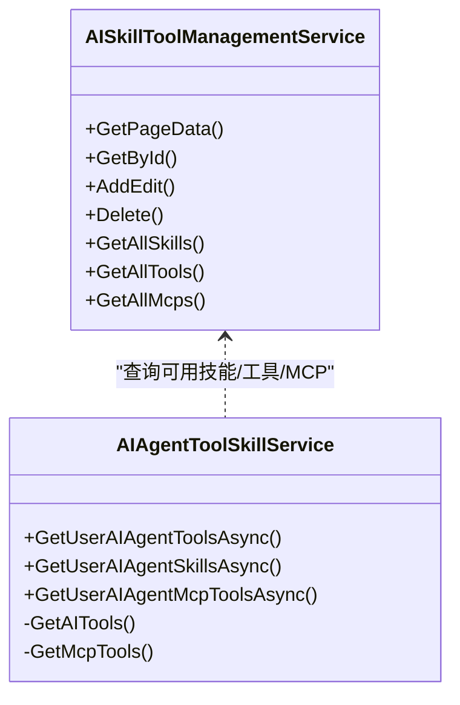
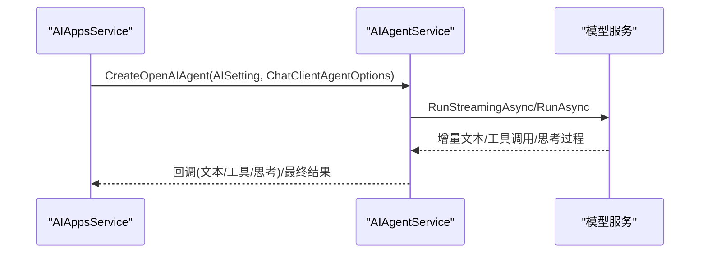
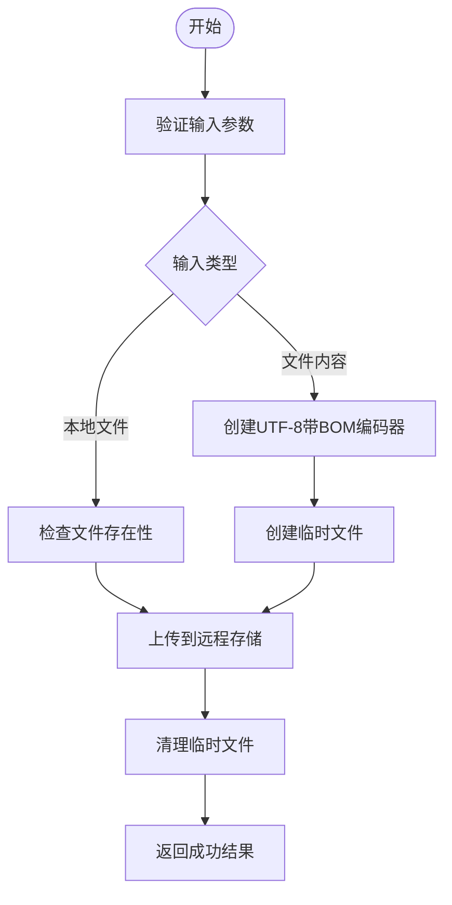
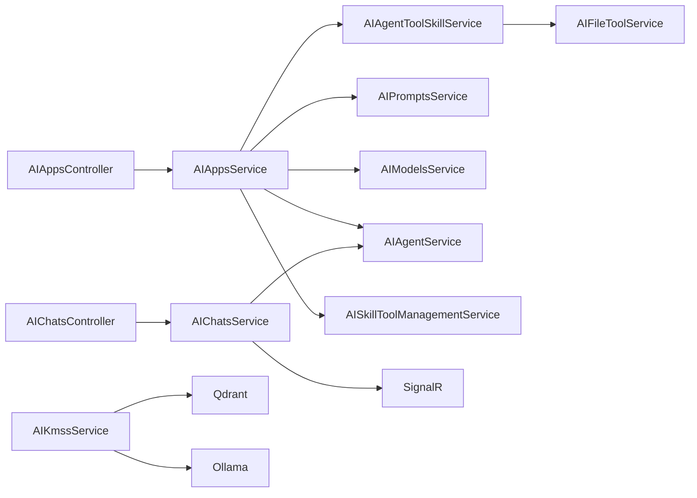

# AI智能助手

<cite>
**本文引用的文件**
- [AIAppsService.cs](file://Kevin/Application/Services/AI/AIAppsService.cs)
- [AIChatsService.cs](file://Kevin/Application/Services/AI/AIChatsService.cs)
- [AIKmssService.cs](file://Kevin/Application/Services/AI/AIKmssService.cs)
- [AISkillToolManagementService.cs](file://Kevin/Application/Services/AI/AISkillToolManagementService.cs)
- [AIMsgService.cs](file://Kevin/Application/Services/AI/AIMsgService.cs)
- [AIPromptsService.cs](file://Kevin/Application/Services/AI/AIPromptsService.cs)
- [AIModelsService.cs](file://Kevin/Application/Services/AI/AIModelsService.cs)
- [AIAgentToolSkillService.cs](file://Kevin/Application/Services/AI/AIAgentToolSkillService.cs)
- [AIFileToolService.cs](file://Kevin/Application/Services/AI/AIFileToolService.cs)
- [IAIFileToolService.cs](file://Kevin/Domain/Interfaces/IServices/AI/IAIFileToolService.cs)
- [TextStreamReader.cs](file://Kevin/kevin.Module/Kevin.Common/Helper/FileHandleTools/TextStreamReader.cs)
- [CommonToolsService.cs](file://Kevin/kevin.Module/kevin.AI.AgentFramework/Tools/CommonToolsService.cs)
- [PythonToolsService.cs](file://Kevin/kevin.Module/kevin.AI.AgentFramework/Tools/PythonToolsService.cs)
- [AIAgentService.cs](file://Kevin/kevin.Module/kevin.AI.AgentFramework/AIAgentService.cs)
- [AIAppsController.cs](file://Kevin/ Kevin.Web.Basics/Controllers/AI/AIAppsController.cs)
- [AIChatsController.cs](file://Kevin/ Kevin.Web.Basics/Controllers/AI/AIChatsController.cs)
</cite>

## 更新摘要
**变更内容**
- 新增AI文件工具服务编码优化章节，详细说明UTF-8带BOM编码改进
- 更新文件处理相关组件的编码策略说明
- 增强多语言内容处理的兼容性描述
- 补充文件工具服务的集成与使用方式

## 目录
1. [简介](#简介)
2. [项目结构](#项目结构)
3. [核心组件](#核心组件)
4. [架构总览](#架构总览)
5. [详细组件分析](#详细组件分析)
6. [依赖关系分析](#依赖关系分析)
7. [性能与优化建议](#性能与优化建议)
8. [故障排查指南](#故障排查指南)
9. [结论](#结论)
10. [附录：API与配置要点](#附录api与配置要点)

## 简介
本模块提供企业级AI智能助手能力，覆盖AI应用管理、聊天对话、知识库（RAG）管理、技能与工具注册使用等核心功能。系统支持多模型接入、流式响应、上下文记忆压缩、文件处理、代码执行、MCP协议工具集成等高级特性，并提供完整的Web API与前端页面支撑。**最新更新**：AI文件工具服务已优化UTF-8编码策略，采用带BOM模式确保浏览器和编辑器正确识别中文编码，避免乱码问题，显著提升多语言内容处理的兼容性。

## 项目结构
- 应用服务层（Application/Services/AI）：封装业务编排、数据持久化、外部服务调用（如向量库、文件存储、消息推送）。
- 控制器层（Web.Basics/Controllers/AI）：对外暴露REST接口，承载权限、日志、缓存等横切关注点。
- Agent框架（kevin.AI.AgentFramework）：统一构建AI代理、工具/技能装配、流式输出、重试与Token用量统计。
- RAG与向量检索（Kevin.RAG）：文档解析、分块、向量化、Qdrant存储与检索。
- 领域实体与仓储（Domain/Entities, RepositorieRps）：AI相关实体定义与数据库访问。

图表来源
- [AIAppsController.cs:14-122](file://Kevin/ Kevin.Web.Basics/Controllers/AI/AIAppsController.cs#L14-L122)
- [AIChatsController.cs:15-79](file://Kevin/ Kevin.Web.Basics/Controllers/AI/AIChatsController.cs#L15-L79)
- [AIAppsService.cs:16-544](file://Kevin/Application/Services/AI/AIAppsService.cs#L16-L544)
- [AIChatsService.cs:14-212](file://Kevin/Application/Services/AI/AIChatsService.cs#L14-L212)
- [AIAgentService.cs:21-491](file://Kevin/kevin.Module/kevin.AI.AgentFramework/AIAgentService.cs#L21-L491)
- [AIKmssService.cs:18-449](file://Kevin/Application/Services/AI/AIKmssService.cs#L18-L449)

章节来源
- [AIAppsController.cs:14-122](file://Kevin/ Kevin.Web.Basics/Controllers/AI/AIAppsController.cs#L14-L122)
- [AIChatsController.cs:15-79](file://Kevin/ Kevin.Web.Basics/Controllers/AI/AIChatsController.cs#L15-L79)

## 核心组件
- AI应用管理：创建/编辑/删除智能体，绑定模型、提示词、工具/技能/MCP、子智能体，配置温度、最大输出、响应格式、重试次数、网络超时、消息压缩策略等。
- 聊天对话：创建会话、维护对话历史、流式或一次性返回结果、更新主题与最后一条消息。
- 知识库管理：上传/导入文档，文本/Markdown/PDF/Word/HTML/图片/Excel等多格式解析，按段落/行分块，生成向量并入库Qdrant。
- 技能与工具：动态注册内置工具（HTTP、Shell、Python、桌面操作、定时任务、钉钉消息等），以及通过MCP协议接入第三方工具；支持技能包解压与脚本执行。
- 模型与提示词：集中管理模型端点、密钥、类型（含Embedding）、提示词模板与描述。
- Agent框架：统一构建OpenAI兼容Agent，支持工具自动审批、流式回调、思考过程提取、Token用量统计、失败重试。
- **文件工具服务**：新增的AI文件工具服务，支持内容保存和文件上传，采用UTF-8带BOM编码确保中文显示正确。

章节来源
- [AIAppsService.cs:16-544](file://Kevin/Application/Services/AI/AIAppsService.cs#L16-L544)
- [AIChatsService.cs:14-212](file://Kevin/Application/Services/AI/AIChatsService.cs#L14-L212)
- [AIKmssService.cs:18-449](file://Kevin/Application/Services/AI/AIKmssService.cs#L18-L449)
- [AISkillToolManagementService.cs:16-254](file://Kevin/Application/Services/AI/AISkillToolManagementService.cs#L16-L254)
- [AIAgentToolSkillService.cs:16-381](file://Kevin/Application/Services/AI/AIAgentToolSkillService.cs#L16-381)
- [AIPromptsService.cs:7-155](file://Kevin/Application/Services/AI/AIPromptsService.cs#L7-L155)
- [AIModelsService.cs:8-160](file://Kevin/Application/Services/AI/AIModelsService.cs#L8-L160)
- [AIAgentService.cs:21-491](file://Kevin/kevin.Module/kevin.AI.AgentFramework/AIAgentService.cs#L21-L491)
- [AIFileToolService.cs:10-76](file://Kevin/Application/Services/AI/AIFileToolService.cs#L10-L76)

## 架构总览
系统采用分层架构：
- 表现层：ASP.NET Core控制器，负责路由、鉴权、日志、缓存。
- 应用服务层：编排业务流程，协调领域服务、外部服务与基础设施。
- 领域与基础设施：实体、仓储、文件存储、向量库、消息队列、SignalR等。
- Agent框架：基于Microsoft.Extensions.AI与OpenAI SDK，统一封装模型调用、工具/技能装配、流式输出与重试。

图表来源
- [AIChatsController.cs:15-79](file://Kevin/ Kevin.Web.Basics/Controllers/AI/AIChatsController.cs#L15-L79)
- [AIChatsService.cs:14-212](file://Kevin/Application/Services/AI/AIChatsService.cs#L14-L212)
- [AIAppsService.cs:16-544](file://Kevin/Application/Services/AI/AIAppsService.cs#L16-L544)
- [AIAgentToolSkillService.cs:16-381](file://Kevin/Application/Services/AI/AIAgentToolSkillService.cs#L16-381)
- [AIAgentService.cs:21-491](file://Kevin/kevin.Module/kevin.AI.AgentFramework/AIAgentService.cs#L21-L491)

## 详细组件分析

### AI应用管理（AIAppsService）
- 功能要点
  - 列表查询、详情获取、新增/编辑、删除、初始化默认配置。
  - 绑定技能/工具/MCP、子智能体引用（最多三级深度）。
  - 构建ChatOptions：温度、最大输出、指令（系统提示词）、推理选项、响应格式。
  - 构建ChatClientAgentOptions：名称、描述、历史记录提供者（可压缩）、工具集、技能上下文提供者。
  - 创建AIAgent：根据模型配置、是否启用工具/技能、是否流式、重试次数、网络超时等参数。
- 关键流程
  - GetAppChatOptions：将应用配置映射为ChatOptions。
  - GetAppAIAgentOptions/GetAppAIAgent：组合提示词、压缩策略、工具/技能/MCP，最终创建Agent。
- 错误处理
  - 应用不存在或已删除时抛出友好异常。
  - 唯一性校验（名称重复）。

图表来源
- [AIAppsService.cs:322-544](file://Kevin/Application/Services/AI/AIAppsService.cs#L322-L544)

章节来源
- [AIAppsService.cs:54-315](file://Kevin/Application/Services/AI/AIAppsService.cs#L54-L315)
- [AIAppsService.cs:322-544](file://Kevin/Application/Services/AI/AIAppsService.cs#L322-L544)

### 聊天对话（AIChatsService）
- 功能要点
  - 我的对话列表分页查询。
  - 新建对话：校验应用权限、写入会话与初始历史消息。
  - 更新对话主题与最后一条消息。
  - 获取对话详情、删除对话。
- 交互方式
  - 通过控制器暴露Add接口，结合SignalR进行流式消息推送（在Agent层实现流式回调）。

图表来源
- [AIChatsController.cs:15-79](file://Kevin/ Kevin.Web.Basics/Controllers/AI/AIChatsController.cs#L15-L79)
- [AIChatsService.cs:46-130](file://Kevin/Application/Services/AI/AIChatsService.cs#L46-L130)

章节来源
- [AIChatsService.cs:46-207](file://Kevin/Application/Services/AI/AIChatsService.cs#L46-L207)

### 知识库管理（AIKmssService）
- 功能要点
  - 知识库列表/分页/详情，包含关联明细与文件信息。
  - 新增/编辑知识库：设置分段大小、重叠token数、向量模型、重排模型。
  - 处理上传内容：读取本地文件或远程URL，按类型解析（text/markdown/pdf/word/html/image/excel）。
  - 文档分块与向量化：DocumentProcessor清理与分块，Ollama嵌入生成向量，批量写入Qdrant。
  - 分布式锁：避免并发重复处理同一知识库。
- 错误处理
  - 未找到知识库或明细时抛出友好异常。
  - 处理异常记录状态为失败并保存错误信息。

图表来源
- [AIKmssService.cs:241-429](file://Kevin/Application/Services/AI/AIKmssService.cs#L241-L429)

章节来源
- [AIKmssService.cs:50-240](file://Kevin/Application/Services/AI/AIKmssService.cs#L50-L240)
- [AIKmssService.cs:241-429](file://Kevin/Application/Services/AI/AIKmssService.cs#L241-L429)

### 技能与工具（AISkillToolManagementService & AIAgentToolSkillService）
- 技能管理
  - 列表/分页/详情，支持按类型筛选（技能/工具/MCP）。
  - 新增/编辑：技能包上传后解压到指定目录，供Agent运行时加载。
  - 删除：软删除并清理技能目录。
- 工具装配
  - 内置工具：当前时间、当前用户、HTTP请求、Shell命令、Python代码执行、桌面操作、定时任务、钉钉消息、JSON日志、授权码获取等。
  - MCP工具：支持HTTP/HTTPS、SSE、Stdio三种传输模式，动态发现并注册为AITool。
  - 工具选择：根据应用绑定的工具ID动态注入，支持用户维度隔离。
- 安全与护栏
  - Shell/Python执行限制（超时、输出截断、危险命令阻止）。
  - 工具调用自动审批规则（可配置）。

图表来源
- [AISkillToolManagementService.cs:16-254](file://Kevin/Application/Services/AI/AISkillToolManagementService.cs#L16-L254)
- [AIAgentToolSkillService.cs:16-381](file://Kevin/Application/Services/AI/AIAgentToolSkillService.cs#L16-381)

章节来源
- [AISkillToolManagementService.cs:29-206](file://Kevin/Application/Services/AI/AISkillToolManagementService.cs#L29-L206)
- [AIAgentToolSkillService.cs:59-378](file://Kevin/Application/Services/AI/AIAgentToolSkillService.cs#L59-L378)

### 模型与提示词（AIModelsService & AIPromptsService）
- 模型管理
  - 列表/分页/详情，支持按类型过滤（如Embedding）。
  - 新增/编辑：端点、模型名、密钥、描述、向量维度等。
  - 删除：软删除。
- 提示词管理
  - 列表/分页/详情，支持租户隔离。
  - 新增/编辑：名称、提示词内容、描述。
  - 删除：软删除。

章节来源
- [AIModelsService.cs:16-157](file://Kevin/Application/Services/AI/AIModelsService.cs#L16-L157)
- [AIPromptsService.cs:15-151](file://Kevin/Application/Services/AI/AIPromptsService.cs#L15-L151)

### Agent框架与流式响应（AIAgentService）
- 能力
  - 创建OpenAI兼容Agent，支持工具自动审批、技能上下文。
  - 流式输出：逐段文本、工具调用/结果、思考过程提取。
  - 非流式输出：一次性返回完整结果。
  - Token用量统计：从多种来源提取usage信息。
  - 重试机制：失败时按配置重试。
- 回调
  - 流式回调用于实时推送（如SignalR）。
  - 工具调用/结果回调便于调试与审计。

图表来源
- [AIAgentService.cs:37-195](file://Kevin/kevin.Module/kevin.AI.AgentFramework/AIAgentService.cs#L37-L195)
- [AIAgentService.cs:197-247](file://Kevin/kevin.Module/kevin.AI.AgentFramework/AIAgentService.cs#L197-L247)

章节来源
- [AIAgentService.cs:37-491](file://Kevin/kevin.Module/kevin.AI.AgentFramework/AIAgentService.cs#L37-L491)

### AI文件工具服务（AIFileToolService）
**新增功能** AI文件工具服务提供文件保存和内容上传功能，特别针对多语言内容处理进行了编码优化。

- 功能要点
  - 支持本地文件路径和文件内容两种方式保存文件。
  - 自动生成安全文件名，防止路径注入攻击。
  - 临时文件创建、上传到远程存储、清理临时文件。
  - **UTF-8带BOM编码**：确保浏览器和编辑器正确识别中文编码，避免乱码问题。
- 编码优化
  - 使用`new UTF8Encoding(true)`创建带BOM的UTF-8编码器。
  - BOM（Byte Order Mark）帮助Windows系统和各种编辑器正确识别文件编码。
  - 提升多语言内容处理的兼容性和用户体验。
- 错误处理
  - 参数验证：检查fileName、basePath、content的有效性。
  - 文件存在性检查：验证本地文件是否存在。
  - 异常捕获：统一的异常处理和错误信息返回。

图表来源
- [AIFileToolService.cs:17-76](file://Kevin/Application/Services/AI/AIFileToolService.cs#L17-L76)

章节来源
- [AIFileToolService.cs:10-76](file://Kevin/Application/Services/AI/AIFileToolService.cs#L10-L76)
- [IAIFileToolService.cs:9-13](file://Kevin/Domain/Interfaces/IServices/AI/IAIFileToolService.cs#L9-L13)

### 文本流读取器（TextStreamReader）
- 功能要点
  - 自动检测文件编码，优先检查BOM标识。
  - 支持UTF-8、UTF-16、UTF-32等多种编码格式。
  - 提供Markdown内容解析功能。
- 编码检测逻辑
  - UTF-8 BOM：EF BB BF
  - UTF-16 LE：FF FE
  - UTF-16 BE：FE FF
  - UTF-32 LE：FF FE 00 00
- Markdown解析
  - 自动识别标题、列表、代码块等Markdown元素。
  - 返回结构化信息包括原始内容、是否为有效Markdown、标题、行数、字符数。

章节来源
- [TextStreamReader.cs:12-92](file://Kevin/kevin.Module/Kevin.Common/Helper/FileHandleTools/TextStreamReader.cs#L12-L92)

### 通用工具服务（CommonToolsService）
- 桌面文件操作
  - WriteTextToDesktop：输出文本文件到桌面，使用UTF-8无BOM编码保证跨平台兼容。
  - WriteBytesToDesktop：保存字节数组到桌面文件。
  - WriteStreamToDesktop：保存流内容到桌面文件。
  - CopyFileToDesktop：复制文件到桌面。
- 安全处理
  - 文件名安全化处理，移除非法字符。
  - 目录创建和文件存在性检查。
  - 覆盖控制和安全防护。

章节来源
- [CommonToolsService.cs:112-257](file://Kevin/kevin.Module/kevin.AI.AgentFramework/Tools/CommonToolsService.cs#L112-L257)

### Python工具服务（PythonToolsService）
- Python脚本执行
  - 支持Python代码执行，自动添加.py扩展名。
  - **UTF-8无BOM编码**：确保Python解释器正确识别脚本文件。
  - 临时文件管理和清理。
- 安全考虑
  - 代码执行环境隔离。
  - 超时控制和资源限制。

章节来源
- [PythonToolsService.cs:280-299](file://Kevin/kevin.Module/kevin.AI.AgentFramework/Tools/PythonToolsService.cs#L280-L299)

## 依赖关系分析
- 控制器依赖服务：AIAppsController -> AIAppsService；AIChatsController -> AIChatsService。
- 服务间协作：
  - AIAppsService依赖AIAgentToolSkillService（工具/技能/MCP）、AIPromptsService（提示词）、AIModelsService（模型）、AIAgentService（Agent运行）。
  - AIChatsService依赖AIAppsService（应用配置）、AIAgentService（对话执行）、SignalR（实时推送）。
  - AIKmssService依赖文件服务、向量库（Qdrant）、Ollama嵌入、分布式锁。
  - **AIFileToolService**：被AIAgentToolSkillService集成，作为AI工具之一提供文件保存功能。
- 外部依赖：
  - OpenAI SDK（兼容接口）、Microsoft.Extensions.AI、ModelContextProtocol（MCP）、Qdrant、SignalR、文件存储。

图表来源
- [AIAppsController.cs:14-122](file://Kevin/ Kevin.Web.Basics/Controllers/AI/AIAppsController.cs#L14-L122)
- [AIChatsController.cs:15-79](file://Kevin/ Kevin.Web.Basics/Controllers/AI/AIChatsController.cs#L15-L79)
- [AIAppsService.cs:16-544](file://Kevin/Application/Services/AI/AIAppsService.cs#L16-L544)
- [AIChatsService.cs:14-212](file://Kevin/Application/Services/AI/AIChatsService.cs#L14-L212)
- [AIKmssService.cs:18-449](file://Kevin/Application/Services/AI/AIKmssService.cs#L18-L449)
- [AIAgentToolSkillService.cs:115-125](file://Kevin/Application/Services/AI/AIAgentToolSkillService.cs#L115-L125)

章节来源
- [AIAppsService.cs:16-544](file://Kevin/Application/Services/AI/AIAppsService.cs#L16-L544)
- [AIChatsService.cs:14-212](file://Kevin/Application/Services/AI/AIChatsService.cs#L14-L212)
- [AIKmssService.cs:18-449](file://Kevin/Application/Services/AI/AIKmssService.cs#L18-L449)
- [AIAgentToolSkillService.cs:115-125](file://Kevin/Application/Services/AI/AIAgentToolSkillService.cs#L115-L125)

## 性能与优化建议
- 流式响应优先：开启MsgType=2以启用流式输出，降低首字延迟，提升用户体验。
- 上下文压缩：启用IsAIMessageCompaction与IsAutoGetAIMessageCompaction，配合ConversationTurnsExceed控制保留轮次，减少上下文长度与成本。
- 模型参数调优：合理设置Temperature、MaxOutputTokens、ResponseFormat；对结构化输出使用Json格式。
- 工具与技能最小化：仅绑定必要工具/技能，减少工具调用开销与安全风险。
- 重试与超时：根据网络稳定性调整MaxRetries与NetworkTimeout，避免频繁重试导致雪崩。
- 知识库分块策略：根据文档语义调整MaxTokensPerParagraph与OverlappingTokens，平衡召回率与冗余。
- 向量维度匹配：确保Embedding模型的EmbeddingValueSize与实际向量维度一致，避免写入失败。
- 并发控制：知识库处理使用分布式锁，避免重复计算；高并发场景考虑异步批处理。
- **编码优化**：文件保存使用UTF-8带BOM编码，提升多语言内容兼容性；Python脚本使用UTF-8无BOM编码确保跨平台兼容。

[本节为通用指导，不直接分析具体文件]

## 故障排查指南
- 应用不存在或已删除：检查AI应用ID与租户隔离条件，确认未被软删除。
- 工具/技能未生效：确认应用已绑定对应工具/技能ID，且工具ClassMethod正确。
- MCP连接失败：检查McpType、McpUrl/McpCommand、Headers/Environment配置是否正确。
- 知识库入库失败：查看明细状态与错误信息，确认文件可读、解析器支持、向量模型可用。
- 流式无输出：检查IsStreame与回调是否注册，确认模型支持流式。
- 权限不足：确认用户具备该AI应用的访问权限（角色/用户绑定）。
- **文件编码问题**：检查文件保存时使用的编码格式，确保UTF-8带BOM用于需要中文显示的文件。
- **文件工具调用失败**：验证SaveFileContent方法的参数传递，确认basePath和content至少有一个有效值。

章节来源
- [AIAppsService.cs:85-117](file://Kevin/Application/Services/AI/AIAppsService.cs#L85-L117)
- [AIChatsService.cs:72-130](file://Kevin/Application/Services/AI/AIChatsService.cs#L72-L130)
- [AIKmssService.cs:241-429](file://Kevin/Application/Services/AI/AIKmssService.cs#L241-L429)
- [AIAgentToolSkillService.cs:252-327](file://Kevin/Application/Services/AI/AIAgentToolSkillService.cs#L252-L327)
- [AIFileToolService.cs:23-73](file://Kevin/Application/Services/AI/AIFileToolService.cs#L23-L73)

## 结论
本AI智能助手模块提供了完整的AI应用生命周期管理与对话能力，结合RAG、工具/技能扩展、流式响应与上下文压缩，满足企业级复杂场景需求。**最新改进**：AI文件工具服务通过UTF-8带BOM编码优化，显著提升了多语言内容处理的兼容性，确保中文内容在各种浏览器和编辑器中正确显示。通过统一的Agent框架与模块化设计，系统具备良好的可扩展性与可维护性。建议在生产环境结合业务特点调优模型参数、工具范围与知识库策略，以获得最佳性能与体验。

[本节为总结，不直接分析具体文件]

## 附录：API与配置要点
- AI应用管理接口
  - 获取列表：POST /api/AIApps/GetPageData
  - 获取全部：GET /api/AIApps/GetALLList
  - 我可用列表：GET /api/AIApps/GetMyALLList
  - 新增/编辑：POST /api/AIApps/AddEdit
  - 初始化：GET /api/AIApps/NewInitialization
  - 详情：GET /api/AIApps/GetDetails
  - 删除：DELETE /api/AIApps/Delete
- AI对话接口
  - 我的列表：POST /api/AIChats/GetMyPageData
  - 新增对话：POST /api/AIChats/Add
  - 删除对话：DELETE /api/AIChats/Delete
- **文件工具接口**
  - 保存文件内容：通过AI工具调用SaveFileContent方法
  - 支持本地文件路径和文件内容两种方式
  - 返回远程文件访问URL或错误信息
- 关键配置项（示例说明）
  - 模型：EndPoint、ModelName、ModelKey、AIModelType（含Embedding）、EmbeddingValueSize。
  - 提示词：Prompt、Description。
  - 应用：Temperature、AnswerTokens、ResponseFormat、ReasoningEffort/Output、MaxRetries、NetworkTimeout、IsHttpLog、IsAIMessageCompaction、ConversationTurnsExceed、IsAITools、IsSkill、IsMcp、AuthorizedDomains、ContentLengthLimit、IsSecurityIntercept等。
  - 知识库：MaxTokensPerParagraph、OverlappingTokens、aIModelsId（Embedding）、aIRerankModelsId。
  - 工具/技能/MCP：ClassMethod、McpType、McpUrl、McpHeaders、McpCommand、McpArguments、McpEnvironment。
  - **文件编码**：UTF-8带BOM用于需要中文显示的文件，UTF-8无BOM用于Python脚本等需要跨平台兼容的场景。

章节来源
- [AIAppsController.cs:31-119](file://Kevin/ Kevin.Web.Basics/Controllers/AI/AIAppsController.cs#L31-L119)
- [AIChatsController.cs:31-76](file://Kevin/ Kevin.Web.Basics/Controllers/AI/AIChatsController.cs#L31-L76)
- [AIAppsService.cs:167-259](file://Kevin/Application/Services/AI/AIAppsService.cs#L167-L259)
- [AIModelsService.cs:82-134](file://Kevin/Application/Services/AI/AIModelsService.cs#L82-L134)
- [AIPromptsService.cs:81-129](file://Kevin/Application/Services/AI/AIPromptsService.cs#L81-L129)
- [AIKmssService.cs:112-240](file://Kevin/Application/Services/AI/AIKmssService.cs#L112-L240)
- [AIAgentToolSkillService.cs:119-247](file://Kevin/Application/Services/AI/AIAgentToolSkillService.cs#L119-L247)
- [AIFileToolService.cs:17-76](file://Kevin/Application/Services/AI/AIFileToolService.cs#L17-L76)