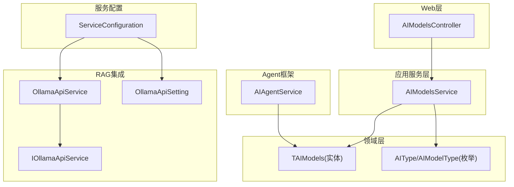
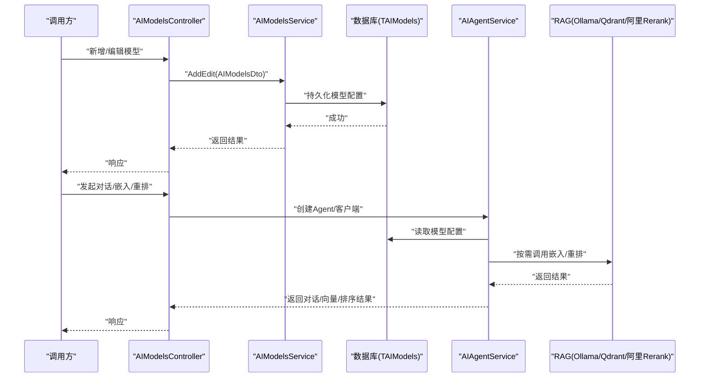
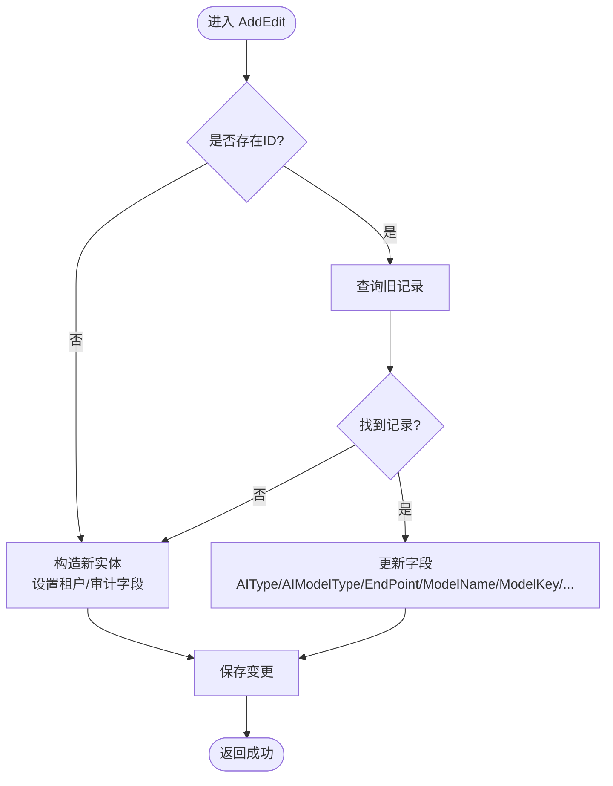
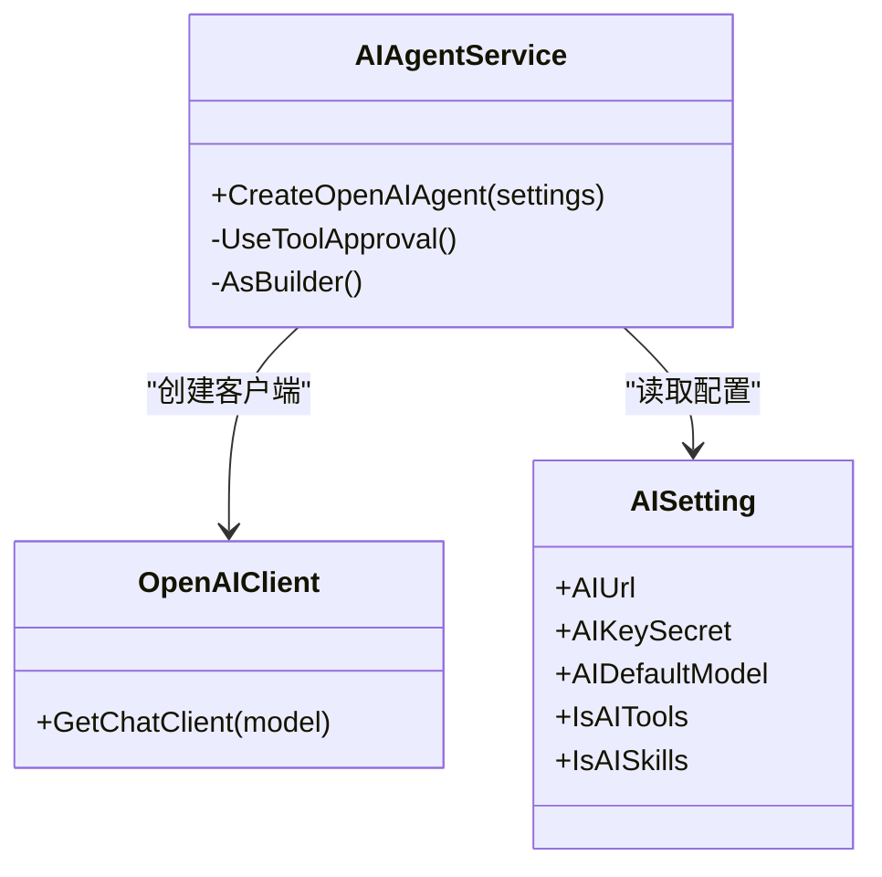
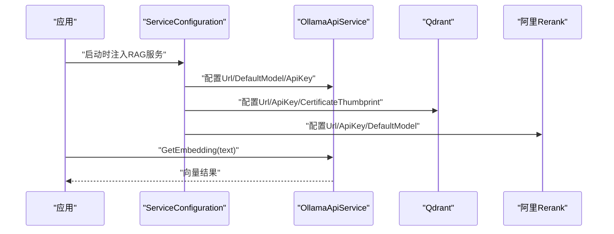
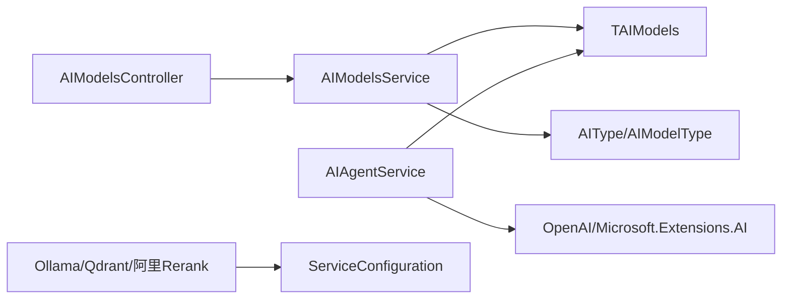

# AI模型管理

<cite>
**本文引用的文件**
- [AIModelsService.cs](file://Kevin/Application/Services/AI/AIModelsService.cs)
- [TAIModels.cs](file://Kevin/Domain/Entities/AI/TAIModels.cs)
- [AIType.cs](file://Kevin/kevin.Share/Enums/AIType.cs)
- [AIModelsController.cs](file://Kevin/Kevin.Web.Basics/Controllers/AI/AIModelsController.cs)
- [AIAgentService.cs](file://Kevin/kevin.Module/kevin.AI.AgentFramework/AIAgentService.cs)
- [OllamaApiService.cs](file://Kevin/kevin.Module/Kevin.RAG/Ollama/OllamaApiService.cs)
- [IOllamaApiService.cs](file://Kevin/kevin.Module/Kevin.RAG/Ollama/IOllamaApiService.cs)
- [OllamaApiSetting.cs](file://Kevin/kevin.Module/Kevin.RAG/Ollama/Models/OllamaApiSetting.cs)
- [ServiceConfiguration.cs](file://Kevin/Kevin.Web.Basics/Extensions/ServiceConfiguration.cs)
- [AIAppsService.cs](file://Kevin/Application/Services/AI/AIAppsService.cs)
</cite>

## 目录
1. [简介](#简介)
2. [项目结构](#项目结构)
3. [核心组件](#核心组件)
4. [架构总览](#架构总览)
5. [详细组件分析](#详细组件分析)
6. [依赖关系分析](#依赖关系分析)
7. [性能与成本优化](#性能与成本优化)
8. [故障排查指南](#故障排查指南)
9. [结论](#结论)
10. [附录：配置示例与最佳实践](#附录配置示例与最佳实践)

## 简介
本模块提供统一的AI模型管理能力，覆盖模型的注册、配置、测试、切换等全生命周期操作。系统支持多种AI提供商（如OpenAI、Azure OpenAI、智谱AI、Bge Embedding/Rerank、Ollama、阿里Rerank等），通过集中化的模型配置表与Agent框架进行统一接入。同时提供向量检索与重排能力（RAG）的集成点，便于构建检索增强生成应用。

## 项目结构
- 领域实体层：定义AI模型配置实体，包含提供商类型、模型类型、端点、密钥、上下文窗口与输出长度等参数。
- 应用服务层：提供模型分页查询、详情获取、新增/编辑、删除等业务能力。
- Web控制器层：对外暴露REST接口，供前端或调用方管理模型。
- Agent框架层：基于Microsoft.Extensions.AI与OpenAI SDK封装，实现多提供商的统一客户端构造与调用。
- RAG集成层：提供Ollama嵌入、Qdrant向量库、阿里重排等服务的配置与客户端注入。

图表来源
- [AIModelsController.cs](file://Kevin/Kevin.Web.Basics/Controllers/AI/AIModelsController.cs)
- [AIModelsService.cs:1-162](file://Kevin/Application/Services/AI/AIModelsService.cs#L1-L162)
- [TAIModels.cs:1-69](file://Kevin/Domain/Entities/AI/TAIModels.cs#L1-L69)
- [AIType.cs:1-39](file://Kevin/kevin.Share/Enums/AIType.cs#L1-L39)
- [AIAgentService.cs:263-289](file://Kevin/kevin.Module/kevin.AI.AgentFramework/AIAgentService.cs#L263-L289)
- [OllamaApiService.cs:1-34](file://Kevin/kevin.Module/Kevin.RAG/Ollama/OllamaApiService.cs#L1-L34)
- [IOllamaApiService.cs:1-14](file://Kevin/kevin.Module/Kevin.RAG/Ollama/IOllamaApiService.cs#L1-L14)
- [OllamaApiSetting.cs:1-10](file://Kevin/kevin.Module/Kevin.RAG/Ollama/Models/OllamaApiSetting.cs#L1-L10)
- [ServiceConfiguration.cs:224-257](file://Kevin/Kevin.Web.Basics/Extensions/ServiceConfiguration.cs#L224-L257)

章节来源
- [AIModelsService.cs:1-162](file://Kevin/Application/Services/AI/AIModelsService.cs#L1-L162)
- [TAIModels.cs:1-69](file://Kevin/Domain/Entities/AI/TAIModels.cs#L1-L69)
- [AIType.cs:1-39](file://Kevin/kevin.Share/Enums/AIType.cs#L1-L39)
- [ServiceConfiguration.cs:224-257](file://Kevin/Kevin.Web.Basics/Extensions/ServiceConfiguration.cs#L224-L257)

## 核心组件
- 模型实体（TAIModels）：承载AI提供商类型、模型类型、端点、密钥、部署名、向量维度、最大提示token数、最大回答token数等关键配置。
- 模型服务（AIModelsService）：提供分页列表、详情、新增/编辑、删除等能力，并维护租户隔离与审计字段。
- 控制器（AIModelsController）：对外暴露模型管理的HTTP接口。
- Agent服务（AIAgentService）：基于统一抽象创建ChatClient，兼容本地与云端模型，支持工具与技能开关。
- RAG集成（Ollama/Qdrant/阿里Rerank）：通过配置项注入客户端，提供嵌入与重排能力。

章节来源
- [TAIModels.cs:1-69](file://Kevin/Domain/Entities/AI/TAIModels.cs#L1-L69)
- [AIModelsService.cs:1-162](file://Kevin/Application/Services/AI/AIModelsService.cs#L1-L162)
- [AIAgentService.cs:263-289](file://Kevin/kevin.Module/kevin.AI.AgentFramework/AIAgentService.cs#L263-L289)
- [OllamaApiService.cs:1-34](file://Kevin/kevin.Module/Kevin.RAG/Ollama/OllamaApiService.cs#L1-L34)
- [ServiceConfiguration.cs:224-257](file://Kevin/Kevin.Web.Basics/Extensions/ServiceConfiguration.cs#L224-L257)

## 架构总览
系统以“配置驱动”的方式统一管理AI模型。业务侧通过AIModelsService读写模型配置；Agent框架根据配置动态构造客户端；RAG模块按配置注入向量与重排服务。

图表来源
- [AIModelsController.cs](file://Kevin/Kevin.Web.Basics/Controllers/AI/AIModelsController.cs)
- [AIModelsService.cs:1-162](file://Kevin/Application/Services/AI/AIModelsService.cs#L1-L162)
- [AIAgentService.cs:263-289](file://Kevin/kevin.Module/kevin.AI.AgentFramework/AIAgentService.cs#L263-L289)
- [OllamaApiService.cs:1-34](file://Kevin/kevin.Module/Kevin.RAG/Ollama/OllamaApiService.cs#L1-L34)
- [ServiceConfiguration.cs:224-257](file://Kevin/Kevin.Web.Basics/Extensions/ServiceConfiguration.cs#L224-L257)

## 详细组件分析

### 模型实体与枚举
- 实体字段说明
  - AIType：选择AI提供商（OpenAI、Azure OpenAI、智谱AI、Bge Embedding/Rerank、Ollama、阿里Rerank等）。
  - AIModelType：模型用途（聊天、嵌入、重排）。
  - EndPoint：模型API地址。
  - ModelKey：API密钥（原生直连可留空）。
  - ModelDescription：部署名（Azure场景使用）。
  - EmbeddingValueSize：向量维度。
  - MaxAskPromptSize：最大提示token数（控制上下文窗口预算）。
  - AnswerTokens：最大回答token数（控制输出长度）。
- 枚举定义
  - AIType与AIModelType用于约束模型类型与用途。

章节来源
- [TAIModels.cs:1-69](file://Kevin/Domain/Entities/AI/TAIModels.cs#L1-L69)
- [AIType.cs:1-39](file://Kevin/kevin.Share/Enums/AIType.cs#L1-L39)

### 模型管理服务（CRUD）
- 功能要点
  - 分页查询：支持按名称模糊搜索，按创建时间倒序，包含创建/更新用户信息。
  - 详情获取：支持权限控制与非权限访问两种模式。
  - 新增/编辑：自动填充租户与审计字段，区分新增与更新路径。
  - 删除：软删除，记录删除时间。
- 数据一致性
  - 使用仓储层事务保存，确保并发安全。
- 错误处理
  - 不存在或已删除时抛出友好异常。

图表来源
- [AIModelsService.cs:82-136](file://Kevin/Application/Services/AI/AIModelsService.cs#L82-L136)

章节来源
- [AIModelsService.cs:16-159](file://Kevin/Application/Services/AI/AIModelsService.cs#L16-L159)

### 控制器（HTTP入口）
- 职责：接收请求、校验参数、调用服务层、返回标准化响应。
- 典型接口：模型分页、详情、新增/编辑、删除。

章节来源
- [AIModelsController.cs](file://Kevin/Kevin.Web.Basics/Controllers/AI/AIModelsController.cs)

### Agent框架与多提供商接入
- 统一客户端构造
  - 基于Microsoft.Extensions.AI与OpenAI SDK，根据配置动态创建ChatClient。
  - 当无密钥（本地模型）时，使用占位凭据避免鉴权失败。
- 工具与技能
  - 可通过选项关闭工具审批与技能加载，满足本地或受限环境需求。
- 与业务集成
  - 业务服务在创建Agent时传入模型端点、默认模型、密钥等参数，完成运行时绑定。

图表来源
- [AIAgentService.cs:263-289](file://Kevin/kevin.Module/kevin.AI.AgentFramework/AIAgentService.cs#L263-L289)
- [AIAppsService.cs:504-531](file://Kevin/Application/Services/AI/AIAppsService.cs#L504-L531)

章节来源
- [AIAgentService.cs:263-289](file://Kevin/kevin.Module/kevin.AI.AgentFramework/AIAgentService.cs#L263-L289)
- [AIAppsService.cs:504-531](file://Kevin/Application/Services/AI/AIAppsService.cs#L504-L531)

### RAG集成（Ollama/向量/重排）
- Ollama嵌入
  - 通过配置注入OllamaApiClient，支持可选ApiKey头。
  - 提供GetEmbedding接口返回向量。
- Qdrant与阿里Rerank
  - 通过ServiceConfiguration集中注入URL、ApiKey、默认模型等配置。
- 配置项
  - OllamaApiSetting：Url、ApiKey、DefaultModel。

图表来源
- [ServiceConfiguration.cs:224-257](file://Kevin/Kevin.Web.Basics/Extensions/ServiceConfiguration.cs#L224-L257)
- [OllamaApiService.cs:1-34](file://Kevin/kevin.Module/Kevin.RAG/Ollama/OllamaApiService.cs#L1-L34)
- [IOllamaApiService.cs:1-14](file://Kevin/kevin.Module/Kevin.RAG/Ollama/IOllamaApiService.cs#L1-L14)
- [OllamaApiSetting.cs:1-10](file://Kevin/kevin.Module/Kevin.RAG/Ollama/Models/OllamaApiSetting.cs#L1-L10)

章节来源
- [ServiceConfiguration.cs:224-257](file://Kevin/Kevin.Web.Basics/Extensions/ServiceConfiguration.cs#L224-L257)
- [OllamaApiService.cs:1-34](file://Kevin/kevin.Module/Kevin.RAG/Ollama/OllamaApiService.cs#L1-L34)
- [IOllamaApiService.cs:1-14](file://Kevin/kevin.Module/Kevin.RAG/Ollama/IOllamaApiService.cs#L1-L14)
- [OllamaApiSetting.cs:1-10](file://Kevin/kevin.Module/Kevin.RAG/Ollama/Models/OllamaApiSetting.cs#L1-L10)

## 依赖关系分析
- 低耦合设计
  - 控制器仅依赖服务层；服务层依赖仓储与实体；Agent框架通过配置解耦具体提供商。
- 外部依赖
  - Microsoft.Extensions.AI、OpenAI SDK、OllamaSharp、Qdrant、阿里Rerank客户端。
- 潜在循环依赖
  - 当前分层清晰，未见直接循环引用。

图表来源
- [AIModelsController.cs](file://Kevin/Kevin.Web.Basics/Controllers/AI/AIModelsController.cs)
- [AIModelsService.cs:1-162](file://Kevin/Application/Services/AI/AIModelsService.cs#L1-L162)
- [TAIModels.cs:1-69](file://Kevin/Domain/Entities/AI/TAIModels.cs#L1-L69)
- [AIType.cs:1-39](file://Kevin/kevin.Share/Enums/AIType.cs#L1-L39)
- [AIAgentService.cs:263-289](file://Kevin/kevin.Module/kevin.AI.AgentFramework/AIAgentService.cs#L263-L289)
- [ServiceConfiguration.cs:224-257](file://Kevin/Kevin.Web.Basics/Extensions/ServiceConfiguration.cs#L224-L257)

章节来源
- [AIModelsService.cs:1-162](file://Kevin/Application/Services/AI/AIModelsService.cs#L1-L162)
- [AIAgentService.cs:263-289](file://Kevin/kevin.Module/kevin.AI.AgentFramework/AIAgentService.cs#L263-L289)
- [ServiceConfiguration.cs:224-257](file://Kevin/Kevin.Web.Basics/Extensions/ServiceConfiguration.cs#L224-L257)

## 性能与成本优化
- Token预算控制
  - 通过MaxAskPromptSize限制上下文总量，避免超出模型窗口导致截断或报错。
  - 通过AnswerTokens限制输出长度，减少不必要的长文本生成，降低Token消耗。
- 向量维度
  - EmbeddingValueSize需与下游向量库匹配，避免维度不匹配导致的召回质量下降。
- 缓存与批处理
  - 对高频短文本嵌入建议引入缓存；批量调用嵌入/重排接口以降低网络开销。
- 重试与超时
  - 为外部API调用增加重试与超时策略，提升稳定性。
- 监控与统计
  - 建议在Agent层埋点记录每次调用的模型、Token用量、耗时、错误码，便于成本分析与容量规划。

[本节为通用指导，无需特定文件来源]

## 故障排查指南
- 常见错误
  - 模型不存在或已删除：检查ID有效性及软删除状态。
  - 密钥无效或为空：确认ModelKey与EndPoint配置正确；本地模型可留空或使用占位凭据。
  - 上下文溢出：调整MaxAskPromptSize或缩短历史消息。
  - 输出过长：降低AnswerTokens或启用流式输出。
- 定位方法
  - 查看日志中的异常堆栈与HTTP状态码。
  - 核对ServiceConfiguration中RAG相关配置是否生效。
  - 验证Ollama/Qdrant/阿里Rerank连通性与认证头。

章节来源
- [AIModelsService.cs:45-68](file://Kevin/Application/Services/AI/AIModelsService.cs#L45-L68)
- [AIAgentService.cs:281-289](file://Kevin/kevin.Module/kevin.AI.AgentFramework/AIAgentService.cs#L281-L289)
- [OllamaApiService.cs:18-34](file://Kevin/kevin.Module/Kevin.RAG/Ollama/OllamaApiService.cs#L18-L34)

## 结论
本模块通过统一的模型配置与Agent框架，实现了多AI提供商的灵活接入与切换。结合RAG能力，可快速构建检索增强型应用。建议在生产环境中完善监控、限流与成本核算，持续优化模型参数与调用策略。

[本节为总结性内容，无需特定文件来源]

## 附录：配置示例与最佳实践
- 模型注册与切换流程
  - 在控制器或服务层调用新增/编辑接口，填写AIType、AIModelType、EndPoint、ModelKey、部署名、向量维度、上下文与输出长度等。
  - 在Agent创建时传入对应模型端点与默认模型，完成运行时切换。
- 不同提供商接入要点
  - OpenAI/Azure OpenAI：配置EndPoint与ModelKey；Azure场景需设置部署名。
  - 智谱AI：按平台要求配置EndPoint与密钥。
  - Bge Embedding/Rerank：设置向量维度与端点。
  - Ollama：本地或私有部署，可配置Url与可选ApiKey；默认模型需在配置中指定。
  - 阿里Rerank：配置Url、ApiKey与默认模型。
- 参数调优建议
  - MaxAskPromptSize：根据业务对话长度与模型窗口合理设置，避免频繁截断。
  - AnswerTokens：按任务复杂度设定上限，必要时启用流式输出。
  - EmbeddingValueSize：与向量库一致，保证相似度计算准确性。
- 安全与合规
  - 密钥管理：建议使用环境变量或密钥管理服务，避免硬编码。
  - 访问控制：结合租户隔离与权限校验，限制模型配置可见范围。
- 监控与成本
  - 记录每次调用的模型、Token用量、耗时、错误率，形成看板。
  - 对高成本模型设置配额与熔断策略，防止滥用。

[本节为概念性指导，无需特定文件来源]