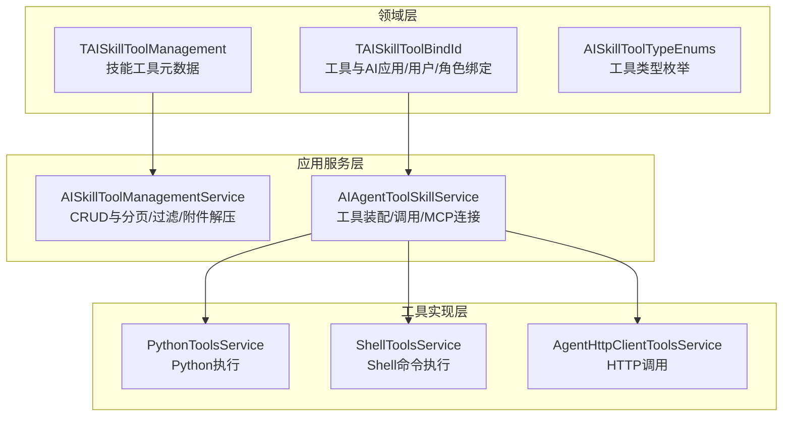
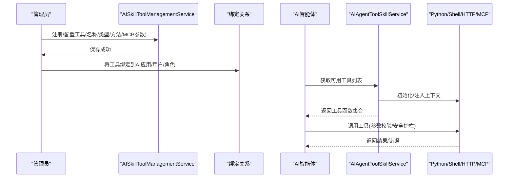
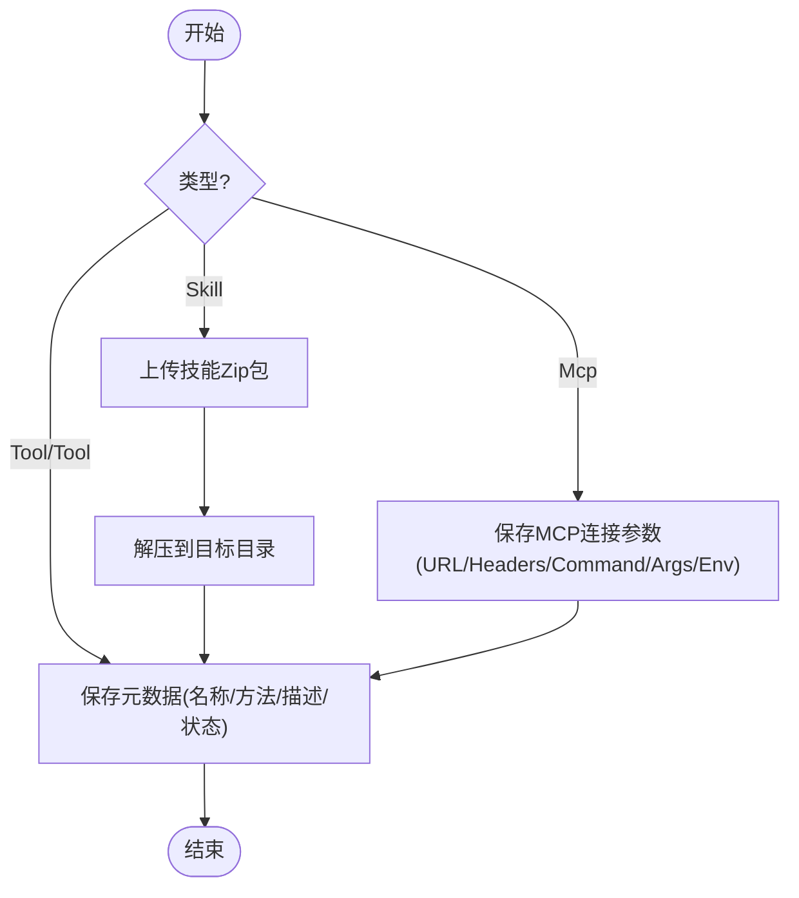
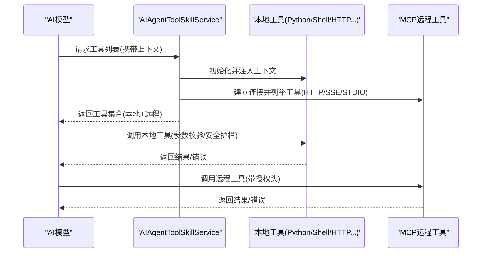
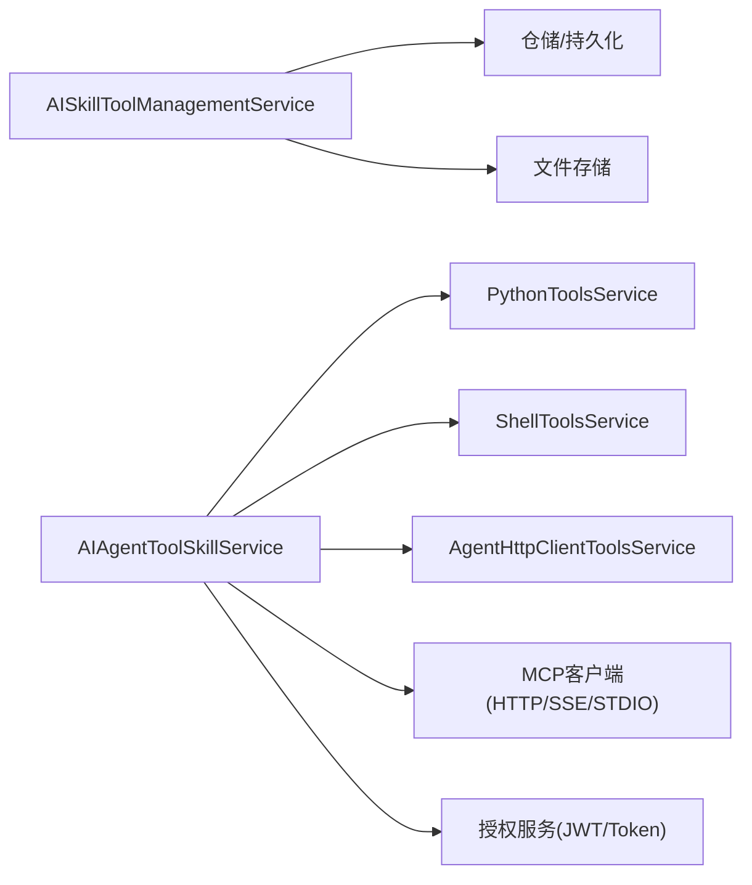

# 技能工具管理

<cite>
**本文引用的文件**
- [AISkillToolManagementService.cs](file://Kevin/Application/Services/AI/AISkillToolManagementService.cs)
- [AIAgentToolSkillService.cs](file://Kevin/Application/Services/AI/AIAgentToolSkillService.cs)
- [TAISkillToolManagement.cs](file://Kevin/Domain/Entities/AI/TAISkillToolManagement.cs)
- [TAISkillToolBindId.cs](file://Kevin/Domain/Entities/AI/TAISkillToolBindId.cs)
- [AISkillToolTypeEnums.cs](file://Kevin/kevin.Share/Enums/AISkillToolTypeEnums.cs)
- [IPythonToolsService.cs](file://Kevin/kevin.Module/kevin.AI.AgentFramework/Interfaces/Tools/IPythonToolsService.cs)
- [PythonToolsService.cs](file://Kevin/kevin.Module/kevin.AI.AgentFramework/Tools/PythonToolsService.cs)
- [ShellToolsService.cs](file://Kevin/kevin.Module/kevin.AI.AgentFramework/Tools/ShellToolsService.cs)
- [IAgentHttpClientToolsService.cs](file://Kevin/kevin.Module/kevin.AI.AgentFramework/Interfaces/Tools/IAgentHttpClientToolsService.cs)
- [AgentHttpClientToolsService.cs](file://Kevin/kevin.Module/kevin.AI.AgentFramework/Tools/AgentHttpClientToolsService.cs)
</cite>

## 目录
1. [简介](#简介)
2. [项目结构](#项目结构)
3. [核心组件](#核心组件)
4. [架构总览](#架构总览)
5. [详细组件分析](#详细组件分析)
6. [依赖关系分析](#依赖关系分析)
7. [性能考虑](#性能考虑)
8. [故障排查指南](#故障排查指南)
9. [结论](#结论)
10. [附录](#附录)

## 简介
本章节面向“技能工具管理”功能，覆盖工具的注册、配置、调用与监控全生命周期。重点说明：
- 工具类型定义与分类（内置工具、技能包、MCP远程工具）
- 参数校验、返回值处理与错误处理机制
- Python脚本执行、HTTP请求调用、数据库操作等能力集成
- 自定义工具开发指南与集成示例
- 技能工具与AI应用的绑定关系、执行环境与安全控制

## 项目结构
围绕技能工具管理的代码主要分布在以下层次：
- 领域实体层：定义技能工具元数据及绑定关系
- 应用服务层：提供工具增删改查、列表查询、与AI智能体的装配与调用
- 工具实现层：封装Python执行、Shell命令、HTTP客户端、消息、文件、记忆等具体能力
- 枚举与DTO：统一类型与数据传输契约

图表来源
- [TAISkillToolManagement.cs:1-93](file://Kevin/Domain/Entities/AI/TAISkillToolManagement.cs#L1-L93)
- [TAISkillToolBindId.cs:1-25](file://Kevin/Domain/Entities/AI/TAISkillToolBindId.cs#L1-L25)
- [AISkillToolTypeEnums.cs:1-10](file://Kevin/kevin.Share/Enums/AISkillToolTypeEnums.cs#L1-L10)
- [AISkillToolManagementService.cs:1-254](file://Kevin/Application/Services/AI/AISkillToolManagementService.cs#L1-L254)
- [AIAgentToolSkillService.cs:1-490](file://Kevin/Application/Services/AI/AIAgentToolSkillService.cs#L1-L490)

章节来源
- [AISkillToolManagementService.cs:29-58](file://Kevin/Application/Services/AI/AISkillToolManagementService.cs#L29-L58)
- [AISkillToolManagementService.cs:76-173](file://Kevin/Application/Services/AI/AISkillToolManagementService.cs#L76-L173)
- [AIAgentToolSkillService.cs:73-301](file://Kevin/Application/Services/AI/AIAgentToolSkillService.cs#L73-L301)
- [AIAgentToolSkillService.cs:303-436](file://Kevin/Application/Services/AI/AIAgentToolSkillService.cs#L303-L436)

## 核心组件
- 技能工具管理实体：承载名称、方法标识、描述、是否系统内置、启用状态、类型（工具/技能/MCP）、MCP连接参数（URL/Headers/Command/Arguments/Environment）
- 绑定关系实体：将技能工具与AI应用、用户或角色进行关联
- 管理服务：提供分页查询、按类型筛选、新增/编辑（含技能包上传与解压）、删除（软删除）、获取全部/受控列表
- 工具装配服务：根据AI智能体绑定的工具清单，动态组装可被AI调用的函数；支持本地工具与MCP远程工具；注入上下文数据并初始化各工具

章节来源
- [TAISkillToolManagement.cs:12-87](file://Kevin/Domain/Entities/AI/TAISkillToolManagement.cs#L12-L87)
- [TAISkillToolBindId.cs:10-22](file://Kevin/Domain/Entities/AI/TAISkillToolBindId.cs#L10-L22)
- [AISkillToolManagementService.cs:29-251](file://Kevin/Application/Services/AI/AISkillToolManagementService.cs#L29-L251)
- [AIAgentToolSkillService.cs:73-487](file://Kevin/Application/Services/AI/AIAgentToolSkillService.cs#L73-L487)

## 架构总览
技能工具在系统中的流转路径如下：
- 管理员通过管理服务注册/配置工具（包含类型、方法标识、MCP连接信息、启用状态）
- AI智能体通过绑定关系选择可用工具
- 运行时由工具装配服务根据绑定清单加载本地工具与MCP远程工具，形成AI可调用的函数集合
- AI调用时，工具执行器负责参数校验、安全护栏、日志记录与结果返回

图表来源
- [AISkillToolManagementService.cs:76-173](file://Kevin/Application/Services/AI/AISkillToolManagementService.cs#L76-L173)
- [AIAgentToolSkillService.cs:73-301](file://Kevin/Application/Services/AI/AIAgentToolSkillService.cs#L73-L301)
- [AIAgentToolSkillService.cs:303-436](file://Kevin/Application/Services/AI/AIAgentToolSkillService.cs#L303-L436)

## 详细组件分析

### 组件一：技能工具管理（注册/配置/生命周期）
- 类型定义：支持三种类型——工具（Tool）、技能（Skill）、MCP（远程工具）
- 注册与配置：
  - 新增/编辑：校验名称唯一性；区分系统内置工具不可修改/删除；技能类型需上传并解压技能包
  - 删除：软删除，同时清理已解压的技能包目录
- 查询：
  - 分页与搜索：支持关键字、类型过滤、创建/更新时间排序
  - 权限控制：部分接口受数据权限控制，另有不受权限控制的列表用于系统管理员场景
- 附件处理：技能包以Zip形式存储，保存时自动解压至指定目录，删除时清理目录

图表来源
- [AISkillToolManagementService.cs:76-173](file://Kevin/Application/Services/AI/AISkillToolManagementService.cs#L76-L173)
- [AISkillToolManagementService.cs:178-206](file://Kevin/Application/Services/AI/AISkillToolManagementService.cs#L178-L206)
- [AISkillToolManagementService.cs:29-58](file://Kevin/Application/Services/AI/AISkillToolManagementService.cs#L29-L58)

章节来源
- [AISkillToolManagementService.cs:29-58](file://Kevin/Application/Services/AI/AISkillToolManagementService.cs#L29-L58)
- [AISkillToolManagementService.cs:76-173](file://Kevin/Application/Services/AI/AISkillToolManagementService.cs#L76-L173)
- [AISkillToolManagementService.cs:178-206](file://Kevin/Application/Services/AI/AISkillToolManagementService.cs#L178-L206)
- [AISkillToolManagementService.cs:208-251](file://Kevin/Application/Services/AI/AISkillToolManagementService.cs#L208-L251)

### 组件二：AI工具装配与调用（运行期）
- 工具装配：
  - 根据AI智能体绑定的工具ID，拉取工具清单
  - 将本地工具（Python/Shell/HTTP/消息/文件/任务/搜索/记忆等）与MCP远程工具合并为AI可调用的函数集合
  - 为所有工具注入上下文数据（如当前用户、租户、任务数据等），保证执行环境一致
- MCP远程工具：
  - 支持HTTP/HTTPS（流式HTTP）、SSE、STDIO三种传输模式
  - 自动注入Authorization头（优先从请求头/查询串获取，否则根据UserId/TenantId生成Token）
  - 建立MCP客户端后列出远程工具并加入集合；失败时释放资源并继续处理其他MCP
- 调用流程：
  - AI模型选择工具并传入参数
  - 工具执行器进行参数校验、安全护栏（如命令白名单、输出截断、超时控制）
  - 返回结构化结果或错误信息（错误通常以特定前缀提示）

图表来源
- [AIAgentToolSkillService.cs:73-301](file://Kevin/Application/Services/AI/AIAgentToolSkillService.cs#L73-L301)
- [AIAgentToolSkillService.cs:303-436](file://Kevin/Application/Services/AI/AIAgentToolSkillService.cs#L303-L436)

章节来源
- [AIAgentToolSkillService.cs:73-301](file://Kevin/Application/Services/AI/AIAgentToolSkillService.cs#L73-L301)
- [AIAgentToolSkillService.cs:303-436](file://Kevin/Application/Services/AI/AIAgentToolSkillService.cs#L303-L436)
- [AIAgentToolSkillService.cs:438-487](file://Kevin/Application/Services/AI/AIAgentToolSkillService.cs#L438-L487)

### 组件三：Python脚本执行工具
- 职责：在隔离环境中执行Python代码，返回执行结果或错误信息
- 安全护栏：建议结合命令/输入白名单、资源限制、超时控制与输出截断
- 集成方式：作为本地工具之一，由工具装配服务注入上下文后暴露给AI调用

章节来源
- [IPythonToolsService.cs](file://Kevin/kevin.Module/kevin.AI.AgentFramework/Interfaces/Tools/IPythonToolsService.cs)
- [PythonToolsService.cs](file://Kevin/kevin.Module/kevin.AI.AgentFramework/Tools/PythonToolsService.cs)
- [AIAgentToolSkillService.cs:189-199](file://Kevin/Application/Services/AI/AIAgentToolSkillService.cs#L189-L199)

### 组件四：Shell命令执行工具
- 职责：通过操作系统原生Shell执行命令（Windows cmd/bash，Linux/Mac bash）
- 安全护栏：危险命令阻止、输出截断（例如50KB）、超时控制（例如60秒）
- 集成方式：由工具装配服务注入上下文后暴露给AI调用

章节来源
- [ShellToolsService.cs](file://Kevin/kevin.Module/kevin.AI.AgentFramework/Tools/ShellToolsService.cs)
- [AIAgentToolSkillService.cs:180-189](file://Kevin/Application/Services/AI/AIAgentToolSkillService.cs#L180-L189)

### 组件五：HTTP请求调用工具
- 职责：通用HTTP客户端，支持GET/POST/PUT/DELETE等方法
- 安全护栏：建议对目标域名/路径进行白名单校验，限制重定向与响应大小
- 集成方式：由工具装配服务注入上下文后暴露给AI调用

章节来源
- [IAgentHttpClientToolsService.cs](file://Kevin/kevin.Module/kevin.AI.AgentFramework/Interfaces/Tools/IAgentHttpClientToolsService.cs)
- [AgentHttpClientToolsService.cs](file://Kevin/kevin.Module/kevin.AI.AgentFramework/Tools/AgentHttpClientToolsService.cs)
- [AIAgentToolSkillService.cs:134-179](file://Kevin/Application/Services/AI/AIAgentToolSkillService.cs#L134-L179)

### 组件六：MCP远程工具（HTTP/SSE/STDIO）
- 传输模式：
  - HTTP/HTTPS：使用流式HTTP传输
  - SSE：Server-Sent Events
  - STDIO：本地进程标准输入输出，支持命令行参数与环境变量
- 授权注入：自动注入Authorization头，优先从请求头/查询串获取，否则基于UserId/TenantId生成Token
- 工具发现：建立MCP客户端后调用ListTools获取远程工具并加入集合

章节来源
- [AIAgentToolSkillService.cs:303-436](file://Kevin/Application/Services/AI/AIAgentToolSkillService.cs#L303-L436)

### 组件七：技能工具与AI应用绑定
- 绑定实体：将技能工具与AI应用、用户或角色进行关联
- 装配逻辑：根据绑定关系拉取工具清单，分别加载本地工具与MCP远程工具
- 权限控制：提供受数据权限控制与不受权限控制的查询接口，适配不同角色场景

章节来源
- [TAISkillToolBindId.cs:10-22](file://Kevin/Domain/Entities/AI/TAISkillToolBindId.cs#L10-L22)
- [AIAgentToolSkillService.cs:438-487](file://Kevin/Application/Services/AI/AIAgentToolSkillService.cs#L438-L487)
- [AISkillToolManagementService.cs:208-251](file://Kevin/Application/Services/AI/AISkillToolManagementService.cs#L208-L251)

## 依赖关系分析
- 低耦合高内聚：管理服务专注元数据与附件处理；工具装配服务专注运行时装配与调用；具体工具实现独立封装
- 外部依赖：
  - 文件存储：技能包下载与解压
  - 认证与授权：JWT校验、Token生成
  - MCP协议：HTTP/SSE/STDIO传输
- 潜在循环依赖：通过接口解耦，避免直接循环引用

图表来源
- [AISkillToolManagementService.cs:1-254](file://Kevin/Application/Services/AI/AISkillToolManagementService.cs#L1-L254)
- [AIAgentToolSkillService.cs:1-490](file://Kevin/Application/Services/AI/AIAgentToolSkillService.cs#L1-L490)

章节来源
- [AISkillToolManagementService.cs:1-254](file://Kevin/Application/Services/AI/AISkillToolManagementService.cs#L1-L254)
- [AIAgentToolSkillService.cs:1-490](file://Kevin/Application/Services/AI/AIAgentToolSkillService.cs#L1-L490)

## 性能考虑
- 分页与懒加载：列表查询采用分页与延迟加载，减少内存占用
- 并发与连接池：MCP客户端按需创建，失败时及时释放，避免连接泄漏
- I/O优化：技能包解压仅在保存时执行，删除时清理目录，避免冗余磁盘占用
- 超时与限流：Shell/Python执行设置超时与输出截断，防止长耗时任务阻塞
- 缓存策略：可考虑对常用工具清单进行短期缓存，降低重复装配开销

[本节为通用指导，不直接分析具体文件]

## 故障排查指南
- 工具名称冲突：新增/编辑时若名称已存在且非同一记录，将抛出友好异常提示
- 系统内置工具保护：系统内置工具不允许修改或删除，避免破坏系统能力
- 技能包缺失：技能类型必须上传Zip包，否则保存失败
- MCP连接失败：检查URL/Headers/Command/Arguments/Environment是否正确；失败时记录错误并继续处理其他MCP
- 授权问题：确保Authorization头有效；若无则根据UserId/TenantId生成Token
- 执行超时/输出过大：Shell/Python工具具备超时与输出截断，遇到异常请检查命令与输入

章节来源
- [AISkillToolManagementService.cs:76-173](file://Kevin/Application/Services/AI/AISkillToolManagementService.cs#L76-L173)
- [AISkillToolManagementService.cs:178-206](file://Kevin/Application/Services/AI/AISkillToolManagementService.cs#L178-L206)
- [AIAgentToolSkillService.cs:303-436](file://Kevin/Application/Services/AI/AIAgentToolSkillService.cs#L303-L436)

## 结论
技能工具管理提供了完整的工具生命周期管理能力：从注册配置、类型约束、权限控制，到运行期的动态装配与调用，以及MCP远程工具的灵活接入。通过安全护栏与标准化错误处理，保障了AI应用在复杂环境下的稳定执行。建议在生产环境中结合白名单、超时、输出截断与审计日志，进一步提升安全性与可观测性。

[本节为总结性内容，不直接分析具体文件]

## 附录

### 工具类型与字段说明
- 工具类型：
  - Tool：本地工具，通过方法标识装配
  - Skill：技能包，需上传Zip并解压
  - Mcp：远程工具，通过HTTP/SSE/STDIO连接
- 关键字段：
  - Name：工具名称（必填）
  - ClassMethod：方法标识（用于本地工具装配）
  - Description：描述
  - IsSystem：是否系统内置（系统内置不可修改/删除）
  - ActiveStatus：启用状态
  - McpUrl/McpType/McpHeaders/McpCommand/McpArguments/McpEnvironment：MCP连接参数

章节来源
- [TAISkillToolManagement.cs:12-87](file://Kevin/Domain/Entities/AI/TAISkillToolManagement.cs#L12-L87)
- [AISkillToolTypeEnums.cs:1-10](file://Kevin/kevin.Share/Enums/AISkillToolTypeEnums.cs#L1-L10)

### 自定义工具开发指南
- 本地工具（Python/Shell/HTTP等）：
  - 实现对应服务接口，遵循参数校验与安全护栏规范
  - 在工具装配服务中注册方法标识，供AI调用
- MCP远程工具：
  - 提供HTTP/SSE/STDIO端点，支持工具列举
  - 在技能工具管理中配置MCP连接参数，系统自动注入授权头
- 集成步骤：
  - 定义工具元数据（名称/类型/方法标识/MCP参数）
  - 实现工具逻辑（参数校验/业务处理/错误处理）
  - 在装配服务中暴露为AI可调用的函数
  - 通过绑定关系将工具授予AI应用/用户/角色

章节来源
- [AIAgentToolSkillService.cs:73-301](file://Kevin/Application/Services/AI/AIAgentToolSkillService.cs#L73-L301)
- [AIAgentToolSkillService.cs:303-436](file://Kevin/Application/Services/AI/AIAgentToolSkillService.cs#L303-L436)
- [TAISkillToolBindId.cs:10-22](file://Kevin/Domain/Entities/AI/TAISkillToolBindId.cs#L10-L22)