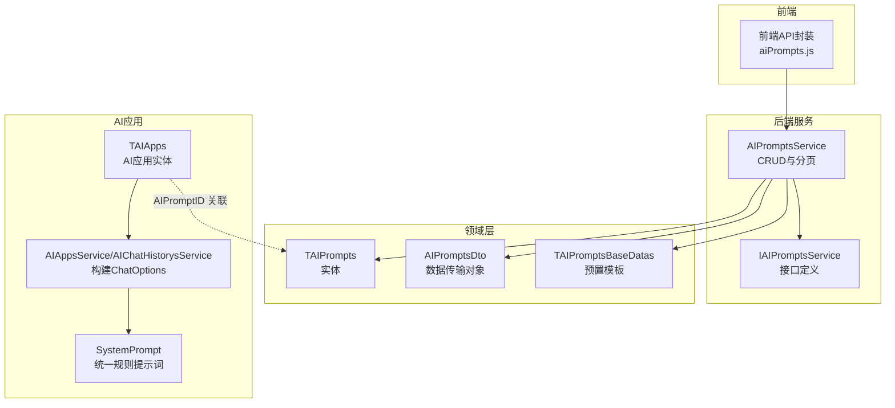
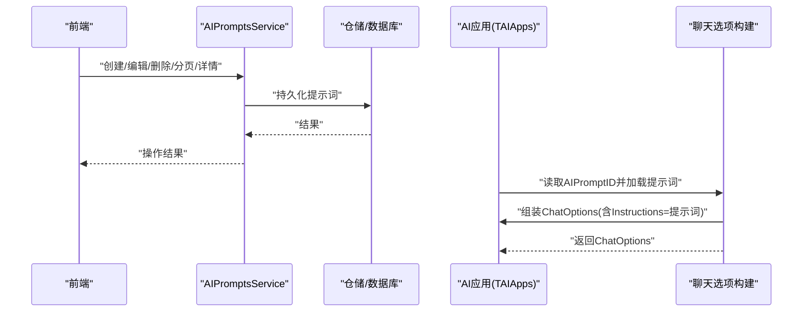
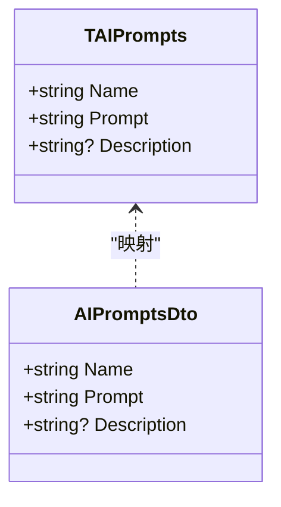
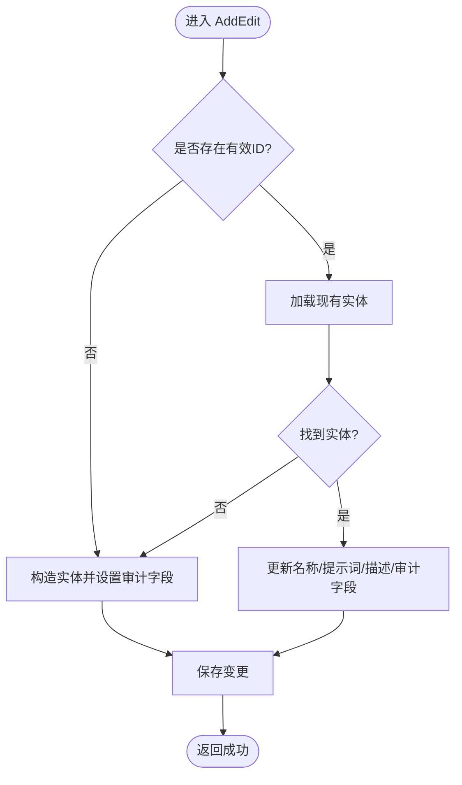
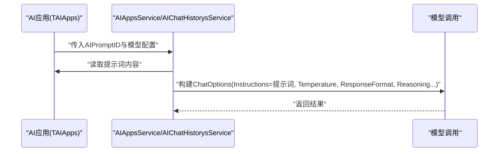
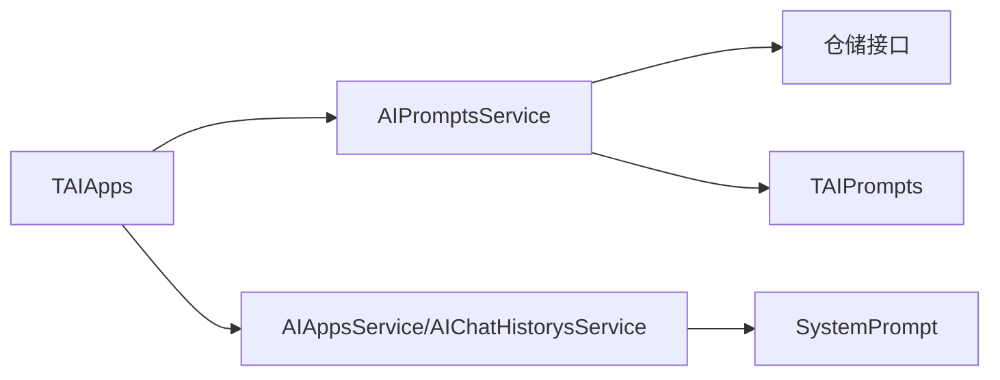

# 提示词管理

<cite>
**本文引用的文件**
- [AIPromptsService.cs](file://Kevin/Application/Services/AI/AIPromptsService.cs)
- [TAIPrompts.cs](file://Kevin/Domain/Entities/AI/TAIPrompts.cs)
- [AIPromptsDto.cs](file://Kevin/kevin.Share/Dtos/AI/AIPromptsDto.cs)
- [IAIPromptsService.cs](file://Kevin/Domain/Interfaces/IServices/AI/IAIPromptsService.cs)
- [TAIPromptsBaseDatas.cs](file://Kevin/Domain/BaseDatas/TAIPromptsBaseDatas.cs)
- [SystemPrompt.cs](file://Kevin/kevin.Module/kevin.AI.AgentFramework/Const/SystemPrompt.cs)
- [AIAppsService.cs](file://Kevin/Application/Services/AI/AIAppsService.cs)
- [AIChatHistorysService.cs](file://Kevin/Application/Services/AI/AIChatHistorysService.cs)
- [TAIApps.cs](file://Kevin/Domain/Entities/AI/TAIApps.cs)
- [aiPrompts.js](file://vue/kevin.web.vue/src/api/ai/aiPrompts.js)
</cite>

## 目录
1. [简介](#简介)
2. [项目结构](#项目结构)
3. [核心组件](#核心组件)
4. [架构总览](#架构总览)
5. [详细组件分析](#详细组件分析)
6. [依赖关系分析](#依赖关系分析)
7. [性能与容量规划](#性能与容量规划)
8. [故障排查指南](#故障排查指南)
9. [结论](#结论)
10. [附录：模板、变量与最佳实践](#附录模板变量与最佳实践)

## 简介
本章节面向“提示词管理”能力，覆盖提示词的创建、编辑、删除、列表查询、详情获取，以及与AI应用（智能体）的关联绑定、权限控制、使用统计等管理特性。同时说明提示词在系统中的作用、与模型调用参数的组合方式，以及优化评估与A/B测试的实践建议。

## 项目结构
围绕提示词管理的代码分布在领域实体、服务层、DTO、基础数据初始化、控制器前端API封装等位置，形成清晰的分层结构：
- 领域实体：定义提示词的数据结构与字段约束
- 服务接口与实现：提供CRUD、分页、批量获取等能力
- DTO：对外传输对象，包含名称、提示词内容、描述等
- 基础数据：预置常用提示词模板，便于快速启用
- 应用配置：AI应用可绑定提示词ID，并在构建聊天选项时注入为系统指令
- 前端API：封装对后端提示词接口的调用

图表来源
- [AIPromptsService.cs:15-152](file://Kevin/Application/Services/AI/AIPromptsService.cs#L15-L152)
- [TAIPrompts.cs:1-32](file://Kevin/Domain/Entities/AI/TAIPrompts.cs#L1-L32)
- [AIPromptsDto.cs:1-27](file://Kevin/kevin.Share/Dtos/AI/AIPromptsDto.cs#L1-L27)
- [TAIPromptsBaseDatas.cs:1-73](file://Kevin/Domain/BaseDatas/TAIPromptsBaseDatas.cs#L1-L73)
- [TAIApps.cs:80-90](file://Kevin/Domain/Entities/AI/TAIApps.cs#L80-L90)
- [AIAppsService.cs:321-355](file://Kevin/Application/Services/AI/AIAppsService.cs#L321-L355)
- [AIChatHistorysService.cs:427-471](file://Kevin/Application/Services/AI/AIChatHistorysService.cs#L427-L471)
- [SystemPrompt.cs:1-13](file://Kevin/kevin.Module/kevin.AI.AgentFramework/Const/SystemPrompt.cs#L1-L13)

章节来源
- [AIPromptsService.cs:15-152](file://Kevin/Application/Services/AI/AIPromptsService.cs#L15-L152)
- [TAIPrompts.cs:1-32](file://Kevin/Domain/Entities/AI/TAIPrompts.cs#L1-L32)
- [AIPromptsDto.cs:1-27](file://Kevin/kevin.Share/Dtos/AI/AIPromptsDto.cs#L1-L27)
- [TAIPromptsBaseDatas.cs:1-73](file://Kevin/Domain/BaseDatas/TAIPromptsBaseDatas.cs#L1-L73)
- [TAIApps.cs:80-90](file://Kevin/Domain/Entities/AI/TAIApps.cs#L80-L90)
- [AIAppsService.cs:321-355](file://Kevin/Application/Services/AI/AIAppsService.cs#L321-L355)
- [AIChatHistorysService.cs:427-471](file://Kevin/Application/Services/AI/AIChatHistorysService.cs#L427-L471)
- [SystemPrompt.cs:1-13](file://Kevin/kevin.Module/kevin.AI.AgentFramework/Const/SystemPrompt.cs#L1-L13)

## 核心组件
- 提示词实体 TAIPrompts：包含名称、提示词内容、描述等字段，用于持久化存储提示词模板
- 提示词服务 AIPromptsService：提供分页查询、详情获取、新增/编辑、删除、全量列表等能力；支持按租户隔离与软删除
- 数据传输对象 AIPromptsDto：承载前端提交或返回的提示词信息
- 基础数据 TAIPromptsBaseDatas：预置若干高质量提示词模板，便于快速启用
- AI应用 TAIApps：通过 AIPromptID 字段关联提示词，作为系统指令注入到模型调用中
- 聊天选项构建：AIAppsService/AIChatHistorysService 将提示词与温度、输出格式、思考能力等参数组合为 ChatOptions

章节来源
- [TAIPrompts.cs:1-32](file://Kevin/Domain/Entities/AI/TAIPrompts.cs#L1-L32)
- [AIPromptsService.cs:15-152](file://Kevin/Application/Services/AI/AIPromptsService.cs#L15-L152)
- [AIPromptsDto.cs:1-27](file://Kevin/kevin.Share/Dtos/AI/AIPromptsDto.cs#L1-L27)
- [TAIPromptsBaseDatas.cs:1-73](file://Kevin/Domain/BaseDatas/TAIPromptsBaseDatas.cs#L1-L73)
- [TAIApps.cs:80-90](file://Kevin/Domain/Entities/AI/TAIApps.cs#L80-L90)
- [AIAppsService.cs:321-355](file://Kevin/Application/Services/AI/AIAppsService.cs#L321-L355)
- [AIChatHistorysService.cs:427-471](file://Kevin/Application/Services/AI/AIChatHistorysService.cs#L427-L471)

## 架构总览
提示词管理在系统中承担“系统级指令”的来源角色。AI应用在运行时通过 ChatOptions 的 Instructions 字段注入提示词，从而指导模型行为。系统还提供统一的系统规则提示词，确保安全性与一致性。

图表来源
- [AIPromptsService.cs:15-152](file://Kevin/Application/Services/AI/AIPromptsService.cs#L15-L152)
- [TAIApps.cs:80-90](file://Kevin/Domain/Entities/AI/TAIApps.cs#L80-L90)
- [AIAppsService.cs:321-355](file://Kevin/Application/Services/AI/AIAppsService.cs#L321-L355)
- [AIChatHistorysService.cs:427-471](file://Kevin/Application/Services/AI/AIChatHistorysService.cs#L427-L471)

## 详细组件分析

### 提示词实体与数据传输对象
- TAIPrompts：定义提示词的核心字段（名称、提示词内容、描述），继承通用基类以具备审计字段（创建/更新时间、用户、租户等）
- AIPromptsDto：对外暴露的DTO，包含名称、提示词内容与描述，长度校验与必填约束保障输入质量

图表来源
- [TAIPrompts.cs:1-32](file://Kevin/Domain/Entities/AI/TAIPrompts.cs#L1-L32)
- [AIPromptsDto.cs:1-27](file://Kevin/kevin.Share/Dtos/AI/AIPromptsDto.cs#L1-L27)

章节来源
- [TAIPrompts.cs:1-32](file://Kevin/Domain/Entities/AI/TAIPrompts.cs#L1-L32)
- [AIPromptsDto.cs:1-27](file://Kevin/kevin.Share/Dtos/AI/AIPromptsDto.cs#L1-L27)

### 提示词服务（CRUD与分页）
- 分页查询：支持按租户过滤、关键词搜索、排序与分页
- 详情获取：支持带权限与不带权限两种模式
- 新增/编辑：根据是否存在ID判断新增或更新，自动填充审计信息与租户
- 删除：软删除，记录删除时间与用户

图表来源
- [AIPromptsService.cs:81-129](file://Kevin/Application/Services/AI/AIPromptsService.cs#L81-L129)

章节来源
- [AIPromptsService.cs:15-152](file://Kevin/Application/Services/AI/AIPromptsService.cs#L15-L152)

### 预置提示词模板
- 系统内置若干高质量提示词模板，如“AI工具智能体提示词”、“Python数据分析专家”，可直接启用或二次定制
- 这些模板通过基础数据初始化，便于新环境快速具备可用能力

章节来源
- [TAIPromptsBaseDatas.cs:1-73](file://Kevin/Domain/BaseDatas/TAIPromptsBaseDatas.cs#L1-L73)

### 提示词与AI应用的关联与注入
- TAIApps 实体包含 AIPromptID 字段，用于绑定具体提示词
- 在构建聊天选项时，系统将提示词内容注入为 Instructions，与温度、输出格式、思考能力等参数共同决定模型行为
- 同时，系统提供统一规则提示词 SystemPrompt，用于强化安全与边界控制

图表来源
- [TAIApps.cs:80-90](file://Kevin/Domain/Entities/AI/TAIApps.cs#L80-L90)
- [AIAppsService.cs:321-355](file://Kevin/Application/Services/AI/AIAppsService.cs#L321-L355)
- [AIChatHistorysService.cs:427-471](file://Kevin/Application/Services/AI/AIChatHistorysService.cs#L427-L471)
- [SystemPrompt.cs:1-13](file://Kevin/kevin.Module/kevin.AI.AgentFramework/Const/SystemPrompt.cs#L1-L13)

章节来源
- [TAIApps.cs:80-90](file://Kevin/Domain/Entities/AI/TAIApps.cs#L80-L90)
- [AIAppsService.cs:321-355](file://Kevin/Application/Services/AI/AIAppsService.cs#L321-L355)
- [AIChatHistorysService.cs:427-471](file://Kevin/Application/Services/AI/AIChatHistorysService.cs#L427-L471)
- [SystemPrompt.cs:1-13](file://Kevin/kevin.Module/kevin.AI.AgentFramework/Const/SystemPrompt.cs#L1-L13)

### 前端API封装
- 提供获取分页、新增/编辑、删除、获取全部列表等接口封装，便于页面集成

章节来源
- [aiPrompts.js:1-14](file://vue/kevin.web.vue/src/api/ai/aiPrompts.js#L1-L14)

## 依赖关系分析
- AIPromptsService 依赖仓储接口进行数据访问，遵循租户隔离与权限控制
- TAIApps 通过 AIPromptID 与 TAIPrompts 建立一对多或一对一的关联（取决于业务设计）
- 聊天选项构建逻辑依赖 AIAppsService/AIChatHistorysService，将提示词与模型参数组合
- 统一规则提示词 SystemPrompt 作为系统级安全策略被引用

图表来源
- [AIPromptsService.cs:15-152](file://Kevin/Application/Services/AI/AIPromptsService.cs#L15-L152)
- [TAIApps.cs:80-90](file://Kevin/Domain/Entities/AI/TAIApps.cs#L80-L90)
- [AIAppsService.cs:321-355](file://Kevin/Application/Services/AI/AIAppsService.cs#L321-L355)
- [AIChatHistorysService.cs:427-471](file://Kevin/Application/Services/AI/AIChatHistorysService.cs#L427-L471)
- [SystemPrompt.cs:1-13](file://Kevin/kevin.Module/kevin.AI.AgentFramework/Const/SystemPrompt.cs#L1-L13)

章节来源
- [AIPromptsService.cs:15-152](file://Kevin/Application/Services/AI/AIPromptsService.cs#L15-L152)
- [TAIApps.cs:80-90](file://Kevin/Domain/Entities/AI/TAIApps.cs#L80-L90)
- [AIAppsService.cs:321-355](file://Kevin/Application/Services/AI/AIAppsService.cs#L321-L355)
- [AIChatHistorysService.cs:427-471](file://Kevin/Application/Services/AI/AIChatHistorysService.cs#L427-L471)
- [SystemPrompt.cs:1-13](file://Kevin/kevin.Module/kevin.AI.AgentFramework/Const/SystemPrompt.cs#L1-L13)

## 性能与容量规划
- 提示词内容长度：DTO 限制提示词最大长度，避免过大负载影响网络与存储
- 聊天选项构建：系统会估算Token预算并按优先级裁剪上下文，保证不超出模型上限
- 日志与调试：支持开启思考过程与工具调用日志，便于定位问题与优化提示词

章节来源
- [AIPromptsDto.cs:1-27](file://Kevin/kevin.Share/Dtos/AI/AIPromptsDto.cs#L1-L27)
- [AIChatHistorysService.cs:473-488](file://Kevin/Application/Services/AI/AIChatHistorysService.cs#L473-L488)

## 故障排查指南
- 数据不存在或已删除：服务层在获取详情或删除时会抛出友好异常，检查ID有效性及软删除状态
- 权限与租户隔离：分页与详情查询默认按当前租户过滤，确认租户上下文正确
- 提示词未生效：检查AI应用是否绑定正确的 AIPromptID，且聊天选项构建时是否正确注入 Instructions
- Token超限：若出现截断或失败，调整温度、输出格式或上下文长度限制，参考系统Token估算与裁剪逻辑

章节来源
- [AIPromptsService.cs:40-67](file://Kevin/Application/Services/AI/AIPromptsService.cs#L40-L67)
- [AIPromptsService.cs:131-152](file://Kevin/Application/Services/AI/AIPromptsService.cs#L131-L152)
- [AIChatHistorysService.cs:473-488](file://Kevin/Application/Services/AI/AIChatHistorysService.cs#L473-L488)

## 结论
提示词管理在本系统中作为AI应用的核心配置之一，提供了完整的生命周期管理与灵活的注入机制。通过与AI应用绑定、聊天选项构建与统一规则提示词的结合，实现了可控、可观测、可优化的提示词体系。建议在生产环境中结合日志与评估指标持续迭代提示词，以获得更稳定与高质量的输出。

## 附录：模板、变量与最佳实践

### 常用提示词模板
- 工具智能体提示词：强调工具调用优先、严格参数格式、自然语言总结、错误处理与替代方案
- Python数据分析专家：强调代码优先、自包含性、安全性、错误处理与格式化输出

章节来源
- [TAIPromptsBaseDatas.cs:11-69](file://Kevin/Domain/BaseDatas/TAIPromptsBaseDatas.cs#L11-L69)

### 变量替换与条件逻辑
- 变量替换：建议在提示词中使用占位符（如 {{变量名}}），在服务层或调用前进行字符串替换，再注入为 Instructions
- 条件逻辑：可在提示词中嵌入条件分支（如 if/else），或在服务层根据上下文动态拼接不同段落，再统一注入

注意：以上为通用实践建议，具体实现需结合业务场景与服务层扩展。

### 与AI应用的关联关系
- 在AI应用中设置 AIPromptID，使该应用每次调用均使用该提示词作为系统指令
- 可通过不同应用绑定不同提示词，实现场景化差异

章节来源
- [TAIApps.cs:80-90](file://Kevin/Domain/Entities/AI/TAIApps.cs#L80-L90)

### 权限控制
- 分页与详情查询默认按当前租户隔离，确保数据可见性受控
- 如需跨租户或无权限访问，可使用不带权限的详情方法（谨慎使用）

章节来源
- [AIPromptsService.cs:20-37](file://Kevin/Application/Services/AI/AIPromptsService.cs#L20-L37)
- [AIPromptsService.cs:59-67](file://Kevin/Application/Services/AI/AIPromptsService.cs#L59-L67)

### 使用统计与效果评估
- 使用统计：建议结合AI请求日志与对话历史，统计提示词的使用次数、成功率、平均响应时间等指标
- 效果评估：基于业务目标设定评估维度（准确性、完整性、合规性），定期复盘提示词版本

### A/B测试与优化技巧
- A/B测试：在同一应用场景下，准备多个提示词版本，分别绑定到不同应用或会话，对比关键指标
- 优化技巧：
  - 明确角色与目标，减少歧义
  - 结构化输出要求，便于解析
  - 加入安全与边界规则，防止越权与注入
  - 控制上下文长度，避免Token超限
  - 开启思考过程与工具调用日志，辅助定位问题

[本节为概念性内容，无需列出具体文件来源]