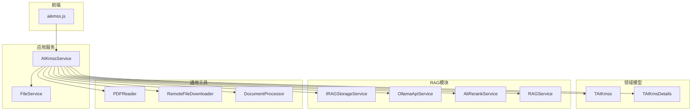
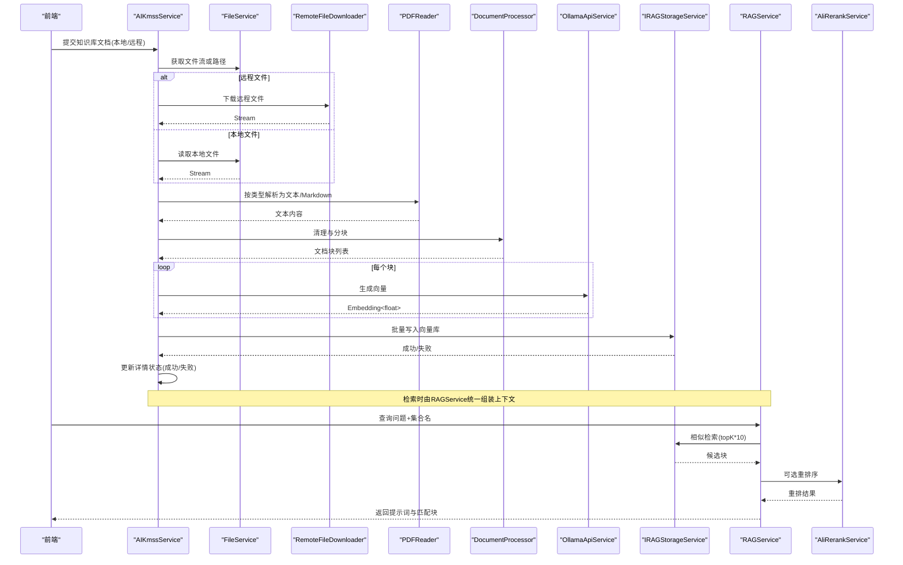
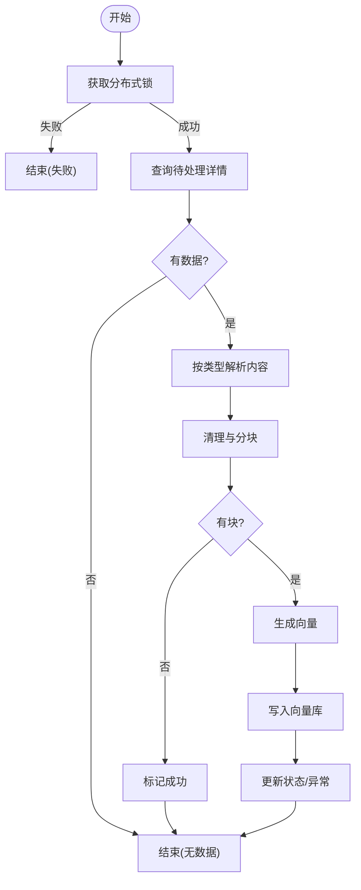
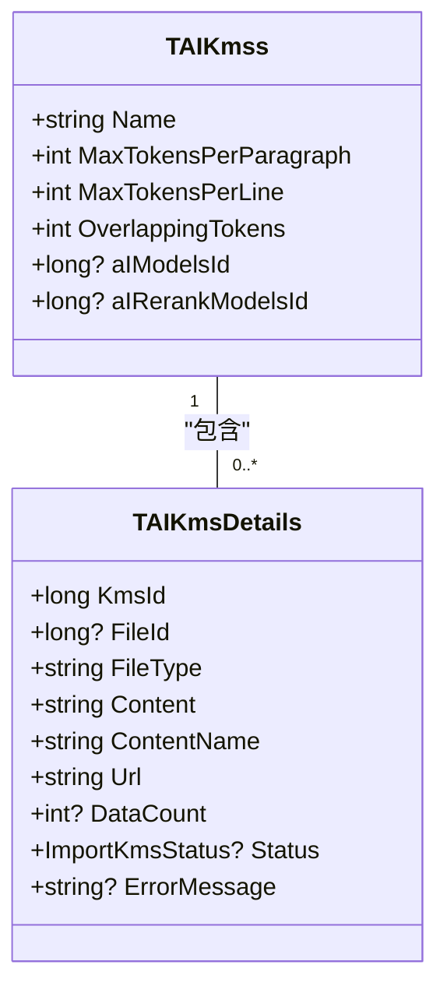
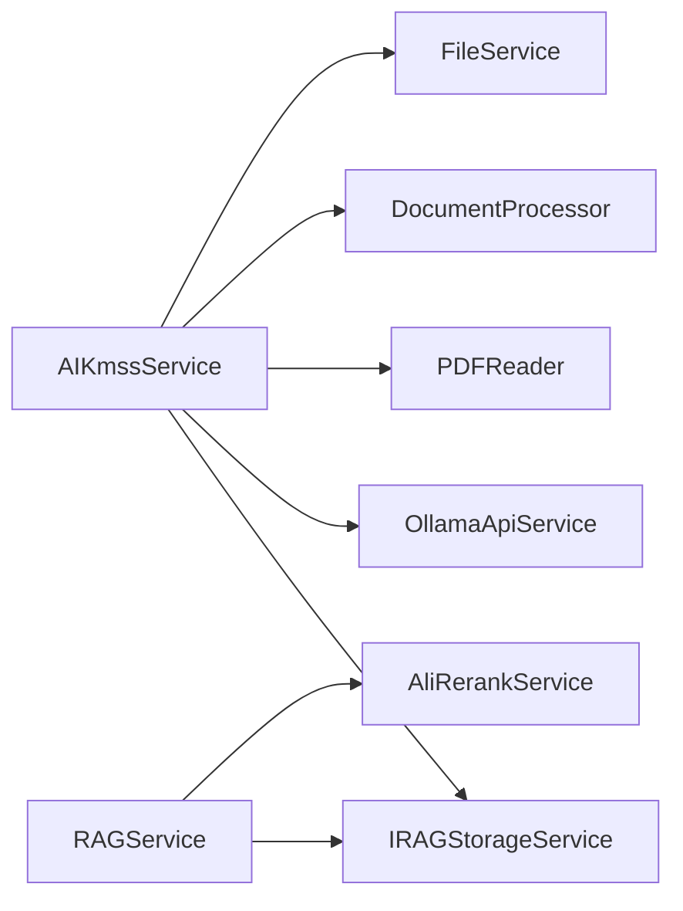

# 知识库管理

<cite>
**本文引用的文件**
- [AIKmssService.cs](file://Kevin/Application/Services/AI/AIKmssService.cs)
- [TAIKmss.cs](file://Kevin/Domain/Entities/AI/TAIKmss.cs)
- [TAIKmsDetails.cs](file://Kevin/Domain/Entities/AI/TAIKmsDetails.cs)
- [DocumentChunkDto.cs](file://Kevin/ Kevin.Module/Kevin.RAG/Dto/DocumentChunkDto.cs)
- [RAGService.cs](file://Kevin/ Kevin.Module/Kevin.RAG/RAGService.cs)
- [IRAGStorageService.cs](file://Kevin/ Kevin.Module/Kevin.RAG/Interfaces/IRAGStorageService.cs)
- [OllamaApiService.cs](file://Kevin/ Kevin.Module/Kevin.RAG/Ollama/OllamaApiService.cs)
- [AliRerankService.cs](file://Kevin/ Kevin.Module/Kevin.RAG/Rerank/AliRerankService.cs)
- [PDFReader.cs](file://Kevin/ kevin.Module/Kevin.Common/Helper/FileHandleTools/PDFReader.cs)
- [RemoteFileDownloader.cs](file://Kevin/ kevin.Module/Kevin.Common/Helper/FileHandleTools/RemoteFileDownloader.cs)
- [FileService.cs](file://Kevin/Application/Services/FileService.cs)
- [IAIKmssService.cs](file://Kevin/Domain/Interfaces/IServices/AI/IAIKmssService.cs)
- [aikmss.js](file://vue/kevin.web.vue/src/api/ai/aikmss.js)
</cite>

## 目录
1. [简介](#简介)
2. [项目结构](#项目结构)
3. [核心组件](#核心组件)
4. [架构总览](#架构总览)
5. [详细组件分析](#详细组件分析)
6. [依赖关系分析](#依赖关系分析)
7. [性能考虑](#性能考虑)
8. [故障排查指南](#故障排查指南)
9. [结论](#结论)
10. [附录：配置与优化建议](#附录：配置与优化建议)

## 简介
本章节概述知识库管理的整体目标与能力边界。系统提供从文档上传、解析、分块、向量化到索引构建与相似度检索的完整流程，并支持重排序机制以提升检索质量。知识库通过实体模型进行版本化与增量更新管理，结合向量数据库实现高效语义检索，最终服务于AI应用的知识增强（RAG）场景。

## 项目结构
知识库相关代码主要分布在以下模块：
- 应用服务层：负责业务流程编排（上传、解析、分块、向量化、入库、检索）。
- 领域实体：定义知识库主表与详情表，承载配置与状态。
- RAG模块：封装向量存储接口、嵌入生成、重排序等能力。
- 通用工具：文件下载、格式解析（PDF/Word/Excel/HTML/Markdown/图片）、文本处理与分块。
- 前端API：调用后端知识库管理接口。

图表来源
- [AIKmssService.cs:1-449](file://Kevin/Application/Services/AI/AIKmssService.cs#L1-L449)
- [TAIKmss.cs:1-47](file://Kevin/Domain/Entities/AI/TAIKmss.cs#L1-L47)
- [TAIKmsDetails.cs:1-51](file://Kevin/Domain/Entities/AI/TAIKmsDetails.cs#L1-L51)
- [IRAGStorageService.cs:1-30](file://Kevin/ Kevin.Module/Kevin.RAG/Interfaces/IRAGStorageService.cs#L1-L30)
- [OllamaApiService.cs:1-96](file://Kevin/ Kevin.Module/Kevin.RAG/Ollama/OllamaApiService.cs#L1-L96)
- [AliRerankService.cs:1-99](file://Kevin/ Kevin.Module/Kevin.RAG/Rerank/AliRerankService.cs#L1-L99)
- [PDFReader.cs:41-419](file://Kevin/ kevin.Module/Kevin.Common/Helper/FileHandleTools/PDFReader.cs#L41-L419)
- [RemoteFileDownloader.cs:207-235](file://Kevin/ kevin.Module/Kevin.Common/Helper/FileHandleTools/RemoteFileDownloader.cs#L207-L235)
- [aikmss.js:1-26](file://vue/kevin.web.vue/src/api/ai/aikmss.js#L1-L26)

章节来源
- [AIKmssService.cs:1-449](file://Kevin/Application/Services/AI/AIKmssService.cs#L1-L449)
- [TAIKmss.cs:1-47](file://Kevin/Domain/Entities/AI/TAIKmss.cs#L1-L47)
- [TAIKmsDetails.cs:1-51](file://Kevin/Domain/Entities/AI/TAIKmsDetails.cs#L1-L51)
- [IRAGStorageService.cs:1-30](file://Kevin/ Kevin.Module/Kevin.RAG/Interfaces/IRAGStorageService.cs#L1-L30)
- [OllamaApiService.cs:1-96](file://Kevin/ Kevin.Module/Kevin.RAG/Ollama/OllamaApiService.cs#L1-L96)
- [AliRerankService.cs:1-99](file://Kevin/ Kevin.Module/Kevin.RAG/Rerank/AliRerankService.cs#L1-L99)
- [PDFReader.cs:41-419](file://Kevin/ kevin.Module/Kevin.Common/Helper/FileHandleTools/PDFReader.cs#L41-L419)
- [RemoteFileDownloader.cs:207-235](file://Kevin/ kevin.Module/Kevin.Common/Helper/FileHandleTools/RemoteFileDownloader.cs#L207-L235)
- [aikmss.js:1-26](file://vue/kevin.web.vue/src/api/ai/aikmss.js#L1-L26)

## 核心组件
- 知识库服务（AIKmssService）：负责知识库CRUD、文档解析、分块、向量化、入库、状态管理与分布式锁控制。
- 知识库实体（TAIKmss、TAIKmsDetails）：定义知识库配置（段落最大token、重叠token、向量模型ID、重排模型ID）与文档详情（类型、内容、URL、状态、异常信息）。
- 文档块模型（DocumentChunkDto）：用于向量存储的数据载体，包含内容、向量、来源、标题、类别、序号、创建时间等。
- 向量存储接口（IRAGStorageService）：抽象向量库操作（新增、搜索），屏蔽底层实现差异。
- 嵌入生成（OllamaApiService）：调用Ollama或HTTP接口生成文本向量。
- 重排序（AliRerankService）：对初步检索结果进行相关性重排，提升召回质量。
- 文档解析与下载（PDFReader、RemoteFileDownloader、FileService）：支持多种格式的文本提取与远程文件获取。

章节来源
- [AIKmssService.cs:1-449](file://Kevin/Application/Services/AI/AIKmssService.cs#L1-L449)
- [TAIKmss.cs:1-47](file://Kevin/Domain/Entities/AI/TAIKmss.cs#L1-L47)
- [TAIKmsDetails.cs:1-51](file://Kevin/Domain/Entities/AI/TAIKmsDetails.cs#L1-L51)
- [DocumentChunkDto.cs:1-64](file://Kevin/ Kevin.Module/Kevin.RAG/Dto/DocumentChunkDto.cs#L1-L64)
- [IRAGStorageService.cs:1-30](file://Kevin/ Kevin.Module/Kevin.RAG/Interfaces/IRAGStorageService.cs#L1-L30)
- [OllamaApiService.cs:1-96](file://Kevin/ Kevin.Module/Kevin.RAG/Ollama/OllamaApiService.cs#L1-L96)
- [AliRerankService.cs:1-99](file://Kevin/ Kevin.Module/Kevin.RAG/Rerank/AliRerankService.cs#L1-L99)
- [PDFReader.cs:41-419](file://Kevin/ kevin.Module/Kevin.Common/Helper/FileHandleTools/PDFReader.cs#L41-L419)
- [RemoteFileDownloader.cs:207-235](file://Kevin/ kevin.Module/Kevin.Common/Helper/FileHandleTools/RemoteFileDownloader.cs#L207-L235)
- [FileService.cs:1-200](file://Kevin/Application/Services/FileService.cs#L1-L200)

## 架构总览
知识库管理采用分层架构：
- 表现层：前端通过API调用知识库管理功能。
- 应用层：AIKmssService编排业务流，协调文件服务、解析器、分块器、嵌入生成器与向量存储。
- 领域层：实体模型承载知识库配置与文档详情。
- 基础设施层：RAG模块提供向量存储、嵌入生成、重排序等能力；通用工具提供文件下载与多格式解析。

图表来源
- [AIKmssService.cs:241-429](file://Kevin/Application/Services/AI/AIKmssService.cs#L241-L429)
- [FileService.cs:67-91](file://Kevin/Application/Services/FileService.cs#L67-L91)
- [RemoteFileDownloader.cs:207-235](file://Kevin/ kevin.Module/Kevin.Common/Helper/FileHandleTools/RemoteFileDownloader.cs#L207-L235)
- [PDFReader.cs:41-419](file://Kevin/ kevin.Module/Kevin.Common/Helper/FileHandleTools/PDFReader.cs#L41-L419)
- [OllamaApiService.cs:71-86](file://Kevin/ Kevin.Module/Kevin.RAG/Ollama/OllamaApiService.cs#L71-L86)
- [IRAGStorageService.cs:15-26](file://Kevin/ Kevin.Module/Kevin.RAG/Interfaces/IRAGStorageService.cs#L15-L26)
- [RAGService.cs:19-78](file://Kevin/ Kevin.Module/Kevin.RAG/RAGService.cs#L19-L78)
- [AliRerankService.cs:51-88](file://Kevin/ Kevin.Module/Kevin.RAG/Rerank/AliRerankService.cs#L51-L88)

## 详细组件分析

### 知识库服务（AIKmssService）
- 职责：知识库CRUD、文档解析、分块、向量化、入库、状态管理、分布式锁控制。
- 关键流程：
  - 解析：根据FileType选择对应解析器（text/markdown/pdf/word/html/image/excel）。
  - 分块：使用DocumentProcessor按段落分块，支持清理与重叠策略。
  - 向量化：基于配置的Embedding模型生成向量。
  - 入库：批量写入向量库，集合名为“AIKmss-{知识库Id}”。
  - 状态：更新详情状态为成功/失败，记录异常信息。
- 并发控制：使用分布式锁避免重复处理同一知识库。

图表来源
- [AIKmssService.cs:241-429](file://Kevin/Application/Services/AI/AIKmssService.cs#L241-L429)

章节来源
- [AIKmssService.cs:1-449](file://Kevin/Application/Services/AI/AIKmssService.cs#L1-L449)

### 领域实体（TAIKmss、TAIKmsDetails）
- TAIKmss：知识库主配置，包括名称、段落最大token、行最大token、重叠token、向量模型ID、重排模型ID。
- TAIKmsDetails：知识库文档详情，包括关联知识库、文件ID、类型、内容、内容名、URL、数据数量、状态、异常消息。
- 版本与增量：编辑时对比明细列表，新增/更新/软删除，保持历史可追溯。

图表来源
- [TAIKmss.cs:1-47](file://Kevin/Domain/Entities/AI/TAIKmss.cs#L1-L47)
- [TAIKmsDetails.cs:1-51](file://Kevin/Domain/Entities/AI/TAIKmsDetails.cs#L1-L51)

章节来源
- [TAIKmss.cs:1-47](file://Kevin/Domain/Entities/AI/TAIKmss.cs#L1-L47)
- [TAIKmsDetails.cs:1-51](file://Kevin/Domain/Entities/AI/TAIKmsDetails.cs#L1-L51)

### 文档块模型（DocumentChunkDto）
- 字段：唯一标识、内容、向量、来源文件、标题、类别、块序号、创建时间、相似度分数。
- 用途：作为向量存储的数据载体，便于检索时携带元数据与分数。

章节来源
- [DocumentChunkDto.cs:1-64](file://Kevin/ Kevin.Module/Kevin.RAG/Dto/DocumentChunkDto.cs#L1-L64)

### 向量存储接口（IRAGStorageService）
- 方法：AddData（批量写入）、Search（相似检索，支持limit与Score过滤）。
- 设计：抽象底层向量库实现，便于替换（如Qdrant等）。

章节来源
- [IRAGStorageService.cs:1-30](file://Kevin/ Kevin.Module/Kevin.RAG/Interfaces/IRAGStorageService.cs#L1-L30)

### 嵌入生成（OllamaApiService）
- 能力：通过Ollama客户端或HTTP接口生成文本向量。
- 配置：支持Url、DefaultModel、ApiKey；若未配置则抛出参数异常。

章节来源
- [OllamaApiService.cs:1-96](file://Kevin/ Kevin.Module/Kevin.RAG/Ollama/OllamaApiService.cs#L1-L96)

### 重排序（AliRerankService）
- 能力：对候选文档进行相关性重排，返回index与relevance_score。
- 配置：支持Url、DefaultModel、ApiKey；可通过配置注入。

章节来源
- [AliRerankService.cs:1-99](file://Kevin/ Kevin.Module/Kevin.RAG/Rerank/AliRerankService.cs#L1-L99)

### RAG检索服务（RAGService）
- 能力：根据问题向量在指定集合中检索，可选重排序，过滤阈值，拼接上下文提示词。
- 流程：优先检索topK*10，重排序后取topK，按分数过滤，构造用户提示词。

章节来源
- [RAGService.cs:19-78](file://Kevin/ Kevin.Module/Kevin.RAG/RAGService.cs#L19-L78)

### 文档解析与下载
- PDFReader：将PDF转换为Markdown，保留标题、页码、图片引用等。
- RemoteFileDownloader：从URL下载文件流，按类型路由至相应解析器。
- FileService：本地文件读取与远程文件下载，支持多存储后端。

章节来源
- [PDFReader.cs:41-419](file://Kevin/ kevin.Module/Kevin.Common/Helper/FileHandleTools/PDFReader.cs#L41-L419)
- [RemoteFileDownloader.cs:207-235](file://Kevin/ kevin.Module/Kevin.Common/Helper/FileHandleTools/RemoteFileDownloader.cs#L207-L235)
- [FileService.cs:67-91](file://Kevin/Application/Services/FileService.cs#L67-L91)

### 前端API（aikmss.js）
- 接口：获取列表、分页、详情、新增编辑、删除。
- 调用：通过http封装调用后端知识库管理接口。

章节来源
- [aikmss.js:1-26](file://vue/kevin.web.vue/src/api/ai/aikmss.js#L1-L26)

## 依赖关系分析
- AIKmssService依赖：
  - 领域仓储：AIKmssRp、AIKmsDetailsRp、FileRp、AIModelsRp。
  - 文件服务：FileService、IFileStorage。
  - RAG能力：IRAGStorageService、IOllamaApiService、IDistributedLockProvider。
- RAGService依赖：
  - IRAGStorageService、IRerankService（AliRerankService）。
- 解析器依赖：
  - PDFReader、TextStreamReader、HtmlReader、WordReader、ExcelReader、ImageReader。
- 向量存储：
  - 通过IRAGStorageService抽象，具体实现可替换（如Qdrant）。

图表来源
- [AIKmssService.cs:1-449](file://Kevin/Application/Services/AI/AIKmssService.cs#L1-L449)
- [RAGService.cs:19-78](file://Kevin/ Kevin.Module/Kevin.RAG/RAGService.cs#L19-L78)

章节来源
- [AIKmssService.cs:1-449](file://Kevin/Application/Services/AI/AIKmssService.cs#L1-L449)
- [RAGService.cs:19-78](file://Kevin/ Kevin.Module/Kevin.RAG/RAGService.cs#L19-L78)

## 性能考虑
- 分块策略：合理设置段落最大token与重叠token，平衡上下文连贯性与检索精度。
- 向量维度：根据模型配置embeddingValueSize，确保与向量库一致。
- 检索规模：检索时先扩大topK（如topK*10），再重排序与阈值过滤，减少误判。
- 并发控制：分布式锁避免重复处理，提高吞吐稳定性。
- 解析优化：大文件解析建议使用异步与流式处理，避免内存峰值。
- 缓存与批处理：批量写入向量库，减少网络往返。

[本节为通用指导，不直接分析具体文件]

## 故障排查指南
- 常见错误：
  - 向量模型配置错误：OllamaApiService会抛出参数异常，检查Url、DefaultModel、ApiKey。
  - 重排序服务不可用：AliRerankService请求失败时抛出异常，检查Url、Model、Key。
  - 文件解析失败：确认FileType与解析器支持范围，检查远程URL可达性。
  - 向量库写入失败：检查IRAGStorageService实现与连接配置。
- 日志与状态：
  - 详情状态字段记录成功/失败与异常消息，便于定位问题。
  - 分布式锁获取失败时记录错误日志。

章节来源
- [OllamaApiService.cs:71-86](file://Kevin/ Kevin.Module/Kevin.RAG/Ollama/OllamaApiService.cs#L71-L86)
- [AliRerankService.cs:51-88](file://Kevin/ Kevin.Module/Kevin.RAG/Rerank/AliRerankService.cs#L51-L88)
- [AIKmssService.cs:413-429](file://Kevin/Application/Services/AI/AIKmssService.cs#L413-L429)

## 结论
知识库管理提供了完整的文档处理与检索链路，涵盖多格式解析、智能分块、向量化、索引构建与相似度检索，并通过重排序机制提升答案质量。系统具备版本化与增量更新能力，结合分布式锁保障并发安全。通过灵活配置向量模型与重排序服务，可适配不同AI应用场景。

[本节为总结，不直接分析具体文件]

## 附录：配置与优化建议
- 知识库配置示例（字段说明）：
  - 名称：知识库显示名称。
  - 段落最大token：控制分块大小，影响上下文完整性。
  - 行最大token：控制句子级切分粒度。
  - 重叠token：相邻块重叠长度，提升跨段语义连续性。
  - 向量模型ID：选择Embedding模型，决定向量维度与质量。
  - 重排模型ID：选择Rerank模型，提升检索相关性。
- 性能优化建议：
  - 调整分块与重叠参数以平衡召回与精度。
  - 使用合适的topK与阈值过滤，减少噪声。
  - 批量写入向量库，降低网络开销。
  - 启用分布式锁避免重复处理。
  - 对大文件采用流式解析与异步处理。

[本节为通用指导，不直接分析具体文件]