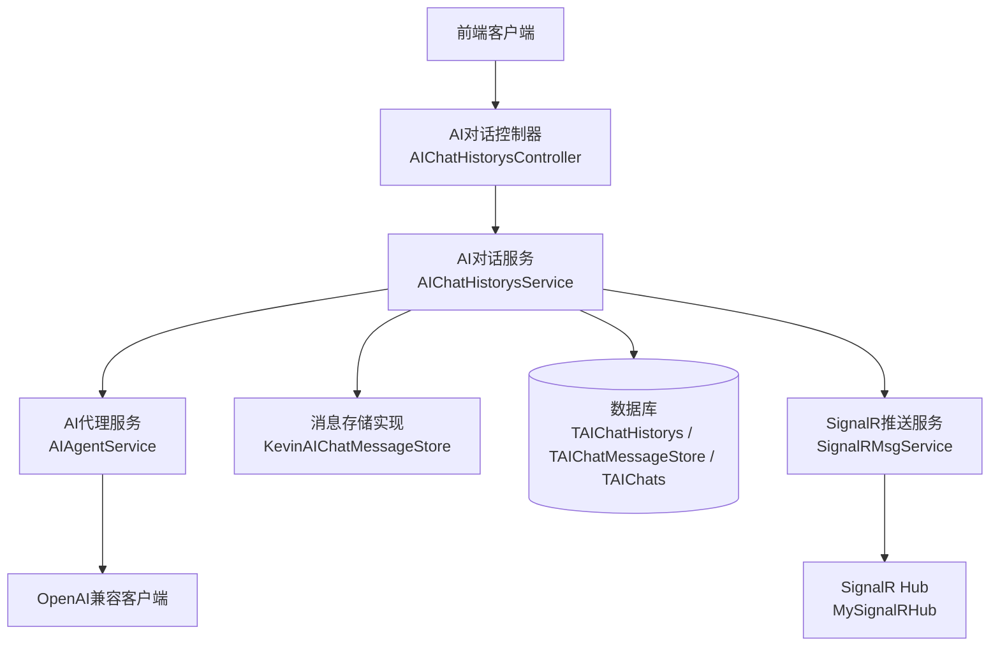
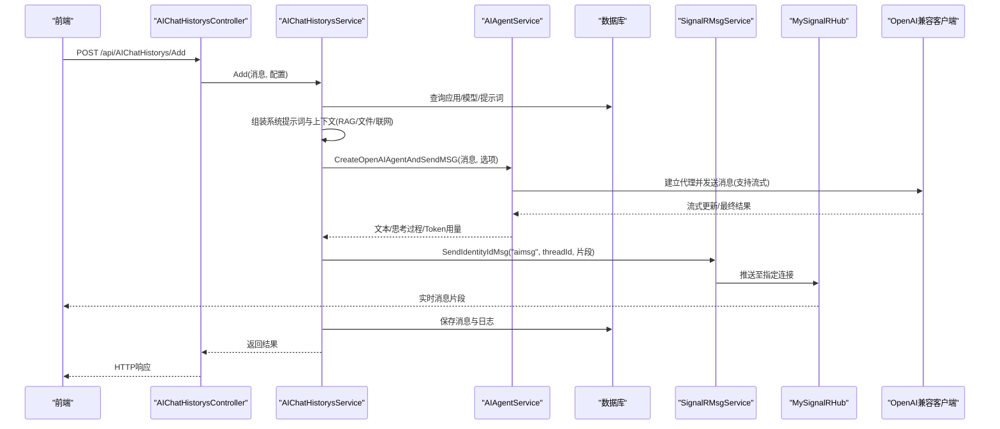
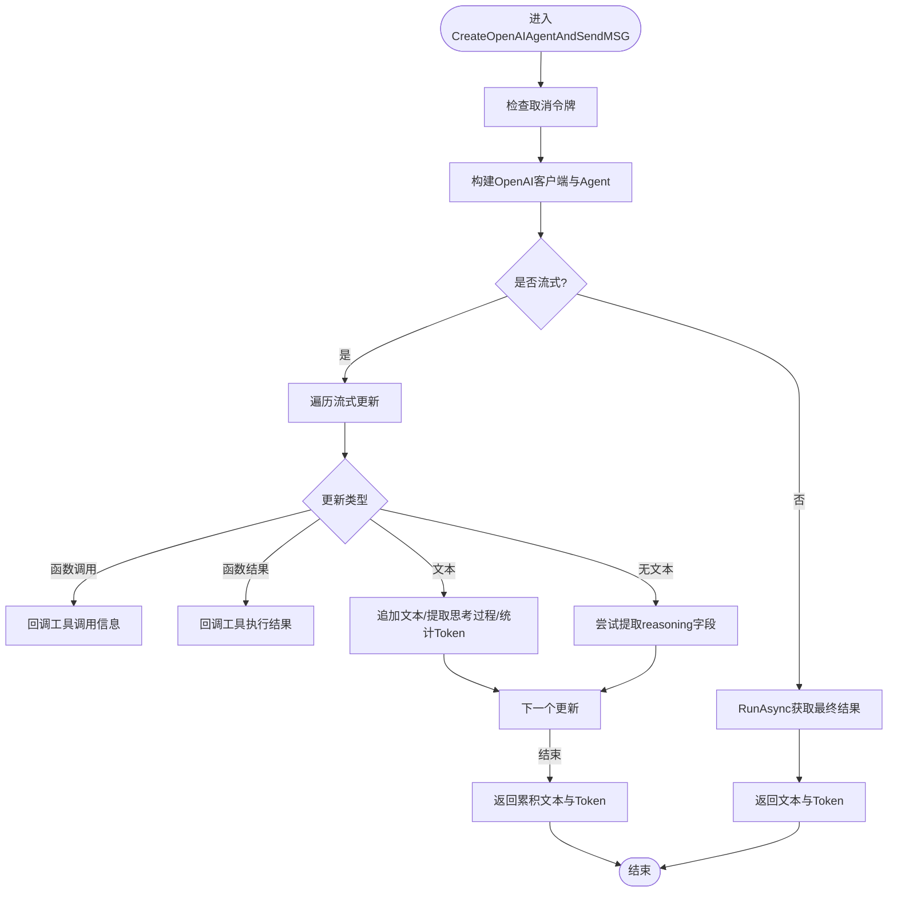
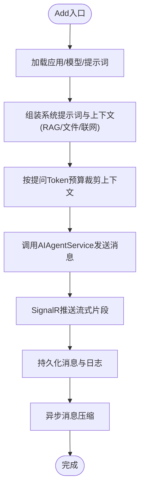
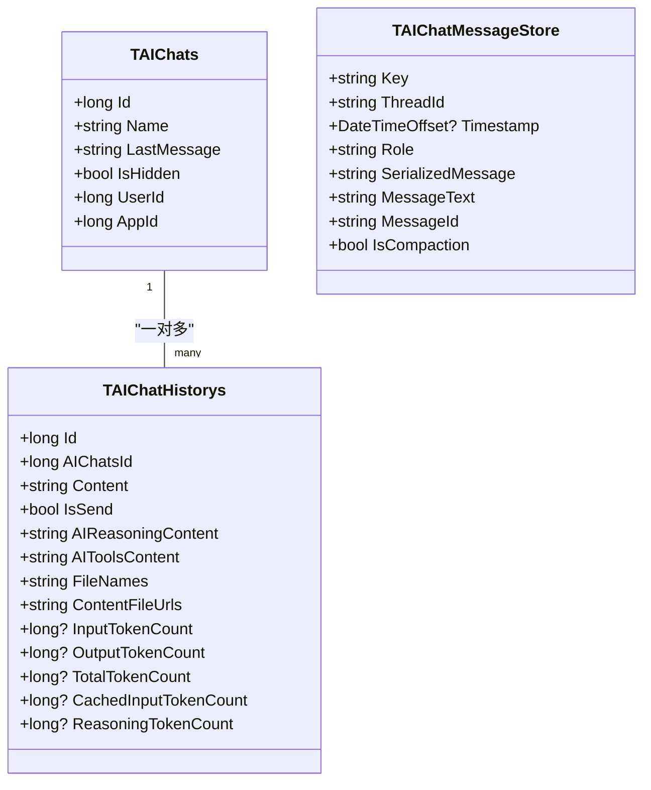
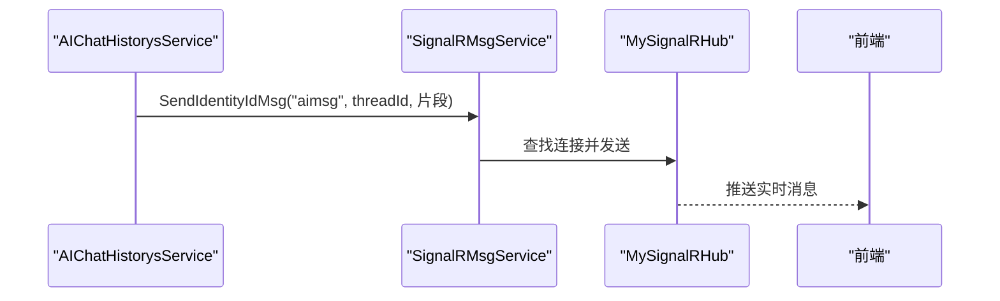
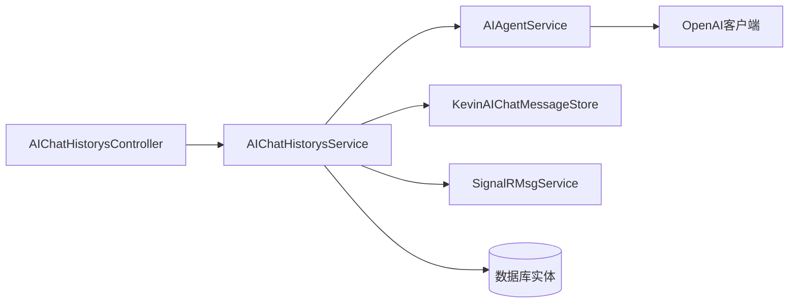

# 聊天对话

<cite>
**本文引用的文件**
- [AIAgentService.cs](file://Kevin/kevin.Module/kevin.AI.AgentFramework/AIAgentService.cs)
- [AIChatHistorysService.cs](file://Kevin/Application/Services/AI/AIChatHistorysService.cs)
- [KevinAIChatMessageStore.cs](file://Kevin/Application/Services/AI/KevinAIChatMessageStore.cs)
- [IKevinAIChatMessageStore.cs](file://Kevin/kevin.Module/kevin.AI.AgentFramework/Interfaces/IKevinAIChatMessageStore.cs)
- [TAIChatMessageStore.cs](file://Kevin/Domain/Entities/AI/TAIChatMessageStore.cs)
- [TAIChatHistorys.cs](file://Kevin/Domain/Entities/AI/TAIChatHistorys.cs)
- [TAIChats.cs](file://Kevin/Domain/Entities/AI/TAIChats.cs)
- [AIChatsService.cs](file://Kevin/Application/Services/AI/AIChatsService.cs)
- [AIAppsService.cs](file://Kevin/Application/Services/AI/AIAppsService.cs)
- [SignalRMsgService.cs](file://Kevin/kevin.Module/ Kevin.SignalR/Service/SignalRMsgService.cs)
- [MySignalRHub.cs](file://Kevin/kevin.Module/ Kevin.SignalR/MySignalRHub.cs)
- [AIChatHistorysController.cs](file://Kevin/ Kevin.Web.Basics/Controllers/AI/AIChatHistorysController.cs)
</cite>

## 目录
1. [简介](#简介)
2. [项目结构](#项目结构)
3. [核心组件](#核心组件)
4. [架构总览](#架构总览)
5. [详细组件分析](#详细组件分析)
6. [依赖关系分析](#依赖关系分析)
7. [性能与可扩展性](#性能与可扩展性)
8. [故障排查指南](#故障排查指南)
9. [结论](#结论)
10. [附录：API与前端集成示例](#附录api与前端集成示例)

## 简介
本章节面向“聊天对话”功能，系统性说明消息的发送与接收、多轮对话上下文管理、历史记录存储、流式响应处理、实时通信与推送、错误重试机制，以及AIAgentService中的对话处理逻辑、消息存储机制和上下文管理等核心能力。文档同时提供对话API的使用示例与前端集成方案建议，帮助读者快速理解并落地实现。

## 项目结构
围绕聊天对话的关键代码分布在以下层次：
- 表现层（控制器）：对外暴露REST接口，负责参数校验、权限控制与日志记录。
- 应用服务层：编排业务流程，包括创建对话、发送消息、检索历史、调用AI代理、处理知识库/RAG、文件与联网搜索、消息压缩等。
- 领域实体与仓储：持久化聊天记录、会话元信息、消息存储表及压缩结果。
- AI代理框架：封装OpenAI兼容客户端、流式输出、工具调用、思考过程提取、Token用量统计与友好错误提示。
- 实时通信：基于SignalR实现服务端到前端的实时消息推送。

图表来源
- [AIChatHistorysController.cs:17-78](file://Kevin/ Kevin.Web.Basics/Controllers/AI/AIChatHistorysController.cs#L17-L78)
- [AIChatHistorysService.cs:29-73](file://Kevin/Application/Services/AI/AIChatHistorysService.cs#L29-L73)
- [AIAgentService.cs:21-206](file://Kevin/kevin.Module/kevin.AI.AgentFramework/AIAgentService.cs#L21-L206)
- [KevinAIChatMessageStore.cs:11-93](file://Kevin/Application/Services/AI/KevinAIChatMessageStore.cs#L11-L93)
- [SignalRMsgService.cs:9-132](file://Kevin/kevin.Module/ Kevin.SignalR/Service/SignalRMsgService.cs#L9-L132)
- [MySignalRHub.cs:11-176](file://Kevin/kevin.Module/ Kevin.SignalR/MySignalRHub.cs#L11-L176)

章节来源
- [AIChatHistorysController.cs:17-78](file://Kevin/ Kevin.Web.Basics/Controllers/AI/AIChatHistorysController.cs#L17-L78)
- [AIChatHistorysService.cs:29-73](file://Kevin/Application/Services/AI/AIChatHistorysService.cs#L29-L73)
- [AIAgentService.cs:21-206](file://Kevin/kevin.Module/kevin.AI.AgentFramework/AIAgentService.cs#L21-L206)
- [KevinAIChatMessageStore.cs:11-93](file://Kevin/Application/Services/AI/KevinAIChatMessageStore.cs#L11-L93)
- [SignalRMsgService.cs:9-132](file://Kevin/kevin.Module/ Kevin.SignalR/Service/SignalRMsgService.cs#L9-L132)
- [MySignalRHub.cs:11-176](file://Kevin/kevin.Module/ Kevin.SignalR/MySignalRHub.cs#L11-L176)

## 核心组件
- AIAgentService：封装AI代理创建、流式与非流式调用、工具调用回调、思考过程提取、Token用量统计、网络超时与重试、异常友好提示。
- AIChatHistorysService：对话主流程编排，包含系统提示词组装、RAG/文件/联网搜索上下文注入、Token预算裁剪、消息持久化、异步消息压缩、SignalR实时推送。
- KevinAIChatMessageStore：消息持久化与读取，支持按线程ID获取历史，支持限制用户轮次以进行上下文压缩。
- SignalRMsgService + MySignalRHub：维护租户与用户连接映射，提供按连接ID或身份ID的消息推送能力。
- 数据模型：TAIChats（会话）、TAIChatHistorys（消息）、TAIChatMessageStore（结构化消息存储）。

章节来源
- [AIAgentService.cs:21-540](file://Kevin/kevin.Module/kevin.AI.AgentFramework/AIAgentService.cs#L21-L540)
- [AIChatHistorysService.cs:29-646](file://Kevin/Application/Services/AI/AIChatHistorysService.cs#L29-L646)
- [KevinAIChatMessageStore.cs:11-93](file://Kevin/Application/Services/AI/KevinAIChatMessageStore.cs#L11-L93)
- [TAIChats.cs:1-52](file://Kevin/Domain/Entities/AI/TAIChats.cs#L1-L52)
- [TAIChatHistorys.cs:1-83](file://Kevin/Domain/Entities/AI/TAIChatHistorys.cs#L1-L83)
- [TAIChatMessageStore.cs:1-52](file://Kevin/Domain/Entities/AI/TAIChatMessageStore.cs#L1-L52)
- [SignalRMsgService.cs:9-132](file://Kevin/kevin.Module/ Kevin.SignalR/Service/SignalRMsgService.cs#L9-L132)
- [MySignalRHub.cs:11-176](file://Kevin/kevin.Module/ Kevin.SignalR/MySignalRHub.cs#L11-L176)

## 架构总览
下图展示一次完整对话请求从前端到后端再到AI模型的全链路交互，包括流式响应与实时推送。

图表来源
- [AIChatHistorysController.cs:35-60](file://Kevin/ Kevin.Web.Basics/Controllers/AI/AIChatHistorysController.cs#L35-L60)
- [AIChatHistorysService.cs:110-264](file://Kevin/Application/Services/AI/AIChatHistorysService.cs#L110-L264)
- [AIAgentService.cs:37-206](file://Kevin/kevin.Module/kevin.AI.AgentFramework/AIAgentService.cs#L37-L206)
- [SignalRMsgService.cs:94-102](file://Kevin/kevin.Module/ Kevin.SignalR/Service/SignalRMsgService.cs#L94-L102)
- [MySignalRHub.cs:74-129](file://Kevin/kevin.Module/ Kevin.SignalR/MySignalRHub.cs#L74-L129)

## 详细组件分析

### AIAgentService：AI代理与流式处理
- 代理创建与配置：根据设置动态启用/禁用工具与技能；配置Endpoint、超时与重试策略；构建带工具审批规则的Agent。
- 流式输出：遍历流式更新，区分函数调用、函数结果、文本内容；在文本为空时尝试提取思考过程；累计Token用量。
- 非流式输出：直接获取最终文本与Usage。
- 错误处理：捕获异常后判断是否为参数类错误（如max_tokens超限），否则进行有限次数重试；将异常转换为友好提示并通过回调或返回值返回。
- Token用量提取：兼容多种数据结构与反射方式，确保在不同版本/包装下仍能正确统计输入/输出/总计Token。

图表来源
- [AIAgentService.cs:37-206](file://Kevin/kevin.Module/kevin.AI.AgentFramework/AIAgentService.cs#L37-L206)
- [AIAgentService.cs:298-390](file://Kevin/kevin.Module/kevin.AI.AgentFramework/AIAgentService.cs#L298-L390)
- [AIAgentService.cs:393-535](file://Kevin/kevin.Module/kevin.AI.AgentFramework/AIAgentService.cs#L393-L535)

章节来源
- [AIAgentService.cs:37-206](file://Kevin/kevin.Module/kevin.AI.AgentFramework/AIAgentService.cs#L37-L206)
- [AIAgentService.cs:298-390](file://Kevin/kevin.Module/kevin.AI.AgentFramework/AIAgentService.cs#L298-L390)
- [AIAgentService.cs:393-535](file://Kevin/kevin.Module/kevin.AI.AgentFramework/AIAgentService.cs#L393-L535)

### AIChatHistorysService：对话主流程与上下文管理
- 新建对话：校验应用权限与消息上限；加载模型与提示词；组装系统提示词；可选接入知识库RAG、文件解析、联网搜索；按提问Token预算裁剪上下文；构造ChatMessage并调用AI代理；通过SignalR推送流式片段；持久化消息与日志；异步触发消息压缩。
- 上下文压缩：当达到配置阈值时，按用户轮次回溯，将历史消息序列化为JSON并按角色提取关键内容，调用AI生成压缩摘要，写入压缩结果表，并标记原记录为已压缩。
- Token预算裁剪：保守估算文本Token数，优先保留高优先级上下文，超出预算则截断当前段并停止后续填充，避免半截上下文影响模型。

图表来源
- [AIChatHistorysService.cs:110-264](file://Kevin/Application/Services/AI/AIChatHistorysService.cs#L110-L264)
- [AIChatHistorysService.cs:519-642](file://Kevin/Application/Services/AI/AIChatHistorysService.cs#L519-L642)

章节来源
- [AIChatHistorysService.cs:110-264](file://Kevin/Application/Services/AI/AIChatHistorysService.cs#L110-L264)
- [AIChatHistorysService.cs:473-514](file://Kevin/Application/Services/AI/AIChatHistorysService.cs#L473-L514)
- [AIChatHistorysService.cs:519-642](file://Kevin/Application/Services/AI/AIChatHistorysService.cs#L519-L642)

### 消息存储与上下文管理
- 消息存储实体：TAIChatMessageStore用于结构化存储每条消息（角色、序列化消息、文本、时间戳、线程ID、消息ID、是否已压缩）。
- 存储实现：KevinAIChatMessageStore提供批量添加与按线程ID读取；支持限制最大用户轮次以仅返回最近N轮，便于上下文压缩或限长加载。
- 会话与消息：TAIChats表示会话元信息（名称、最后一条消息、隐藏状态、用户与应用关联）；TAIChatHistorys表示具体消息（内容、思考过程、工具调用过程、文件URL、Token用量）。

图表来源
- [TAIChats.cs:1-52](file://Kevin/Domain/Entities/AI/TAIChats.cs#L1-L52)
- [TAIChatHistorys.cs:1-83](file://Kevin/Domain/Entities/AI/TAIChatHistorys.cs#L1-L83)
- [TAIChatMessageStore.cs:1-52](file://Kevin/Domain/Entities/AI/TAIChatMessageStore.cs#L1-L52)

章节来源
- [KevinAIChatMessageStore.cs:20-93](file://Kevin/Application/Services/AI/KevinAIChatMessageStore.cs#L20-L93)
- [IKevinAIChatMessageStore.cs:8-13](file://Kevin/kevin.Module/kevin.AI.AgentFramework/Interfaces/IKevinAIChatMessageStore.cs#L8-L13)
- [TAIChatMessageStore.cs:1-52](file://Kevin/Domain/Entities/AI/TAIChatMessageStore.cs#L1-L52)
- [TAIChatHistorys.cs:1-83](file://Kevin/Domain/Entities/AI/TAIChatHistorys.cs#L1-L83)
- [TAIChats.cs:1-52](file://Kevin/Domain/Entities/AI/TAIChats.cs#L1-L52)

### 实时通信与消息推送
- SignalRHub：维护连接生命周期，缓存租户与用户的连接映射，支持单实例或多实例部署下的连接管理。
- 推送服务：提供按连接ID、身份ID、租户范围的消息推送方法；在对话流式输出中，将AI回复片段、工具调用日志、思考过程等实时推送到前端。

图表来源
- [SignalRMsgService.cs:94-102](file://Kevin/kevin.Module/ Kevin.SignalR/Service/SignalRMsgService.cs#L94-L102)
- [MySignalRHub.cs:74-129](file://Kevin/kevin.Module/ Kevin.SignalR/MySignalRHub.cs#L74-L129)

章节来源
- [SignalRMsgService.cs:9-132](file://Kevin/kevin.Module/ Kevin.SignalR/Service/SignalRMsgService.cs#L9-L132)
- [MySignalRHub.cs:11-176](file://Kevin/kevin.Module/ Kevin.SignalR/MySignalRHub.cs#L11-L176)

### 错误重试与友好提示
- 网络与参数错误：对参数类错误（如max_tokens、context_length、鉴权失败、限流）进行识别并给出友好提示；其他错误进行有限次数重试。
- 流式降级：流式异常时降级为非流式调用，保证用户体验。
- 前端体验：通过回调将友好提示实时推送给前端，避免空回复或技术堆栈暴露。

章节来源
- [AIAgentService.cs:179-244](file://Kevin/kevin.Module/kevin.AI.AgentFramework/AIAgentService.cs#L179-L244)
- [AIAgentService.cs:206-206](file://Kevin/kevin.Module/kevin.AI.AgentFramework/AIAgentService.cs#L206-L206)

## 依赖关系分析
- 控制器依赖服务：AIChatHistorysController依赖IAIChatHistorysService。
- 服务依赖：AIChatHistorysService依赖AIAgentService、消息存储、SignalR推送、RAG/文件/联网搜索等。
- 代理依赖：AIAgentService依赖OpenAI兼容客户端与配置。
- 数据依赖：各服务通过仓储访问数据库实体。

图表来源
- [AIChatHistorysController.cs:24-60](file://Kevin/ Kevin.Web.Basics/Controllers/AI/AIChatHistorysController.cs#L24-L60)
- [AIChatHistorysService.cs:29-73](file://Kevin/Application/Services/AI/AIChatHistorysService.cs#L29-L73)
- [AIAgentService.cs:21-206](file://Kevin/kevin.Module/kevin.AI.AgentFramework/AIAgentService.cs#L21-L206)

章节来源
- [AIChatHistorysController.cs:24-60](file://Kevin/ Kevin.Web.Basics/Controllers/AI/AIChatHistorysController.cs#L24-L60)
- [AIChatHistorysService.cs:29-73](file://Kevin/Application/Services/AI/AIChatHistorysService.cs#L29-L73)
- [AIAgentService.cs:21-206](file://Kevin/kevin.Module/kevin.AI.AgentFramework/AIAgentService.cs#L21-L206)

## 性能与可扩展性
- 流式输出：降低首字延迟，提升用户体验；结合SignalR实时推送。
- Token预算裁剪：防止上下文过大导致模型拒绝或成本过高。
- 异步压缩：后台任务压缩历史消息，减少后续请求上下文体积。
- 重试与超时：合理设置网络超时与重试次数，提高稳定性。
- 扩展点：可替换RAG/文件/联网搜索实现；可接入更多AI供应商；可自定义工具审批规则。

## 故障排查指南
- 模型鉴权失败：检查模型Key与Endpoint配置；查看友好提示是否包含鉴权相关关键字。
- 上下文长度超限：调大“提问Token”或新建对话；检查RAG/文件/联网搜索结果是否过长。
- 输出Token超限：调小“回答Token”；确认模型支持的max_tokens范围。
- 限流或余额不足：稍后重试或检查供应商配额。
- 流式异常：查看是否降级为非流式；检查回调是否正确注册。
- SignalR推送失败：确认连接是否建立；检查租户与身份ID映射；验证缓存中连接列表。

章节来源
- [AIAgentService.cs:217-244](file://Kevin/kevin.Module/kevin.AI.AgentFramework/AIAgentService.cs#L217-L244)
- [SignalRMsgService.cs:25-102](file://Kevin/kevin.Module/ Kevin.SignalR/Service/SignalRMsgService.cs#L25-L102)
- [MySignalRHub.cs:74-129](file://Kevin/kevin.Module/ Kevin.SignalR/MySignalRHub.cs#L74-L129)

## 结论
该聊天对话功能通过分层架构实现了完整的消息收发、上下文管理与历史记录存储，结合流式响应与SignalR实时推送，提供了良好的用户体验。AIAgentService作为AI代理的核心，统一了不同模型的调用细节，并提供错误重试与友好提示。AIChatHistorysService负责业务编排，确保上下文质量与成本控制。消息存储与压缩机制保障了长期对话的可扩展性与性能。

## 附录：API与前端集成示例
- 新增对话记录（POST）
  - 路径：/api/AIChatHistorys/Add
  - 作用：提交用户消息，触发AI回复与实时推送。
  - 参考：控制器定义与服务实现。

- 分页获取对话记录（POST）
  - 路径：/api/AIChatHistorys/GetPageData
  - 作用：按条件分页查询聊天记录。
  - 参考：控制器定义与服务实现。

- 删除对话记录（DELETE）
  - 路径：/api/AIChatHistorys/Delete
  - 作用：软删除指定记录。
  - 参考：控制器定义与服务实现。

- 前端集成要点
  - 发起HTTP请求调用Add接口，获取初始响应。
  - 建立SignalR连接，订阅aimsg、aIToolsContentMsg、aIReasoningContentMsg等方法，实时更新UI。
  - 处理错误提示：根据友好提示文案引导用户调整配置或重试。
  - 上下文管理：前端可按需显示“思考过程”与“工具调用”详情，提升透明度。

章节来源
- [AIChatHistorysController.cs:35-75](file://Kevin/ Kevin.Web.Basics/Controllers/AI/AIChatHistorysController.cs#L35-L75)
- [AIChatHistorysService.cs:110-264](file://Kevin/Application/Services/AI/AIChatHistorysService.cs#L110-L264)
- [SignalRMsgService.cs:94-102](file://Kevin/kevin.Module/ Kevin.SignalR/Service/SignalRMsgService.cs#L94-L102)
- [MySignalRHub.cs:74-129](file://Kevin/kevin.Module/ Kevin.SignalR/MySignalRHub.cs#L74-L129)