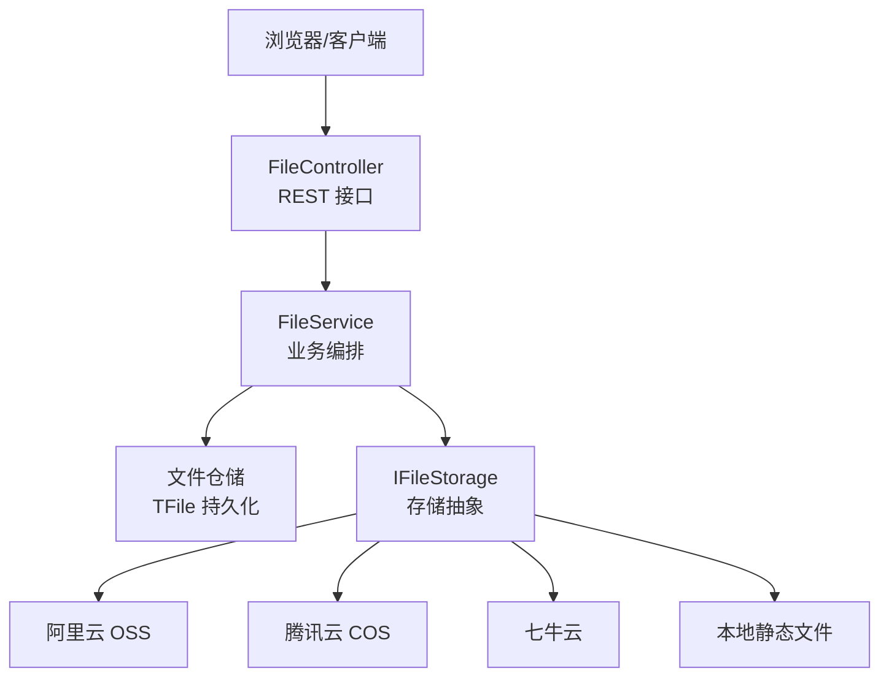
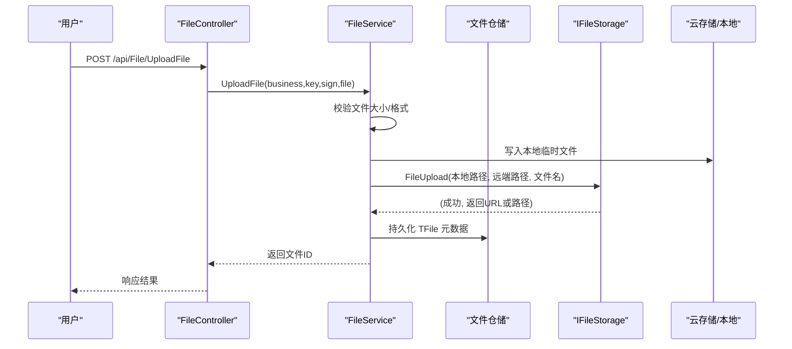
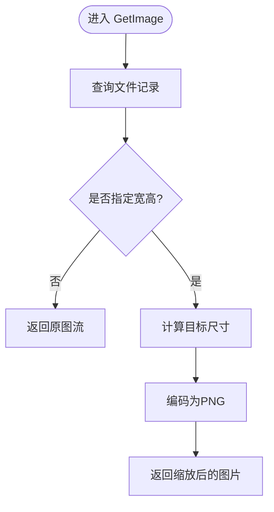
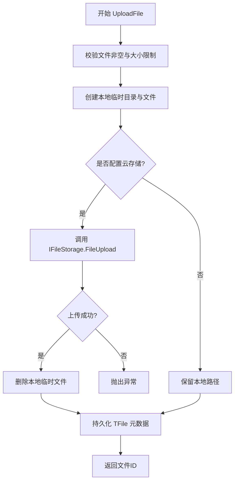
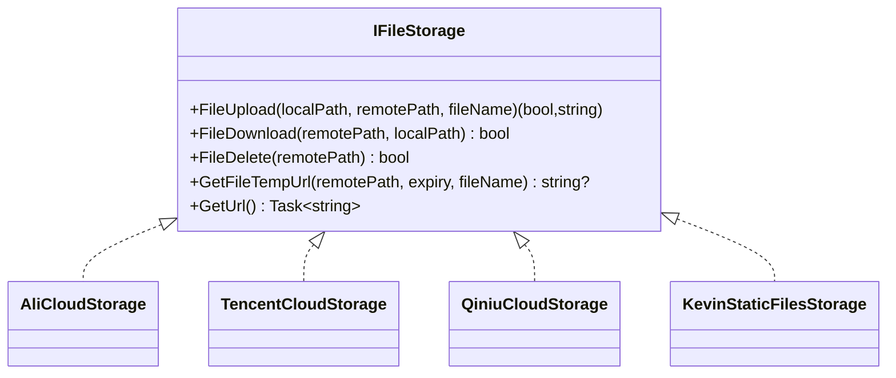
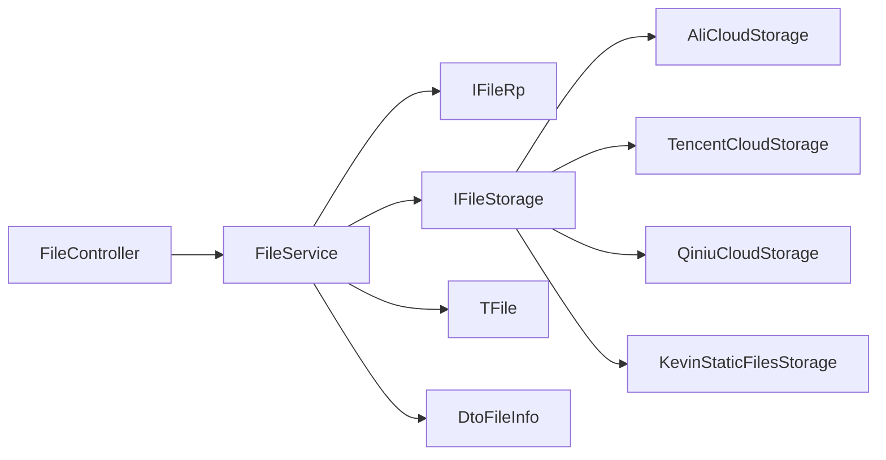

# 文件管理

<cite>
**本文引用的文件**
- [FileController.cs](file://Kevin/Kevin.Web.Basics/Controllers/FileController.cs)
- [FileService.cs](file://Kevin/Application/Services/FileService.cs)
- [TFile.cs](file://Kevin/Domain/Entities/TFile.cs)
- [IFileStorage.cs](file://Kevin/kevin.Share/Interfaces/IFileStorage.cs)
- [ServiceCollectionExtensions.cs](file://Kevin/kevin.Module/kevin.FileStorage/ServiceCollectionExtensions.cs)
- [AliCloudStorage.cs](file://Kevin/kevin.Module/kevin.FileStorage/AliCloud/AliCloudStorage.cs)
- [TencentCloudStorage.cs](file://Kevin/kevin.Module/kevin.FileStorage/TencentCloud/TencentCloudStorage.cs)
- [QiniuCloudStorage.cs](file://Kevin/kevin.Module/kevin.FileStorage/QiniuCloud/QiniuCloudStorage.cs)
- [KevinStaticFilesStorage.cs](file://Kevin/kevin.Module/kevin.FileStorage/KevinStaticFiles/KevinStaticFilesStorage.cs)
- [dtoFileInfo.cs](file://Kevin/kevin.Share/Dtos/dtoFileInfo.cs)
- [FileUpload.vue](file://vue/kevin.web.vue/src/components/FileUpload.vue)
</cite>

## 目录
1. [简介](#简介)
2. [项目结构](#项目结构)
3. [核心组件](#核心组件)
4. [架构总览](#架构总览)
5. [详细组件分析](#详细组件分析)
6. [依赖关系分析](#依赖关系分析)
7. [性能考虑](#性能考虑)
8. [故障排查指南](#故障排查指南)
9. [结论](#结论)
10. [附录](#附录)

## 简介
本模块提供统一的文件管理能力，覆盖上传、下载、预览、缩略图生成、云存储集成与本地静态文件托管等能力。通过抽象的 IFileStorage 接口，系统可无缝切换阿里云、腾讯云、七牛云和本地静态文件等多种后端存储。控制器暴露标准 REST API，服务层负责业务编排、校验与持久化，实体模型记录文件元数据并支持按业务表关联。前端组件提供可视化上传、预览与压缩包在线编辑体验。

## 项目结构
- 控制层：FileController 提供上传、下载、获取文件信息、图片缩放、删除等 HTTP 接口。
- 应用服务：FileService 实现上传流程、远程文件拉取、文件读取流、路径解析、大小限制校验等。
- 领域实体：TFile 描述文件名称、路径、URL、关联业务表及标记等元数据。
- 存储抽象：IFileStorage 定义上传、下载、删除、临时 URL 与访问域名前缀等方法。
- 存储实现：AliCloudStorage、TencentCloudStorage、QiniuCloudStorage、KevinStaticFilesStorage 分别对接不同后端。
- 前端：FileUpload.vue 提供多格式预览、图片缩放、PDF/Word/文本/Markdown 预览、压缩包在线编辑等。

图表来源
- [FileController.cs:15-214](file://Kevin/Kevin.Web.Basics/Controllers/FileController.cs#L15-L214)
- [FileService.cs:1-256](file://Kevin/Application/Services/FileService.cs#L1-L256)
- [IFileStorage.cs:1-50](file://Kevin/kevin.Share/Interfaces/IFileStorage.cs#L1-L50)
- [AliCloudStorage.cs:1-137](file://Kevin/kevin.Module/kevin.FileStorage/AliCloud/AliCloudStorage.cs#L1-L137)
- [TencentCloudStorage.cs:1-170](file://Kevin/kevin.Module/kevin.FileStorage/TencentCloud/TencentCloudStorage.cs#L1-L170)
- [QiniuCloudStorage.cs:1-92](file://Kevin/kevin.Module/kevin.FileStorage/QiniuCloud/QiniuCloudStorage.cs#L1-L92)
- [KevinStaticFilesStorage.cs:1-137](file://Kevin/kevin.Module/kevin.FileStorage/KevinStaticFiles/KevinStaticFilesStorage.cs#L1-L137)

章节来源
- [FileController.cs:15-214](file://Kevin/Kevin.Web.Basics/Controllers/FileController.cs#L15-L214)
- [FileService.cs:1-256](file://Kevin/Application/Services/FileService.cs#L1-L256)
- [TFile.cs:1-72](file://Kevin/Domain/Entities/TFile.cs#L1-L72)
- [IFileStorage.cs:1-50](file://Kevin/kevin.Share/Interfaces/IFileStorage.cs#L1-L50)

## 核心组件
- FileController：对外暴露上传、下载、批量上传、远程文件拉取、图片缩放、删除等接口；部分接口允许匿名访问以支持公开资源。
- FileService：封装上传流程（本地落盘→云存储）、远程文件下载后转存、文件读取流与 MIME 类型识别、文件大小限制校验、文件路径解析与 URL 拼接。
- TFile：文件元数据模型，包含名称、路径、URL、关联业务表名与 ID、标记、排序等字段，支持索引与软删除。
- IFileStorage：存储抽象接口，统一上传、下载、删除、临时 URL 生成与访问域名前缀获取方法。
- 存储实现：
  - 阿里云：基于 SDK 的上传、下载、删除、预签名 URL 生成。
  - 腾讯云：基于 SDK 的分块传输、下载、删除、预签名 URL 生成。
  - 七牛云：基于 SDK 的上传、下载、删除、私有链接生成。
  - 本地静态文件：直接复制文件到站点目录，动态计算访问 URL。
- 前端组件：FileUpload.vue 提供多格式预览、图片缩放、PDF/Word/文本/Markdown 预览、压缩包在线编辑与保存。

章节来源
- [FileController.cs:15-214](file://Kevin/Kevin.Web.Basics/Controllers/FileController.cs#L15-L214)
- [FileService.cs:1-256](file://Kevin/Application/Services/FileService.cs#L1-L256)
- [TFile.cs:1-72](file://Kevin/Domain/Entities/TFile.cs#L1-L72)
- [IFileStorage.cs:1-50](file://Kevin/kevin.Share/Interfaces/IFileStorage.cs#L1-L50)
- [AliCloudStorage.cs:1-137](file://Kevin/kevin.Module/kevin.FileStorage/AliCloud/AliCloudStorage.cs#L1-L137)
- [TencentCloudStorage.cs:1-170](file://Kevin/kevin.Module/kevin.FileStorage/TencentCloud/TencentCloudStorage.cs#L1-L170)
- [QiniuCloudStorage.cs:1-92](file://Kevin/kevin.Module/kevin.FileStorage/QiniuCloud/QiniuCloudStorage.cs#L1-L92)
- [KevinStaticFilesStorage.cs:1-137](file://Kevin/kevin.Module/kevin.FileStorage/KevinStaticFiles/KevinStaticFilesStorage.cs#L1-L137)
- [FileUpload.vue:41-1014](file://vue/kevin.web.vue/src/components/FileUpload.vue#L41-L1014)

## 架构总览
系统采用分层架构：
- 表现层：ASP.NET Core 控制器接收请求，参数校验与授权控制。
- 应用层：服务编排上传、下载、远程拉取、校验、持久化与存储适配调用。
- 领域层：实体模型与仓储接口，记录文件元数据与关联关系。
- 基础设施层：多种云存储与本地静态文件实现，统一通过 IFileStorage 接入。

图表来源
- [FileController.cs:46-61](file://Kevin/Kevin.Web.Basics/Controllers/FileController.cs#L46-L61)
- [FileService.cs:169-236](file://Kevin/Application/Services/FileService.cs#L169-L236)
- [IFileStorage.cs:1-50](file://Kevin/kevin.Share/Interfaces/IFileStorage.cs#L1-L50)

## 详细组件分析

### 控制器层：FileController
- 上传接口：单文件上传、批量上传、远程文件拉取上传。
- 下载接口：根据文件 ID 获取文件流与 MIME 类型，支持图片缩放。
- 元数据接口：根据文件 ID 获取文件信息、获取文件访问路径。
- 删除接口：逻辑删除文件记录。

图表来源
- [FileController.cs:124-186](file://Kevin/Kevin.Web.Basics/Controllers/FileController.cs#L124-L186)

章节来源
- [FileController.cs:15-214](file://Kevin/Kevin.Web.Basics/Controllers/FileController.cs#L15-L214)

### 应用服务：FileService
- 上传流程：本地落盘 → 可选上传至云存储 → 清理临时文件 → 持久化元数据 → 返回文件 ID。
- 远程文件拉取：从远程 URL 下载到本地 → 上传至云存储 → 持久化元数据。
- 文件读取：根据文件 ID 定位路径，若存在云存储 URL 则先下载到本地再读取流，自动识别 MIME。
- 路径解析：优先使用云存储域名前缀，否则回退到当前服务基地址。
- 大小限制：从字典配置读取最大上传大小，默认上限保护。

图表来源
- [FileService.cs:169-236](file://Kevin/Application/Services/FileService.cs#L169-L236)
- [FileService.cs:238-253](file://Kevin/Application/Services/FileService.cs#L238-L253)

章节来源
- [FileService.cs:22-253](file://Kevin/Application/Services/FileService.cs#L22-L253)

### 领域实体：TFile
- 字段说明：名称、路径、URL、外链表名与 ID、标记、排序等。
- 索引：对 Table 与 TableId 建立索引，便于按业务维度检索。
- 审计：继承基础类，包含创建人、创建时间、租户等通用字段。

章节来源
- [TFile.cs:1-72](file://Kevin/Domain/Entities/TFile.cs#L1-L72)

### 存储抽象与实现：IFileStorage 与各后端
- 接口能力：上传、下载、删除、临时 URL 生成、访问域名前缀获取。
- 阿里云：使用 SDK 进行对象操作，支持 Content-Disposition 自定义下载名与预签名 URL。
- 腾讯云：使用 SDK 分块传输，支持预签名 URL 与下载任务。
- 七牛云：使用 SDK 上传、下载、删除，支持私有链接与自定义下载名。
- 本地静态文件：直接复制文件到站点目录，动态计算 URL 前缀。

图表来源
- [IFileStorage.cs:1-50](file://Kevin/kevin.Share/Interfaces/IFileStorage.cs#L1-L50)
- [AliCloudStorage.cs:1-137](file://Kevin/kevin.Module/kevin.FileStorage/AliCloud/AliCloudStorage.cs#L1-L137)
- [TencentCloudStorage.cs:1-170](file://Kevin/kevin.Module/kevin.FileStorage/TencentCloud/TencentCloudStorage.cs#L1-L170)
- [QiniuCloudStorage.cs:1-92](file://Kevin/kevin.Module/kevin.FileStorage/QiniuCloud/QiniuCloudStorage.cs#L1-L92)
- [KevinStaticFilesStorage.cs:1-137](file://Kevin/kevin.Module/kevin.FileStorage/KevinStaticFiles/KevinStaticFilesStorage.cs#L1-L137)

章节来源
- [IFileStorage.cs:1-50](file://Kevin/kevin.Share/Interfaces/IFileStorage.cs#L1-L50)
- [AliCloudStorage.cs:1-137](file://Kevin/kevin.Module/kevin.FileStorage/AliCloud/AliCloudStorage.cs#L1-L137)
- [TencentCloudStorage.cs:1-170](file://Kevin/kevin.Module/kevin.FileStorage/TencentCloud/TencentCloudStorage.cs#L1-L170)
- [QiniuCloudStorage.cs:1-92](file://Kevin/kevin.Module/kevin.FileStorage/QiniuCloud/QiniuCloudStorage.cs#L1-L92)
- [KevinStaticFilesStorage.cs:1-137](file://Kevin/kevin.Module/kevin.FileStorage/KevinStaticFiles/KevinStaticFilesStorage.cs#L1-L137)

### 前端组件：FileUpload.vue
- 预览支持：图片、PDF、Word、文本、Markdown、压缩包。
- 图片处理：支持缩放预览。
- 压缩包编辑：在线查看与修改 zip 内容，支持二进制与文本文件编辑与保存。
- 上传反馈：成功与失败回调，清空已上传列表。

章节来源
- [FileUpload.vue:41-1014](file://vue/kevin.web.vue/src/components/FileUpload.vue#L41-L1014)

## 依赖关系分析
- 控制器依赖服务：FileController 注入 IFileService。
- 服务依赖仓储与存储：FileService 注入 IFileRp 与 IFileStorage。
- 存储注册：通过 ServiceCollectionExtensions 将具体存储实现注册为 IFileStorage。
- 实体与 DTO：TFile 用于持久化，DtoFileInfo 用于展示文件信息。

图表来源
- [FileController.cs:24-29](file://Kevin/Kevin.Web.Basics/Controllers/FileController.cs#L24-L29)
- [FileService.cs:14-20](file://Kevin/Application/Services/FileService.cs#L14-L20)
- [ServiceCollectionExtensions.cs:16-51](file://Kevin/kevin.Module/kevin.FileStorage/ServiceCollectionExtensions.cs#L16-L51)
- [TFile.cs:1-72](file://Kevin/Domain/Entities/TFile.cs#L1-L72)
- [dtoFileInfo.cs:1-77](file://Kevin/kevin.Share/Dtos/dtoFileInfo.cs#L1-L77)

章节来源
- [ServiceCollectionExtensions.cs:16-51](file://Kevin/kevin.Module/kevin.FileStorage/ServiceCollectionExtensions.cs#L16-L51)
- [FileService.cs:14-20](file://Kevin/Application/Services/FileService.cs#L14-L20)
- [TFile.cs:1-72](file://Kevin/Domain/Entities/TFile.cs#L1-L72)
- [dtoFileInfo.cs:1-77](file://Kevin/kevin.Share/Dtos/dtoFileInfo.cs#L1-L77)

## 性能考虑
- 大文件上传：当前实现先将文件写入本地临时目录，再上传至云存储。对于超大文件建议启用分片上传与断点续传（可在 IFileStorage 扩展实现），以减少内存占用与网络重试成本。
- 并发与流式处理：下载与读取使用流式 IO，避免一次性加载大文件到内存。
- 缩略图生成：图片缩放按需进行，避免不必要的重采样。
- 缓存策略：云存储访问 URL 可通过 CDN 缓存静态资源，提升读取性能。
- 磁盘空间：及时清理本地临时文件，避免磁盘占用增长。

[本节为通用指导，不直接分析具体文件]

## 故障排查指南
- 上传失败：检查文件大小限制与云存储配置是否正确；确认临时目录可写；查看 IFileStorage 返回状态。
- 下载失败：确认文件记录是否存在；若为云存储 URL，确保可访问；本地静态文件需确认路径映射正确。
- 预览异常：检查 MIME 类型识别；图片缩放时尺寸计算是否正确；PDF/Word 预览需要前端支持。
- 权限问题：控制器部分接口允许匿名访问，注意业务侧鉴权策略；确保租户隔离与数据权限生效。

章节来源
- [FileService.cs:238-253](file://Kevin/Application/Services/FileService.cs#L238-L253)
- [FileController.cs:101-107](file://Kevin/Kevin.Web.Basics/Controllers/FileController.cs#L101-L107)
- [KevinStaticFilesStorage.cs:86-107](file://Kevin/kevin.Module/kevin.FileStorage/KevinStaticFiles/KevinStaticFilesStorage.cs#L86-L107)

## 结论
该文件管理模块通过清晰的层次划分与存储抽象，实现了多后端存储的统一接入与丰富的文件处理能力。控制器与服务层职责明确，实体模型支持业务关联与审计。前端组件提供了良好的用户体验。建议在后续迭代中补充分片上传、断点续传、病毒扫描、版本控制、回收站与批量操作等高级特性，以提升系统的健壮性与可扩展性。

[本节为总结性内容，不直接分析具体文件]

## 附录

### 配置示例（服务注册）
- 选择一种存储实现进行注册：
  - 阿里云：AddAliCloudStorage
  - 腾讯云：AddTencentCloudStorage
  - 七牛云：AddQiniuCloudStorage
  - 本地静态文件：AddKevinStaticFilesStorage
- 配置项包括 Endpoint、BucketName、AccessKeyId/SecretKey、Region、AppId、Domain、RequestPath、Url 等，具体由对应 Models.FileStorageSetting 提供。

章节来源
- [ServiceCollectionExtensions.cs:16-51](file://Kevin/kevin.Module/kevin.FileStorage/ServiceCollectionExtensions.cs#L16-L51)

### API 参考（摘要）
- 上传：POST /api/File/UploadFile
- 批量上传：POST /api/File/BatchUploadFile
- 远程上传：POST /api/File/RemoteUploadFile
- 下载：GET /api/File/GetFile
- 获取文件信息：GET /api/File/GetById
- 图片缩放：GET /api/File/GetImage
- 获取文件路径：GET /api/File/GetFilePath
- 删除：DELETE /api/File/DeleteFile

章节来源
- [FileController.cs:31-210](file://Kevin/Kevin.Web.Basics/Controllers/FileController.cs#L31-L210)