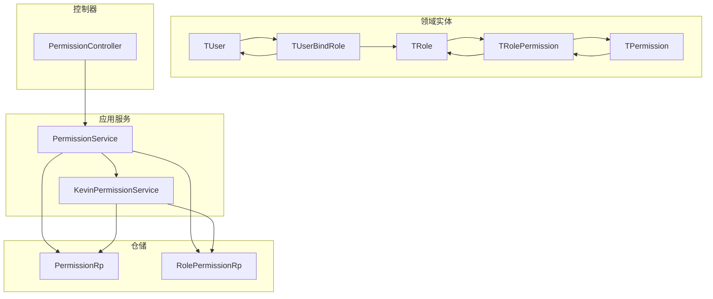
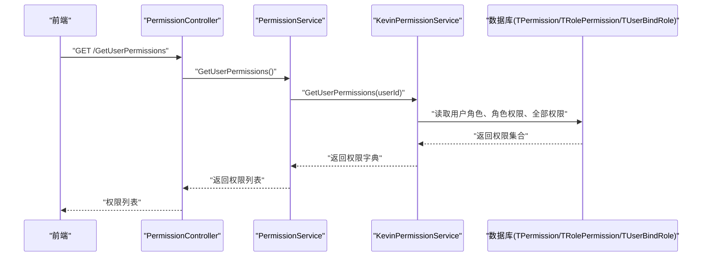
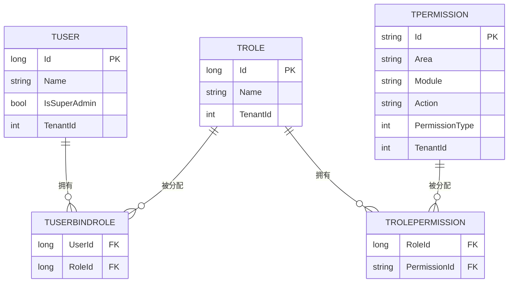
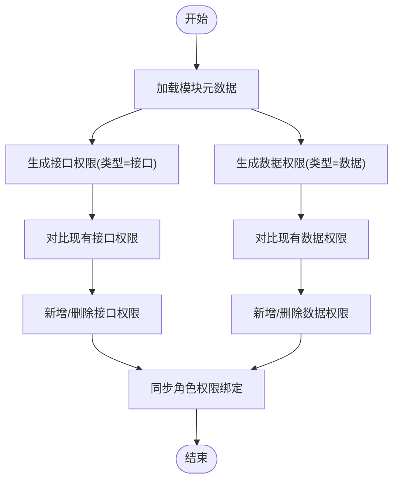
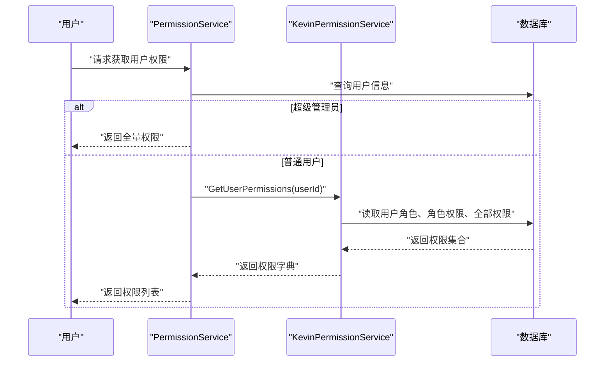
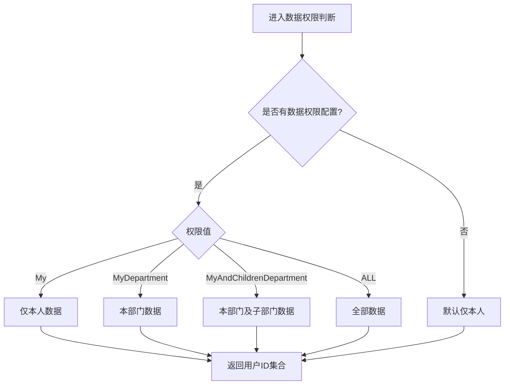
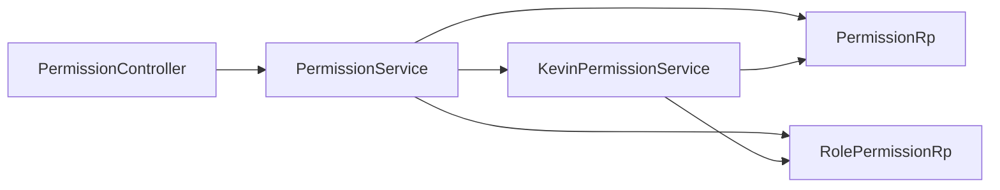

# RBAC权限模型

<cite>
**本文引用的文件**
- [TPermission.cs](file://Kevin/Domain/Entities/TPermission.cs)
- [TRole.cs](file://Kevin/Domain/Entities/TRole.cs)
- [TUser.cs](file://Kevin/Domain/Entities/TUser.cs)
- [TRolePermission.cs](file://Kevin/Domain/Entities/TRolePermission.cs)
- [TUserBindRole.cs](file://Kevin/Domain/Entities/TUserBindRole.cs)
- [PermissionService.cs](file://Kevin/Application/Services/PermissionService.cs)
- [KevinPermissionService.cs](file://Kevin/Application/Services/KevinPermissionService.cs)
- [DataPermissionActionConst.cs](file://Kevin/kevin.Module/kevin.Permission/Permission/Enums/DataPermissionActionConst.cs)
- [TPermissionBaseDatas.cs](file://Kevin/Domain/BaseDatas/TPermissionBaseDatas.cs)
- [TRoleBaseData.cs](file://Kevin/Domain/BaseDatas/TRoleBaseData.cs)
- [TUserBaseData.cs](file://Kevin/Domain/BaseDatas/TUserBaseData.cs)
- [PermissionController.cs](file://Kevin/ Kevin.Web.Basics/Controllers/PermissionController.cs)
- [PermissionRp.cs](file://Kevin/RepositorieRps/Repositories/PermissionRp.cs)
- [RolePermissionRp.cs](file://Kevin/RepositorieRps/Repositories/RolePermissionRp.cs)
</cite>

## 目录
1. [简介](#简介)
2. [项目结构](#项目结构)
3. [核心组件](#核心组件)
4. [架构总览](#架构总览)
5. [详细组件分析](#详细组件分析)
6. [依赖关系分析](#依赖关系分析)
7. [性能考量](#性能考量)
8. [故障排查指南](#故障排查指南)
9. [结论](#结论)
10. [附录：扩展与自定义指南](#附录：扩展与自定义指南)

## 简介
本系统采用基于角色的访问控制（RBAC）模型，围绕“用户—角色—权限”三元关系构建。权限分为功能权限与数据权限两类：
- 功能权限：控制对菜单、接口、操作等功能的可见性与可执行性。
- 数据权限：控制对数据范围（如仅本人、本部门、本部门及子部门、全部）的访问范围。

系统通过“角色—权限”关联实现权限继承：用户继承其所有角色的权限集合；超级管理员拥有全量权限。权限初始化支持从模块元数据自动同步接口权限与数据权限，并允许手动维护菜单类权限。

## 项目结构
权限相关代码分布在领域实体、应用服务、仓储与控制器层：
- 领域实体：定义用户、角色、权限及其绑定关系。
- 应用服务：提供权限初始化、查询、编辑、鉴权等能力。
- 仓储：封装对权限与角色权限表的增删改查。
- 控制器：对外暴露权限管理API。

图表来源
- [TUser.cs:1-99](file://Kevin/Domain/Entities/TUser.cs#L1-L99)
- [TRole.cs:1-41](file://Kevin/Domain/Entities/TRole.cs#L1-L41)
- [TPermission.cs:1-154](file://Kevin/Domain/Entities/TPermission.cs#L1-L154)
- [TUserBindRole.cs:1-22](file://Kevin/Domain/Entities/TUserBindRole.cs#L1-L22)
- [TRolePermission.cs:1-29](file://Kevin/Domain/Entities/TRolePermission.cs#L1-L29)
- [PermissionService.cs:1-434](file://Kevin/Application/Services/PermissionService.cs#L1-L434)
- [KevinPermissionService.cs:1-87](file://Kevin/Application/Services/KevinPermissionService.cs#L1-L87)
- [PermissionRp.cs:1-10](file://Kevin/RepositorieRps/Repositories/PermissionRp.cs#L1-L10)
- [RolePermissionRp.cs:1-10](file://Kevin/RepositorieRps/Repositories/RolePermissionRp.cs#L1-L10)
- [PermissionController.cs:123-164](file://Kevin/ Kevin.Web.Basics/Controllers/PermissionController.cs#L123-L164)

章节来源
- [TUser.cs:1-99](file://Kevin/Domain/Entities/TUser.cs#L1-L99)
- [TRole.cs:1-41](file://Kevin/Domain/Entities/TRole.cs#L1-L41)
- [TPermission.cs:1-154](file://Kevin/Domain/Entities/TPermission.cs#L1-L154)
- [TUserBindRole.cs:1-22](file://Kevin/Domain/Entities/TUserBindRole.cs#L1-L22)
- [TRolePermission.cs:1-29](file://Kevin/Domain/Entities/TRolePermission.cs#L1-L29)
- [PermissionService.cs:1-434](file://Kevin/Application/Services/PermissionService.cs#L1-L434)
- [KevinPermissionService.cs:1-87](file://Kevin/Application/Services/KevinPermissionService.cs#L1-L87)
- [PermissionRp.cs:1-10](file://Kevin/RepositorieRps/Repositories/PermissionRp.cs#L1-L10)
- [RolePermissionRp.cs:1-10](file://Kevin/RepositorieRps/Repositories/RolePermissionRp.cs#L1-L10)
- [PermissionController.cs:123-164](file://Kevin/ Kevin.Web.Basics/Controllers/PermissionController.cs#L123-L164)

## 核心组件
- 权限实体 TPermission：承载权限标识、区域/模块/动作、HTTP方法、是否手动添加、序号、图标、租户ID、权限类型（菜单/功能/数据/接口）。
- 角色实体 TRole：角色名称、备注、租户隔离。
- 用户实体 TUser：用户名、状态、是否超级管理员、密码哈希、第三方关联ID等。
- 用户-角色绑定 TUserBindRole：多对多关系，记录用户所属角色。
- 角色-权限绑定 TRolePermission：多对多关系，记录角色拥有的权限。
- 权限服务 PermissionService：负责权限初始化（接口/数据）、分页查询、编辑、删除、获取角色权限树、计算当前用户权限集。
- 鉴权服务 KevinPermissionService：聚合用户角色、角色权限，生成用户权限字典，提供按权限ID的访问校验。

章节来源
- [TPermission.cs:1-154](file://Kevin/Domain/Entities/TPermission.cs#L1-L154)
- [TRole.cs:1-41](file://Kevin/Domain/Entities/TRole.cs#L1-L41)
- [TUser.cs:1-99](file://Kevin/Domain/Entities/TUser.cs#L1-L99)
- [TUserBindRole.cs:1-22](file://Kevin/Domain/Entities/TUserBindRole.cs#L1-L22)
- [TRolePermission.cs:1-29](file://Kevin/Domain/Entities/TRolePermission.cs#L1-L29)
- [PermissionService.cs:1-434](file://Kevin/Application/Services/PermissionService.cs#L1-L434)
- [KevinPermissionService.cs:1-87](file://Kevin/Application/Services/KevinPermissionService.cs#L1-L87)

## 架构总览
下图展示了RBAC在系统中的调用链路与数据流向：前端通过控制器调用权限服务，服务通过仓储访问数据库，同时使用鉴权服务进行权限判定。

图表来源
- [PermissionController.cs:123-164](file://Kevin/ Kevin.Web.Basics/Controllers/PermissionController.cs#L123-L164)
- [PermissionService.cs:416-430](file://Kevin/Application/Services/PermissionService.cs#L416-L430)
- [KevinPermissionService.cs:50-84](file://Kevin/Application/Services/KevinPermissionService.cs#L50-L84)

## 详细组件分析

### 实体与关系设计
- 用户与角色：通过 TUserBindRole 建立多对多关系，一个用户可拥有多个角色。
- 角色与权限：通过 TRolePermission 建立多对多关系，一个角色可拥有多个权限。
- 权限实体包含租户隔离字段 TenantId，确保多租户环境下的权限隔离。
- 权限类型 PermissionType：区分菜单、功能、数据、接口四类权限。

图表来源
- [TUser.cs:1-99](file://Kevin/Domain/Entities/TUser.cs#L1-L99)
- [TRole.cs:1-41](file://Kevin/Domain/Entities/TRole.cs#L1-L41)
- [TPermission.cs:1-154](file://Kevin/Domain/Entities/TPermission.cs#L1-L154)
- [TUserBindRole.cs:1-22](file://Kevin/Domain/Entities/TUserBindRole.cs#L1-L22)
- [TRolePermission.cs:1-29](file://Kevin/Domain/Entities/TRolePermission.cs#L1-L29)

章节来源
- [TUser.cs:1-99](file://Kevin/Domain/Entities/TUser.cs#L1-L99)
- [TRole.cs:1-41](file://Kevin/Domain/Entities/TRole.cs#L1-L41)
- [TPermission.cs:1-154](file://Kevin/Domain/Entities/TPermission.cs#L1-L154)
- [TUserBindRole.cs:1-22](file://Kevin/Domain/Entities/TUserBindRole.cs#L1-L22)
- [TRolePermission.cs:1-29](file://Kevin/Domain/Entities/TRolePermission.cs#L1-L29)

### 权限初始化与同步机制
- 接口权限：从全局模块元数据生成，设置权限类型为接口，并按租户+区域+模块+动作构造唯一ID。
- 数据权限：按模块维度为每种数据范围（仅本人、本部门、本部门及子部门、全部）生成数据权限项。
- 同步策略：对比现有权限集合，增量新增、删除不再存在的权限，并清理对应的角色权限绑定。

图表来源
- [PermissionService.cs:29-79](file://Kevin/Application/Services/PermissionService.cs#L29-L79)
- [PermissionService.cs:88-123](file://Kevin/Application/Services/PermissionService.cs#L88-L123)

章节来源
- [PermissionService.cs:29-123](file://Kevin/Application/Services/PermissionService.cs#L29-L123)

### 权限继承与用户权限计算
- 用户权限继承：用户通过其角色继承所有角色拥有的权限。
- 超级管理员：直接返回全量权限，跳过常规权限计算。
- 权限键格式：以“租户ID/区域/模块/动作”作为唯一标识，便于跨租户隔离与细粒度控制。

图表来源
- [PermissionService.cs:416-430](file://Kevin/Application/Services/PermissionService.cs#L416-L430)
- [KevinPermissionService.cs:50-84](file://Kevin/Application/Services/KevinPermissionService.cs#L50-L84)

章节来源
- [PermissionService.cs:416-430](file://Kevin/Application/Services/PermissionService.cs#L416-L430)
- [KevinPermissionService.cs:50-84](file://Kevin/Application/Services/KevinPermissionService.cs#L50-L84)

### 数据权限与作用域
- 数据权限类型常量：仅本人、本部门、本部门及子部门、全部。
- 作用域解析：根据当前用户的数据权限配置，动态过滤可访问的用户或数据范围。

图表来源
- [DataPermissionActionConst.cs:1-31](file://Kevin/kevin.Module/kevin.Permission/Permission/Enums/DataPermissionActionConst.cs#L1-L31)
- [UserService.cs:800-840](file://Kevin/Application/Services/UserService.cs#L800-L840)

章节来源
- [DataPermissionActionConst.cs:1-31](file://Kevin/kevin.Module/kevin.Permission/Permission/Enums/DataPermissionActionConst.cs#L1-L31)
- [UserService.cs:800-840](file://Kevin/Application/Services/UserService.cs#L800-L840)

### API与控制器
- 提供获取全部权限ID、获取角色对应权限树、编辑角色权限、获取登录用户权限等接口。
- 部分接口标注跳过权限校验，用于系统初始化或基础信息查询。

章节来源
- [PermissionController.cs:123-164](file://Kevin/ Kevin.Web.Basics/Controllers/PermissionController.cs#L123-L164)

## 依赖关系分析
- 控制器依赖应用服务，应用服务依赖仓储与鉴权服务。
- 鉴权服务直接访问数据库上下文，聚合用户角色与权限。
- 仓储封装对权限表与角色权限表的CRUD操作。

图表来源
- [PermissionController.cs:123-164](file://Kevin/ Kevin.Web.Basics/Controllers/PermissionController.cs#L123-L164)
- [PermissionService.cs:1-434](file://Kevin/Application/Services/PermissionService.cs#L1-L434)
- [KevinPermissionService.cs:1-87](file://Kevin/Application/Services/KevinPermissionService.cs#L1-L87)
- [PermissionRp.cs:1-10](file://Kevin/RepositorieRps/Repositories/PermissionRp.cs#L1-L10)
- [RolePermissionRp.cs:1-10](file://Kevin/RepositorieRps/Repositories/RolePermissionRp.cs#L1-L10)

章节来源
- [PermissionController.cs:123-164](file://Kevin/ Kevin.Web.Basics/Controllers/PermissionController.cs#L123-L164)
- [PermissionService.cs:1-434](file://Kevin/Application/Services/PermissionService.cs#L1-L434)
- [KevinPermissionService.cs:1-87](file://Kevin/Application/Services/KevinPermissionService.cs#L1-L87)
- [PermissionRp.cs:1-10](file://Kevin/RepositorieRps/Repositories/PermissionRp.cs#L1-L10)
- [RolePermissionRp.cs:1-10](file://Kevin/RepositorieRps/Repositories/RolePermissionRp.cs#L1-L10)

## 性能考量
- 权限初始化采用批量新增与删除，减少数据库往返次数。
- 用户权限计算时先获取全部权限ID，再与角色权限取交集，避免多次查询。
- 建议对常用查询路径增加缓存（如用户权限字典），降低高频鉴权开销。
- 数据权限作用域计算应结合索引优化（如部门树、用户ID集合）。

[本节未直接分析具体文件]

## 故障排查指南
- 非手动权限不可修改或删除：当权限为系统自动生成（IsManual=false）时，更新或删除会抛出友好异常。
- 重复权限校验：相同区域、模块、动作不允许重复创建。
- 超级管理员保护：超级管理员用户不可删除。
- 权限不存在：查询单个权限时若不存在将抛出友好异常。

章节来源
- [TPermission.cs:145-151](file://Kevin/Domain/Entities/TPermission.cs#L145-L151)
- [PermissionService.cs:208-219](file://Kevin/Application/Services/PermissionService.cs#L208-L219)
- [PermissionService.cs:226-266](file://Kevin/Application/Services/PermissionService.cs#L226-L266)
- [PermissionService.cs:175-200](file://Kevin/Application/Services/PermissionService.cs#L175-L200)
- [TUser.cs:88-95](file://Kevin/Domain/Entities/TUser.cs#L88-L95)

## 结论
本系统的RBAC模型通过清晰的角色—权限绑定与用户—角色绑定实现了灵活的权限继承与控制。权限类型覆盖菜单、功能、数据、接口，满足复杂业务场景。权限初始化机制保证系统一致性，数据权限作用域提供细粒度的数据访问控制。建议在关键路径引入缓存以提升性能，并通过完善的测试保障权限变更的正确性。

[本节未直接分析具体文件]

## 附录：扩展与自定义指南
- 扩展权限类型：
  - 在权限实体中扩展 PermissionType 枚举或新增字段，并在权限初始化逻辑中处理新类型的生成与同步。
  - 参考接口权限与数据权限的初始化流程，为新类型编写对应的生成与同步逻辑。
- 自定义数据权限作用域：
  - 在数据权限常量集中新增作用域键与显示名，并在作用域解析逻辑中补充分支处理。
  - 参考现有作用域的实现，确保能正确映射到用户或部门范围。
- 自定义权限校验：
  - 在鉴权服务中扩展 IsAccess 方法，支持新的权限ID格式或校验规则。
  - 结合租户ID与权限ID前缀，确保多租户隔离。
- 种子数据与初始权限：
  - 通过基础数据类注入默认菜单权限与角色，便于快速搭建系统。
  - 参考现有基础数据配置，按需扩展默认权限与角色。

章节来源
- [TPermission.cs:1-154](file://Kevin/Domain/Entities/TPermission.cs#L1-L154)
- [DataPermissionActionConst.cs:1-31](file://Kevin/kevin.Module/kevin.Permission/Permission/Enums/DataPermissionActionConst.cs#L1-L31)
- [KevinPermissionService.cs:70-84](file://Kevin/Application/Services/KevinPermissionService.cs#L70-L84)
- [TPermissionBaseDatas.cs:1-444](file://Kevin/Domain/BaseDatas/TPermissionBaseDatas.cs#L1-L444)
- [TRoleBaseData.cs:1-14](file://Kevin/Domain/BaseDatas/TRoleBaseData.cs#L1-L14)
- [TUserBaseData.cs:1-18](file://Kevin/Domain/BaseDatas/TUserBaseData.cs#L1-L18)