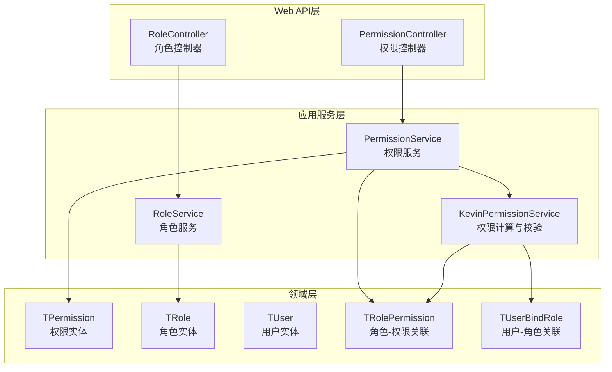
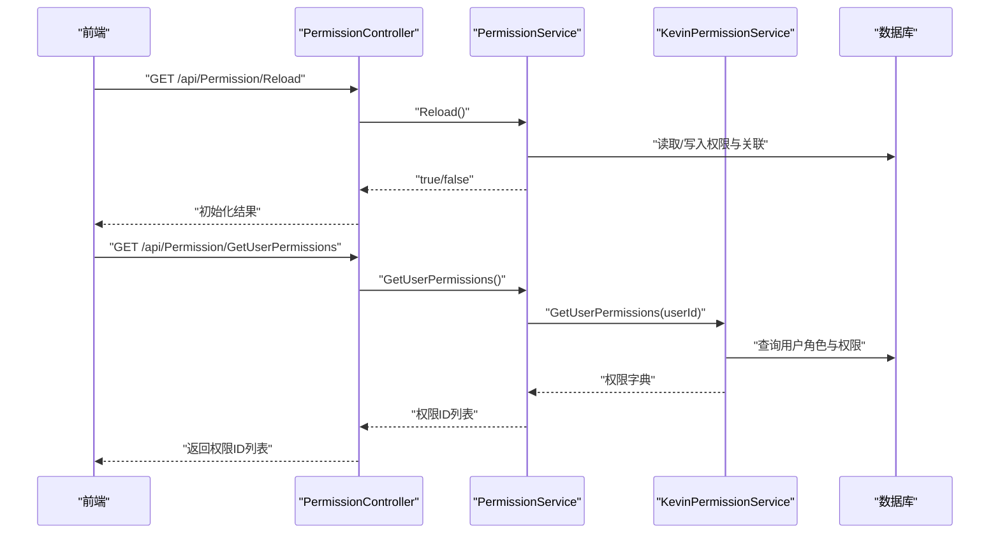
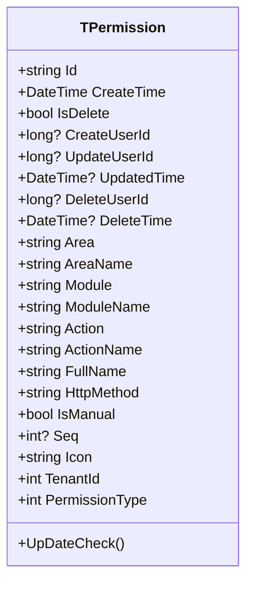
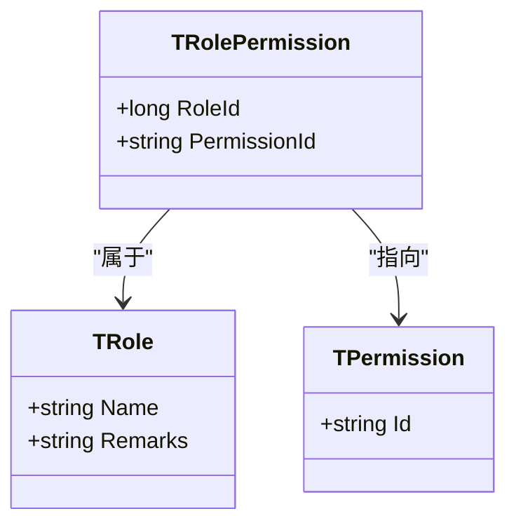
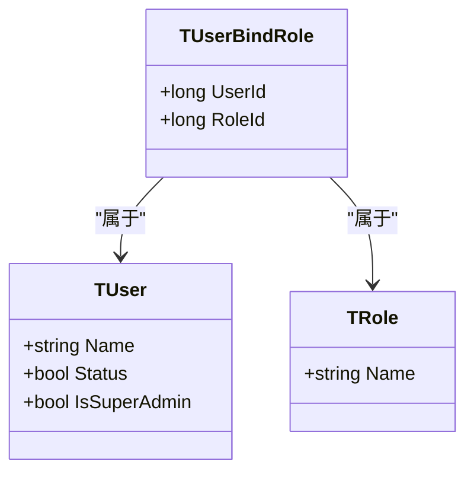
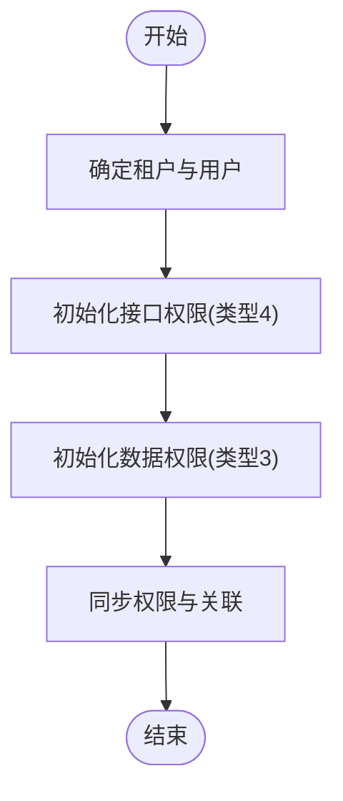
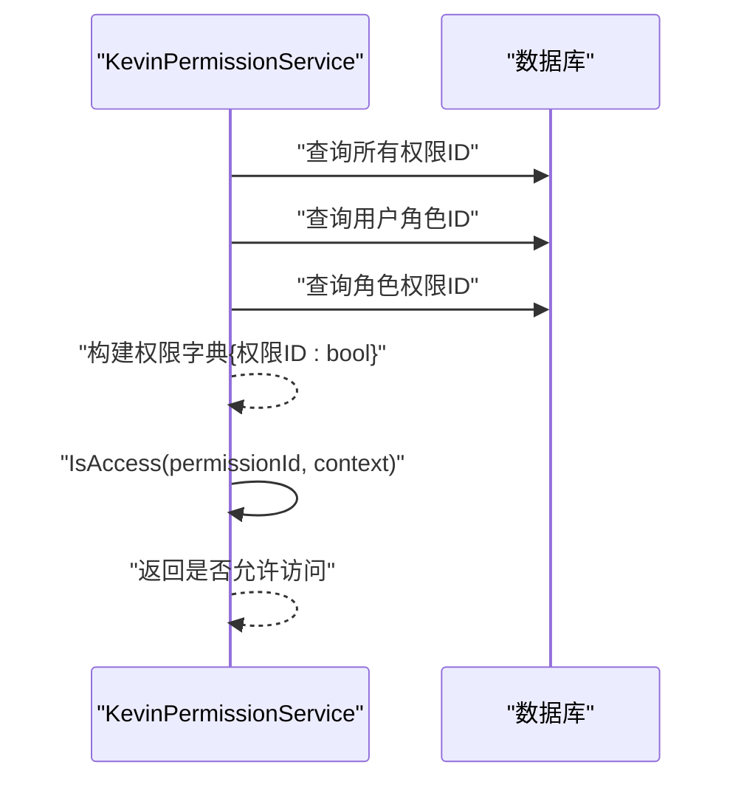
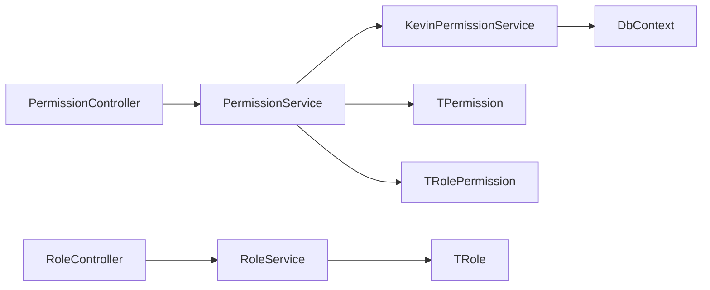

# 权限管理系统

<cite>
**本文引用的文件**
- [TPermission.cs](file://Kevin/Domain/Entities/TPermission.cs)
- [TRole.cs](file://Kevin/Domain/Entities/TRole.cs)
- [TUser.cs](file://Kevin/Domain/Entities/TUser.cs)
- [TRolePermission.cs](file://Kevin/Domain/Entities/TRolePermission.cs)
- [TUserBindRole.cs](file://Kevin/Domain/Entities/TUserBindRole.cs)
- [PermissionService.cs](file://Kevin/Application/Services/PermissionService.cs)
- [RoleService.cs](file://Kevin/Application/Services/RoleService.cs)
- [KevinPermissionService.cs](file://Kevin/Application/Services/KevinPermissionService.cs)
- [PermissionController.cs](file://Kevin/ Kevin.Web.Basics/Controllers/PermissionController.cs)
- [RoleController.cs](file://Kevin/ Kevin.Web.Basics/Controllers/RoleController.cs)
</cite>

## 目录
1. [简介](#简介)
2. [项目结构](#项目结构)
3. [核心组件](#核心组件)
4. [架构总览](#架构总览)
5. [详细组件分析](#详细组件分析)
6. [依赖关系分析](#依赖关系分析)
7. [性能考虑](#性能考虑)
8. [故障排查指南](#故障排查指南)
9. [结论](#结论)
10. [附录](#附录)

## 简介
本权限管理系统采用基于角色的访问控制（RBAC）模型，围绕“用户-角色-权限”的三元关系构建。系统支持菜单权限、功能权限、数据权限与接口权限四类权限类型，并提供：
- 权限实体设计与初始化机制
- 角色与权限的关联管理
- 用户与角色的绑定
- 登录用户的权限计算与校验
- 动态菜单生成与按钮级权限控制的前后端协作方式
- 权限配置界面与API接口规范
- 权限继承、数据权限、功能权限的配置示例与最佳实践

## 项目结构
权限相关代码主要分布在以下层次：
- 领域层（Domain）：定义权限、角色、用户及其关联实体
- 应用服务层（Application）：实现权限初始化、分页查询、编辑、角色权限分配、用户权限获取等业务流程
- Web API层（Web.Basics）：暴露RESTful接口，承载前端调用
- 权限模块（kevin.Permission）：提供权限校验能力与扩展点（如跳过鉴权、权限注解等）

图表来源
- [TPermission.cs:1-154](file://Kevin/Domain/Entities/TPermission.cs#L1-L154)
- [TRole.cs:1-41](file://Kevin/Domain/Entities/TRole.cs#L1-L41)
- [TUser.cs:1-99](file://Kevin/Domain/Entities/TUser.cs#L1-L99)
- [TRolePermission.cs:1-29](file://Kevin/Domain/Entities/TRolePermission.cs#L1-L29)
- [TUserBindRole.cs:1-22](file://Kevin/Domain/Entities/TUserBindRole.cs#L1-L22)
- [PermissionService.cs:1-434](file://Kevin/Application/Services/PermissionService.cs#L1-L434)
- [RoleService.cs:1-116](file://Kevin/Application/Services/RoleService.cs#L1-L116)
- [KevinPermissionService.cs:1-87](file://Kevin/Application/Services/KevinPermissionService.cs#L1-L87)
- [PermissionController.cs:1-165](file://Kevin/ Kevin.Web.Basics/Controllers/PermissionController.cs#L1-L165)
- [RoleController.cs:1-78](file://Kevin/ Kevin.Web.Basics/Controllers/RoleController.cs#L1-L78)

章节来源
- [TPermission.cs:1-154](file://Kevin/Domain/Entities/TPermission.cs#L1-L154)
- [TRole.cs:1-41](file://Kevin/Domain/Entities/TRole.cs#L1-L41)
- [TUser.cs:1-99](file://Kevin/Domain/Entities/TUser.cs#L1-L99)
- [TRolePermission.cs:1-29](file://Kevin/Domain/Entities/TRolePermission.cs#L1-L29)
- [TUserBindRole.cs:1-22](file://Kevin/Domain/Entities/TUserBindRole.cs#L1-L22)
- [PermissionService.cs:1-434](file://Kevin/Application/Services/PermissionService.cs#L1-L434)
- [RoleService.cs:1-116](file://Kevin/Application/Services/RoleService.cs#L1-L116)
- [KevinPermissionService.cs:1-87](file://Kevin/Application/Services/KevinPermissionService.cs#L1-L87)
- [PermissionController.cs:1-165](file://Kevin/ Kevin.Web.Basics/Controllers/PermissionController.cs#L1-L165)
- [RoleController.cs:1-78](file://Kevin/ Kevin.Web.Basics/Controllers/RoleController.cs#L1-L78)

## 核心组件
- 权限实体（TPermission）：描述权限的维度包括区域、模块、动作、HTTP方法、图标、序号、是否手动添加、租户ID以及权限类型（菜单/功能/数据/接口）。
- 角色实体（TRole）：承载角色名称与备注，作为权限的集合容器。
- 用户实体（TUser）：包含基础信息与状态，支持超级管理员标记。
- 角色-权限关联（TRolePermission）：将角色与权限建立多对多关系。
- 用户-角色关联（TUserBindRole）：将用户与角色建立多对多关系。
- 权限服务（PermissionService）：负责权限初始化、分页查询、编辑、删除、角色权限批量分配、用户权限列表获取等。
- 角色服务（RoleService）：负责角色的分页查询、新增/编辑、删除、按ID查询、全量获取。
- 权限计算与校验（KevinPermissionService）：根据当前用户与其角色，计算所有可用权限并支持按权限ID进行访问校验。

章节来源
- [TPermission.cs:1-154](file://Kevin/Domain/Entities/TPermission.cs#L1-L154)
- [TRole.cs:1-41](file://Kevin/Domain/Entities/TRole.cs#L1-L41)
- [TUser.cs:1-99](file://Kevin/Domain/Entities/TUser.cs#L1-L99)
- [TRolePermission.cs:1-29](file://Kevin/Domain/Entities/TRolePermission.cs#L1-L29)
- [TUserBindRole.cs:1-22](file://Kevin/Domain/Entities/TUserBindRole.cs#L1-L22)
- [PermissionService.cs:1-434](file://Kevin/Application/Services/PermissionService.cs#L1-L434)
- [RoleService.cs:1-116](file://Kevin/Application/Services/RoleService.cs#L1-L116)
- [KevinPermissionService.cs:1-87](file://Kevin/Application/Services/KevinPermissionService.cs#L1-L87)

## 架构总览
系统通过控制器暴露REST接口，调用应用服务完成业务逻辑，最终持久化到数据库。权限初始化会扫描全局模块与动作，自动生成接口权限与数据权限，并与现有权限进行同步（新增/删除）。用户登录后，系统依据其角色聚合权限，形成权限字典供前后端使用。

图表来源
- [PermissionController.cs:30-162](file://Kevin/ Kevin.Web.Basics/Controllers/PermissionController.cs#L30-L162)
- [PermissionService.cs:25-430](file://Kevin/Application/Services/PermissionService.cs#L25-L430)
- [KevinPermissionService.cs:13-84](file://Kevin/Application/Services/KevinPermissionService.cs#L13-L84)

## 详细组件分析

### 权限实体设计（TPermission）
- 关键字段：区域（Area/AreaName）、模块（Module/ModuleName）、动作（Action/ActionName）、HTTP方法（HttpMethod）、图标（Icon）、序号（Seq）、是否手动添加（IsManual）、租户ID（TenantId）、权限类型（PermissionType）。
- 权限类型说明：
  - 1：菜单权限
  - 2：功能权限
  - 3：数据权限
  - 4：接口权限
- 约束与校验：非手动添加的权限禁止修改；删除时同样受限于是否为系统权限。

图表来源
- [TPermission.cs:1-154](file://Kevin/Domain/Entities/TPermission.cs#L1-L154)

章节来源
- [TPermission.cs:1-154](file://Kevin/Domain/Entities/TPermission.cs#L1-L154)

### 角色与权限关联（TRolePermission）
- 作用：维护角色与权限的多对多关系。
- 字段：RoleId、PermissionId，以及审计字段。

图表来源
- [TRolePermission.cs:1-29](file://Kevin/Domain/Entities/TRolePermission.cs#L1-L29)
- [TRole.cs:1-41](file://Kevin/Domain/Entities/TRole.cs#L1-L41)
- [TPermission.cs:1-154](file://Kevin/Domain/Entities/TPermission.cs#L1-L154)

章节来源
- [TRolePermission.cs:1-29](file://Kevin/Domain/Entities/TRolePermission.cs#L1-L29)
- [TRole.cs:1-41](file://Kevin/Domain/Entities/TRole.cs#L1-L41)
- [TPermission.cs:1-154](file://Kevin/Domain/Entities/TPermission.cs#L1-L154)

### 用户与角色绑定（TUserBindRole）
- 作用：维护用户与角色的多对多关系。
- 字段：UserId、RoleId，以及审计字段。

图表来源
- [TUserBindRole.cs:1-22](file://Kevin/Domain/Entities/TUserBindRole.cs#L1-L22)
- [TUser.cs:1-99](file://Kevin/Domain/Entities/TUser.cs#L1-L99)
- [TRole.cs:1-41](file://Kevin/Domain/Entities/TRole.cs#L1-L41)

章节来源
- [TUserBindRole.cs:1-22](file://Kevin/Domain/Entities/TUserBindRole.cs#L1-L22)
- [TUser.cs:1-99](file://Kevin/Domain/Entities/TUser.cs#L1-L99)
- [TRole.cs:1-41](file://Kevin/Domain/Entities/TRole.cs#L1-L41)

### 权限服务（PermissionService）
- 权限初始化：
  - Reload：从全局模块与动作生成接口权限（类型4），并执行数据权限初始化。
  - ReloadDataPermission：为每个模块生成数据权限动作（类型3）。
  - InDtoAddPermission：对比现有权限，增量新增与删除，并清理关联的角色权限。
- 权限CRUD：
  - GetPageData：分页查询权限，支持关键词搜索。
  - GetDetails/Del/AddEdit：单条权限详情、删除、新增/编辑（含重复性校验与手动权限保护）。
  - GetAllPermissions/GetAllPermissionIds：导出全部权限或仅ID列表。
- 角色权限分配：
  - GetAllAreaPermissions：按权限类型-区域-模块-动作层级组织，并标注角色已勾选项。
  - EditAllAreaPermissions：批量更新角色权限，计算差集后新增或删除。
- 用户权限获取：
  - GetUserPermissions：若为超级管理员则返回全部权限，否则返回其角色聚合的权限ID列表。

图表来源
- [PermissionService.cs:25-123](file://Kevin/Application/Services/PermissionService.cs#L25-L123)

章节来源
- [PermissionService.cs:25-123](file://Kevin/Application/Services/PermissionService.cs#L25-L123)
- [PermissionService.cs:126-430](file://Kevin/Application/Services/PermissionService.cs#L126-L430)

### 角色服务（RoleService）
- 分页查询角色：支持关键词过滤，返回分页数据。
- 新增/编辑角色：创建新角色或更新已有角色信息。
- 删除角色：软删除，防止删除种子数据。
- 获取角色列表与详情：用于前端下拉选择与编辑回显。

章节来源
- [RoleService.cs:14-116](file://Kevin/Application/Services/RoleService.cs#L14-L116)

### 权限计算与校验（KevinPermissionService）
- 获取所有权限ID：用于构建权限全集。
- 获取用户角色ID：根据用户ID查询其绑定的角色。
- 获取角色权限：根据角色ID集合查询对应的权限ID。
- 计算用户权限字典：将所有权限ID映射为布尔值，表示是否拥有。
- 访问校验：结合当前租户ID与权限ID进行匹配，超级管理员直接放行。

图表来源
- [KevinPermissionService.cs:13-84](file://Kevin/Application/Services/KevinPermissionService.cs#L13-L84)

章节来源
- [KevinPermissionService.cs:13-84](file://Kevin/Application/Services/KevinPermissionService.cs#L13-L84)

### API接口规范（权限与角色）
- 权限管理（/api/Permission）
  - GET /Reload：初始化权限（跳过鉴权）
  - POST /GetPageData：分页查询权限
  - GET /GetDetails：获取单个权限详情
  - DELETE /Del：删除权限（系统权限不可删）
  - POST /Edit：编辑权限
  - POST /Add：新增权限
  - GET /GetAllPermissions：获取所有权限（跳过鉴权）
  - GET /GetAllPermissionIds：获取所有权限ID（跳过鉴权）
  - GET /GetAllAreaPermissions：获取角色对应权限树（跳过鉴权）
  - POST /EditAllAreaPermissions：编辑角色对应权限
  - GET /GetUserPermissions：获取登录用户权限（跳过鉴权）
- 角色管理（/api/Role）
  - POST /GetRolePage：分页查询角色
  - POST /AddEidt：新增或编辑角色
  - DELETE /DeleteRole：删除角色
  - GET /GetRoleById：获取指定角色
  - GET /GetAllRoles：获取所有角色

章节来源
- [PermissionController.cs:30-162](file://Kevin/ Kevin.Web.Basics/Controllers/PermissionController.cs#L30-L162)
- [RoleController.cs:29-75](file://Kevin/ Kevin.Web.Basics/Controllers/RoleController.cs#L29-L75)

### 前端权限指令与动态菜单
- 动态菜单生成：
  - 前端在登录后调用 /api/Permission/GetUserPermissions 获取权限ID列表。
  - 根据权限类型（菜单/功能）与区域-模块-动作层级，渲染侧边栏与页面元素。
- 按钮级权限控制：
  - 使用自定义指令（例如 v-permission="xxx"）检查当前用户是否具备对应权限ID。
  - 若无权限，隐藏或禁用按钮。
- 路由守卫：
  - 在进入页面之前校验所需权限，未授权则跳转至无权限提示页。

[本节为概念性说明，不直接分析具体文件]

### 权限继承、数据权限、功能权限配置示例与最佳实践
- 权限继承：
  - 通过角色组合实现继承效果：将父角色权限复制给子角色，或通过多个角色叠加获得更细粒度权限。
- 数据权限：
  - 为每个模块生成数据权限动作（如查看、编辑、删除、导出），并在角色中按需勾选，以控制数据可见性与操作范围。
- 功能权限：
  - 针对页面内特定功能（如导入、导出、审批）设置功能权限，配合前端指令控制按钮显示。
- 最佳实践：
  - 使用“手动添加”标识区分系统自动生成的权限与业务自定义权限，避免误改系统权限。
  - 定期执行权限初始化，确保新增模块与动作及时纳入权限体系。
  - 对敏感操作增加二次确认与日志记录。

[本节为概念性说明，不直接分析具体文件]

## 依赖关系分析
- 控制器依赖服务：
  - PermissionController 依赖 IPermissionService
  - RoleController 依赖 IRoleService
- 服务依赖领域实体与仓储：
  - PermissionService 依赖 TPermission、TRolePermission、IUserRp 等
  - RoleService 依赖 TRole
- 权限计算依赖数据库上下文：
  - KevinPermissionService 直接访问 DbContext 查询用户角色与权限

图表来源
- [PermissionController.cs:1-165](file://Kevin/ Kevin.Web.Basics/Controllers/PermissionController.cs#L1-L165)
- [RoleController.cs:1-78](file://Kevin/ Kevin.Web.Basics/Controllers/RoleController.cs#L1-L78)
- [PermissionService.cs:1-434](file://Kevin/Application/Services/PermissionService.cs#L1-L434)
- [RoleService.cs:1-116](file://Kevin/Application/Services/RoleService.cs#L1-L116)
- [KevinPermissionService.cs:1-87](file://Kevin/Application/Services/KevinPermissionService.cs#L1-L87)

章节来源
- [PermissionController.cs:1-165](file://Kevin/ Kevin.Web.Basics/Controllers/PermissionController.cs#L1-L165)
- [RoleController.cs:1-78](file://Kevin/ Kevin.Web.Basics/Controllers/RoleController.cs#L1-L78)
- [PermissionService.cs:1-434](file://Kevin/Application/Services/PermissionService.cs#L1-L434)
- [RoleService.cs:1-116](file://Kevin/Application/Services/RoleService.cs#L1-L116)
- [KevinPermissionService.cs:1-87](file://Kevin/Application/Services/KevinPermissionService.cs#L1-L87)

## 性能考虑
- 权限初始化：
  - 批量新增/删除权限与关联，减少数据库往返次数。
  - 使用分组与去重降低重复计算。
- 用户权限计算：
  - 先获取所有权限ID，再与用户角色权限取交集，构建字典便于快速查找。
- 分页查询：
  - 使用Skip/Take进行服务端分页，避免一次性加载大量数据。
- 缓存建议：
  - 可将用户权限字典缓存至内存或分布式缓存，缩短鉴权延迟（需考虑权限变更后的失效策略）。

[本节提供通用指导，不直接分析具体文件]

## 故障排查指南
- 权限无法修改/删除：
  - 检查是否为系统权限（IsManual=false），系统权限禁止修改或删除。
- 权限初始化无效：
  - 确认全局模块与动作配置是否正确，检查Reload与ReloadDataPermission的执行结果。
- 用户无权限：
  - 检查用户是否绑定角色，角色是否勾选相应权限，权限ID是否与租户前缀匹配。
- 超级管理员异常：
  - 超级管理员应拥有全部权限，若出现限制，检查IsSuperAdmin标志与权限计算逻辑。

章节来源
- [TPermission.cs:145-151](file://Kevin/Domain/Entities/TPermission.cs#L145-L151)
- [PermissionService.cs:208-219](file://Kevin/Application/Services/PermissionService.cs#L208-L219)
- [PermissionService.cs:25-123](file://Kevin/Application/Services/PermissionService.cs#L25-L123)
- [KevinPermissionService.cs:70-84](file://Kevin/Application/Services/KevinPermissionService.cs#L70-L84)

## 结论
本权限管理系统以RBAC为核心，通过清晰的实体设计与服务分层，实现了灵活的权限初始化、角色权限分配与用户权限计算。结合前后端的权限指令与路由守卫，可实现菜单与按钮级的精细化控制。建议在业务扩展中持续完善模块与动作定义，定期执行权限初始化，并结合缓存提升鉴权性能。

## 附录
- 权限类型对照：
  - 1：菜单权限
  - 2：功能权限
  - 3：数据权限
  - 4：接口权限
- 常用API路径：
  - /api/Permission/*：权限管理
  - /api/Role/*：角色管理

[本节为补充信息，不直接分析具体文件]