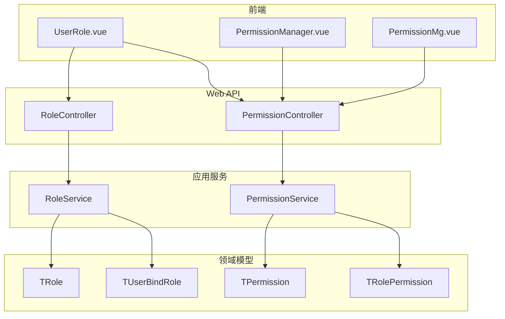
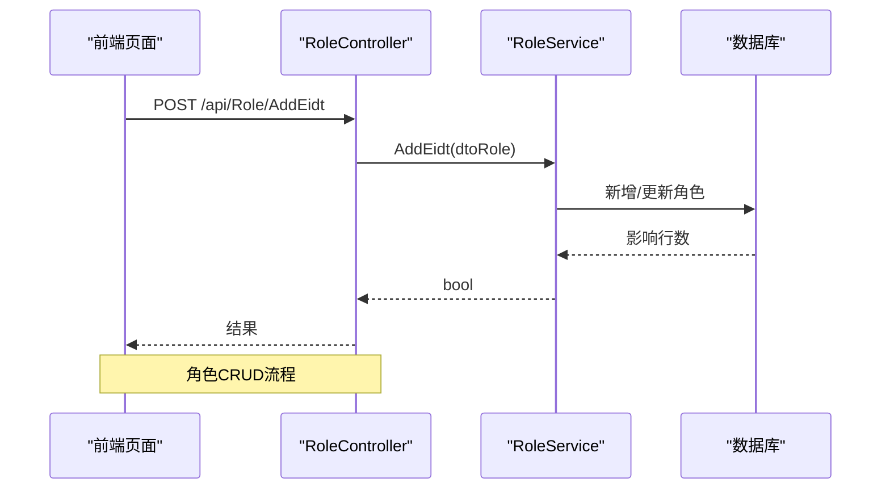
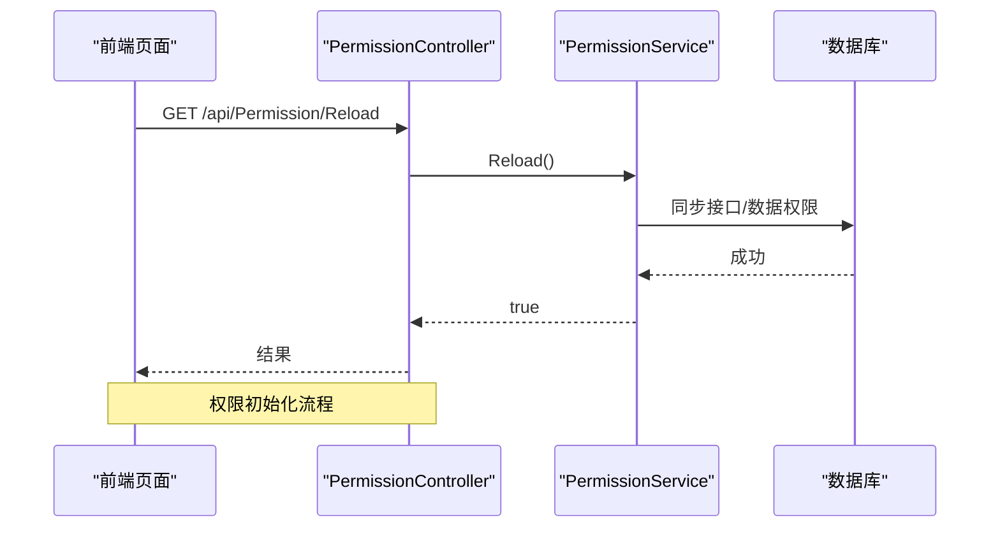
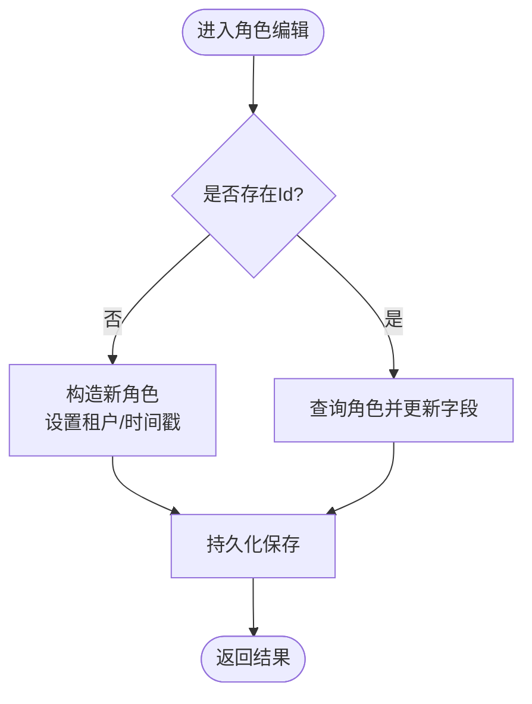
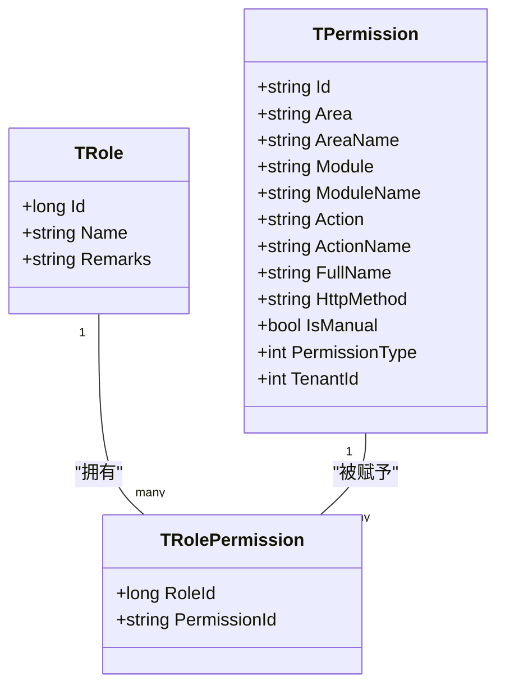
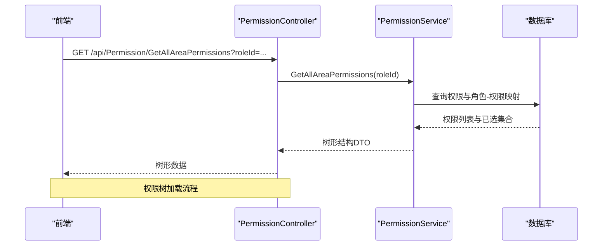
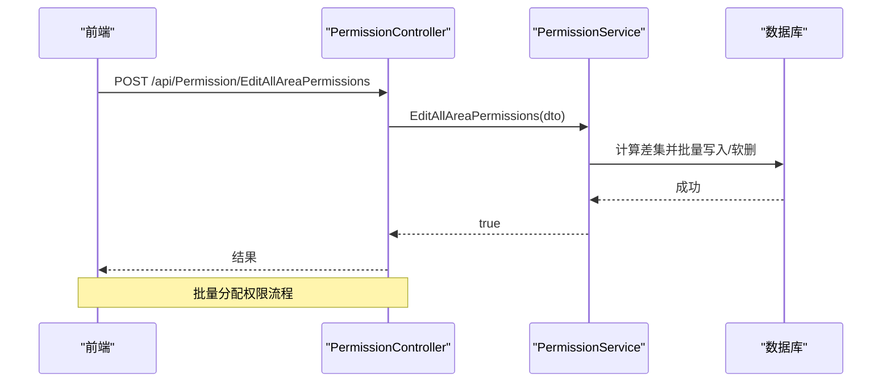
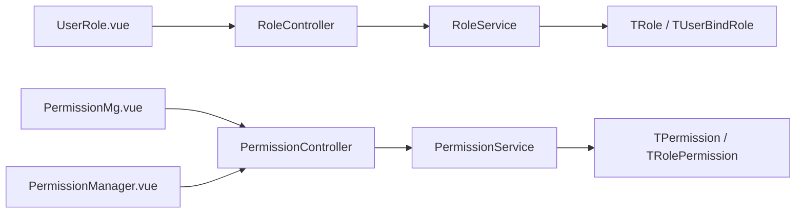

# 角色权限管理

<cite>
**本文引用的文件**
- [TRole.cs](file://Kevin/Domain/Entities/TRole.cs)
- [TPermission.cs](file://Kevin/Domain/Entities/TPermission.cs)
- [TRolePermission.cs](file://Kevin/Domain/Entities/TRolePermission.cs)
- [TUserBindRole.cs](file://Kevin/Domain/Entities/TUserBindRole.cs)
- [RoleService.cs](file://Kevin/Application/Services/RoleService.cs)
- [PermissionService.cs](file://Kevin/Application/Services/PermissionService.cs)
- [RoleController.cs](file://Kevin/ Kevin.Web.Basics/Controllers/RoleController.cs)
- [PermissionController.cs](file://Kevin/ Kevin.Web.Basics/Controllers/PermissionController.cs)
- [roleapi.js](file://vue/kevin.web.vue/src/api/roleapi.js)
- [permission.js](file://vue/kevin.web.vue/src/api/permission.js)
- [UserRole.vue](file://vue/kevin.web.vue/src/pages/UserRole.vue)
- [PermissionMg.vue](file://vue/kevin.web.vue/src/pages/PermissionMg.vue)
- [PermissionManager.vue](file://vue/kevin.web.vue/src/components/PermissionManager.vue)
- [TRoleBaseData.cs](file://Kevin/Domain/BaseDatas/TRoleBaseData.cs)
- [TPermissionBaseDatas.cs](file://Kevin/Domain/BaseDatas/TPermissionBaseDatas.cs)
</cite>

## 目录
1. [简介](#简介)
2. [项目结构](#项目结构)
3. [核心组件](#核心组件)
4. [架构总览](#架构总览)
5. [详细组件分析](#详细组件分析)
6. [依赖关系分析](#依赖关系分析)
7. [性能考虑](#性能考虑)
8. [故障排查指南](#故障排查指南)
9. [结论](#结论)
10. [附录：API 接口文档与前端使用说明](#附录api-接口文档与前端使用说明)

## 简介
本模块提供完整的角色与权限管理能力，包括角色的增删改查、权限的初始化与树形展示、批量分配、用户与角色的绑定解绑等。系统支持菜单、功能、数据、接口四类权限，并通过“区域-模块-动作”的层级组织权限，便于前端以树形结构进行可视化配置与管理。

## 项目结构
- 领域模型
  - 角色实体 TRole
  - 权限实体 TPermission（含区域、模块、动作、HTTP方法、类型、是否手动等）
  - 角色-权限关联 TRolePermission
  - 用户-角色关联 TUserBindRole
- 应用服务
  - RoleService：角色分页、新增/编辑、删除、按ID查询、获取全部
  - PermissionService：权限初始化（接口/数据）、分页查询、详情、新增/编辑、删除、按角色拉取权限树、批量保存、获取当前用户权限
- Web API
  - RoleController：对外暴露角色相关接口
  - PermissionController：对外暴露权限相关接口
- 前端
  - Vue 页面：UserRole.vue（角色管理）、PermissionMg.vue（权限管理）
  - 组件：PermissionManager.vue（权限树选择与保存）
  - API 封装：roleapi.js、permission.js

图表来源
- [RoleController.cs:1-78](file://Kevin/ Kevin.Web.Basics/Controllers/RoleController.cs#L1-L78)
- [PermissionController.cs:1-165](file://Kevin/ Kevin.Web.Basics/Controllers/PermissionController.cs#L1-L165)
- [RoleService.cs:1-116](file://Kevin/Application/Services/RoleService.cs#L1-L116)
- [PermissionService.cs:1-434](file://Kevin/Application/Services/PermissionService.cs#L1-L434)
- [TRole.cs:1-41](file://Kevin/Domain/Entities/TRole.cs#L1-L41)
- [TPermission.cs:1-154](file://Kevin/Domain/Entities/TPermission.cs#L1-L154)
- [TRolePermission.cs:1-29](file://Kevin/Domain/Entities/TRolePermission.cs#L1-L29)
- [TUserBindRole.cs:1-22](file://Kevin/Domain/Entities/TUserBindRole.cs#L1-L22)

章节来源
- [RoleController.cs:1-78](file://Kevin/ Kevin.Web.Basics/Controllers/RoleController.cs#L1-L78)
- [PermissionController.cs:1-165](file://Kevin/ Kevin.Web.Basics/Controllers/PermissionController.cs#L1-L165)
- [RoleService.cs:1-116](file://Kevin/Application/Services/RoleService.cs#L1-L116)
- [PermissionService.cs:1-434](file://Kevin/Application/Services/PermissionService.cs#L1-L434)

## 核心组件
- 角色管理
  - 分页查询、新增/编辑、删除、按ID查询、获取全部
  - 种子数据保护：内置管理员角色不可删除
- 权限管理
  - 初始化接口权限与数据权限
  - 分页查询、详情、新增/编辑、删除
  - 按角色拉取权限树（区域-模块-动作），并标记已选
  - 批量保存角色权限（增量添加、软删除未选中项）
  - 获取登录用户权限集合（超级管理员走统一权限服务）
- 用户与角色绑定
  - 通过 TUserBindRole 维护多对多关系（可结合业务扩展实现绑定/解绑）

章节来源
- [RoleService.cs:14-113](file://Kevin/Application/Services/RoleService.cs#L14-L113)
- [PermissionService.cs:25-431](file://Kevin/Application/Services/PermissionService.cs#L25-L431)
- [TRoleBaseData.cs:1-14](file://Kevin/Domain/BaseDatas/TRoleBaseData.cs#L1-L14)
- [TPermissionBaseDatas.cs:1-444](file://Kevin/Domain/BaseDatas/TPermissionBaseDatas.cs#L1-L444)

## 架构总览
后端采用控制器-服务-仓储-实体的分层设计；前端通过Vue页面调用API，使用树形组件完成权限勾选与提交。权限初始化时从全局模块定义生成接口权限，并基于数据权限常量生成数据权限条目。

图表来源
- [RoleController.cs:39-75](file://Kevin/ Kevin.Web.Basics/Controllers/RoleController.cs#L39-L75)
- [RoleService.cs:38-91](file://Kevin/Application/Services/RoleService.cs#L38-L91)

图表来源
- [PermissionController.cs:30-41](file://Kevin/ Kevin.Web.Basics/Controllers/PermissionController.cs#L30-L41)
- [PermissionService.cs:25-79](file://Kevin/Application/Services/PermissionService.cs#L25-L79)

## 详细组件分析

### 角色管理（创建、编辑、删除）
- 能力
  - 分页查询：支持关键字搜索（名称/备注）
  - 新增/编辑：根据Id判断新增或更新，自动填充租户与时间戳
  - 删除：软删除，并校验种子数据不可删除
  - 获取详情/全部：用于下拉选择等场景
- 关键点
  - 种子角色保护：内置管理员角色禁止删除
  - 租户隔离：所有操作均限定在当前租户范围

图表来源
- [RoleService.cs:38-91](file://Kevin/Application/Services/RoleService.cs#L38-L91)

章节来源
- [RoleService.cs:14-113](file://Kevin/Application/Services/RoleService.cs#L14-L113)
- [TRoleBaseData.cs:1-14](file://Kevin/Domain/BaseDatas/TRoleBaseData.cs#L1-L14)

### 权限管理（初始化、树形展示、批量分配）
- 能力
  - 初始化接口权限：扫描全局模块，生成接口级权限
  - 初始化数据权限：按区域+模块组合生成数据权限项
  - 分页查询与详情：支持按区域/模块/动作/全名检索
  - 新增/编辑：校验重复性，仅允许手动添加的权限被修改
  - 删除：仅允许删除手动添加的权限
  - 按角色拉取权限树：按类型-区域-模块-动作组织，并标注已选
  - 批量保存：计算差集，新增未选中的、软删除多余的
  - 获取当前用户权限：超级管理员走统一权限服务，否则按角色聚合
- 关键点
  - 权限类型：菜单(1)、功能(2)、数据(3)、接口(4)
  - 权限ID规则：租户/区域/模块/动作
  - 手动标记：IsManual=true 表示由人工维护，可编辑/删除

图表来源
- [TPermission.cs:1-154](file://Kevin/Domain/Entities/TPermission.cs#L1-L154)
- [TRolePermission.cs:1-29](file://Kevin/Domain/Entities/TRolePermission.cs#L1-L29)
- [TRole.cs:1-41](file://Kevin/Domain/Entities/TRole.cs#L1-L41)

图表来源
- [PermissionController.cs:130-139](file://Kevin/ Kevin.Web.Basics/Controllers/PermissionController.cs#L130-L139)
- [PermissionService.cs:306-371](file://Kevin/Application/Services/PermissionService.cs#L306-L371)

图表来源
- [PermissionController.cs:141-151](file://Kevin/ Kevin.Web.Basics/Controllers/PermissionController.cs#L141-L151)
- [PermissionService.cs:373-414](file://Kevin/Application/Services/PermissionService.cs#L373-L414)

章节来源
- [PermissionService.cs:25-431](file://Kevin/Application/Services/PermissionService.cs#L25-L431)
- [PermissionController.cs:30-162](file://Kevin/ Kevin.Web.Basics/Controllers/PermissionController.cs#L30-L162)

### 用户与角色的绑定/解绑
- 数据模型
  - TUserBindRole：记录用户与角色的多对多关系
- 说明
  - 当前仓库未提供专门的绑定/解绑服务与控制器，可在现有基础上扩展服务层与控制器，复用 RoleService/PermissionService 的租户与日志机制
  - 典型流程：查询用户已有角色 -> 计算新增/移除集合 -> 批量写入/软删 -> 刷新缓存或权限

章节来源
- [TUserBindRole.cs:1-22](file://Kevin/Domain/Entities/TUserBindRole.cs#L1-L22)

### 前端页面使用说明
- 角色管理页面（UserRole.vue）
  - 支持搜索、分页、新增/编辑、删除、打开权限配置弹窗
  - 权限配置弹窗内嵌 PermissionManager 组件，展示树形权限并支持保存
- 权限管理页面（PermissionMg.vue）
  - 支持初始化权限、分页查询、新增/编辑、删除
  - 列显示可自定义，支持隐藏/显示列
- 权限树组件（PermissionManager.vue）
  - 将后端返回的权限树转换为 Ant Design Tree 数据结构
  - 支持展开/收起、多选、保存所选权限至服务器

章节来源
- [UserRole.vue:1-356](file://vue/kevin.web.vue/src/pages/UserRole.vue#L1-L356)
- [PermissionMg.vue:1-549](file://vue/kevin.web.vue/src/pages/PermissionMg.vue#L1-L549)
- [PermissionManager.vue:1-121](file://vue/kevin.web.vue/src/components/PermissionManager.vue#L1-L121)

## 依赖关系分析
- 控制器依赖服务：RoleController -> RoleService；PermissionController -> PermissionService
- 服务依赖仓储与实体：RoleService -> TRole/TUserBindRole；PermissionService -> TPermission/TRolePermission
- 前端依赖API封装：UserRole.vue -> roleapi.js；PermissionMg.vue/PermissionManager.vue -> permission.js

图表来源
- [RoleController.cs:1-78](file://Kevin/ Kevin.Web.Basics/Controllers/RoleController.cs#L1-L78)
- [PermissionController.cs:1-165](file://Kevin/ Kevin.Web.Basics/Controllers/PermissionController.cs#L1-L165)
- [RoleService.cs:1-116](file://Kevin/Application/Services/RoleService.cs#L1-L116)
- [PermissionService.cs:1-434](file://Kevin/Application/Services/PermissionService.cs#L1-L434)

章节来源
- [RoleController.cs:1-78](file://Kevin/ Kevin.Web.Basics/Controllers/RoleController.cs#L1-L78)
- [PermissionController.cs:1-165](file://Kevin/ Kevin.Web.Basics/Controllers/PermissionController.cs#L1-L165)
- [RoleService.cs:1-116](file://Kevin/Application/Services/RoleService.cs#L1-L116)
- [PermissionService.cs:1-434](file://Kevin/Application/Services/PermissionService.cs#L1-L434)

## 性能考虑
- 分页与筛选：角色与权限列表均采用分页与关键字过滤，减少数据传输量
- 批量操作：权限批量保存通过差集计算一次性写入，降低多次往返
- 初始化策略：接口权限与数据权限在初始化时集中生成，避免运行时动态构建开销
- 建议
  - 对高频查询增加缓存（如角色列表、权限树）
  - 对大租户环境，考虑按租户分片或索引优化（Area/Module/Action/TenantId）

[本节为通用指导，不直接分析具体文件]

## 故障排查指南
- 无法删除权限
  - 现象：提示“系统权限不能删除”
  - 原因：非手动添加的权限不允许删除
  - 处理：仅能删除 IsManual=true 的权限
- 无法修改权限
  - 现象：提示“非手动添加禁止修改”
  - 原因：权限为系统自动生成，需通过初始化流程更新
- 种子角色不可删除
  - 现象：删除内置管理员角色时报错
  - 原因：防止误删关键角色
- 权限树为空或未选中
  - 检查是否已执行“初始化权限”
  - 确认 roleId 是否正确传入
  - 核对后端返回的树结构与前端转换逻辑

章节来源
- [PermissionService.cs:202-219](file://Kevin/Application/Services/PermissionService.cs#L202-L219)
- [PermissionService.cs:221-266](file://Kevin/Application/Services/PermissionService.cs#L221-L266)
- [RoleService.cs:76-91](file://Kevin/Application/Services/RoleService.cs#L76-L91)

## 结论
该角色权限模块提供了完善的角色与权限管理能力，支持权限的初始化、树形展示与批量分配，具备租户隔离与种子数据保护机制。前端通过直观的树形组件提升配置效率。建议在大规模部署中引入缓存与索引优化，进一步提升性能与可用性。

[本节为总结，不直接分析具体文件]

## 附录：API 接口文档与前端使用说明

### 角色管理 API
- 获取分页角色数据
  - 方法：POST
  - 路径：/api/Role/GetRolePage
  - 请求体：分页参数与搜索关键字
  - 响应：分页数据
- 新增或编辑角色
  - 方法：POST
  - 路径：/api/Role/AddEidt
  - 请求体：角色信息（包含Id时为编辑）
  - 响应：布尔值
- 删除角色
  - 方法：DELETE
  - 路径：/api/Role/DeleteRole
  - 查询参数：roleId
  - 响应：布尔值
- 获取指定角色
  - 方法：GET
  - 路径：/api/Role/GetRoleById
  - 查询参数：roleId
  - 响应：角色对象
- 获取所有角色
  - 方法：GET
  - 路径：/api/Role/GetAllRoles
  - 响应：角色列表

章节来源
- [RoleController.cs:29-75](file://Kevin/ Kevin.Web.Basics/Controllers/RoleController.cs#L29-L75)
- [roleapi.js:1-23](file://vue/kevin.web.vue/src/api/roleapi.js#L1-L23)

### 权限管理 API
- 初始化权限
  - 方法：GET
  - 路径：/api/Permission/Reload
  - 响应：布尔值
- 获取权限分页列表
  - 方法：POST
  - 路径：/api/Permission/GetPageData
  - 请求体：分页参数与搜索关键字
  - 响应：分页数据
- 查看详情
  - 方法：GET
  - 路径：/api/Permission/GetDetails
  - 查询参数：Id
  - 响应：权限详情
- 删除权限
  - 方法：DELETE
  - 路径：/api/Permission/Del
  - 查询参数：Id
  - 响应：布尔值
- 编辑权限
  - 方法：POST
  - 路径：/api/Permission/Edit
  - 请求体：权限对象
  - 响应：布尔值
- 新增权限
  - 方法：POST
  - 路径：/api/Permission/Add
  - 请求体：权限对象
  - 响应：布尔值
- 获取所有权限
  - 方法：GET
  - 路径：/api/Permission/GetAllPermissions
  - 响应：权限列表
- 获取所有权限Ids
  - 方法：GET
  - 路径：/api/Permission/GetAllPermissionIds
  - 响应：字符串数组
- 获取角色对应权限（树形）
  - 方法：GET
  - 路径：/api/Permission/GetAllAreaPermissions
  - 查询参数：roleId
  - 响应：权限树结构
- 编辑角色对应权限（批量）
  - 方法：POST
  - 路径：/api/Permission/EditAllAreaPermissions
  - 请求体：角色Id与权限Id集合
  - 响应：布尔值
- 获取登录用户权限
  - 方法：GET
  - 路径：/api/Permission/GetUserPermissions
  - 响应：权限标识列表

章节来源
- [PermissionController.cs:30-162](file://Kevin/ Kevin.Web.Basics/Controllers/PermissionController.cs#L30-L162)
- [permission.js:1-32](file://vue/kevin.web.vue/src/api/permission.js#L1-L32)

### 前端页面使用说明
- 角色管理（UserRole.vue）
  - 搜索与分页：输入关键字后点击搜索或切换页码
  - 新增/编辑：点击“添加角色”或“编辑”，填写名称与备注后保存
  - 删除：点击“删除”，确认后执行软删除
  - 权限配置：点击“权限”，弹出树形面板，勾选所需权限后保存
- 权限管理（PermissionMg.vue）
  - 初始化权限：点击“初始化权限”，等待完成后刷新列表
  - 新增/编辑：点击“添加权限”或“编辑”，填写区域、模块、动作等信息后保存
  - 删除：点击“删除”，确认后执行删除
- 权限树组件（PermissionManager.vue）
  - 树形结构：按类型-区域-模块-动作组织，支持图标区分
  - 交互：勾选节点、展开/收起、保存所选权限

章节来源
- [UserRole.vue:1-356](file://vue/kevin.web.vue/src/pages/UserRole.vue#L1-L356)
- [PermissionMg.vue:1-549](file://vue/kevin.web.vue/src/pages/PermissionMg.vue#L1-L549)
- [PermissionManager.vue:1-121](file://vue/kevin.web.vue/src/components/PermissionManager.vue#L1-L121)

### 权限配置最佳实践
- 权限命名规范
  - 区域/模块/动作建议使用英文小写与下划线，保持唯一性与可读性
  - 全名（FullName）用于前端展示，应简洁明了
- 权限分类
  - 菜单权限：控制页面可见性
  - 功能权限：控制按钮或操作入口
  - 数据权限：控制数据范围（如按部门、项目）
  - 接口权限：控制API访问
- 批量分配
  - 优先使用批量接口，减少网络往返与事务次数
  - 保存前在前端做最小化变更校验，避免冗余写入
- 初始化时机
  - 部署或升级后执行一次“初始化权限”，确保权限清单与代码一致
- 安全与审计
  - 仅允许手动添加的权限被编辑或删除
  - 所有变更记录创建者、时间与租户信息

[本节为通用指导，不直接分析具体文件]